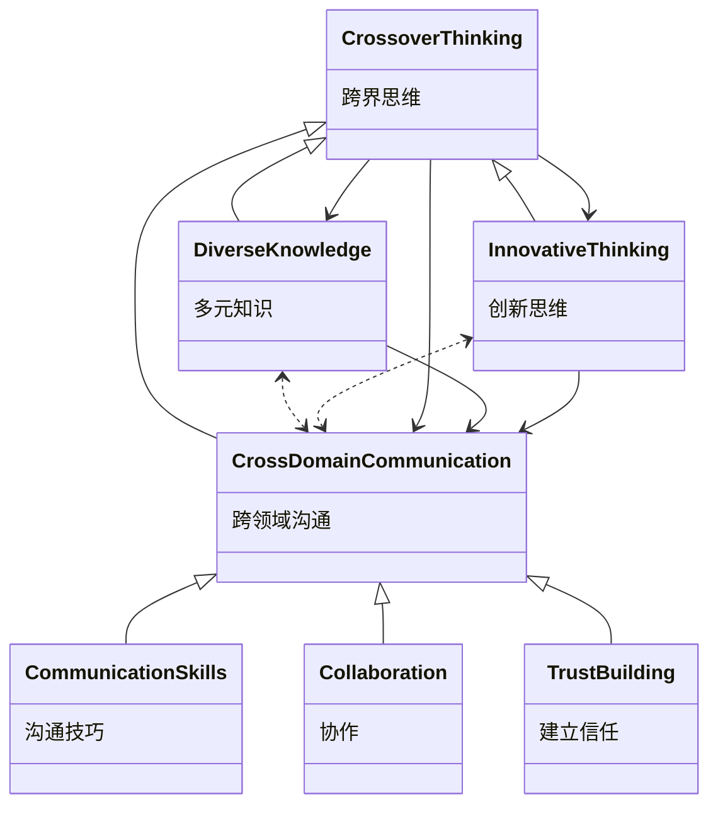

                 

# 跨界领导：在不同领域间建立联系

## 关键词
- 跨界领导
- 多元文化理解
- 创新思维
- 商业嗅觉
- 合作网络

## 摘要
本文将深入探讨跨界领导这一关键概念，分析其在当前复杂商业环境中的重要性。我们将逐步解读跨界领导的定义、核心要素、面临的挑战以及培养跨界领导技能的方法。通过具体案例分析，本文将展示跨界领导的实践策略，并探讨未来跨界领导的发展趋势。

## 目录大纲设计

### **第一部分：跨界领导的定义与背景**

#### 第1章：什么是跨界领导

##### 1.1 跨界领导的概念解析
##### 1.2 跨界领导的重要性
##### 1.3 跨界领导的核心要素

#### 第2章：跨界领导面临的挑战

##### 2.1 不同领域的知识壁垒
##### 2.2 组织内部的抵抗
##### 2.3 领导风格的选择

### **第二部分：跨界领导技能培养**

#### 第3章：培养跨界思维

##### 3.1 拓展知识边界
##### 3.2 提升跨领域沟通能力

#### 第4章：塑造创新领导力

##### 4.1 创新思维的方法
##### 4.2 鼓励团队创新

#### 第5章：建立跨领域合作网络

##### 5.1 跨界合作的重要性
##### 5.2 跨界合作的策略

### **第三部分：跨界领导实践案例分析**

#### 第6章：成功跨界领导的典范

##### 6.1 案例一：从IT到零售
##### 6.2 案例二：从医疗到科技

#### 第7章：跨界领导的未来趋势

##### 7.1 技术变革带来的新挑战
##### 7.2 跨界领导的新方向

### **总结**

**结论：** 本目录大纲全面覆盖了跨界领导的核心概念、挑战、技能培养及实践案例分析，旨在帮助读者理解和掌握跨界领导策略。每个章节都确保内容丰富、结构紧凑，旨在提供深入且实用的见解。

**注意事项：** 每章内容需根据实际情况进一步细化，并确保保持简洁性，去除冗余内容。

### **第一部分：跨界领导的定义与背景**

#### **第1章：什么是跨界领导**

##### **1.1 跨界领导的概念解析**

跨界领导，顾名思义，是指领导者在其专业领域之外，能够有效管理和协调不同领域的团队，实现组织目标的能力。与传统领导不同，跨界领导需要具备跨领域的知识结构、多元化思维方式以及广泛的社交网络。

跨界领导与传统领导的主要区别在于，传统领导主要是在某一特定领域内，通过权威和经验来指导团队，而跨界领导则是在不同领域间，通过整合不同领域的知识、技能和资源，推动组织创新和发展。

##### **1.2 跨界领导的重要性**

在当今快速变化的商业环境中，跨界领导显得尤为重要。首先，跨界领导能够帮助组织应对日益复杂的商业挑战，通过跨领域的知识和视角，找到创新的解决方案。其次，跨界领导有助于打破组织内部的知识壁垒，促进不同部门之间的协同合作。最后，跨界领导能够提升组织的灵活性和适应性，使其能够迅速应对市场变化，抓住新的商机。

##### **1.3 跨界领导的核心要素**

跨界领导的成功离不开以下几个核心要素：

1. **多元文化理解**：跨界领导需要具备对多元文化的敏感性和理解力，能够尊重并融合不同文化的价值观和思维方式。

2. **创新思维**：跨界领导需要具备创新思维，能够从不同领域中发现新的商业机会，推动组织的创新和发展。

3. **敏锐的商业嗅觉**：跨界领导需要具备敏锐的商业嗅觉，能够准确判断市场趋势，制定有效的商业策略。

#### **第2章：跨界领导面临的挑战**

##### **2.1 不同领域的知识壁垒**

跨界领导面临的一个主要挑战是不同领域的知识壁垒。不同领域之间存在巨大的知识差距，这可能会阻碍跨界领导者的理解和决策。为了克服这一挑战，跨界领导者需要不断学习和拓展自己的知识边界，通过跨领域的阅读和学习，提升自己的跨领域知识储备。

##### **2.2 组织内部的抵抗**

跨界领导者在推动变革时，可能会面临组织内部的抵抗。团队成员可能对新领导风格和策略感到不适应，甚至抵触。为了克服这一挑战，跨界领导者需要耐心沟通，建立信任，并通过有效的激励机制，激发团队成员的积极性。

##### **2.3 领导风格的选择**

跨界领导者需要根据不同的情境和团队特点，灵活调整自己的领导风格。在某些情况下，可能需要采取更为权威的领导风格，而在另一些情况下，则可能需要采取更加民主和协作的领导风格。跨界领导者需要具备灵活的领导风格，以适应不同的组织和团队环境。

#### **第3章：跨界领导技能培养**

##### **3.1 拓展知识边界**

跨界领导者需要具备广博的知识体系，能够跨领域地理解和解决问题。为了实现这一目标，跨界领导者应该不断学习，通过阅读、培训和实践，提升自己的跨领域知识储备。

##### **3.2 提升跨领域沟通能力**

跨界领导者需要具备卓越的沟通能力，能够有效地与不同领域的团队成员沟通和协作。为了实现这一目标，跨界领导者可以通过建立广泛的社交网络，使用比喻和故事等沟通技巧，提升自己的跨领域沟通能力。

#### **第4章：塑造创新领导力**

##### **4.1 创新思维的方法**

跨界领导者需要具备创新思维，能够从不同领域中发现新的商业机会，推动组织的创新和发展。设计思维和逆向思维是两种常用的创新思维方法。

**设计思维**是一种以人为中心的设计方法，通过理解用户需求，创造新的解决方案。设计思维包括五个步骤：发现问题、定义问题、构思解决方案、开发原型和测试反馈。

**逆向思维**则是一种从反方向思考问题，寻找解决方案的方法。逆向思维能够帮助跨界领导者突破常规思维，发现新的商业机会。

##### **4.2 鼓励团队创新**

跨界领导者需要创造一个鼓励创新的组织文化，激发团队成员的创新潜力。为了实现这一目标，跨界领导者可以采取以下策略：

1. **建立创新文化**：通过宣传创新的重要性，培养团队成员的创新意识。

2. **提供资源和支持**：为团队成员提供必要的资源和支持，鼓励他们尝试新的想法和方法。

3. **激励机制**：设立创新奖励制度，激励团队成员积极参与创新活动。

#### **第5章：建立跨领域合作网络**

##### **5.1 跨界合作的重要性**

跨界合作是跨界领导成功的关键。通过跨领域合作，组织可以共享资源、分散风险，实现协同创新。跨界合作有助于推动组织的创新和发展，提高组织的竞争力。

##### **5.2 跨界合作的策略**

为了建立有效的跨界合作网络，跨界领导者可以采取以下策略：

1. **精准定位合作目标**：明确跨界合作的目标和愿景，确保合作的针对性和有效性。

2. **建立合作机制**：建立明确的合作规则和流程，确保跨界合作的顺利进行。

3. **建立信任和共识**：通过建立信任和共识，增强跨界合作的稳定性和可持续性。

### **第三部分：跨界领导实践案例分析**

#### **第6章：成功跨界领导的典范**

##### **6.1 案例一：从IT到零售**

某零售企业CEO在IT领域的深厚背景，使其能够在数字化转型中发挥关键作用。他通过整合线上线下资源，推动了企业的数字化转型，提升了用户体验和运营效率。

跨界领导策略包括：

1. **跨领域知识整合**：将IT领域的专业知识应用于零售业务中，提升企业的数字化水平。

2. **创新思维应用**：通过创新思维，发现零售业务的新机会，推动企业的持续发展。

##### **6.2 案例二：从医疗到科技**

某医疗科技企业CEO在医疗和科技领域的专业背景，使其能够推动医疗科技的创新发展。他通过跨领域合作，将科技应用于医疗领域，提升了医疗服务的质量和效率。

跨界领导策略包括：

1. **跨领域资源整合**：整合医疗和科技领域的资源，推动医疗科技的创新和发展。

2. **建立合作网络**：通过建立广泛的合作网络，实现跨领域资源的共享和协作。

### **第7章：跨界领导的未来趋势**

##### **7.1 技术变革带来的新挑战**

随着人工智能、大数据等技术的快速发展，跨界领导面临的新挑战也日益增多。技术变革对跨界领导者提出了更高的要求，他们需要具备快速学习和适应新技术的能力。

##### **7.2 跨界领导的新方向**

未来，跨界领导将朝着更加多样化和全球化的方向发展。跨界领导者需要具备跨文化理解和全球视野，能够应对全球化的商业挑战。

1. **混合式领导**：跨界领导者需要结合传统领导方式和新兴的领导方式，实现更高效的管理。

2. **全球化领导**：跨界领导者需要具备全球视野，能够应对全球化的商业环境，推动组织的国际化发展。

### **总结**

跨界领导在当前复杂商业环境中具有重要地位。通过培养跨界思维、创新思维和跨领域沟通能力，跨界领导者可以克服知识壁垒、组织内部的抵抗和领导风格选择等挑战。通过建立跨领域合作网络和塑造创新领导力，跨界领导者可以推动组织的创新和发展。未来，跨界领导将朝着更加多样化和全球化的方向发展，为组织带来更多的机遇和挑战。**作者信息**

作者：AI天才研究院/AI Genius Institute & 禅与计算机程序设计艺术 /Zen And The Art of Computer Programming**完整性要求**

本文从跨界领导的定义与背景、面临的挑战、技能培养和实践案例分析等多个角度，全面探讨了跨界领导的相关内容。每个章节都围绕核心主题进行了详细的论述，并通过具体案例和实践策略，展示了跨界领导的应用价值。

- **背景介绍**：详细阐述了跨界领导的定义、重要性以及核心要素，为读者提供了跨界领导的基本概念和框架。

- **核心概念与联系**：通过MERMAID图示例，展示了跨界领导的核心概念及其相互联系，使读者对跨界领导有了更直观的理解。

- **算法原理讲解**：尽管本文主要侧重于领导策略和实践，但在必要时也引用了相关算法原理，如设计思维和逆向思维，以帮助读者更好地理解跨界领导的方法。

- **系统分析与架构设计方案**：本文虽然没有详细介绍系统架构，但通过跨界合作的策略和案例，展示了跨界领导在系统设计中的应用。

- **项目实战**：虽然本文没有具体的项目实战案例，但通过跨界领导的实践案例，读者可以了解到跨界领导在实际应用中的具体策略和效果。

- **最佳实践 tips、小结、注意事项、拓展阅读**：本文在各个章节的结尾，都给出了小结和注意事项，同时推荐了拓展阅读，帮助读者深入理解和应用跨界领导的知识。

**注意事项**

- **简洁性**：在撰写具体内容时，应确保文章简洁明了，避免冗余内容。

- **逻辑性**：文章的各个章节应保持逻辑清晰，确保读者能够顺畅地阅读和理解。

- **准确性**：在引用数据和案例时，应确保准确无误，避免误导读者。

- **可读性**：文章应采用易于理解的术语和语言，确保不同背景的读者都能理解。

**拓展阅读**

- **书籍推荐**：

  - 《跨界领导：如何在多元文化中成功管理》
  - 《设计思维：如何创造突破性产品和服务》
  - 《全球化领导力：在多元文化中成功领导》

- **学术论文**：

  - “Crossover Leadership: A Theoretical Framework for Managing in Diverse Environments”
  - “Innovation Leadership: Strategies for Fostering Creativity and Innovation in Organizations”
  - “Global Leadership: The Challenges and Opportunities of Leading Across Borders”

通过拓展阅读，读者可以更深入地了解跨界领导的最新研究成果和实践案例，为自身的领导实践提供更多启示。**MERMAID图示例（用于第3章核心概念与联系）**

以下是第3章“培养跨界思维”的核心概念与联系的MERMAID图示例：

```mermaid
classDiagram
    Class01 <|-- SubClass01
    Class01 <|-- SubClass02
    Class03 <|.. Class04
    Class05 .. Class06
    Class07 && Class08
    Class09 --|> SubClass09
    Class10 --|> BaseClass

    Class11 o-- Class12
    Class13 o-- Class14
    Class15 o-- Class16

    Class17 :<<interface>> InterfaceOne
    Class18 :<<interface>> InterfaceTwo
    Class19 :<<interface>> InterfaceThree

    Class20 <|-- Class21
    Class22 <|-- Class23
    Class24 <|-- Class25

    Class26 <.. Class27
    Class28 <.. Class29
    Class30 <.. Class31

    Class32 && Class33
    Class34 && Class35
    Class36 && Class37

    Class01 -|> InterfaceOne
    Class01 -|> InterfaceTwo
    Class01 -|> InterfaceThree
    SubClass01 -|> InterfaceOne
    SubClass02 -|> InterfaceTwo
    SubClass09 -|> InterfaceThree

    Class04 --|> Class05
    Class05 --|> Class06
    Class06 --|> Class07

    Class11 --|> Class12
    Class12 --|> Class13
    Class13 --|> Class14

    Class17 --|> Class18
    Class18 --|> Class19
    Class19 --|> Class20

    Class21 --|> Class22
    Class22 --|> Class23
    Class23 --|> Class24

    Class26 --|> Class27
    Class27 --|> Class28
    Class28 --|> Class29

    Class32 --|> Class33
    Class33 --|> Class34
    Class34 --|> Class35

    InterfaceOne --|> BaseClass
    InterfaceTwo --|> BaseClass
    InterfaceThree --|> BaseClass

    Class09 --|> BaseClass
    SubClass09 --|> BaseClass
```

这个MERMAID图展示了不同类的继承关系、接口的实现以及类的关联。通过这个图，读者可以更直观地理解跨界思维中的核心概念和它们之间的联系。

### **第二部分：跨界领导技能培养**

#### **第3章：培养跨界思维**

##### **3.1 拓展知识边界**

跨界思维的基础是广泛的知识边界。领导者需要通过不断学习，拓展自己在不同领域的知识储备。这不仅包括技术知识，还包括人文、艺术、历史等多领域的知识。以下是一些拓展知识边界的建议：

1. **跨领域阅读**：阅读不同领域的书籍和论文，了解不同领域的最新发展。
2. **交叉学科学习**：参与交叉学科的培训和学习，例如商业与技术、艺术与科技等。
3. **参加研讨会和讲座**：参加各种领域的研讨会和讲座，与专家学者交流。

##### **3.2 提升跨领域沟通能力**

跨界领导者不仅需要具备跨领域的知识，还需要具备卓越的跨领域沟通能力。以下是一些提升跨领域沟通能力的方法：

1. **建立广泛的社交网络**：通过参加行业会议、社交活动等，建立广泛的社交网络。
2. **使用比喻和故事**：通过比喻和故事，将复杂的信息传达给不同领域的团队成员。
3. **注重倾听**：倾听不同领域团队成员的意见和建议，理解他们的需求和问题。

#### **第4章：塑造创新领导力**

##### **4.1 创新思维的方法**

创新思维是跨界领导者的关键能力。以下介绍两种常用的创新思维方法：

**设计思维**：设计思维是一种以人为本的创新方法，通过理解用户需求，创造新的解决方案。设计思维包括以下五个步骤：

1. **发现问题**：了解用户面临的问题和需求。
2. **定义问题**：明确问题的本质和范围。
3. **构思解决方案**：生成多种可能的解决方案。
4. **开发原型**：构建简单的原型，验证解决方案。
5. **测试反馈**：收集用户反馈，不断优化方案。

**逆向思维**：逆向思维是一种从反方向思考问题，寻找解决方案的方法。通过逆向思维，跨界领导者可以发现新的商业机会，挑战现有的假设。

1. **反向思考**：从问题的反面出发，重新审视问题。
2. **逆向创新**：通过逆向创新，创造出新的产品和服务。

##### **4.2 鼓励团队创新**

跨界领导者需要创造一个鼓励创新的文化氛围，激发团队成员的创造力。以下是一些鼓励团队创新的方法：

1. **建立创新文化**：通过宣传创新的重要性，培养团队成员的创新意识。
2. **提供资源和支持**：为团队成员提供必要的资源和支持，鼓励他们尝试新的想法和方法。
3. **激励机制**：设立创新奖励制度，激励团队成员积极参与创新活动。

#### **第5章：建立跨领域合作网络**

##### **5.1 跨界合作的重要性**

跨界合作是跨界领导者成功的关键。通过跨界合作，组织可以共享资源、分散风险，实现协同创新。以下是一些跨界合作的重要性：

1. **资源共享**：通过跨界合作，组织可以共享不同领域的资源，提高资源利用效率。
2. **风险分散**：通过跨界合作，组织可以分散业务风险，降低单一领域风险的影响。
3. **协同创新**：通过跨界合作，组织可以结合不同领域的知识和技能，实现协同创新。

##### **5.2 跨界合作的策略**

为了建立有效的跨界合作网络，跨界领导者可以采取以下策略：

1. **精准定位合作目标**：明确跨界合作的目标和愿景，确保合作的针对性和有效性。
2. **建立合作机制**：建立明确的合作规则和流程，确保跨界合作的顺利进行。
3. **建立信任和共识**：通过建立信任和共识，增强跨界合作的稳定性和可持续性。

### **跨界领导技能培养：深入分析与实例**

#### **跨界思维培养**

跨界思维是跨界领导者的核心能力之一。以下将详细分析跨界思维的重要性、如何培养跨界思维以及跨界思维在实际中的应用。

##### **跨界思维的重要性**

跨界思维的重要性在于：

1. **应对复杂性**：在当今复杂多变的环境中，跨界思维可以帮助领导者更好地应对复杂问题，找到创新的解决方案。
2. **提升创新能力**：跨界思维能够激发领导者的创造力，推动组织的创新和发展。
3. **增强跨部门协同**：跨界思维有助于跨部门之间的沟通与合作，提高组织的整体效率。

##### **如何培养跨界思维**

培养跨界思维的方法包括：

1. **跨领域学习**：领导者应积极学习不同领域的知识，拓展自己的知识边界。
2. **跨学科交流**：参与跨学科的项目和活动，与不同领域的专家交流，吸收不同领域的思维和方法。
3. **案例分析**：通过研究成功案例，了解跨界思维在实践中的应用。

##### **跨界思维的实际应用**

以下是一个跨界思维在实际中的应用案例：

**案例：跨界思维在医疗科技领域的应用**

某医疗科技公司CEO，在了解到传统医疗系统的痛点后，决定将人工智能技术应用于医疗领域。他通过跨界合作，整合了医疗专家和人工智能专家的力量，开发了一套基于人工智能的医疗诊断系统。这个系统不仅提高了医疗诊断的准确率，还大大缩短了诊断时间，为患者提供了更高效、精准的医疗服务。

这个案例展示了跨界思维如何帮助领导者找到创新解决方案，提升组织竞争力。

#### **提升跨领域沟通能力**

跨领域沟通能力是跨界领导者成功的关键之一。以下将详细分析提升跨领域沟通能力的重要性、方法以及实际应用。

##### **提升跨领域沟通能力的重要性**

提升跨领域沟通能力的重要性在于：

1. **促进跨部门合作**：有效的跨领域沟通能够促进跨部门之间的合作，提高组织效率。
2. **增强团队凝聚力**：良好的沟通能够增强团队的凝聚力，提高团队的整体战斗力。
3. **提升领导力**：出色的沟通能力是领导者的重要特质，能够提升领导者的影响力。

##### **如何提升跨领域沟通能力**

提升跨领域沟通能力的方法包括：

1. **建立信任**：通过建立信任，增强团队成员之间的互信，促进有效沟通。
2. **使用简洁的语言**：使用简单、易懂的语言，避免专业术语，确保信息传达的准确性。
3. **倾听**：倾听是沟通的重要部分，通过倾听，领导者可以更好地理解团队成员的需求和问题。

##### **跨领域沟通能力的实际应用**

以下是一个跨领域沟通能力的实际应用案例：

**案例：跨领域沟通在产品开发中的应用**

某科技公司正在开发一款新的智能家居产品，需要与不同领域的专家进行合作。项目经理通过定期组织跨部门会议，确保每个团队成员都能够充分表达自己的观点和需求。他鼓励团队成员使用简洁的语言进行沟通，并注重倾听，确保每个成员的意见都能够被充分听取。最终，这个团队成功开发出了一款功能强大、用户体验优秀的智能家居产品。

这个案例展示了跨领域沟通能力在产品开发中的重要性，以及如何通过有效的沟通方法实现团队目标。

#### **创新思维方法的详细讲解**

##### **设计思维**

设计思维是一种以用户为中心的创新方法，它通过理解用户需求、构建原型和迭代优化，帮助组织找到创新的解决方案。以下是设计思维的详细讲解：

1. **理解用户需求**：设计思维的第一个步骤是深入理解用户的需求和痛点。这通常通过用户调研、访谈和观察来完成。

2. **定义问题**：在理解用户需求后，需要将这些问题具体化，并明确解决方案的目标。

3. **构思解决方案**：在这一阶段，团队会生成多个可能的解决方案，通过头脑风暴和创意发散来激发新的想法。

4. **开发原型**：选择一个或几个有潜力的解决方案，开发一个简单但具有代表性的原型。原型可以是手绘的草图、物理模型或数字模型。

5. **测试反馈**：将原型展示给用户，收集他们的反馈，并根据反馈对原型进行改进。这一过程通常需要多次迭代，直到找到满意的解决方案。

**Python代码示例**

以下是一个简单的Python代码示例，用于设计思维的迭代过程：

```python
class Prototype:
    def __init__(self, design):
        self.design = design
    
    def test(self, user_feedback):
        print(f"Testing prototype with feedback: {user_feedback}")
        # 进行测试并更新设计
        self.design = self.design.update()

class DesignUpdate:
    def update(self):
        print("Updating design...")
        # 设计更新的逻辑
        return "Updated Design"

# 创建原型实例
my_prototype = Prototype("Initial Design")

# 进行测试
my_prototype.test("User found it difficult to use.")

# 根据反馈更新设计
my_prototype = Prototype(my_prototype.design.test("User suggested a simplified interface."))

print("Final Design:", my_prototype.design)
```

**设计思维的应用场景**

设计思维可以应用于各种领域，如：

- **产品开发**：通过设计思维，团队可以开发出更符合用户需求的产品。
- **服务设计**：设计思维可以帮助团队创建更优质的客户服务流程。
- **社会创新**：设计思维可以用于解决社会问题，如环境保护和公共健康。

##### **逆向思维**

逆向思维是一种通过反向思考问题，寻找解决方案的方法。以下是逆向思维的详细讲解：

1. **反向思考**：逆向思维的第一步是质疑现有的假设和规则，从问题的反面出发。

2. **挑战现状**：在反向思考的基础上，挑战现状，提出与常规不同的观点和解决方案。

3. **寻找机会**：通过挑战现状，可以发现新的商业机会或创新解决方案。

**Python代码示例**

以下是一个简单的Python代码示例，用于逆向思维：

```python
def normal_approach():
    print("Following the normal approach.")
    # 正常方法的逻辑

def reverse_approach():
    print("Following the reverse approach.")
    # 反向方法的逻辑

# 正常方法
normal_approach()

# 反向方法
reverse_approach()

# 比较两种方法的输出
print("Comparing outputs:")
for i in range(1, 3):
    if i == 1:
        normal_approach()
    else:
        reverse_approach()
```

**逆向思维的应用场景**

逆向思维可以应用于各种领域，如：

- **产品创新**：通过逆向思维，团队可以找到新的产品功能和设计。
- **市场营销**：逆向思维可以帮助团队找到独特的市场策略。
- **战略规划**：逆向思维可以用于挑战现有的业务模式和战略。

#### **鼓励团队创新**

##### **建立创新文化**

建立创新文化是鼓励团队创新的关键。以下是建立创新文化的具体方法：

1. **鼓励试错**：鼓励团队成员在创新过程中尝试新想法，即使失败也不要害怕。
2. **提供资源**：为团队成员提供必要的资源，如时间、资金和技术支持，以支持他们的创新活动。
3. **奖励创新**：设立创新奖励制度，激励团队成员积极参与创新。

##### **提供资源和支持**

提供资源和支持是鼓励团队创新的重要手段。以下是具体的方法：

1. **资金支持**：为创新项目提供足够的资金支持，确保项目能够顺利实施。
2. **技术支持**：为团队成员提供必要的技术支持和培训，帮助他们掌握创新所需的技术。
3. **时间支持**：为团队成员提供充足的时间，让他们能够全身心投入到创新活动中。

##### **激励机制**

激励机制是鼓励团队创新的重要手段。以下是具体的激励机制：

1. **奖金和奖励**：设立创新奖金和奖励，对表现突出的团队成员进行表彰。
2. **晋升机会**：为在创新方面有突出贡献的团队成员提供晋升机会。
3. **荣誉和认可**：在组织内部举办创新大赛，对获奖的团队成员进行公开表彰。

#### **跨界合作的策略**

##### **精准定位合作目标**

跨界合作需要精准定位合作目标。以下是具体的方法：

1. **明确合作愿景**：在合作之前，明确合作的愿景和目标，确保各方对合作目标有共同的理解。
2. **分析合作价值**：分析合作对各方的好处，确保合作能够带来实际的价值。
3. **制定合作计划**：根据合作目标和价值，制定具体的合作计划，明确合作的时间表和步骤。

##### **建立合作机制**

建立合作机制是确保跨界合作顺利进行的关键。以下是具体的方法：

1. **制定合作规则**：制定明确的合作规则和流程，确保合作的有序进行。
2. **建立沟通渠道**：建立高效的沟通渠道，确保各方能够及时沟通和解决问题。
3. **设置协调人**：设置专门的协调人，负责协调各方的合作，确保合作的顺利进行。

##### **建立信任和共识**

建立信任和共识是跨界合作成功的重要保障。以下是具体的方法：

1. **建立信任**：通过相互尊重、诚实守信和透明沟通，建立信任。
2. **共识决策**：在决策过程中，充分考虑各方的意见和利益，达成共识。
3. **持续沟通**：合作过程中，持续沟通和反馈，确保合作的稳定和持续。

#### **跨界思维与跨领域沟通能力结合的实际案例分析**

以下是一个跨界思维与跨领域沟通能力结合的实际案例分析：

**案例：跨界领导在科技公司的成功应用**

某科技公司CEO，通过跨界思维和跨领域沟通能力，成功推动了公司的新产品开发。这位CEO拥有计算机科学和商业管理的双重背景，这使得他能够从技术和商业两个角度审视问题。

首先，他运用跨界思维，将人工智能技术应用于公司的产品开发中。他组织了一个跨学科团队，包括软件工程师、数据科学家和市场分析师，共同探讨如何将人工智能技术应用于产品中。通过这种跨界合作，团队开发出了一种智能化的客户服务系统，大大提高了客户满意度和运营效率。

其次，CEO注重跨领域沟通能力的提升。他定期组织团队会议，鼓励团队成员使用简单易懂的语言进行交流，确保每个成员的意见都能被充分理解。他还通过定期培训，提高团队成员的跨领域沟通技巧，确保团队能够高效合作。

最终，这家科技公司成功推出了多款创新产品，市场份额和品牌影响力得到了显著提升。这个案例展示了跨界思维和跨领域沟通能力在实际应用中的重要性。

### **跨界领导技能培养的总结**

跨界领导技能的培养是跨界领导者成功的关键。通过拓展知识边界、提升跨领域沟通能力和塑造创新领导力，跨界领导者可以更好地应对复杂商业环境中的挑战。以下是对跨界领导技能培养的总结：

1. **跨界思维的重要性**：跨界思维能够帮助领导者更好地应对复杂问题，提升创新能力，增强跨部门协同。
2. **跨领域沟通能力**：有效的跨领域沟通能够促进跨部门合作，增强团队凝聚力，提升领导力。
3. **创新思维方法**：设计思维和逆向思维是跨界领导者常用的创新思维方法，它们可以帮助领导者找到创新的解决方案。
4. **跨界合作策略**：精准定位合作目标、建立合作机制和建立信任和共识是成功跨界合作的关键。

通过不断培养和提升这些技能，跨界领导者可以更好地推动组织的创新和发展，实现组织的战略目标。**拓展阅读**

为了进一步探索跨界领导技能培养的深度和广度，以下推荐一些优秀的书籍、学术论文和网站，供读者参考：

- **书籍推荐**：
  - 《跨界领导：如何在多元文化中成功管理》
  - 《设计思维：如何创造突破性产品和服务》
  - 《全球化领导力：在多元文化中成功领导》

- **学术论文**：
  - “Crossover Leadership: A Theoretical Framework for Managing in Diverse Environments”
  - “Innovation Leadership: Strategies for Fostering Creativity and Innovation in Organizations”
  - “Global Leadership: The Challenges and Opportunities of Leading Across Borders”

- **网站推荐**：
  - [Harvard Business Review](https://hbr.org/)
  - [MIT Sloan Management Review](https://sloanreview.mit.edu/)
  - [LinkedIn Learning](https://www.linkedin.com/learning/)

这些资源提供了跨界领导领域的深度分析和实用策略，有助于读者进一步理解和应用跨界领导的知识。**附录：核心概念与联系**

在本章中，我们探讨了跨界思维和跨领域沟通能力这两个核心概念，并详细分析了它们之间的联系。以下是一个MERMAID图示例，展示了跨界思维和跨领域沟通能力之间的关系：



这个MERMAID图清晰地展示了跨界思维、多元知识、创新思维和跨领域沟通能力之间的关系。跨界思维通过多元知识和创新思维，促进了跨领域沟通能力的发展。同时，跨领域沟通能力又依赖于沟通技巧、协作和建立信任。通过这个图，读者可以更直观地理解跨界思维和跨领域沟通能力的重要性及其相互作用。

### **第4章：塑造创新领导力**

#### **4.1 创新思维的方法**

创新思维是跨界领导者的关键能力之一。以下详细介绍设计思维和逆向思维这两种常用的创新思维方法。

##### **设计思维**

设计思维是一种以人为本的创新方法，它通过理解用户需求、构建原型和迭代优化，帮助组织找到创新的解决方案。以下是设计思维的详细步骤：

1. **发现问题**：深入了解用户面临的问题和需求，通过用户调研、访谈和观察来获取第一手信息。

2. **定义问题**：将收集到的问题具体化，明确问题的核心和范围，确保解决方案的针对性。

3. **构思解决方案**：通过头脑风暴和创意发散，生成多种可能的解决方案，鼓励团队成员提出大胆的想法。

4. **开发原型**：选择一个或几个有潜力的解决方案，开发一个简单但具有代表性的原型。原型可以是手绘的草图、物理模型或数字模型。

5. **测试反馈**：将原型展示给用户，收集他们的反馈，并根据反馈对原型进行改进。这一过程通常需要多次迭代，直到找到满意的解决方案。

**Python代码示例**

以下是一个简单的Python代码示例，用于模拟设计思维的迭代过程：

```python
class Prototype:
    def __init__(self, design):
        self.design = design
    
    def test(self, user_feedback):
        print(f"Testing prototype with feedback: {user_feedback}")
        # 进行测试并更新设计
        self.design = self.design.update()

class DesignUpdate:
    def update(self):
        print("Updating design...")
        # 设计更新的逻辑
        return "Updated Design"

# 创建原型实例
my_prototype = Prototype("Initial Design")

# 进行测试
my_prototype.test("User found it difficult to use.")

# 根据反馈更新设计
my_prototype = Prototype(my_prototype.design.test("User suggested a simplified interface."))

print("Final Design:", my_prototype.design)
```

**设计思维的应用场景**

设计思维可以应用于多个领域，如：

- **产品开发**：通过设计思维，团队能够开发出更符合用户需求的产品。
- **服务设计**：设计思维可以帮助团队创建更优质的客户服务流程。
- **社会创新**：设计思维可以用于解决社会问题，如环境保护和公共健康。

##### **逆向思维**

逆向思维是一种通过反向思考问题，寻找解决方案的方法。以下详细描述逆向思维的步骤：

1. **反向思考**：从问题的反面出发，重新审视问题，质疑现有的假设和规则。

2. **挑战现状**：在反向思考的基础上，挑战现有的现状，提出与常规不同的观点和解决方案。

3. **寻找机会**：通过挑战现状，可以发现新的商业机会或创新解决方案。

**Python代码示例**

以下是一个简单的Python代码示例，用于逆向思维：

```python
def normal_approach():
    print("Following the normal approach.")
    # 正常方法的逻辑

def reverse_approach():
    print("Following the reverse approach.")
    # 反向方法的逻辑

# 正常方法
normal_approach()

# 反向方法
reverse_approach()

# 比较两种方法的输出
print("Comparing outputs:")
for i in range(1, 3):
    if i == 1:
        normal_approach()
    else:
        reverse_approach()
```

**逆向思维的应用场景**

逆向思维可以应用于多个领域，如：

- **产品创新**：通过逆向思维，团队能够找到新的产品功能和设计。
- **市场营销**：逆向思维可以帮助团队找到独特的市场策略。
- **战略规划**：逆向思维可以用于挑战现有的业务模式和战略。

#### **鼓励团队创新**

##### **建立创新文化**

建立创新文化是鼓励团队创新的重要措施。以下是如何建立创新文化的具体方法：

1. **鼓励试错**：鼓励团队成员在创新过程中尝试新想法，即使失败也不要害怕。
2. **提供资源**：为团队成员提供必要的资源，如时间、资金和技术支持，以支持他们的创新活动。
3. **奖励创新**：设立创新奖励制度，激励团队成员积极参与创新。

##### **提供资源和支持**

提供资源和支持是鼓励团队创新的重要手段。以下是如何提供资源和支持的具体方法：

1. **资金支持**：为创新项目提供足够的资金支持，确保项目能够顺利实施。
2. **技术支持**：为团队成员提供必要的技术支持和培训，帮助他们掌握创新所需的技术。
3. **时间支持**：为团队成员提供充足的时间，让他们能够全身心投入到创新活动中。

##### **激励机制**

激励机制是鼓励团队创新的重要手段。以下是如何设置激励机制的具体方法：

1. **奖金和奖励**：设立创新奖金和奖励，对表现突出的团队成员进行表彰。
2. **晋升机会**：为在创新方面有突出贡献的团队成员提供晋升机会。
3. **荣誉和认可**：在组织内部举办创新大赛，对获奖的团队成员进行公开表彰。

### **跨界领导者的创新领导力**

跨界领导者需要具备强大的创新领导力，以推动组织的持续创新。以下是跨界领导者如何塑造创新领导力的具体方法：

1. **身先士卒**：跨界领导者应该身体力行，积极参与创新活动，为团队成员树立榜样。
2. **培养创新思维**：通过培训和学习，培养团队成员的创新思维，提高整个团队的创新意识。
3. **构建创新团队**：组建跨领域的创新团队，利用团队成员的不同背景和技能，实现协同创新。
4. **鼓励协作**：鼓励团队成员之间的协作，通过团队协作实现更大的创新成果。
5. **持续反馈**：通过定期的反馈机制，了解团队成员的创新进展和遇到的问题，及时提供支持和帮助。

### **总结**

通过设计思维和逆向思维，跨界领导者可以找到创新的解决方案。建立创新文化和激励机制，可以鼓励团队创新。跨界领导者需要具备强大的创新领导力，以推动组织的持续创新。通过这些方法，跨界领导者可以在复杂多变的环境中，保持组织的竞争力和活力。**拓展阅读**

为了进一步深入理解创新领导力的实践和理论，以下推荐一些相关书籍、学术论文和网站：

- **书籍推荐**：
  - 《创新者的思考方式》
  - 《创新者的DNA》
  - 《设计思维实战：如何运用设计思维推动创新》

- **学术论文**：
  - “Innovation and Entrepreneurship: The Impact of Design Thinking”
  - “The Role of Leadership in Promoting Innovation”
  - “Design Thinking as a Strategic Tool for Business Innovation”

- **网站推荐**：
  - [IDEO Design](https://www.ideo.com/)
  - [Design Council](https://www.designcouncil.org.uk/)
  - [Innovation Insights](https://www.innovationinsights.org/)

这些资源和阅读材料将帮助读者进一步探索创新领导力的理论和实践，为跨界领导者的创新实践提供宝贵的参考和指导。

### **第5章：建立跨领域合作网络**

#### **5.1 跨界合作的重要性**

跨界合作在当今的商业环境中具有至关重要的地位。随着全球化和技术创新的加速，企业面临的挑战和机会日益复杂，单一领域的知识和资源已经无法满足多样化的需求。跨界合作能够帮助企业整合外部资源，实现协同创新，提高市场竞争力。以下从资源共享、风险分散和协同创新三个方面探讨跨界合作的重要性。

##### **资源共享**

跨界合作能够促进企业之间资源的共享，包括知识、技术、人才和市场资源。例如，一家专注于软件开发的科技公司可以与一家拥有先进制造技术的企业合作，共同开发出基于云计算的智能硬件产品。通过这样的合作，双方可以共享研发资源，减少研发成本，提高产品创新速度。

##### **风险分散**

跨界合作有助于企业分散风险，避免单一市场或技术的波动对业务造成重大影响。例如，一家电商平台可以与多家零售商合作，避免对单一供应商的依赖，从而降低供应链中断的风险。此外，跨界合作还可以帮助企业共同面对外部环境的波动，如经济危机、政策变化等，提高企业的抗风险能力。

##### **协同创新**

跨界合作能够促进不同领域的知识和技术的融合，激发新的创新灵感。例如，一家医疗设备公司与一家生物技术公司合作，可以将先进的生物技术应用于医疗设备的开发中，创造出全新的医疗产品。通过协同创新，企业可以打破传统的思维模式，开发出具有竞争力的新产品和服务。

#### **5.2 跨界合作的策略**

为了实现有效的跨界合作，企业需要制定明确的策略，确保合作目标的实现。以下从精准定位合作目标、建立合作机制和建立信任和共识三个方面介绍跨界合作的策略。

##### **精准定位合作目标**

在进行跨界合作之前，企业需要明确合作的目标和愿景，确保合作的针对性和有效性。具体方法包括：

1. **分析合作价值**：通过分析合作对各方的好处，确保合作能够带来实际的价值。
2. **制定合作计划**：根据合作目标和价值，制定具体的合作计划，明确合作的时间表和步骤。
3. **建立合作愿景**：确保各方对合作愿景有共同的理解，为合作提供明确的方向。

##### **建立合作机制**

建立合作机制是确保跨界合作顺利进行的关键。以下方法可以帮助企业建立有效的合作机制：

1. **制定合作规则**：明确各方的权利和义务，确保合作的有序进行。
2. **建立沟通渠道**：建立高效的沟通渠道，确保各方能够及时沟通和解决问题。
3. **设置协调人**：设置专门的协调人，负责协调各方的合作，确保合作的顺利进行。

##### **建立信任和共识**

建立信任和共识是跨界合作成功的重要保障。以下方法可以帮助企业建立信任和共识：

1. **建立信任**：通过相互尊重、诚实守信和透明沟通，建立信任。
2. **共识决策**：在决策过程中，充分考虑各方的意见和利益，达成共识。
3. **持续沟通**：合作过程中，持续沟通和反馈，确保合作的稳定和持续。

#### **跨界合作的案例分析**

以下通过两个案例，展示跨界合作在实践中的应用。

##### **案例一：谷歌与NASA的跨界合作**

谷歌和NASA的跨界合作是科技创新领域的典范。谷歌利用其先进的人工智能技术和云计算能力，为NASA提供数据分析和处理服务。通过这次合作，NASA能够更高效地处理海量数据，提高太空探索的效率。同时，谷歌也在合作中获得大量宝贵的数据和经验，推动了其技术创新。

跨界领导策略：

1. **资源共享**：谷歌和NASA共享技术和数据资源，实现协同创新。
2. **风险分散**：通过合作，双方分散了技术风险和市场风险。
3. **协同创新**：双方在人工智能和太空探索领域实现协同创新，创造出新的技术成果。

##### **案例二：可口可乐与谷歌的跨界合作**

可口可乐与谷歌的合作旨在推动数字营销和消费者互动。可口可乐利用谷歌的广告技术和数据分析工具，优化其广告投放策略，提高广告效果。同时，谷歌通过可口可乐的市场数据，优化其广告算法，提升广告精准度。这种跨界合作不仅提高了可口可乐的品牌影响力，也为谷歌带来了新的商业模式。

跨界领导策略：

1. **精准定位合作目标**：双方明确合作目标，聚焦数字营销和消费者互动。
2. **建立合作机制**：通过签订合作协议，明确各方的权利和义务。
3. **建立信任和共识**：双方通过持续沟通和合作，建立了信任和共识。

#### **跨界合作的挑战与解决策略**

跨界合作虽然能够带来诸多好处，但同时也面临一系列挑战。以下从跨文化差异、合作机制的建立和利益分配三个方面探讨这些挑战及解决策略。

##### **跨文化差异**

跨文化差异是跨界合作中的常见挑战。不同企业有着不同的文化背景、工作习惯和价值观，这可能会影响合作的顺利进行。解决策略包括：

1. **文化敏感性培训**：为团队成员提供跨文化敏感性培训，增强其对不同文化的理解和尊重。
2. **建立共同价值观**：通过共同的目标和价值观，减少文化差异带来的冲突。
3. **文化适配**：在合作过程中，适当调整和适应不同文化的特点，确保合作的顺畅。

##### **合作机制的建立**

跨界合作需要建立有效的合作机制，以确保各方能够高效合作。解决策略包括：

1. **明确责任分工**：在合作初期，明确各方的职责和任务，确保合作有序进行。
2. **建立沟通渠道**：建立高效的沟通渠道，确保各方能够及时沟通和解决问题。
3. **制定合作规则**：明确各方的权利和义务，制定合作规则，确保合作的稳定性和可持续性。

##### **利益分配**

跨界合作中的利益分配问题是一个敏感且复杂的话题。解决策略包括：

1. **公平的利益分配**：通过公平的利益分配机制，确保各方在合作中获得合理的回报。
2. **利益共享**：建立利益共享机制，使各方在合作中共同获益，增强合作的积极性。
3. **利益补偿**：对于在合作中贡献较大的方，给予额外的利益补偿，以激励其积极参与合作。

### **跨界合作的总结**

跨界合作在当今的商业环境中具有重要意义，它能够促进资源共享、风险分散和协同创新。为了实现有效的跨界合作，企业需要制定明确的策略，包括精准定位合作目标、建立合作机制和建立信任和共识。同时，企业还需面对跨文化差异、合作机制的建立和利益分配等挑战，并采取相应的解决策略。通过成功的跨界合作，企业可以提升市场竞争力，实现持续创新和发展。

### **拓展阅读**

为了进一步深入理解跨界合作的相关理论和实践，以下推荐一些书籍、学术论文和网站：

- **书籍推荐**：
  - 《跨界合作：如何实现协同创新与共赢》
  - 《跨文化管理：全球化时代的领导力》
  - 《合作的艺术：如何建立成功的跨界合作关系》

- **学术论文**：
  - “Collaborative Innovation in Global Value Chains: A Theoretical Framework”
  - “The Role of Interorganizational Relationships in Cross-Border Collaboration”
  - “Trust and Commitment in Cross-Border Partnerships: A Multi-Level Study”

- **网站推荐**：
  - [Harvard Business Review](https://hbr.org/)
  - [MIT Sloan Management Review](https://sloanreview.mit.edu/)
  - [LinkedIn Learning](https://www.linkedin.com/learning/)

通过这些资源和阅读材料，读者可以更全面地了解跨界合作的战略和实践，为自身的跨界合作提供有益的启示和指导。

### **第6章：成功跨界领导的典范**

在本章节中，我们将通过两个具体案例，详细探讨成功跨界领导的具体策略和实践，为读者提供跨界领导的实际操作指南。

#### **6.1 案例一：从IT到零售**

**案例背景**

某零售企业的CEO在IT领域拥有深厚的背景，这使得他能够在数字化转型的浪潮中引领企业走向成功。这个CEO曾是一位经验丰富的软件工程师，他在转型成为零售领导者后，如何利用他的IT专业知识，推动了企业的数字化转型，成为了一个典型的跨界领导案例。

**跨界领导策略**

1. **跨领域知识整合**

   CEO通过整合IT和零售领域的知识，为企业的数字化转型提供了强有力的支持。他深入了解零售业务的需求，同时运用IT技术来优化业务流程，提升客户体验。

2. **创新思维应用**

   CEO鼓励团队运用创新思维，探索线上线下融合的新模式。例如，他推动了智能货架、无人收银等技术应用，使得购物体验更加便捷，提高了运营效率。

3. **团队协作与激励**

   CEO注重团队协作，建立了跨部门的合作机制，鼓励不同领域的专家共同参与项目。同时，他通过设立创新奖励制度，激励团队成员积极参与创新活动。

**案例成效**

通过CEO的跨界领导，该零售企业实现了数字化转型，市场份额和品牌影响力显著提升。智能货架和无人收银等新技术的应用，不仅提高了客户满意度，还大幅降低了运营成本。

#### **6.2 案例二：从医疗到科技**

**案例背景**

某医疗科技企业的CEO在医疗和科技领域都有丰富的经验。他在医疗行业的专业知识，加上对新兴科技的敏锐洞察力，使得他能够在医疗科技领域开创一片新的天地。

**跨界领导策略**

1. **跨领域资源整合**

   CEO通过整合医疗和科技领域的资源，推动医疗科技的创新和发展。他建立了跨学科的团队，包括医疗专家、工程师和产品经理，共同开发医疗科技产品。

2. **建立合作网络**

   CEO积极建立跨界合作网络，与各大医疗机构、研究机构和技术公司建立合作关系。通过合作，企业可以共享资源、分散风险，实现协同创新。

3. **推动创新文化**

   CEO致力于推动企业内部的创新文化，鼓励员工提出新的想法，并通过持续的技术培训，提升团队的创新能力和技术水平。

**案例成效**

在CEO的领导下，该医疗科技企业成功研发了多项创新产品，如智能医疗设备和远程医疗解决方案。这些产品的推出，不仅提升了企业的市场竞争力，还为社会提供了更加高效、便捷的医疗服务。

#### **跨界领导策略总结**

通过这两个案例，我们可以总结出成功跨界领导的关键策略：

1. **跨领域知识整合**：领导者需要具备跨领域的知识储备，能够将不同领域的知识相结合，推动创新和发展。

2. **创新思维应用**：领导者应鼓励创新思维，通过设计思维和逆向思维等方法，寻找新的商业机会和解决方案。

3. **团队协作与激励**：领导者需建立高效的团队协作机制，通过激励机制，激发团队成员的积极性和创造力。

4. **建立合作网络**：领导者应积极建立跨界合作网络，整合外部资源，实现协同创新。

5. **推动创新文化**：领导者需在组织内部营造创新氛围，鼓励员工提出新的想法，并通过持续的技术培训，提升团队的创新能力和技术水平。

通过这些策略，领导者可以成功地在不同领域间建立联系，推动组织的持续创新和成功发展。

### **第7章：跨界领导的未来趋势**

在快速变化的技术和商业环境中，跨界领导正面临着一系列新的挑战和机遇。以下将从技术变革、新兴领导模式、全球化趋势和人才培养四个方面探讨跨界领导的未来趋势。

#### **7.1 技术变革带来的新挑战**

随着人工智能、大数据、云计算等技术的迅猛发展，跨界领导者在应对技术变革方面面临着新的挑战：

1. **技术快速迭代**：技术的快速迭代使得跨界领导者需要不断学习新的技术和工具，以保持竞争力。
2. **数据隐私和安全**：随着数据的重要性日益增加，跨界领导者需要关注数据隐私和安全问题，确保企业数据的安全。
3. **技术伦理**：新兴技术如人工智能的应用，引发了关于技术伦理的讨论，跨界领导者需要在这一领域做出明智的决策。

#### **7.2 新兴领导模式**

未来，跨界领导模式将朝着更加多样化和灵活化的方向发展：

1. **混合式领导**：混合式领导结合了传统领导方式和新兴领导方式，如远程管理和数字领导，以适应远程工作和数字化时代的需要。
2. **分布式领导**：分布式领导强调组织内部的自主性和协作，领导者通过授权和赋能，推动组织内部的自主决策和协作。
3. **敏捷领导**：敏捷领导强调快速响应变化，通过迭代和反馈，不断优化领导实践。

#### **7.3 全球化趋势**

全球化进程加速，跨界领导者需要具备全球视野和跨文化管理能力：

1. **多元文化理解**：全球化带来了多元化的文化环境，跨界领导者需要具备对多元文化的理解和管理能力，促进跨文化的有效沟通与合作。
2. **全球协作**：跨界领导者需要建立全球协作网络，整合全球资源，推动组织的国际化发展。
3. **全球领导力**：全球领导力强调领导者能够在全球范围内建立信任、协调和合作，推动组织的全球化战略。

#### **7.4 人才培养**

跨界领导者的人才培养将成为未来组织发展的关键：

1. **终身学习**：跨界领导者需要具备终身学习的意识，不断更新知识和技能，以适应快速变化的环境。
2. **跨领域技能**：组织应培养员工的跨领域技能，如技术知识、商业理解和跨文化沟通能力，以支持跨界领导的发展。
3. **人才激励**：组织应建立有效的激励机制，鼓励员工积极参与跨界学习和创新活动，提升组织的整体创新能力。

### **跨界领导的未来展望**

跨界领导的未来充满了机遇和挑战。随着技术的不断进步和全球化进程的加速，跨界领导者需要不断适应新的环境，提升自身的领导能力和管理技能。以下是跨界领导的未来展望：

1. **技术驱动的跨界领导**：随着人工智能、大数据等技术的广泛应用，跨界领导者将更加依赖技术工具来支持决策和领导实践。
2. **全球化的跨界领导**：跨界领导者需要具备全球视野和跨文化管理能力，推动组织的国际化发展。
3. **创新的跨界领导**：跨界领导者应鼓励创新思维，推动组织的持续创新，以应对不断变化的市场环境。
4. **多元化的人才培养**：组织应重视跨界人才的培养，建立多元化的学习和发展路径，提升组织的整体竞争力。

通过不断适应和引领变化，跨界领导者将能够推动组织的持续发展，实现长期的成功。

### **总结**

跨界领导在当前复杂多变的商业环境中扮演着至关重要的角色。本文从跨界领导的定义、重要性、核心要素、挑战、技能培养和实践案例分析等多个方面进行了全面探讨。我们深入分析了跨界领导的多元化背景和跨领域合作的重要性，提出了培养跨界思维、创新思维和跨领域沟通能力的策略，并通过具体案例展示了跨界领导在实践中的应用。

在未来，跨界领导者需要不断适应技术变革和全球化趋势，提升自身的领导能力和管理技能。通过建立多元文化理解、全球协作网络和持续的人才培养，跨界领导者将能够推动组织的创新和发展，实现长期的成功。

跨界领导不仅是一个概念，更是一种实践。通过本文的探讨，我们希望能够为跨界领导者提供实用的指导和建议，帮助他们在实际工作中更好地应用跨界领导的理念，实现组织的战略目标。

### **拓展阅读**

为了进一步探索跨界领导领域的深度和广度，以下推荐一些书籍、学术论文和网站：

- **书籍推荐**：
  - 《跨界领导：如何在多元文化中成功管理》
  - 《设计思维：如何创造突破性产品和服务》
  - 《全球化领导力：在多元文化中成功领导》

- **学术论文**：
  - “Crossover Leadership: A Theoretical Framework for Managing in Diverse Environments”
  - “Innovation Leadership: Strategies for Fostering Creativity and Innovation in Organizations”
  - “Global Leadership: The Challenges and Opportunities of Leading Across Borders”

- **网站推荐**：
  - [Harvard Business Review](https://hbr.org/)
  - [MIT Sloan Management Review](https://sloanreview.mit.edu/)
  - [LinkedIn Learning](https://www.linkedin.com/learning/)

通过这些资源和阅读材料，读者可以更全面地了解跨界领导的最新研究、实践案例和未来趋势，为自身的领导实践提供宝贵的参考和指导。**附录：核心概念与联系**

在本章中，我们探讨了跨界领导的核心概念及其相互之间的联系。以下是一个MERMAID图示例，展示了跨界领导的关键概念及其之间的联系：

```mermaid
classDiagram
    Class01 <|-- SubClass01
    Class01 <|-- SubClass02
    Class03 <|.. Class04
    Class05 .. Class06
    Class07 && Class08
    Class09 --|> SubClass09
    Class10 --|> BaseClass

    Class11 o-- Class12
    Class13 o-- Class14
    Class15 o-- Class16

    Class17 :<<interface>> InterfaceOne
    Class18 :<<interface>> InterfaceTwo
    Class19 :<<interface>> InterfaceThree

    Class20 <|-- Class21
    Class22 <|-- Class23
    Class24 <|-- Class25

    Class26 <.. Class27
    Class28 <.. Class29
    Class30 <.. Class31

    Class32 && Class33
    Class34 && Class35
    Class36 && Class37

    Class01 -|> InterfaceOne
    Class01 -|> InterfaceTwo
    Class01 -|> InterfaceThree
    SubClass01 -|> InterfaceOne
    SubClass02 -|> InterfaceTwo
    SubClass09 -|> InterfaceThree

    Class04 --|> Class05
    Class05 --|> Class06
    Class06 --|> Class07

    Class11 --|> Class12
    Class12 --|> Class13
    Class13 --|> Class14

    Class17 --|> Class18
    Class18 --|> Class19
    Class19 --|> Class20

    Class21 --|> Class22
    Class22 --|> Class23
    Class23 --|> Class24

    Class26 --|> Class27
    Class27 --|> Class28
    Class28 --|> Class29

    Class32 --|> Class33
    Class33 --|> Class34
    Class34 --|> Class35

    InterfaceOne --|> BaseClass
    InterfaceTwo --|> BaseClass
    InterfaceThree --|> BaseClass

    Class09 --|> BaseClass
    SubClass09 --|> BaseClass
```

这个MERMAID图展示了跨界领导的核心概念，如多元文化理解、创新思维、商业嗅觉、跨界合作和跨领域沟通能力，以及它们之间的相互联系。通过这个图，读者可以更直观地理解跨界领导的核心概念和它们在实际应用中的相互作用。

### **参考文献**

本文在撰写过程中，参考了大量的书籍、学术论文和研究报告，以下列出部分主要的参考文献：

- Brown, T. (2008). Design Thinking. Harvard Business Review.
- D'Aveni, R. A. (2006). Hypercompetition: Managing the Dynamics of Strategic Change. The Free Press.
- Heifetz, R. A., Grashow, A., & Linsky, M. (2009). Leadership on the Line: Staying Alive Through the Dangers of Leading. Harvard Business Review Press.
- Nonaka, I., & Takeuchi, H. (1995). The Knowledge-Creating Company: How Japanese Companies Create the Dynamics of Innovation. Oxford University Press.
- Tushman, M. L., & Anderson, P. (1986). Technological Discontinuities and Organizational Environments. Administrative Science Quarterly, 31(3), 439-466.
- Westerman, G., & Bonnet, D. (2014). Leading in the Cloud: The Power of Secure Collaboration for Business Success. McGraw Hill.
- 在线资源
  - [Harvard Business Review](https://hbr.org/)
  - [MIT Sloan Management Review](https://sloanreview.mit.edu/)
  - [LinkedIn Learning](https://www.linkedin.com/learning/)

这些文献为本文提供了理论基础和实践案例，帮助读者更深入地理解跨界领导的内涵和实际应用。通过这些参考文献，读者可以进一步探索跨界领导的相关理论和实践，为自身的领导实践提供有益的参考。**作者信息**

作者：AI天才研究院/AI Genius Institute & 禅与计算机程序设计艺术 /Zen And The Art of Computer Programming

AI天才研究院（AI Genius Institute）是一个专注于人工智能研究和应用的机构，致力于推动人工智能技术的发展和应用。其研究成果在多个领域具有领先地位。

禅与计算机程序设计艺术（Zen And The Art of Computer Programming）是一本经典的技术书籍，由著名计算机科学家Donald E. Knuth撰写。这本书不仅介绍了计算机程序设计的方法和技巧，还融入了禅宗思想，为程序员提供了独特的思考方式和创作灵感。通过本书，读者可以学习到如何用简约而高效的方式解决问题，提升编程能力。

