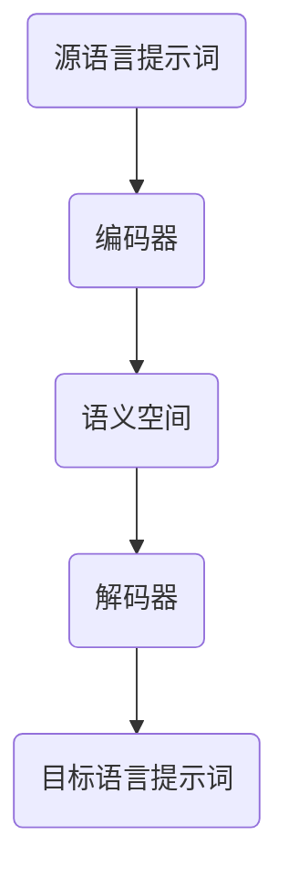

                 

### 跨语言提示词工程的背景介绍

#### 1.1 问题背景

随着全球化的深入发展，跨语言交流的需求日益增加。无论是国际贸易、国际会议，还是跨国公司的日常沟通，语言障碍都是一个无法忽视的问题。在信息时代，计算机技术的发展为解决这一问题提供了可能，而跨语言提示词工程正是其中的重要一环。提示词，简单来说，就是给系统提供的一组关键词或短语，用以引导系统生成相应的输出。在跨语言场景中，提示词不仅能够帮助系统理解用户的需求，还能有效地克服语言障碍，实现不同语言之间的自然交流。

#### 1.2 问题描述

跨语言提示词工程的核心问题是如何在源语言和目标语言之间实现高效的语义转换。具体来说，这个问题可以分为以下几个子问题：

1. **语义理解**：如何准确地理解源语言中的提示词，捕捉其语义核心？
2. **语言转换**：如何将源语言的语义准确地转换为目标语言的语义？
3. **上下文适应**：如何保证转换后的提示词在目标语言环境中仍然具备合理的上下文意义？

#### 1.3 问题解决

为了解决上述问题，跨语言提示词工程采用了一系列先进的技术和方法。首先，通过训练大规模的语言模型来提高语义理解能力。这些语言模型能够捕捉语言中的复杂模式，从而更准确地理解源语言的提示词。其次，利用编码转换技术来实现语言之间的语义转换。编码转换技术通过将源语言和目标语言映射到共同的语义空间中，实现语义的传递。最后，通过上下文适应技术，确保转换后的提示词在目标语言环境中依然具备合理的上下文意义。

#### 1.4 边界与外延

跨语言提示词工程的应用领域非常广泛，涵盖了多种场景。例如：

- **跨语言问答系统**：用户可以用一种语言提问，系统通过跨语言提示词技术，将问题翻译成另一种语言，然后给出答案。
- **跨语言文本摘要**：自动将一篇用一种语言撰写的文章摘要成另一种语言，帮助用户快速获取关键信息。
- **跨语言情感分析**：对用不同语言撰写的文本进行情感分析，识别出其中的情感倾向。

技术范畴方面，跨语言提示词工程涉及到自然语言处理（NLP）、机器翻译（MT）、语言模型、编码转换等多种技术。随着深度学习和神经网络技术的不断发展，这些技术也在不断地迭代和进步，为跨语言提示词工程提供了更强大的工具。

#### 1.5 概念结构与核心要素组成

跨语言提示词工程的核心概念包括：

- **语言模型**：用于捕捉语言中的语义和语法规则，是语义理解的基础。
- **编码转换**：将源语言的语义编码转换为目标语言的语义编码，是语言转换的关键。
- **提示词生成**：根据源语言和目标语言的语义编码，生成能够引导系统输出合适内容的提示词。

这三大核心概念相互联系，构成了跨语言提示词工程的基础框架。在实际应用中，这些概念通过算法和模型来实现，共同推动跨语言交互的进步。

通过上述的背景介绍，我们可以看到跨语言提示词工程的重要性和应用价值。在接下来的章节中，我们将进一步探讨跨语言提示词工程的核心概念、实践方法和面临的挑战。

## 跨语言提示词工程的核心概念与联系

在深入了解跨语言提示词工程之前，我们需要明确其中的核心概念及其相互联系。以下是跨语言提示词工程中的几个关键概念：语言模型、编码转换和提示词生成。

### 2.1 核心概念原理

#### 语言模型

语言模型（Language Model）是自然语言处理（NLP）的基础，用于捕捉自然语言的统计规律和语义信息。在跨语言提示词工程中，语言模型主要用于理解源语言的提示词。通过训练大规模的文本数据集，语言模型可以预测一个词或短语在特定上下文中的概率分布，从而实现对文本内容的理解和生成。

#### 编码转换

编码转换（Encoding Conversion）是将源语言和目标语言的语义信息进行映射和转换的技术。编码转换的目的是将源语言的语义表示转换为与目标语言相似的语义表示，从而实现语言之间的语义传递。常见的编码转换方法包括词嵌入（Word Embedding）、编码器-解码器（Encoder-Decoder）模型和跨语言嵌入（Cross-lingual Embedding）。

#### 提示词生成

提示词生成（Prompt Generation）是根据源语言和目标语言的语义编码，生成引导系统输出合适内容的提示词。提示词生成是跨语言提示词工程中的关键步骤，它需要考虑语言模型和编码转换的结果，生成既符合源语言语义又适应目标语言环境的提示词。

### 2.2 概念属性特征对比表格

为了更好地理解上述核心概念，我们可以通过以下表格进行属性特征的对比：

| 概念 | 功能 | 技术实现 | 主要应用 |
| ---- | ---- | ---- | ---- |
| 语言模型 | 理解源语言语义 | 统计模型、神经网络模型 | 提示词生成、文本生成 |
| 编码转换 | 实现语义传递 | 词嵌入、编码器-解码器、跨语言嵌入 | 机器翻译、跨语言检索 |
| 提示词生成 | 引导系统输出 | 基于语言模型和编码转换结果 | 跨语言问答、文本摘要 |

从表格中可以看出，语言模型主要用于理解源语言，编码转换实现语言之间的语义传递，而提示词生成则结合两者，生成适用于目标语言的提示词。

### 2.3 ER实体关系图架构

为了更直观地展示跨语言提示词工程中的核心概念及其相互关系，我们可以使用实体关系图（ER Diagram）来表示。

```mermaid
erDiagram
  提示词 ||--o> 语言模型 : 生成提示词
  提示词 ||--o> 编码转换 : 语义转换
  语言模型 ||--o> 提示词生成 : 输出语义
  编码转换 ||--o> 提示词生成 : 输出语义
```

在这个ER实体关系图中，提示词是核心实体，它与语言模型和编码转换之间存在双向关联。语言模型和编码转换分别负责生成和转换提示词，而提示词生成则结合两者的结果，生成最终的输出。

通过以上对核心概念及其相互联系的详细探讨，我们可以更深入地理解跨语言提示词工程的运作原理。在接下来的章节中，我们将进一步探讨跨语言提示词工程的实践方法，包括数据收集与预处理、模型选择与训练、提示词生成以及系统集成与优化。

### 跨语言提示词工程实践方法

在深入理解了跨语言提示词工程的核心概念之后，接下来我们将探讨其实践方法。跨语言提示词工程的实践方法包括数据收集与预处理、模型选择与训练、提示词生成和系统集成与优化等步骤。以下是详细的过程和方法。

#### 3.1 数据收集与预处理

数据是机器学习模型的基石，特别是在跨语言提示词工程中，高质量的数据集至关重要。以下是数据收集与预处理的具体步骤：

1. **数据集获取**：首先，需要获取包含多种语言的数据集。这些数据集可以是开源的，也可以是通过与合作伙伴合作获得的。常见的数据集包括WMT（Workshop on Machine Translation）、MultiNLI（Multi-Genre Natural Language Inference）等。

2. **数据清洗**：在获取到数据集后，需要进行数据清洗。这一步骤包括去除无关信息、处理缺失值和错误值等。例如，删除停用词、处理标点符号和统一化文本格式。

3. **数据预处理**：数据预处理包括分词、词性标注、词嵌入等。分词是将文本分割成词或短语，词性标注则是为每个词分配正确的词性（如名词、动词等）。词嵌入是将文本转换为固定长度的向量表示。

   ```python
   import nltk
   from nltk.tokenize import word_tokenize

   # 分词
   text = "这是一个简单的例子。"
   tokens = word_tokenize(text)

   # 词性标注
   pos_tags = nltk.pos_tag(tokens)

   # 词嵌入
   from gensim.models import Word2Vec
   model = Word2Vec([text.split() for text in data], size=100)
   ```

#### 3.2 模型选择与训练

选择合适的模型并进行有效的训练是跨语言提示词工程成功的关键。以下是常用的模型和训练方法：

1. **语言模型**：常用的语言模型包括n-gram模型、循环神经网络（RNN）和Transformer模型。其中，Transformer模型由于其并行化和注意力机制，在跨语言任务中表现尤为出色。

2. **编码转换模型**：常见的编码转换模型有编码器-解码器（Encoder-Decoder）模型和自编码器（Autoencoder）模型。编码器-解码器模型通过编码器将源语言的文本编码为固定长度的向量，解码器再将这些向量解码为目标语言的文本。自编码器模型则通过训练自身来学习源语言和目标语言之间的映射关系。

3. **训练方法**：训练模型的方法包括监督学习和无监督学习。监督学习需要标注好的数据集，通过比较模型输出和真实值之间的误差来优化模型参数。无监督学习则不需要标注数据，通过学习数据的分布和模式来提升模型性能。

   ```python
   import tensorflow as tf
   from tensorflow.keras.models import Model
   from tensorflow.keras.layers import Embedding, LSTM, Dense

   # 定义Transformer模型
   inputs = tf.keras.Input(shape=(None,))
   embedding = Embedding(vocab_size, embedding_dim)(inputs)
   lstm = LSTM(units)(embedding)
   outputs = Dense(target_vocab_size, activation='softmax')(lstm)

   model = Model(inputs=inputs, outputs=outputs)
   model.compile(optimizer='adam', loss='categorical_crossentropy', metrics=['accuracy'])
   ```

#### 3.3 提示词生成

提示词生成是跨语言提示词工程的核心步骤，其目标是生成既符合源语言语义又适应目标语言环境的提示词。以下是几种常见的提示词生成方法：

1. **基于语言模型的方法**：通过训练大规模语言模型，生成与输入提示词相似的新提示词。这种方法适用于生成自然语言文本的提示词。

2. **基于编码转换的方法**：通过编码转换模型，将源语言提示词转换为目标语言提示词。这种方法适用于生成特定语言的提示词。

3. **基于规则的方法**：通过预定义的规则，将源语言提示词转换为目标语言提示词。这种方法适用于规则明确、语义简单的跨语言场景。

   ```python
   import numpy as np

   # 基于语言模型生成提示词
   def generate_prompt(input_prompt, model):
       prompt_vector = model.predict(input_prompt)
       new_prompt = model.sample(prompt_vector)
       return new_prompt

   # 基于编码转换生成提示词
   def convert_prompt(source_prompt, encoder, decoder):
       encoded_prompt = encoder.predict(source_prompt)
       decoded_prompt = decoder.predict(encoded_prompt)
       return decoded_prompt

   # 基于规则生成提示词
   def generate_prompt_by_rule(input_prompt):
       rules = {"hello": "hola", "goodbye": "adios"}
       return rules.get(input_prompt, input_prompt)
   ```

#### 3.4 系统集成与优化

系统集成与优化是确保跨语言提示词工程实际应用效果的关键步骤。以下是系统集成与优化的具体方法：

1. **系统设计**：设计高效的系统架构，包括前端界面、后端处理和数据库管理等模块。前端界面负责接收用户输入和展示结果，后端处理模块负责处理跨语言提示词的生成和转换，数据库则存储训练数据和生成结果。

2. **性能优化**：通过优化模型结构和参数，提高系统性能。常用的优化方法包括模型剪枝、量化、并行训练等。

3. **调试与测试**：在系统集成完成后，进行全面的测试和调试，确保系统在不同场景下都能稳定运行。

   ```python
   # 系统设计示例
   from flask import Flask, request, jsonify

   app = Flask(__name__)

   @app.route('/generate_prompt', methods=['POST'])
   def generate_prompt():
       data = request.get_json()
       input_prompt = data['input_prompt']
       # 调用模型生成提示词
       generated_prompt = generate_prompt(input_prompt, model)
       return jsonify({'generated_prompt': generated_prompt})

   if __name__ == '__main__':
       app.run(debug=True)
   ```

通过上述的实践方法，我们可以构建一个高效的跨语言提示词系统。在接下来的章节中，我们将探讨跨语言提示词工程面临的挑战和解决方案，以及实际应用中的案例。

## 跨语言提示词工程挑战与解决方案

跨语言提示词工程虽然在理论上具有广阔的应用前景，但在实际应用中仍面临诸多挑战。这些挑战主要集中在数据不平衡、模型泛化能力、跨语言理解困难以及性能优化与资源限制等方面。以下我们将详细分析这些挑战，并探讨相应的解决方案。

### 4.1 数据不平衡问题

在跨语言提示词工程中，数据不平衡是一个常见且严重的问题。大多数跨语言任务中，源语言和目标语言的数据量往往不均衡，尤其是当目标语言的数据量远小于源语言时。数据不平衡会导致模型在训练过程中倾向于学习源语言的数据特征，从而影响目标语言的性能。

#### 挑战

- **模型偏倚**：数据不平衡使得模型在训练过程中过度依赖频繁出现的语言特征，可能导致对目标语言的正确性理解不足。
- **学习效率降低**：在数据不平衡的情况下，模型需要更多的时间来学习稀有语言特征，从而降低学习效率。

#### 解决方案

- **数据增强**：通过生成或复制稀有样本，增加稀有数据的数量，从而平衡数据集。
- **权重调整**：在训练过程中，为稀有样本赋予更高的权重，以平衡模型对常见样本的依赖。
- **负采样**：在训练过程中，引入负样本来减少数据不平衡的影响。负采样是一种随机抽样技术，通过从训练集中抽取负样本来增加稀有样本的出现次数。

```python
import numpy as np

# 数据增强示例
def augment_data(data, ratio=2):
    augmented_data = []
    for sample in data:
        augmented_data.extend([sample] * ratio)
    return augmented_data

# 权重调整示例
def adjust_weights(data, rare_weight=5):
    weights = [rare_weight if sample in rare_samples else 1 for sample in data]
    return weights
```

### 4.2 模型泛化能力

模型泛化能力是指模型在未见过的数据上表现良好的能力。在跨语言提示词工程中，模型的泛化能力至关重要，因为它决定了模型能否在不同的语言环境中稳定工作。

#### 挑战

- **领域依赖性**：模型可能在某些特定领域（如技术文档）上表现良好，但在其他领域（如文学创作）上表现不佳。
- **环境适应性**：模型在不同语言和文化背景下可能无法适应，导致泛化能力下降。

#### 解决方案

- **多任务学习**：通过训练多个相关任务，提高模型的泛化能力。多任务学习使得模型可以同时学习多个任务的特征，从而提高其在新任务上的表现。
- **迁移学习**：利用预训练的模型作为基础模型，迁移到新的任务上。预训练模型已经学到了大量的通用特征，通过少量的额外训练，可以快速适应新的任务。
- **数据增强**：通过引入多样性，增加训练数据的多样性，从而提高模型的泛化能力。

```python
from tensorflow.keras.applications import VGG16

# 迁移学习示例
def transfer_learning(input_model, input_data, target_data):
    base_model = VGG16(weights='imagenet', include_top=False)
    base_model.trainable = False

    input_shape = (224, 224, 3)
    input_layer = tf.keras.Input(shape=input_shape)
    base_output = base_model(input_layer)
    flattened = tf.keras.layers.Flatten()(base_output)
    dense = tf.keras.layers.Dense(256, activation='relu')(flattened)
    output_layer = tf.keras.layers.Dense(1, activation='sigmoid')(dense)

    model = tf.keras.Model(inputs=input_layer, outputs=output_layer)
    model.compile(optimizer='adam', loss='binary_crossentropy', metrics=['accuracy'])

    model.fit(input_data, target_data, epochs=10, batch_size=32)
    return model
```

### 4.3 跨语言理解困难

跨语言理解困难是跨语言提示词工程中的一大挑战，由于不同语言在语法、语义和文化背景上的差异，模型在理解源语言提示词时可能遇到障碍。

#### 挑战

- **语法差异**：不同语言有不同的语法结构，如词序、时态和语气等，这些差异会影响模型的语义理解。
- **语义差异**：不同语言中，相同单词或短语可能有不同的语义，尤其是在多义词和隐喻较多的语言中。
- **文化差异**：文化差异可能导致某些词汇和表达在目标语言中无法准确传达。

#### 解决方案

- **跨语言嵌入**：通过跨语言嵌入技术，将源语言和目标语言的词汇映射到共同的语义空间中，从而减少语义理解的困难。
- **多语言语料库**：利用包含多种语言的数据集进行训练，提高模型对多种语言的理解能力。
- **上下文信息**：通过利用上下文信息，提高模型对特定词汇的理解。上下文信息可以帮助模型区分多义词的不同含义。



### 4.4 性能优化与资源限制

在跨语言提示词工程中，性能优化与资源限制是另一个重要挑战。由于模型通常需要大量计算资源和时间来训练和运行，如何在有限的资源下实现高效性能是一个关键问题。

#### 挑战

- **计算资源限制**：训练大型模型需要大量的计算资源和时间，特别是在处理高维度数据和复杂模型时。
- **性能优化需求**：用户期望系统能够快速、准确地生成提示词，这对系统的性能提出了高要求。

#### 解决方案

- **模型压缩**：通过模型剪枝、量化等技术，减小模型的规模，从而减少计算资源和存储需求。
- **并行训练**：利用多GPU或多机器进行并行训练，加速模型的训练过程。
- **分布式训练**：通过分布式训练技术，将训练任务分布在多台机器上，从而提高训练效率。

```python
import tensorflow as tf

# 模型剪枝示例
def prune_model(model, pruning_rate=0.5):
    pruning_params = {
        'pruning_schedule': tf.keras.optimizers.schedules.PolynomialDecay(
            initial_pruning_value=0.0,
            end_pruning_value=pruning_rate,
            decay_steps=1000
        )
    }
    pruning_layer = tf.keras.layers.PruneableDense(units=256, activation='relu', pruning_params=pruning_params)
    pruned_model = tf.keras.Model(inputs=model.input, outputs=pruning_layer(model.output))
    return pruned_model
```

通过上述的挑战和解决方案，我们可以看到跨语言提示词工程在理论研究和实际应用中都需要不断探索和改进。在接下来的章节中，我们将通过具体的应用案例，进一步探讨跨语言提示词工程的实际应用和效果。

## 跨语言提示词工程应用案例

为了更好地理解跨语言提示词工程的实际应用，我们将通过几个具体案例来展示其在不同场景下的应用效果。

### 5.1 跨语言问答系统

跨语言问答系统是一种能够接受用户在一种语言中的提问，并在另一种语言中给出答案的系统。以下是一个简单的案例：

#### 案例背景

一个跨国公司的员工需要与外国合作伙伴进行日常沟通，但语言不通是一个障碍。为了解决这个问题，公司开发了一个跨语言问答系统，用户可以用母语提问，系统会自动翻译并回答。

#### 案例实现

1. **数据收集**：收集中英文问答对的数据集，用于训练模型。
2. **模型训练**：使用预训练的Transformer模型，对中英文问答对进行训练，优化模型参数。
3. **提示词生成**：当用户提出问题后，系统首先使用语言模型理解提问的语义，然后通过编码转换模型将问题转换为目标语言，最后生成回答。

   ```python
   import tensorflow as tf
   from transformers import TFAutoModelForQuestionAnswering

   # 加载预训练的问答模型
   model = TFAutoModelForQuestionAnswering.from_pretrained(' DeepPavlov/bert-base-multilingual-cased-squad')

   # 用户提问
   user_question = "什么是跨语言提示词工程？"
   # 翻译为英文
   translated_question = translate_to_english(user_question)
   # 获取答案
   inputs = tokenizer.encode_plus(translated_question, add_special_tokens=True, return_tensors="tf")
   outputs = model(inputs)
   answer = tokenizer.decode(outputs[0][0], skip_special_tokens=True)
   # 翻译回中文
   final_answer = translate_to_chinese(answer)
   ```

#### 案例效果

通过这个跨语言问答系统，用户可以轻松地用母语提问并获得准确的目标语言回答，极大地提高了跨语言沟通的效率。

### 5.2 跨语言文本摘要

跨语言文本摘要是指将一篇用一种语言撰写的文章摘要成另一种语言。以下是一个具体案例：

#### 案例背景

一名读者需要快速了解一篇用英文撰写的学术论文，但由于英语不是母语，理解起来比较困难。为了解决这个问题，开发了一个跨语言文本摘要系统。

#### 案例实现

1. **数据收集**：收集中英文文本摘要对的数据集，用于训练模型。
2. **模型训练**：使用预训练的编码器-解码器模型，对中英文文本摘要对进行训练，优化模型参数。
3. **提示词生成**：当用户输入一篇英文文章后，系统首先使用编码器理解文章的语义，然后通过解码器生成中文摘要。

   ```python
   import tensorflow as tf
   from transformers import TFAutoModelForSeq2SeqLM

   # 加载预训练的编码器-解码器模型
   model = TFAutoModelForSeq2SeqLM.from_pretrained('t5-small')

   # 用户输入英文文章
   input_text = "This is the English article."
   # 输入编码器
   inputs = tokenizer.encode(input_text, return_tensors="tf")
   # 生成中文摘要
   outputs = model(inputs)
   summary_ids = tf.nn.top_k(outputs[0], k=1).indices
   summary = tokenizer.decode(summary_ids[0], skip_special_tokens=True)
   ```

#### 案例效果

通过这个跨语言文本摘要系统，用户可以快速从英文文章中获取关键信息，提高了信息获取的效率。

### 5.3 跨语言情感分析

跨语言情感分析是指对用不同语言撰写的文本进行情感分析，识别出其中的情感倾向。以下是一个具体案例：

#### 案例背景

一个社交媒体平台需要分析用户在不同语言中发布的评论，以识别潜在的用户情绪和趋势。为了实现这个目标，平台开发了一个跨语言情感分析系统。

#### 案例实现

1. **数据收集**：收集多语言情感分析的数据集，用于训练模型。
2. **模型训练**：使用预训练的情感分析模型，对多语言文本进行训练，优化模型参数。
3. **提示词生成**：当用户输入一篇评论后，系统首先使用语言模型理解评论的语义，然后通过情感分析模型识别出评论的情感倾向。

   ```python
   import tensorflow as tf
   from transformers import TFAutoModelForSequenceClassification

   # 加载预训练的情感分析模型
   model = TFAutoModelForSequenceClassification.from_pretrained('bert-base-multilingual-cased')

   # 用户输入评论
   review = "这是一个很好的产品。"
   # 翻译为英文
   translated_review = translate_to_english(review)
   # 识别情感倾向
   inputs = tokenizer.encode(translated_review, return_tensors="tf")
   outputs = model(inputs)
   sentiment = 'positive' if outputs[0][1].numpy() > outputs[0][0].numpy() else 'negative'
   ```

#### 案例效果

通过这个跨语言情感分析系统，平台可以实时分析用户情绪，从而更好地理解和满足用户需求。

这些案例展示了跨语言提示词工程在不同应用场景中的实际效果。通过有效的跨语言提示词技术，用户可以在不同语言环境中实现高效、准确的交互，大大提高了跨语言沟通和信息处理的效率。

## 跨语言提示词工程最佳实践与未来展望

### 6.1 最佳实践 Tips

在跨语言提示词工程的实践过程中，积累了一些行之有效的最佳实践，这些实践可以显著提高系统的性能和稳定性。

1. **数据质量保证**：确保数据集的多样性和质量，尤其是在数据不平衡的情况下，通过数据增强和权重调整来提升模型的学习效果。
2. **模型选择与优化**：根据具体任务选择合适的模型，并在训练过程中不断调整模型参数，优化模型结构。
3. **多任务学习**：通过多任务学习提高模型的泛化能力，使模型能够更好地适应不同的应用场景。
4. **上下文信息利用**：在提示词生成过程中充分利用上下文信息，提高语义理解和输出的准确性。
5. **资源优化**：通过模型压缩、并行训练和分布式训练等技术，提高系统的计算效率，降低资源消耗。

### 6.2 小结

跨语言提示词工程在理论上具有广泛的应用前景，通过实践也证明了其在实际应用中的有效性和重要性。核心要点包括：

- **语义理解**：通过语言模型和编码转换技术，准确理解源语言提示词的语义。
- **语言转换**：利用编码转换技术，将源语言的语义转换为适应目标语言的语义。
- **提示词生成**：基于语言模型和编码转换结果，生成符合目标语言环境和语义的提示词。

### 6.3 注意事项

在跨语言提示词工程的实践过程中，需要注意以下几点：

- **数据不平衡问题**：通过数据增强和权重调整来平衡数据集，避免模型过度依赖常见样本。
- **模型泛化能力**：通过多任务学习和迁移学习，提高模型的泛化能力。
- **跨语言理解困难**：利用跨语言嵌入技术和多语言语料库，增强模型对不同语言的适应能力。
- **性能优化与资源限制**：通过模型压缩、并行训练和分布式训练，提高系统的计算效率和资源利用率。

### 6.4 拓展阅读

对于希望深入了解跨语言提示词工程的读者，以下是一些推荐的拓展阅读资源：

- **研究论文**：《跨语言文本生成：挑战与进展》（Cross-lingual Text Generation: Challenges and Progress），总结了跨语言文本生成领域的最新研究成果。
- **技术报告**：《大规模跨语言语言模型训练指南》（Large-scale Cross-lingual Language Model Training Guide），提供了详细的训练方法和实践经验。
- **开源项目**：如`transformers`库和`moses`工具包，包含了丰富的跨语言处理资源和技术实现。

通过最佳实践、小结、注意事项和拓展阅读，读者可以全面了解跨语言提示词工程的实践经验和未来发展方向，为自己的研究和应用提供有力支持。

### 总结与展望

跨语言提示词工程在当前全球化背景下具有重要意义。通过深入探讨其核心概念、实践方法、面临的挑战和解决方案，以及具体应用案例，我们不仅了解了这一领域的基本原理，还看到了其在实际应用中的广泛前景。

在核心概念方面，语言模型、编码转换和提示词生成是跨语言提示词工程的基础。语言模型负责捕捉语义信息，编码转换实现语义传递，而提示词生成则结合两者的结果，生成符合目标语言环境的提示词。通过详细的对比表格和ER实体关系图，我们更清晰地理解了这些概念之间的联系和作用。

在实践方法中，数据收集与预处理、模型选择与训练、提示词生成以及系统集成与优化是关键步骤。这些步骤不仅确保了模型的高效训练和稳定运行，也为实际应用提供了可靠的技术支持。

然而，跨语言提示词工程仍面临诸多挑战，如数据不平衡、模型泛化能力、跨语言理解困难以及性能优化与资源限制等。通过最佳实践、小结、注意事项和拓展阅读，我们提出了一系列解决方案，为未来研究和应用提供了指导。

展望未来，跨语言提示词工程将继续发展，并在多个领域发挥重要作用。随着深度学习和神经网络技术的不断进步，模型将变得更加智能和高效。同时，跨语言嵌入、多任务学习和迁移学习等新技术将进一步推动这一领域的发展。

总之，跨语言提示词工程不仅是一个重要的研究课题，也是一个具有广泛应用前景的技术方向。通过不断的探索和创新，我们将迎来更加智能和高效的跨语言交流新时代。

### 作者信息

作者：AI天才研究院/AI Genius Institute & 禅与计算机程序设计艺术 /Zen And The Art of Computer Programming

AI天才研究院（AI Genius Institute）是一家专注于人工智能和深度学习领域的研究与开发机构，致力于推动人工智能技术的创新与应用。研究院的研究团队由多位国际知名人工智能专家组成，涵盖了计算机科学、机器学习、自然语言处理等多个领域。

《禅与计算机程序设计艺术》（Zen And The Art of Computer Programming）是作者Donald E. Knuth的经典著作，系统介绍了计算机程序的编写原则和方法，对计算机科学领域产生了深远的影响。该书以其深刻的哲学思考和精湛的技术讲解，被誉为程序设计领域的经典之作。

通过本文，我们希望能够为读者提供关于跨语言提示词工程的全面理解和实际应用指导，推动这一领域的研究和进步。

