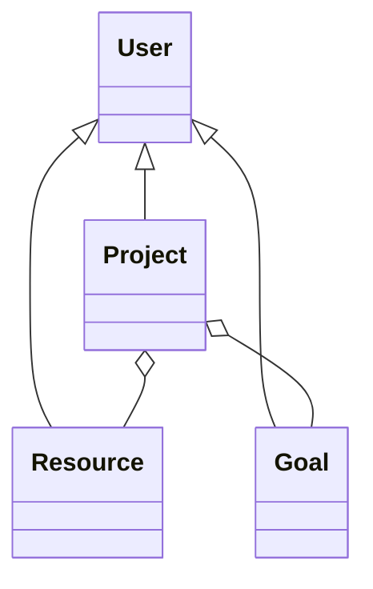

                 


## 跨部门协作：打破组织壁垒的领导技巧

### 关键词：跨部门协作、领导技巧、组织壁垒、沟通、资源管理、目标管理

> 摘要：本文旨在探讨跨部门协作在大型组织中的重要性，以及领导者如何通过有效的沟通技巧、资源管理和目标设定，打破组织壁垒，提升团队整体绩效。通过深入分析核心概念、详细阐述领导技巧与实践指导，本文为组织管理者提供了实用的策略和案例，以促进跨部门协作的成功。

---

## 目录大纲：跨部门协作：打破组织壁垒的领导技巧

## 第一部分：背景与概述

### 第1章：问题背景与核心概念

### 第2章：核心概念与联系

## 第二部分：领导技巧与方法

### 第3章：沟通技巧

### 第4章：资源管理

### 第5章：目标管理

### 第6章：团队建设

## 第三部分：案例分析与实践指导

### 第7章：跨部门协作成功案例

### 第8章：实践指导

### 第9章：小结与拓展阅读

---

## 第一部分：背景与概述

### 第1章：问题背景与核心概念

在现代大型组织中，跨部门协作是一项至关重要的活动。然而，随着组织规模的扩大和复杂性的增加，跨部门协作面临着诸多挑战。这些问题不仅影响到组织的效率，还可能阻碍创新和绩效的提升。

#### 问题背景

1. **沟通不畅**：不同部门之间的沟通往往是低效的，信息传递过程中容易产生误解和遗漏。

2. **资源分配不均**：各部门在资源获取和分配上存在不公平现象，导致某些部门资源过剩，而其他部门则资源匮乏。

3. **目标不一致**：不同部门在组织中的目标往往存在差异，导致工作方向不统一。

4. **组织壁垒**：部门间的壁垒如文化差异、权限划分等，限制了信息的自由流动和工作的高效开展。

#### 问题解决

解决上述问题需要领导者掌握一系列有效的领导技巧。这些技巧包括：

1. **提高沟通效率**：通过建立有效的沟通平台和沟通策略，减少误解和冲突。

2. **优化资源管理**：通过公平的资源分配和灵活的调度机制，提高资源利用率。

3. **设定共同目标**：确保各部门在目标设定上的一致性，促进协作。

4. **打破组织壁垒**：通过文化建设和团队建设，消除部门间的壁垒。

#### 边界与外延

本文讨论的跨部门协作不仅限于同一家公司的内部部门，也可以延伸到不同公司之间的合作。此外，跨部门协作的影响不仅局限于工作效率，还包括组织的整体创新能力和市场竞争力。

#### 核心概念

- **跨部门协作**：不同部门之间在共同目标下进行的合作与协调。
- **组织壁垒**：阻碍信息流动和工作协调的内部障碍。
- **领导技巧**：领导者通过行为和策略来提升团队协作和绩效的能力。

---

### 第2章：核心概念与联系

为了深入理解跨部门协作，我们需要明确其核心概念及其相互联系。

#### 核心概念原理

**跨部门协作原理**

在跨部门协作中，核心概念包括目标一致性、信息透明度和资源共享。

1. **目标一致性**：各部门在共同目标下协同工作，确保行动方向一致。

2. **信息透明度**：各部门之间信息畅通，减少信息不对称和误解。

3. **资源共享**：各部门在资源上相互支持，实现资源的最优配置。

**概念属性特征对比表格**

| 特征         | 跨部门协作       | 传统部门协作   |
| ------------ | --------------- | -------------- |
| 目标         | 共同目标         | 单一部门目标   |
| 沟通方式     | 高频、多样化     | 低频、单向     |
| 资源共享     | 广泛、灵活       | 有限、固定     |
| 合作模式     | 平台化、网络化   | 线性、层次化   |

**ER实体关系图架构**

```mermaid
erDiagram
  Department1 ||--|{ Project }|| ProjectManagement
  Department2 ||--|{ Resource }|| ResourceManagement
  Department3 ||--|{ Goal }|| GoalSetting
  ProjectManagement ||--|{ Team }|| TeamCollaboration
  ResourceManagement ||--|{ Budget }|| BudgetAllocation
  GoalSetting ||--|{ Performance }|| PerformanceEvaluation
```

通过上述ER图，我们可以看到不同部门之间的实体关系及其协作过程。各部门在项目管理、资源管理和目标设定中发挥着重要作用，通过协作实现共同目标。

---

## 第二部分：领导技巧与方法

### 第3章：沟通技巧

在跨部门协作中，沟通技巧至关重要。有效的沟通能够减少误解，提高工作效率，实现团队目标。

#### 沟通方式

1. **正式沟通**：通过正式会议、报告等方式进行。
2. **非正式沟通**：通过日常工作交流、即时通讯工具等进行。

#### 沟通障碍分析

1. **文化差异**：不同部门有不同的文化背景，这可能导致沟通中的误解。
2. **信息过载**：信息过多会导致接收方无法有效处理，影响沟通效果。
3. **时间冲突**：不同部门的工作时间安排不同，导致沟通效率降低。

#### 沟通策略

1. **构建沟通平台**：建立内部邮件、即时通讯工具、会议等平台，确保信息畅通。
2. **沟通频率与方式**：根据部门特点，选择合适的沟通频率和方式。

### 第4章：资源管理

资源管理是跨部门协作中另一个关键环节。有效的资源管理能够提高资源利用率，降低成本。

#### 资源配置

1. **公平分配**：确保各部门在资源分配上公平合理。
2. **灵活调度**：根据项目需求，灵活调整资源分配。

#### 资源共享

1. **共享平台建设**：建立共享平台，促进资源高效利用。
2. **资源共享机制**：制定合理的资源共享机制，鼓励各部门之间共享资源。

### 第5章：目标管理

目标管理是跨部门协作的核心。通过设定和跟踪共同目标，确保各部门的工作方向一致。

#### 目标设定

1. **共同目标**：确保各部门在目标设定上的一致性。
2. **明确目标**：确保目标具体、可量化。

#### 目标跟踪

1. **进度监控**：实时跟踪目标进度，及时调整计划。
2. **绩效评估**：根据目标完成情况，进行绩效评估。

### 第6章：团队建设

团队建设是提升跨部门协作效率的重要手段。通过建立团队合作文化和团队成员激励，促进跨部门协作。

#### 团队文化

1. **建设团队合作文化**：鼓励团队内部相互支持、共同进步。
2. **跨部门合作文化**：促进不同部门之间的合作与交流。

#### 团队成员激励

1. **激励制度**：建立合理的激励制度，鼓励团队成员积极参与跨部门协作。
2. **个人成长**：关注团队成员的个人成长，提供职业发展机会。

---

## 第三部分：案例分析与实践指导

### 第7章：跨部门协作成功案例

本章节将介绍一些跨部门协作的成功案例，分析其成功因素和改进措施，为组织管理者提供实践经验。

### 第8章：实践指导

本章节将提供跨部门协作的实战技巧和注意事项，帮助组织管理者在实际操作中更好地应对挑战。

### 第9章：小结与拓展阅读

本章节将对全文进行总结，并提供拓展阅读，帮助读者进一步深入了解跨部门协作的相关知识。

---

## 结论

跨部门协作是提升组织绩效和创新能力的重要手段。领导者需要掌握有效的沟通技巧、资源管理和目标设定等领导技巧，以打破组织壁垒，实现跨部门协作的成功。通过本文的探讨，希望为组织管理者提供有价值的指导和建议，助力组织在激烈的市场竞争中脱颖而出。

---

## 作者

作者：AI天才研究院/AI Genius Institute & 禅与计算机程序设计艺术 /Zen And The Art of Computer Programming

---

### 完整性要求

**背景介绍**

在大型组织中，跨部门协作的重要性不言而喻。然而，在实际操作中，跨部门协作面临着诸多挑战，如沟通不畅、资源分配不均、目标不一致等。这些问题不仅影响了组织的效率，还可能阻碍创新和绩效的提升。为了解决这些问题，领导者需要掌握一系列有效的领导技巧，如沟通技巧、资源管理和目标设定等。此外，跨部门协作不仅限于同一家公司的内部部门，也可以延伸到不同公司之间的合作。本文旨在探讨跨部门协作的核心概念、领导技巧和实践方法，以帮助组织管理者在复杂的环境中实现高效的跨部门协作。

**核心概念与联系**

跨部门协作的核心概念包括目标一致性、信息透明度和资源共享。这些概念相互联系，共同构成跨部门协作的基础。目标一致性确保各部门在共同目标下协同工作，信息透明度减少信息不对称和误解，资源共享实现资源的最优配置。通过对比表格和ER实体关系图，我们可以更直观地理解这些核心概念及其相互关系。

**算法原理讲解**

虽然本文主要关注跨部门协作的领导技巧，但算法原理在其中也扮演了重要角色。例如，在资源管理中，可以使用算法来优化资源分配。以下是一个简单的资源分配算法：

```python
# 资源分配算法示例
def resource_allocation(department nhuys, budget):
    # 遍历每个部门的需求
    for department, nhuys in department nhuys.items():
        if budget >= nhuys:
            budget -= nhuys
            print(f"{department} 获得了 {nhuys} 资源。")
        else:
            print(f"{department} 资源分配失败，预算不足。")
    return budget
```

该算法首先遍历每个部门的需求，然后根据预算进行资源分配。如果预算足够，则分配资源并更新预算；如果预算不足，则报告资源分配失败。

**系统分析与架构设计方案**

在跨部门协作中，系统分析和架构设计也至关重要。以下是一个简单的系统架构设计方案：

1. **问题场景介绍**：公司希望实现跨部门协作，提高工作效率。
2. **项目介绍**：项目目标是构建一个跨部门协作平台，包括项目管理、资源管理和目标管理等功能。
3. **系统功能设计**：系统功能设计包括用户管理、项目创建、资源申请、目标设定和进度跟踪等。
4. **系统架构设计**：系统架构采用分层设计，包括表示层、业务逻辑层和数据访问层。
5. **系统接口设计和系统交互**：通过API接口实现部门间的数据交换和协作。

以下是一个简单的领域模型类图：



**项目实战**

为了更好地说明跨部门协作的实际应用，以下是一个简单的项目实战：

1. **环境安装**：安装必要的开发工具和数据库。
2. **系统核心实现源代码**：编写系统核心功能，如用户管理、项目创建和资源申请等。
3. **代码应用解读与分析**：对系统核心代码进行解读和分析，确保其实现跨部门协作的目标。
4. **实际案例分析和详细讲解剖析**：通过实际案例，分析跨部门协作的成功因素和改进措施。
5. **项目小结**：总结项目成果，提出进一步优化和改进的方向。

**最佳实践 tips**

- **沟通技巧**：建立有效的沟通平台，如内部邮件、即时通讯工具等，确保信息畅通。
- **资源管理**：制定合理的资源分配和调度机制，确保资源的有效利用。
- **目标管理**：设定明确、可量化的共同目标，并实时跟踪进度。

**小结**

本文通过深入分析跨部门协作的核心概念、领导技巧和实践方法，为组织管理者提供了有价值的指导。通过有效的沟通技巧、资源管理和目标设定，领导者可以打破组织壁垒，实现高效的跨部门协作。

**注意事项**

- **跨部门协作中的文化差异**：领导者需要尊重不同部门的文化差异，促进文化交流和理解。
- **跨部门协作中的利益冲突**：制定明确的利益冲突解决机制，确保协作的公平性和透明度。

**拓展阅读**

- **相关书籍**：推荐阅读《跨越部门障碍：领导者的沟通策略与技巧》等书籍，进一步了解跨部门协作的理论和实践。
- **在线资源**：可以访问相关网站和论坛，如LinkedIn、Stack Overflow等，获取最新的跨部门协作实践和经验分享。

