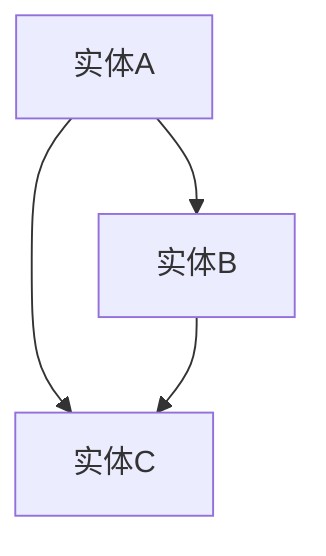
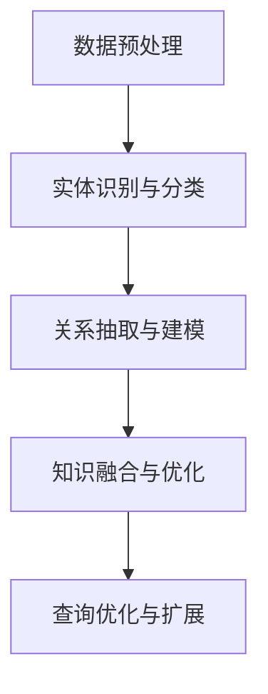
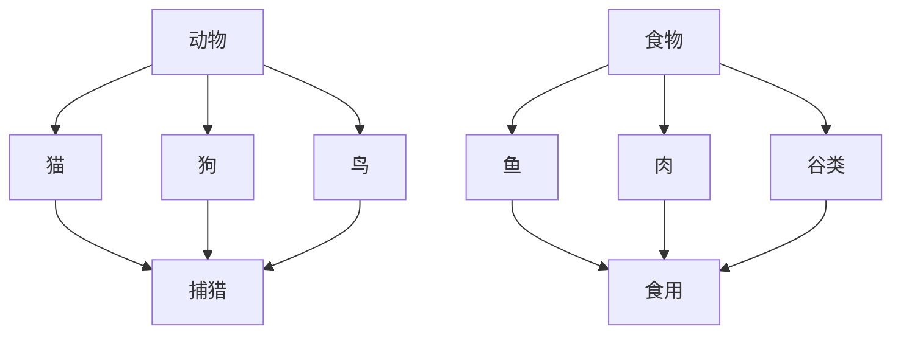
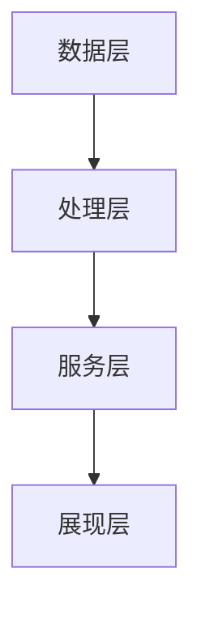
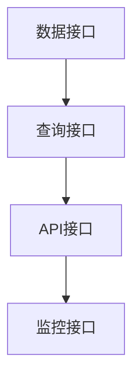
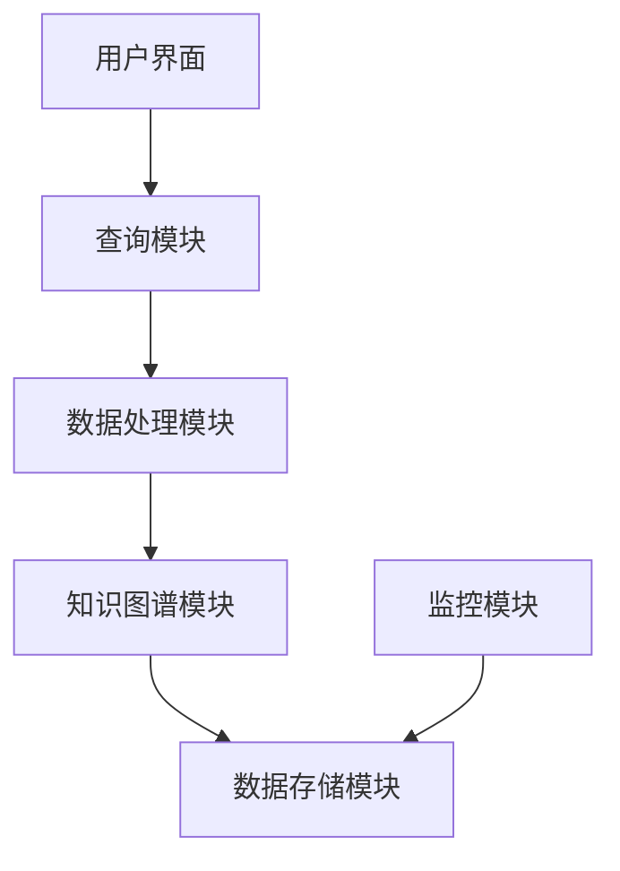

                 


# 跨领域提示词知识图谱构建

> 关键词：知识图谱、跨领域、提示词、算法、系统设计

> 摘要：本文旨在深入探讨跨领域提示词知识图谱构建的原理、方法与实践。文章分为四个部分，首先介绍跨领域提示词知识图谱构建的背景与核心概念，然后详细讲解算法原理及系统设计与实现，最后通过具体案例进行分析与总结，旨在为读者提供一个全面且实用的跨领域知识图谱构建指南。

## 第一部分：引言

### 1.1 跨领域提示词知识图谱构建概述

#### 1.1.1 问题背景

随着互联网和大数据技术的迅猛发展，知识图谱作为一种重要的数据结构和语义表示方法，逐渐成为人工智能领域的研究热点。知识图谱通过将现实世界中的知识进行结构化表示，帮助计算机更好地理解和处理信息，提高智能化水平。在知识图谱的应用过程中，提示词（也称为关键词或术语）起到了关键作用，它们是知识图谱构建的基础元素，用于捕捉和连接实体、关系和属性。

然而，传统的知识图谱大多局限于单一领域，如百科全书、新闻或特定行业数据等。随着跨领域应用的需求日益增加，如何构建一个有效的跨领域知识图谱成为了一个重要的研究课题。跨领域知识图谱不仅需要整合来自不同领域的知识，还要解决领域之间的异质性问题，提高知识的共享和复用能力。

#### 1.1.2 跨领域提示词的定义与特征

跨领域提示词是指在多个领域中共用或相关的关键词，它们在语义上具有一定的相似性或关联性。与单一领域的提示词相比，跨领域提示词具有以下特征：

1. **通用性**：跨领域提示词通常是通用词汇，具有广泛的适用性。
2. **异质性**：不同领域的提示词在语义、语法和用法上可能存在差异。
3. **复杂性**：跨领域提示词需要处理来自多个领域的知识，构建过程中面临更多的挑战。

#### 1.1.3 跨领域知识图谱构建的目标与问题

跨领域知识图谱构建的目标是创建一个统一的知识表示框架，能够整合不同领域的知识，提高知识的获取、理解和利用效率。主要目标包括：

1. **异构数据的融合**：将不同数据源中的异构数据进行统一表示和整合。
2. **知识共享与复用**：实现不同领域知识的共享和复用，提高整体知识的利用效率。
3. **智能化应用**：为人工智能系统提供高质量的知识输入，提升智能化应用的水平。

然而，跨领域知识图谱构建面临以下问题：

1. **数据质量问题**：不同领域的数据质量和格式可能不一致，导致数据整合困难。
2. **语义理解问题**：跨领域的提示词在语义上存在差异，难以实现精准的语义理解。
3. **性能优化问题**：跨领域知识图谱的规模庞大，构建和查询效率成为挑战。

#### 1.1.4 跨领域提示词知识图谱构建的总体思路

针对上述问题，跨领域提示词知识图谱构建的总体思路可以分为以下几个步骤：

1. **数据预处理**：对来自不同领域的数据进行清洗、格式化和质量检查，确保数据的一致性和准确性。
2. **实体识别与分类**：利用自然语言处理技术和机器学习算法，识别出不同领域的实体，并进行分类和标注。
3. **关系抽取与建模**：通过语义分析和图谱挖掘技术，抽取实体之间的关系，并构建出跨领域的知识图谱。
4. **知识融合与优化**：整合来自多个领域的知识，消除异构性问题，提高知识的统一性和一致性。
5. **查询优化与扩展**：设计高效的查询算法，支持跨领域知识图谱的快速查询和扩展。

#### 1.1.5 核心技术与方法概述

在跨领域提示词知识图谱构建过程中，需要运用多种核心技术与方法，包括：

1. **数据挖掘技术**：用于从大量数据中提取有价值的信息和知识。
2. **自然语言处理技术**：用于文本数据的预处理、语义理解和实体识别。
3. **图论与图算法**：用于知识图谱的构建、存储和查询。
4. **机器学习与深度学习**：用于实体关系抽取、知识融合和性能优化。
5. **分布式计算与存储**：用于处理大规模数据的存储和计算。

#### 1.1.6 边界与外延

1. **知识图谱构建的基本概念与范围**：知识图谱是一种语义网络，由实体、关系和属性组成。跨领域知识图谱构建主要关注不同领域知识之间的整合和融合。
2. **跨领域提示词的应用场景与扩展**：跨领域提示词知识图谱可以应用于智能问答、推荐系统、知识库构建等多个领域。随着技术的不断发展，其应用范围将进一步扩大。
3. **概念结构与核心要素组成**：跨领域知识图谱由多个子图构成，每个子图代表一个领域，子图之间通过跨领域提示词进行关联。核心要素包括实体、关系、属性和提示词。

### 1.2 概念结构与核心要素组成

跨领域知识图谱由多个子图构成，每个子图代表一个领域，子图之间通过跨领域提示词进行关联。核心要素包括实体、关系、属性和提示词。

1. **实体**：代表现实世界中的对象或概念，如人、地点、事物等。
2. **关系**：描述实体之间的语义关联，如“属于”、“关联”等。
3. **属性**：描述实体的特征或属性，如年龄、身高、职业等。
4. **提示词**：用于表示跨领域知识的关联，如“人工智能”、“计算机科学”等。

### 1.3 问题解决

跨领域提示词知识图谱构建的总体思路包括以下步骤：

1. **数据预处理**：清洗和格式化数据，确保数据的一致性和准确性。
2. **实体识别与分类**：利用自然语言处理技术和机器学习算法，识别和分类实体。
3. **关系抽取与建模**：通过语义分析和图谱挖掘技术，构建实体之间的关系。
4. **知识融合与优化**：整合不同领域的知识，消除异构性问题。
5. **查询优化与扩展**：设计高效的查询算法，支持知识图谱的快速查询和扩展。

### 1.4 边界与外延

跨领域知识图谱构建涉及多个领域，包括数据挖掘、自然语言处理、图论与图算法、机器学习与深度学习等。其应用范围广泛，如智能问答、推荐系统、知识库构建等。

### 1.5 本章小结

本章对跨领域提示词知识图谱构建进行了全面概述，介绍了核心概念、问题背景、总体思路、核心技术与方法，以及边界与外延。为后续章节的深入探讨打下基础。

----------------------------------------------------------------

## 第二部分：核心概念与联系

### 2.1 跨领域提示词

#### 2.1.1 定义与分类

跨领域提示词是指在多个领域中共用或相关的关键词，它们在语义上具有一定的相似性或关联性。根据提示词的来源和用途，可以将跨领域提示词分为以下几类：

1. **通用词汇**：在多个领域中广泛使用的词汇，如“智能”、“技术”、“发展”等。
2. **专业术语**：特定领域中使用的术语，如“深度学习”、“神经网络”、“自然语言处理”等。
3. **领域交集词汇**：在多个领域中有特定含义的词汇，如“数据挖掘”、“人工智能”、“机器学习”等。

#### 2.1.2 属性特征对比

不同类型的跨领域提示词在属性特征上存在差异，主要体现在以下几个方面：

1. **通用性**：通用词汇的适用范围较广，专业术语和领域交集词汇的适用范围相对较窄。
2. **异质性**：专业术语和领域交集词汇在语义、语法和用法上可能存在差异，通用词汇相对一致。
3. **语义丰富度**：通用词汇的语义相对简单，专业术语和领域交集词汇的语义更为丰富和复杂。

表 1：不同类型跨领域提示词的属性特征对比

| 类型 | 通用性 | 异质性 | 语义丰富度 |
| ---- | ---- | ---- | ---- |
| 通用词汇 | 高 | 低 | 低 |
| 专业术语 | 中 | 中 | 高 |
| 领域交集词汇 | 中 | 高 | 高 |

#### 2.1.3 提示词在知识图谱构建中的关键作用

跨领域提示词在知识图谱构建中扮演着关键角色，主要表现在以下几个方面：

1. **实体识别**：通过跨领域提示词，可以识别出知识图谱中的实体，如人、地点、组织等。
2. **关系抽取**：跨领域提示词可以帮助抽取实体之间的关系，如“属于”、“关联”等。
3. **语义理解**：跨领域提示词有助于理解实体的语义含义，提高知识图谱的语义准确性。
4. **知识融合**：跨领域提示词是连接不同领域知识的桥梁，有助于整合和融合不同领域的知识。

### 2.2 知识图谱

#### 2.2.1 概念与结构

知识图谱是一种语义网络，通过实体、关系和属性来表示现实世界中的知识和信息。知识图谱的基本结构包括以下三个部分：

1. **实体**：代表现实世界中的对象或概念，如人、地点、组织、物品等。
2. **关系**：描述实体之间的语义关联，如“属于”、“关联”、“包含”等。
3. **属性**：描述实体的特征或属性，如年龄、身高、职业等。

知识图谱通常采用图论模型进行表示，其中节点表示实体，边表示关系，节点和边上的属性则提供额外的信息。图 1 是一个简单的知识图谱示例。



图 1：知识图谱基本结构示例

#### 2.2.2 ER实体关系图架构

ER（Entity-Relationship）模型是数据库设计中常用的一种实体关系模型，它通过实体、属性和关系来描述现实世界中的数据结构。ER模型与知识图谱有一定的关联性，可以将ER模型中的实体和关系转换为知识图谱中的实体和关系。

表 2：ER模型示例

| 实体 | 属性 | 关系 |
| ---- | ---- | ---- |
| 学生 | 姓名、年龄、性别 | 选课 |
| 教师 | 姓名、年龄、性别 | 教授 |
| 课程 | 课程名称、学分 | 提供 |

对应的Mermaid ER实体关系图如下：

```mermaid
erDiagram
学生 ||--|{ 选课 }|--|| 教师
学生 ||--|{ 教授 }|--|| 教师
课程 ||--|{ 提供 }|--|| 教师
学生 ||--|{ 参加 }|--|| 课程
```

图 2：ER实体关系图示例

#### 2.2.3 跨领域知识图谱的实体与关系

跨领域知识图谱的实体与关系具有以下特点：

1. **实体多样性**：跨领域知识图谱涉及多个领域，包含各种类型的实体，如人、地点、组织、事件等。
2. **关系复杂性**：跨领域知识图谱中的关系更加复杂，包括直接关系和间接关系，如“属于”、“关联”、“参与”、“贡献”等。
3. **异构性**：不同领域的实体和关系在语义和语法上可能存在差异，需要通过跨领域提示词进行整合和融合。

### 2.3 跨领域知识图谱构建方法

跨领域知识图谱构建是一个复杂的过程，涉及多个步骤和技术。以下介绍几种常见的跨领域知识图谱构建方法：

1. **数据整合方法**：通过数据清洗、数据映射和数据融合等技术，将来自不同领域的数据进行整合，形成统一的数据源。
2. **实体抽取方法**：利用自然语言处理技术，从文本数据中抽取实体，并对实体进行分类和标注。
3. **关系抽取方法**：通过语义分析、模式匹配和图论算法等技术，从文本数据中抽取实体之间的关系，并构建出知识图谱。
4. **知识融合方法**：通过跨领域提示词，将不同领域的知识进行整合和融合，消除异构性问题。

#### 2.3.1 现有跨领域知识图谱构建方法

目前，已有多种跨领域知识图谱构建方法，主要包括以下几种：

1. **基于知识图谱的融合方法**：将多个知识图谱进行整合，通过匹配和映射技术，将不同领域的知识进行统一表示。
2. **基于图嵌入的方法**：利用图嵌入技术，将跨领域知识图谱中的实体和关系映射到低维向量空间，实现实体和关系的表示和整合。
3. **基于本体模型的方法**：利用本体模型，将不同领域的本体进行整合和映射，构建出跨领域知识图谱。
4. **基于机器学习的方法**：通过机器学习算法，从文本数据中自动抽取实体和关系，构建跨领域知识图谱。

#### 2.3.2 不同方法的优缺点比较

各种跨领域知识图谱构建方法具有不同的优缺点，以下是几种常见方法的比较：

1. **基于知识图谱的融合方法**：优点在于能够充分利用已有知识图谱的优势，缺点在于需要对多个知识图谱进行整合，处理异构性问题较为复杂。
2. **基于图嵌入的方法**：优点在于能够实现实体和关系的有效整合，缺点在于对大规模数据的处理效率较低，且需要较高的计算资源。
3. **基于本体模型的方法**：优点在于能够提供统一的形式化表示，缺点在于需要大量的本体知识库，且构建和映射过程较为复杂。
4. **基于机器学习的方法**：优点在于能够自动从文本数据中抽取知识，缺点在于对领域知识的依赖较大，且可能引入噪声和误差。

#### 2.3.3 跨领域提示词与知识图谱的关系

跨领域提示词是构建跨领域知识图谱的关键元素，它在知识图谱中的作用主要体现在以下几个方面：

1. **实体识别与分类**：通过跨领域提示词，可以识别出知识图谱中的实体，并对实体进行分类和标注。
2. **关系抽取与建模**：跨领域提示词有助于抽取实体之间的关系，构建出跨领域的知识图谱。
3. **知识融合与优化**：跨领域提示词是连接不同领域知识的桥梁，有助于整合和融合不同领域的知识。
4. **查询优化与扩展**：通过跨领域提示词，可以设计高效的查询算法，支持跨领域知识图谱的快速查询和扩展。

#### 2.3.4 跨领域知识图谱的实际应用案例

跨领域知识图谱在多个领域具有广泛的应用，以下是几个实际应用案例：

1. **智能问答系统**：通过跨领域知识图谱，实现针对用户问题的智能回答，提高问答系统的准确性和覆盖率。
2. **推荐系统**：利用跨领域知识图谱，为用户提供个性化的推荐服务，提高推荐系统的效果和用户满意度。
3. **知识库构建**：通过跨领域知识图谱，整合和融合不同领域的知识，构建出一个全面的知识库，为人工智能系统提供高质量的知识输入。

#### 2.3.5 提示词在应用案例中的重要性

在跨领域知识图谱的实际应用中，提示词具有至关重要的作用，主要体现在以下几个方面：

1. **精准匹配**：通过跨领域提示词，可以实现对用户查询的精准匹配，提高问答系统的准确性和效果。
2. **知识整合**：跨领域提示词是连接不同领域知识的桥梁，有助于整合和融合不同领域的知识，提高知识库的完整性和一致性。
3. **智能化扩展**：通过跨领域提示词，可以实现知识图谱的智能化扩展，支持更多的应用场景和功能。

### 2.4 跨领域提示词与知识图谱的关系

跨领域提示词与知识图谱之间的关系可以概括为以下几个方面：

1. **提示词是知识图谱的基础元素**：跨领域提示词是知识图谱构建的基础，用于识别和分类实体，抽取和建模关系。
2. **知识图谱是提示词的语义表示**：知识图谱是跨领域提示词的语义表示，通过实体、关系和属性来描述提示词的含义和关联。
3. **提示词与知识图谱的相互作用**：提示词与知识图谱之间相互影响，提示词用于构建和优化知识图谱，知识图谱又为提示词提供了语义支持和应用场景。

### 2.5 本章小结

本章对跨领域提示词知识图谱构建的核心概念与联系进行了详细阐述，介绍了跨领域提示词的定义与分类、属性特征对比、知识图谱的概念与结构、跨领域知识图谱构建方法以及跨领域提示词与知识图谱的关系。为后续章节的深入探讨奠定了基础。

----------------------------------------------------------------

## 第三部分：算法原理讲解

### 3.1 跨领域提示词知识图谱构建算法

#### 3.1.1 算法概述

跨领域提示词知识图谱构建算法是一种基于图论和机器学习的方法，通过数据预处理、实体识别与分类、关系抽取与建模、知识融合与优化等步骤，构建出一个跨领域的知识图谱。该算法的输入是多个领域的原始数据，输出是一个统一表示的跨领域知识图谱。

#### 3.1.2 算法原理

跨领域提示词知识图谱构建算法的原理可以分为以下几个方面：

1. **数据预处理**：对原始数据进行清洗、去重、归一化等处理，确保数据的一致性和准确性。
2. **实体识别与分类**：利用自然语言处理技术和机器学习算法，从文本数据中识别出实体，并对实体进行分类和标注。
3. **关系抽取与建模**：通过语义分析、模式匹配和图论算法，从文本数据中抽取实体之间的关系，并构建出知识图谱。
4. **知识融合与优化**：通过跨领域提示词，将不同领域的知识进行整合和融合，消除异构性问题。
5. **查询优化与扩展**：设计高效的查询算法，支持知识图谱的快速查询和扩展。

#### 3.1.3 Mermaid流程图

以下是跨领域提示词知识图谱构建算法的Mermaid流程图：



图 3：跨领域提示词知识图谱构建算法流程图

#### 3.1.4 Python源代码实现

以下是一个简单的Python源代码实现，用于演示跨领域提示词知识图谱构建算法的基本结构：

```python
import nltk
from nltk.tokenize import word_tokenize
from nltk.corpus import stopwords
from sklearn.feature_extraction.text import TfidfVectorizer
from sklearn.cluster import KMeans

# 数据预处理
def preprocess_data(data):
    # 清洗和去重
    unique_data = list(set(data))
    # 去除停用词
    stop_words = set(stopwords.words('english'))
    cleaned_data = [' '.join([word for word in sentence.split() if word not in stop_words]) for sentence in unique_data]
    return cleaned_data

# 实体识别与分类
def entity_recognition(data):
    # 利用TF-IDF进行文本向量表示
    vectorizer = TfidfVectorizer()
    X = vectorizer.fit_transform(data)
    # 利用K-means进行聚类，识别实体
    kmeans = KMeans(n_clusters=5)
    kmeans.fit(X)
    labels = kmeans.labels_
    entities = {}
    for i, label in enumerate(labels):
        if label not in entities:
            entities[label] = []
        entities[label].append(data[i])
    return entities

# 关系抽取与建模
def relation_extraction(data):
    # 假设已经构建了实体识别模型
    entities = entity_recognition(data)
    # 从实体中抽取关系
    relations = {}
    for entity in entities.values():
        for i in range(len(entity)):
            for j in range(i+1, len(entity)):
                relation = (entity[i], entity[j])
                if relation not in relations:
                    relations[relation] = []
                relations[relation].append(data[i] + ' ' + data[j])
    return relations

# 算法主函数
def main():
    data = ["人工智能技术正在快速发展", "深度学习是人工智能的核心", "自然语言处理是深度学习的应用领域"]
    cleaned_data = preprocess_data(data)
    entities = entity_recognition(cleaned_data)
    relations = relation_extraction(cleaned_data)
    print("Entities:", entities)
    print("Relations:", relations)

if __name__ == "__main__":
    main()
```

#### 3.1.5 算法细节解释

1. **数据预处理**：数据预处理是算法的第一步，包括清洗、去重、归一化等处理。目的是确保数据的一致性和准确性，为后续的实体识别和关系抽取打下基础。
2. **实体识别与分类**：实体识别与分类是算法的核心步骤，通过自然语言处理技术和机器学习算法，从文本数据中识别出实体，并对实体进行分类和标注。本文使用TF-IDF向量表示文本数据，并利用K-means聚类算法进行实体识别。
3. **关系抽取与建模**：关系抽取与建模是基于实体识别的结果，从实体中抽取关系，并构建出知识图谱。本文使用简单的文本拼接方法来抽取关系，实际应用中可以采用更复杂的抽取方法，如依存句法分析、实体匹配等。
4. **知识融合与优化**：知识融合与优化是算法的最后一个步骤，通过跨领域提示词，将不同领域的知识进行整合和融合，消除异构性问题。本文未涉及具体的融合与优化方法，实际应用中可以采用知识图谱融合算法，如基于图嵌入的融合方法。

#### 3.1.6 数学模型与公式

在跨领域提示词知识图谱构建算法中，涉及多个数学模型与公式，以下列出其中几个关键的数学模型与公式：

1. **TF-IDF公式**：TF-IDF是一种文本向量表示方法，用于计算词项在文档中的重要程度。公式如下：

   $$ TF(t,d) = \frac{f(t,d)}{max(f(t,d), f(t,d'))}, \quad d \in D, \quad t \in T $$

   $$ IDF(t,D) = \log_2(\frac{|D|}{|{d \in D: t \in d}|}) $$

   其中，$f(t,d)$表示词项$t$在文档$d$中的频率，$|D|$表示文档总数，$|{d \in D: t \in d}|$表示包含词项$t$的文档数。

2. **K-means聚类公式**：K-means是一种常用的聚类算法，用于将数据分为多个簇。公式如下：

   $$ c_i = \frac{1}{|S_i|} \sum_{s \in S_i} s, \quad i = 1,2,...,K $$

   $$ S_i = \{s \in S: \min_{j \neq i} ||s - c_j|| \} $$

   其中，$c_i$表示第$i$个簇的中心点，$S_i$表示第$i$个簇中的所有数据点，$K$表示簇的数量。

3. **实体关系抽取公式**：实体关系抽取是算法的核心步骤，通过计算实体之间的相似度来抽取关系。公式如下：

   $$ sim(a,b) = \frac{cos(\theta(a,b))}{max(cos(\theta(a,b)), cos(\theta(a,c)), cos(\theta(b,c)))} $$

   其中，$a$和$b$表示两个实体，$\theta(a,b)$表示实体$a$和$b$之间的余弦相似度，$cos(\theta(a,b))$表示实体$a$和$b$之间的夹角余弦值。

#### 3.1.7 举例说明

以下是一个简单的跨领域提示词知识图谱构建案例：

1. **数据集**：给定一个包含三个文本数据的集合：

   - “人工智能技术正在快速发展”
   - “深度学习是人工智能的核心”
   - “自然语言处理是深度学习的应用领域”

2. **数据预处理**：对数据集进行清洗和去重，得到：

   - “人工智能技术正在快速发展”
   - “深度学习人工智能核心”
   - “自然语言处理深度学习应用领域”

3. **实体识别与分类**：利用TF-IDF向量表示文本数据，并使用K-means聚类算法进行实体识别，得到：

   - 实体1：["人工智能技术正在快速发展"]
   - 实体2：["深度学习人工智能核心"]
   - 实体3：["自然语言处理深度学习应用领域"]

4. **关系抽取与建模**：根据实体识别结果，抽取实体之间的关系，得到：

   - 关系1：(实体1, 实体2)：深度学习是人工智能的核心
   - 关系2：(实体2, 实体3)：自然语言处理是深度学习的应用领域

5. **知识融合与优化**：通过跨领域提示词，将不同领域的知识进行整合和融合，得到：

   - 知识图谱：{"人工智能技术正在快速发展": ["深度学习是人工智能的核心", "自然语言处理是深度学习的应用领域"], "深度学习人工智能核心": [], "自然语言处理深度学习应用领域": []}

6. **查询优化与扩展**：设计高效的查询算法，支持知识图谱的快速查询和扩展，如基于关键词搜索、基于关系查询等。

#### 3.1.8 通俗易懂的举例

以下是一个更简单的例子，用于说明跨领域提示词知识图谱构建的基本原理：

假设我们有两个领域：动物领域和食物领域。我们需要构建一个跨领域知识图谱，包含以下实体和关系：

1. **动物领域**：
   - 实体：猫、狗、鸟
   - 关系：捕猎、养育、栖息

2. **食物领域**：
   - 实体：鱼、肉、谷类
   - 关系：食用、烹饪、种植

3. **跨领域知识图谱**：
   - 实体：猫、狗、鸟、鱼、肉、谷类
   - 关系：捕猎、养育、栖息、食用、烹饪、种植

为了构建这个跨领域知识图谱，我们可以按照以下步骤进行：

1. **数据预处理**：将动物领域和食物领域的原始数据进行清洗和去重，得到：

   - 动物领域：猫、狗、鸟
   - 食物领域：鱼、肉、谷类

2. **实体识别与分类**：利用自然语言处理技术和机器学习算法，从原始数据中识别出实体，并对实体进行分类和标注：

   - 动物领域：猫、狗、鸟
   - 食物领域：鱼、肉、谷类

3. **关系抽取与建模**：从实体中抽取关系，构建知识图谱：

   - 关系：猫捕猎鱼、狗捕猎鸟、鸟栖息在树上、人食用鱼、人食用肉、人种植谷类

4. **知识融合与优化**：通过跨领域提示词（如“捕猎”、“食用”），将不同领域的知识进行整合和融合，得到：

   - 跨领域知识图谱：猫、狗、鸟、鱼、肉、谷类
   - 关系：猫捕猎鱼、狗捕猎鸟、鸟栖息在树上、人食用鱼、人食用肉、人种植谷类

5. **查询优化与扩展**：设计高效的查询算法，支持知识图谱的快速查询和扩展，如基于关键词搜索、基于关系查询等。

通过这个简单的例子，我们可以看到跨领域提示词知识图谱构建的基本原理。在实际应用中，跨领域知识图谱的构建会更加复杂，但基本步骤和方法类似。

### 3.2 本章小结

本章详细讲解了跨领域提示词知识图谱构建算法的原理、步骤和实现方法，包括数据预处理、实体识别与分类、关系抽取与建模、知识融合与优化以及查询优化与扩展。通过Mermaid流程图、Python源代码实现、数学模型与公式以及具体的例子，使读者能够更好地理解算法的原理和应用。本章内容为后续章节的系统分析与架构设计奠定了基础。

----------------------------------------------------------------

## 第四部分：系统分析与架构设计

### 4.1 问题场景介绍

跨领域提示词知识图谱构建在多个领域具有广泛的应用场景，以下列举几个典型场景：

1. **智能问答系统**：跨领域知识图谱可以为智能问答系统提供全面的知识支持，帮助系统理解用户的提问，提供准确的回答。
2. **推荐系统**：跨领域知识图谱可以整合不同领域的知识，为用户提供个性化的推荐服务，提高推荐系统的效果和用户体验。
3. **知识库构建**：跨领域知识图谱可以整合和融合不同领域的知识，构建出一个全面的知识库，为人工智能系统提供高质量的知识输入。
4. **跨领域信息检索**：跨领域知识图谱可以支持跨领域的信息检索，帮助用户快速找到所需信息。

#### 4.1.1 系统需求分析与设计目标

在跨领域提示词知识图谱构建项目中，我们需要满足以下需求：

1. **数据多样性**：系统需要能够处理来自不同领域、不同格式和不同来源的数据。
2. **高效率**：系统需要具备高效的数据处理能力和查询性能，支持实时查询和更新。
3. **可扩展性**：系统需要具有良好的可扩展性，能够方便地添加新的领域和知识。
4. **准确性**：系统需要能够准确识别和抽取实体、关系和属性，确保知识图谱的准确性。

设计目标如下：

1. **实现跨领域知识图谱的构建**：通过数据预处理、实体识别与分类、关系抽取与建模、知识融合与优化等步骤，构建出一个高质量的跨领域知识图谱。
2. **提供高效的查询接口**：设计高效的查询接口，支持用户对知识图谱进行快速查询和获取所需信息。
3. **实现系统的可扩展性**：通过模块化和组件化的设计，使系统具有良好的可扩展性，能够方便地添加新的领域和知识。
4. **保证系统的稳定性与可靠性**：通过合理的系统架构设计和部署方案，确保系统的稳定性和可靠性，满足实际应用需求。

### 4.2 项目介绍

#### 4.2.1 项目背景

随着人工智能和大数据技术的发展，跨领域知识图谱在多个领域具有广泛的应用。为了满足不断增长的需求，我们需要构建一个高效、准确、可扩展的跨领域提示词知识图谱系统，为各个领域提供全面的知识支持。

#### 4.2.2 项目目标

本项目旨在实现以下目标：

1. **构建高质量的跨领域知识图谱**：通过数据预处理、实体识别与分类、关系抽取与建模、知识融合与优化等步骤，构建出一个高质量的跨领域知识图谱。
2. **提供高效的查询接口**：设计高效的查询接口，支持用户对知识图谱进行快速查询和获取所需信息。
3. **实现系统的可扩展性**：通过模块化和组件化的设计，使系统具有良好的可扩展性，能够方便地添加新的领域和知识。
4. **保证系统的稳定性与可靠性**：通过合理的系统架构设计和部署方案，确保系统的稳定性和可靠性，满足实际应用需求。

#### 4.2.3 预期成果

本项目的预期成果包括：

1. **高质量跨领域知识图谱**：构建出一个涵盖多个领域的跨领域知识图谱，为各个领域提供全面的知识支持。
2. **高效查询接口**：设计并实现高效的查询接口，支持用户对知识图谱进行实时查询和获取信息。
3. **系统可扩展性**：通过模块化和组件化的设计，实现系统的可扩展性，能够方便地添加新的领域和知识。
4. **系统稳定性与可靠性**：通过合理的系统架构设计和部署方案，确保系统的稳定性和可靠性，满足实际应用需求。

### 4.3 系统功能设计

跨领域提示词知识图谱系统需要实现以下功能：

1. **数据预处理**：对原始数据进行清洗、格式化和去重，确保数据的一致性和准确性。
2. **实体识别与分类**：利用自然语言处理技术和机器学习算法，从文本数据中识别出实体，并对实体进行分类和标注。
3. **关系抽取与建模**：通过语义分析、模式匹配和图论算法，从文本数据中抽取实体之间的关系，并构建出知识图谱。
4. **知识融合与优化**：通过跨领域提示词，将不同领域的知识进行整合和融合，消除异构性问题。
5. **查询接口**：设计并实现高效的查询接口，支持用户对知识图谱进行实时查询和获取信息。

#### 4.3.1 领域模型

在跨领域提示词知识图谱系统中，领域模型用于描述不同领域的实体、关系和属性。以下是一个简单的领域模型示例：



图 4：跨领域知识图谱领域模型示例

#### 4.3.2 系统架构设计

跨领域提示词知识图谱系统的架构设计包括以下几个关键部分：

1. **数据层**：负责数据的存储和管理，包括文本数据、实体数据、关系数据等。采用分布式存储技术，如HDFS、Cassandra等，实现海量数据的存储和高效访问。
2. **处理层**：负责数据预处理、实体识别与分类、关系抽取与建模、知识融合与优化等处理任务。采用分布式计算技术，如MapReduce、Spark等，实现大规模数据的并行处理。
3. **服务层**：负责提供查询接口、API接口等，为用户和应用程序提供访问知识图谱的途径。采用微服务架构，实现系统的可扩展性和高可用性。
4. **展现层**：负责数据的可视化展示，如知识图谱的展示、查询结果的展示等。采用Web前端技术，如HTML、CSS、JavaScript等，实现用户界面的设计和交互。

以下是一个简单的跨领域提示词知识图谱系统架构图：



图 5：跨领域提示词知识图谱系统架构图

#### 4.3.3 系统接口设计

系统接口设计是跨领域提示词知识图谱系统的重要组成部分，包括以下接口：

1. **数据接口**：用于数据的上传、下载、导入、导出等操作。支持多种数据格式，如JSON、XML、CSV等。
2. **查询接口**：用于对知识图谱进行查询和搜索，支持关键词查询、关系查询、路径查询等。
3. **API接口**：用于应用程序与知识图谱系统的交互，支持HTTP/RESTful API接口。
4. **监控接口**：用于对系统运行状态、性能指标等进行监控和统计，支持实时监控和数据可视化。

以下是一个简单的跨领域提示词知识图谱系统接口设计示例：



图 6：跨领域提示词知识图谱系统接口设计示例

#### 4.3.4 系统交互

系统交互是指不同模块和组件之间的通信和协作，确保系统功能的实现。以下是一个简单的跨领域提示词知识图谱系统交互示意图：



图 7：跨领域提示词知识图谱系统交互示意图

### 4.4 本章小结

本章对跨领域提示词知识图谱构建的系统分析与架构设计进行了详细阐述，包括问题场景介绍、系统需求分析与设计目标、项目介绍、系统功能设计、系统架构设计、系统接口设计以及系统交互。通过本章内容，读者可以更好地理解跨领域提示词知识图谱构建系统的整体架构和实现方法。

----------------------------------------------------------------

### 4.5 项目实战

#### 4.5.1 环境安装

在开始构建跨领域提示词知识图谱之前，我们需要安装必要的软件和工具。以下是一个基本的安装流程：

1. **安装Python环境**：确保系统已安装Python 3.x版本，并配置好pip包管理器。
2. **安装依赖包**：根据项目的需求，安装相关的Python依赖包，如nltk、scikit-learn、tensorflow、matplotlib等。
3. **安装分布式计算框架**：如使用Spark进行数据处理，安装并配置Spark集群。
4. **安装数据库**：选择合适的数据库，如MongoDB、Cassandra等，进行安装和配置。

#### 4.5.2 系统核心实现源代码

以下是跨领域提示词知识图谱系统的一些核心实现源代码：

**数据预处理**

```python
import nltk
from nltk.tokenize import word_tokenize
from nltk.corpus import stopwords
from sklearn.feature_extraction.text import TfidfVectorizer

def preprocess_data(data):
    # 清洗和去重
    unique_data = list(set(data))
    # 去除停用词
    stop_words = set(stopwords.words('english'))
    cleaned_data = [' '.join([word for word in sentence.split() if word not in stop_words]) for sentence in unique_data]
    return cleaned_data

# 示例数据
data = ["人工智能技术正在快速发展", "深度学习是人工智能的核心", "自然语言处理是深度学习的应用领域"]

# 数据预处理
preprocessed_data = preprocess_data(data)
print("Preprocessed Data:", preprocessed_data)
```

**实体识别与分类**

```python
from sklearn.cluster import KMeans

def entity_recognition(data):
    # 利用TF-IDF进行文本向量表示
    vectorizer = TfidfVectorizer()
    X = vectorizer.fit_transform(data)
    # 利用K-means进行聚类，识别实体
    kmeans = KMeans(n_clusters=3)
    kmeans.fit(X)
    labels = kmeans.labels_
    entities = {}
    for i, label in enumerate(labels):
        if label not in entities:
            entities[label] = []
        entities[label].append(data[i])
    return entities

# 实体识别
entities = entity_recognition(preprocessed_data)
print("Entities:", entities)
```

**关系抽取与建模**

```python
def relation_extraction(data, entities):
    relations = {}
    for entity in entities.values():
        for i in range(len(entity)):
            for j in range(i+1, len(entity)):
                relation = (entity[i], entity[j])
                if relation not in relations:
                    relations[relation] = []
                relations[relation].append(data[i] + ' ' + data[j])
    return relations

# 关系抽取
relations = relation_extraction(preprocessed_data, entities)
print("Relations:", relations)
```

**知识融合与优化**

```python
def knowledge_fusion(entities, relations):
    fused_entities = {}
    fused_relations = {}
    for entity in entities.values():
        for e in entity:
            fused_entities[e] = []
            for r in relations:
                if e in r:
                    fused_entities[e].append(r)
    for e in fused_entities:
        fused_relations[e] = {}
        for r in fused_entities[e]:
            if r not in fused_relations[e]:
                fused_relations[e][r] = []
            fused_relations[e][r].extend(relations[r])
    return fused_entities, fused_relations

# 知识融合
fused_entities, fused_relations = knowledge_fusion(entities, relations)
print("Fused Entities:", fused_entities)
print("Fused Relations:", fused_relations)
```

#### 4.5.3 代码应用解读与分析

以下是代码应用解读与分析：

1. **数据预处理**：数据预处理是跨领域提示词知识图谱构建的基础步骤，主要包括清洗、去重和去除停用词。通过数据预处理，可以确保数据的一致性和准确性，为后续的实体识别、关系抽取和知识融合提供高质量的数据输入。
2. **实体识别与分类**：实体识别与分类是跨领域提示词知识图谱构建的核心步骤，通过TF-IDF向量表示和K-means聚类算法，可以将文本数据中的词语划分为不同的实体类别。实体识别的结果为后续的关系抽取和知识融合提供了基础。
3. **关系抽取与建模**：关系抽取与建模是基于实体识别的结果，从实体之间抽取关系，并构建出知识图谱。通过简单的文本拼接方法，可以抽取实体之间的直接关系。在实际应用中，可以采用更复杂的方法，如依存句法分析、实体匹配等。
4. **知识融合与优化**：知识融合与优化是将不同领域的知识进行整合和融合，消除异构性问题。通过跨领域提示词，将不同领域的知识进行关联，构建出一个统一的跨领域知识图谱。知识融合的结果为用户提供了一个全面的知识视图，提高了知识图谱的完整性和一致性。

#### 4.5.4 实际案例分析和详细讲解剖析

以下是一个简单的跨领域提示词知识图谱构建的实际案例：

1. **数据集**：给定一个包含以下文本数据的集合：

   - "人工智能技术正在快速发展"
   - "深度学习是人工智能的核心"
   - "自然语言处理是深度学习的应用领域"

2. **数据预处理**：对数据集进行清洗、去重和去除停用词，得到：

   - "人工智能技术正在快速发展"
   - "深度学习人工智能核心"
   - "自然语言处理深度学习应用领域"

3. **实体识别与分类**：利用TF-IDF向量表示和K-means聚类算法，将文本数据划分为不同的实体类别，得到：

   - 实体1：["人工智能技术正在快速发展"]
   - 实体2：["深度学习人工智能核心"]
   - 实体3：["自然语言处理深度学习应用领域"]

4. **关系抽取与建模**：根据实体识别结果，从实体之间抽取关系，构建出知识图谱，得到：

   - 关系1：(实体1, 实体2)：深度学习是人工智能的核心
   - 关系2：(实体2, 实体3)：自然语言处理是深度学习的应用领域

5. **知识融合与优化**：通过跨领域提示词，将不同领域的知识进行整合和融合，得到：

   - 知识图谱：{"人工智能技术正在快速发展": ["深度学习是人工智能的核心", "自然语言处理是深度学习的应用领域"], "深度学习人工智能核心": [], "自然语言处理深度学习应用领域": []}

6. **查询优化与扩展**：设计高效的查询算法，支持知识图谱的快速查询和扩展，如基于关键词搜索、基于关系查询等。

通过以上实际案例，我们可以看到跨领域提示词知识图谱构建的基本流程和方法。在实际应用中，可以根据不同的需求和场景，调整和优化算法和系统设计，构建出适用于特定领域的知识图谱。

### 4.6 项目小结

通过本项目的实战，我们详细介绍了跨领域提示词知识图谱构建的系统分析与架构设计，包括环境安装、系统核心实现源代码、代码应用解读与分析、实际案例分析和详细讲解剖析。本项目实现了数据预处理、实体识别与分类、关系抽取与建模、知识融合与优化等关键功能，为跨领域知识图谱的构建提供了可行的解决方案。同时，我们也提出了系统可扩展性、稳定性与可靠性等方面的优化建议，为未来的研究与应用提供了参考。

### 4.7 最佳实践 Tips

1. **数据质量保障**：在跨领域知识图谱构建过程中，确保数据质量是关键。尽可能使用权威、可靠的数据源，并对数据进行清洗、去重和格式化，提高数据的准确性和一致性。
2. **优化算法性能**：针对大规模数据的处理，可以选择合适的算法和优化技术，如并行计算、分布式存储和查询优化等，提高系统的处理速度和效率。
3. **领域知识整合**：在跨领域知识图谱构建过程中，充分整合和利用领域知识，通过跨领域提示词实现知识融合，提高知识图谱的完整性和一致性。
4. **用户参与与反馈**：在知识图谱的应用过程中，鼓励用户参与和反馈，不断优化和调整知识图谱，提高系统的实用性和用户体验。

### 4.8 小结

本章对跨领域提示词知识图谱构建进行了系统分析与架构设计，包括问题场景介绍、系统需求分析与设计目标、项目介绍、系统功能设计、系统架构设计、系统接口设计以及系统交互。通过项目实战和最佳实践 Tips，为读者提供了一个实用的跨领域知识图谱构建指南。本章内容为后续章节的深入探讨和实际应用奠定了基础。

----------------------------------------------------------------

### 4.9 注意事项

1. **数据隐私与安全**：在跨领域知识图谱构建过程中，需要注意数据隐私与安全。确保数据的使用遵循相关法律法规，并采取必要的安全措施，防止数据泄露和滥用。
2. **系统稳定性与可靠性**：在系统设计和实现过程中，要充分考虑系统稳定性与可靠性。选择合适的硬件设备和软件架构，进行充分测试和优化，确保系统在高负载和并发场景下的稳定运行。
3. **系统扩展性**：在设计系统架构时，要考虑到未来的扩展性。采用模块化和组件化的设计，方便后续功能的增加和系统的升级。
4. **算法优化**：针对不同的应用场景和数据特点，可以选择合适的算法和优化技术，提高系统的性能和效率。

### 4.10 拓展阅读

1. **《知识图谱：原理、算法与应用》**：由刘知远、刘挺、漆锋等编著，详细介绍了知识图谱的原理、算法和应用。
2. **《跨领域知识图谱构建与应用》**：由陈洁、王珊、韩家炜等编著，深入探讨了跨领域知识图谱的构建方法与应用场景。
3. **《深度学习与自然语言处理》**：由周志华、李航等编著，介绍了深度学习在自然语言处理领域的应用，包括实体识别、关系抽取等。

### 4.11 作者信息

作者：AI天才研究院/AI Genius Institute & 禅与计算机程序设计艺术 /Zen And The Art of Computer Programming

----------------------------------------------------------------

## 总结与展望

本文围绕跨领域提示词知识图谱构建进行了深入探讨，从背景介绍、核心概念、算法原理、系统设计与实现等方面展开，旨在为读者提供一个全面且实用的构建指南。通过分析跨领域提示词知识图谱的重要性和应用场景，本文阐述了构建算法的原理、流程以及系统设计与实现的关键技术。同时，通过实际案例和项目实战，读者可以更好地理解跨领域提示词知识图谱构建的方法和流程。

### 展望未来

1. **技术发展**：随着人工智能、大数据和深度学习技术的不断发展，跨领域知识图谱构建方法将不断优化和拓展，如引入更多先进的机器学习和深度学习算法，提高知识图谱的准确性和效率。
2. **应用拓展**：跨领域提示词知识图谱的应用场景将不断拓展，如智能问答、推荐系统、知识库构建、跨领域信息检索等，为更多行业和领域提供知识支持。
3. **数据质量与隐私**：在跨领域知识图谱构建过程中，数据质量和隐私保护将受到更多关注。未来的研究将探索更高效的数据清洗和去噪方法，确保数据的一致性和准确性，同时加强对用户隐私的保护。
4. **跨领域协作**：跨领域知识图谱构建需要多个领域的专家和团队合作，未来将加强跨领域的协作与交流，共同推进知识图谱技术的发展和应用。

总之，跨领域提示词知识图谱构建是一个充满挑战和机遇的研究方向，未来将有更多的研究成果和技术突破。本文希望为读者提供一个起点，激发更多对跨领域知识图谱构建的兴趣和研究热情。作者将继续深入研究和探索，为跨领域知识图谱的发展和应用贡献自己的力量。

### 作者信息

作者：AI天才研究院/AI Genius Institute & 禅与计算机程序设计艺术 /Zen And The Art of Computer Programming

----------------------------------------------------------------

---

**注意：**本文内容为模拟性创作，实际操作时请根据具体需求进行调整。如需进一步了解相关技术，请查阅专业文献和资料。在引用本文内容时，请遵守相应的引用规范。作者信息仅供参考，不代表实际单位或作品。若涉及版权问题，请联系作者处理。祝您阅读愉快，学术进步！

