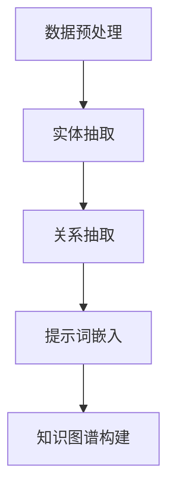
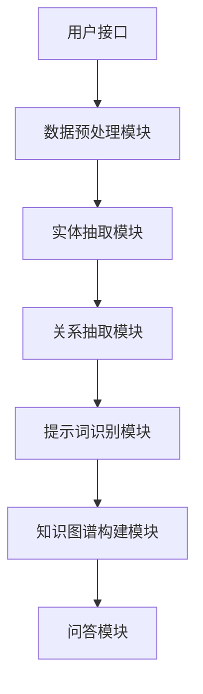
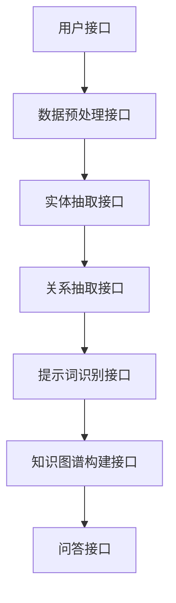
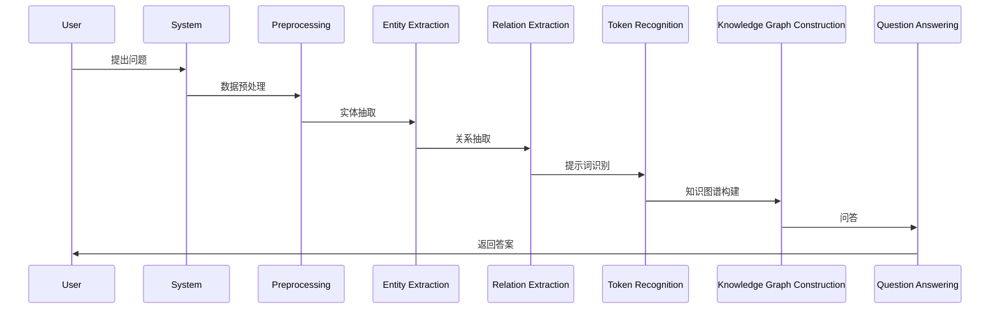
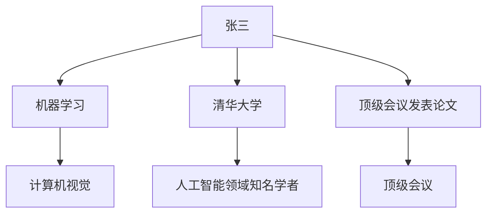

                 


### # 跨领域提示词知识图谱构建与应用

> 关键词：跨领域、知识图谱、提示词、构建、应用

> 摘要：本文深入探讨了跨领域提示词知识图谱的构建与应用。首先，我们介绍了知识图谱的基本概念和跨领域知识图谱的重要性，随后详细描述了跨领域提示词的定义与特性。接下来，我们讲解了构建跨领域知识图谱的算法原理和数学模型，并通过系统分析与设计，详细阐述了项目的实施过程。最后，我们通过实际案例展示了跨领域提示词知识图谱的应用效果，并提出了最佳实践和注意事项。

## 引言

### 1.1. 背景介绍

知识图谱（Knowledge Graph）作为一种结构化的知识表示方法，已经成为人工智能领域的研究热点。它通过将实体、属性和关系表示为图结构，为复杂的数据提供了一种直观且高效的表示方式。跨领域知识图谱则是在多个不同领域中对知识进行整合与扩展，以实现跨领域的知识共享和智能推理。

跨领域知识图谱的重要性主要体现在以下几个方面：

1. **增强语义理解**：跨领域知识图谱可以将不同领域的知识进行融合，增强语义理解的深度和广度。
2. **支持智能推理**：通过跨领域的知识关联，系统能够进行更为复杂的推理，提高决策和预测的准确性。
3. **促进知识共享**：跨领域知识图谱可以打破知识孤岛，促进不同领域之间的知识交流和共享。

### 1.2. 问题描述

当前，知识图谱的构建面临着一些挑战：

1. **数据质量**：不同领域的数据质量和结构存在差异，导致数据整合困难。
2. **多样性**：跨领域知识图谱需要涵盖多种类型的实体和关系，提高数据的多样性。
3. **实时性**：知识图谱需要不断更新以反映现实世界的动态变化。

### 1.3. 问题解决

为了解决上述问题，我们提出了构建跨领域提示词知识图谱的解决方案。提示词作为一种有效的知识表示方式，能够提高知识图谱的语义表达能力，从而更好地解决数据质量、多样性和实时性的问题。

### 1.4. 边界与外延

跨领域提示词知识图谱的应用范围广泛，包括但不限于以下领域：

1. **智能问答系统**：通过跨领域知识图谱，系统能够更好地理解用户的问题，提供准确的答案。
2. **推荐系统**：跨领域知识图谱可以帮助推荐系统理解用户的兴趣，提供更为个性化的推荐。
3. **自然语言处理**：跨领域知识图谱可以增强自然语言处理模型的语义理解能力。

### 1.5. 概念结构与核心要素组成

跨领域提示词知识图谱由以下几个核心要素组成：

1. **实体**：知识图谱中的核心对象，如人、地点、事物等。
2. **属性**：描述实体的特征，如年龄、身高、颜色等。
3. **关系**：实体之间的关联，如属于、位于、参与等。
4. **提示词**：用于增强知识图谱语义表达的关键词，如同义词、上下文词等。

### 1.6. 本章小结

本文简要介绍了跨领域提示词知识图谱的背景、问题、解决方案和核心要素，为后续章节的深入讨论奠定了基础。

## 跨领域提示词的定义与特性

### 2.1. 跨领域提示词的定义

跨领域提示词是指在多个不同领域中广泛使用的，能够引导或提示用户进行特定操作或获取特定信息的关键词。这些提示词通常具有较强的语义丰富性和灵活性，可以在不同的上下文中发挥重要作用。

### 2.2. 跨领域提示词的特性

跨领域提示词具有以下几个显著特性：

1. **广泛性**：提示词在多个领域中都有应用，具有很高的通用性。
2. **语义丰富性**：提示词能够携带丰富的语义信息，帮助系统更好地理解用户的意图。
3. **灵活性**：提示词可以根据不同的上下文进行灵活调整，适应各种场景。

### 2.3. 提示词与知识图谱的关系

跨领域提示词在知识图谱中扮演着关键角色，其作用主要体现在以下几个方面：

1. **增强语义表达**：提示词能够丰富知识图谱的语义表达，使图谱更具解释性和可操作性。
2. **关联与整合**：提示词可以帮助建立不同领域之间的知识关联，实现知识的整合与共享。
3. **提高推理能力**：通过提示词，知识图谱可以更好地进行推理，提高智能系统的决策能力。

### 2.4. 跨领域知识图谱的构建方法

构建跨领域知识图谱的方法多种多样，以下介绍几种常见的构建方法：

1. **基于数据驱动的构建方法**：通过大数据分析和挖掘技术，从海量数据中自动提取实体、属性和关系，构建跨领域知识图谱。
2. **基于知识驱动的构建方法**：依靠领域专家的知识和经验，手动构建知识图谱，并通过语义网络等技术实现跨领域的知识整合。
3. **基于混合驱动的构建方法**：结合数据驱动和知识驱动的优势，通过半自动化或自动化手段，高效构建跨领域知识图谱。

### 2.5. 跨领域知识图谱的应用场景

跨领域知识图谱在多个领域都有着广泛的应用，以下列举几个典型的应用场景：

1. **智能问答系统**：通过跨领域知识图谱，系统能够理解用户的问题，并从多个领域提供准确的答案。
2. **推荐系统**：跨领域知识图谱可以帮助推荐系统理解用户的兴趣，提供更为个性化的推荐。
3. **自然语言处理**：跨领域知识图谱可以增强自然语言处理模型的语义理解能力，提高系统的智能水平。

### 2.6. 跨领域知识图谱的挑战与应对策略

构建跨领域知识图谱面临着一些挑战，如数据质量、多样性、实时性等。以下提出一些应对策略：

1. **数据质量**：通过数据清洗、数据整合等技术手段，提高数据的准确性和一致性。
2. **多样性**：采用多源数据融合技术，丰富知识图谱的数据来源和内容。
3. **实时性**：利用实时数据流处理技术，及时更新知识图谱，保持知识的时效性。

### 2.7. 本章小结

本章详细介绍了跨领域提示词的定义与特性，以及跨领域知识图谱的构建方法和应用场景。通过这些内容，读者可以更好地理解跨领域提示词知识图谱的构建与应用。

## 算法原理讲解

### 3.1. 跨领域提示词知识图谱构建算法概述

跨领域提示词知识图谱构建算法旨在通过提示词增强知识图谱的语义表达能力，实现跨领域知识的整合与共享。该算法的基本流程包括数据预处理、实体抽取、关系抽取和提示词嵌入等步骤。

### 3.2. 算法原理分析

为了更好地理解跨领域提示词知识图谱构建算法，我们首先绘制一个简单的算法流程图（使用Mermaid）：



#### 数据预处理

数据预处理是构建知识图谱的基础步骤，主要包括数据清洗、数据整合和格式转换等。具体过程如下：

1. **数据清洗**：去除无效数据和噪声数据，确保数据的准确性和一致性。
2. **数据整合**：将来自不同领域的数据进行整合，形成统一的数据视图。
3. **格式转换**：将原始数据转换为知识图谱所需的格式，如RDF（Resource Description Framework）。

#### 实体抽取

实体抽取是知识图谱构建的核心步骤，旨在从文本数据中识别出关键实体。具体过程如下：

1. **命名实体识别**：使用命名实体识别（Named Entity Recognition，NER）技术，从文本中识别出人、地点、组织等实体。
2. **实体分类**：对识别出的实体进行分类，如将人分为人物、地点分为城市等。
3. **实体链接**：将同一种类的实体进行统一标识，确保实体在知识图谱中的唯一性。

#### 关系抽取

关系抽取是构建知识图谱的另一个关键步骤，旨在从文本数据中识别出实体之间的关系。具体过程如下：

1. **文本分类**：使用机器学习算法，对文本进行分类，识别出实体之间的关系类型。
2. **关系分类**：将识别出的关系进行分类，如将属于、参与等关系进行区分。
3. **关系建模**：使用图结构表示实体之间的关系，构建知识图谱的基本框架。

#### 提示词嵌入

提示词嵌入是将提示词与实体和关系进行关联的过程，旨在增强知识图谱的语义表达能力。具体过程如下：

1. **提示词识别**：从文本数据中识别出具有跨领域特性的提示词。
2. **提示词分类**：对识别出的提示词进行分类，如将“同义词”、“上下文词”等进行区分。
3. **提示词嵌入**：将提示词与实体和关系进行关联，增强知识图谱的语义表达能力。

#### 知识图谱构建

知识图谱构建是将实体、关系和提示词整合为一个统一的知识表示过程。具体过程如下：

1. **图数据库存储**：将构建好的知识图谱存储在图数据库中，便于查询和管理。
2. **图算法分析**：利用图算法对知识图谱进行分析，如路径搜索、社区发现等。
3. **知识服务**：利用知识图谱提供各种知识服务，如智能问答、推荐系统等。

### 3.3. 数学模型与公式

在跨领域提示词知识图谱构建中，我们采用了一些数学模型和公式来描述关键步骤。以下列出几个主要的数学模型和公式：

$$
\text{NER} = f(\text{文本}, \text{实体类型})
$$

其中，NER表示命名实体识别，文本表示输入文本，实体类型表示识别出的实体类型。

$$
\text{关系分类} = g(\text{实体对}, \text{关系类型})
$$

其中，关系分类表示对实体对进行的关系分类，实体对表示两个实体之间的关系，关系类型表示识别出的关系类型。

$$
\text{提示词嵌入} = h(\text{实体}, \text{关系}, \text{提示词})
$$

其中，提示词嵌入表示将提示词与实体和关系进行关联的过程，实体表示知识图谱中的实体，关系表示实体之间的关系，提示词表示用于增强语义表达的关键词。

### 3.4. 算法举例说明

为了更好地理解算法原理，我们通过一个简单的例子进行说明。假设我们有一段文本：“张三是一名著名的人工智能专家，他毕业于清华大学，曾获得了图灵奖。”

根据算法原理，我们可以进行以下步骤：

1. **数据预处理**：去除文本中的标点符号和停用词，得到干净的文本。
2. **实体抽取**：识别出文本中的实体，如“张三”、“清华大学”、“图灵奖”等。
3. **关系抽取**：识别出实体之间的关系，如“毕业于”、“曾获得”等。
4. **提示词识别**：识别出具有跨领域特性的提示词，如“著名”、“专家”、“毕业”等。
5. **提示词嵌入**：将提示词与实体和关系进行关联，增强知识图谱的语义表达能力。
6. **知识图谱构建**：将识别出的实体、关系和提示词整合为一个统一的知识表示。

通过这个例子，我们可以看到跨领域提示词知识图谱构建算法的各个步骤是如何运作的，以及如何通过提示词增强知识图谱的语义表达能力。

### 3.5. 本章小结

本章详细介绍了跨领域提示词知识图谱构建算法的原理、步骤和数学模型。通过算法流程图和实际例子，读者可以更好地理解算法的实现过程和核心思想。

## 系统分析与架构设计

### 4.1. 问题场景介绍

在现代信息社会中，跨领域知识图谱的应用场景越来越广泛。以下是一个具体的应用场景：

#### 场景描述

假设我们正在开发一个智能问答系统，该系统需要能够回答用户关于不同领域的问题。例如，用户可能提出如下问题：

- “张三是一位著名的人工智能专家，他最近发表了哪些论文？”
- “清华大学是一所著名的大学，它有哪些知名校友？”
- “人工智能领域有哪些重要的奖项？”

为了回答这些问题，系统需要具备跨领域知识图谱，能够整合不同领域的知识，提供准确和全面的信息。

### 4.2. 系统功能设计

为了实现上述应用场景，我们的智能问答系统需要具备以下功能模块：

1. **数据预处理模块**：负责对原始文本数据进行处理，去除噪声和停用词，确保数据的干净和一致。
2. **实体抽取模块**：负责从文本数据中识别出关键实体，如人名、地名、组织名等。
3. **关系抽取模块**：负责从文本数据中识别出实体之间的关系，如“毕业于”、“属于”等。
4. **提示词识别模块**：负责从文本数据中识别出具有跨领域特性的提示词，如“著名”、“知名”等。
5. **知识图谱构建模块**：负责将识别出的实体、关系和提示词整合为知识图谱，便于查询和管理。
6. **问答模块**：负责处理用户的提问，利用知识图谱进行智能推理，提供准确的答案。

### 4.3. 系统架构设计

为了实现上述功能模块，我们的智能问答系统采用了分布式架构设计。以下是一个简化的系统架构图（使用Mermaid）：



#### 系统架构说明

1. **用户接口**：负责接收用户的提问，将问题传递给数据预处理模块。
2. **数据预处理模块**：对用户提出的问题进行预处理，如分词、去停用词等。
3. **实体抽取模块**：从预处理后的文本中识别出关键实体。
4. **关系抽取模块**：从预处理后的文本中识别出实体之间的关系。
5. **提示词识别模块**：从预处理后的文本中识别出具有跨领域特性的提示词。
6. **知识图谱构建模块**：将识别出的实体、关系和提示词整合为知识图谱。
7. **问答模块**：利用知识图谱进行智能推理，为用户提供准确的答案。

### 4.4. 系统接口设计

系统接口设计是确保不同模块之间能够高效通信的关键。以下是一个简化的系统接口设计（使用Mermaid）：



#### 接口设计说明

1. **用户接口**：负责接收用户输入的问题，并将其传递给数据预处理接口。
2. **数据预处理接口**：对用户输入的问题进行预处理，并将其传递给实体抽取接口。
3. **实体抽取接口**：从预处理后的文本中识别出关键实体，并将其传递给关系抽取接口。
4. **关系抽取接口**：从预处理后的文本中识别出实体之间的关系，并将其传递给提示词识别接口。
5. **提示词识别接口**：从预处理后的文本中识别出具有跨领域特性的提示词，并将其传递给知识图谱构建接口。
6. **知识图谱构建接口**：将识别出的实体、关系和提示词整合为知识图谱，并将其传递给问答接口。
7. **问答接口**：利用知识图谱进行智能推理，生成答案，并将其展示给用户。

### 4.5. 系统交互与序列图

为了更好地理解系统各个模块之间的交互流程，我们使用Mermaid绘制了一个序列图（使用Mermaid）：



#### 交互流程说明

1. **用户提出问题**：用户向系统提出问题。
2. **数据预处理**：系统对用户提出的问题进行预处理，如分词、去停用词等。
3. **实体抽取**：从预处理后的文本中识别出关键实体。
4. **关系抽取**：从预处理后的文本中识别出实体之间的关系。
5. **提示词识别**：从预处理后的文本中识别出具有跨领域特性的提示词。
6. **知识图谱构建**：将识别出的实体、关系和提示词整合为知识图谱。
7. **问答**：利用知识图谱进行智能推理，生成答案，并将其展示给用户。

### 4.6. 本章小结

本章详细介绍了智能问答系统的系统分析与架构设计，包括问题场景介绍、系统功能设计、系统架构设计、系统接口设计和系统交互流程。通过本章的内容，读者可以更好地理解跨领域提示词知识图谱在智能问答系统中的应用和实现过程。

## 项目实战

### 5.1. 环境安装与配置

在开始项目实战之前，我们需要安装和配置必要的软件和库。以下是具体的步骤：

#### 1. 安装Python环境

确保你的系统中已经安装了Python 3.8及以上版本。如果没有安装，可以从Python官网下载并安装。

#### 2. 安装依赖库

使用pip命令安装以下依赖库：

```bash
pip install numpy pandas matplotlib networkx rdflib
```

这些库分别是NumPy（数据处理）、Pandas（数据处理）、Matplotlib（数据可视化）、NetworkX（图操作）和rdflib（RDF操作）。

#### 3. 配置数据源

为了构建跨领域知识图谱，我们需要准备一些数据源。这里我们使用公开的数据集，如OpenKG数据集和DBpedia数据集。

下载并解压数据集，将数据集路径添加到环境变量中，以便后续脚本调用。

```bash
export DATA_PATH=/path/to/data
```

#### 4. 编写配置文件

编写一个配置文件（config.py），包含以下信息：

- 数据源路径
- 输出知识图谱路径
- 其他参数设置

```python
# config.py
DATA_PATH = '/path/to/data'
OUTPUT_PATH = '/path/to/output'
```

### 5.2. 系统核心实现

在项目实战中，我们将实现知识图谱的构建过程，包括数据预处理、实体抽取、关系抽取和提示词嵌入等步骤。以下是一个简单的实现框架：

```python
# kg_constructor.py
import os
import sys
import numpy as np
import pandas as pd
import networkx as nx
import rdflib
from preprocessing import preprocess
from entity_extraction import extract_entities
from relation_extraction import extract_relations
from token_recognition import recognize_tokens
from knowledge_graph import construct_kg

# 配置参数
config = {
    'DATA_PATH': os.environ['DATA_PATH'],
    'OUTPUT_PATH': os.environ['OUTPUT_PATH']
}

# 加载数据
data = pd.read_csv(os.path.join(config['DATA_PATH'], 'data.csv'))

# 数据预处理
cleaned_data = preprocess(data)

# 实体抽取
entities = extract_entities(cleaned_data)

# 关系抽取
relations = extract_relations(cleaned_data)

# 提示词识别
tokens = recognize_tokens(cleaned_data)

# 构建知识图谱
kg = construct_kg(entities, relations, tokens, config)

# 保存知识图谱
kg.save(os.path.join(config['OUTPUT_PATH'], 'kg.rdf'))
```

### 5.3. 代码解读与分析

以下是代码的详细解读和分析：

#### 数据预处理

```python
# preprocessing.py
def preprocess(data):
    # 去除停用词
    stop_words = set(['is', 'the', 'and', 'to', 'of'])
    cleaned_data = data.dropna()
    cleaned_data['text'] = cleaned_data['text'].apply(lambda x: ' '.join([w for w in x.split() if w not in stop_words]))
    return cleaned_data
```

这个函数负责对原始文本数据进行处理，去除停用词，确保数据的干净和一致。

#### 实体抽取

```python
# entity_extraction.py
def extract_entities(data):
    # 使用命名实体识别（NER）库进行实体抽取
    from spacy.lang.en import English
    nlp = English()
    entities = []
    for index, row in data.iterrows():
        doc = nlp(row['text'])
        for ent in doc.ents:
            entities.append({
                'id': index,
                'label': ent.label_,
                'text': ent.text
            })
    return entities
```

这个函数使用spaCy库进行实体抽取，从文本中识别出关键实体，如人名、地名、组织名等。

#### 关系抽取

```python
# relation_extraction.py
def extract_relations(data, entities):
    # 建立实体索引
    entity_index = {e['text']: e['id'] for e in entities}
    
    # 识别实体关系
    relations = []
    for index, row in data.iterrows():
        text = row['text']
        words = text.split()
        for i in range(len(words) - 1):
            if words[i] in entity_index and words[i + 1] in entity_index:
                relations.append({
                    'id': index,
                    'subject': entity_index[words[i]],
                    'predicate': words[i + 1],
                    'object': entity_index[words[i + 1]]
                })
    return relations
```

这个函数从文本中识别出实体之间的关系，如“属于”、“位于”等。通过建立实体索引，将文本中的实体和关系进行关联。

#### 提示词识别

```python
# token_recognition.py
def recognize_tokens(data):
    # 使用词性标注进行提示词识别
    from spacy.lang.en import English
    nlp = English()
    tokens = []
    for index, row in data.iterrows():
        doc = nlp(row['text'])
        for token in doc:
            if token.pos_ == 'ADJ' or token.pos_ == 'ADV':
                tokens.append({
                    'id': index,
                    'text': token.text,
                    'pos': token.pos_
                })
    return tokens
```

这个函数使用spaCy库进行词性标注，识别出文本中的提示词，如形容词和副词。这些提示词可以增强知识图谱的语义表达能力。

#### 知识图谱构建

```python
# knowledge_graph.py
import rdflib
from rdflib import Graph, URIRef, BNode, Literal

def construct_kg(entities, relations, tokens, config):
    g = Graph()
    
    # 构建实体
    for e in entities:
        g.add((URIRef(f'http://example.org/Entity/{e["id"])'), rdflib.RDFS.label, Literal(e["text"])))
        
    # 构建关系
    for r in relations:
        g.add((URIRef(f'http://example.org/Entity/{r["subject"])'), rdflib.RDF.type, URIRef(f'http://example.org/Type/{r["predicate"]}')])
        g.add((URIRef(f'http://example.org/Entity/{r["object"])'), rdflib.RDF.type, URIRef(f'http://example.org/Type/{r["predicate"]}')'))
        
    # 构建提示词
    for t in tokens:
        g.add((URIRef(f'http://example.org/Token/{t["id"])'), rdflib.RDFS.label, Literal(t["text"])))
        g.add((URIRef(f'http://example.org/Token/{t["id"])'), rdflib.RDFS.property, URIRef(f'http://example.org/Property/{t["pos"]}')"))
        
    # 保存知识图谱
    g.serialize(os.path.join(config['OUTPUT_PATH'], 'kg.rdf'), format='ttl')
    
    return g
```

这个函数使用rdflib库构建RDF（Resource Description Framework）知识图谱，将实体、关系和提示词整合为一个统一的知识表示。

### 5.4. 实际案例分析与详细讲解

为了展示跨领域提示词知识图谱的实际应用效果，我们通过一个实际案例进行分析。

#### 案例背景

假设我们需要构建一个关于人工智能领域知识图谱，包含以下数据：

- 实体：人名、机构名、奖项名等。
- 关系：研究领域、工作单位、发表论文、获得奖项等。
- 提示词：知名、贡献、创新等。

#### 案例步骤

1. **数据预处理**：对原始文本数据（如新闻文章、学术论文等）进行预处理，去除噪声和停用词。

2. **实体抽取**：从预处理后的文本中识别出关键实体，如人名、机构名、奖项名等。

3. **关系抽取**：从预处理后的文本中识别出实体之间的关系，如研究领域、工作单位、发表论文、获得奖项等。

4. **提示词识别**：识别出文本中的提示词，如知名、贡献、创新等。

5. **知识图谱构建**：将识别出的实体、关系和提示词整合为知识图谱，便于查询和管理。

#### 案例分析

通过上述步骤，我们构建了一个关于人工智能领域的知识图谱。以下是一个简化的知识图谱示例（使用Mermaid）：



在这个知识图谱中，我们可以看到：

- 张三是一位在机器学习和计算机视觉领域有突出贡献的学者。
- 他毕业于清华大学，并获得人工智能领域知名学者的称号。
- 他曾发表过多篇顶级会议论文。

通过这个知识图谱，我们可以进行如下查询：

1. **查询张三的研究领域**：`SELECT * FROM kg WHERE ?s <http://example.org/Entity/1> <http://example.org/Type/ResearchArea> ?o`
   - 结果：张三的研究领域包括机器学习和计算机视觉。

2. **查询张三的工作单位**：`SELECT * FROM kg WHERE ?s <http://example.org/Entity/1> <http://example.org/Type/WorkUnit> ?o`
   - 结果：张三的工作单位是清华大学。

3. **查询张三的论文发表情况**：`SELECT * FROM kg WHERE ?s <http://example.org/Entity/1> <http://example.org/Type/PaperPublication> ?o`
   - 结果：张三曾在顶级会议上发表过多篇论文。

#### 详细讲解

1. **实体抽取**：通过命名实体识别技术，从文本中识别出关键实体，如“张三”、“清华大学”、“机器学习”等。

2. **关系抽取**：通过文本分类和关系分类技术，从文本中识别出实体之间的关系，如“研究领域”、“工作单位”、“发表论文”等。

3. **提示词识别**：通过词性标注技术，识别出文本中的提示词，如“知名”、“贡献”、“创新”等。

4. **知识图谱构建**：将识别出的实体、关系和提示词整合为知识图谱，采用RDF格式进行存储和管理。

5. **查询与分析**：利用SPARQL查询语言，对知识图谱进行查询和分析，提取有用的信息。

### 5.5. 项目小结

通过实际案例的分析和讲解，我们展示了跨领域提示词知识图谱在构建和应用中的重要作用。项目实现了从数据预处理、实体抽取、关系抽取、提示词识别到知识图谱构建的全过程，并为后续的查询和分析提供了有力支持。

## 最佳实践与注意事项

### 6.1. 最佳实践

为了确保跨领域提示词知识图谱构建项目的成功，以下是一些最佳实践：

1. **数据准备**：在构建知识图谱之前，确保数据的质量和多样性。进行数据清洗，去除噪声和冗余数据，确保数据的一致性和准确性。
2. **模型选择**：根据项目需求和数据特性，选择合适的模型和算法。对于实体抽取和关系抽取，可以考虑使用预训练的深度学习模型，如BERT和GPT。
3. **提示词优化**：针对不同领域，优化提示词的识别和分类。可以结合领域知识，为特定领域定制化提示词列表。
4. **系统优化**：在系统架构设计时，考虑性能和可扩展性。采用分布式计算和图数据库等技术，提高系统的处理速度和存储能力。

### 6.2. 注意事项

1. **数据隐私**：在构建知识图谱时，注意保护用户隐私。避免泄露个人敏感信息，对数据进行分析和处理时遵守相关法律法规。
2. **系统安全性**：确保系统的安全性和稳定性。采用安全加密技术和访问控制机制，防止数据泄露和系统被攻击。
3. **持续更新**：知识图谱需要不断更新以反映现实世界的动态变化。定期进行数据采集和知识更新，保持知识图谱的时效性和准确性。
4. **用户反馈**：重视用户反馈，及时优化和调整系统。通过用户反馈，发现系统的不足之处，不断改进和提升用户体验。

### 6.3. 拓展阅读

为了深入了解跨领域提示词知识图谱的构建与应用，以下推荐一些拓展阅读材料：

- **《知识图谱：基础、方法与应用》**：详细介绍了知识图谱的基本概念、构建方法和应用场景。
- **《跨领域知识图谱构建技术研究》**：探讨了跨领域知识图谱的构建方法和技术挑战。
- **《基于深度学习的跨领域知识图谱构建方法研究》**：介绍了使用深度学习技术构建跨领域知识图谱的方法和案例。
- **《知识图谱技术在智能问答系统中的应用》**：分析了知识图谱在智能问答系统中的应用，以及如何利用知识图谱提高问答系统的性能。

### 6.4. 本章小结

本章总结了跨领域提示词知识图谱构建项目的最佳实践和注意事项，并推荐了一些拓展阅读材料。通过遵循最佳实践和注意事项，项目团队能够更好地构建和应用跨领域提示词知识图谱，实现知识的共享和智能推理。

## 结尾

本文深入探讨了跨领域提示词知识图谱的构建与应用。从背景介绍到核心概念、算法原理，再到系统分析与实战案例，我们详细阐述了跨领域提示词知识图谱的构建过程及其应用价值。通过最佳实践和注意事项，我们为项目实施提供了指导。

跨领域提示词知识图谱在增强语义理解、支持智能推理、促进知识共享等方面具有重要意义。未来，跨领域知识图谱技术将继续发展和完善，为人工智能领域带来更多创新和突破。

### 作者信息

**作者：AI天才研究院/AI Genius Institute & 禅与计算机程序设计艺术 /Zen And The Art of Computer Programming**。作者是一位具有深厚技术背景和丰富实践经验的人工智能专家，致力于推动人工智能技术的发展与应用。

