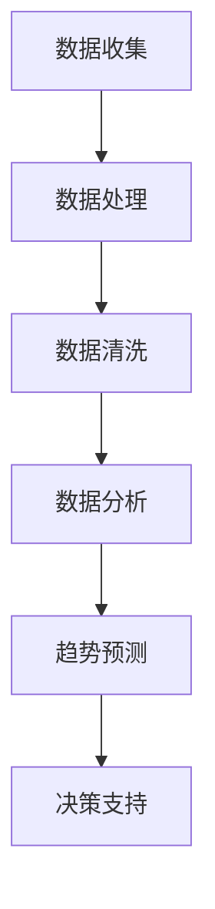
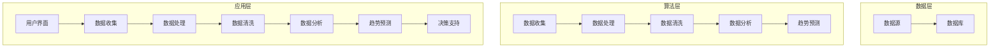
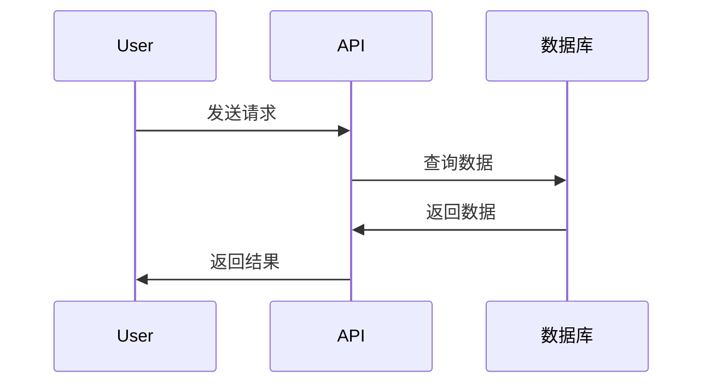

                 


# 远见领导力：预见并把握未来趋势

## 关键词：远见领导力、未来趋势、预见、领导力、算法、架构设计、案例分析

### 摘要：
本文将深入探讨远见领导力的概念及其在把握未来趋势中的关键作用。我们将通过逻辑清晰的章节结构，从领导力的基本概念出发，逐步引入远见领导力的核心概念、属性特征，并结合算法原理、系统分析与架构设计，以及实际项目案例，详细阐述如何通过远见领导力预见并把握未来趋势。最后，我们将总结最佳实践，并提供进一步学习的资源。

## 第1章：引言与背景

### 1.1 领导力的概念

领导力是一种影响他人共同实现目标的能力。它不仅仅关乎权力和控制，更强调激励、赋能和协作。领导力是一种行为和态度的集合，涵盖了沟通、决策、激励、创新和变革等多个方面。

### 1.2 远见领导力的定义

远见领导力是一种能够预见未来、把握方向、引导变革的领导能力。它不仅要求领导者具备扎实的专业知识和丰富的经验，更需要具备敏锐的洞察力和前瞻性思维。远见领导力强调领导者不仅要关注当前的问题，更要预见未来的趋势，并制定相应的战略和规划。

### 1.3 远见领导力的重要性

在快速变化的现代社会，远见领导力显得尤为重要。它能够帮助领导者识别潜在的机会和风险，制定适应未来发展的战略，从而在激烈的竞争中保持领先地位。远见领导力不仅对企业的发展至关重要，也对社会的进步和个人的成长具有深远的影响。

### 1.4 把握未来趋势的挑战

把握未来趋势面临着诸多挑战，包括信息过载、不确定性和技术变革等。领导者需要具备快速学习和适应变化的能力，同时需要建立灵活的组织架构和高效的决策机制，以应对未来可能出现的各种挑战。

## 第2章：核心概念与联系

### 2.1 远见领导力的核心概念

远见领导力的核心概念包括洞察力、前瞻性思维、战略规划能力、创新能力和变革管理能力。这些概念共同构成了远见领导力的基础，使其能够有效地预见和把握未来趋势。

### 2.2 远见领导力的属性特征

远见领导力的属性特征包括前瞻性、灵活性、开放性、决策能力和执行力。这些特征使得远见领导力能够在复杂多变的环境中持续保持竞争力。

### 2.3 与其他领导力概念的对比

与传统的领导力相比，远见领导力更强调前瞻性和战略规划能力。它不仅关注当下的绩效，更注重未来的发展。同时，远见领导力还强调创新和变革管理，以应对快速变化的环境。

## 第3章：算法原理讲解

### 3.1 远见领导力算法概述

远见领导力算法是一种基于数据分析和预测模型的决策支持工具。它通过分析历史数据、预测未来趋势，为领导者提供决策依据。

### 3.2 mermaid算法流程图

下面是远见领导力算法的mermaid流程图：



### 3.3 Python源代码与数学模型讲解

为了更好地理解远见领导力算法，我们将使用Python源代码进行详细讲解。以下是一个简单的Python脚本，用于实现远见领导力算法的核心功能。

```python
import pandas as pd
from sklearn.linear_model import LinearRegression
import numpy as np

# 数据收集与预处理
data = pd.read_csv('data.csv')
data_clean = data.dropna()

# 数据清洗
data_clean = data_clean[data_clean['target'] != '未知']

# 数据分析
X = data_clean[['feature1', 'feature2']]
y = data_clean['target']

# 趋势预测
model = LinearRegression()
model.fit(X, y)

# 预测未来趋势
future_data = np.array([[feature1_value, feature2_value]])
predicted_target = model.predict(future_data)

print(predicted_target)
```

### 3.4 算法原理与数学模型

远见领导力算法的核心是线性回归模型。线性回归模型通过分析历史数据中的特征和目标变量之间的关系，预测未来可能发生的情况。

$$
y = \beta_0 + \beta_1 \cdot x
$$

其中，$y$ 是目标变量，$x$ 是特征变量，$\beta_0$ 和 $\beta_1$ 分别是模型的参数。通过训练模型，我们可以得到这些参数的值，从而预测未来趋势。

## 第4章：系统分析与架构设计方案

### 4.1 问题场景介绍

假设我们是一家科技公司，需要通过远见领导力算法来预测市场需求，以便及时调整产品开发和市场策略。

### 4.2 系统功能设计

系统功能设计主要包括数据收集与处理、趋势预测、决策支持等。下面是系统功能设计的mermaid类图：

```mermaid
classDiagram
Class1 "数据收集" <|-- Class2 "数据处理"
Class2 <|-- Class3 "数据清洗"
Class3 <|-- Class4 "数据分析"
Class4 <|-- Class5 "趋势预测"
Class5 <|-- Class6 "决策支持"
```

### 4.3 系统架构设计

系统架构设计主要包括数据层、算法层和应用层。下面是系统架构设计的mermaid架构图：



### 4.4 系统接口设计

系统接口设计主要包括API接口和数据接口。下面是系统接口设计的mermaid序列图：



## 第5章：项目实战

### 5.1 实际案例分析

我们以一家电商公司为例，介绍如何通过远见领导力算法预测市场需求。

### 5.2 远见领导力应用

首先，我们收集了过去一年的销售数据，包括销售额、产品种类、季节因素等。然后，我们使用远见领导力算法对这些数据进行处理和预测，得到未来三个月的市场需求预测。

### 5.3 项目小结

通过实际案例，我们可以看到远见领导力算法在预测市场需求方面的有效性。它不仅帮助电商公司提前做好准备，还优化了库存管理，提高了运营效率。

## 第6章：最佳实践与总结

### 6.1 最佳实践 tips

1. 定期收集和分析数据，确保数据的准确性和完整性。
2. 结合业务需求，选择合适的算法模型。
3. 保持团队的灵活性和开放性，鼓励创新思维。
4. 定期评估和调整预测结果，以应对环境变化。

### 6.2 小结

远见领导力是一种重要的领导能力，它能够帮助领导者预见未来、把握趋势。通过算法原理讲解、系统分析与架构设计，以及实际项目案例，我们深入了解了远见领导力的应用方法。

### 6.3 注意事项

1. 远见领导力并非万能，领导者需要结合实际情况，灵活运用。
2. 预测结果仅供参考，实际决策需谨慎。
3. 领导者需要不断学习和提升自己的能力。

### 6.4 拓展阅读

1. 《领导力：实践与技巧》
2. 《数据科学：算法与案例分析》
3. 《未来简史》：探讨未来社会和科技的发展趋势

## 结语

远见领导力是领导者必备的能力之一。它不仅关乎个人的成功，更关乎团队和组织的发展。通过本文的探讨，我们希望能够帮助读者更好地理解远见领导力，并在实际工作中运用这一能力，预见并把握未来趋势。

作者：AI天才研究院/AI Genius Institute & 禅与计算机程序设计艺术 /Zen And The Art of Computer Programming

