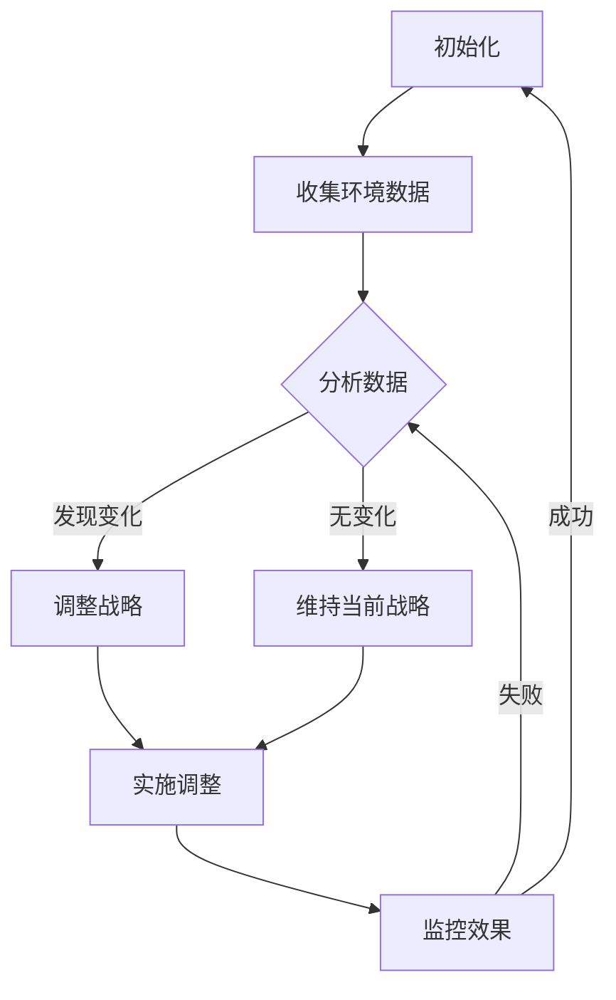

                 

### 文章标题

“适应性战略：在变化中保持组织竞争力”

### 关键词

- 适应性战略
- 组织竞争力
- 变化管理
- 战略规划
- 柔性与敏捷性

### 摘要

在瞬息万变的商业环境中，企业必须具备强大的适应能力才能保持竞争力。本文深入探讨了适应性战略的概念、原理以及实施方法。通过分析企业面临的外部与内部变化，本文阐述了适应性战略的核心要素，并借助实际案例，详细解释了如何设计、实施和优化适应性战略，帮助企业从容应对变化，保持持续竞争力。

## 第1章: 背景与核心概念

### 1.1.1 问题背景

在当今全球化、技术驱动的商业环境中，企业面临着前所未有的动态变化。市场竞争的加剧、技术的快速迭代、客户需求的多样化以及法律法规的变化，使得企业传统的战略规划变得难以应对。企业不仅需要在短时间内做出决策，还需要具备快速调整和适应能力，以确保其业务持续健康发展。

### 1.1.2 核心概念

#### 适应性战略的定义

适应性战略（Adaptive Strategy）是指企业通过不断地调整和优化其业务模式、组织结构和管理流程，以适应外部环境和内部变化的一种战略。它强调灵活性和敏捷性，使企业能够迅速响应市场变化，抓住新的机遇。

#### 适应性战略的关键要素

1. **柔性与敏捷性**：组织具备快速调整的能力，以应对不确定的外部环境。
2. **学习能力**：组织通过不断学习新知识、新技能来提高自身的适应能力。
3. **快速决策**：组织能够迅速做出决策，以抓住市场机遇。
4. **资源配置**：组织能够根据变化的情况灵活调整资源，确保关键业务得到有效支持。

#### 适应性战略与传统战略的区别

传统战略注重长期规划，强调稳定性和可持续性。而适应性战略则更注重短期和长期相结合，强调灵活性和快速响应。传统战略适用于相对稳定的环境，而适应性战略则适用于快速变化的环境。

## 第1.2章: 企业面临的变化

### 1.2.1 外部环境变化

企业外部环境的变化主要体现在以下几个方面：

1. **市场竞争加剧**：随着全球化进程的加快，市场竞争愈发激烈。企业需要不断调整其战略，以保持市场竞争力。
2. **技术革新**：技术的快速迭代使得企业必须不断更新其技术栈，以适应新的市场需求。
3. **客户需求多样化**：客户需求日益多样化，企业需要提供更加个性化、差异化的产品和服务。
4. **法律法规变化**：法律法规的变化对企业的业务运营产生重大影响，企业需要密切关注法律法规的变化，及时进行调整。

### 1.2.2 内部环境变化

企业内部环境的变化主要体现在以下几个方面：

1. **组织结构调整**：随着外部环境的变化，企业需要不断调整其组织结构，以提高组织效率和响应速度。
2. **文化变革**：企业需要建立与适应能力相匹配的企业文化，鼓励员工创新和合作。
3. **人员流动**：人员流动对企业的人力资源管理产生影响，企业需要确保关键人才不流失。
4. **资源分配调整**：企业需要根据业务需求的变化，灵活调整资源的分配，确保关键业务得到有效支持。

## 第1.3章: 核心概念与联系

### 1.3.1 适应性战略原理

适应性战略的核心在于柔性与敏捷性。企业需要通过以下步骤来建立适应性战略：

1. **确定目标与愿景**：明确企业的长远目标和发展愿景，为适应性战略的实施提供方向。
2. **构建适应机制**：建立适应外部变化的组织机制，包括组织结构、企业文化、管理制度等。
3. **培养学习能力**：通过培训、学习和实践，提高员工的专业能力和适应能力。
4. **实施快速决策**：建立快速决策机制，确保企业能够迅速响应外部环境的变化。
5. **优化资源配置**：根据业务需求的变化，灵活调整资源分配，确保关键业务得到充分支持。

### 1.3.2 概念属性特征对比

#### 传统战略与适应性战略

| 特征 | 传统战略 | 适应性战略 |
| ---- | ---- | ---- |
| **目标** | 长期规划 | 短期与长期相结合 |
| **稳定性** | 稳定性强 | 灵活性强 |
| **灵活性** | 灵活性较低 | 灵活性较高 |
| **响应速度** | 响应速度慢 | 响应速度快 |

#### 风险管理战略与适应性战略

| 特征 | 风险管理战略 | 适应性战略 |
| ---- | ---- | ---- |
| **风险管理** | 风险控制为主 | 风险管理为主 |
| **适应性** | 适应能力较弱 | 适应能力较强 |

#### 财务战略与适应性战略

| 特征 | 财务战略 | 适应性战略 |
| ---- | ---- | ---- |
| **资金配置** | 长期资金规划 | 短期与长期相结合的资金配置 |
| **风险承受** | 风险承受能力较弱 | 风险承受能力较强 |

### 1.3.3 ER实体关系图

```mermaid
erDiagram
  产品 -->|1| 市场
  员工 -->|1| 组织
  技术 -->|1| 产品
  客户 -->|1| 销售
  法律法规 -->|1| 企业
```

在这个ER实体关系图中，展示了产品、市场、员工、技术、客户和法律法规等关键实体的关系。产品与市场之间存在直接关系，员工是组织的重要组成部分，技术与产品密切相关，客户是企业销售的目标，而法律法规对企业运营具有约束力。

## 第1.4章: 适应性战略的算法原理

### 1.4.1 适应性战略算法

适应性战略算法的核心在于如何快速响应外部环境的变化，并根据变化情况调整企业的战略方向。以下是一个简化的适应性战略算法流程：



### 1.4.2 数学模型和公式

适应性战略的数学模型可以表示为：

$$\text{适应性战略} = f(\text{环境数据}, \text{学习能力}, \text{决策速度}, \text{资源配置})$$

其中，$f$ 表示适应能力的函数，取决于环境数据、学习能力、决策速度和资源配置。

### 1.4.3 举例说明

假设企业A在市场上面临竞争对手的挑战，其市场份额逐渐下降。企业A通过以下步骤实施适应性战略：

1. **收集环境数据**：分析竞争对手的产品、市场份额、定价策略等。
2. **分析数据**：发现竞争对手的优势和劣势，以及自身在市场中的定位。
3. **调整战略**：决定降低产品价格、提高产品性能或开发新的产品线。
4. **实施调整**：根据调整后的战略，进行资源配置和决策执行。
5. **监控效果**：评估调整后的战略效果，根据反馈进行进一步调整。

通过这一案例，我们可以看到适应性战略在企业应对市场变化中的应用。企业需要根据实时数据进行分析，快速做出调整，以保持竞争力。

## 第2章: 适应性战略的设计与实施

### 2.1.1 战略规划

战略规划是适应性战略设计的重要环节。企业需要通过以下步骤进行战略规划：

1. **确定目标与愿景**：明确企业的长远目标和发展愿景，为战略规划提供方向。
2. **分析外部环境**：了解市场趋势、竞争态势、技术发展等外部因素。
3. **评估内部能力**：分析企业的核心竞争力、资源状况、组织结构等内部因素。
4. **制定策略与路径**：根据目标和外部环境，制定具体的策略和实施路径。

### 2.1.2 灵活性与敏捷性

#### 灵活性

灵活性是指企业能够快速调整其业务模式、组织结构和管理流程，以适应外部环境的变化。企业需要通过以下方式提高灵活性：

1. **简化组织结构**：减少层级，提高决策效率。
2. **优化业务流程**：消除冗余环节，提高业务流程的效率。
3. **灵活的资源配置**：根据业务需求，灵活调整资源的配置。

#### 敏捷性

敏捷性是指企业能够快速响应市场变化，抓住新的机遇。企业需要通过以下方式提高敏捷性：

1. **建立敏捷团队**：鼓励员工跨部门合作，提高团队协作效率。
2. **实施敏捷开发**：采用敏捷开发方法，缩短产品开发周期。
3. **提高学习能力**：通过培训和不断学习，提高员工的专业能力和适应能力。

### 2.2.1 实施步骤

#### 实施前的准备

在实施适应性战略之前，企业需要进行充分的准备工作：

1. **明确实施目标**：明确适应性战略实施的具体目标和预期效果。
2. **制定实施计划**：根据实施目标，制定详细的实施计划和时间表。
3. **组建实施团队**：组建专业的实施团队，明确各成员的职责和任务。

#### 制定实施计划

实施计划包括以下主要内容：

1. **项目启动**：召开启动会议，宣布实施计划的正式启动。
2. **项目执行**：按照实施计划，逐步推进项目的实施。
3. **项目监控**：定期对项目进展进行监控，确保项目按计划进行。
4. **项目收尾**：项目完成后，进行总结和评估，为后续实施提供经验教训。

#### 执行与监控

在执行过程中，企业需要确保以下事项：

1. **确保执行力**：建立严格的执行机制，确保各项任务得到有效执行。
2. **实时监控**：通过实时监控，及时发现问题并采取措施进行解决。
3. **反馈机制**：建立有效的反馈机制，确保项目执行过程中能够及时获取反馈信息。

### 2.2.2 组织响应能力

#### 建立快速响应机制

企业需要建立快速响应机制，以应对外部环境的变化：

1. **建立快速响应团队**：建立专门的快速响应团队，负责对外部环境的变化进行快速响应。
2. **实时数据收集**：通过实时数据收集系统，及时获取外部环境的变化信息。
3. **快速决策**：建立快速决策机制，确保在短时间内做出科学合理的决策。

#### 提高组织学习能力

企业需要通过以下方式提高组织学习能力：

1. **鼓励创新**：建立创新文化，鼓励员工提出新想法和解决方案。
2. **持续学习**：提供培训和学习机会，帮助员工不断提升专业能力和适应能力。
3. **经验分享**：通过经验分享和知识管理，积累和传播组织的经验教训。

#### 促进内部沟通与协作

企业需要通过以下方式促进内部沟通与协作：

1. **建立沟通机制**：建立有效的沟通机制，确保信息在企业内部畅通无阻。
2. **跨部门协作**：鼓励跨部门协作，提高组织整体协调能力。
3. **团队合作**：通过团队合作，提高项目执行效率和质量。

### 2.2.3 管理变革

#### 变革管理的重要性

适应性战略的实施本质上是一种变革。有效的变革管理对于适应性战略的成功至关重要。企业需要认识到变革管理的重要性，并采取以下措施：

1. **领导力**：领导者的角色至关重要，他们需要带头推动变革，树立榜样。
2. **沟通**：通过有效的沟通，让员工了解变革的必要性和意义，减少抵触情绪。
3. **激励**：通过激励措施，激发员工的积极性和参与度，推动变革的顺利进行。

#### 变革管理的步骤

企业可以采取以下步骤进行变革管理：

1. **规划变革**：明确变革的目标、范围、时间表和资源配置。
2. **启动变革**：召开启动会议，宣布变革的正式启动。
3. **推进变革**：按照变革计划，逐步推进变革的实施。
4. **监控变革**：实时监控变革的进展，确保变革按照计划进行。
5. **评估变革**：变革完成后，对变革的效果进行评估，总结经验教训，为后续变革提供参考。

#### 变革中的挑战与应对策略

企业在变革过程中可能会面临以下挑战：

1. **抵触情绪**：员工可能会对变革产生抵触情绪，影响变革的顺利进行。
2. **资源不足**：变革需要投入大量的人力、物力和财力，企业可能面临资源不足的困境。
3. **执行不力**：变革计划在执行过程中可能会出现偏差，影响变革的效果。

针对以上挑战，企业可以采取以下应对策略：

1. **加强沟通**：通过加强沟通，了解员工的关切，消除误解和抵触情绪。
2. **合理配置资源**：在资源有限的情况下，合理配置资源，确保关键资源的充分利用。
3. **加强执行**：建立严格的执行机制，确保变革计划得到有效执行。

## 第3章: 适应性战略的评估与优化

### 3.1.1 评估标准

评估适应性战略的有效性是确保战略实施效果的关键。企业可以采取以下评估标准：

1. **目标达成度**：评估战略实施是否达到预定的目标。
2. **适应性**：评估企业应对外部环境变化的能力。
3. **学习能力**：评估企业在变革过程中的学习能力。
4. **决策速度**：评估企业快速决策的能力。
5. **资源配置效率**：评估企业资源配置的合理性。

### 3.1.2 优化策略

基于评估结果，企业可以采取以下优化策略：

1. **调整战略方向**：根据评估结果，调整战略方向，确保战略与外部环境相适应。
2. **加强学习能力**：通过培训和学习，提高员工的专业能力和适应能力。
3. **优化资源配置**：根据业务需求的变化，优化资源配置，确保关键业务得到充分支持。
4. **提高决策速度**：建立快速决策机制，提高决策速度，确保企业能够迅速应对外部环境的变化。

### 3.1.3 案例分析

#### 成功案例分析

某互联网企业在市场竞争激烈的环境中，通过实施适应性战略，取得了显著的成效。以下为成功案例分析：

1. **市场变化应对**：该企业通过实时数据收集和分析，迅速了解市场变化，调整产品策略，满足客户需求。
2. **学习能力提升**：通过定期培训和内部知识分享，提高员工的专业能力和适应能力。
3. **决策速度提升**：建立快速决策机制，缩短决策周期，提高决策效率。
4. **资源配置优化**：根据业务需求的变化，灵活调整资源配置，确保关键业务得到充分支持。

#### 失败案例分析

某传统制造企业在面临市场和技术变革时，未能及时实施适应性战略，导致企业竞争力下降。以下为失败案例分析：

1. **市场变化应对不及时**：企业未能及时了解市场变化，调整产品策略，导致市场份额下降。
2. **学习能力不足**：员工缺乏专业能力和适应能力，无法快速适应市场变化。
3. **决策速度缓慢**：企业决策速度缓慢，导致错失市场机会。
4. **资源配置不合理**：企业资源配置不合理，导致关键业务支持不足。

通过以上案例分析，我们可以看到，适应性战略的有效实施对于企业保持竞争力至关重要。企业需要根据外部环境和内部能力，制定和实施适应性战略，不断提升自身的适应能力。

## 第4章: 最佳实践与启示

### 4.1.1 最佳实践

在适应性战略的实施过程中，企业可以借鉴以下最佳实践：

1. **快速响应**：建立快速响应机制，确保企业能够迅速应对外部环境的变化。
2. **持续学习**：通过培训和学习，提高员工的专业能力和适应能力。
3. **灵活调整**：根据外部环境的变化，灵活调整战略方向和资源配置。
4. **团队合作**：鼓励团队合作，提高项目执行效率和质量。

### 4.1.2 启示

1. **适应性是关键**：在快速变化的商业环境中，企业需要具备强大的适应能力，才能保持竞争力。
2. **变革管理至关重要**：有效的变革管理能够确保适应性战略的实施，减少变革过程中的阻力。
3. **持续优化**：适应性战略不是一成不变的，企业需要根据外部环境和内部能力的变化，持续优化战略。

## 第5章: 注意事项与拓展阅读

### 5.1.1 注意事项

在实施适应性战略时，企业需要注意以下几点：

1. **避免盲目变革**：在实施适应性战略时，应避免盲目变革，确保变革的必要性和可行性。
2. **合理配置资源**：在资源有限的情况下，应合理配置资源，确保关键业务得到充分支持。
3. **加强沟通**：在变革过程中，应加强沟通，了解员工的关切，减少抵触情绪。
4. **持续监控**：在战略实施过程中，应持续监控战略效果，及时调整和优化战略。

### 5.1.2 拓展阅读

企业可以参考以下书籍和资源，进一步了解适应性战略：

1. **《精益创业》**：艾瑞克·莱斯（Eric Ries）
2. **《敏捷开发实践指南》**：杰夫·萨瑟兰（Jeff Sutherland）
3. **《第五项修炼》**：彼得·圣吉（Peter Senge）
4. **《企业战略管理》**：斯蒂芬·罗宾斯（Stephen P. Robbins）

以上书籍和资源提供了丰富的理论指导和实战经验，有助于企业更好地理解和实施适应性战略。

---

作者：AI天才研究院/AI Genius Institute & 禅与计算机程序设计艺术 /Zen And The Art of Computer Programming

本文从企业面临的变化、核心概念、算法原理、设计与实施、评估与优化、最佳实践与注意事项等方面，详细阐述了适应性战略在变化中保持组织竞争力的重要性。企业应积极拥抱变化，通过适应性战略的实施，提升自身的适应能力和竞争力。希望本文能为读者提供有价值的参考和启示。

