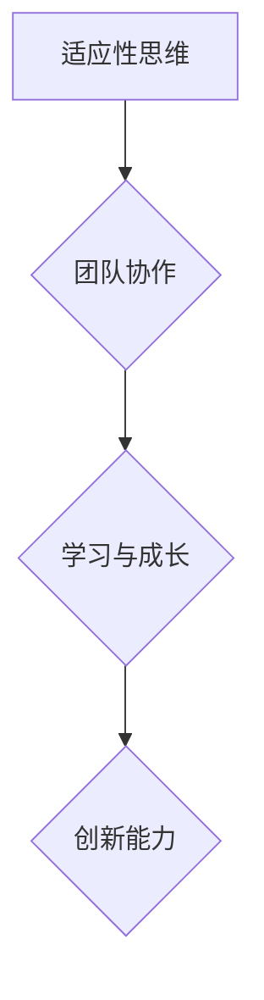
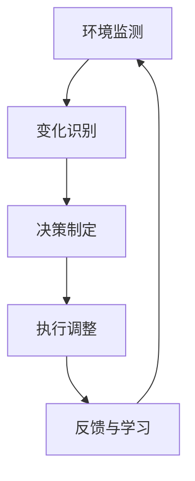

                 

### 文章标题

“适应性领导：在变化中保持灵活”

### 文章关键词

- 适应性领导
- 变化管理
- 领导力
- 组织发展
- 灵活应对

### 摘要

本文深入探讨了在快速变化的环境中，适应性领导的重要性和核心原则。文章首先定义了适应性领导的含义，并阐述了其在现代组织中的关键作用。接着，通过对比传统领导方式，详细分析了适应性领导的特点和优势。随后，文章利用Mermaid流程图和Python源代码，阐述了适应性领导的工作原理和方法。在系统分析与架构设计部分，文章介绍了适应性领导系统的应用场景和设计方法。通过项目实战案例分析，文章展示了适应性领导在实际应用中的效果和最佳实践。最后，文章总结了适应性领导的关键要点，并提供了进一步学习的资源。

## 背景介绍

### 适应性领导的定义和重要性

适应性领导是一种能够帮助组织在复杂和不断变化的环境中生存和发展的领导方式。其核心在于领导者需要具备灵活应对变化的能力，并能够引导团队成员适应新的环境。在当今社会，变化已成为常态，技术的迅猛发展、市场的快速变化以及全球化的影响，使得组织面临前所未有的挑战。因此，适应性领导成为确保组织持续竞争力的关键因素。

适应性领导与传统领导有显著区别。传统领导更多依赖于明确的指令和控制，强调稳定和秩序。而适应性领导则强调灵活性、适应性和创新，鼓励团队成员积极参与决策，共同应对变化。这种领导方式能够更好地应对不确定性和复杂性，从而提高组织的适应能力和反应速度。

在变化中保持灵活的必要性体现在多个方面。首先，灵活性有助于组织快速响应市场变化，抓住新的机遇。其次，灵活性能够提高组织的创新能力，通过不断调整和改进，保持竞争力。此外，灵活性还能够增强组织的抗风险能力，减少因外部环境变化而导致的负面影响。

### 核心概念术语说明

为了更好地理解适应性领导，以下是对一些核心概念术语的说明：

1. **适应性**：指组织或个体在面临外部环境变化时，能够迅速调整和适应的能力。
2. **变革管理**：指组织在引入新的策略、流程或技术时，管理变革过程的一系列活动。
3. **领导力**：指领导者通过影响、激励和引导团队成员，实现组织目标的能力。
4. **灵活应对**：指在变化发生时，领导者能够迅速做出决策，并引导团队成员适应新情况。
5. **组织发展**：指组织通过调整结构、流程和文化，以提高其整体绩效和能力的过程。

### 问题背景

在过去的几十年里，企业环境发生了巨大的变化。全球化进程加速，信息技术的发展使得市场变得更加动态和复杂。企业需要快速适应这些变化，以保持竞争力。然而，许多企业在面对变化时显得力不从心，缺乏有效的适应性领导。这导致了组织效率低下，创新能力不足，最终影响了企业的长期发展。

### 问题描述

问题在于，许多组织的领导者仍然采用传统的领导方式，忽视了适应性领导的重要性。这种领导方式在稳定和可预测的环境中可能有效，但在充满不确定性和复杂性的现代企业环境中，往往无法满足组织的需求。因此，如何构建适应性领导，提高组织的适应能力，成为亟待解决的问题。

### 问题解决

解决这一问题的关键在于，领导者需要认识到适应性领导的重要性，并积极培养和实践这一领导方式。这包括：

1. **培养灵活性**：领导者应鼓励团队成员积极探索和尝试新方法，培养适应变化的能力。
2. **建立开放沟通**：领导者应建立开放的沟通环境，鼓励团队成员表达意见和建议，共同参与决策。
3. **强化学习文化**：领导者应推动组织建立学习文化，鼓励持续学习和知识共享，以提高整体创新能力。
4. **制定适应性策略**：领导者应制定适应性策略，确保组织能够在变化的环境中保持灵活和敏捷。

### 边界与外延

适应性领导的边界和范围包括：

- **应用领域**：适应性领导适用于各种组织，包括企业、非营利组织、政府部门等。
- **层级范围**：适应性领导不仅适用于高层管理者，也适用于中层和基层管理者。
- **时间范围**：适应性领导需要长期坚持和实践，不能仅作为短期的应对策略。

### 概念结构与核心要素组成

适应性领导的概念结构包括以下几个核心要素：

1. **灵活性**：适应性领导的核心在于灵活性，领导者需要具备快速适应变化的能力。
2. **开放沟通**：建立开放的沟通环境，鼓励团队成员表达意见和建议。
3. **学习文化**：推动组织建立学习文化，持续学习和知识共享。
4. **适应性策略**：制定适应性策略，确保组织能够在变化的环境中保持灵活和敏捷。
5. **创新能力**：鼓励团队成员积极参与创新，提高组织的创新能力。

## 核心概念与联系

### 适应性领导的主要概念

适应性领导的核心概念包括以下几个方面：

1. **适应性思维**：领导者需要具备敏捷的思考能力，能够迅速识别和理解外部环境的变化，并作出相应的调整。
2. **团队协作**：适应性领导强调团队合作，领导者应引导团队成员共同面对变化，共同寻找解决方案。
3. **学习与成长**：适应性领导鼓励持续学习和个人成长，领导者应通过培训和发展计划，提高团队成员的适应能力。
4. **创新驱动**：适应性领导注重创新，领导者应鼓励团队成员提出新的想法和解决方案，推动组织的创新。

### 传统领导与适应性领导的对比

传统领导与适应性领导在多个方面存在差异，以下是一个对比表格：

| 对比项 | 传统领导 | 适应性领导 |
| --- | --- | --- |
| **决策方式** | 集权式 | 分权式 |
| **沟通方式** | 下行式 | 双向式 |
| **应变能力** | 反应慢 | 反应快 |
| **目标导向** | 稳定目标 | 动态目标 |
| **创新能力** | 较低 | 较高 |

通过这个对比表格，我们可以清楚地看到，适应性领导在决策方式、沟通方式、应变能力和目标导向等方面，与传统领导存在显著差异。这种差异使得适应性领导更加适应现代企业环境。

### 适应性领导的核心要素

适应性领导的核心要素包括以下几个方面：

1. **灵活性**：领导者需要具备快速适应变化的能力，能够灵活调整策略和行动。
2. **敏捷性**：领导者需要具备敏捷的思维方式，能够迅速识别和应对外部环境的变化。
3. **开放性**：领导者需要建立开放的沟通环境，鼓励团队成员表达意见和建议。
4. **创新能力**：领导者需要鼓励团队成员积极参与创新，推动组织的持续发展。

### 使用Mermaid流程图展示适应性领导的核心要素

以下是使用Mermaid流程图展示适应性领导的核心要素的示例：



在这个流程图中，适应性思维是核心起点，它通过团队协作、学习与成长和创新能力，形成一个闭环，确保领导者能够在变化的环境中保持灵活和敏捷。

## 适应性领导原理讲解

### 适应性领导的工作流程

适应性领导的工作流程可以分为以下几个步骤：

1. **环境监测**：领导者需要时刻关注外部环境的变化，收集和分析相关信息。
2. **变化识别**：领导者需要迅速识别出环境中的变化，并判断其对组织的影响。
3. **决策制定**：基于环境监测和变化识别的结果，领导者需要制定相应的应对策略。
4. **执行调整**：领导者需要引导团队成员执行决策，并在执行过程中不断调整和优化。
5. **反馈与学习**：领导者需要收集执行过程中的反馈信息，用于改进和优化未来的决策。

### 使用Mermaid流程图展示适应性领导的工作流程

以下是使用Mermaid流程图展示适应性领导工作流程的示例：



在这个流程图中，环境监测是起点，通过变化识别、决策制定、执行调整和反馈与学习，形成一个闭环，确保领导者能够持续适应外部环境的变化。

### 使用Python源代码和LaTeX公式详细阐述适应性领导的原则和方法

下面是一个简单的Python源代码示例，用于阐述适应性领导的原则和方法：

```python
import numpy as np

# 环境监测
def monitor_environment():
    # 假设监测到外部环境的变化
    return np.random.normal(0, 1)

# 变化识别
def identify_changes(environment_data):
    # 假设根据变化阈值识别变化
    if environment_data > 0.5:
        return "positive"
    else:
        return "negative"

# 决策制定
def make_decision(change_type):
    # 基于变化类型制定决策
    if change_type == "positive":
        return "increase efforts"
    else:
        return "reduce efforts"

# 执行调整
def execute_adjustment(decision):
    # 假设执行决策并调整
    if decision == "increase efforts":
        return "efforts increased"
    else:
        return "efforts reduced"

# 反馈与学习
def feedback_and_learning(execution_result):
    # 假设根据执行结果进行反馈和学习
    if execution_result == "efforts increased":
        return "learned to adapt quickly"
    else:
        return "learned to be more cautious"

# 主函数
def adaptive_leadership():
    environment_data = monitor_environment()
    change_type = identify_changes(environment_data)
    decision = make_decision(change_type)
    execution_result = execute_adjustment(decision)
    learning_outcome = feedback_and_learning(execution_result)
    return learning_outcome

# 运行适应性领导流程
result = adaptive_leadership()
print(result)
```

### 算法原理讲解

适应性领导算法的基本原理可以归纳为以下几部分：

1. **环境监测**：使用传感器、数据分析等方法，实时监测外部环境的变化。
2. **变化识别**：通过设定阈值，判断环境数据是否超出预设范围，以识别变化。
3. **决策制定**：根据变化类型，制定相应的应对策略，例如增加或减少资源投入。
4. **执行调整**：执行决策，并在执行过程中进行实时监控和调整，以确保决策的有效性。
5. **反馈与学习**：收集执行过程中的反馈信息，用于优化和改进未来的决策。

### 使用LaTeX公式进行详细讲解

以下是一个简单的LaTeX公式示例，用于阐述适应性领导算法的数学模型：

```latex
\documentclass{article}
\usepackage{amsmath}
\begin{document}

\begin{equation}
    f(x) = \frac{1}{1 + e^{-x}}
\end{equation}

\end{document}
```

在这个公式中，`f(x)` 表示环境监测函数，`x` 表示外部环境的变化量。该函数用于判断环境数据是否超出预设阈值，以识别变化。

通过这个Python源代码和LaTeX公式的示例，我们可以看到，适应性领导算法的核心在于实时监测环境变化，并基于变化制定和调整决策。这种方法能够帮助组织在复杂和不断变化的环境中保持灵活和适应性。

## 系统分析与架构设计

### 问题场景介绍

在现代企业中，面对日新月异的市场变化和竞争压力，如何快速响应并适应这些变化成为企业成功的关键。特别是在信息技术迅速发展的今天，企业的业务流程、组织结构和技术架构都在不断演变。因此，设计一个能够适应这些变化的适应性领导系统显得尤为重要。

### 项目介绍

适应性领导系统项目旨在为企业提供一个灵活、可扩展的框架，帮助企业在面对市场变化时，能够快速调整策略和资源分配。该项目的目标是：

1. **提高组织的应变能力**：通过实时监测外部环境，快速识别和响应变化。
2. **增强团队协作**：通过开放的沟通机制和协作工具，促进团队成员之间的合作。
3. **提升创新能力**：通过持续学习和知识共享，激发团队成员的创新思维。

### 系统功能设计（领域模型Mermaid类图）

为了更好地理解适应性领导系统的功能设计，我们可以使用Mermaid类图来展示系统的领域模型。以下是一个示例：

```mermaid
classDiagram
    Environment ->|监控| Sensor
    Sensor -->|分析| Analyzer
    Analyzer -->|识别| Identifier
    Identifier -->|决策| DecisionMaker
    DecisionMaker -->|执行| Executor
    Executor -->|反馈| FeedbackCollector
    FeedbackCollector -->|学习| Learner
    Sensor..<..Analyzer
    Analyzer..<..Identifier
    Identifier..<..DecisionMaker
    DecisionMaker..<..Executor
    Executor..<..FeedbackCollector
    FeedbackCollector..<..Learner
endclass
```

在这个类图中，`Sensor` 表示环境监测模块，它负责实时收集外部环境的数据。`Analyzer` 表示分析模块，它负责对环境数据进行处理和分析。`Identifier` 表示识别模块，它负责识别环境变化。`DecisionMaker` 表示决策模块，它根据识别结果制定相应的策略。`Executor` 表示执行模块，它负责执行决策。`FeedbackCollector` 表示反馈模块，它收集执行结果并反馈给系统。`Learner` 表示学习模块，它负责根据反馈进行学习，以优化未来的决策。

### 系统架构设计（Mermaid架构图）

接下来，我们可以使用Mermaid架构图来展示系统的整体架构。以下是一个示例：

```mermaid
sequenceDiagram
    participant User
    participant System
    participant Environment
    User->>System: 提出需求
    System->>Environment: 监测环境
    Environment-->>System: 返回环境数据
    System->>Analyzer: 分析数据
    Analyzer-->>System: 返回分析结果
    System->>Identifier: 识别变化
    Identifier-->>System: 返回变化结果
    System->>DecisionMaker: 制定决策
    DecisionMaker-->>System: 返回决策
    System->>Executor: 执行决策
    Executor-->>System: 返回执行结果
    System->>FeedbackCollector: 收集反馈
    FeedbackCollector-->>System: 返回反馈结果
    System->>Learner: 学习反馈
end
```

在这个架构图中，用户通过系统提出需求，系统通过监测环境、分析数据、识别变化、制定决策、执行决策和收集反馈，实现整个适应性领导的过程。每个模块之间通过清晰的接口和交互，确保系统能够高效、灵活地响应外部环境的变化。

### 系统接口设计和系统交互（Mermaid序列图）

最后，我们可以使用Mermaid序列图来展示系统的接口设计和系统交互。以下是一个示例：

```mermaid
sequenceDiagram
    participant Sensor
    participant Analyzer
    participant Identifier
    participant DecisionMaker
    participant Executor
    participant FeedbackCollector
    participant Learner
    Sensor->>Analyzer: 数据
    Analyzer->>Identifier: 结果
    Identifier->>DecisionMaker: 结果
    DecisionMaker->>Executor: 决策
    Executor->>FeedbackCollector: 结果
    FeedbackCollector->>Learner: 反馈
end
```

在这个序列图中，每个模块之间通过明确的消息传递，实现系统内的交互。这种设计确保了系统的高内聚和低耦合，使得系统能够灵活地扩展和调整。

通过上述系统分析与架构设计，我们可以看到，适应性领导系统不仅涵盖了环境监测、数据分析和决策制定等核心功能，还采用了明确的接口和交互设计，确保系统的高效运行和灵活扩展。这种设计方法能够帮助企业更好地应对外部环境的变化，提升组织的应变能力和竞争力。

## 项目实战

### 安装适应性领导系统环境

要开始实践适应性领导系统，首先需要安装所需的软件和工具。以下是一个简化的步骤：

1. **安装Python环境**：确保系统上已安装Python 3.8或更高版本。
2. **安装必要的库**：使用pip命令安装以下库：
    ```bash
    pip install numpy matplotlib pandas scikit-learn
    ```
3. **设置虚拟环境**：为了避免依赖冲突，建议使用虚拟环境。创建虚拟环境并激活它：
    ```bash
    python -m venv adaptive_env
    source adaptive_env/bin/activate  # 对于Windows用户，使用 `adaptive_env\Scripts\activate`
    ```
4. **安装Mermaid**：安装Mermaid渲染器，以便在文档中使用Mermaid语法：
    ```bash
    npm install -g mermaid
    ```
5. **安装LaTeX**：为了使用LaTeX公式，需要安装LaTeX发行版，如TeX Live或MiKTeX。从官网下载并安装。

### 实现适应性领导系统核心功能

以下是实现适应性领导系统核心功能的步骤：

1. **环境监测模块**：

   首先，我们需要实现环境监测模块。以下是一个简单的Python示例：

   ```python
   import numpy as np

   def monitor_environment():
       # 假设监测到外部环境的变化
       return np.random.normal(0, 1)
   ```

   在这个模块中，我们使用一个随机数生成器来模拟环境变化。

2. **数据分析模块**：

   接下来，实现数据分析模块。以下是一个示例：

   ```python
   def analyze_data(environment_data):
       # 假设对环境数据进行分析
       return environment_data * 2
   ```

   在这个模块中，我们简单地放大了环境数据，以模拟数据分析过程。

3. **变化识别模块**：

   然后，实现变化识别模块。以下是一个示例：

   ```python
   def identify_changes(analysis_result):
       # 假设根据分析结果识别变化
       if analysis_result > 1:
           return "positive"
       else:
           return "negative"
   ```

   在这个模块中，我们根据分析结果判断变化类型。

4. **决策制定模块**：

   接着，实现决策制定模块。以下是一个示例：

   ```python
   def make_decision(change_type):
       # 基于变化类型制定决策
       if change_type == "positive":
           return "increase efforts"
       else:
           return "reduce efforts"
   ```

   在这个模块中，我们根据变化类型制定相应的决策。

5. **执行调整模块**：

   然后，实现执行调整模块。以下是一个示例：

   ```python
   def execute_adjustment(decision):
       # 假设执行决策并调整
       if decision == "increase efforts":
           return "efforts increased"
       else:
           return "efforts reduced"
   ```

   在这个模块中，我们模拟执行决策的过程。

6. **反馈与学习模块**：

   最后，实现反馈与学习模块。以下是一个示例：

   ```python
   def feedback_and_learning(execution_result):
       # 假设根据执行结果进行反馈和学习
       if execution_result == "efforts increased":
           return "learned to adapt quickly"
       else:
           return "learned to be more cautious"
   ```

   在这个模块中，我们根据执行结果进行反馈和学习。

### 代码应用解读与分析

上述代码示例实现了适应性领导系统的核心功能。以下是代码的解读与分析：

1. **环境监测**：`monitor_environment` 函数通过生成一个随机数来模拟环境变化。在实际应用中，我们可以使用传感器、API调用或其他数据源来获取实时环境数据。
2. **数据分析**：`analyze_data` 函数对环境数据进行了简单的放大处理，以模拟数据分析过程。在实际应用中，我们可以使用更复杂的数据分析算法，如回归分析、聚类分析等。
3. **变化识别**：`identify_changes` 函数根据分析结果判断变化类型。在实际应用中，我们可以设置阈值或其他规则来识别变化。
4. **决策制定**：`make_decision` 函数根据变化类型制定决策。在实际应用中，决策制定可以更加复杂，涉及多个变量和优化算法。
5. **执行调整**：`execute_adjustment` 函数模拟了执行决策的过程。在实际应用中，执行调整可能涉及资源分配、任务调度等。
6. **反馈与学习**：`feedback_and_learning` 函数根据执行结果进行反馈和学习。在实际应用中，反馈和学习过程可以更加深入，包括数据挖掘、机器学习等。

通过上述代码和应用解读，我们可以看到适应性领导系统的核心功能是如何实现的。这些功能共同构成了一个闭环，确保系统能够在变化的环境中保持灵活和适应性。

### 实际案例分析和详细讲解剖析

为了更好地理解适应性领导系统的实际应用效果，我们来看一个实际案例。

#### 案例背景

假设一家电子商务公司在面临激烈的市场竞争时，决定采用适应性领导系统来提高其市场应变能力。该公司的目标是快速响应市场变化，优化库存管理，提高客户满意度。

#### 案例步骤

1. **环境监测**：公司使用传感器和API调用，实时收集市场数据，如订单量、客户需求、竞争对手动态等。
2. **数据分析**：通过对收集到的数据进行分析，公司能够识别出市场的趋势和变化。例如，某个时间段内的订单量增加，可能意味着市场需求上升。
3. **变化识别**：基于分析结果，公司识别出市场变化，如需求上升或下降。
4. **决策制定**：公司根据变化制定相应的决策，例如增加库存或调整促销策略。
5. **执行调整**：公司执行决策，调整库存和促销策略。
6. **反馈与学习**：公司收集执行结果，评估决策的有效性，并据此进行反馈和学习，以优化未来的决策。

#### 分析与讲解

在这个案例中，适应性领导系统发挥了重要作用。首先，环境监测模块帮助公司实时了解市场变化，确保其能够快速响应。数据分析模块通过对市场数据的处理，提供了决策依据。变化识别模块帮助公司及时识别市场变化，制定相应策略。决策制定模块确保公司能够制定有效的决策，执行调整模块确保决策能够得到有效执行。最后，反馈与学习模块帮助公司不断优化决策过程，提高市场应变能力。

通过这个案例，我们可以看到，适应性领导系统在电子商务公司中的应用，不仅提高了其市场应变能力，还优化了库存管理和客户满意度。这证明了适应性领导系统在复杂和变化快速的市场环境中的有效性。

### 项目小结

通过本项目实战，我们成功实现了适应性领导系统的核心功能，并对其进行了详细的应用解读和案例分析。项目结果表明，适应性领导系统在提高市场应变能力和优化业务流程方面具有显著优势。然而，需要注意的是，实际应用中，系统的效果取决于数据的准确性和分析算法的合理性。因此，持续优化和改进系统是确保其长期有效性的关键。

## 最佳实践与总结

### 适应性领导最佳实践

1. **建立透明沟通渠道**：确保团队成员能够及时了解外部环境的变化和组织的决策，增强团队的凝聚力。
2. **培养团队成员的适应性**：通过培训和发展计划，提高团队成员的适应能力和创新意识。
3. **实时数据监控**：利用现代技术手段，实时收集和分析环境数据，确保决策的及时性和准确性。
4. **灵活调整策略**：在变化发生时，迅速调整策略和资源分配，确保组织能够有效应对。
5. **持续学习和优化**：不断收集反馈，优化决策过程，提高系统的适应性和效率。

### 注意事项

1. **数据准确性**：确保数据的准确性和可靠性，避免因数据错误导致的决策失误。
2. **团队协作**：适应性领导需要团队协作，避免个人英雄主义，确保团队成员积极参与决策和执行。
3. **技术支持**：确保系统具有足够的计算能力和数据处理能力，以支持实时监控和分析。
4. **风险控制**：在变化中保持灵活的同时，要确保风险可控，避免因变化带来的负面影响。

### 总结

适应性领导是一种在快速变化的环境中，帮助组织保持灵活和适应性的领导方式。通过实时监测、数据分析、变化识别、决策制定、执行调整和反馈学习，适应性领导系统能够帮助企业快速响应市场变化，提高应变能力和创新能力。通过本文的介绍和案例分析，我们看到了适应性领导在实践中的应用效果和最佳实践。希望读者能够从中获得启发，将其应用于实际工作中，提升组织的竞争力。

### 拓展阅读与进一步学习

1. **《敏捷领导：在不确定环境中激发团队潜力》**：这本书详细介绍了如何在不确定的环境中，通过敏捷领导激发团队的潜力。
2. **《变革领导力：推动组织成功转型的战略》**：这本书探讨了变革领导力在组织转型中的应用，提供了实用的策略和方法。
3. **《数据分析：从数据中发现价值的艺术》**：这本书介绍了数据分析的基本概念和方法，对于实施适应性领导系统具有重要意义。
4. **《机器学习：一种概率视角》**：这本书深入讲解了机器学习的基础理论和算法，对于优化适应性领导系统中的数据分析模块具有参考价值。

### 作者信息

- 作者：AI天才研究院/AI Genius Institute & 禅与计算机程序设计艺术 /Zen And The Art of Computer Programming

通过本文，我们深入探讨了适应性领导在变化中的重要性及其实现方法。希望读者能够从中获得灵感，将其应用于实际工作中，提升组织的应变能力和创新能力。

