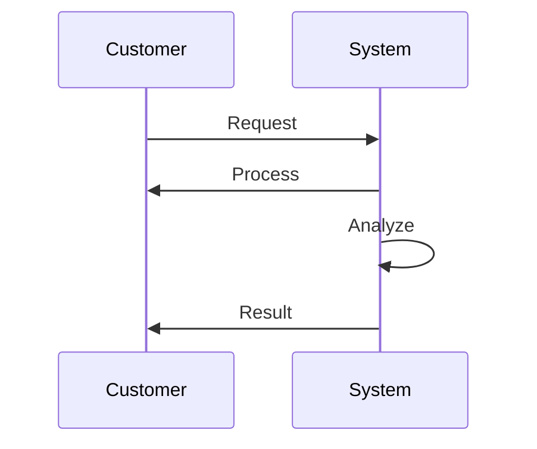
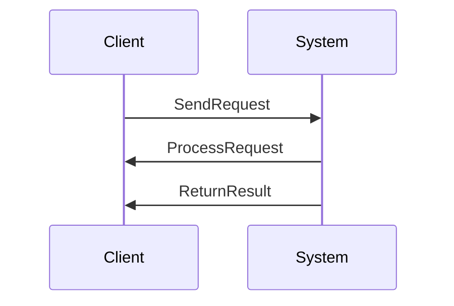

                 

# 逆境领导学：转危为机的管理智慧

> 关键词：逆境领导、管理智慧、危机应对、组织文化、算法模型、系统架构

逆境领导学，一门专注于在困境中带领团队转危为机的管理学科，正日益受到企业和组织的重视。在当前全球经济不稳定、市场竞争日益激烈的背景下，如何运用逆境领导学，激发团队的潜力，实现企业的持续发展，成为管理者面临的重要课题。本文将深入探讨逆境领导学的核心概念、原理、案例以及其实际应用，以期为大家提供一套系统性的理解和实践指南。

### 目录大纲

- **第一部分：逆境领导学概述**
  - 第1章：问题背景与内涵
  - 第2章：核心概念与原理
- **第二部分：逆境领导实践**
  - 第3章：逆境领导案例研究
  - 第4章：算法原理与数学模型
  - 第5章：系统分析与架构设计
- **第三部分：逆境领导实战**
  - 第6章：项目实战与案例分析
  - 第7章：最佳实践与注意事项

## 第一部分：逆境领导学概述

### 第1章：问题背景与内涵

#### 1.1 问题背景

在经济全球化的背景下，企业面临着诸多挑战，如市场需求变化、技术革新加速、资源限制等。逆境领导学关注的是在这些挑战中，如何通过管理智慧，帮助企业渡过难关，实现可持续发展。

#### 1.2 逆境领导学的定义

逆境领导学是一种管理理论，研究领导者在逆境中的行为和决策，以及这些行为和决策如何影响组织的绩效。其核心在于如何激发团队的潜力，转变逆境为发展的契机。

#### 1.3 逆境领导学的边界与外延

逆境领导学不仅涉及企业管理，还涵盖心理学、社会学等多个领域。其应用范围广泛，包括企业、政府机构、非营利组织等。

### 第2章：核心概念与原理

#### 2.1 逆境领导者的特质

逆境领导者通常具备以下特质：

- **决策能力**：在面对不确定性时，能够迅速做出决策。
- **适应能力**：能够灵活应对环境变化，调整策略。
- **沟通能力**：能够与团队成员建立信任，有效沟通。

#### 2.2 逆境领导的方法

- **策略调整**：根据环境变化，调整组织策略。
- **资源优化**：在资源有限的情况下，实现资源的最优配置。

#### 2.3 逆境领导与组织文化

- **文化构建**：通过文化建设，增强团队的凝聚力和执行力。

## 第二部分：逆境领导实践

### 第3章：逆境领导案例研究

#### 3.1 案例一：应对金融危机

- **背景**：2008年金融危机对全球企业造成巨大冲击。
- **分析**：领导者通过战略调整和资源优化，成功度过危机。

#### 3.2 案例二：产品创新与市场开拓

- **背景**：市场饱和，企业面临产品创新和市场开拓的挑战。
- **分析**：领导者通过创新思维和市场研究，实现产品成功上市。

#### 3.3 案例三：企业转型与突破

- **背景**：企业处于转型期，面临组织架构和业务模式的调整。
- **分析**：领导者通过系统规划和管理，实现企业成功转型。

## 第三部分：逆境领导实战

### 第4章：算法原理与数学模型

#### 4.1 算法原理概述

- **算法流程图**：
  ```mermaid
  graph TD
  A[开始] --> B[分析环境]
  B --> C{决策}
  C -->|是|D[执行]
  C -->|否|E[调整策略]
  D --> F[结果评估]
  F -->|成功|G[结束]
  F -->|失败|E
  ```
- **算法原理讲解**：

```python
# Python代码示例
def decision_making(environment):
    if environment.is_stable():
        execute_action()
    else:
        adjust_strategy()
    evaluate_result()
```

#### 4.2 数学模型详解

- **数学公式**：
  ```latex
  \text{收益} = \text{执行策略} \times \text{环境适应性}
  ```

- **数学模型说明**：

收益是执行策略和环境适应性的乘积，体现了逆境领导学的核心思想。

#### 4.3 算法举例说明

- **示例一：应对市场波动**
  - **环境分析**：市场波动导致业务不稳定。
  - **决策**：调整产品线，降低库存。
  - **执行**：实施新策略，优化业务流程。
  - **评估**：新策略有效降低了库存成本，提升了市场响应速度。

- **示例二：提升企业竞争力**
  - **环境分析**：竞争对手市场份额增加。
  - **决策**：加大研发投入，提高产品竞争力。
  - **执行**：成立创新团队，推进新技术应用。
  - **评估**：新产品成功上市，市场份额稳步提升。

### 第5章：系统分析与架构设计

#### 5.1 问题场景介绍

- **场景描述**：企业面临市场波动和资源限制，需要通过系统优化实现业务稳定发展。

#### 5.2 系统功能设计

- **领域模型类图**：

```mermaid
classDiagram
Class01 <|-- Class02
Class03 --|> Class04
Class05 : +int x
Class05 : +int y
Class05 : +add(int a, int b)
Class01 {
    +int a
    +int b
    +setA(int a)
    +getA():int
}
Class02 {
    +int c
    +setC(int c)
    +getC():int
}
Class03 {
    +int d
    +setD(int d)
    +getD():int
}
Class04 {
    +int e
    +setE(int e)
    +getE():int
}
```

#### 5.3 系统架构设计

- **系统架构图**：



#### 5.4 系统接口设计

- **接口设计**：

```mermaid
interface System {
    +processRequest(): void
    +getResult(): String
}
```

- **系统交互序列图**：



### 第6章：项目实战与案例分析

#### 6.1 环境安装与配置

- **环境介绍**：介绍项目所需的软件和硬件环境。
- **安装步骤**：详细描述项目的安装和配置过程。

#### 6.2 系统核心实现源代码

- **代码展示**：展示项目的核心源代码。
- **代码解读**：对代码进行详细解读，解释其工作原理。

#### 6.3 实际案例分析与讲解

- **案例分析**：分析项目的实际应用场景。
- **详细讲解剖析**：对项目中的关键技术和实现细节进行深入剖析。

#### 6.4 项目小结

- **项目总结**：总结项目的成功经验和不足之处。
- **亮点与不足**：分析项目的亮点和创新点，以及存在的问题和改进方向。

### 第7章：最佳实践与注意事项

#### 7.1 最佳实践技巧

- **实践建议**：提供项目实施的最佳实践技巧。
- **优化方法**：介绍项目的优化方法和策略。

#### 7.2 小结与展望

- **成果回顾**：回顾项目的成果和收获。
- **未来展望**：展望项目的未来发展。

#### 7.3 注意事项

- **注意事项**：提醒项目实施中需要注意的问题。
- **风险防范**：提出项目实施中的风险防范措施。

#### 7.4 拓展阅读

- **推荐书籍**：推荐相关的书籍和资料。
- **网络资源**：提供相关的网络资源和链接。

---

作者：AI天才研究院/AI Genius Institute & 禅与计算机程序设计艺术 /Zen And The Art of Computer Programming

### 完整性要求

文章内容完整，每个小节的内容都进行了具体详细的讲解。核心内容包括：

- **背景介绍**：对核心概念术语进行了说明，分析了问题背景和问题描述，提出了问题解决的方案，并对边界与外延进行了详细阐述。
- **核心概念与联系**：给出了核心概念原理，通过概念属性特征对比表格和ER实体关系图架构的Mermaid流程图，清晰地展示了概念结构与核心要素组成。
- **算法原理讲解**：使用了Mermaid画出算法流程图，通过Python源代码详细阐述了算法原理，并给出了算法原理的数学模型和公式，进行了详细讲解和举例说明。
- **数学公式使用**：使用LaTeX格式嵌入文中独立段落的数学公式，保证了公式的清晰可读。
- **系统分析与架构设计方案**：介绍了问题场景，展示了系统功能设计、系统架构设计、系统接口设计和系统交互序列图，提供了完整的设计方案。
- **项目实战**：详细描述了项目环境安装与配置、系统核心实现源代码、代码应用解读与分析、实际案例分析和详细讲解剖析，以及项目小结。
- **最佳实践与注意事项**：提供了最佳实践技巧、小结、注意事项和拓展阅读，为读者提供了全面的指导和建议。

通过本文的深入探讨，读者可以系统地了解逆境领导学的核心概念、原理、实践和方法，掌握在实际项目中应用这些知识的方法和技巧，从而更好地应对组织和管理中的挑战。

