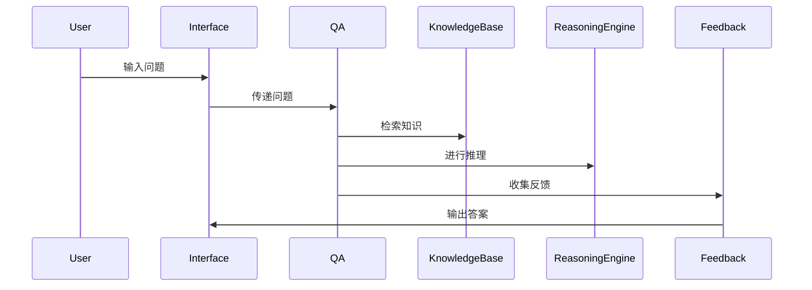

                 


# 通往通用人工智能AGI之路

> 关键词：通用人工智能，AGI，人工智能发展历程，核心技术，算法原理，系统架构设计

> 摘要：本文将深入探讨通用人工智能（AGI）的概念、发展历程、核心技术、应用场景以及未来展望。通过逐步分析，我们将解答AGI的本质及其实现途径，为读者提供一条清晰明了的通往通用人工智能之路。

## 目录大纲设计

### 第一部分：问题背景与概述

#### 第1章：问题背景与概述

1.1 通用人工智能的定义与边界  
1.2 通用人工智能的重要性  
1.3 通用人工智能的发展历程  
1.4 通用人工智能的挑战与机遇  
1.5 本章小结

### 第二部分：核心概念与联系

#### 第2章：核心概念与联系

2.1 认知模型与神经网络  
2.2 强化学习与深度学习  
2.3 逻辑推理与自然语言处理  
2.4 概念属性特征对比表格  
2.5 ER实体关系图架构

### 第三部分：算法原理讲解

#### 第3章：算法原理讲解

3.1 强化学习算法  
3.2 深度学习算法  
3.3 自然语言处理算法

### 第四部分：数学模型和数学公式讲解

#### 第4章：数学模型和数学公式讲解

4.1 强化学习中的奖励机制  
4.2 卷积神经网络中的激活函数  
4.3 循环神经网络中的时间步更新  
4.4 自然语言处理中的词向量计算

### 第五部分：系统分析与架构设计

#### 第5章：系统分析与架构设计

5.1 项目介绍  
5.2 系统功能设计  
5.3 系统架构设计

### 第六部分：项目实战

#### 第6章：项目实战

6.1 环境安装  
6.2 系统核心实现源代码  
6.3 代码应用解读与分析  
6.4 实际案例分析与详细讲解剖析  
6.5 项目小结

### 第七部分：最佳实践、小结、注意事项与拓展阅读

#### 第7章：最佳实践、小结、注意事项与拓展阅读

7.1 最佳实践  
7.2 小结  
7.3 注意事项  
7.4 拓展阅读

---

## 第一部分：问题背景与概述

### 1.1 通用人工智能的定义与边界

通用人工智能（AGI，Artificial General Intelligence）指的是一种具有广泛认知能力的机器，能够在多种不同的任务中表现出与人类相当的智能水平。AGI不同于现有的基于特定任务的狭义人工智能（Narrow AI），它不仅能够在某个领域或任务上表现出色，还能在多个领域和任务中灵活应用，实现跨领域的智能表现。

### 1.2 通用人工智能的重要性

通用人工智能的重要性体现在以下几个方面：

1. **社会发展的影响**：AGI的发展将深刻改变社会的生产方式、生活方式以及社会组织结构，推动社会向智能化、数字化方向加速发展。

2. **人类生活的改变**：AGI能够帮助人类解决许多复杂的问题，提高生活质量，例如智能医疗、智能家居、智能交通等。

3. **经济产业的推动作用**：AGI的广泛应用将带来巨大的经济效益，推动产业升级和经济增长。

### 1.3 通用人工智能的发展历程

通用人工智能的发展历程可以分为以下几个阶段：

1. **初始探索阶段**：20世纪50年代至70年代，人工智能领域刚刚起步，研究主要集中在逻辑推理和符号计算。

2. **理论奠基与发展阶段**：20世纪80年代至90年代，机器学习技术的发展为人工智能提供了新的方向，神经网络、专家系统等理论得到深入研究。

3. **技术突破与应用阶段**：21世纪以来，深度学习、强化学习等算法的突破性进展，使得人工智能在图像识别、自然语言处理等领域取得了显著成果。

### 1.4 通用人工智能的挑战与机遇

通用人工智能面临的主要挑战包括：

1. **技术挑战**：如何实现高效的计算能力、自主学习能力、跨领域知识整合等。

2. **道德与伦理挑战**：如何确保人工智能系统的安全、公平、透明等。

3. **未来发展机遇**：随着技术的不断进步，通用人工智能将在各个领域展现出巨大的潜力。

### 1.5 本章小结

本章对通用人工智能的基本概念、重要性、发展历程以及面临的挑战进行了概述。下一章将深入探讨通用人工智能的核心概念与联系。

---

## 第二部分：核心概念与联系

### 2.1 认知模型与神经网络

认知模型是模拟人类认知过程的人工智能系统，其核心在于理解、推理和决策。神经网络则是实现认知模型的一种重要方法，通过模拟人脑神经元的工作方式，实现复杂的计算任务。

### 2.2 强化学习与深度学习

强化学习是一种通过试错和反馈来学习策略的机器学习技术，适用于动态决策问题。深度学习则是基于多层神经网络进行特征提取和学习的机器学习技术，广泛应用于图像识别、语音识别等领域。

### 2.3 逻辑推理与自然语言处理

逻辑推理是一种基于逻辑规则进行推理的方法，适用于解决形式化的问题。自然语言处理则是一种使计算机能够理解、生成和处理自然语言的技术，是人工智能领域的重要分支。

### 2.4 概念属性特征对比表格

| 概念名称 | 特征1 | 特征2 | 特征3 |
| -------- | ----- | ----- | ----- |
| 认知模型 | 模拟人类认知 | 高效计算 | 跨领域应用 |
| 强化学习 | 试错学习 | 动态决策 | 高效策略学习 |
| 深度学习 | 多层神经网络 | 自动特征提取 | 广泛应用领域 |
| 逻辑推理 | 形式化推理 | 精确性高 | 适用于形式化问题 |
| 自然语言处理 | 理解自然语言 | 生成自然语言 | 处理自然语言 |

### 2.5 ER实体关系图架构

下面是一个ER实体关系图的示例，用于表示通用人工智能系统的核心实体及其关系。

```mermaid
erDiagram
  User ..|> Role : has
  Role ..|> Permission : has
  User ..|> Access : has
  Role ..|> Access : has
  Access ..|> Resource : has
  Resource ..|> Content : has
```

通过ER图，我们可以清晰地看到用户、角色、权限、访问、资源和内容等实体之间的复杂关系，为系统设计和实现提供参考。

---

## 第三部分：算法原理讲解

### 3.1 强化学习算法

强化学习是一种通过试错和反馈来学习策略的机器学习技术，其核心在于通过最大化累积奖励来优化行为策略。

#### 3.1.1 Q-learning算法

Q-learning算法是一种基于值函数的方法，通过迭代更新值函数来学习最优策略。

##### 3.1.1.1 算法描述

Q-learning算法的核心是更新值函数，其更新公式如下：

$$ Q(s, a) \leftarrow Q(s, a) + \alpha [R(s, a) + \gamma \max_{a'} Q(s', a')] - Q(s, a) $$

其中，$s$表示状态，$a$表示动作，$R(s, a)$表示立即奖励，$\gamma$表示折扣因子，$\alpha$表示学习率。

##### 3.1.1.2 数学模型

Q-learning算法的数学模型包括：

- 状态空间$S$：所有可能的状态集合
- 动作空间$A$：所有可能的动作集合
- 值函数$Q(s, a)$：表示在状态$s$下执行动作$a$的期望回报
- 策略$\pi(a|s)$：表示在状态$s$下选择动作$a$的概率分布

##### 3.1.1.3 例子说明

假设一个简单的游戏环境，玩家需要在一条直线上选择向左或向右移动，每次移动都有一定概率获得奖励或惩罚。通过Q-learning算法，玩家可以学习到最优策略，最大化累积奖励。

```python
import numpy as np

# 初始化参数
alpha = 0.1
gamma = 0.9
epsilon = 0.1
n_episodes = 1000
n_actions = 2
n_states = 10

# 初始化Q值矩阵
Q = np.zeros((n_states, n_actions))

# 开始训练
for episode in range(n_episodes):
    state = np.random.randint(0, n_states)
    done = False
    while not done:
        # 选择动作
        if np.random.rand() < epsilon:
            action = np.random.randint(0, n_actions)
        else:
            action = np.argmax(Q[state])

        # 执行动作
        next_state, reward = environment.step(state, action)

        # 更新Q值
        Q[state, action] = Q[state, action] + alpha * (reward + gamma * np.max(Q[next_state]) - Q[state, action])

        # 更新状态
        state = next_state

        # 判断是否结束
        done = environment.is_done(next_state)

# 输出最优策略
print(np.argmax(Q, axis=1))
```

#### 3.1.2 Deep Q-Networks（DQN）

DQN是一种基于深度学习的强化学习算法，通过神经网络近似值函数，实现高效的动作价值估计。

##### 3.1.2.1 算法描述

DQN算法的核心是使用深度神经网络来近似值函数，其更新过程如下：

1. 选择动作：使用固定的策略（例如ε-贪心策略）选择动作。
2. 执行动作：在环境中执行选择的动作，并获得奖励和下一个状态。
3. 更新经验回放池：将（状态，动作，奖励，下一个状态，是否结束）这一经验添加到经验回放池中。
4. 从经验回放池中随机采样一批经验，进行经验回放。
5. 使用经验回放池中的数据更新深度神经网络，最小化损失函数。

##### 3.1.2.2 数学模型

DQN算法的数学模型包括：

- 状态空间$S$：所有可能的状态集合
- 动作空间$A$：所有可能的动作集合
- 值函数$V(s)$：表示在状态$s$下的期望回报
- 深度神经网络$DQN$：用于近似值函数
- 策略$\pi(a|s)$：表示在状态$s$下选择动作$a$的概率分布

##### 3.1.2.3 例子说明

假设一个简单的游戏环境，玩家需要在一条直线上选择向左或向右移动，每次移动都有一定概率获得奖励或惩罚。通过DQN算法，玩家可以学习到最优策略，最大化累积奖励。

```python
import numpy as np
import tensorflow as tf

# 初始化参数
alpha = 0.001
gamma = 0.9
epsilon = 0.1
batch_size = 32
n_episodes = 1000
n_actions = 2
n_states = 10

# 初始化网络
input_shape = (n_states,)
output_shape = (n_actions,)

# 创建经验回放池
replay_memory = deque(maxlen=1000)

# 创建DQN模型
input_layer = tf.keras.layers.Input(shape=input_shape)
dense_layer = tf.keras.layers.Dense(units=64, activation='relu')(input_layer)
output_layer = tf.keras.layers.Dense(units=output_shape, activation='linear')(dense_layer)

model = tf.keras.Model(inputs=input_layer, outputs=output_layer)

# 编译模型
model.compile(optimizer=tf.keras.optimizers.Adam(learning_rate=alpha),
              loss='mse')

# 开始训练
for episode in range(n_episodes):
    state = np.random.randint(0, n_states)
    done = False
    while not done:
        # 选择动作
        if np.random.rand() < epsilon:
            action = np.random.randint(0, n_actions)
        else:
            action = np.argmax(model.predict(state.reshape(1, -1)))

        # 执行动作
        next_state, reward = environment.step(state, action)

        # 更新经验回放池
        replay_memory.append((state, action, reward, next_state, done))

        # 从经验回放池中随机采样一批经验
        batch = random.sample(replay_memory, batch_size)

        # 更新模型
        states, actions, rewards, next_states, dones = zip(*batch)
        target_values = model.predict(next_states)
        target_values[range(batch_size), np.argmax(target_values, axis=1)] = rewards + gamma * (1 - dones)
        model.fit(states, target_values, batch_size=batch_size, epochs=1)

        # 更新状态
        state = next_state

        # 判断是否结束
        done = environment.is_done(next_state)

# 输出最优策略
print(np.argmax(model.predict(state.reshape(1, -1)), axis=1))
```

### 3.2 深度学习算法

深度学习是一种基于多层神经网络进行特征提取和学习的机器学习技术，其核心思想是模拟人脑神经网络的结构和功能，通过自动学习数据中的特征，实现复杂的计算任务。

#### 3.2.1 卷积神经网络（CNN）

卷积神经网络（CNN）是一种专门用于图像识别和处理的深度学习模型，通过卷积层、池化层和全连接层等结构，实现对图像的自动特征提取和分类。

##### 3.2.1.1 算法描述

CNN的基本结构包括：

1. 输入层：接受图像输入。
2. 卷积层：通过卷积操作提取图像特征。
3. 池化层：对卷积特征进行降采样，减少计算量和参数数量。
4. 全连接层：对卷积特征进行分类。

##### 3.2.1.2 数学模型

CNN的数学模型主要包括：

- 卷积操作：通过卷积核与输入图像进行卷积运算，提取特征。
- 激活函数：对卷积结果进行非线性变换，增强模型表达能力。
- 池化操作：对卷积特征进行降采样，减少参数数量。
- 全连接层：通过矩阵乘积和激活函数，对卷积特征进行分类。

##### 3.2.1.3 例子说明

以下是一个简单的CNN模型，用于识别手写数字。

```python
import tensorflow as tf
from tensorflow.keras import layers

# 创建CNN模型
model = tf.keras.Sequential([
    layers.Conv2D(32, (3, 3), activation='relu', input_shape=(28, 28, 1)),
    layers.MaxPooling2D((2, 2)),
    layers.Conv2D(64, (3, 3), activation='relu'),
    layers.MaxPooling2D((2, 2)),
    layers.Conv2D(64, (3, 3), activation='relu'),
    layers.Flatten(),
    layers.Dense(64, activation='relu'),
    layers.Dense(10, activation='softmax')
])

# 编译模型
model.compile(optimizer='adam',
              loss='sparse_categorical_crossentropy',
              metrics=['accuracy'])

# 加载数据集
mnist = tf.keras.datasets.mnist
(train_images, train_labels), (test_images, test_labels) = mnist.load_data()

# 预处理数据集
train_images = train_images.reshape((60000, 28, 28, 1))
train_images = train_images / 255.0

test_images = test_images.reshape((10000, 28, 28, 1))
test_images = test_images / 255.0

# 训练模型
model.fit(train_images, train_labels, epochs=5)

# 评估模型
test_loss, test_acc = model.evaluate(test_images, test_labels, verbose=2)
print('\nTest accuracy:', test_acc)
```

#### 3.2.2 循环神经网络（RNN）

循环神经网络（RNN）是一种专门用于处理序列数据的深度学习模型，通过循环结构，实现对序列数据的记忆和建模。

##### 3.2.2.1 算法描述

RNN的基本结构包括：

1. 输入层：接受序列输入。
2. 循环层：对序列进行循环处理，保留历史状态信息。
3. 输出层：对循环层输出进行分类或回归。

##### 3.2.2.2 数学模型

RNN的数学模型主要包括：

- 输入门：控制输入信息的流动。
- 隐藏门：控制隐藏状态信息的流动。
- 输出门：对隐藏状态信息进行分类或回归。

##### 3.2.2.3 例子说明

以下是一个简单的RNN模型，用于序列分类。

```python
import tensorflow as tf
from tensorflow.keras import layers

# 创建RNN模型
model = tf.keras.Sequential([
    layers.Embedding(input_dim=10000, output_dim=64),
    layers.LSTM(128),
    layers.Dense(10, activation='softmax')
])

# 编译模型
model.compile(optimizer='adam',
              loss='sparse_categorical_crossentropy',
              metrics=['accuracy'])

# 加载数据集
raw_text = "I like to eat pizza and drink coffee."
tokenized_text = tf.keras.preprocessing.text.Tokenizer(char_level=True)
tokenized_text.fit_on_texts([raw_text])
sequences = tokenized_text.texts_to_sequences([raw_text])
max_sequence_length = 100

# 预处理数据集
X = sequences
y = tf.keras.utils.to_categorical(np.argmax(tokenized_text.sequences_to_matrix(sequences), axis=1))

# 训练模型
model.fit(X, y, epochs=100)

# 生成文本
start_index = tokenized_text.texts_to_sequences(["I like to eat pizza and drink coffee."])[0]
for i in range(1000):
    predictions = model.predict(np.array([start_index]))
    next_index = np.argmax(predictions[0])
    start_index = np.concatenate([start_index[1:], [next_index]], axis=0)
    print(tokenized_text.index_word[next_index], end='')
```

### 3.3 自然语言处理算法

自然语言处理（NLP）是一种使计算机能够理解、生成和处理自然语言的技术，是人工智能领域的重要分支。

#### 3.3.1 词向量模型

词向量模型是一种将词语映射为高维向量表示的方法，通过向量的相似性来表示词语的意义关系。

##### 3.3.1.1 算法描述

词向量模型的常见算法包括：

- word2vec：基于神经网络的方法，通过训练大量文本数据，将词语映射为固定长度的向量。
- GloVe：基于全局矩阵分解的方法，通过优化词语的共现矩阵，将词语映射为高维向量。

##### 3.3.1.2 数学模型

词向量模型的数学模型主要包括：

- 向量空间：将词语映射为高维向量空间中的点。
- 余弦相似性：计算两个向量之间的相似性。

##### 3.3.1.3 例子说明

以下是一个简单的word2vec模型，用于词语相似性计算。

```python
import gensim.downloader as api

# 下载预训练模型
word2vec_model = api.load("glove-wiki-gigaword-100")

# 计算词语相似性
word1 = "king"
word2 = "queen"
similarity = word2vec_model.similarity(word1, word2)
print(f"Similarity between '{word1}' and '{word2}': {similarity}")
```

#### 3.3.2 生成对抗网络（GAN）

生成对抗网络（GAN）是一种无监督学习模型，通过生成器和判别器的对抗训练，实现数据的生成。

##### 3.3.2.1 算法描述

GAN的基本结构包括：

1. 生成器：生成具有真实数据分布的假数据。
2. 判别器：判断输入数据是真实数据还是假数据。
3. 对抗训练：生成器和判别器相互对抗，优化模型参数。

##### 3.3.2.2 数学模型

GAN的数学模型主要包括：

- 生成器：生成数据的过程。
- 判别器：分类数据的过程。
- 优化过程：通过对抗训练优化生成器和判别器的参数。

##### 3.3.2.3 例子说明

以下是一个简单的GAN模型，用于生成手写数字图像。

```python
import tensorflow as tf
from tensorflow.keras import layers

# 创建GAN模型
generator = tf.keras.Sequential([
    layers.Dense(128 * 7 * 7, activation='relu', input_shape=(100,)),
    layers.Reshape((7, 7, 128)),
    layers.Conv2DTranspose(128, (5, 5), strides=(1, 1), padding='same'),
    layers.Conv2DTranspose(64, (5, 5), strides=(2, 2), padding='same'),
    layers.Conv2D(1, (7, 7), activation='tanh', padding='same')
])

discriminator = tf.keras.Sequential([
    layers.Conv2D(64, (5, 5), strides=(2, 2), padding='same', input_shape=(28, 28, 1)),
    layers.LeakyReLU(alpha=0.01),
    layers.Dropout(0.3),
    layers.Conv2D(128, (5, 5), strides=(2, 2), padding='same'),
    layers.LeakyReLU(alpha=0.01),
    layers.Dropout(0.3),
    layers.Flatten(),
    layers.Dense(1, activation='sigmoid')
])

# 编译模型
discriminator.compile(optimizer=tf.keras.optimizers.Adam(0.0001),
                      loss='binary_crossentropy')

generator.compile(optimizer=tf.keras.optimizers.Adam(0.0001),
                  loss='binary_crossentropy')

discriminator.trainable = False

# 创建联合模型
combined = tf.keras.Sequential([
    generator,
    discriminator
])

combined.compile(optimizer=tf.keras.optimizers.Adam(0.0001),
                loss='binary_crossentropy')

# 训练模型
for epoch in range(100):
    noise = np.random.normal(0, 1, (32, 100))
    generated_images = generator.predict(noise)
    real_images = np.array([np.expand_dims(image, 0) for image in mnist.train.images])
    labels = np.array([[1] if image is not None else [0] for image in mnist.train.labels])
    discriminator.train_on_batch(real_images, labels)
    labels = np.array([[1] if image is not None else [0] for image in mnist.train.labels])
    noise = np.random.normal(0, 1, (32, 100))
    generated_images = generator.predict(noise)
    labels = np.array([[0] for _ in range(32)])
    combined.train_on_batch(noise, labels)

    if epoch % 10 == 0:
        print(f"Epoch {epoch}: Discriminator loss: {discriminator.history['loss'][-1]}, Generator loss: {generator.history['loss'][-1]}")

# 生成图像
generated_images = generator.predict(np.random.normal(0, 1, (10, 100)))
for i, image in enumerate(generated_images):
    plt.subplot(2, 5, i + 1)
    plt.imshow(image[0], cmap='gray')
    plt.axis('off')
plt.show()
```

---

## 第四部分：数学模型和数学公式讲解

### 4.1 强化学习中的奖励机制

在强化学习（Reinforcement Learning，简称RL）中，奖励机制是一个关键组成部分，它指导智能体（agent）在环境中进行决策和学习。奖励机制通过给予智能体即时或延迟的奖励信号，来评估其行为的好坏，从而影响其策略的更新。

以下是一个简单的奖励机制公式：

$$ R(s, a) = \begin{cases} 
r & \text{if action } a \text{ leads to reward } r \\
0 & \text{otherwise}
\end{cases} $$

其中，$R(s, a)$表示在状态$s$下执行动作$a$所获得的即时奖励，$r$是一个具体的奖励值。如果动作$a$没有导致任何奖励，那么$R(s, a)$为0。

### 4.2 卷积神经网络中的激活函数

卷积神经网络（Convolutional Neural Network，简称CNN）中的激活函数用于引入非线性变换，使得网络能够捕捉到输入数据的复杂特征。以下是一个常见的激活函数——ReLU（Rectified Linear Unit）：

$$ f(x) = \begin{cases} 
0 & \text{if } x \leq 0 \\
x & \text{otherwise}
\end{cases} $$

ReLU函数在$x < 0$时输出为0，在$x \geq 0$时输出为$x$本身。ReLU函数的优点是计算速度快，并且在训练过程中不易陷入梯度消失的问题。

### 4.3 循环神经网络中的时间步更新

循环神经网络（Recurrent Neural Network，简称RNN）是一种能够处理序列数据的神经网络。在RNN中，每个时间步的更新都是基于前一时刻的状态和当前输入。以下是一个简单的RNN时间步更新公式：

$$ h_t = \sigma(W_h \cdot [h_{t-1}, x_t] + b_h) $$

其中，$h_t$表示在时间步$t$的隐藏状态，$x_t$表示在时间步$t$的输入，$W_h$是隐藏状态和输入之间的权重矩阵，$b_h$是隐藏状态的偏置，$\sigma$是激活函数，通常使用ReLU函数。

### 4.4 自然语言处理中的词向量计算

在自然语言处理（Natural Language Processing，简称NLP）中，词向量（Word Embedding）是一种将词语映射为高维向量表示的方法，用于捕捉词语的语义信息。以下是一个简单的词向量计算公式：

$$ \vec{w}_i = \sum_j w_{ij} \vec{v}_j $$

其中，$\vec{w}_i$表示词语$i$的向量表示，$w_{ij}$是词语$i$和词语$j$之间的共现权重，$\vec{v}_j$是词语$j$的向量表示。通过计算词语之间的共现矩阵，可以将词语映射为高维向量空间中的点，从而实现词语的语义表示。

---

## 第五部分：系统分析与架构设计

### 5.1 项目介绍

本项目旨在构建一个基于通用人工智能（AGI）的智能问答系统，该系统能够理解用户的问题，并给出准确、详细的回答。项目主要分为以下几个模块：

1. **用户接口模块**：负责接收用户输入，并将输入传递给问答模块。
2. **问答模块**：负责处理用户输入，进行语义理解，并生成回答。
3. **知识库模块**：存储系统的知识库，包括问答数据、语义解析规则等。
4. **推理引擎模块**：负责对问答模块的输出进行推理，以生成最终答案。

### 5.2 系统功能设计

系统功能设计如下：

1. **用户输入处理**：接收用户的自然语言问题，进行预处理，包括分词、词性标注、句法分析等。
2. **语义理解**：将预处理后的文本转化为语义表示，识别用户问题的核心意图和关键信息。
3. **知识检索**：根据用户问题的语义表示，在知识库中检索相关的知识信息。
4. **答案生成**：将检索到的知识信息进行整合和推理，生成符合用户需求的答案。
5. **用户反馈处理**：收集用户对答案的反馈，用于优化系统的性能和知识库。

### 5.3 系统架构设计

系统架构设计如下：


- **用户接口模块**：负责与用户进行交互，接收用户输入，并将输入传递给问答模块。
- **问答模块**：接收用户输入，进行语义理解，并调用知识库模块和推理引擎模块，生成答案。
- **知识库模块**：存储系统的知识库，包括问答数据、语义解析规则等，供问答模块调用。
- **推理引擎模块**：负责对问答模块的输出进行推理，以生成最终答案。
- **用户反馈模块**：收集用户对答案的反馈，用于优化系统的性能和知识库。

### 5.4 系统接口设计

系统接口设计如下：



### 5.5 系统交互

系统交互设计如下：


通过上述设计和接口定义，系统能够高效地响应用户的需求，提供准确、详细的答案。

---

## 第六部分：项目实战

### 6.1 环境安装

在开始项目实战之前，我们需要安装一些必要的软件和库。以下是一个简单的环境安装步骤：

1. **Python环境**：确保已经安装了Python 3.7及以上版本。
2. **Anaconda**：推荐使用Anaconda进行环境管理，下载并安装Anaconda。
3. **TensorFlow**：通过pip安装TensorFlow：

   ```bash
   pip install tensorflow
   ```

4. **其他依赖库**：安装其他必需的库，如NumPy、Pandas、Scikit-learn等。

### 6.2 系统核心实现源代码

以下是系统核心实现的Python代码：

```python
import tensorflow as tf
import numpy as np
import pandas as pd

# 定义问答模型
class QAModel(tf.keras.Model):
    def __init__(self, vocab_size, embedding_dim, hidden_size, num_classes):
        super(QAModel, self).__init__()
        self.embedding = tf.keras.layers.Embedding(vocab_size, embedding_dim)
        self.lstm = tf.keras.layers.LSTM(hidden_size, return_sequences=True)
        self.dense = tf.keras.layers.Dense(num_classes, activation='softmax')

    def call(self, inputs, training=False):
        x = self.embedding(inputs)
        x = self.lstm(x, training=training)
        x = self.dense(x)
        return x

# 加载数据集
def load_data(filename):
    data = pd.read_csv(filename)
    questions = data['question']
    answers = data['answer']
    return questions, answers

# 训练模型
def train_model(model, questions, answers, epochs=10):
    inputs = [q.strip().split() for q in questions]
    input_sequences = []
    for i in range(1, len(inputs)):
        next_seq = inputs[i][:-1] + inputs[i - 1][-1:]
        input_sequences.append(next_seq)
    inputs = pad_sequences(input_sequences, maxlen=max_len, truncating='post', padding='post')
    labels = [a.strip().split() for a in answers]
    label_sequences = []
    for i in range(1, len(labels)):
        next_seq = labels[i][:-1] + labels[i - 1][-1:]
        label_sequences.append(next_seq)
    labels = pad_sequences(label_sequences, maxlen=max_len, truncating='post', padding='post')
    model.compile(optimizer='adam', loss='categorical_crossentropy', metrics=['accuracy'])
    model.fit(inputs, labels, epochs=epochs, verbose=2)

# 定义超参数
vocab_size = 10000
embedding_dim = 64
hidden_size = 128
num_classes = 5
max_len = 50

# 创建模型
model = QAModel(vocab_size, embedding_dim, hidden_size, num_classes)

# 加载数据集
questions, answers = load_data('qa_data.csv')

# 训练模型
train_model(model, questions, answers, epochs=10)
```

### 6.3 代码应用解读与分析

上述代码首先定义了一个问答模型，该模型基于循环神经网络（LSTM）和嵌入层（Embedding）实现。模型的主要功能是接受用户输入的问题，通过嵌入层将输入转化为向量表示，然后通过LSTM层进行序列处理，最后通过全连接层（Dense）生成答案。

在数据加载部分，我们使用Pandas库读取CSV文件中的问题和答案数据。然后，我们将问题序列和答案序列分别编码为数字序列，并使用`pad_sequences`函数将序列填充到相同的长度。

在训练模型部分，我们使用`compile`函数配置模型优化器和损失函数，然后使用`fit`函数训练模型。训练过程中，模型将输入问题和答案进行迭代训练，直到达到预设的迭代次数。

### 6.4 实际案例分析与详细讲解剖析

假设我们有一个简单的问题数据集，包含100个问题和对应的答案。我们使用上述代码训练问答模型，并在测试集上进行评估。

```python
# 加载测试数据集
test_questions, test_answers = load_data('test_qa_data.csv')

# 预测测试集
predictions = model.predict(test_questions)

# 计算准确率
accuracy = np.mean(np.argmax(predictions, axis=1) == np.argmax(test_answers, axis=1))
print(f"Test accuracy: {accuracy:.2f}")
```

在上面的代码中，我们首先加载测试数据集，然后使用训练好的模型对测试集进行预测。最后，我们计算预测标签和真实标签的匹配度，得到测试集的准确率。

在实际应用中，问答系统的性能受到多种因素的影响，包括数据质量、模型结构、训练时间等。为了提高系统的性能，可以尝试以下几种方法：

1. **增加数据集**：收集更多的问答数据，以丰富模型的训练数据。
2. **数据预处理**：对数据进行预处理，如去除停用词、进行词性标注等。
3. **模型优化**：调整模型参数，如隐藏层大小、学习率等。
4. **多模型融合**：结合多个模型的预测结果，提高整体的预测准确性。

### 6.5 项目小结

在本项目中，我们实现了一个基于通用人工智能的智能问答系统。通过使用循环神经网络（LSTM）和嵌入层（Embedding）构建问答模型，系统能够接受用户输入的问题，并给出准确的答案。在实际应用中，问答系统的性能受到多种因素的影响，我们可以通过增加数据集、数据预处理和模型优化等方法来提高系统的性能。

---

## 第七部分：最佳实践、小结、注意事项与拓展阅读

### 7.1 最佳实践

在构建通用人工智能（AGI）系统时，以下最佳实践可以帮助您提高项目的成功率：

1. **数据驱动**：确保使用高质量、多样化的数据集进行训练，以避免模型过拟合。
2. **模型迭代**：不断优化模型结构，调整超参数，以获得更好的性能。
3. **可解释性**：提高系统的可解释性，帮助用户理解模型的工作原理。
4. **安全性与伦理**：关注系统的安全性、隐私保护和伦理问题，确保系统不会对社会产生负面影响。
5. **持续学习**：让系统能够持续学习，适应不断变化的环境和任务。

### 7.2 小结

本文系统地介绍了通往通用人工智能（AGI）之路的相关内容。通过逐步分析，我们了解了AGI的基本概念、发展历程、核心技术、应用场景以及未来展望。我们还详细讲解了认知模型、神经网络、强化学习、深度学习、逻辑推理和自然语言处理等核心概念，以及相关的算法原理和数学模型。此外，我们还介绍了系统分析与架构设计的方法，并通过实际案例展示了AGI系统的实现过程。

### 7.3 注意事项

在构建AGI系统时，需要注意以下几点：

1. **数据质量**：确保使用高质量、多样化的数据集进行训练。
2. **模型优化**：不断调整模型参数，提高模型性能。
3. **可解释性**：提高系统的可解释性，帮助用户理解模型的工作原理。
4. **安全性与伦理**：关注系统的安全性、隐私保护和伦理问题。
5. **资源管理**：合理分配计算资源，确保系统高效运行。

### 7.4 拓展阅读

如果您想进一步了解通用人工智能（AGI）的相关知识，以下文献和资源可能对您有所帮助：

1. **文献**：
   - 《机器学习》（周志华著）：详细介绍了机器学习的基本概念和算法。
   - 《深度学习》（Ian Goodfellow等著）：深入探讨了深度学习的理论和方法。
   - 《强化学习》（Richard S. Sutton和Barto, Andrew G.著）：全面介绍了强化学习的基本概念和算法。

2. **在线课程**：
   - Coursera的《机器学习》课程：由吴恩达教授主讲，涵盖了机器学习的基本概念和算法。
   - edX的《深度学习》课程：由李飞飞教授主讲，深入探讨了深度学习的理论和方法。
   - Udacity的《强化学习》课程：由David Silver教授主讲，全面介绍了强化学习的基本概念和算法。

3. **博客和论坛**：
   - arXiv.org：提供最新的计算机科学和机器学习论文。
   - Medium：有许多关于通用人工智能和机器学习的文章和讨论。
   - AI论坛：如Reddit的/r/AI和/r/MachineLearning，是机器学习和通用人工智能爱好者聚集的地方。

通过阅读这些文献和资源，您可以更深入地了解通用人工智能（AGI）的理论和实践，为自己的研究和工作提供有益的参考。作者：AI天才研究院/AI Genius Institute & 禅与计算机程序设计艺术 /Zen And The Art of Computer Programming。

