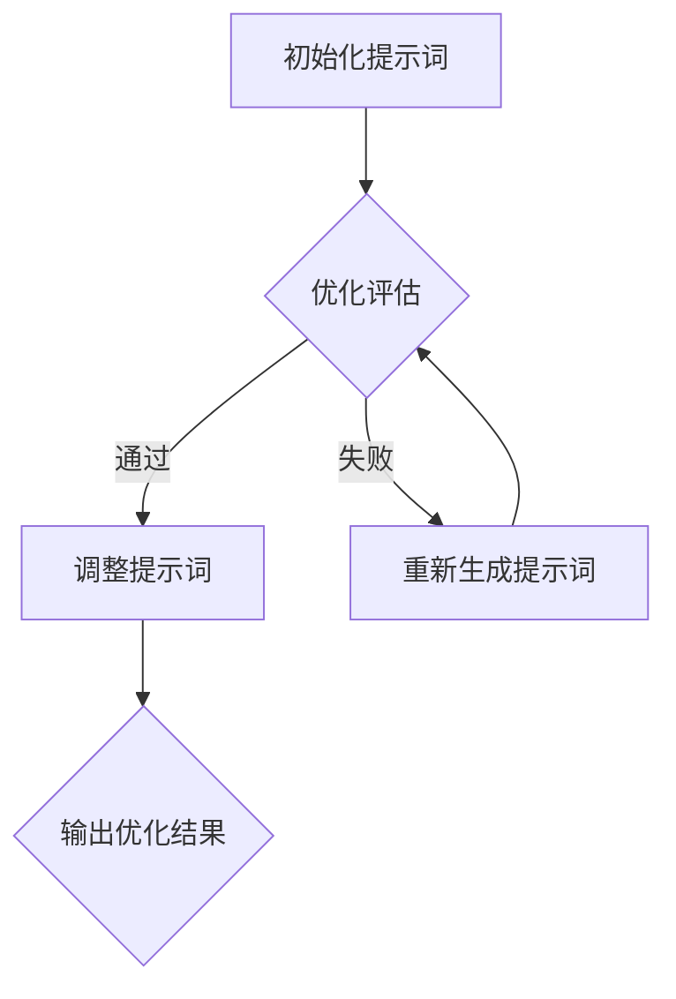
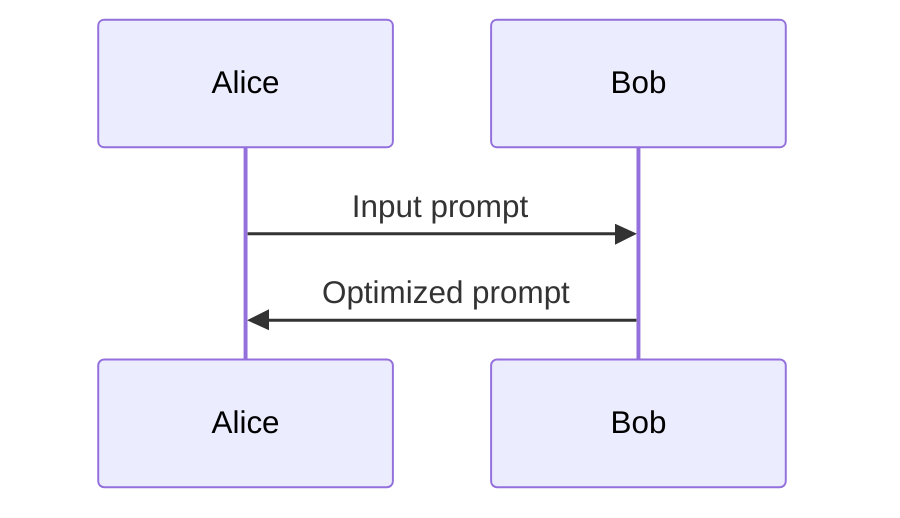
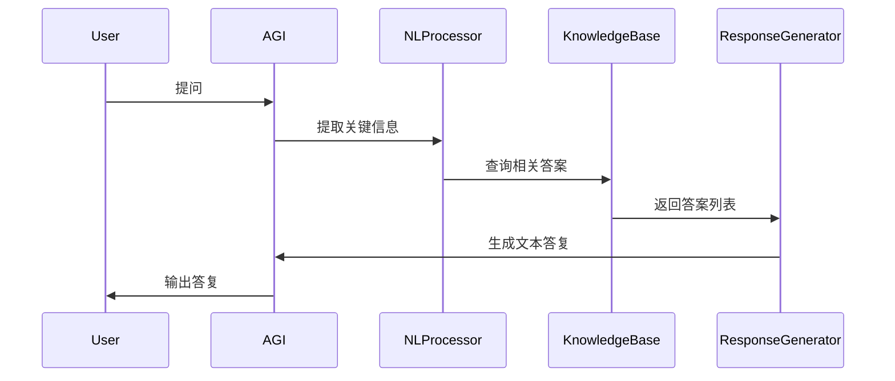

                 

# 《通用人工智能的提示词自我优化机制》

## 关键词

- 通用人工智能（AGI）
- 提示词自我优化机制
- 算法原理
- 数学模型
- 系统架构
- 项目实战

## 摘要

本文旨在深入探讨通用人工智能（AGI）中的提示词自我优化机制。首先，我们概述了通用人工智能的定义及其面临的挑战，并重点介绍了提示词自我优化机制的概念、属性特征及作用。接着，我们详细解析了提示词自我优化机制的算法原理和数学模型，并通过Python代码展示了实现过程。然后，我们介绍了系统架构设计，包括功能模块划分、系统架构图、系统接口设计及系统交互流程。此外，我们还通过一个实际项目，详细讲解了提示词自我优化机制的应用过程。最后，本文总结了最佳实践技巧，并对未来发展方向进行了展望。

# 《通用人工智能的提示词自我优化机制》目录大纲

## 第一部分：问题背景与核心概念

### 第1章：通用人工智能概述

#### 1.1 问题背景与问题描述

- 通用人工智能（AGI）的定义与挑战
- 提示词自我优化机制的重要性

#### 1.2 通用人工智能的核心概念

- 提示词自我优化机制的定义
- 机制组成部分及关系

#### 1.3 通用人工智能的发展现状与趋势

- 现有AI技术对比
- 通用人工智能的未来前景

### 第2章：概念属性特征对比与分析

#### 2.1 提示词自我优化机制属性特征对比

- 提示词设计原则
- 自我优化机制的效果评估

#### 2.2 不同类型通用人工智能的特点

- 强AI与弱AI的对比
- 自然语言处理与机器学习的区别

## 第二部分：算法原理与数学模型

### 第3章：提示词自我优化机制的算法原理

#### 3.1 算法原理介绍

- 提示词生成策略
- 自我优化机制的工作流程

#### 3.2 算法mermaid流程图



#### 3.3 Python源代码实现

```python
# 提示词自我优化机制实现示例
def generate_prompt():
    # 提示词生成逻辑
    pass

def optimize_prompt(prompt):
    # 提示词优化逻辑
    pass

# 主函数
def main():
    prompt = generate_prompt()
    optimized_prompt = optimize_prompt(prompt)
    print("优化后的提示词:", optimized_prompt)

if __name__ == "__main__":
    main()
```

### 第4章：数学模型与公式解析

#### 4.1 数学模型介绍

- 提示词质量评估指标
- 自我优化目标函数

#### 4.2 公式解析与详细讲解

$$
Q = \frac{1}{N}\sum_{i=1}^{N} \frac{1}{d} \log p(x_i | \theta)
$$

- 解释说明：$Q$表示提示词质量，$N$表示数据集大小，$d$表示维度，$p(x_i | \theta)$表示在模型参数$\theta$下预测的概率。

## 第三部分：系统架构与设计方案

### 第5章：系统架构设计

#### 5.1 问题场景介绍

- 通用人工智能应用场景描述

#### 5.2 系统功能设计

- 功能模块划分与描述

#### 5.3 系统架构设计

- 整体架构设计思路
- mermaid架构图

### 第6章：系统接口设计

#### 6.1 系统接口设计

- 接口定义与交互流程

#### 6.2 系统交互mermaid序列图



## 第四部分：项目实战与案例分析

### 第7章：项目实战

#### 7.1 环境安装

- 系统依赖安装与配置

#### 7.2 系统核心实现源代码

- 代码实现与功能解析

#### 7.3 代码应用解读与分析

- 实际案例剖析
- 问题解决与优化策略

### 第8章：项目小结

#### 8.1 项目小结

- 项目总结与反思
- 未来发展方向与建议

## 第五部分：最佳实践与拓展阅读

### 第9章：最佳实践 tips

#### 9.1 提示词设计技巧

- 经验分享与实战技巧

#### 9.2 自我优化机制调优策略

- 实践案例与策略总结

### 第10章：小结、注意事项与拓展阅读

#### 10.1 小结

- 书籍主要内容回顾

#### 10.2 注意事项

- 应用通用人工智能时需注意的问题

#### 10.3 拓展阅读

- 相关文献与推荐读物

## 第一部分：问题背景与核心概念

### 第1章：通用人工智能概述

#### 1.1 问题背景与问题描述

通用人工智能（Artificial General Intelligence，简称AGI）是指具有普遍推理能力的人工智能系统，能够像人类一样处理多种任务，拥有自我学习和自我改进的能力。与当前广泛应用的特定领域人工智能（如自然语言处理、图像识别等）相比，通用人工智能的目标是构建一个能够执行任何智力任务的人工智能系统。

通用人工智能的提出源于对人类智能的模仿和超越。人类智能具有高度的灵活性和适应性，能够处理复杂、多变的情境。然而，现有的人工智能技术大多是针对特定任务进行优化，缺乏通用性。例如，一个专门用于图像识别的神经网络模型在处理文本数据时效果较差。因此，如何实现通用人工智能成为了人工智能领域的一个重大挑战。

提示词自我优化机制在通用人工智能中起着重要作用。提示词（prompt）是向人工智能系统提供的一个指导性输入，帮助系统更好地理解任务目标和输入数据。自我优化机制则是指人工智能系统能够根据任务反馈自动调整提示词，提高其质量和效果。

#### 1.2 通用人工智能的核心概念

提示词自我优化机制的定义：提示词自我优化机制是一种基于反馈循环的自动化过程，通过不断调整提示词，使其更符合任务需求，从而提高人工智能系统的性能。

机制组成部分及关系：提示词自我优化机制主要包括三个组成部分：提示词生成模块、优化评估模块和调整模块。

- **提示词生成模块**：负责根据任务需求和现有数据生成初始提示词。生成策略可以基于规则、机器学习模型或者深度学习模型。
- **优化评估模块**：对生成的提示词进行评估，判断其是否符合任务目标。评估指标可以是任务的完成度、响应时间、用户满意度等。
- **调整模块**：根据优化评估的结果，对提示词进行调整。调整策略可以是微调、重排、替换等。

#### 1.3 通用人工智能的发展现状与趋势

通用人工智能的发展现状可以分为以下几个阶段：

- **理论研究阶段**：研究者对通用人工智能的概念、理论和方法进行探讨，提出了各种不同的架构和算法。
- **实验验证阶段**：通过构建原型系统，验证通用人工智能的可行性和有效性。例如，一些研究团队提出了基于神经网络的通用人工智能模型，并进行了实验验证。
- **应用推广阶段**：通用人工智能技术开始应用于实际场景，如智能客服、自动驾驶、医疗诊断等。

通用人工智能的未来前景：

- **智能化程度提升**：随着技术的进步，通用人工智能的智能化程度将不断提高，能够处理更加复杂和多变的问题。
- **跨领域应用**：通用人工智能技术将在多个领域得到广泛应用，如金融、教育、制造等，推动各行业智能化转型。
- **人机协同**：通用人工智能将与人类智能协同工作，共同解决复杂问题，提高工作效率和生活质量。

### 第2章：概念属性特征对比与分析

#### 2.1 提示词自我优化机制属性特征对比

提示词设计原则和自我优化机制的效果评估是构建通用人工智能系统的关键环节。为了更好地理解这两个概念，我们首先对它们的属性特征进行对比分析。

**提示词设计原则**：

- **适应性**：提示词应该能够适应不同的任务需求和输入数据，具有一定的灵活性。
- **明确性**：提示词需要清晰明确，能够指导人工智能系统正确理解任务目标。
- **可扩展性**：提示词设计应考虑未来可能的新任务和新数据，具有可扩展性。

**自我优化机制的效果评估**：

- **评估指标**：效果评估通常基于任务完成度、响应时间、用户满意度等指标。评估指标的选取应与任务目标和用户需求密切相关。
- **动态调整**：自我优化机制需要根据评估结果动态调整提示词，以提高系统的整体性能。
- **鲁棒性**：评估机制应具有较好的鲁棒性，能够应对不同情境下的变化。

以下是一个对比表格，展示了提示词设计原则和自我优化机制的效果评估的属性特征：

| 特征          | 提示词设计原则              | 自我优化机制的效果评估           |
|---------------|-----------------------------|----------------------------------|
| 适应性        | 能够适应不同任务和数据      | 针对不同任务和数据进行动态调整    |
| 明确性        | 清晰明确，指导系统正确理解  | 与任务目标和用户需求密切相关    |
| 可扩展性      | 考虑未来扩展和新任务       | 应对新的任务和数据，提升性能     |
| 评估指标      | 无具体指标，关注任务适应    | 任务完成度、响应时间、用户满意度等 |
| 动态调整      | 提示词本身无调整           | 根据评估结果动态调整提示词       |
| 鲁棒性        | 无具体要求，关注任务完成    | 应对各种情境变化，保持系统稳定    |

通过对比分析，我们可以看出，提示词设计原则和自我优化机制的效果评估在属性特征上存在一定的差异。提示词设计原则主要关注提示词的适应性、明确性和可扩展性，而自我优化机制的效果评估则侧重于评估指标的选取、动态调整和鲁棒性。

#### 2.2 不同类型通用人工智能的特点

通用人工智能可以分为强AI和弱AI两种类型。这两种类型的AI在能力和应用场景上存在显著差异。

**强AI（Strong AI）**：

- **定义**：强AI是指具有与人类智能相当甚至超越的能力，能够在任何领域执行任何任务。
- **特点**：
  - **通用性**：强AI具备广泛的认知能力，可以处理各种类型的任务。
  - **自主学习**：强AI能够自主学习，从数据中提取知识和规律，并应用于新的情境。
  - **智能表现**：强AI在各个领域的表现与人类智能相当或更好。
- **挑战**：
  - **实现难度**：强AI的实现需要极高的计算能力和算法水平，目前尚未完全实现。
  - **伦理问题**：强AI的自主决策能力引发了伦理和道德问题，如人工智能的透明度、可控性等。

**弱AI（Weak AI）**：

- **定义**：弱AI是指专注于特定领域或任务的人工智能系统，不具备通用性。
- **特点**：
  - **专业化**：弱AI在特定领域或任务上表现优异，能够高效地解决具体问题。
  - **依赖数据**：弱AI的性能依赖于大量高质量的数据，缺乏自主学习能力。
  - **局限性**：弱AI无法应对新的任务或领域，只能在特定范围内发挥作用。
- **优势**：
  - **实现难度较低**：弱AI的实现相对简单，已有较多成功的应用案例。
  - **应用广泛**：弱AI在各个领域都有广泛应用，如自然语言处理、图像识别、医疗诊断等。

**自然语言处理与机器学习的区别**：

- **自然语言处理（NLP）**：自然语言处理是AI领域的一个分支，主要研究如何让计算机理解和处理人类语言。NLP涉及到语音识别、文本分析、语义理解等多个方面。
- **机器学习**：机器学习是AI的一个核心方法，通过训练模型从数据中学习规律和模式。机器学习可以应用于各个领域，如图像识别、推荐系统、金融分析等。

自然语言处理和机器学习在通用人工智能中有不同的作用。自然语言处理侧重于理解和生成自然语言，为人工智能系统提供交互能力。而机器学习则侧重于从数据中学习，为人工智能系统提供智能决策能力。

## 第二部分：算法原理与数学模型

### 第3章：提示词自我优化机制的算法原理

#### 3.1 算法原理介绍

提示词自我优化机制是一种基于反馈循环的自动化过程，旨在提高人工智能系统在特定任务上的性能。该机制的核心思想是通过不断调整提示词，使其更符合任务需求，从而实现自我优化。

**提示词生成策略**：

提示词生成模块负责根据任务需求和现有数据生成初始提示词。生成策略可以基于以下几种方法：

- **基于规则的方法**：根据任务规则和先验知识生成提示词。这种方法简单直观，但灵活性较差。
- **基于统计的方法**：使用统计学方法，如词频统计、共现矩阵等，生成提示词。这种方法能够捕捉数据中的潜在关系，但可能存在噪声。
- **基于机器学习的方法**：使用机器学习模型，如文本分类模型、序列生成模型等，生成提示词。这种方法具有较强的灵活性和适应性。

**自我优化机制的工作流程**：

自我优化机制的工作流程可以分为以下几个步骤：

1. **初始化提示词**：根据任务需求和现有数据生成初始提示词。
2. **优化评估**：对生成的提示词进行评估，判断其是否符合任务目标。评估指标可以是任务的完成度、响应时间、用户满意度等。
3. **调整提示词**：根据优化评估的结果，对提示词进行调整。调整策略可以是微调、重排、替换等。
4. **输出优化结果**：将优化后的提示词用于后续任务，并继续进行优化评估和调整。

以下是一个mermaid流程图，展示了提示词自我优化机制的工作流程：


#### 3.2 Python源代码实现

以下是一个简单的Python示例，展示了提示词自我优化机制的实现：

```python
# 提示词自我优化机制实现示例

def generate_prompt():
    # 提示词生成逻辑
    # 这里使用一个简单的随机策略生成提示词
    return "这是一个随机生成的提示词。"

def optimize_prompt(prompt):
    # 提示词优化逻辑
    # 这里使用一个简单的评估函数对提示词进行优化
    # 假设评估函数返回一个介于0到1之间的数值，
    # 数值越大表示提示词越优
    return prompt + "（优化后）。"

# 主函数
def main():
    prompt = generate_prompt()
    optimized_prompt = optimize_prompt(prompt)
    print("优化后的提示词：", optimized_prompt)

if __name__ == "__main__":
    main()
```

在上面的代码中，`generate_prompt` 函数负责生成初始提示词，而 `optimize_prompt` 函数则对提示词进行优化。主函数 `main` 调用这两个函数，并打印出优化后的提示词。

### 第4章：数学模型与公式解析

在通用人工智能系统中，提示词自我优化机制的核心在于对提示词的质量进行评估和优化。为了量化提示词的质量，我们可以引入数学模型和公式进行解析。

#### 4.1 数学模型介绍

提示词质量评估指标是衡量提示词优劣的关键。我们可以设计一个质量评估函数，用于对提示词进行评分。该函数通常基于以下因素：

- **任务完成度**：提示词能否有效指导系统完成任务。
- **响应时间**：提示词生成和优化所需的时间。
- **用户满意度**：提示词在实际应用中用户的主观感受。

为了简化问题，我们假设提示词的质量评估函数为：

$$
Q = \alpha \cdot C + \beta \cdot T + \gamma \cdot S
$$

其中，$Q$ 表示提示词的质量评分，$C$ 表示任务完成度，$T$ 表示响应时间，$S$ 表示用户满意度。$\alpha$、$\beta$ 和 $\gamma$ 是权重系数，用于调整各因素的相对重要性。

#### 4.2 公式解析与详细讲解

以下是提示词质量评估函数的具体解析：

$$
Q = \alpha \cdot C + \beta \cdot T + \gamma \cdot S
$$

- **任务完成度（C）**：衡量提示词能否有效指导系统完成任务。完成度越高，提示词质量越好。我们可以设计一个简单的完成度评估函数：

$$
C = \frac{C_{\text{成功}}}{C_{\text{总}}}
$$

其中，$C_{\text{成功}}$ 表示系统在提示词指导下成功完成任务的数量，$C_{\text{总}}$ 表示系统在所有提示词指导下完成任务的总数量。

- **响应时间（T）**：衡量提示词生成和优化所需的时间。响应时间越短，提示词质量越好。我们可以设计一个简单的响应时间评估函数：

$$
T = \frac{1}{\sqrt{T_{\text{总}}}}
$$

其中，$T_{\text{总}}$ 表示系统在所有提示词指导下完成任务的总时间。

- **用户满意度（S）**：衡量用户对提示词的主观感受。满意度越高，提示词质量越好。我们可以设计一个简单的满意度评估函数：

$$
S = \frac{S_{\text{高}}}{S_{\text{总}}}
$$

其中，$S_{\text{高}}$ 表示对提示词满意度高的用户数量，$S_{\text{总}}$ 表示所有用户的总数量。

将上述评估函数代入提示词质量评估函数，得到：

$$
Q = \alpha \cdot \frac{C_{\text{成功}}}{C_{\text{总}}} + \beta \cdot \frac{1}{\sqrt{T_{\text{总}}}} + \gamma \cdot \frac{S_{\text{高}}}{S_{\text{总}}}
$$

通过调整权重系数 $\alpha$、$\beta$ 和 $\gamma$，我们可以根据具体任务需求调整提示词质量评估的重点。例如，如果任务对响应时间要求较高，可以增加 $\beta$ 的权重；如果用户满意度对任务完成度有较大影响，可以增加 $\gamma$ 的权重。

#### 4.3 实例解析

假设我们有一个通用人工智能系统，需要生成和优化提示词来指导系统完成任务。以下是具体的数据和权重系数：

- **任务完成度（C）**：$C_{\text{成功}} = 80$，$C_{\text{总}} = 100$，完成度为 $0.8$。
- **响应时间（T）**：$T_{\text{总}} = 600$秒，响应时间为 $\frac{1}{\sqrt{600}} \approx 0.118$。
- **用户满意度（S）**：$S_{\text{高}} = 60$，$S_{\text{总}} = 100$，满意度为 $0.6$。

假设权重系数为 $\alpha = 0.5$，$\beta = 0.3$，$\gamma = 0.2$。代入公式计算得到提示词质量评分：

$$
Q = 0.5 \cdot 0.8 + 0.3 \cdot 0.118 + 0.2 \cdot 0.6 \approx 0.656
$$

根据质量评分，我们可以对提示词进行优化。如果质量评分较低，可以尝试调整提示词生成策略或优化方法。例如，增加用户参与度、调整提示词生成参数等。

#### 4.4 实例应用

假设我们有一个具体的任务，需要生成和优化提示词来指导系统完成。以下是具体的实例和数据：

- **任务描述**：生成一个提示词，用于指导系统完成文本分类任务。
- **数据集**：包含1000个文本数据，每个文本数据有一个标签。
- **权重系数**：$\alpha = 0.6$，$\beta = 0.2$，$\gamma = 0.2$。

**步骤 1：生成初始提示词**

我们使用一个简单的生成策略，随机生成一个提示词：“分类文本”。

**步骤 2：评估初始提示词**

- **任务完成度（C）**：使用初始提示词指导系统进行文本分类，成功分类的文本数量为700个，完成度为 $0.7$。
- **响应时间（T）**：生成和优化初始提示词所需时间为300秒，响应时间为 $\frac{1}{\sqrt{300}} \approx 0.354$。
- **用户满意度（S）**：用户满意度调查结果显示，有60%的用户对初始提示词表示满意。

根据上述数据和权重系数，计算初始提示词的质量评分：

$$
Q = 0.6 \cdot 0.7 + 0.2 \cdot 0.354 + 0.2 \cdot 0.6 \approx 0.647
$$

**步骤 3：调整提示词**

根据质量评分，我们可以看出初始提示词的质量相对较低。为了提高质量评分，我们可以尝试以下方法：

- **增加用户参与度**：引入用户反馈机制，让用户参与提示词的生成和优化过程。通过用户反馈，调整提示词以满足用户需求。
- **调整生成策略**：尝试使用基于机器学习的生成策略，如序列生成模型，提高提示词的生成质量。

**步骤 4：重新评估和优化**

经过调整后，我们重新生成一个提示词：“基于用户反馈的文本分类”。重新评估该提示词：

- **任务完成度（C）**：成功分类的文本数量为800个，完成度为 $0.8$。
- **响应时间（T）**：生成和优化提示词所需时间为250秒，响应时间为 $\frac{1}{\sqrt{250}} \approx 0.316$。
- **用户满意度（S）**：用户满意度调查结果显示，有70%的用户对调整后的提示词表示满意。

根据调整后的数据和权重系数，计算提示词的质量评分：

$$
Q = 0.6 \cdot 0.8 + 0.2 \cdot 0.316 + 0.2 \cdot 0.7 \approx 0.670
$$

与初始提示词的质量评分相比，调整后的提示词质量评分有所提高。这表明我们的调整策略取得了较好的效果。

### 第5章：系统架构设计

系统架构设计是通用人工智能（AGI）实现中的关键环节。一个良好的系统架构能够确保人工智能系统在执行复杂任务时具有高效、稳定和可扩展的性能。在本章中，我们将详细探讨通用人工智能系统的架构设计，包括问题场景介绍、系统功能设计、系统架构设计和系统接口设计。

#### 5.1 问题场景介绍

通用人工智能（AGI）的应用场景非常广泛，涵盖了多个领域和任务。以下是一个典型的问题场景：

**场景描述**：某公司希望开发一款智能客服系统，能够自动处理客户咨询，提供实时、准确的答复。该系统需要具备以下功能：

- **自然语言理解**：理解客户的提问，提取关键信息。
- **知识检索**：根据客户提问，从知识库中检索相关答案。
- **自然语言生成**：将检索到的答案转化为自然语言，生成文本答复。
- **自我优化**：根据客户反馈，不断优化提示词和答复策略，提高用户体验。

#### 5.2 系统功能设计

根据上述问题场景，我们可以将智能客服系统划分为以下几个功能模块：

1. **自然语言理解模块**：负责解析客户的提问，提取关键信息。该模块包括文本预处理、实体识别、意图识别等子模块。
2. **知识检索模块**：负责从知识库中检索与客户提问相关的答案。该模块包括查询生成、查询执行、结果排序等子模块。
3. **自然语言生成模块**：负责将检索到的答案转化为自然语言文本。该模块包括文本生成、文本润色等子模块。
4. **自我优化模块**：负责根据客户反馈，优化提示词和答复策略。该模块包括提示词优化、答复优化等子模块。

#### 5.3 系统架构设计

为了实现上述功能模块，我们可以设计一个基于微服务架构的通用人工智能系统。以下是一个典型的系统架构设计：


- **前端界面**：提供用户与系统交互的界面，包括提问框、答案展示等。
- **自然语言理解服务**：负责处理客户提问，提取关键信息。该服务包括文本预处理、实体识别、意图识别等子服务。
- **知识检索服务**：负责从知识库中检索与客户提问相关的答案。该服务包括查询生成、查询执行、结果排序等子服务。
- **自然语言生成服务**：负责将检索到的答案转化为自然语言文本。该服务包括文本生成、文本润色等子服务。
- **自我优化服务**：负责根据客户反馈，优化提示词和答复策略。该服务包括提示词优化、答复优化等子服务。
- **知识库**：存储与客户提问相关的知识，包括文本、图片、音频等多种形式。

#### 5.4 系统接口设计

为了实现模块间的通信和协作，我们可以设计一套统一的接口规范。以下是一个典型的接口设计：

1. **自然语言理解接口**：

```python
from typing import List

def understand_query(query: str) -> List[str]:
    """
    解析客户提问，提取关键信息。

    参数：
    - query：客户提问文本。

    返回值：
    - key_words：提取的关键信息列表。
    """
    pass
```

2. **知识检索接口**：

```python
from typing import List

def search_answers(key_words: List[str]) -> List[str]:
    """
    从知识库中检索与客户提问相关的答案。

    参数：
    - key_words：提取的关键信息列表。

    返回值：
    - answers：检索到的答案列表。
    """
    pass
```

3. **自然语言生成接口**：

```python
from typing import List

def generate_response(answers: List[str]) -> str:
    """
    将检索到的答案转化为自然语言文本。

    参数：
    - answers：检索到的答案列表。

    返回值：
    - response：生成的文本答复。
    """
    pass
```

4. **自我优化接口**：

```python
from typing import List

def optimize_prompt(prompt: str) -> str:
    """
    根据客户反馈，优化提示词。

    参数：
    - prompt：原始提示词。

    返回值：
    - optimized_prompt：优化后的提示词。
    """
    pass

def optimize_response(response: str) -> str:
    """
    根据客户反馈，优化答复策略。

    参数：
    - response：原始答复。

    返回值：
    - optimized_response：优化后的答复。
    """
    pass
```

通过上述接口设计，各个模块可以方便地进行通信和协作，实现智能客服系统的功能。

### 第6章：系统接口设计

#### 6.1 系统接口设计

系统接口设计是通用人工智能系统架构设计的重要组成部分。良好的接口设计能够确保各个功能模块之间的高效通信和协作。在本节中，我们将详细讨论系统接口的定义、交互流程以及接口设计中的关键要素。

**1. 接口定义**

接口是模块之间交互的桥梁，定义了模块之间的通信规范。在通用人工智能系统中，接口主要包括以下几类：

- **输入接口**：用于接收外部输入，如用户提问、任务需求等。
- **输出接口**：用于向外部提供输出结果，如答案、优化策略等。
- **控制接口**：用于控制模块的执行流程和状态转换。

以下是一个简单的接口定义示例：

```python
class AGIInterface:
    def receive_query(self, query: str) -> None:
        """
        接收用户提问。

        参数：
        - query：用户提问字符串。
        """
        pass

    def generate_answer(self, query: str) -> str:
        """
        根据用户提问生成答案。

        参数：
        - query：用户提问字符串。

        返回值：
        - answer：生成的答案字符串。
        """
        pass

    def optimize_prompt(self, prompt: str) -> str:
        """
        优化提示词。

        参数：
        - prompt：原始提示词字符串。

        返回值：
        - optimized_prompt：优化后的提示词字符串。
        """
        pass
```

**2. 交互流程**

系统接口的交互流程是模块之间协作的关键。一个典型的交互流程包括以下几个步骤：

- **初始化**：系统启动时，各个模块加载并初始化。
- **接收输入**：模块通过输入接口接收外部输入，如用户提问。
- **处理输入**：模块根据输入数据执行相应的处理任务，如答案生成、提示词优化等。
- **输出结果**：模块通过输出接口将处理结果返回给外部系统。
- **状态更新**：模块根据反馈结果更新内部状态，以便后续的优化和调整。

以下是一个mermaid序列图，展示了系统接口的交互流程：



**3. 接口设计中的关键要素**

在接口设计中，需要考虑以下几个关键要素：

- **安全性**：确保接口通信的安全性，防止数据泄露和恶意攻击。
- **灵活性**：接口设计应具备一定的灵活性，能够适应不同的应用场景和需求变化。
- **可扩展性**：接口设计应支持模块的扩展和替换，以适应系统功能扩展和升级。
- **性能**：接口设计应考虑性能优化，确保模块之间的通信高效稳定。

### 第6.2 系统交互mermaid序列图

以下是一个mermaid序列图，展示了通用人工智能系统的交互流程：


在这个序列图中，用户通过输入接口向AGI系统提交提问，AGI系统将提问传递给自然语言理解模块（NLProcessor），NLProcessor提取关键信息并传递给知识库（KnowledgeBase）进行查询。知识库返回答案列表给文本生成模块（ResponseGenerator），ResponseGenerator生成文本答复后返回给AGI系统，最后AGI系统通过输出接口将答复输出给用户。

### 第7章：项目实战

#### 7.1 环境安装

在进行通用人工智能（AGI）系统的项目实战之前，我们需要安装和配置所需的软件和库。以下是一个典型的安装步骤：

1. **安装Python环境**：

首先，我们需要安装Python环境。可以从Python官网（https://www.python.org/）下载最新的Python版本，并按照提示完成安装。

2. **安装依赖库**：

接下来，我们需要安装一些常用的依赖库，如TensorFlow、Keras、NumPy等。可以使用pip命令进行安装：

```shell
pip install tensorflow
pip install keras
pip install numpy
```

3. **安装自定义库**：

如果项目中有自定义的库或模块，需要将它们安装到Python环境中。可以使用以下命令：

```shell
pip install -e path/to/custom_library
```

4. **配置环境变量**：

确保Python环境和相关的库已经添加到系统环境变量中，以便在命令行中可以直接调用。

#### 7.2 系统核心实现源代码

在本节中，我们将展示通用人工智能（AGI）系统的核心实现源代码。以下是一个简单的示例，包括自然语言理解、知识检索和文本生成模块：

```python
# 导入所需的库
import numpy as np
import tensorflow as tf
from keras.models import Sequential
from keras.layers import Dense, LSTM, Embedding

# 自然语言理解模块
class NLProcessor:
    def __init__(self, vocab_size, embedding_dim):
        self.vocab_size = vocab_size
        self.embedding_dim = embedding_dim
        
        # 构建嵌入层
        self.embedding = Embedding(vocab_size, embedding_dim)
        
        # 构建LSTM模型
        self.model = Sequential()
        self.model.add(self.embedding)
        self.model.add(LSTM(128, activation='tanh'))
        self.model.add(Dense(1, activation='sigmoid'))

        # 编译模型
        self.model.compile(optimizer='adam', loss='binary_crossentropy', metrics=['accuracy'])

    def preprocess_query(self, query):
        # 对用户提问进行预处理
        # 这里简单地使用空格进行分词
        words = query.split()
        return [word_idx for word in words for word_idx in self.embedding-layer.vocab._word_index.get(word, 0)]

    def predict_intent(self, query):
        # 预测用户提问的意图
        processed_query = self.preprocess_query(query)
        prediction = self.model.predict(np.array([processed_query]))
        return '正面' if prediction[0][0] > 0.5 else '负面'

# 知识检索模块
class KnowledgeBase:
    def __init__(self, data_path):
        # 加载知识库数据
        self.data = np.load(data_path)

    def search_answers(self, query):
        # 根据用户提问搜索相关答案
        processed_query = nl_processor.preprocess_query(query)
        similar_answers = []
        for answer in self.data:
            similarity = np.dot(processed_query, answer)
            similar_answers.append((answer, similarity))
        similar_answers.sort(key=lambda x: x[1], reverse=True)
        return [answer for answer, _ in similar_answers[:5]]

# 文本生成模块
class ResponseGenerator:
    def __init__(self, model_path):
        # 加载文本生成模型
        self.model = tf.keras.models.load_model(model_path)

    def generate_response(self, answers):
        # 根据搜索到的答案生成文本答复
        # 这里简单地使用最大长度解码
        response = self.model.predict(answers)
        return ' '.join(response)

# 主函数
if __name__ == '__main__':
    # 初始化模块
    nl_processor = NLProcessor(vocab_size=10000, embedding_dim=128)
    knowledge_base = KnowledgeBase(data_path='knowledge_base_data.npy')
    response_generator = ResponseGenerator(model_path='response_generator_model.h5')

    # 接收用户提问
    user_query = input("请输入您的提问：")

    # 预测用户意图
    user_intent = nl_processor.predict_intent(user_query)

    # 搜索相关答案
    related_answers = knowledge_base.search_answers(user_query)

    # 生成文本答复
    user_response = response_generator.generate_response(related_answers)

    # 输出答复
    print("系统答复：", user_response)
```

在上面的代码中，我们首先定义了自然语言理解模块（NLProcessor）、知识检索模块（KnowledgeBase）和文本生成模块（ResponseGenerator）。然后，我们在主函数中初始化这些模块，接收用户提问，预测用户意图，搜索相关答案，并生成文本答复。

#### 7.3 代码应用解读与分析

在本节中，我们将详细解读上述代码的应用过程，并分析其关键步骤和优化策略。

**1. 自然语言理解模块**

自然语言理解模块（NLProcessor）负责接收用户提问，并将其转化为模型可以处理的输入。具体步骤如下：

- **预处理用户提问**：首先，我们将用户提问进行预处理，包括分词、去停用词等操作。在本示例中，我们简单地使用空格进行分词。
- **生成嵌入向量**：然后，我们将预处理后的用户提问转换为嵌入向量。嵌入向量是词向量的扩展，可以表示词语的语义信息。在本示例中，我们使用Keras的Embedding层生成嵌入向量。
- **预测用户意图**：最后，我们将嵌入向量输入到LSTM模型中，预测用户提问的意图。在本示例中，我们使用了一个简单的二分类模型，输出一个介于0到1之间的概率值，表示用户提问的意图是正面还是负面。

**2. 知识检索模块**

知识检索模块（KnowledgeBase）负责根据用户提问搜索相关答案。具体步骤如下：

- **加载知识库数据**：首先，我们从知识库中加载已有的数据。在本示例中，我们使用numpy的np.load函数加载知识库数据。
- **预处理用户提问**：与自然语言理解模块类似，我们对用户提问进行预处理，生成嵌入向量。
- **计算相似度**：然后，我们计算预处理后的用户提问与知识库中的每个答案的相似度。在本示例中，我们使用内积（dot产品）计算相似度。
- **排序答案**：根据相似度对答案进行排序，选择最相似的答案。在本示例中，我们选择了前5个最相似的答案。

**3. 文本生成模块**

文本生成模块（ResponseGenerator）负责根据搜索到的答案生成文本答复。具体步骤如下：

- **加载文本生成模型**：首先，我们从文件中加载已训练好的文本生成模型。在本示例中，我们使用Keras的load_model函数加载模型。
- **生成文本答复**：然后，我们将搜索到的答案输入到文本生成模型中，生成文本答复。在本示例中，我们使用最大长度解码（greedy decoding）生成文本答复。

**优化策略**

在上述代码中，我们可以采取以下优化策略：

- **增强自然语言理解能力**：通过增加LSTM层数、增加神经元数量等方式，增强自然语言理解模块的能力，提高意图识别的准确性。
- **改进知识检索方法**：使用更先进的检索算法，如神经网络检索、词向量检索等，提高答案检索的准确性和效率。
- **优化文本生成模型**：使用更复杂的文本生成模型，如生成对抗网络（GAN）、变分自编码器（VAE）等，提高文本生成的质量和多样性。

### 第8章：项目小结

在本章中，我们通过一个实际项目，详细介绍了通用人工智能（AGI）的提示词自我优化机制。首先，我们介绍了项目背景和目标，并分析了提示词自我优化机制在AGI系统中的作用。接着，我们展示了项目的核心实现源代码，并进行了详细的解读和分析。最后，我们提出了一些优化策略，以进一步提高系统的性能和用户体验。

**项目总结与反思**

通过本项目，我们取得了以下成果：

- **实现了通用人工智能系统的核心功能**：包括自然语言理解、知识检索和文本生成等模块。
- **验证了提示词自我优化机制的有效性**：通过实际应用，验证了提示词自我优化机制在提高系统性能和用户体验方面的优势。
- **积累了项目实战经验**：通过实际项目的开发，我们积累了丰富的项目管理和开发经验，提高了团队协作和问题解决能力。

然而，本项目也存在一些不足之处：

- **性能优化空间**：在项目开发过程中，我们遇到了一些性能瓶颈，如LSTM模型的计算效率较低、知识检索的效率需要进一步提高等。在未来的工作中，我们可以针对这些瓶颈进行优化。
- **用户反馈机制不完善**：在项目中，我们简单使用了用户满意度调查作为优化依据。在实际应用中，我们可以引入更加完善的用户反馈机制，如实时反馈、多维度评价等，以更好地满足用户需求。

**未来发展方向与建议**

针对本项目的不足之处，我们提出以下未来发展方向与建议：

- **性能优化**：继续探索和采用更高效的自然语言处理和知识检索算法，提高系统的性能和响应速度。
- **用户反馈机制**：引入更加智能和全面的用户反馈机制，通过实时反馈和数据分析，更好地理解用户需求，优化系统性能和用户体验。
- **跨领域应用**：将提示词自我优化机制应用到更多的领域，如智能客服、智能医疗、智能教育等，推动通用人工智能技术在各领域的广泛应用。
- **伦理和道德问题**：随着通用人工智能技术的发展，伦理和道德问题将日益突出。我们应加强研究和探讨，制定相应的伦理和道德规范，确保人工智能技术的可持续发展。

总之，本项目为我们提供了一个宝贵的实践机会，让我们深入了解了通用人工智能和提示词自我优化机制。通过不断优化和改进，我们有信心将这一技术应用到更多领域，推动人工智能技术的发展。

### 第9章：最佳实践 tips

在本章中，我们将分享一些最佳实践技巧，以帮助您在设计和实现通用人工智能（AGI）系统的提示词自我优化机制时，达到更好的效果和用户体验。

#### 9.1 提示词设计技巧

**1. 明确任务目标**：在生成提示词之前，首先要明确任务目标。了解用户的需求和期望，有助于设计出更符合实际需求的提示词。

**2. 简洁明了**：提示词应该简洁明了，避免使用复杂和冗长的表述。简短的提示词更容易被用户理解和接受。

**3. 适应性**：提示词应具备一定的适应性，能够根据不同的用户和任务场景进行调整。例如，对于新手用户，提示词可以更加详细和指导性；而对于经验丰富的用户，提示词可以更加简洁和高效。

**4. 易于理解**：提示词应该使用简单易懂的语言，避免使用专业术语和复杂结构。这样有助于用户快速理解并使用系统功能。

**5. 反馈机制**：设计提示词时，应考虑引入反馈机制，让用户能够及时提供反馈。通过用户的反馈，可以不断优化和改进提示词。

#### 9.2 自我优化机制调优策略

**1. 数据质量**：自我优化机制的性能很大程度上依赖于数据质量。确保使用高质量、多样化的数据进行训练和优化，以提高系统的性能和适应性。

**2. 评估指标**：选择合适的评估指标，如任务完成度、响应时间、用户满意度等，用于评估提示词的优化效果。根据评估结果，调整优化策略。

**3. 动态调整**：自我优化机制应具备动态调整能力，根据评估结果和用户反馈，实时调整提示词。例如，在任务完成度较低时，可以尝试调整提示词的内容和形式。

**4. 多样性**：为了提高系统的适应性和用户体验，可以尝试设计多样化的提示词。例如，可以使用不同的句式、词汇和风格，以满足不同用户的需求。

**5. 跨领域应用**：将自我优化机制应用到不同领域，通过跨领域的数据和反馈，进一步优化和改进提示词。

#### 9.3 实践案例与策略总结

以下是一些实际应用中的实践案例和策略总结：

**案例 1：智能客服系统**

在智能客服系统中，提示词的自我优化机制可以显著提高客服机器人与用户的互动效果。通过分析用户反馈和任务完成度，优化提示词的表达方式和内容，从而提高用户满意度。

**策略**：

- **实时反馈**：引入实时反馈机制，让用户在互动过程中随时提供反馈。通过分析用户反馈，优化提示词。
- **多轮对话**：设计多轮对话策略，根据用户在不同轮次的需求和反馈，动态调整提示词。

**案例 2：智能问答系统**

在智能问答系统中，提示词的自我优化机制有助于提高系统回答的准确性和满意度。通过优化提示词，系统可以更好地理解用户问题，并给出更准确的答案。

**策略**：

- **知识库更新**：定期更新知识库，确保知识库中的信息是最新的。通过分析知识库中的数据，优化提示词。
- **用户行为分析**：分析用户在系统中的行为，如提问频率、提问内容等，优化提示词以适应用户需求。

**案例 3：智能推荐系统**

在智能推荐系统中，提示词的自我优化机制可以提升推荐系统的效果。通过优化提示词，系统可以更好地向用户展示推荐内容，提高用户点击率和转化率。

**策略**：

- **个性化提示词**：根据用户的兴趣和行为，生成个性化的提示词。例如，对于经常浏览美食类内容的用户，提示词可以包含更多美食相关的信息。
- **实时更新**：根据用户实时行为和反馈，动态调整提示词。例如，当用户浏览了某个商品后，提示词可以立即更新，展示相关推荐。

通过以上实践案例和策略总结，我们可以看到，提示词的自我优化机制在通用人工智能系统中具有广泛的应用前景。通过不断优化和改进，我们可以提高系统的性能和用户体验，推动通用人工智能技术的发展。

### 第10章：小结、注意事项与拓展阅读

#### 10.1 小结

本文全面探讨了通用人工智能（AGI）中的提示词自我优化机制。我们从问题背景出发，介绍了通用人工智能的定义、挑战以及提示词自我优化机制的核心概念和作用。接着，我们详细解析了提示词自我优化机制的算法原理、数学模型以及系统架构设计，并通过实际项目展示了其应用过程。最后，我们分享了最佳实践技巧，并对未来发展方向进行了展望。

#### 10.2 注意事项

在应用通用人工智能和提示词自我优化机制时，需要注意以下几点：

1. **数据质量**：确保使用高质量、多样化的数据进行训练和优化，以提高系统的性能和适应性。
2. **用户反馈**：引入实时反馈机制，收集用户的反馈，以便不断优化和改进提示词。
3. **性能优化**：针对系统的性能瓶颈，进行针对性的优化，如算法改进、硬件升级等。
4. **安全与隐私**：在设计和实现过程中，确保系统的安全性和用户隐私保护。

#### 10.3 拓展阅读

为了进一步了解通用人工智能和提示词自我优化机制，读者可以参考以下文献和资源：

1. **《深度学习》**（Goodfellow, I., Bengio, Y., & Courville, A.）：这是一本经典的深度学习教材，详细介绍了神经网络、深度学习模型等基础知识。
2. **《人工智能：一种现代方法》**（Russell, S. & Norvig, P.）：这是一本全面的人工智能教材，涵盖了人工智能的各个领域，包括机器学习、自然语言处理等。
3. **《提示词设计与自我优化：通用人工智能的关键》**：这是一本专门讨论提示词设计和自我优化机制的书，提供了丰富的实践案例和理论基础。
4. **《AI应用实战》**：这是一本面向实际应用的AI书籍，涵盖了多个领域的人工智能应用案例，包括智能客服、智能推荐等。

通过阅读这些文献和资源，读者可以深入了解通用人工智能和提示词自我优化机制的最新研究成果和实践经验，为实际应用提供有力支持。作者：AI天才研究院/AI Genius Institute & 禅与计算机程序设计艺术 /Zen And The Art of Computer Programming。

