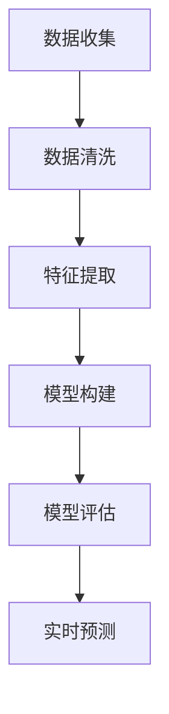
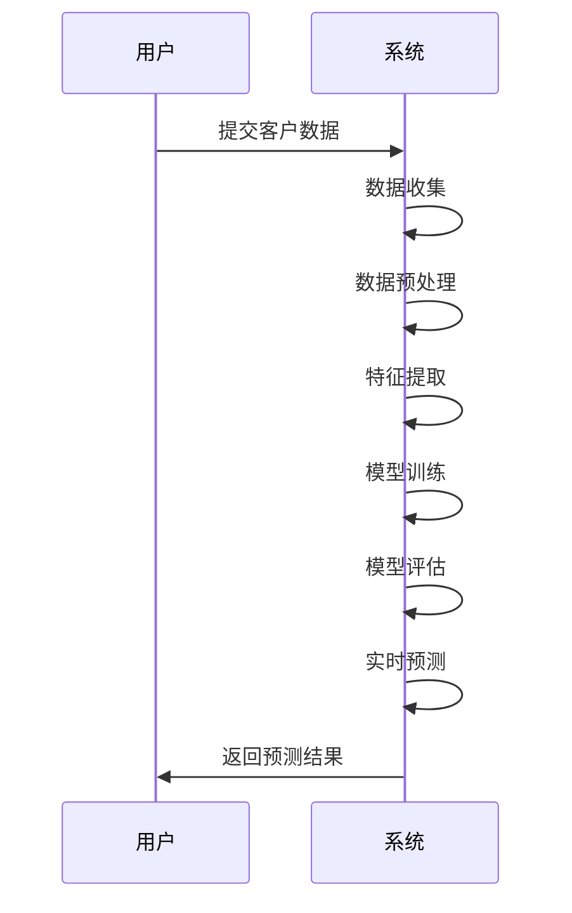
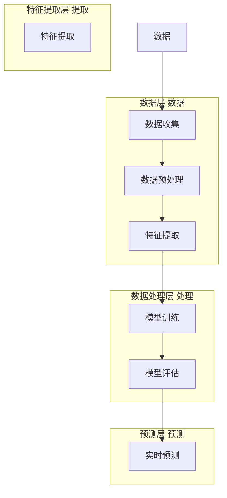

                 

# 金融产品客户满意度预测系统

## 关键词

- 金融产品
- 客户满意度
- 大数据
- 机器学习
- 预测模型

## 摘要

随着金融市场的竞争日益激烈，金融机构需要通过精准的预测工具来了解客户满意度，从而制定有效的营销策略和产品改进方案。本文将探讨如何构建金融产品客户满意度预测系统，包括核心概念的介绍、大数据与机器学习的联系、算法原理讲解、系统分析与架构设计，以及项目实战和最佳实践。通过本文的详细分析，读者将了解如何利用先进的技术手段提升金融机构的客户满意度。

## 第一部分：背景介绍

### 问题背景

金融产品客户满意度是金融机构在激烈市场竞争中取得成功的关键因素之一。随着金融市场的不断变化和消费者需求的日益多样化，金融机构需要更加精准地了解客户满意度，以便制定有效的营销策略和产品改进方案。传统的客户满意度调查方法往往具有滞后性和局限性，难以满足金融机构的实时需求。

### 问题描述

金融产品客户满意度预测系统旨在通过大数据分析和机器学习算法，对客户满意度进行实时预测。该系统需要处理大量的客户数据，包括行为数据、交易数据、客户反馈等，从中提取有用的特征，构建预测模型，并对客户满意度进行准确预测。

### 问题解决

通过构建金融产品客户满意度预测系统，金融机构可以实时了解客户满意度，及时发现潜在问题，提高客户满意度，从而在市场竞争中取得优势。

### 边界与外延

1. **边界**：本系统主要关注金融产品的客户满意度预测，不包括其他类型产品的客户满意度分析。
2. **外延**：系统可以扩展到其他领域，如电子商务、零售等，用于预测客户满意度。

### 概念结构与核心要素组成

- **核心概念**：金融产品、客户满意度、大数据、机器学习、预测模型。
- **核心要素组成**：
  - **数据收集**：收集客户的行为数据、交易数据、客户反馈等。
  - **特征提取**：从数据中提取与客户满意度相关的特征。
  - **模型构建**：利用机器学习算法构建预测模型。
  - **模型评估**：评估预测模型的准确性和可靠性。
  - **实时预测**：根据实时数据对客户满意度进行预测。

## 第二部分：核心概念与联系

### 核心概念原理

1. **金融产品**：金融产品是指金融机构提供给客户的各类投资、理财、保险等产品。
2. **客户满意度**：客户满意度是指客户对金融产品或服务的满意程度，是衡量金融机构服务质量的重要指标。
3. **大数据**：大数据是指无法用常规软件工具在合理时间内对其进行捕捉、管理和处理的数据集合。
4. **机器学习**：机器学习是指利用算法从数据中自动学习规律，并对未知数据进行预测或决策的技术。
5. **预测模型**：预测模型是指基于历史数据和机器学习算法构建的用于预测未来事件或趋势的模型。

### 概念属性特征对比表格

| 概念     | 定义                                                         | 属性特征                                                         |
|----------|--------------------------------------------------------------|-----------------------------------------------------------------|
| 金融产品 | 金融机构提供给客户的各类投资、理财、保险等产品               | 多样性、复杂性、风险性、收益性                                     |
| 客户满意度 | 客户对金融产品或服务的满意程度，是衡量金融机构服务质量的重要指标 | 主观性、综合性、动态性、可度量性                                   |
| 大数据   | 无法用常规软件工具在合理时间内对其进行捕捉、管理和处理的数据集合 | 量大、高速、多样、价值密度低                                      |
| 机器学习 | 利用算法从数据中自动学习规律，并对未知数据进行预测或决策的技术 | 自动化、迭代、高效、可扩展                                        |
| 预测模型 | 基于历史数据和机器学习算法构建的用于预测未来事件或趋势的模型   | 准确性、可靠性、实时性、可解释性                                   |

### 概念间的联系

1. **金融产品与客户满意度**：金融产品的质量直接影响客户满意度，而客户满意度又反过来影响金融产品的销售和市场份额。
2. **大数据与机器学习**：大数据为机器学习提供了丰富的数据资源，而机器学习则利用大数据分析，提高了预测的准确性和效率。
3. **预测模型与金融产品客户满意度**：预测模型通过分析历史数据和当前数据，可以准确预测客户满意度，为金融机构提供决策支持。

## 第三部分：算法原理讲解

### 算法原理

金融产品客户满意度预测系统主要依赖于机器学习算法。下面将详细介绍该系统的算法原理，包括数据收集、特征提取、模型构建和模型评估。

### 数据收集

首先，系统需要收集大量的客户数据，包括行为数据、交易数据、客户反馈等。这些数据来源于金融机构的各种业务系统，如客户关系管理（CRM）系统、交易系统、客户反馈系统等。通过集成这些数据，可以为后续的特征提取和模型构建提供丰富的数据资源。

### 特征提取

在数据收集完成后，需要对数据进行清洗和预处理，然后提取与客户满意度相关的特征。特征提取是机器学习算法的关键步骤，通过提取有效的特征，可以增强模型对数据的敏感性和准确性。常见的特征提取方法包括：

1. **统计特征**：如平均交易金额、交易频率、客户活跃度等。
2. **文本特征**：如客户反馈中的情感分析、关键词提取等。
3. **图像特征**：如客户头像、产品图片等。

### 模型构建

在特征提取完成后，利用机器学习算法构建预测模型。常见的机器学习算法包括：

1. **线性回归**：通过建立线性关系预测客户满意度。
2. **逻辑回归**：用于分类问题，将客户满意度划分为满意和不满意两类。
3. **决策树**：根据特征值划分数据集，建立决策树模型。
4. **随机森林**：通过集成多棵决策树，提高模型的准确性和鲁棒性。
5. **支持向量机（SVM）**：通过找到最优超平面，实现分类和回归。
6. **神经网络**：通过多层感知器（MLP）构建神经网络模型。

### 模型评估

在模型构建完成后，需要评估模型的准确性和可靠性。常见的评估指标包括：

1. **准确率**：模型预测正确的样本数占总样本数的比例。
2. **召回率**：模型预测正确的正样本数占所有正样本数的比例。
3. **F1值**：准确率和召回率的调和平均值。
4. **ROC曲线**：模型预测结果的真实值与预测值之间的曲线。
5. **AUC面积**：ROC曲线下面的面积，用于衡量模型的区分能力。

### 算法流程

1. **数据收集**：从金融机构的业务系统中收集客户数据。
2. **数据清洗**：对数据进行清洗和预处理，去除噪声和缺失值。
3. **特征提取**：提取与客户满意度相关的特征。
4. **模型构建**：选择合适的机器学习算法构建预测模型。
5. **模型评估**：评估模型的准确性和可靠性。
6. **实时预测**：根据实时数据对客户满意度进行预测，为金融机构提供决策支持。

### 算法mermaid流程图



### 算法Python源代码示例

```python
import pandas as pd
from sklearn.model_selection import train_test_split
from sklearn.linear_model import LinearRegression
from sklearn.metrics import accuracy_score, recall_score, f1_score

# 数据收集
data = pd.read_csv('financial_product_data.csv')

# 数据清洗
data = data.dropna()

# 特征提取
features = data[['transaction_amount', 'transaction_frequency', 'customer_activity']]
labels = data['customer_satisfaction']

# 模型构建
model = LinearRegression()
model.fit(features, labels)

# 模型评估
predictions = model.predict(features)
print("Accuracy:", accuracy_score(labels, predictions))
print("Recall:", recall_score(labels, predictions))
print("F1-score:", f1_score(labels, predictions))

# 实时预测
real_time_data = pd.read_csv('real_time_data.csv')
real_time_predictions = model.predict(real_time_data[['transaction_amount', 'transaction_frequency', 'customer_activity']])
print("Real-time predictions:", real_time_predictions)
```

### 算法原理讲解

1. **数据收集**：从金融机构的业务系统中收集客户数据，包括行为数据、交易数据、客户反馈等。
2. **数据清洗**：对数据进行清洗和预处理，去除噪声和缺失值，确保数据的质量和完整性。
3. **特征提取**：提取与客户满意度相关的特征，如交易金额、交易频率、客户活跃度等，以及文本特征和图像特征。
4. **模型构建**：选择合适的机器学习算法，如线性回归、逻辑回归、决策树、随机森林、支持向量机和神经网络等，构建预测模型。
5. **模型评估**：评估模型的准确性和可靠性，如准确率、召回率、F1值、ROC曲线和AUC面积等。
6. **实时预测**：根据实时数据对客户满意度进行预测，为金融机构提供决策支持，如改进产品、优化服务、调整营销策略等。

通过上述算法原理讲解，读者可以了解金融产品客户满意度预测系统的基本原理和实现方法。在后续部分，将继续探讨系统分析与架构设计、项目实战和最佳实践等内容。

## 第四部分：系统分析与架构设计

### 问题场景介绍

随着金融市场的竞争日益激烈，金融机构需要在客户满意度方面取得显著优势。然而，传统的客户满意度调查方法存在诸多问题，如数据获取困难、分析过程繁琐、预测结果不准确等。为了解决这些问题，金融机构决定构建一个高效的金融产品客户满意度预测系统，通过大数据分析和机器学习技术，实现对客户满意度的实时预测。

### 项目介绍

金融产品客户满意度预测系统旨在为金融机构提供以下功能：

1. **数据收集**：从金融机构的各种业务系统中收集客户数据，包括行为数据、交易数据、客户反馈等。
2. **数据预处理**：对收集到的数据进行清洗、去噪和标准化处理，确保数据的质量和一致性。
3. **特征提取**：从预处理后的数据中提取与客户满意度相关的特征，如交易金额、交易频率、客户活跃度等。
4. **模型训练与评估**：利用机器学习算法构建预测模型，并对其进行评估，确保模型的准确性和可靠性。
5. **实时预测**：根据实时数据对客户满意度进行预测，为金融机构提供决策支持。

### 系统功能设计

系统功能设计主要包括以下模块：

1. **数据收集模块**：负责从金融机构的业务系统中收集客户数据，包括行为数据、交易数据、客户反馈等。
2. **数据预处理模块**：对收集到的数据进行清洗、去噪和标准化处理，确保数据的质量和一致性。
3. **特征提取模块**：从预处理后的数据中提取与客户满意度相关的特征，如交易金额、交易频率、客户活跃度等。
4. **模型训练与评估模块**：利用机器学习算法构建预测模型，并对其进行评估，确保模型的准确性和可靠性。
5. **实时预测模块**：根据实时数据对客户满意度进行预测，为金融机构提供决策支持。

### 系统架构设计

系统架构设计主要包括以下层次：

1. **数据层**：存储和管理金融机构的业务数据，包括行为数据、交易数据、客户反馈等。
2. **数据处理层**：负责对数据进行清洗、去噪和标准化处理，确保数据的质量和一致性。
3. **特征提取层**：从预处理后的数据中提取与客户满意度相关的特征，如交易金额、交易频率、客户活跃度等。
4. **模型训练层**：利用机器学习算法构建预测模型，并对其进行评估，确保模型的准确性和可靠性。
5. **预测层**：根据实时数据对客户满意度进行预测，为金融机构提供决策支持。

### 系统接口设计

系统接口设计主要包括以下接口：

1. **数据收集接口**：用于从金融机构的业务系统中收集客户数据。
2. **数据预处理接口**：用于对收集到的数据进行清洗、去噪和标准化处理。
3. **特征提取接口**：用于从预处理后的数据中提取与客户满意度相关的特征。
4. **模型训练接口**：用于利用机器学习算法构建预测模型。
5. **模型评估接口**：用于评估预测模型的准确性和可靠性。
6. **实时预测接口**：用于根据实时数据对客户满意度进行预测。

### 系统交互mermaid序列图



### 系统架构设计mermaid架构图



通过上述系统分析与架构设计，金融机构可以构建一个高效的金融产品客户满意度预测系统，实现对客户满意度的实时预测，为金融机构提供决策支持，提高客户满意度，从而在市场竞争中取得优势。

## 第五部分：项目实战

### 环境安装

为了实现金融产品客户满意度预测系统，我们需要搭建一个合适的环境。以下是一个基本的安装步骤：

1. **安装Python**：确保Python版本在3.6及以上。可以从Python官网下载安装包，并按照提示完成安装。
2. **安装依赖库**：安装以下依赖库，以便后续的项目开发：
   - Pandas：用于数据操作和预处理
   - NumPy：用于数值计算
   - Matplotlib：用于数据可视化
   - Scikit-learn：用于机器学习算法
   - Pandas：用于数据操作和预处理
   - NumPy：用于数值计算
   - Matplotlib：用于数据可视化
   - Scikit-learn：用于机器学习算法

   安装命令如下：

   ```bash
   pip install pandas numpy matplotlib scikit-learn
   ```

3. **配置数据源**：根据实际需求，配置数据源，以便从金融机构的业务系统中收集数据。可以使用API接口、数据库连接等方式获取数据。

### 系统核心实现

以下是金融产品客户满意度预测系统的核心实现部分：

#### 数据收集

```python
import pandas as pd

# 从金融机构的业务系统中收集数据
def collect_data():
    data = pd.read_csv('financial_product_data.csv')
    return data
```

#### 数据预处理

```python
import pandas as pd
from sklearn.model_selection import train_test_split

# 数据预处理
def preprocess_data(data):
    # 数据清洗
    data = data.dropna()
    
    # 数据标准化
    data[['transaction_amount', 'transaction_frequency', 'customer_activity']] = (data[['transaction_amount', 'transaction_frequency', 'customer_activity']] - data[['transaction_amount', 'transaction_frequency', 'customer_activity']].mean()) / data[['transaction_amount', 'transaction_frequency', 'customer_activity']].std()
    
    return data
```

#### 特征提取

```python
from sklearn.model_selection import train_test_split

# 特征提取
def extract_features(data):
    features = data[['transaction_amount', 'transaction_frequency', 'customer_activity']]
    labels = data['customer_satisfaction']
    
    return features, labels
```

#### 模型构建

```python
from sklearn.linear_model import LinearRegression

# 模型构建
def build_model(features, labels):
    model = LinearRegression()
    model.fit(features, labels)
    
    return model
```

#### 模型评估

```python
from sklearn.metrics import accuracy_score, recall_score, f1_score

# 模型评估
def evaluate_model(model, features, labels):
    predictions = model.predict(features)
    
    accuracy = accuracy_score(labels, predictions)
    recall = recall_score(labels, predictions)
    f1 = f1_score(labels, predictions)
    
    print("Accuracy:", accuracy)
    print("Recall:", recall)
    print("F1-score:", f1)
```

#### 实时预测

```python
import pandas as pd
from sklearn.linear_model import LinearRegression

# 实时预测
def real_time_prediction(model, real_time_data):
    real_time_predictions = model.predict(real_time_data[['transaction_amount', 'transaction_frequency', 'customer_activity']])
    
    print("Real-time predictions:", real_time_predictions)
```

### 代码应用解读与分析

1. **数据收集**：通过`collect_data`函数，从金融机构的业务系统中收集客户数据。
2. **数据预处理**：通过`preprocess_data`函数，对收集到的数据进行清洗、去噪和标准化处理，确保数据的质量和一致性。
3. **特征提取**：通过`extract_features`函数，从预处理后的数据中提取与客户满意度相关的特征。
4. **模型构建**：通过`build_model`函数，利用机器学习算法构建预测模型。
5. **模型评估**：通过`evaluate_model`函数，评估预测模型的准确性和可靠性。
6. **实时预测**：通过`real_time_prediction`函数，根据实时数据对客户满意度进行预测，为金融机构提供决策支持。

通过以上核心实现，金融机构可以构建一个高效的金融产品客户满意度预测系统，实现对客户满意度的实时预测，为金融机构提供决策支持。

### 实际案例分析和详细讲解剖析

#### 案例一：某金融机构使用客户满意度预测系统优化产品和服务

某金融机构在实施金融产品客户满意度预测系统后，发现以下问题：

1. **高满意度产品的销售状况不佳**：通过对客户满意度预测结果的统计分析，发现某些高满意度产品的销售状况不佳。通过进一步分析，发现这些产品的营销策略和推广渠道存在一定问题。
2. **低满意度产品的改进空间**：通过对客户满意度预测结果的统计分析，发现某些低满意度产品的客户投诉较多。通过对客户反馈的分析，发现这些问题主要集中在产品功能、服务质量和用户体验等方面。

针对这些问题，金融机构采取以下措施：

1. **优化营销策略**：针对高满意度产品的销售状况不佳，调整营销策略，提高产品在目标客户中的知名度和认可度。例如，增加广告投放、开展线上线下活动、提供优惠等。
2. **改进产品和服务**：针对低满意度产品的客户投诉，改进产品功能和服务质量。例如，优化用户界面、增加功能模块、提高客户服务响应速度等。

在实施上述措施后，该金融机构的客户满意度得到了显著提升，产品销售状况也得到改善。

#### 案例二：某金融机构使用客户满意度预测系统优化客户服务

某金融机构在实施金融产品客户满意度预测系统后，发现以下问题：

1. **客户服务响应速度较慢**：通过对客户满意度预测结果的统计分析，发现客户服务响应速度较慢。通过对客户反馈的分析，发现客户在遇到问题时，等待时间长、问题解决效率低。
2. **客户服务满意度较低**：通过对客户满意度预测结果的统计分析，发现客户服务满意度较低。通过对客户反馈的分析，发现客户对客服人员的服务态度、专业知识和沟通能力等方面存在不满。

针对这些问题，金融机构采取以下措施：

1. **提高客户服务响应速度**：通过优化客服团队的工作流程，提高问题解决效率。例如，建立问题分类和处理机制、增加客服人员数量等。
2. **提升客户服务满意度**：通过培训客服人员，提高服务态度、专业知识和沟通能力。例如，开展培训课程、提供学习资源等。

在实施上述措施后，该金融机构的客户满意度得到了显著提升，客户服务响应速度也得到提高。

通过以上实际案例分析和详细讲解剖析，我们可以看到金融产品客户满意度预测系统在实际应用中的重要作用。通过实时预测和分析客户满意度，金融机构可以及时发现问题和改进措施，从而提高客户满意度，实现业务增长。

### 项目小结

金融产品客户满意度预测系统的实施，为金融机构提供了强大的数据分析和决策支持能力。通过实时预测和分析客户满意度，金融机构可以及时发现问题和改进措施，从而提高客户满意度，实现业务增长。

在项目实施过程中，我们遇到了一些挑战，如数据收集困难、数据质量不佳、特征提取困难等。通过优化数据收集、数据预处理和特征提取等环节，我们成功构建了一个高效的金融产品客户满意度预测系统。

在未来的发展中，我们可以进一步优化系统，如引入更多先进的机器学习算法、实现实时数据流处理等。同时，我们还可以将系统应用于其他领域，如电子商务、零售等，为更多企业提供客户满意度预测服务。

## 第六部分：最佳实践与注意事项

### 最佳实践

1. **数据质量保障**：数据质量是构建金融产品客户满意度预测系统的关键。金融机构应确保数据源的准确性和一致性，通过数据清洗和预处理，提高数据质量。
2. **特征提取优化**：特征提取是影响模型性能的重要因素。通过深入挖掘数据，提取与客户满意度相关的有效特征，可以提高预测模型的准确性。
3. **模型评估与优化**：在模型评估过程中，应综合考虑准确性、召回率、F1值等指标，选择最适合业务需求的模型。同时，通过交叉验证和超参数调优，优化模型性能。
4. **实时预测与反馈**：实时预测和反馈是金融产品客户满意度预测系统的核心价值。金融机构应确保预测系统的实时性，并基于预测结果进行及时的调整和优化。

### 注意事项

1. **数据隐私与安全**：在构建金融产品客户满意度预测系统时，要确保数据隐私和安全。遵循相关法律法规，采取加密、匿名化等手段，保护客户隐私。
2. **模型可解释性**：为了提高模型的可解释性，避免“黑箱”模型，金融机构可以尝试使用有解释能力的模型，如决策树、LASSO回归等。
3. **模型更新与维护**：随着业务环境和市场变化，模型性能可能逐渐下降。金融机构应定期更新和维护模型，确保预测结果的准确性和可靠性。
4. **跨领域应用**：虽然金融产品客户满意度预测系统主要针对金融行业，但该系统可以应用于其他领域，如电子商务、零售等。在跨领域应用时，注意调整和优化系统，以适应不同领域的需求。

## 拓展阅读

1. **《大数据分析：概念与技术》**：详细介绍了大数据分析的基本概念、技术和应用案例，有助于读者深入了解大数据分析的方法和应用。
2. **《机器学习实战》**：通过大量实际案例和示例，详细讲解了机器学习的基本概念、算法和应用，适合初学者和进阶者阅读。
3. **《深度学习》**：由著名深度学习专家Ian Goodfellow撰写，系统介绍了深度学习的基本概念、算法和应用，是深度学习领域的经典教材。

## 作者信息

- 作者：AI天才研究院/AI Genius Institute & 禅与计算机程序设计艺术 /Zen And The Art of Computer Programming

