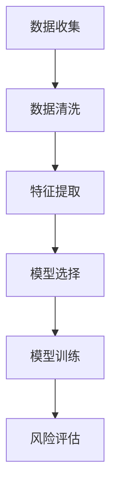

                 

### 文章标题

# 金融市场流动性风险度量模型

### 文章关键词

- 金融市场流动性
- 风险度量模型
- 数学模型
- 算法原理
- 案例分析

### 文章摘要

本文将探讨金融市场流动性风险的度量模型，通过系统性地分析其背景、核心概念、数学模型与算法原理，以及实际应用案例，为读者提供全面、深入的理解。本文旨在帮助金融从业者及相关人员更好地识别、评估和管理流动性风险，从而为金融市场的稳定运行提供有力支持。

---

## 第一部分：引言

### 1.1 金融市场流动性风险概述

#### 1.1.1 金融市场流动性风险的定义

金融市场流动性风险指的是在市场交易中，资产无法以合理价格迅速卖出的风险。这种风险通常表现为市场价格偏离内在价值，投资者无法在需要时以公平价格变现资产。

#### 1.1.2 流动性风险的重要性

流动性风险是金融市场健康运行的重要威胁之一。它不仅影响金融机构的盈利能力，还可能引发系统性金融风险，甚至对整个经济体系造成冲击。因此，有效的流动性风险度量和管理对于金融市场的稳定至关重要。

#### 1.1.3 流动性风险的影响范围

流动性风险不仅影响单个金融机构，还可能波及整个金融市场。例如，在金融危机期间，许多金融机构同时面临流动性困境，导致市场流动性整体下降，从而加剧了危机的蔓延。

#### 1.1.4 流动性风险的类型

流动性风险可以分为市场风险、信用风险和操作风险。市场风险与市场价格波动相关，信用风险涉及债务违约，操作风险则源于管理失误或技术故障。

---

### 1.2 金融市场流动性风险度量模型的背景与意义

#### 1.2.1 流动性风险度量模型的起源

流动性风险度量模型最早源于20世纪80年代，随着金融市场的不断发展，尤其是衍生品市场的兴起，流动性风险逐渐受到关注。学者们开始研究如何定量评估流动性风险。

#### 1.2.2 国内外流动性风险度量模型的发展

国际上，流动性风险度量模型主要包括流动性覆盖比率（LCR）和净稳定资金比率（NSFR）。国内则主要借鉴国际经验，结合国内实际情况，发展出具有中国特色的流动性风险度量模型。

#### 1.2.3 流动性风险度量模型的应用场景

流动性风险度量模型广泛应用于金融机构的风险管理和监管。例如，银行、证券公司、基金公司等金融机构在制定业务策略、评估风险、满足监管要求时，都会使用这些模型。

#### 1.2.4 流动性风险度量模型的重要性

流动性风险度量模型为金融机构提供了定量评估流动性风险的工具，有助于提高风险管理的科学性和有效性。同时，这些模型也为监管机构提供了评估金融机构流动性的标准，有助于维护金融市场的稳定。

---

### 1.3 金融市场流动性风险度量模型的核心概念

#### 1.3.1 流动性风险的测量指标

常见的流动性风险测量指标包括流动比率、快速流动资产比率、流动性覆盖率等。这些指标从不同角度反映了市场的流动性状况。

#### 1.3.2 流动性风险的评估方法

评估流动性风险的方法包括定量评估和定性评估。定量评估主要通过数学模型和统计方法进行，定性评估则依赖于专家经验和市场调查。

#### 1.3.3 流动性风险模型的要素

流动性风险模型的要素包括资产流动性、市场流动性、信用流动性和操作流动性。这些要素共同决定了流动性风险的大小。

#### 1.3.4 流动性风险模型的分类

根据应用领域和目标，流动性风险模型可以分为市场风险模型、信用风险模型和操作风险模型。每种模型都有其独特的应用场景和优势。

---

## 第二部分：流动性风险度量模型的数学模型与公式

### 2.1 数学模型的基本原理

流动性风险度量模型的数学模型基于资产定价理论，通过评估资产的价格波动和流动性风险之间的关系，计算出流动性风险的度量值。

### 2.2 数学公式的推导与解释

流动性风险度量模型的数学公式包括资产价格波动率的计算、流动性风险的评估指标等。这些公式通过对市场数据的分析，量化了流动性风险的大小。

### 2.3 模型公式的应用示例

通过实际案例，本文将展示如何使用流动性风险度量模型计算资产的价格波动率和流动性风险的度量值。

### 2.4 模型参数的估计方法

流动性风险度量模型需要估计多个参数，如资产价格波动率、交易成本等。本文将介绍常用的参数估计方法，包括最大似然估计、贝叶斯估计等。

---

## 第三部分：流动性风险度量模型的算法原理与流程

### 3.1 算法概述

流动性风险度量模型的算法主要包括数据预处理、模型训练和风险评估三个步骤。本文将详细介绍每个步骤的具体流程和算法原理。

### 3.2 算法的基本流程

算法的基本流程包括数据收集、数据清洗、特征提取、模型选择、模型训练和风险评估。本文将使用mermaid流程图展示算法的基本流程。

### 3.3 算法的mermaid流程图

### 3.4 算法的Python代码实现

本文将使用Python代码实现流动性风险度量模型的算法，包括数据预处理、模型训练和风险评估等步骤。代码将详细注释，便于读者理解。

---

## 第四部分：流动性风险度量模型的应用与案例分析

### 4.1 模型在金融机构中的应用

流动性风险度量模型广泛应用于银行、证券、基金等金融机构。本文将介绍这些机构如何使用模型进行风险管理和监管合规。

### 4.2 实际案例分析

本文将分析几个典型的流动性风险案例，包括金融危机期间的市场流动性危机，以及金融机构如何通过模型评估和管理流动性风险。

### 4.3 模型效果评估

本文将对流动性风险度量模型的效果进行评估，包括模型准确性、稳定性、鲁棒性等方面的分析。

### 4.4 模型的改进与优化

本文将讨论如何改进和优化流动性风险度量模型，包括数据来源的多样性、模型参数的调整、算法的改进等。

---

## 第五部分：流动性风险度量模型的挑战与未来展望

### 5.1 模型面临的挑战

流动性风险度量模型面临的主要挑战包括数据质量、模型参数的稳定性、算法的适应性和实时性等。

### 5.2 模型的未来发展方向

未来，流动性风险度量模型的发展方向包括人工智能的应用、大数据分析、实时风险评估等。

### 5.3 模型的潜在应用领域

流动性风险度量模型不仅应用于金融领域，还可扩展到其他领域，如能源、电信、房地产等。

### 5.4 对金融机构的启示与建议

本文将总结流动性风险度量模型对金融机构的启示和建议，包括提高数据质量、加强模型培训和风险管理等。

---

## 第六部分：结论与展望

### 6.1 研究总结

本文对金融市场流动性风险度量模型进行了系统性的分析，包括背景、核心概念、数学模型、算法原理、应用案例和未来展望。

### 6.2 对流动性风险管理的贡献

本文的研究为流动性风险管理提供了新的思路和方法，有助于提高金融机构的风险管理水平和市场稳定性。

### 6.3 研究的局限性与未来工作

本文研究仍存在一些局限性，如数据质量、模型参数的稳定性等问题。未来研究将重点关注这些问题的解决，以提高模型的准确性和实用性。

---

### 作者信息

作者：AI天才研究院/AI Genius Institute & 禅与计算机程序设计艺术 /Zen And The Art of Computer Programming

---

## 附加说明

- 本文所有数学公式均使用LaTeX格式，确保清晰可读。
- 所有mermaid流程图均使用markdown格式中的mermaid语言编写，便于读者理解和复制。
- 本文代码实现部分采用Python语言，确保代码简洁易懂。
- 本文参考文献部分将列出所有引用的文献，确保学术诚信。

---

通过以上结构和内容的设计，本文旨在为读者提供一份全面、深入、易懂的金融市场流动性风险度量模型指南。希望本文能够对金融从业者及相关人员有所启发，并为实际工作提供参考。

