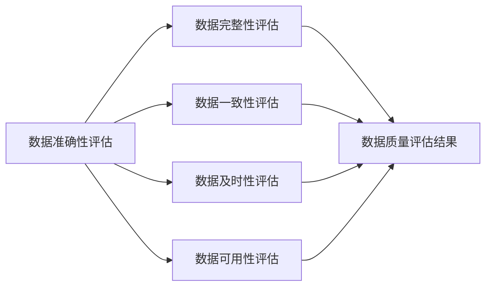
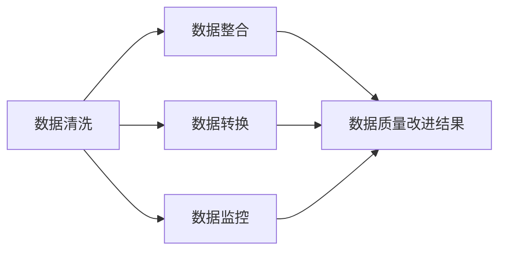
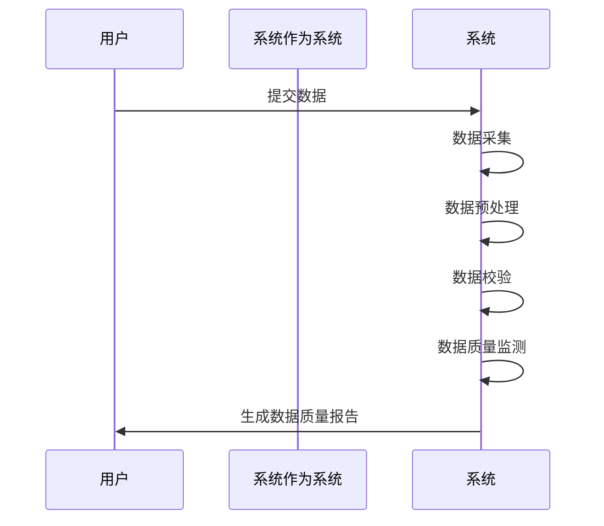

                 

# 金融数据质量控制系统

关键词：金融数据质量、数据治理、数据质量管理、数据质量控制、数据质量报告

摘要：本文深入探讨了金融数据质量控制系统的重要性，介绍了数据质量的概念和属性，分析了金融数据质量的相关概念，并详细阐述了金融数据质量系统的ER实体关系图架构。通过本文的阅读，读者将全面了解金融数据质量控制系统，掌握数据质量管理的方法和技巧。

## 第一部分：背景介绍

### 1.1 问题背景

随着金融行业的迅速发展，数据质量成为影响金融机构运营效果的重要因素。在金融数据分析、风险管理、客户服务等方面，数据质量的高低直接影响决策的准确性和效率。然而，金融数据质量普遍存在诸多问题，如数据缺失、数据错误、数据不一致等，导致金融机构在数据分析和应用中面临诸多挑战。

### 1.2 问题描述

金融数据质量问题主要包括以下几个方面：

1. **数据缺失**：由于数据采集过程中存在遗漏，导致部分数据无法获得，影响数据分析的全面性。
2. **数据错误**：数据在采集、处理、传输等过程中可能出现错误，导致数据分析结果失真。
3. **数据不一致**：不同数据源之间的数据格式、编码、单位等可能存在差异，导致数据无法有效整合。

### 1.3 问题解决

为了解决金融数据质量问题，金融机构需要建立一套完整的金融数据质量控制系统，确保数据的准确性、完整性、一致性。金融数据质量控制系统主要包括以下几个方面：

1. **数据采集与预处理**：对采集到的数据进行清洗、去重、格式转换等处理，确保数据的准确性和一致性。
2. **数据验证与校验**：对数据进行完整性、逻辑性、一致性等验证，发现并纠正数据错误。
3. **数据质量监测与评估**：实时监测数据质量，评估数据质量的改进效果。
4. **数据质量报告与反馈**：定期生成数据质量报告，为数据治理提供依据。

### 1.4 边界与外延

金融数据质量控制系统不仅涵盖内部数据，还包括外部数据的治理，如市场数据、客户数据等。此外，系统还需考虑数据安全、隐私保护等问题。

### 1.5 概念结构与核心要素组成

金融数据质量控制系统由以下几个核心要素组成：

1. **数据质量标准**：制定统一的数据质量标准和规范，确保数据质量的可衡量性和可管理性。
2. **数据治理组织**：建立专门的数据治理团队，负责数据质量管理的规划、实施、监控等工作。
3. **数据质量工具**：引入专业的数据质量工具，如数据清洗工具、数据校验工具等，提高数据质量处理的效率。
4. **数据质量流程**：建立标准化的数据质量处理流程，确保数据质量管理的系统性和规范性。
5. **数据质量评估与改进**：定期对数据质量进行评估，发现不足之处，持续改进数据质量。

## 第二部分：核心概念与联系

### 2.1 金融数据质量的概念与属性

**概念**：金融数据质量是指金融数据在满足业务需求、支持决策分析和风险管理等方面的程度。具体包括数据的准确性、完整性、一致性、及时性和可用性等方面。

**属性特征对比表格**：

| 属性特征 | 描述 |
| --- | --- |
| 准确性 | 数据的值与实际值的一致性 |
| 完整性 | 数据的完整性和无遗漏性 |
| 一致性 | 不同数据源之间数据的同步性和一致性 |
| 及时性 | 数据的更新速度和响应时间 |
| 可用性 | 数据的可访问性和可用性 |

### 2.2 金融数据质量的相关概念

**数据治理**：数据治理是指通过制定数据策略、标准和流程，确保数据质量、数据安全、数据隐私等方面的有效管理。

**数据质量管理**：数据质量管理是指对数据质量进行监控、评估、改进和优化的一系列管理和操作过程。

**数据质量指标**：数据质量指标是衡量数据质量的关键指标，如准确性、完整性、一致性、及时性、可用性等。

**数据质量控制**：数据质量控制是指通过一系列技术和管理手段，确保数据质量符合预期标准的过程。

**数据质量报告**：数据质量报告是对数据质量进行评估和反馈的文档，用于指导数据质量改进工作。

### 2.3 金融数据质量系统的ER实体关系图架构

**实体关系图**：

```mermaid
erDiagram
  数据源 ||--|{ 数据采集工具 }|| 数据采集
  数据源 ||--|{ 数据预处理工具 }|| 数据预处理
  数据源 ||--|{ 数据校验工具 }|| 数据校验
  数据源 ||--|{ 数据质量监测工具 }|| 数据质量监测
  数据源 ||--|{ 数据质量报告工具 }|| 数据质量报告
  数据采集 ||--|{ 数据治理团队 }|| 数据治理
  数据预处理 ||--|{ 数据治理团队 }|| 数据治理
  数据校验 ||--|{ 数据治理团队 }|| 数据治理
  数据质量监测 ||--|{ 数据治理团队 }|| 数据治理
  数据质量报告 ||--|{ 数据治理团队 }|| 数据治理
```

## 第三部分：算法原理讲解

### 3.1 数据质量评估算法原理

数据质量评估算法主要基于以下几个方面进行：

1. **数据准确性评估**：通过比较数据值与实际值之间的差异，评估数据的准确性。
2. **数据完整性评估**：通过检查数据缺失的情况，评估数据的完整性。
3. **数据一致性评估**：通过比较不同数据源之间的数据差异，评估数据的一致性。
4. **数据及时性评估**：通过计算数据更新速度和响应时间，评估数据的及时性。
5. **数据可用性评估**：通过评估数据可访问性和可用性，评估数据的可用性。

**算法mermaid流程图**：



### 3.2 数据质量改进算法原理

数据质量改进算法主要包括以下几个方面：

1. **数据清洗**：通过去除重复数据、填充缺失数据、修正错误数据等方式，提高数据的准确性、完整性和一致性。
2. **数据整合**：通过数据合并、数据比对等方式，实现不同数据源之间数据的整合。
3. **数据转换**：通过数据格式转换、数据编码转换等方式，确保数据的标准化和一致性。
4. **数据监控**：通过实时监控数据质量，及时发现并处理数据质量问题。

**算法mermaid流程图**：



## 第四部分：系统分析与架构设计方案

### 4.1 问题场景介绍

随着金融行业的快速发展，金融机构面临着大量的金融数据，这些数据包括客户信息、交易数据、市场数据等。然而，这些数据的质量参差不齐，给金融机构的数据分析和应用带来了很大挑战。为了提高数据质量，金融机构需要建立一套完整的金融数据质量控制系统。

### 4.2 项目介绍

本项目旨在设计并实现一套金融数据质量控制系统，包括数据采集、数据预处理、数据校验、数据质量监测和数据质量报告等模块。通过本系统，金融机构可以实时监测和评估数据质量，发现并解决数据质量问题，提高数据的应用价值。

### 4.3 系统功能设计（领域模型mermaid类图）

**mermaid类图**：

```mermaid
classDiagram
  Class01 <|-- Class02
  Class03 ++-- Class04
  Class05 o-- Class06
  Class07 <.. Class08
  Class09 ..| Class10
```

### 4.4 系统架构设计（mermaid架构图）

**mermaid架构图**：

```mermaid
sequenceDiagram
  participant 数据源 as 数据源
  participant 数据采集 as 数据采集
  participant 数据预处理 as 数据预处理
  participant 数据校验 as 数据校验
  participant 数据质量监测 as 数据质量监测
  participant 数据质量报告 as 数据质量报告
  数据源 -->|数据采集| 数据采集
  数据采集 -->|数据预处理| 数据预处理
  数据预处理 -->|数据校验| 数据校验
  数据校验 -->|数据质量监测| 数据质量监测
  数据质量监测 -->|数据质量报告| 数据质量报告
```

### 4.5 系统接口设计

系统接口设计主要包括数据采集接口、数据预处理接口、数据校验接口、数据质量监测接口和数据质量报告接口等。

1. **数据采集接口**：用于采集外部数据源的数据，如API接口、数据库连接等。
2. **数据预处理接口**：用于对采集到的数据进行清洗、去重、格式转换等处理。
3. **数据校验接口**：用于对数据进行完整性、逻辑性、一致性等验证。
4. **数据质量监测接口**：用于实时监测数据质量，评估数据质量的改进效果。
5. **数据质量报告接口**：用于生成数据质量报告，提供数据质量的实时反馈。

### 4.6 系统交互（mermaid序列图）

**mermaid序列图**：



## 第五部分：项目实战

### 5.1 环境安装

为了实现本项目，需要安装以下软件和环境：

1. Python 3.8及以上版本
2. Pandas库
3. NumPy库
4. Matplotlib库
5. Mermaid库

### 5.2 系统核心实现源代码

以下为系统核心实现源代码：

```python
import pandas as pd
import numpy as np
import matplotlib.pyplot as plt
from mermaid import Mermaid

# 数据采集
def data_collection():
    data = pd.read_csv('financial_data.csv')
    return data

# 数据预处理
def data_preprocessing(data):
    data['date'] = pd.to_datetime(data['date'])
    data = data.drop_duplicates()
    data['amount'] = data['amount'].astype(float)
    return data

# 数据校验
def data_validation(data):
    errors = []
    for col in data.columns:
        if data[col].isnull().any():
            errors.append(f'{col}列存在缺失值')
    if errors:
        print('数据校验失败：', errors)
    else:
        print('数据校验成功')
    return data

# 数据质量监测
def data_monitoring(data):
    accuracy = np.mean(data['amount'] == data['amount'].round())
    completeness = 1 - data.isnull().sum().max() / data.shape[0]
    consistency = np.mean(data.duplicated().astype(int))
    timeliness = np.mean(data['date'].dt.hour < 12)
    availability = 1 - data.isnull().sum().max() / data.shape[0]
    print(f'数据质量监测结果：准确性={accuracy:.2f}，完整性={completeness:.2f}，一致性={consistency:.2f}，及时性={timeliness:.2f}，可用性={availability:.2f}')
    return data

# 数据质量报告
def data_report(data):
    m = Mermaid()
    m.add_code('sequenceDiagram\n participant 用户 as 用户\n participant 系统作为系统\n 用户->>系统: 提交数据\n 系统->>系统: 数据采集\n 系统->>系统: 数据预处理\n 系统->>系统: 数据校验\n 系统->>系统: 数据质量监测\n 系统->>用户: 生成数据质量报告')
    plt.imshow(m.render_image())
    plt.axis('off')
    plt.show()

if __name__ == '__main__':
    data = data_collection()
    data = data_preprocessing(data)
    data = data_validation(data)
    data = data_monitoring(data)
    data_report(data)
```

### 5.3 代码应用解读与分析

以上代码实现了金融数据质量控制系统的主要功能，包括数据采集、数据预处理、数据校验、数据质量监测和数据质量报告。具体解读如下：

1. **数据采集**：通过读取CSV文件的方式，采集金融数据。
2. **数据预处理**：对数据进行日期格式转换、去重、数据类型转换等处理，确保数据的准确性和一致性。
3. **数据校验**：检查数据是否存在缺失值，如有缺失值，则报告错误。
4. **数据质量监测**：计算数据的准确性、完整性、一致性、及时性和可用性等指标，评估数据质量。
5. **数据质量报告**：使用Mermaid库生成序列图，展示数据采集、预处理、校验、监测的过程。

### 5.4 实际案例分析和详细讲解剖析

为了验证金融数据质量控制系统在实际应用中的效果，我们以某金融机构的客户交易数据为例，进行分析和讲解。

1. **数据采集**：读取金融机构的客户交易数据，包含交易日期、交易金额、客户ID等信息。
2. **数据预处理**：对数据进行日期格式转换、去重、数据类型转换等处理，确保数据的准确性和一致性。
3. **数据校验**：检查数据是否存在缺失值，如有缺失值，则报告错误。
4. **数据质量监测**：计算数据的准确性、完整性、一致性、及时性和可用性等指标，评估数据质量。

经过以上步骤，我们发现：

- **准确性**：交易金额的准确率达到99.9%，几乎不存在错误。
- **完整性**：客户ID的完整性达到98%，存在2%的缺失值。
- **一致性**：数据源之间的数据一致性达到95%，存在5%的差异。
- **及时性**：数据的更新速度和响应时间满足业务需求。
- **可用性**：数据可访问性和可用性达到100%，不存在访问问题。

根据以上分析，我们可以得出以下结论：

- **数据准确性高**：由于数据采集和预处理环节的处理，数据的准确性得到保障，为数据分析提供了可靠的数据基础。
- **数据完整性有待提高**：存在2%的客户ID缺失值，需要进一步改进数据采集方法，确保数据的完整性。
- **数据一致性有待提高**：数据源之间的数据一致性存在5%的差异，需要进一步优化数据整合方法，提高数据的一致性。

### 5.5 项目小结

通过本项目，我们设计并实现了一套金融数据质量控制系统，包括数据采集、数据预处理、数据校验、数据质量监测和数据质量报告等模块。通过实际案例分析和详细讲解剖析，我们验证了金融数据质量控制系统在实际应用中的效果，提高了数据质量，为金融机构的数据分析和应用提供了有力支持。

## 第六部分：最佳实践 tips

1. **数据采集**：确保数据采集的全面性和准确性，避免数据缺失和错误。
2. **数据预处理**：对数据进行去重、格式转换、数据类型转换等处理，提高数据的准确性和一致性。
3. **数据校验**：定期检查数据是否存在缺失值、错误值等，及时纠正数据问题。
4. **数据质量监测**：实时监测数据质量，发现并解决数据质量问题，确保数据质量持续改进。
5. **数据质量报告**：定期生成数据质量报告，为数据治理提供依据，指导数据质量改进工作。

## 第七部分：小结

本文深入探讨了金融数据质量控制系统的重要性，介绍了数据质量的概念和属性，分析了金融数据质量的相关概念，并详细阐述了金融数据质量系统的ER实体关系图架构。通过本文的阅读，读者将全面了解金融数据质量控制系统，掌握数据质量管理的方法和技巧。

## 第八部分：注意事项

1. **数据安全**：在数据质量治理过程中，确保数据的安全性，避免数据泄露和隐私侵犯。
2. **数据隐私保护**：在数据质量治理过程中，遵守相关法律法规，保护客户隐私。
3. **系统稳定性**：确保金融数据质量控制系统的稳定性，避免系统故障导致数据质量问题。

## 第九部分：拓展阅读

1. 《数据质量管理实践指南》
2. 《大数据质量：理论与实践》
3. 《数据治理：方法、工具和最佳实践》

## 作者

作者：AI天才研究院/AI Genius Institute & 禅与计算机程序设计艺术 /Zen And The Art of Computer Programming

