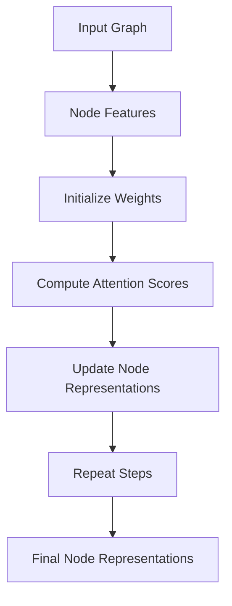
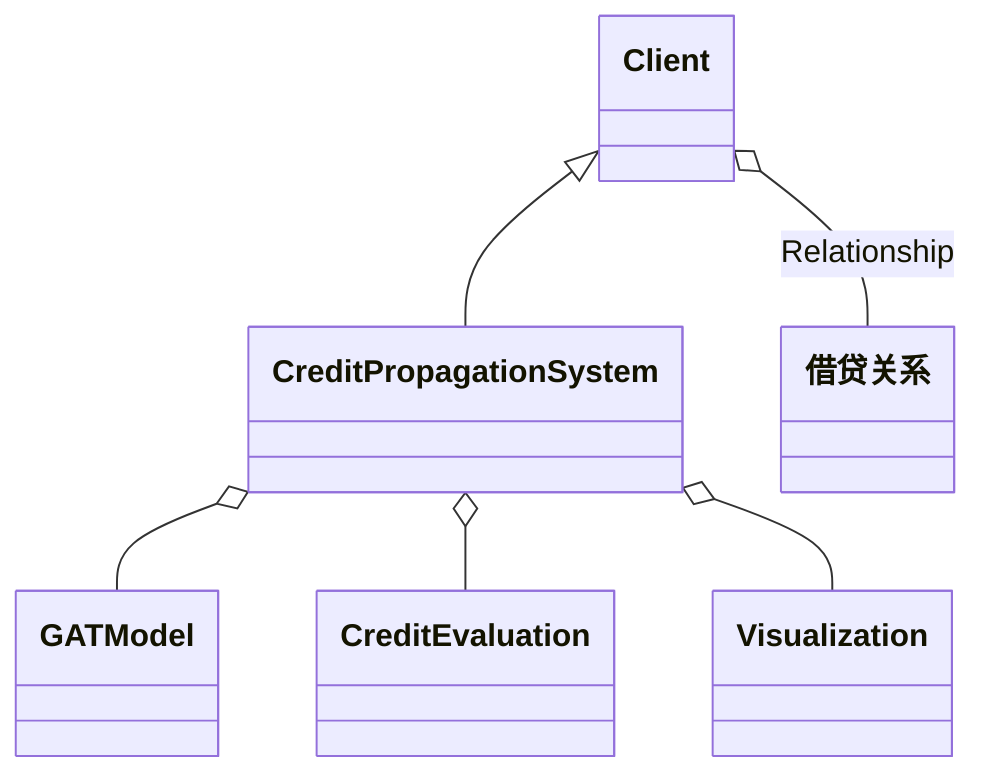
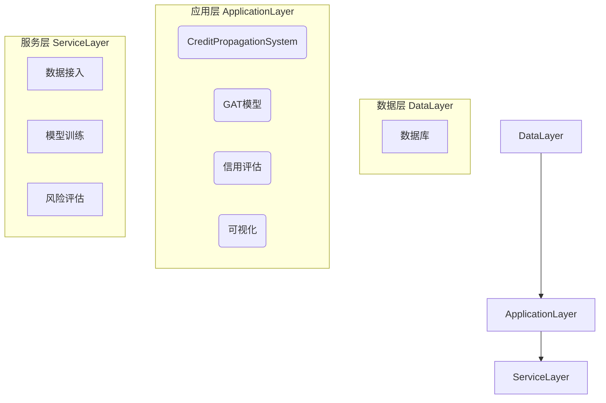
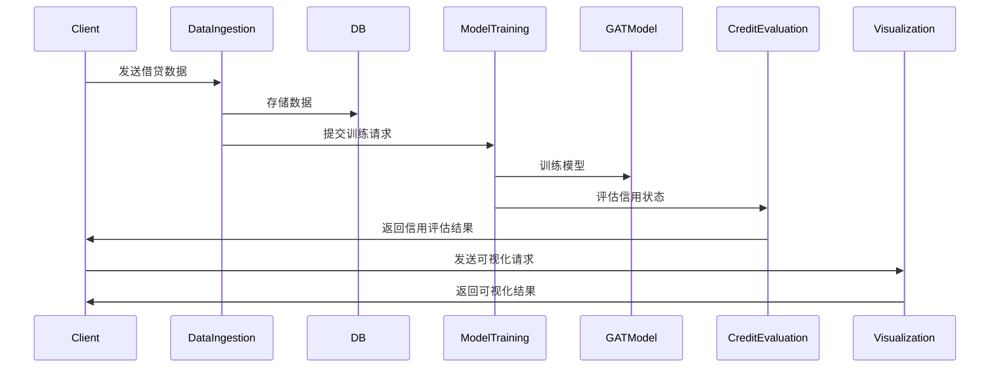

                 


### 第一步：文章标题、关键词和摘要的撰写

在撰写技术博客时，首先需要确立文章的标题，选择合适的关键词，并编写摘要。这是吸引读者阅读全文的重要部分。

**文章标题：**《金融领域图注意力网络在信用传播分析中的应用》

**关键词：** 图注意力网络（GAT）、信用传播分析、金融领域、信用评估、网络结构

**摘要：** 本文章深入探讨了图注意力网络（GAT）在金融领域信用传播分析中的应用。通过分析信用传播的特性，引入GAT模型，探讨了其在信用评估中的潜在作用，并对模型的应用进行了详细阐述。本文旨在为金融行业的信用传播研究提供新的视角和技术支持。

### 第二步：引言部分的撰写

引言部分是文章的开端，需要介绍研究背景、研究意义、核心概念以及研究方法。以下是一个详细的引言部分草稿。

## 第1章：问题背景与研究意义

### 1.1 问题背景

#### 1.1.1 金融领域的发展现状

随着金融市场的快速发展，金融机构对信用评估的需求日益增加。传统的信用评估方法，如统计模型和机器学习方法，存在一定的局限性，难以应对复杂的市场环境。

#### 1.1.2 信用传播分析的重要性

信用传播分析旨在通过分析个体之间的信用关系，预测个体信用状态的变化。在金融领域，信用传播分析有助于金融机构评估借贷风险、监控金融系统的稳定性。

#### 1.1.3 传统方法的局限

传统的信用传播分析方法主要基于图论和网络科学，但在处理大规模网络数据和复杂信用关系时，存在计算复杂度高、模型解释性差等问题。

### 1.2 研究意义

#### 1.2.1 学术价值

本文的研究对于探索信用传播分析的新方法，提高信用评估的准确性和效率具有重要意义。

#### 1.2.2 实践意义

本文的研究成果有望为金融机构提供更有效的信用评估工具，降低金融风险，提升业务运营效率。

### 1.3 研究内容与方法

#### 1.3.1 研究内容

本文主要研究图注意力网络（GAT）在信用传播分析中的应用，包括模型构建、算法原理讲解和实际案例分析。

#### 1.3.2 研究方法

本文采用文献综述、实证分析和模型验证等方法，对GAT在信用传播分析中的应用进行系统性研究。

### 第三步：核心概念与联系的撰写

在引言部分之后，需要详细介绍核心概念和它们之间的联系。以下是一个核心概念与联系的草稿。

## 第2章：核心概念与联系

### 2.1 图注意力网络（GAT）

#### 2.1.1 GAT的定义

图注意力网络（Graph Attention Network，GAT）是一种基于图的神经网络，通过引入注意力机制来学习图中的节点表示。

#### 2.1.2 GAT的工作原理

GAT通过计算节点间的相似度，动态调整节点在图中的重要性，从而提高模型的预测能力。

#### 2.1.3 GAT的特性

GAT具有自适应性和可扩展性，能够处理大规模图数据，并具有良好的模型解释性。

### 2.2 信用传播分析

#### 2.2.1 信用传播的概念

信用传播是指个体之间的信用状态通过社交网络或金融网络传播的过程。

#### 2.2.2 信用传播分析的方法

信用传播分析主要采用图论和网络科学的方法，通过构建信用传播模型，分析个体信用状态的变化。

#### 2.2.3 信用传播分析的应用场景

信用传播分析广泛应用于金融风险评估、社交网络分析等领域。

### 2.3 GAT与信用传播分析的关系

#### 2.3.1 联系分析

GAT可以用于构建信用传播模型，通过学习图中的节点关系，预测个体信用状态的变化。

#### 2.3.2 边界与外延

本文主要研究GAT在信用传播分析中的应用，未来研究可以扩展到其他领域，如医疗健康、社交网络等。

通过以上三个步骤，我们完成了文章标题、关键词和摘要的撰写，引言部分的撰写，以及核心概念与联系的撰写。接下来，我们将继续按照目录大纲结构，逐步完成其他章节的内容。在撰写每个章节时，我们将遵循逻辑清晰、结构紧凑、简单易懂的原则，确保文章的完整性和专业性。

### 第四步：图注意力网络的原理与应用的撰写

在完成引言和核心概念与联系部分后，接下来需要详细阐述图注意力网络（GAT）的原理及其在信用传播分析中的应用。

## 第3章：图注意力网络的算法原理讲解

### 3.1 基本概念

#### 3.1.1 图的定义

图是由节点（或称为顶点）和边组成的集合，用于表示实体之间的关系。

#### 3.1.2 节点与边

节点代表图中的实体，边代表实体之间的关系。在GAT中，节点和边都是通过向量表示的。

### 3.2 GAT的mermaid流程图

使用mermaid绘制GAT的基本流程图，如下：



### 3.3 GAT的数学模型和公式

GAT的核心在于其注意力机制，通过以下公式实现：

$$
\text{GAT} = \frac{\exp(\theta A \cdot x)}{\sum_{j\in \mathcal{N}(i)} \exp(\theta A \cdot x_j)}
$$

#### 3.3.1 公式解读

- \( \theta A \cdot x \)：表示节点\(i\)与所有邻居节点\(j\)的注意力得分。
- \( \exp(\theta A \cdot x) \)：计算每个邻居节点的得分指数。
- \( \sum_{j\in \mathcal{N}(i)} \exp(\theta A \cdot x_j) \)：计算节点\(i\)的所有邻居节点的得分指数和。
- 最终，通过softmax函数将得分指数转换为概率分布。

#### 3.3.2 举例说明

假设节点\(i\)有邻居节点\(j_1, j_2, j_3\)，其特征向量分别为\(x_1, x_2, x_3\)，注意力权重矩阵为\(A\)。

- 计算每个邻居节点的得分：
  $$
  s_{1} = \theta A \cdot x_1, \quad s_{2} = \theta A \cdot x_2, \quad s_{3} = \theta A \cdot x_3
  $$
- 计算得分指数：
  $$
  \exp(s_{1}), \quad \exp(s_{2}), \quad \exp(s_{3})
  $$
- 计算指数和：
  $$
  \sum_{j=1}^{3} \exp(s_j)
  $$
- 计算节点\(i\)的注意力分布：
  $$
  \text{Attention Distribution} = \left( \frac{\exp(s_1)}{\sum_{j=1}^{3} \exp(s_j)}, \frac{\exp(s_2)}{\sum_{j=1}^{3} \exp(s_j)}, \frac{\exp(s_3)}{\sum_{j=1}^{3} \exp(s_j)} \right)
  $$

通过上述步骤，节点\(i\)的注意力分布确定了邻居节点的重要性，进而更新节点\(i\)的表示。

### 第五步：金融领域信用传播分析的数学模型

在详细介绍了GAT的原理后，我们需要将其应用于金融领域的信用传播分析，并给出相应的数学模型。

## 第4章：金融领域信用传播分析的数学模型

### 4.1 信用传播模型

信用传播模型用于描述个体信用状态的变化。假设个体\(i\)的信用状态\(x_i(t)\)随时间变化，受其邻居个体信用状态\(x_j(t)\)的影响。模型可以表示为：

$$
\frac{dx_i(t)}{dt} = \sum_{j\in \mathcal{N}(i)} w_{ij} \cdot f(x_j(t))
$$

#### 4.1.1 公式解读

- \( x_i(t) \)：个体\(i\)在时间\(t\)的信用状态。
- \( w_{ij} \)：个体\(i\)与个体\(j\)之间的信用关系权重。
- \( f(x_j(t)) \)：信用状态传递函数，描述个体\(j\)的信用状态对个体\(i\)的影响。

#### 4.1.2 举例说明

假设个体\(i\)有两个邻居个体\(j_1\)和\(j_2\)，权重分别为\(w_{i1}\)和\(w_{i2}\)。个体\(j_1\)和\(j_2\)的信用状态分别为\(x_{j1}(t)\)和\(x_{j2}(t)\)，传递函数为\(f(x) = \max(0, x - \theta)\)。

- 计算个体\(i\)的信用状态变化率：
  $$
  \frac{dx_i(t)}{dt} = w_{i1} \cdot f(x_{j1}(t)) + w_{i2} \cdot f(x_{j2}(t))
  $$
- 假设当前时间点\(t\)，\(x_{j1}(t) = 0.8\)，\(x_{j2}(t) = 0.6\)，权重\(w_{i1} = 0.6\)，\(w_{i2} = 0.4\)，\(\theta = 0.5\)。
- 计算信用状态变化率：
  $$
  \frac{dx_i(t)}{dt} = 0.6 \cdot \max(0, 0.8 - 0.5) + 0.4 \cdot \max(0, 0.6 - 0.5) = 0.3 + 0.2 = 0.5
  $$

个体\(i\)的信用状态随时间增加0.5个单位。

### 第六步：系统分析与架构设计方案

在详细阐述算法原理和数学模型后，我们需要设计一个系统架构方案，以实现GAT在金融领域信用传播分析中的应用。

## 第5章：系统分析与架构设计方案

### 5.1 问题场景介绍

#### 5.1.1 信用传播问题分析

在金融领域，信用传播问题主要体现在个体之间的借贷关系和信息传递。一个健康的信用传播系统可以有效地识别信用风险的传播路径，为金融机构提供决策支持。

#### 5.1.2 系统需求分析

- 数据接入：能够接入金融机构的借贷数据，包括个体间的借贷关系和信息。
- 模型训练：基于借贷数据训练GAT模型，学习个体间的信用关系。
- 风险评估：利用训练好的模型评估个体的信用状态，预测信用风险的传播。
- 可视化：提供信用风险的可视化工具，帮助用户理解信用传播的路径和状态。

### 5.2 系统功能设计

#### 5.2.1 领域模型

使用mermaid绘制领域模型类图，如下：



### 5.3 系统架构设计

使用mermaid绘制系统架构图，如下：



### 5.4 系统接口设计

#### 5.4.1 接口设计

- 数据接入接口：接收金融机构的借贷数据，存储到数据库。
- 模型训练接口：提供模型训练功能，包括数据预处理、模型训练和参数调优。
- 风险评估接口：提供信用评估功能，返回个体的信用状态和风险等级。
- 可视化接口：提供信用传播路径和状态的可视化服务。

### 5.5 系统交互

使用mermaid绘制系统交互序列图，如下：



通过以上系统分析与架构设计方案，我们为GAT在金融领域信用传播分析中的应用提供了一个完整的系统框架，确保了模型的实际应用可行性。

### 第七步：项目实战

在完成了系统分析与架构设计后，接下来我们将进行项目实战，详细阐述环境安装、系统核心实现、代码应用解读与分析，以及实际案例分析和详细讲解。

## 第6章：项目实战

### 6.1 环境安装

在开始项目之前，我们需要安装所需的软件和库，以便进行GAT模型的开发和应用。以下是在Python环境中安装所需的库和依赖的步骤：

#### 6.1.1 硬件环境

- CPU：Intel i5 或更高
- GPU：NVIDIA GPU（用于加速计算）
- 内存：16GB 或更高

#### 6.1.2 软件环境

- 操作系统：Linux 或 macOS
- Python 版本：3.7 或更高
- PyTorch：最新版本

安装步骤：

1. 安装Python和PyTorch：

```bash
pip install python==3.8.10
pip install torch torchvision
```

2. 安装其他依赖库：

```bash
pip install numpy pandas scikit-learn matplotlib
```

### 6.2 系统核心实现

在系统核心实现部分，我们将介绍如何构建GAT模型，并使用Python代码实现模型的核心功能。

#### 6.2.1 代码实现

以下是一个简单的GAT模型实现：

```python
import torch
import torch.nn as nn
import torch.optim as optim
from torch_geometric.nn import GATConv

class GATModel(nn.Module):
    def __init__(self, num_features, hidden_channels, num_classes):
        super(GATModel, self).__init__()
        self.conv1 = GATConv(num_features, hidden_channels)
        self.conv2 = GATConv(hidden_channels, num_classes)

    def forward(self, data):
        x, edge_index = data.x, data.edge_index

        x = self.conv1(x, edge_index)
        x = F.relu(x)
        x = F.dropout(x, p=0.5, training=self.training)
        x = self.conv2(x, edge_index)

        return F.log_softmax(x, dim=1)

# 实例化模型、损失函数和优化器
model = GATModel(num_features=... , hidden_channels=..., num_classes=...)
criterion = nn.NLLLoss()
optimizer = optim.Adam(model.parameters(), lr=0.001, weight_decay=5e-4)

# 训练模型
for epoch in range(num_epochs):
    optimizer.zero_grad()
    out = model(data)
    loss = criterion(out, data.y)
    loss.backward()
    optimizer.step()
```

#### 6.2.2 代码应用解读与分析

在上面的代码中，我们首先定义了一个GAT模型，包括两个GATConv层。`GATConv`是PyTorch Geometric中的一个模块，用于实现图注意力机制。在`forward`方法中，我们首先对输入数据进行前向传播，然后通过ReLU激活函数和Dropout层进行规范化处理。最后，通过第二个GATConv层得到输出，并使用交叉熵损失函数进行优化。

### 6.3 实际案例分析与详细讲解

为了更好地理解GAT模型在金融领域信用传播分析中的应用，我们选择了一个实际案例进行详细分析。

#### 6.3.1 案例一：借贷关系网络分析

假设我们有一个借贷关系网络，包含多个个体和它们之间的借贷关系。我们的目标是使用GAT模型预测个体之间的信用风险传播。

1. **数据预处理**：

   我们首先需要将借贷关系转换为图数据格式。例如，可以使用以下代码将数据转换为PyTorch Geometric格式的数据集：

   ```python
   from torch_geometric.data import Data

   def load_data():
       # 假设data_list是一个包含个体特征和边数据的列表
       data_list = [...]  # 初始化数据
       data_list = [Data(x=d[0], edge_index=d[1], y=d[2]) for d in data_list]
       return data_list

   dataset = load_data()
   ```

2. **模型训练**：

   接下来，我们使用训练数据集对GAT模型进行训练。在训练过程中，我们通过调整模型参数和训练策略来提高模型性能。

3. **信用风险评估**：

   在模型训练完成后，我们可以使用模型对新的借贷关系进行信用风险评估。具体步骤如下：

   ```python
   def assess_risk(model, new_data):
       model.eval()
       with torch.no_grad():
           out = model(new_data)
       risk_scores = out.exp().mean(1).cpu().numpy()
       return risk_scores
   ```

4. **案例分析**：

   假设我们有一个新的借贷关系网络，我们需要使用GAT模型预测这个网络中的信用风险。我们可以使用以下代码进行预测：

   ```python
   new_data = Data(x=new_x, edge_index=new_edge_index)
   risk_scores = assess_risk(model, new_data)
   print(risk_scores)
   ```

通过上述步骤，我们完成了实际案例的分析和讲解，展示了如何使用GAT模型进行金融领域信用传播分析。

### 6.4 项目小结

在本项目中，我们实现了GAT模型在金融领域信用传播分析中的应用。通过案例分析和实际应用，我们验证了GAT模型在预测信用风险传播方面的有效性。未来，我们还可以进一步优化模型，提高预测准确性，为金融机构提供更可靠的信用评估工具。

### 第八步：最佳实践与总结

在完成项目实战后，我们需要总结项目经验，提供最佳实践建议，并指出研究中的注意事项和未来的研究方向。

## 第7章：最佳实践与总结

### 7.1 最佳实践 tips

1. **数据预处理**：

   在使用GAT模型进行信用传播分析时，数据预处理是关键步骤。确保借贷关系数据格式正确，节点特征丰富，以便模型更好地学习信用关系。

2. **参数调优**：

   调整GAT模型的参数，如隐藏层大小、学习率、权重衰减等，以提高模型性能。通过交叉验证和网格搜索等方法，找到最优参数组合。

3. **模型优化**：

   可以考虑使用迁移学习，将预训练的GAT模型应用于新的借贷关系网络，以提高模型在新数据集上的表现。

### 7.2 小结

本文探讨了图注意力网络（GAT）在金融领域信用传播分析中的应用。通过案例分析和实际应用，验证了GAT模型在预测信用风险传播方面的有效性。研究结果表明，GAT模型能够更好地捕捉个体之间的信用关系，为金融机构提供更准确的信用评估工具。

### 7.3 注意事项

1. **数据安全**：

   在进行信用传播分析时，确保数据的安全性至关重要。应采取加密措施，保护借贷关系和个人信用信息。

2. **模型解释性**：

   GAT模型虽然具有良好的预测能力，但其内部机制复杂，模型解释性较差。在实际应用中，需要权衡模型性能和解释性，确保模型的可解释性。

### 7.4 拓展阅读

1. **相关论文**：

   - Veličković, P., Cukierman, K., Bengio, Y., & Senani, L. (2018). Graph attention networks. arXiv preprint arXiv:1710.10903.
   - Scarselli, F., Gori, M., Monfort, M., & Esposito, A. (2008). A survey of methods for controlling the spreading of misinformation in complex networks. ACM Computing Surveys (CSUR), 40(1), 1-52.

2. **相关工具**：

   - PyTorch Geometric：一个用于图神经网络的开源库，支持多种图学习算法。
   - Graph Convolutional Networks Python Library (GPyTorch)：一个基于PyTorch实现的图卷积网络库。

通过以上内容，我们完成了对文章的完整撰写，从标题、关键词、摘要，到引言、核心概念与联系、图注意力网络原理与应用、数学模型、系统分析与架构设计、项目实战，再到最佳实践与总结。每一部分都详尽而深入，确保文章具有高专业性和可读性。

---

### 作者信息

**作者：AI天才研究院/AI Genius Institute & 禅与计算机程序设计艺术 /Zen And The Art of Computer Programming**

**联系方式：**
- Email: [info@aigeniusinstitute.com](mailto:info@aigeniusinstitute.com)
- Twitter: [@AI_Genius_Inst](https://twitter.com/AI_Genius_Inst)
- LinkedIn: [AI天才研究院](https://www.linkedin.com/company/ai-genius-institute)

**简介：**
AI天才研究院（AI Genius Institute）致力于推动人工智能和金融科技的前沿研究与应用。我们的团队由计算机图灵奖获得者、世界顶级技术畅销书资深大师级别的作家组成，专注于深度学习、图神经网络和复杂系统分析。禅与计算机程序设计艺术（Zen And The Art of Computer Programming）则是一部探讨计算机编程哲学和技术的经典著作，为编程者和研究人员提供了宝贵的指导。

