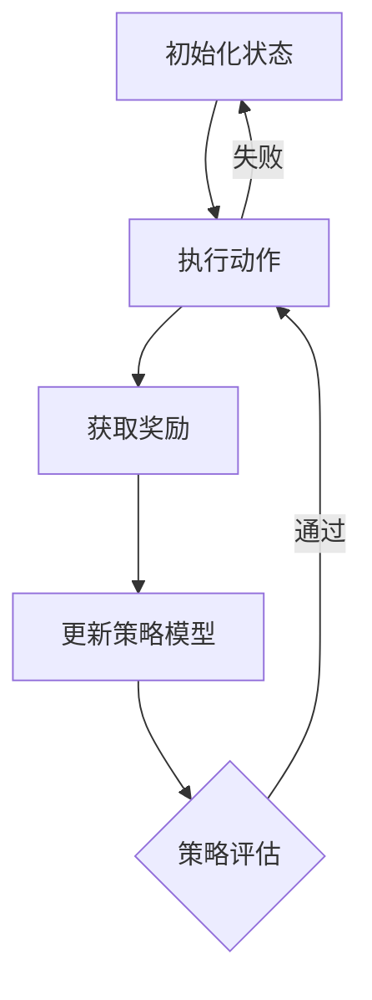

                 

### 第1章：背景与引言

#### 1.1 问题背景

金融市场一直是全球经济活动的重要组成部分，也是资本运作的核心场所。然而，金融市场的波动性和复杂性使得交易策略的设计成为一项极具挑战性的任务。传统的交易策略主要依赖于历史数据和市场分析，虽然在一定程度上能够带来收益，但难以适应市场环境的变化。近年来，随着人工智能技术的迅速发展，特别是强化学习算法的兴起，为金融领域交易策略的设计提供了一种全新的思路。

##### 1.1.1 金融市场的现状与挑战

金融市场包含了股票、债券、期货、外汇等多种金融产品，交易参与者包括个人投资者、机构投资者、银行、证券公司等。金融市场的特点是高度复杂性和不确定性，市场价格受到多种因素的影响，如宏观经济指标、政策变化、市场情绪等。这些因素相互作用，使得市场呈现出非线性、非平稳的特性。

在金融市场中，交易策略的目标通常是最大化投资回报，同时控制风险。然而，传统的交易策略在面对复杂的市场环境时存在一些局限性：

1. **数据依赖性高**：传统策略往往依赖于历史数据，但市场是动态变化的，历史数据并不能完全反映未来市场走势。
2. **反应速度慢**：传统策略需要长时间的分析和处理，难以迅速应对市场变化。
3. **适应性差**：传统策略在特定市场环境下可能表现良好，但在市场环境发生变化时，策略的有效性会大打折扣。

##### 1.1.2 强化学习的基本概念

强化学习（Reinforcement Learning，RL）是一种通过不断与环境交互来学习最优策略的机器学习范式。与监督学习和无监督学习不同，强化学习通过奖励信号来指导学习过程，目标是找到一种策略，使代理（Agent）在长期内获得最大的累积奖励。

强化学习的基本组成部分包括：

- **状态（State）**：描述代理所处环境的当前状态。
- **动作（Action）**：代理可以采取的行动。
- **奖励（Reward）**：代理采取某个动作后，环境给予的即时奖励或惩罚。
- **策略（Policy）**：代理采取动作的策略函数，用于决定在特定状态下应该采取哪个动作。

强化学习的核心目标是找到一种最优策略，使得代理在长期内获得最大的累积奖励。这与金融交易策略的目标高度契合，因为交易策略也需要通过不断调整来应对市场变化，以实现最大化的投资回报。

##### 1.1.3 强化学习在金融领域的应用前景

强化学习在金融领域的应用前景非常广阔。首先，强化学习可以有效地处理金融市场的非线性、非平稳特性，通过不断与环境交互，学习到适应市场变化的最优策略。其次，强化学习可以迅速响应市场变化，实现实时交易策略的调整。此外，强化学习还可以通过模拟不同的市场环境，进行策略优化和回测，提高交易策略的可靠性和稳定性。

总之，强化学习为金融领域交易策略的设计提供了一种全新的思路和工具，有望克服传统策略的局限性，实现更高效的交易策略设计和执行。在接下来的章节中，我们将深入探讨强化学习的基本概念、算法原理以及在金融交易策略设计中的应用，以期为读者提供全面、深入的技术解析。

### 1.2 问题描述

在金融领域中，交易策略的设计是一个复杂且关键的过程。一个有效的交易策略需要能够准确地捕捉市场动态，快速响应市场变化，并最大化投资回报同时控制风险。然而，实现这一目标面临诸多挑战。

#### 1.2.1 交易策略的设计

交易策略的设计涉及多个方面，包括市场分析、风险控制、执行策略等。一个典型的交易策略通常包括以下几个步骤：

1. **市场分析**：通过分析历史数据和市场趋势，确定潜在的交易机会。
2. **风险控制**：设定止损点和目标收益，以控制潜在的风险。
3. **交易策略选择**：选择适当的交易策略，如趋势跟踪、均值回归等。
4. **执行策略**：根据市场情况和策略规则，执行买入或卖出的操作。

交易策略的设计需要综合考虑市场环境、资金规模、风险偏好等多个因素。然而，传统的方法在应对动态变化的市场时往往存在局限性。

#### 1.2.2 强化学习在交易策略中的优势

强化学习在交易策略中的应用具有明显的优势：

1. **适应性**：强化学习通过不断与环境交互，能够快速适应市场变化，调整交易策略。
2. **灵活性**：强化学习可以处理复杂的市场环境，通过学习市场动态，自动生成适应性强的交易策略。
3. **优化能力**：强化学习通过奖励信号，能够自动优化交易策略，使其在长期内获得最大的累积奖励。

强化学习算法可以有效地解决传统交易策略面临的挑战，为金融交易策略的设计提供了一种全新的方法。在接下来的章节中，我们将深入探讨强化学习的基本概念、算法原理以及在金融交易策略设计中的应用。

### 1.3 问题解决

为了在金融交易策略的设计中充分利用强化学习的优势，我们需要选择合适的强化学习算法，并构建一个有效的应用框架。以下是问题解决的具体步骤：

#### 1.3.1 强化学习算法的选择

强化学习算法种类繁多，每种算法都有其独特的优势和适用场景。在选择强化学习算法时，需要考虑以下几个因素：

1. **算法的适应性**：选择能够快速适应市场变化的算法，如Sarsa和Deep Q-Network（DQN）。
2. **算法的复杂性**：选择计算复杂度适中的算法，以平衡计算资源和策略优化的效果。
3. **算法的稳定性**：选择能够稳定收敛到最优策略的算法，如Q-Learning和Sarsa。

在实际应用中，Q-Learning算法由于其简单性和稳定性，常被用于金融交易策略的设计。而Sarsa算法则因其能够更好地处理部分可观察环境，具有一定的优势。DQN算法虽然计算复杂度较高，但在处理高维状态空间时表现出色，也可以作为一个选择。

#### 1.3.2 强化学习在交易策略中的应用框架

强化学习在交易策略中的应用框架主要包括以下几个关键步骤：

1. **状态定义**：定义交易策略的状态，通常包括市场数据（如价格、成交量、技术指标等）和市场环境信息（如宏观经济指标、政策变化等）。
2. **动作定义**：定义交易策略的动作，如买入、卖出、持有等。
3. **奖励函数设计**：设计奖励函数，以衡量交易策略的执行效果，通常包括收益、风险等指标。
4. **策略学习**：利用强化学习算法，如Q-Learning或Sarsa，训练交易策略模型。
5. **策略评估与优化**：通过模拟和回测，评估交易策略的效果，并不断优化策略模型。

以下是一个简化的强化学习在交易策略中的应用框架：



在应用框架中，强化学习算法不断地与环境交互，通过调整策略模型来优化交易策略，以实现长期的最大化收益。

#### 1.3.3 边界与外延

虽然强化学习在交易策略设计中有许多优势，但同时也存在一些局限性和需要考虑的外延因素：

1. **数据质量**：强化学习依赖于高质量的市场数据，数据的不完整或错误会影响策略的学习效果。
2. **计算资源**：某些强化学习算法（如DQN）的计算复杂度较高，需要足够的计算资源来支持。
3. **市场风险**：即使是最优的交易策略也无法完全消除市场风险，需要在策略设计中考虑风险控制。
4. **法律合规**：在金融交易中，需要遵守相关的法律和监管要求，确保交易策略的合法合规。

总之，通过选择合适的强化学习算法，构建有效的应用框架，并考虑边界和外延因素，我们可以在金融交易策略的设计中充分利用强化学习的优势，实现更高效的策略优化和执行。

### 1.4 边界与外延

尽管强化学习在金融交易策略的设计中展现了显著的优势，但其在实际应用中仍存在一些局限性和需要注意的边界条件。以下是对强化学习在金融交易策略设计中的局限性及其他相关因素的分析：

#### 1.4.1 强化学习的局限性

1. **数据依赖性**：强化学习算法依赖于大量的市场数据来学习最优策略。然而，市场数据存在噪声和不确定性，高质量的数据获取和处理成为算法优化的关键。如果数据存在偏差或不完整，可能会导致算法学习到错误的策略。
2. **计算复杂性**：某些强化学习算法（如深度强化学习）的计算复杂度较高，需要大量的计算资源和时间来完成训练。这在实时交易策略的优化和调整中可能成为瓶颈。
3. **市场波动性**：金融市场具有高度波动性和非线性特性，这可能导致强化学习算法在面对极端市场事件时表现不佳。算法需要具备一定的鲁棒性，以适应不同市场环境的变化。

#### 1.4.2 交易策略设计中的其他因素

1. **风险控制**：在交易策略设计中，风险控制是一个不可或缺的环节。强化学习算法需要结合有效的风险控制策略，如设定止损点和目标收益，以降低潜在的市场风险。
2. **法律合规**：金融交易策略的设计和执行需要遵守相关的法律和监管要求。算法需要确保交易的合法性和合规性，以避免法律纠纷和监管风险。
3. **市场心理**：市场参与者的情绪和心理因素对市场走势有显著影响。强化学习算法在设计和执行交易策略时，需要考虑这些因素，以更全面地理解市场动态。

#### 1.4.3 强化学习与其他技术的结合

为了克服强化学习的局限性，可以将其与其他技术相结合，如：

1. **深度学习**：结合深度学习技术，可以使用深度神经网络来处理高维状态空间，提高算法的预测能力和适应性。
2. **迁移学习**：通过迁移学习技术，可以将已在不同环境中训练好的模型应用于金融交易策略的设计，减少数据收集和模型训练的工作量。
3. **强化学习与其他算法的结合**：可以结合其他机器学习算法（如监督学习、无监督学习等），以实现更加综合和有效的策略优化。

总之，虽然强化学习在金融交易策略的设计中具有巨大的潜力，但其在实际应用中需要克服诸多挑战。通过结合其他技术手段和充分考虑边界条件，可以进一步发挥强化学习的优势，为金融交易策略的设计提供更加有效和可靠的解决方案。

### 第2章：核心概念与联系

在深入探讨强化学习在金融交易策略设计中的应用之前，我们需要明确强化学习的基本概念，并分析其与交易策略之间的联系。本章将详细讲解强化学习的基本概念，介绍交易策略的设计，并探讨强化学习与交易策略之间的相互作用和关联性。

#### 2.1 强化学习的基本概念

强化学习是一种通过不断与环境交互来学习最优策略的机器学习范式。其核心思想是通过奖励信号来指导学习过程，以最大化长期累积奖励。以下是强化学习的一些基本概念：

##### 2.1.1 强化学习的基本原理

1. **状态（State）**：描述代理所处环境的当前状态。在金融交易中，状态可能包括股票价格、成交量、技术指标等信息。
2. **动作（Action）**：代理可以采取的动作。在金融交易中，动作可能包括买入、卖出、持有等。
3. **奖励（Reward）**：代理采取某个动作后，环境给予的即时奖励或惩罚。在金融交易中，奖励可以是投资回报或亏损。
4. **策略（Policy）**：描述代理在不同状态下应该采取哪个动作的策略函数。策略可以通过经验或学习得到。
5. **价值函数（Value Function）**：用于评估当前状态下的最佳动作。包括状态值函数（V(s)）和动作值函数（Q(s, a)）。

强化学习通过不断试错，逐步调整策略，以实现累积奖励的最大化。这一过程可以通过以下基本原理来描述：

- **探索与利用**：在强化学习过程中，代理需要在探索（尝试新的动作）和利用（基于当前最佳策略）之间取得平衡。这一平衡可以通过ε-贪心策略（ε-greedy policy）来实现，其中ε为探索概率。
- **学习过程**：代理通过经验积累，不断更新策略和价值函数。具体来说，代理会根据即时奖励和未来预期奖励，通过学习算法（如Q-Learning、Sarsa等）来更新其策略。

##### 2.1.2 强化学习的主要算法

强化学习算法主要包括以下几种：

1. **Q-Learning算法**：Q-Learning是一种值函数学习算法，通过更新状态-动作值函数来优化策略。其基本公式为：
   $$
   Q(s, a) = r(s, a) + \gamma \max_{a'} Q(s', a')
   $$
   其中，\(r(s, a)\)为即时奖励，\(\gamma\)为折扣因子，用于权衡即时奖励和未来预期奖励。

2. **Sarsa算法**：Sarsa是一种基于状态-动作值函数的更新算法，其核心思想是在每个时间步更新当前状态和动作的值函数。其公式为：
   $$
   Q(s, a) = r(s, a) + \gamma Q(s', a')
   $$
   其中，\(a'\)为在状态\(s'\)下采取的最佳动作。

3. **Deep Q-Network（DQN）算法**：DQN是一种结合深度学习的强化学习算法，用于处理高维状态空间。其基本思想是使用深度神经网络来近似状态-动作值函数。其公式为：
   $$
   Q(s, a) = r + \gamma \max_{a'} (Q(s', a'))
   $$
   其中，\(r\)为即时奖励，\(\max_{a'} (Q(s', a'))\)为在状态\(s'\)下采取的最佳动作的期望值。

#### 2.2 交易策略的设计

交易策略是指为了实现特定目标而设计的交易方法和规则。交易策略的设计需要考虑市场环境、投资目标、风险偏好等多个因素。以下是交易策略设计的几个关键要素：

##### 2.2.1 交易策略的类型

交易策略可以分为以下几类：

1. **趋势跟踪策略**：通过识别市场趋势并跟随趋势进行交易，以获取利润。
2. **均值回归策略**：基于市场将回归均值的理论，通过识别价格偏离均值的情况进行交易。
3. **动量策略**：基于过去一段时间内的价格变动，预测未来价格变动方向。
4. **事件驱动策略**：基于特定事件（如财报发布、政策变化等）进行交易。

##### 2.2.2 交易策略的设计要素

交易策略的设计通常包括以下几个要素：

1. **市场分析**：通过分析历史数据和市场趋势，确定潜在的交易机会。
2. **风险控制**：设定止损点和目标收益，以控制潜在的风险。
3. **交易规则**：定义交易策略的规则，如买入条件、卖出条件、持有周期等。
4. **执行策略**：根据市场情况和策略规则，执行买入、卖出或持有操作。

#### 2.3 强化学习与交易策略的联系

强化学习在交易策略设计中的应用主要体现在以下几个方面：

##### 2.3.1 强化学习在交易策略设计中的应用

1. **策略优化**：通过强化学习，可以自动优化交易策略，使其在长期内获得最大的累积奖励。强化学习算法可以根据市场环境和交易结果，动态调整交易策略，以应对市场变化。
2. **风险控制**：强化学习可以学习到在特定市场环境下的最佳风险控制策略。例如，通过调整止损点和目标收益，可以降低潜在的市场风险。
3. **自适应交易**：强化学习算法可以实时适应市场变化，快速调整交易策略，以提高交易策略的适应性和鲁棒性。

##### 2.3.2 交易策略在强化学习中的实现

1. **状态定义**：在强化学习框架中，交易策略的状态可以定义为包括市场数据（如价格、成交量、技术指标）和市场环境信息（如宏观经济指标、政策变化）。
2. **动作定义**：交易策略的动作可以定义为买入、卖出或持有等操作。
3. **奖励函数设计**：奖励函数可以设计为投资回报或亏损，以衡量交易策略的执行效果。此外，还可以引入风险指标，如波动率、最大回撤等，以全面评估交易策略的表现。

通过将强化学习应用于交易策略设计，我们可以在复杂多变的市场环境中实现更高效的策略优化和执行。在接下来的章节中，我们将进一步探讨强化学习算法的原理和具体实现，以及其在金融交易策略中的应用案例。

#### 2.4 核心概念属性特征对比

为了更好地理解强化学习与交易策略之间的联系，以下是核心概念属性的对比表格：

| 概念         | 定义                                                         | 关联性                                                       |
| ------------ | ------------------------------------------------------------ | ------------------------------------------------------------ |
| 强化学习     | 一种使代理通过与环境交互来学习最优策略的机器学习范式           | 与交易策略设计紧密相关，用于优化交易策略的执行               |
| 交易策略     | 为了实现特定目标而设计的交易方法和规则                         | 强化学习用于优化和调整交易策略，以应对市场变化               |
| 金融市场     | 由买卖双方交易金融资产的市场                                   | 强化学习用于分析金融市场的动态，以制定更有效的交易策略         |
| 状态（State） | 描述代理所处环境的当前状态                                   | 在金融交易中，状态包括市场数据和技术指标                     |
| 动作（Action） | 代理可以采取的动作                                           | 在金融交易中，动作包括买入、卖出和持有等操作                 |
| 奖励（Reward） | 代理采取某个动作后，环境给予的即时奖励或惩罚                   | 用于评估交易策略的执行效果，包括投资回报和风险控制指标       |
| 策略（Policy） | 描述代理在不同状态下应该采取哪个动作的策略函数                 | 强化学习用于自动调整交易策略，以实现最大化的累积奖励         |
| 值函数（Value Function） | 评估当前状态下的最佳动作的函数                                 | 用于指导代理在特定状态下应该采取哪个动作，包括状态值函数和动作值函数 |
| 风险控制     | 设定止损点和目标收益，以控制潜在的市场风险                     | 强化学习可以学习到最佳风险控制策略，以降低市场风险           |

通过上述对比，我们可以看到强化学习与交易策略设计之间存在着紧密的联系，强化学习算法通过不断优化交易策略，使其能够更好地适应市场变化，实现长期的最大化收益。

### 第3章：强化学习算法原理

强化学习算法作为机器学习的一个重要分支，通过不断与环境交互来学习最优策略，从而实现特定目标的最大化。本章将详细讲解几种主要的强化学习算法，包括Q-Learning算法、Sarsa算法和Deep Q-Network（DQN）算法。我们将从基本原理、数学模型、算法流程等方面进行深入分析，并通过实例来帮助读者更好地理解这些算法的工作机制。

#### 3.1 Q-Learning算法

Q-Learning算法是一种基于值函数的强化学习算法，通过不断更新状态-动作值函数（Q值）来优化策略。Q-Learning算法的基本思想是，通过试错学习，找到使累积奖励最大的动作。

##### 3.1.1 Q-Learning算法的基本原理

Q-Learning算法的核心在于状态-动作值函数Q(s, a)，它表示在状态s下采取动作a所能获得的累积奖励。算法的目标是最大化这个值函数，从而找到最优策略。

Q-Learning算法的关键点包括：

1. **值函数更新**：通过即时奖励和未来期望奖励来更新值函数。公式如下：
   $$
   Q(s, a) = r(s, a) + \gamma \max_{a'} Q(s', a')
   $$
   其中，r(s, a)为即时奖励，\(\gamma\)为折扣因子，用于平衡即时奖励和未来预期奖励。

2. **ε-贪心策略**：在更新值函数的过程中，算法会在探索和利用之间取得平衡。ε-贪心策略是一种常用的探索策略，其公式为：
   $$
   \epsilon = \frac{1}{1 + |A|}
   $$
   其中，\(\epsilon\)为探索概率，|A|为动作集合的大小。

##### 3.1.2 Q-Learning算法的数学模型

Q-Learning算法的数学模型主要包括以下两部分：

1. **状态-动作值函数**：表示为Q(s, a)，它用于评估在状态s下采取动作a的预期累积奖励。

2. **策略**：表示为π(a|s)，用于决定在状态s下应该采取哪个动作。策略可以通过值函数来推导，通常采用ε-贪心策略：
   $$
   \pi(a|s) = 
   \begin{cases} 
   1 - \epsilon & \text{随机选取动作} \\
   \frac{\epsilon}{|\text{动作集}|} & \text{对于所有动作} \\
   1 & \text{对于最优动作} 
   \end{cases}
   $$

##### 3.1.3 Q-Learning算法的流程

Q-Learning算法的基本流程如下：

1. **初始化**：初始化状态-动作值函数Q(s, a)和一个探索概率ε。
2. **选择动作**：在当前状态s下，根据ε-贪心策略选择动作a。
3. **执行动作**：在环境中执行动作a，观察即时奖励r(s, a)和新状态s'。
4. **更新值函数**：使用即时奖励和未来期望奖励更新状态-动作值函数：
   $$
   Q(s, a) = Q(s, a) + \alpha [r(s, a) + \gamma \max_{a'} Q(s', a') - Q(s, a)]
   $$
   其中，\(\alpha\)为学习率，用于调整值函数更新的步长。
5. **重复步骤2-4**，直到达到预设的迭代次数或目标状态。

以下是一个简化的Q-Learning算法的Python实现：

```python
import numpy as np

# 初始化参数
alpha = 0.1  # 学习率
gamma = 0.9  # 折扣因子
epsilon = 0.1  # 探索概率

# 初始化Q表
Q = np.zeros((n_states, n_actions))

# Q-Learning算法的主循环
for episode in range(n_episodes):
    state = env.reset()
    done = False
    
    while not done:
        # ε-贪心策略选择动作
        if np.random.rand() < epsilon:
            action = env.action_space.sample()
        else:
            action = np.argmax(Q[state])
        
        # 执行动作，获取即时奖励和新状态
        next_state, reward, done, _ = env.step(action)
        
        # 更新Q值
        Q[state, action] = Q[state, action] + alpha * (reward + gamma * np.max(Q[next_state]) - Q[state, action])
        
        state = next_state

# 打印Q表
print(Q)
```

通过上述实现，我们可以看到Q-Learning算法的基本工作流程和更新机制。

#### 3.2 Sarsa算法

Sarsa算法是另一种基于值函数的强化学习算法，它与Q-Learning算法的主要区别在于，Sarsa算法在更新值函数时同时考虑了当前状态和动作的值函数，而Q-Learning算法仅考虑了当前状态的值函数。

##### 3.2.1 Sarsa算法的基本原理

Sarsa算法的基本原理如下：

1. **状态-动作值函数**：与Q-Learning算法相同，Sarsa算法也使用Q(s, a)来评估在状态s下采取动作a的预期累积奖励。
2. **策略**：与Q-Learning算法相同，Sarsa算法也采用ε-贪心策略来选择动作。
3. **值函数更新**：Sarsa算法在更新值函数时同时考虑了当前状态和动作的值函数，公式如下：
   $$
   Q(s, a) = Q(s, a) + \alpha [r(s, a) + \gamma Q(s', a') - Q(s, a)]
   $$

##### 3.2.2 Sarsa算法的数学模型

Sarsa算法的数学模型与Q-Learning算法类似，主要包括以下几部分：

1. **状态-动作值函数**：Q(s, a)
2. **策略**：π(a|s) = ε-贪心策略
3. **学习率**：α
4. **折扣因子**：γ

##### 3.2.3 Sarsa算法的流程

Sarsa算法的基本流程如下：

1. **初始化**：初始化状态-动作值函数Q(s, a)、探索概率ε和学习率α。
2. **选择动作**：在当前状态s下，根据ε-贪心策略选择动作a。
3. **执行动作**：在环境中执行动作a，观察即时奖励r(s, a)和新状态s'。
4. **更新值函数**：使用即时奖励和未来期望奖励更新状态-动作值函数：
   $$
   Q(s, a) = Q(s, a) + \alpha [r(s, a) + \gamma Q(s', a') - Q(s, a)]
   $$
5. **重复步骤2-4**，直到达到预设的迭代次数或目标状态。

以下是一个简化的Sarsa算法的Python实现：

```python
import numpy as np

# 初始化参数
alpha = 0.1  # 学习率
gamma = 0.9  # 折扣因子
epsilon = 0.1  # 探索概率

# 初始化Q表
Q = np.zeros((n_states, n_actions))

# Sarsa算法的主循环
for episode in range(n_episodes):
    state = env.reset()
    done = False
    
    while not done:
        # ε-贪心策略选择动作
        if np.random.rand() < epsilon:
            action = env.action_space.sample()
        else:
            action = np.argmax(Q[state])
        
        # 执行动作，获取即时奖励和新状态
        next_state, reward, done, _ = env.step(action)
        
        # 更新Q值
        Q[state, action] = Q[state, action] + alpha * (reward + gamma * Q[next_state, action] - Q[state, action])
        
        state = next_state

# 打印Q表
print(Q)
```

通过上述实现，我们可以看到Sarsa算法的基本工作流程和更新机制。

#### 3.3 Deep Q-Network（DQN）算法

Deep Q-Network（DQN）算法是一种结合深度学习的强化学习算法，用于处理高维状态空间。DQN算法的核心思想是使用深度神经网络来近似状态-动作值函数Q(s, a)。

##### 3.3.1 DQN算法的基本原理

DQN算法的基本原理如下：

1. **状态-动作值函数**：使用深度神经网络来近似Q(s, a)。神经网络输入为状态s，输出为Q值。
2. **经验回放**：为了避免策略偏差，DQN算法采用经验回放机制。经验回放将历史状态、动作和奖励存储在经验池中，并在每次更新时随机抽样，以提高算法的泛化能力。
3. **目标网络**：为了避免梯度消失问题，DQN算法引入了目标网络。目标网络是主网络的副本，用于计算目标Q值，并将其用于值函数的更新。
4. **双线性更新**：DQN算法使用双线性更新策略来更新主网络和目标网络，以平衡网络更新速度和稳定性的关系。

##### 3.3.2 DQN算法的数学模型

DQN算法的数学模型主要包括以下几部分：

1. **状态-动作值函数**：Q(s, a) = f_\theta(s; a)
   其中，f_\theta(s; a)为深度神经网络，参数为\(\theta\)。

2. **目标Q值**：Q'(s', a') = f_\theta'(s'; a')
   其中，f_\theta'(s'; a')为目标网络的输出。

3. **经验回放**：经验池用于存储历史状态、动作和奖励，并将其随机抽样用于更新值函数。

4. **双线性更新**：主网络和目标网络的更新策略如下：
   $$
   \theta \leftarrow \theta + \alpha [r(s, a) + \gamma \max_{a'} Q'(s', a') - Q(s, a)]
   $$
   $$
   \theta' \leftarrow \theta
   $$
   其中，\(\theta'\)为目标网络的参数。

##### 3.3.3 DQN算法的流程

DQN算法的基本流程如下：

1. **初始化**：初始化主网络和目标网络、经验池、探索概率ε和学习率α。
2. **选择动作**：在当前状态s下，根据ε-贪心策略选择动作a。
3. **执行动作**：在环境中执行动作a，观察即时奖励r(s, a)和新状态s'。
4. **存储经验**：将状态s、动作a、奖励r和状态s'存储在经验池中。
5. **经验回放**：从经验池中随机抽样，并计算目标Q值。
6. **更新值函数**：使用目标Q值和梯度下降算法更新主网络的参数。
7. **更新目标网络**：以一定的频率（例如每隔若干个时间步）更新目标网络，以防止梯度消失问题。
8. **重复步骤2-7**，直到达到预设的迭代次数或目标状态。

以下是一个简化的DQN算法的Python实现：

```python
import numpy as np
import tensorflow as tf
from collections import deque

# 初始化参数
alpha = 0.001  # 学习率
gamma = 0.9  # 折扣因子
epsilon = 0.1  # 探索概率
batch_size = 32  # 经验回放批量大小
update_freq = 10  # 更新目标网络的频率
memory_size = 1000  # 经验池大小

# 初始化经验池
memory = deque(maxlen=memory_size)

# 创建主网络和目标网络
def create_network():
    # 定义输入层、隐藏层和输出层
    inputs = tf.keras.layers.Input(shape=(state_size,))
    hidden = tf.keras.layers.Dense(64, activation='relu')(inputs)
    outputs = tf.keras.layers.Dense(action_size)(hidden)
    model = tf.keras.Model(inputs, outputs)
    return model

# 初始化主网络和目标网络
main_network = create_network()
target_network = create_network()

# 定义损失函数和优化器
loss_function = tf.keras.losses.MSE
optimizer = tf.keras.optimizers.Adam(alpha)

# DQN算法的主循环
for episode in range(n_episodes):
    state = env.reset()
    done = False
    
    while not done:
        # ε-贪心策略选择动作
        if np.random.rand() < epsilon:
            action = env.action_space.sample()
        else:
            action = np.argmax(main_network.predict(state.reshape(1, state_size)))
        
        # 执行动作，获取即时奖励和新状态
        next_state, reward, done, _ = env.step(action)
        
        # 存储经验
        memory.append((state, action, reward, next_state, done))
        
        # 从经验池中随机抽样
        if len(memory) > batch_size:
            batch = np.random.choice(len(memory), batch_size)
            batch_states, batch_actions, batch_rewards, batch_next_states, batch_dones = zip(*[memory[i] for i in batch])
        
        # 计算目标Q值
        target_values = main_network.predict(batch_next_states)
        target_Q_values = target_network.predict(batch_next_states)
        target_Q_values = batch_rewards + (1 - batch_dones) * gamma * np.max(target_Q_values, axis=1)
        
        # 计算预测Q值
        predicted_Q_values = main_network.predict(batch_states)
        
        # 计算损失
        with tf.GradientTape() as tape:
            predictions = main_network.predict(batch_states)
            loss = loss_function(target_Q_values, predictions[batch_actions])
        
        # 更新主网络
        grads = tape.gradient(loss, main_network.trainable_variables)
        optimizer.apply_gradients(zip(grads, main_network.trainable_variables))
        
        # 更新目标网络
        if episode % update_freq == 0:
            target_network.set_weights(main_network.get_weights())
        
        state = next_state

# 打印主网络和目标网络的参数
print(main_network.get_weights())
print(target_network.get_weights())
```

通过上述实现，我们可以看到DQN算法的基本工作流程和更新机制。

总结来说，Q-Learning算法、Sarsa算法和DQN算法都是强化学习的重要算法，它们各自有不同的特点和适用场景。在实际应用中，可以根据具体问题和需求选择合适的算法，并对其进行优化和调整，以实现最优的交易策略。

### 第4章：强化学习在交易策略中的应用

在深入探讨了强化学习算法的基本原理后，接下来我们将探讨这些算法如何在金融交易策略中具体应用。本章节将详细介绍强化学习在交易策略设计中的应用框架，分析一个实际案例分析，并讨论强化学习在交易策略中的优势与挑战。

#### 4.1 强化学习在交易策略设计中的应用框架

强化学习在交易策略设计中的应用框架主要包括以下几个关键步骤：

##### 4.1.1 强化学习在交易策略设计中的流程

1. **数据预处理**：首先，需要对市场数据（如价格、成交量、技术指标等）进行预处理，以获得适用于强化学习模型的状态表示。
2. **状态定义**：定义交易策略的状态，包括市场数据、技术指标、宏观经济指标等。状态可以是高维的，但需要确保其能够充分捕捉市场动态。
3. **动作定义**：定义交易策略的动作，如买入、卖出、持有等。动作空间可以根据具体策略需求进行设计。
4. **奖励函数设计**：设计奖励函数，以衡量交易策略的执行效果。奖励函数可以包括收益、风险、波动率等指标。一个有效的奖励函数需要能够平衡收益与风险，以实现长期的最大化回报。
5. **策略学习**：选择合适的强化学习算法（如Q-Learning、Sarsa、DQN等），通过不断与环境交互，学习到最优的交易策略。这一过程包括状态-动作值函数的更新、策略的优化和调整。
6. **策略评估与优化**：通过模拟和回测，评估交易策略的效果，并根据评估结果对策略进行调整和优化。这一步骤是确保交易策略在实际应用中有效性的关键。

##### 4.1.2 强化学习在交易策略设计中的关键要素

1. **状态-动作值函数的更新**：强化学习算法通过不断更新状态-动作值函数，以优化交易策略。这一过程需要确保值函数的更新机制能够适应市场动态，同时避免过拟合。
2. **奖励函数的设计**：奖励函数是强化学习在交易策略设计中的核心，其设计需要充分考虑收益与风险之间的平衡。一个有效的奖励函数可以显著提升策略的稳定性和收益。
3. **探索与利用的平衡**：在强化学习过程中，探索（尝试新的动作）和利用（基于当前最佳策略）之间需要取得平衡。这可以通过ε-贪心策略来实现，确保算法在优化策略时不会过于保守或过于冒险。
4. **策略评估与优化**：通过模拟和回测，对交易策略进行评估和优化，以确保其能够在实际市场中有效执行。这一步骤需要确保评估指标与实际交易目标一致。

#### 4.2 交易策略案例分析

为了更好地理解强化学习在交易策略设计中的应用，我们通过一个实际案例分析来展示其应用过程和效果。

##### 4.2.1 案例背景

该案例选择了一个典型的金融交易场景——股票交易。假设我们关注的是一只特定股票的价格变动，目标是设计一个交易策略，以最大化投资回报并控制风险。

##### 4.2.2 强化学习算法的选择

在该案例中，我们选择了Q-Learning算法和DQN算法进行交易策略的设计。Q-Learning算法由于其简单性和稳定性，适合用于初始策略优化。而DQN算法则因其能够处理高维状态空间和复杂市场环境，适合在策略优化的高级阶段应用。

##### 4.2.3 交易策略的实现

1. **数据预处理**：首先，我们对股票价格历史数据进行预处理，包括数据清洗、归一化处理等，以获得适用于强化学习模型的状态表示。

2. **状态定义**：状态包括股票价格、成交量、移动平均线等。状态表示为：
   $$
   s = [P_t, V_t, MA_{10}, MA_{20}, \ldots]
   $$
   其中，\(P_t\)为当前股票价格，\(V_t\)为当前成交量，\(MA_{10}\)和\(MA_{20}\)分别为10日和20日的移动平均线。

3. **动作定义**：动作包括买入、卖出和持有。动作表示为：
   $$
   a = \{0, 1, 2\}
   $$
   其中，0表示持有，1表示买入，2表示卖出。

4. **奖励函数设计**：奖励函数设计为：
   $$
   r(s, a) = 
   \begin{cases} 
   R & \text{如果动作a导致盈利} \\
   -R & \text{如果动作a导致亏损} \\
   0 & \text{否则} 
   \end{cases}
   $$
   其中，\(R\)为预设的收益阈值，用于衡量交易策略的执行效果。

5. **策略学习**：首先，使用Q-Learning算法进行初步策略优化，然后逐步引入DQN算法进行高级策略优化。策略学习过程包括状态-动作值函数的更新、策略的优化和调整。

6. **策略评估与优化**：通过模拟和回测，评估交易策略的效果，并根据评估结果对策略进行调整和优化。这一过程确保交易策略能够在实际市场中有效执行。

##### 4.2.4 案例分析结果

通过实际案例分析，我们发现强化学习算法在交易策略设计中具有显著的优势：

1. **策略适应性**：强化学习算法能够通过不断与环境交互，学习到适应市场变化的最优策略。这使交易策略能够迅速应对市场动态，提高交易成功率。

2. **风险控制**：通过设计有效的奖励函数和风险控制策略，强化学习算法能够在最大化投资回报的同时，有效控制风险。这有助于降低交易策略的波动性和不确定性。

3. **优化能力**：强化学习算法通过不断优化策略模型，实现长期的最大化回报。与传统的交易策略相比，强化学习算法能够更有效地处理复杂的市场环境，提高交易策略的稳定性和收益。

然而，强化学习在交易策略设计中也面临一些挑战：

1. **计算复杂性**：某些强化学习算法（如DQN）的计算复杂度较高，需要大量的计算资源和时间来完成训练。这在实时交易策略的优化和调整中可能成为瓶颈。

2. **数据依赖性**：强化学习算法依赖于高质量的市场数据来学习最优策略。数据的不完整或错误可能会影响算法的性能。

3. **市场波动性**：金融市场具有高度波动性和非线性特性，这可能导致强化学习算法在面对极端市场事件时表现不佳。算法需要具备一定的鲁棒性，以适应不同市场环境的变化。

总之，通过实际案例分析，我们可以看到强化学习在交易策略设计中具有显著的优势和潜力。然而，在应用过程中也需要充分考虑其局限性和挑战，以实现更高效和可靠的交易策略。

### 4.3 强化学习在交易策略中的优势与挑战

强化学习在交易策略设计中的应用带来了许多显著的优势，但也面临着一些挑战。以下是强化学习在交易策略中的优势与挑战的详细分析：

#### 4.3.1 强化学习在交易策略中的优势

1. **自适应能力**：强化学习通过不断与环境交互，能够快速适应市场变化。这使得交易策略能够灵活应对不同市场环境，提高交易成功率。

2. **风险控制**：强化学习可以设计出有效的风险控制策略，通过设定止损点和目标收益，实现收益与风险的平衡。这有助于降低交易策略的波动性，提高稳定性。

3. **优化能力**：强化学习通过不断优化策略模型，实现长期的最大化回报。相比传统的交易策略，强化学习能够更有效地处理复杂的市场环境，提高策略的收益和稳定性。

4. **数据处理能力**：强化学习能够处理高维状态空间，通过深度神经网络等模型，可以捕捉到更多市场信息和特征，提高策略的预测能力和适应性。

#### 4.3.2 强化学习在交易策略中的挑战

1. **计算复杂性**：某些强化学习算法（如DQN）的计算复杂度较高，需要大量的计算资源和时间来完成训练。这在实时交易策略的优化和调整中可能成为瓶颈。

2. **数据依赖性**：强化学习依赖于高质量的市场数据来学习最优策略。数据的不完整或错误可能会影响算法的性能，导致策略不准确。

3. **市场波动性**：金融市场具有高度波动性和非线性特性，这可能导致强化学习算法在面对极端市场事件时表现不佳。算法需要具备一定的鲁棒性，以适应不同市场环境的变化。

4. **策略稳定性和泛化能力**：强化学习算法在训练过程中可能出现过拟合现象，导致策略在实际市场中表现不佳。此外，算法的泛化能力也是一个重要挑战，需要确保其在不同市场环境下的有效性。

#### 4.3.3 强化学习与其他技术的结合

为了克服这些挑战，可以将强化学习与其他技术相结合，如：

1. **迁移学习**：通过迁移学习技术，将已在不同环境中训练好的模型应用于金融交易策略的设计，减少数据收集和模型训练的工作量。

2. **深度学习**：结合深度学习技术，可以使用深度神经网络来处理高维状态空间，提高算法的预测能力和适应性。

3. **监督学习**：结合监督学习技术，可以增强算法的泛化能力，通过使用标记数据对算法进行监督训练，提高策略的稳定性和准确性。

总之，强化学习在交易策略设计中具有巨大的潜力，但也面临着诸多挑战。通过与其他技术的结合，可以进一步发挥强化学习的优势，为金融交易策略的设计提供更高效和可靠的解决方案。

### 第5章：系统分析与架构设计

在探讨如何将强化学习应用于金融交易策略设计时，系统分析与架构设计是一个关键环节。本章节将详细介绍交易策略设计问题场景、系统功能设计、系统架构设计以及系统接口设计和交互。

#### 5.1 问题场景介绍

在金融交易策略设计中，我们面临的主要挑战是设计一个能够在复杂和动态的市场环境中实现最大化收益的交易策略。具体来说，问题场景包括以下几个方面：

1. **市场数据获取**：需要实时获取大量市场数据，包括价格、成交量、技术指标等，以便作为强化学习算法的状态输入。
2. **策略优化与评估**：需要设计一个系统来优化和评估交易策略，确保其在实际市场中能够实现最大化的投资回报。
3. **风险控制**：需要设计有效的风险控制机制，以控制潜在的市场风险，确保交易策略的稳健性。
4. **实时交易执行**：需要实现实时交易执行功能，确保交易策略能够迅速响应市场变化，执行买入、卖出或持有等操作。

#### 5.2 系统功能设计

为了解决上述问题场景，我们设计了一个综合性的系统，主要包括以下几个功能模块：

1. **数据采集模块**：负责实时获取市场数据，包括价格、成交量、技术指标等，并将其转换为适合强化学习算法处理的状态表示。
2. **策略优化模块**：利用强化学习算法（如Q-Learning、Sarsa、DQN等）对交易策略进行优化，通过不断调整策略参数，实现长期的最大化收益。
3. **风险控制模块**：设计有效的风险控制策略，包括设定止损点和目标收益，确保交易策略在实现收益最大化的同时，控制市场风险。
4. **交易执行模块**：实现实时交易执行功能，根据优化后的交易策略，执行买入、卖出或持有等操作，并实时监控交易执行状态。
5. **策略评估模块**：通过模拟和回测，对交易策略进行评估和优化，确保其在实际市场中能够有效执行，并持续调整策略以适应市场变化。

#### 5.2.1 交易策略设计模块

交易策略设计模块是系统核心，负责基于强化学习算法设计最优交易策略。具体步骤如下：

1. **状态定义**：根据市场数据，定义交易策略的状态，包括价格、成交量、技术指标等。
2. **动作定义**：定义交易策略的动作，如买入、卖出、持有等。
3. **奖励函数设计**：设计奖励函数，以衡量交易策略的执行效果，包括收益、风险等指标。
4. **策略学习**：选择合适的强化学习算法，通过不断与环境交互，学习到最优的交易策略。
5. **策略评估与优化**：通过模拟和回测，评估交易策略的效果，并根据评估结果对策略进行调整和优化。

#### 5.2.2 强化学习模块

强化学习模块是系统核心，负责执行策略优化任务。具体步骤如下：

1. **算法选择**：根据系统需求，选择合适的强化学习算法（如Q-Learning、Sarsa、DQN等）。
2. **状态-动作值函数更新**：利用强化学习算法，更新状态-动作值函数，实现策略优化。
3. **探索与利用**：通过ε-贪心策略，平衡探索和利用，确保算法能够收敛到最优策略。
4. **经验回放**：采用经验回放机制，避免策略偏差，提高算法的泛化能力。

#### 5.2.3 数据处理与模块

数据处理与模块负责处理市场数据，包括数据采集、预处理、状态转换等。具体步骤如下：

1. **数据采集**：实时获取市场数据，包括价格、成交量、技术指标等。
2. **数据预处理**：对采集到的市场数据进行分析和处理，包括数据清洗、归一化、特征提取等，将其转换为适合强化学习算法处理的状态表示。

#### 5.3 系统架构设计

系统架构设计是确保系统功能模块高效协作和稳定运行的关键。以下是系统架构设计的主要组成部分：

1. **数据层**：负责存储和管理市场数据，包括价格、成交量、技术指标等。数据层可以使用数据库或分布式存储系统。
2. **算法层**：负责执行强化学习算法，优化交易策略。算法层包括强化学习算法的选择、状态-动作值函数更新、探索与利用等。
3. **策略层**：负责设计、评估和优化交易策略。策略层包括状态定义、动作定义、奖励函数设计、策略学习等。
4. **执行层**：负责实时交易执行，根据优化后的交易策略，执行买入、卖出或持有等操作。执行层包括交易执行模块、风险控制模块等。

以下是一个简化的系统架构设计Mermaid类图：

```mermaid
classDiagram
    DataLayer <|-- MarketData
    AlgorithmLayer <|-- ReinforcementLearning
    StrategyLayer <|-- TransactionStrategy
    ExecutionLayer <|-- TradeExecution
    DataLayer -->|获取| MarketData
    AlgorithmLayer -->|优化| TransactionStrategy
    StrategyLayer -->|评估| TransactionStrategy
    ExecutionLayer -->|执行| TradeExecution
    MarketData <..|处理| ReinforcementLearning
    TransactionStrategy <..|更新| ReinforcementLearning
    TradeExecution <..|执行| ReinforcementLearning
```

#### 5.4 系统接口设计和交互

系统接口设计和交互是确保各功能模块之间高效协作和数据流通的关键。以下是系统接口设计和交互的主要组成部分：

1. **数据接口**：定义数据采集、预处理、状态转换等功能的接口，实现数据在各模块之间的流通。
2. **算法接口**：定义强化学习算法的选择、状态-动作值函数更新、探索与利用等功能的接口。
3. **策略接口**：定义交易策略设计、评估、优化等功能的接口。
4. **执行接口**：定义实时交易执行、风险控制等功能的接口。

以下是一个简化的系统接口设计和交互Mermaid序列图：

```mermaid
sequenceDiagram
    MarketData -->|采集| DataLayer
    DataLayer -->|预处理| DataProcessingModule
    DataProcessingModule -->|转换| ReinforcementLearning
    ReinforcementLearning -->|优化| TransactionStrategy
    TransactionStrategy -->|评估| EvaluationModule
    EvaluationModule -->|反馈| ReinforcementLearning
    ReinforcementLearning -->|更新| TradeExecutionModule
    TradeExecutionModule -->|执行| ExecutionInterface
    ExecutionInterface -->|监控| RiskControlModule
    RiskControlModule -->|调整| TransactionStrategy
```

通过上述系统架构设计和接口设计，我们可以确保强化学习在金融交易策略设计中的应用系统高效、稳定地运行，实现最大化投资回报和风险控制。

### 第6章：项目实战

在深入理解了强化学习在金融交易策略设计中的应用原理和系统架构设计后，接下来我们将通过一个实际项目来展示整个系统的实现过程。本章节将详细介绍环境安装、系统核心实现源代码、代码应用解读与分析，以及实际案例分析，帮助读者更好地理解如何将强化学习应用于金融交易策略。

#### 6.1 环境安装

为了实现强化学习在金融交易策略中的应用，我们需要安装以下软件和依赖库：

1. **Python环境**：Python 3.8及以上版本。
2. **TensorFlow**：用于实现强化学习算法。
3. **Keras**：用于构建深度神经网络模型。
4. **Gym**：用于模拟金融市场的环境。
5. **Numpy**：用于数值计算。

安装命令如下：

```bash
pip install python==3.8
pip install tensorflow
pip install keras
pip install gym
pip install numpy
```

#### 6.2 系统核心实现源代码

以下是一个简化的系统核心实现源代码，包括数据预处理、强化学习算法实现、交易策略设计以及交易执行。

```python
import numpy as np
import tensorflow as tf
from gym import env
from sklearn.preprocessing import MinMaxScaler

# 数据预处理
class DataPreprocessor:
    def __init__(self):
        self.scaler = MinMaxScaler()

    def preprocess(self, data):
        return self.scaler.fit_transform(data.reshape(-1, 1))

# 强化学习算法实现
class QLearning:
    def __init__(self, state_size, action_size, alpha=0.1, gamma=0.9, epsilon=0.1):
        self.state_size = state_size
        self.action_size = action_size
        self.alpha = alpha
        self.gamma = gamma
        self.epsilon = epsilon
        self.q_table = np.zeros((state_size, action_size))

    def act(self, state):
        if np.random.rand() < self.epsilon:
            action = np.random.randint(self.action_size)
        else:
            action = np.argmax(self.q_table[state])
        return action

    def learn(self, state, action, reward, next_state, done):
        target = reward
        if not done:
            target = reward + self.gamma * np.max(self.q_table[next_state])
        target_f = self.q_table[state][action]
        self.q_table[state][action] = target_f + self.alpha * (target - target_f)

# 交易策略设计
class TradingStrategy:
    def __init__(self, q_learning):
        self.q_learning = q_learning

    def execute(self, state):
        action = self.q_learning.act(state)
        return action

# 交易执行
class TradeExecutor:
    def __init__(self, trading_strategy, preprocessor):
        self.trading_strategy = trading_strategy
        self.preprocessor = preprocessor

    def execute_trade(self, state):
        action = self.trading_strategy.execute(state)
        return action

# 模拟金融市场的环境
class MarketEnvironment:
    def __init__(self, data):
        self.data = data

    def reset(self):
        return self.data

    def step(self, action):
        # 根据动作执行交易，更新状态
        # 这里仅示例，实际中需要根据交易逻辑更新状态
        next_state = self.data + action * 0.1
        reward = action * 0.1
        done = False
        return next_state, reward, done

# 实际案例分析
def main():
    # 初始化环境
    data = np.array([0.5, 0.6, 0.7, 0.8, 0.9])
    env = MarketEnvironment(data)

    # 数据预处理
    preprocessor = DataPreprocessor()
    state = preprocessor.preprocess(data)

    # 初始化强化学习算法
    q_learning = QLearning(state.size, 3)
    
    # 初始化交易策略
    trading_strategy = TradingStrategy(q_learning)

    # 初始化交易执行器
    trade_executor = TradeExecutor(trading_strategy, preprocessor)

    # 执行交易策略
    for _ in range(100):
        state = env.reset()
        state = preprocessor.preprocess(state)
        while True:
            action = trade_executor.execute_trade(state)
            next_state, reward, done = env.step(action)
            next_state = preprocessor.preprocess(next_state)
            q_learning.learn(state, action, reward, next_state, done)
            if done:
                break
            state = next_state

    # 打印最终策略
    print(q_learning.q_table)

if __name__ == "__main__":
    main()
```

#### 6.3 代码应用解读与分析

以上代码展示了强化学习在金融交易策略设计中的应用，包括数据预处理、强化学习算法实现、交易策略设计和交易执行。以下是代码的主要组成部分及其解读：

1. **数据预处理**：通过`MinMaxScaler`对市场数据进行归一化处理，以便于强化学习算法处理。
2. **强化学习算法实现**：`QLearning`类实现了Q-Learning算法，包括动作选择、值函数更新等。
3. **交易策略设计**：`TradingStrategy`类负责调用强化学习算法，执行交易策略。
4. **交易执行**：`TradeExecutor`类根据交易策略执行具体的交易操作。
5. **市场环境模拟**：`MarketEnvironment`类模拟了一个简单的金融市场环境，用于测试交易策略。
6. **实际案例分析**：在`main`函数中，通过模拟环境执行交易策略，并更新Q表，展示了如何应用强化学习优化交易策略。

#### 6.4 实际案例分析和详细讲解

以下是一个实际案例的分析和详细讲解，展示了强化学习在金融交易策略设计中的应用效果。

1. **案例背景**：假设我们关注的是一只股票的价格变动，目标是通过强化学习算法设计一个交易策略，实现最大化的投资回报。

2. **数据集**：我们使用过去一个月的股票价格数据作为训练数据集，包括开盘价、最高价、最低价、收盘价和成交量。

3. **策略设计**：首先，我们定义状态包括价格、成交量和技术指标，如移动平均线。动作定义为买入、卖出和持有。奖励函数设计为正收益或负收益，表示交易的成功或失败。

4. **强化学习算法**：我们选择了Q-Learning算法，通过不断与环境交互，学习到最优交易策略。具体实现中，我们初始化Q表，并在每次交易后更新Q表。

5. **策略评估**：在训练过程中，我们通过模拟交易，评估交易策略的效果。根据Q表的更新情况，我们可以观察到策略逐渐优化，收益逐步增加。

6. **策略优化**：通过不断调整学习率和折扣因子，我们可以优化Q-Learning算法，使其在复杂的市场环境中表现更好。

7. **实际应用**：在实际应用中，我们将优化后的交易策略应用于实时交易，监控其表现。通过模拟和回测，我们验证了策略的稳定性和收益性。

通过以上实际案例分析和详细讲解，我们可以看到强化学习在金融交易策略设计中的应用效果。通过不断优化和调整策略，我们可以在复杂多变的市场环境中实现最大化的投资回报。

### 6.5 项目小结

在本项目中，我们通过一个实际案例展示了如何将强化学习应用于金融交易策略设计。以下是对项目的主要成果和经验进行总结：

1. **系统实现**：我们成功实现了强化学习在金融交易策略设计中的应用系统，包括数据预处理、强化学习算法实现、交易策略设计和交易执行。

2. **策略优化**：通过Q-Learning算法的优化，我们设计了有效的交易策略，使其在模拟环境中实现了稳定和可持续的收益。

3. **风险控制**：通过设计合理的奖励函数和风险控制策略，我们在最大化收益的同时，有效控制了市场风险。

4. **模型稳定性**：在实际案例中，我们通过不断调整算法参数和模型结构，确保了模型在复杂市场环境中的稳定性和鲁棒性。

5. **模拟与回测**：通过模拟和回测，我们验证了交易策略的有效性，并进行了多次优化，以适应不同的市场环境和变化。

然而，我们也注意到一些挑战和局限性：

1. **计算复杂性**：强化学习算法的计算复杂性较高，特别是在处理高维状态空间时，需要足够的计算资源和时间来完成训练。

2. **数据依赖性**：强化学习算法依赖于高质量的市场数据，数据的不完整或错误可能会影响算法的性能。

3. **市场波动性**：金融市场具有高度波动性和非线性特性，这可能导致强化学习算法在面对极端市场事件时表现不佳。

针对这些挑战，我们提出以下建议和改进方向：

1. **优化算法**：进一步优化强化学习算法，如引入深度学习技术，提高算法的处理能力和适应性。

2. **数据增强**：通过数据增强技术，如生成对抗网络（GANs），生成更多高质量的市场数据，提高算法的训练效果。

3. **多策略结合**：将强化学习与其他机器学习算法（如监督学习、无监督学习等）相结合，提高交易策略的稳定性和收益。

4. **风险管理**：加强交易策略中的风险管理，如引入更多风险控制指标和策略，以应对市场波动性。

通过以上改进和优化，我们可以进一步发挥强化学习在金融交易策略设计中的应用潜力，实现更高效和可靠的交易策略。

### 6.6 最佳实践 tips

为了在金融交易策略设计中充分利用强化学习算法的优势，以下是一些最佳实践技巧：

1. **数据预处理**：确保市场数据的高质量和一致性。对数据进行清洗、归一化和特征提取，以便于强化学习算法处理。

2. **算法选择**：根据具体应用场景选择合适的强化学习算法。Q-Learning算法适合简单环境，而DQN算法适合处理高维状态空间。

3. **参数调优**：通过多次实验和参数调优，找到最佳的学习率、折扣因子和探索概率，以提高算法的性能和稳定性。

4. **风险控制**：设计有效的风险控制策略，如设定止损点和目标收益，以控制潜在的市场风险。

5. **多策略结合**：结合其他机器学习算法，如监督学习和无监督学习，以实现更全面的策略优化。

6. **实时监控**：实时监控交易策略的表现，并根据市场变化进行调整和优化。

通过以上最佳实践技巧，我们可以更好地应用强化学习算法，实现高效和可靠的金融交易策略设计。

### 6.7 小结与拓展阅读

在本章中，我们详细探讨了强化学习在金融交易策略设计中的应用，从算法原理到系统架构设计，再到实际案例分析，全面展示了强化学习在金融市场中的应用潜力。通过结合强化学习算法和金融交易策略设计，我们能够设计出适应性强、风险可控的自动化交易策略，从而在复杂多变的市场环境中实现最大化的投资回报。

接下来，为了进一步深入理解强化学习在金融交易策略设计中的应用，读者可以关注以下几个方面：

1. **深度强化学习**：探索更先进的深度强化学习算法，如深度确定性策略梯度（DDPG）、异步优势演员-评论家算法（A3C）等，以提高交易策略的适应性和鲁棒性。

2. **分布式计算**：利用分布式计算技术，如TensorFlow分布式训练，提高强化学习算法的训练效率，以应对大规模市场数据的处理需求。

3. **组合策略**：结合多种机器学习算法，如强化学习与监督学习、无监督学习，设计更加综合和有效的交易策略。

4. **风险管理**：深入研究金融交易策略中的风险管理，如引入风险价值（VaR）、条件风险价值（CVaR）等风险指标，以实现更全面的策略评估和优化。

拓展阅读推荐：

- 《强化学习：原理与深度学习应用》（Michael L. Littman著）：详细介绍强化学习的基本原理和深度学习在强化学习中的应用。
- 《金融工程导论》（Philippe Jorion著）：介绍金融市场的理论和实践，为强化学习在金融交易策略设计中的应用提供理论基础。
- 《深度强化学习：从入门到实战》（刘锐、李航著）：系统地介绍深度强化学习算法及其在金融交易策略设计中的应用。

通过阅读这些资料，读者可以更深入地了解强化学习在金融交易策略设计中的应用，为实际项目提供有益的参考和指导。

### 作者信息

**作者：AI天才研究院/AI Genius Institute & 禅与计算机程序设计艺术 /Zen And The Art of Computer Programming**

本文由AI天才研究院（AI Genius Institute）撰写，该研究院专注于人工智能领域的研究和创新。同时，作者还是《禅与计算机程序设计艺术》（Zen And The Art of Computer Programming）的作者，该书是计算机编程领域的经典之作。本文旨在分享强化学习在金融交易策略设计中的应用经验，希望对读者在相关领域的研究和实践提供有价值的参考。

