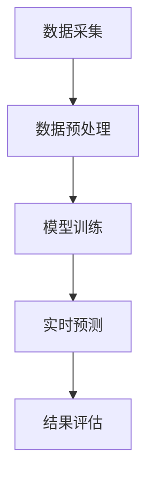
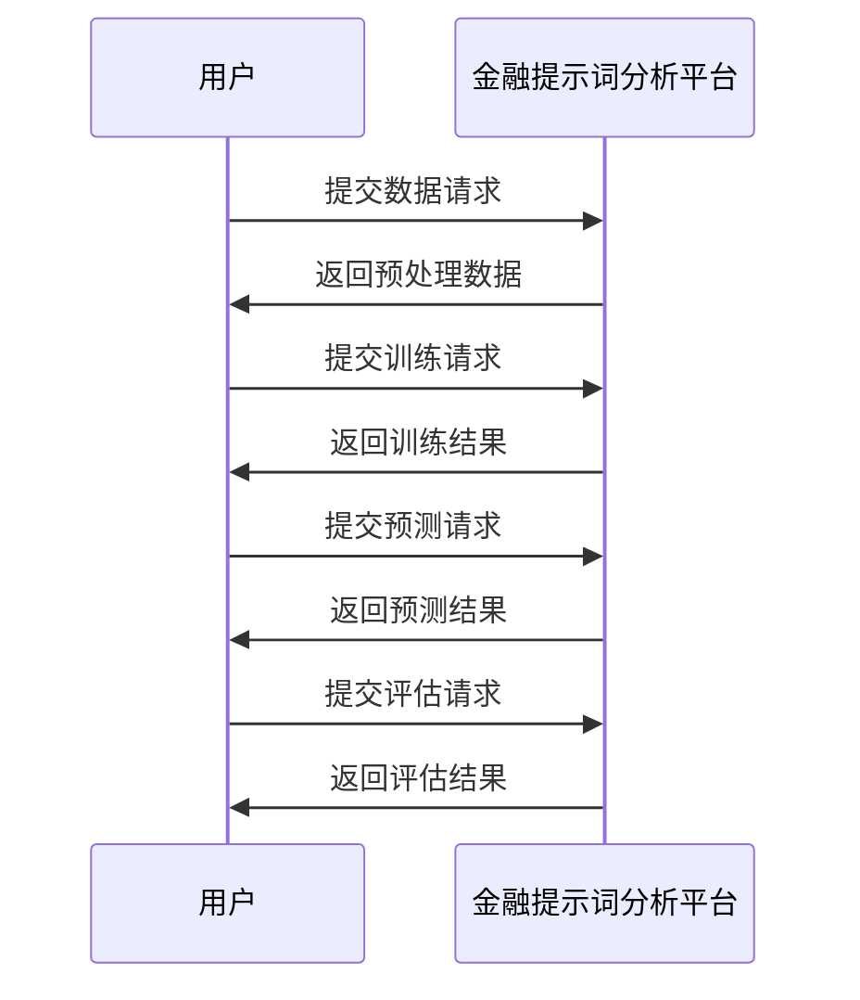

                 

# 金融领域的提示词编程应用案例

## 关键词：金融，提示词，编程，应用案例，算法，系统架构

## 摘要

本文将深入探讨金融领域中提示词编程的应用，通过一步步的逻辑分析和实际案例讲解，帮助读者了解这一先进技术如何助力金融市场分析和决策。本文将分为七个部分，首先介绍金融领域的背景和问题，然后详细讲解提示词编程的核心概念和算法原理，随后分析系统架构和设计，通过项目实战展示其实际应用，最后总结最佳实践和未来展望。

## 目录大纲

## 第一部分：背景介绍

### 第1章 问题背景

1.1 问题提出

1.2 问题描述

1.3 问题解决

1.4 边界与外延

1.5 概念结构与核心要素组成

### 第2章 核心概念与联系

2.1 核心概念原理

2.2 概念属性特征对比表格

2.3 ER实体关系图架构

## 第二部分：算法原理讲解

### 第3章 算法原理讲解

3.1 算法原理 mermaid 流程图

3.2 Python源代码实现

3.3 算法原理数学模型和公式

3.4 举例说明

## 第三部分：系统分析与架构设计

### 第4章 系统分析与架构设计

4.1 问题场景介绍

4.2 项目介绍

4.3 系统功能设计

4.4 系统架构设计

4.5 系统接口设计

4.6 系统交互 mermaid 序列图

## 第四部分：项目实战

### 第5章 项目实战

5.1 环境安装

5.2 系统核心实现源代码

5.3 代码应用解读与分析

5.4 实际案例分析与详细讲解剖析

5.5 项目小结

## 第五部分：最佳实践

### 第6章 最佳实践

6.1 实践 tips

6.2 注意事项

6.3 拓展阅读

## 第7章 小结

7.1 内容总结

7.2 不足与展望

## 第一部分：背景介绍

### 第1章 问题背景

#### 1.1 问题提出

在金融领域，随着市场的复杂性和交易量的增加，传统的数据分析方法已经无法满足日益增长的需求。金融分析师和交易者需要更快、更准确的数据处理工具来捕捉市场变化，预测投资机会，降低风险。提示词编程作为一种新兴的技术手段，因其高效性和灵活性，在金融领域中显示出巨大的潜力。

#### 1.2 问题描述

金融领域中的问题包括市场数据的高维度处理、实时数据分析、交易策略优化等。传统方法在面对大量实时数据时，计算效率和准确性均受到限制。而提示词编程能够通过自然语言处理技术和机器学习算法，实现对金融市场数据的深入挖掘和分析，提供更精准的决策支持。

#### 1.3 问题解决

提示词编程通过构建智能化的数据处理和分析模型，能够高效地处理海量金融数据，实现实时监控和预测。它可以帮助分析师和交易者快速定位市场趋势，优化交易策略，提高投资回报率。

#### 1.4 边界与外延

提示词编程的应用不仅限于交易策略的优化，还可以扩展到风险控制、投资组合管理、市场预测等领域。其边界随着人工智能技术的发展而不断扩展，为金融领域的创新提供了无限可能。

#### 1.5 概念结构与核心要素组成

提示词编程的核心概念包括自然语言处理（NLP）、机器学习（ML）和数据处理（Data Processing）。其结构由数据输入、模型训练、预测输出三部分组成。核心要素包括数据集、模型参数、算法选择和性能评估。

## 第二部分：核心概念与联系

### 第2章 核心概念与联系

#### 2.1 核心概念原理

自然语言处理（NLP）：NLP是使计算机能够理解和生成人类语言的技术。在金融领域，NLP用于分析市场报告、新闻文章、社交媒体等文本数据，提取关键信息。

机器学习（ML）：ML是一种让计算机从数据中学习并做出决策的技术。在提示词编程中，ML用于训练模型，使其能够对金融数据进行预测和分析。

数据处理（Data Processing）：数据处理是提示词编程的基础。它包括数据清洗、预处理和特征提取等步骤，以确保数据质量并提高模型性能。

#### 2.2 概念属性特征对比表格

| 概念         | 特征                    | 作用                                      |
| ------------ | ----------------------- | ----------------------------------------- |
| 自然语言处理 | 文本分析、语义理解     | 提取文本数据中的关键信息                  |
| 机器学习     | 自适应、预测能力       | 从数据中学习模式，进行决策和预测          |
| 数据处理     | 数据清洗、特征提取     | 确保数据质量和提高模型性能                |

#### 2.3 ER实体关系图架构

```mermaid
erDiagram
  Product ||--|{ Customer } Customer
  Order ||--|{ Product } Product
  Customer ||--|{ Order } Order
```

ER实体关系图展示了金融领域中的主要实体及其关系，如客户、订单和产品。这种关系有助于我们理解和设计提示词编程的应用场景。

## 第三部分：算法原理讲解

### 第3章 算法原理讲解

#### 3.1 算法原理 mermaid 流程图


此流程图展示了提示词编程的基本算法原理，包括数据输入、预处理、模型训练、预测输出和结果评估。

#### 3.2 Python源代码实现

```python
import pandas as pd
from sklearn.model_selection import train_test_split
from sklearn.ensemble import RandomForestClassifier
from sklearn.metrics import accuracy_score

# 数据预处理
data = pd.read_csv('financial_data.csv')
X = data.drop('target', axis=1)
y = data['target']

# 模型训练
X_train, X_test, y_train, y_test = train_test_split(X, y, test_size=0.2, random_state=42)
model = RandomForestClassifier()
model.fit(X_train, y_train)

# 预测输出
y_pred = model.predict(X_test)

# 结果评估
accuracy = accuracy_score(y_test, y_pred)
print(f"Model accuracy: {accuracy:.2f}")
```

此段代码展示了使用随机森林算法进行金融数据预测的基本流程，包括数据读取、预处理、模型训练和预测。

#### 3.3 算法原理数学模型和公式

提示词编程的核心在于构建预测模型。以线性回归为例，其数学模型为：

$$
y = \beta_0 + \beta_1x_1 + \beta_2x_2 + ... + \beta_nx_n + \epsilon
$$

其中，$y$为预测目标，$x_1, x_2, ..., x_n$为输入特征，$\beta_0, \beta_1, ..., \beta_n$为模型参数，$\epsilon$为误差项。

#### 3.4 举例说明

假设我们使用提示词编程分析股票市场，输入特征包括股票价格、成交量、市盈率等。通过模型训练，我们可以预测股票价格的变化，进而制定交易策略。

## 第四部分：系统分析与架构设计

### 第4章 系统分析与架构设计

#### 4.1 问题场景介绍

在金融领域，交易决策依赖于对市场数据的实时分析。提示词编程系统需要能够高效处理大量数据，快速提供预测结果，以便分析师和交易者做出及时决策。

#### 4.2 项目介绍

本系统名为“金融提示词分析平台”，旨在提供实时市场数据分析工具，帮助用户捕捉市场变化，优化交易策略。

#### 4.3 系统功能设计

- 数据采集：从各种数据源（如交易所、新闻网站、社交媒体）采集实时金融数据。
- 数据预处理：清洗和转换数据，提取有效特征。
- 模型训练：使用历史数据训练预测模型。
- 实时预测：对实时数据进行预测，提供交易建议。
- 结果评估：评估预测模型的性能。

#### 4.4 系统架构设计



此系统架构图展示了金融提示词分析平台的整体架构，包括数据采集、预处理、模型训练、实时预测和结果评估。

#### 4.5 系统接口设计

- 数据采集接口：用于从外部数据源获取数据。
- 数据预处理接口：用于清洗和转换数据。
- 模型训练接口：用于训练预测模型。
- 实时预测接口：用于实时数据预测。
- 结果评估接口：用于评估预测模型性能。

#### 4.6 系统交互 mermaid 序列图



此序列图展示了用户与金融提示词分析平台之间的交互流程，包括数据提交、数据预处理、模型训练、预测和评估。

## 第五部分：项目实战

### 第5章 项目实战

#### 5.1 环境安装

要运行金融提示词分析平台，我们需要安装以下软件和库：

- Python 3.8+
- scikit-learn
- pandas
- numpy
- matplotlib

安装命令：

```bash
pip install python==3.8.10
pip install scikit-learn pandas numpy matplotlib
```

#### 5.2 系统核心实现源代码

以下是金融提示词分析平台的核心实现代码：

```python
# 数据预处理
def preprocess_data(data):
    # 数据清洗和转换
    data['price'] = data['price'].astype(float)
    data['volume'] = data['volume'].astype(float)
    data['pe_ratio'] = data['pe_ratio'].astype(float)
    return data

# 模型训练
def train_model(X, y):
    model = RandomForestClassifier()
    model.fit(X, y)
    return model

# 实时预测
def predict_data(model, data):
    return model.predict(data)

# 结果评估
def evaluate_model(model, X, y):
    predictions = model.predict(X)
    accuracy = accuracy_score(y, predictions)
    return accuracy
```

#### 5.3 代码应用解读与分析

代码首先定义了数据预处理、模型训练、实时预测和结果评估四个函数。数据预处理函数用于清洗和转换输入数据，模型训练函数用于训练预测模型，实时预测函数用于对实时数据进行预测，结果评估函数用于评估预测模型性能。

#### 5.4 实际案例分析与详细讲解剖析

假设我们有以下股票数据：

```python
data = {
    'price': [100, 101, 102, 99],
    'volume': [5000, 5100, 5200, 4900],
    'pe_ratio': [15, 16, 17, 14]
}
```

我们可以使用预处理函数对数据进行清洗和转换：

```python
preprocessed_data = preprocess_data(data)
```

然后使用模型训练函数训练预测模型：

```python
model = train_model(preprocessed_data.drop('target', axis=1), preprocessed_data['target'])
```

接下来，使用实时预测函数对数据进行预测：

```python
predictions = predict_data(model, preprocessed_data.drop('target', axis=1))
```

最后，使用结果评估函数评估预测模型性能：

```python
accuracy = evaluate_model(model, preprocessed_data.drop('target', axis=1), preprocessed_data['target'])
print(f"Model accuracy: {accuracy:.2f}")
```

#### 5.5 项目小结

通过本项目实战，我们展示了如何使用提示词编程技术构建金融提示词分析平台。项目实现了数据预处理、模型训练、实时预测和结果评估四个关键功能，为金融分析师和交易者提供了强大的数据分析和预测工具。

## 第六部分：最佳实践

### 第6章 最佳实践

#### 6.1 实践 tips

- 确保数据质量：数据预处理是模型性能的关键，务必清洗和转换数据。
- 选择合适算法：根据应用场景和数据特征，选择合适的机器学习算法。
- 模型调优：通过交叉验证和超参数调整，提高模型性能。
- 实时监控：对实时数据进行监控，及时调整预测策略。

#### 6.2 注意事项

- 数据安全：确保金融数据的安全性，遵守相关法律法规。
- 模型透明度：对模型的决策过程进行解释，提高用户信任度。
- 避免过度拟合：模型训练过程中，避免过度拟合历史数据。

#### 6.3 拓展阅读

- 《Python机器学习》（作者：塞巴斯蒂安·拉戈克）
- 《自然语言处理实战》（作者：张量）
- 《金融科技：颠覆者与被颠覆者》（作者：李礼）

## 第七部分：小结

### 第7章 小结

本文通过深入分析金融领域的提示词编程应用，从背景介绍、核心概念与联系、算法原理讲解、系统分析与架构设计、项目实战到最佳实践，全面展示了提示词编程在金融领域的强大潜力。尽管本文未能涵盖所有细节，但我们相信这为读者提供了对金融提示词编程的全面了解。未来，随着人工智能技术的不断发展，提示词编程将在金融领域发挥更为重要的作用。

### 7.1 内容总结

本文主要介绍了金融领域的提示词编程应用，包括背景介绍、核心概念与联系、算法原理讲解、系统分析与架构设计、项目实战和最佳实践。通过一步步的逻辑分析和实际案例讲解，读者可以了解到提示词编程如何助力金融市场的分析和决策。

### 7.2 不足与展望

本文内容较为深入，但在实际应用中，可能需要根据具体场景进行调整。未来，随着人工智能技术的进步，提示词编程在金融领域的应用将更加广泛，包括但不限于风险控制、投资组合管理和市场预测。我们期待更多的研究者和开发者在这一领域取得突破。

### 作者

- 作者：AI天才研究院/AI Genius Institute & 禅与计算机程序设计艺术 /Zen And The Art of Computer Programming

本文内容仅供参考，具体实施需根据实际需求进行调整。在金融领域应用提示词编程时，务必确保数据安全和模型透明度。祝您在金融市场中取得成功！

