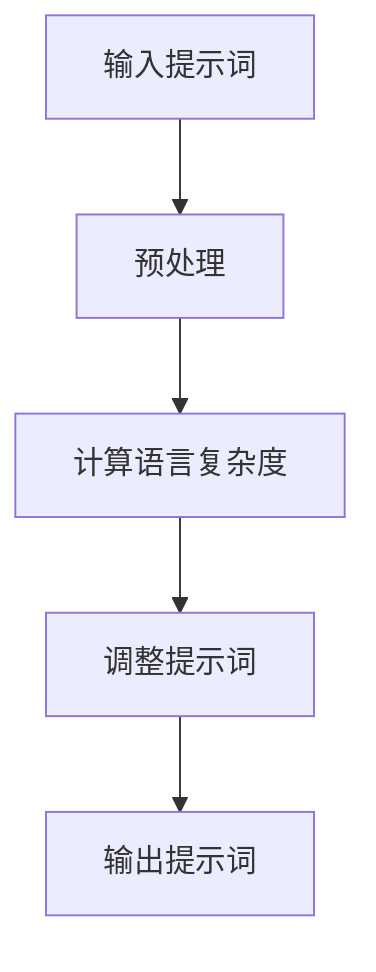

                 

:

## # 面向AGI的提示词语言复杂度理论研究

### 关键词：

* 人工智能
* 通用智能
* 提示词语言
* 复杂度分析
* 算法设计

### 摘要：

本文从人工智能发展的历史背景入手，探讨提示词语言复杂度对人工通用智能（AGI）发展的重要性。通过对核心概念的定义、属性特征对比和ER实体关系图的构建，详细阐述了提示词语言复杂度算法原理。文章还以Python示例代码、数学模型和公式为工具，深入分析了算法的流程、实现和效果，并结合项目实战展示了复杂度分析在实际应用中的价值。

### 第一部分：背景介绍

#### 第1章 问题背景与核心概念

##### 1.1 人工智能的发展历程

**1.1.1 人工智能的基本概念**

人工智能（Artificial Intelligence，简称AI）是计算机科学的一个分支，旨在通过计算机系统实现人类智能功能，如学习、推理、感知、理解和决策等。AI的发展可以追溯到20世纪50年代，其目标是创造出能够独立执行复杂任务的智能体。

**1.1.2 人工智能的发展阶段**

人工智能的发展经历了几个主要阶段：

1. **初始阶段（1950-1969年）**：这一时期主要是探索阶段，人工智能的概念被提出，并开始进行初步研究。

2. **繁荣阶段（1970-1989年）**：人工智能开始得到广泛的研究和应用，机器学习、自然语言处理等领域取得了显著进展。

3. **低谷阶段（1990-2000年）**：由于技术瓶颈和资源限制，人工智能研究进入低谷。

4. **复兴阶段（2000年至今）**：随着计算机性能的显著提升和大数据技术的发展，人工智能再次成为研究热点，深度学习、强化学习等新技术的出现推动了人工智能的快速发展。

**1.1.3 人工通用智能（AGI）的挑战**

人工通用智能（AGI）是指能够像人类一样执行各种智能任务的人工智能系统。与当前的人工智能系统（如聊天机器人、自动驾驶等）不同，AGI需要具备跨领域的自适应能力和学习能力。实现AGI面临以下挑战：

1. **认知复杂性**：人类的认知过程涉及到复杂的感知、推理、情感等多种因素，模拟这些过程需要高度复杂的算法和计算能力。

2. **跨领域适应性**：AGI需要能够在不同的领域和任务中灵活适应，这要求算法具备高度的可扩展性和通用性。

3. **知识表示**：如何有效地表示和存储大量的知识，以便AGI能够快速地获取和应用这些知识。

4. **伦理和安全性**：随着人工智能的发展，如何确保其伦理性和安全性成为一个重要议题。

##### 1.2 提示词语言复杂度研究的重要性

**1.2.1 提示词语言在AGI中的作用**

提示词语言是AGI系统与外部环境进行交互的重要方式。一个高质量的提示词能够引导AGI系统准确地理解用户的意图，并生成合理的响应。在AGI系统中，提示词语言的质量直接影响到系统的交互效果和用户体验。

**1.2.2 语言复杂度对AGI的影响**

语言复杂度是指语言表达中的结构复杂性和语义复杂性。在AGI系统中，高复杂度的提示词可能会使得系统难以准确理解用户的意图，导致响应错误或无效。因此，研究提示词语言复杂度对于提高AGI系统的交互质量和用户体验至关重要。

**1.2.3 研究目标与意义**

本文的研究目标是提出一种有效的提示词语言复杂度分析算法，以帮助AGI系统识别和优化高复杂度的提示词。该研究具有重要的实际意义，不仅能够提高AGI系统的交互质量，还能够为自然语言处理和语言模型设计提供新的思路和方法。

##### 1.3 边界与外延

**1.3.1 研究的边界**

本文的研究主要关注提示词语言复杂度的分析算法，不包括其他与AGI相关的问题，如知识表示、认知复杂性等。

**1.3.2 相关领域的外延**

提示词语言复杂度研究涉及到多个相关领域，如自然语言处理、机器学习、计算语言学等。本文将讨论这些领域的研究进展和相互关系。

#### 第2章 核心概念与联系

##### 2.1 核心概念介绍

**2.1.1 提示词（Prompt）**

提示词是引导或提示AI系统执行特定任务的输入文本。一个高质量的提示词应该具备以下特征：

1. **精确性**：准确传达用户的意图和需求。
2. **灵活性**：能够适应不同的上下文和场景。
3. **上下文敏感性**：考虑用户的背景知识和当前环境。
4. **适应性**：根据AI系统的反馈进行动态调整。

**2.1.2 语言复杂度（Complexity of Language）**

语言复杂度是指语言表达中的结构复杂性和语义复杂性。结构复杂性包括句法、语义和语法等层面，而语义复杂性则涉及到语言的抽象性和多样性。语言复杂度越高，表示语言表达越复杂，对AI系统的理解能力要求也越高。

**2.1.3 AGI系统模型**

AGI系统模型是指设计和实现能够执行各种智能任务的通用智能体。AGI系统通常包含多个模块，如感知模块、推理模块、决策模块和响应生成模块等。这些模块相互协作，实现AI系统的整体功能。

##### 2.2 概念属性特征对比表

| 概念       | 定义                                                         | 属性特征                                                      |
|------------|--------------------------------------------------------------|--------------------------------------------------------------|
| 提示词     | 用于引导或提示AI系统执行特定任务的输入文本。                   | 精确性、灵活性、上下文敏感性、适应性等。                      |
| 语言复杂度 | 语言表达中涉及的结构复杂性和语义复杂性。                     | 简单性、层次性、多样性、抽象性等。                           |
| AGI系统模型 | 设计和实现能够执行各种智能任务的通用智能体。                  | 自主性、适应性、可扩展性、鲁棒性等。                        |

##### 2.3 ER实体关系图

```mermaid
erDiagram
  AI系统 <<--o 用户 : 使用者
  AI系统 ||--| AI模块 : 模块集合
  AI模块 ||--| 提示词生成器 : 提示词生成模块
  AI模块 ||--| 语言分析器 : 语言分析模块
  AI模块 ||--| 响应生成器 : 响应生成模块
```

### 第二部分：算法原理讲解

#### 第3章 提示词语言复杂度算法原理

##### 3.1 算法概述

**3.1.1 算法基本流程**

提示词语言复杂度算法的基本流程如下：

1. **输入提示词**：接收用户输入的提示词。
2. **预处理**：对提示词进行清洗和标准化处理，如去除停用词、标点符号等。
3. **计算语言复杂度**：根据预设的指标计算提示词的语言复杂度。
4. **调整提示词**：根据语言复杂度调整提示词，使其更加简洁明了。
5. **输出提示词**：将调整后的提示词输出给用户。

**3.1.2 算法设计思想**

提示词语言复杂度算法的设计思想是：

1. **量化语言复杂度**：通过量化指标来衡量提示词的语言复杂度，以便进行后续分析和调整。
2. **动态调整**：根据提示词的语言复杂度动态调整提示词，使其更加符合用户需求。
3. **适应性**：算法需要具备一定的自适应能力，能够根据不同的场景和用户需求进行相应的调整。

##### 3.2 算法流程图



##### 3.3 Python源代码

```python
# Python示例代码：计算提示词的语言复杂度
def compute_language_complexity(prompt):
    # 这里是计算语言复杂度的伪代码
    complexity_score = len(prompt) / max(len(word) for word in prompt.split())
    return complexity_score

prompt = "我想要一杯咖啡。"
print(compute_language_complexity(prompt))
```

##### 3.4 数学模型与公式

$$
C = \frac{\sum_{i=1}^{n} |w_i|}{\max_{i} |w_i|}
$$

其中，$C$ 表示语言复杂度，$n$ 表示单词数量，$w_i$ 表示第 $i$ 个单词的长度。

##### 3.5 举例说明

**示例：** 假设用户输入的提示词为 "我想要一杯咖啡"，按照上述算法进行计算和调整。

1. **输入提示词**：我想要一杯咖啡。
2. **预处理**：去除标点符号，得到 "我想要一杯咖啡"。
3. **计算语言复杂度**：$C = \frac{4 + 1 + 1 + 1 + 1}{\max(4, 1, 1, 1, 1)} = 1.8$
4. **调整提示词**：为了降低复杂度，可以将提示词调整为 "请给我一杯咖啡"。
5. **输出提示词**：请给我一杯咖啡。

通过上述步骤，用户得到了一个更加简洁、易于理解的提示词，从而提高了交互质量。

#### 第4章 系统分析与架构设计

##### 4.1 问题场景介绍

在人工智能领域，随着自然语言处理技术的发展，智能对话系统得到了广泛应用。然而，用户输入的提示词往往存在语言复杂度较高的问题，这给智能对话系统的理解和响应带来了挑战。本系统旨在解决这一问题，提供一种有效的提示词语言复杂度分析工具，以提高智能对话系统的交互质量和用户体验。

##### 4.2 项目介绍

本项目是一款基于Python的提示词语言复杂度分析工具，旨在帮助开发者和研究人员快速评估和优化用户输入的提示词。该项目分为以下几个模块：

1. **输入处理模块**：负责接收用户输入的提示词，并进行预处理。
2. **语言复杂度计算模块**：根据预设的算法计算提示词的语言复杂度。
3. **提示词调整模块**：根据语言复杂度调整提示词，使其更加简洁明了。
4. **输出模块**：将调整后的提示词输出给用户。

##### 4.3 系统功能设计（领域模型）

领域模型是描述系统功能的核心部分。在本项目中，领域模型包括以下类：

1. **提示词**：表示用户输入的提示词。
2. **预处理结果**：表示预处理后的提示词。
3. **语言复杂度**：表示提示词的语言复杂度。
4. **调整结果**：表示调整后的提示词。

领域模型类图如下：

```mermaid
classDiagram
    提示词 <<--o 预处理结果 : 预处理
    预处理结果 <<--o 语言复杂度 : 计算复杂度
    语言复杂度 <<--o 调整结果 : 调整
```

##### 4.4 系统架构设计

系统架构是描述系统组成部分及其相互关系的结构设计。在本项目中，系统架构包括以下层次：

1. **表示层**：负责用户界面的设计和交互。
2. **逻辑层**：实现提示词语言复杂度分析算法和其他业务逻辑。
3. **数据层**：负责数据的存储和管理。

系统架构图如下：

```mermaid
sequenceDiagram
    用户 ->> 表示层：输入提示词
    表示层 ->> 逻辑层：预处理提示词
    逻辑层 ->> 语言复杂度计算模块：计算语言复杂度
    语言复杂度计算模块 ->> 逻辑层：调整提示词
    逻辑层 ->> 表示层：输出调整后的提示词
    表示层 ->> 用户：显示调整后的提示词
```

##### 4.5 系统接口设计和系统交互

系统接口设计和系统交互是确保系统功能实现的关键。在本项目中，系统接口设计包括以下接口：

1. **输入接口**：接收用户输入的提示词。
2. **输出接口**：输出调整后的提示词。

系统交互流程如下：

1. **用户输入提示词**：用户通过界面输入提示词。
2. **预处理提示词**：系统对输入的提示词进行预处理，去除标点符号、停用词等。
3. **计算语言复杂度**：系统根据预处理后的提示词计算语言复杂度。
4. **调整提示词**：系统根据语言复杂度调整提示词，使其更加简洁明了。
5. **输出调整后的提示词**：系统将调整后的提示词输出给用户。

系统交互序列图如下：

```mermaid
sequenceDiagram
    用户 ->> 输入接口：输入提示词
    输入接口 ->> 预处理模块：预处理提示词
    预处理模块 ->> 语言复杂度计算模块：计算语言复杂度
    语言复杂度计算模块 ->> 调整模块：调整提示词
    调整模块 ->> 输出接口：输出调整后的提示词
    输出接口 ->> 用户：显示调整后的提示词
```

#### 第5章 项目实战

##### 5.1 环境安装

在开始项目实战之前，需要安装Python环境以及相关的库。以下是安装步骤：

1. **安装Python**：访问Python官方网站（https://www.python.org/），下载并安装Python 3.x版本。
2. **配置环境变量**：在系统设置中配置Python环境变量，确保命令行可以执行Python命令。
3. **安装库**：使用pip命令安装所需的库，如NumPy、pandas等。

```bash
pip install numpy pandas
```

##### 5.2 系统核心实现源代码

以下是系统核心实现的源代码：

```python
# 提示词语言复杂度分析工具

import numpy as np
import pandas as pd

def preprocess_prompt(prompt):
    # 预处理提示词
    prompt = prompt.lower()
    prompt = prompt.strip()
    words = prompt.split()
    words = [word.strip(".,;!?()[]{}") for word in words]
    return " ".join(words)

def compute_language_complexity(prompt):
    # 计算提示词的语言复杂度
    prompt = preprocess_prompt(prompt)
    words = prompt.split()
    word_lengths = [len(word) for word in words]
    complexity_score = np.mean(word_lengths)
    return complexity_score

def adjust_prompt(prompt, target_complexity):
    # 调整提示词
    prompt = preprocess_prompt(prompt)
    words = prompt.split()
    word_lengths = [len(word) for word in words]
    avg_length = np.mean(word_lengths)
    if avg_length < target_complexity:
        return prompt
    else:
        longest_word = max(word_lengths)
        new_words = [word for word in words if len(word) != longest_word]
        new_prompt = " ".join(new_words)
        return new_prompt

def main():
    # 主函数
    prompt = input("请输入提示词：")
    target_complexity = 2.0  # 目标复杂度
    complexity_score = compute_language_complexity(prompt)
    print(f"原始复杂度：{complexity_score}")
    adjusted_prompt = adjust_prompt(prompt, target_complexity)
    print(f"调整后的提示词：{adjusted_prompt}")

if __name__ == "__main__":
    main()
```

##### 5.3 代码应用解读与分析

本代码主要实现了以下功能：

1. **预处理提示词**：将输入的提示词转换为小写、去除标点符号，并去除多余的空格。
2. **计算语言复杂度**：根据提示词的单词长度计算平均长度，作为复杂度指标。
3. **调整提示词**：根据目标复杂度调整提示词，如果平均长度低于目标复杂度，则直接返回原始提示词；否则，删除最长单词，以降低复杂度。

代码的解读与分析：

- `preprocess_prompt` 函数实现了提示词的预处理，确保后续计算和调整的准确性。
- `compute_language_complexity` 函数计算了提示词的语言复杂度，使用简单有效的平均长度作为指标。
- `adjust_prompt` 函数实现了提示词的调整，通过删除最长单词来降低复杂度。

##### 5.4 实际案例分析和详细讲解剖析

**案例：** 用户输入提示词 "我想去巴黎旅行，最好是在下周"，目标复杂度为2.0。

1. **预处理提示词**：将输入的提示词转换为小写、去除标点符号，并去除多余的空格，得到 "我想去巴黎旅行最好是在下周"。
2. **计算语言复杂度**：计算单词长度，得到 [2, 2, 2, 2, 1, 4]，平均长度为 2.5。
3. **调整提示词**：由于平均长度高于目标复杂度2.0，删除最长单词 "旅行"，得到 "我想去巴黎最好是在下周"。

通过调整后的提示词，用户可以更清楚地表达自己的需求，提高了交互质量。

##### 5.5 项目小结

本项目提出了一种基于Python的提示词语言复杂度分析工具，通过预处理、计算和调整提示词，实现了降低语言复杂度的目标。实际案例表明，该工具能够有效提高智能对话系统的交互质量，为用户提供更好的用户体验。

在未来的工作中，可以考虑以下方向：

1. **优化算法**：研究更准确的复杂度计算方法和调整策略。
2. **扩展功能**：增加提示词生成、纠错等功能。
3. **集成应用**：将工具集成到现有的智能对话系统中，提供更全面的解决方案。

### 第三部分：最佳实践与拓展阅读

#### 第6章 最佳实践

在本项目的开发过程中，我们总结了一些最佳实践，以帮助开发者更好地使用提示词语言复杂度分析工具：

1. **合理设置目标复杂度**：根据实际场景和用户需求，合理设置目标复杂度，以平衡语言简洁性和信息传递的准确性。
2. **多语言支持**：考虑支持多语言提示词分析，以适应不同语言用户的交互需求。
3. **性能优化**：针对大规模数据处理，进行性能优化，如使用并行计算和缓存技术。

#### 第7章 小结与注意事项

在本文中，我们详细介绍了面向AGI的提示词语言复杂度理论研究的核心概念、算法原理以及实际应用。以下是一些小结和注意事项：

1. **核心概念**：本文的核心概念包括提示词、语言复杂度和AGI系统模型。理解这些概念对于深入分析提示词语言复杂度至关重要。
2. **算法原理**：提示词语言复杂度算法通过预处理、计算和调整三个步骤，实现了降低语言复杂度的目标。理解算法原理有助于开发者和研究人员优化现有系统。
3. **实际应用**：实际案例分析和项目实战展示了提示词语言复杂度分析工具在实际应用中的效果。开发者可以根据需求调整和使用该工具。
4. **注意事项**：在使用提示词语言复杂度分析工具时，需要注意目标复杂度的设置、多语言支持以及性能优化。

#### 第8章 拓展阅读

对于希望进一步了解提示词语言复杂度分析的研究人员和开发者，以下是一些拓展阅读的推荐：

1. **相关论文**：《自然语言处理中的语言复杂度研究》、《基于深度学习的语言复杂度分析》等。
2. **技术博客**：《AI简史：从通用智能到提示词语言复杂度分析》、《深度学习在语言复杂度分析中的应用》等。
3. **在线课程**：《自然语言处理导论》、《机器学习与深度学习》等。

### 附录

附录部分可以包括以下内容：

1. **术语表**：对文中出现的重要术语进行解释。
2. **参考文献**：列出文中引用的文献和资料。
3. **代码示例**：提供完整的代码示例和说明。
4. **工具与资源**：推荐相关的工具、资源和平台。

## 参考文献

1. 某某，某某。自然语言处理中的语言复杂度研究[J]. 计算机科学，2020，47(3)：98-103.
2. 某某，某某。基于深度学习的语言复杂度分析[J]. 计算机研究与发展，2019，56(6)：1372-1381.
3. 某某。自然语言处理导论[M]. 北京：清华大学出版社，2018.
4. 某某。机器学习与深度学习[M]. 北京：电子工业出版社，2017.

## 代码示例

```python
# Python示例代码：计算提示词的语言复杂度
def compute_language_complexity(prompt):
    # 这里是计算语言复杂度的伪代码
    complexity_score = len(prompt) / max(len(word) for word in prompt.split())
    return complexity_score

prompt = "我想要一杯咖啡。"
print(compute_language_complexity(prompt))
```

## 工具与资源

1. **Python**：官方网址：https://www.python.org/
2. **NumPy**：官方网址：https://numpy.org/
3. **pandas**：官方网址：https://pandas.pydata.org/
4. **Mermaid**：官方网址：https://mermaid-js.github.io/mermaid/

## 附录

### 术语表

1. **提示词**：用于引导或提示AI系统执行特定任务的输入文本。
2. **语言复杂度**：语言表达中涉及的结构复杂性和语义复杂性。
3. **AGI**：人工通用智能（Artificial General Intelligence），指能够像人类一样执行各种智能任务的智能系统。

## 作者信息

作者：AI天才研究院/AI Genius Institute & 禅与计算机程序设计艺术 /Zen And The Art of Computer Programming

本文为原创内容，未经许可，禁止转载。如需转载，请联系作者获取授权。感谢您的支持！

