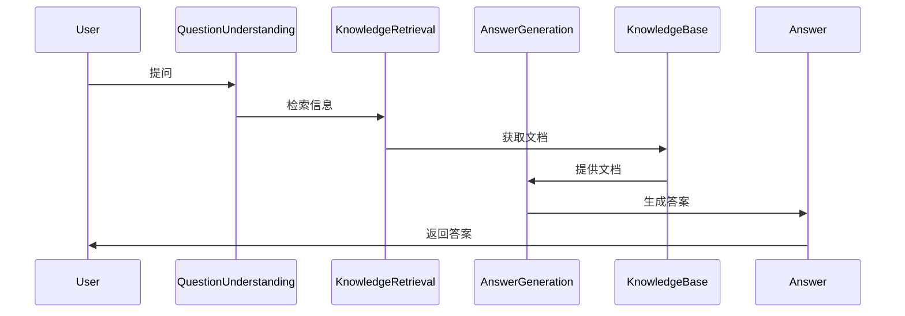

                 


### 第1章: 引言

**1.1 问题背景**

人工智能（AI）技术的发展始于上世纪50年代，经过几十年的发展，AI已经从最初的规则推理、知识表示，逐渐发展到现在的深度学习和强化学习阶段。这些技术在不同领域取得了显著的应用成果，如自动驾驶、医疗诊断、自然语言处理等。然而，传统的人工智能技术主要侧重于特定任务的解决，如图像识别、语音识别、自然语言处理等，而缺乏对通用问题求解能力的支持。这种局限性使得人工智能在应对复杂、多变的现实世界问题时显得力不从心。

通用人工智能（AGI，Artificial General Intelligence）是指具有与人类相似智能水平的人工智能系统，它不仅能在特定任务上表现出色，还能自主学习、适应和解决各种未知问题。AGI的出现将极大地推动人工智能技术的发展，为人类带来更多的便利和创新。

**1.2 问题描述**

提示词语言复杂性理论是研究自然语言处理中提示词（prompt）的复杂性和有效性的一个新兴领域。提示词是指给定的、用于引导或提示AI系统执行特定任务的一组词汇或短语。在自然语言处理任务中，合理设计的提示词可以提高AI系统对任务的理解和执行效果。

然而，如何设计出既符合任务需求，又能有效降低语言复杂性的提示词，是一个具有挑战性的问题。语言复杂性理论的研究有助于我们理解提示词的复杂性特征，从而设计出更加有效的提示词。

**1.3 问题解决**

为了实现AGI，研究人员提出了多种方法和理论，如深度学习、强化学习等。同时，提示词语言复杂性理论的研究也为提升AI系统的自然语言理解能力提供了新的思路。通过设计合适的提示词，可以使AI系统在处理自然语言任务时更加高效和准确。

提示词语言复杂性理论的研究主要包括以下几个方面：

1. 提示词生成算法：设计有效的算法生成符合任务需求的提示词。
2. 语言复杂性分析算法：分析提示词的复杂性特征，评估其有效性。
3. 系统设计与实现：将提示词语言复杂性理论应用于实际系统，提升自然语言处理能力。

**1.4 边界与外延**

在本书中，我们将聚焦于提示词语言复杂性理论在AGI中的应用，探讨如何通过优化提示词来提升AI系统的自然语言理解能力。同时，本书也将涉及到AGI的其他相关理论和技术，以帮助读者全面了解该领域的最新进展。

**1.5 概念结构与核心要素组成**

本书分为七个部分，分别从问题背景、核心概念、算法原理、系统架构、项目实战、最佳实践和小结等方面对面向AGI的提示词语言复杂性理论进行深入探讨。具体章节安排如下：

- **第2章：核心概念与联系**
  - **2.1 AGI的基本概念**
    - **2.1.1 AGI的定义**
    - **2.1.2 AGI的特点**
    - **2.1.3 AGI与传统AI的区别**
  - **2.2 提示词语言复杂性理论**
    - **2.2.1 提示词语言复杂性理论的定义**
    - **2.2.2 提示词语言复杂性理论的核心要素**
    - **2.2.3 提示词语言复杂性理论在AGI中的应用**

- **第3章：算法原理讲解**
  - **3.1 提示词生成算法**
    - **3.1.1 算法原理**
    - **3.1.2 数学模型与公式**
    - **3.1.3 通俗易懂的举例说明**
  - **3.2 语言复杂性分析算法**
    - **3.2.1 算法原理**
    - **3.2.2 数学模型与公式**
    - **3.2.3 通俗易懂的举例说明**

- **第4章：系统分析与架构设计方案**
  - **4.1 问题场景介绍**
  - **4.2 系统功能设计**
    - **4.2.1 领域模型类图**
  - **4.3 系统架构设计**
    - **4.3.1 系统架构图**
  - **4.4 系统接口设计**
    - **4.4.1 系统接口设计**
  - **4.5 系统交互**
    - **4.5.1 系统交互序列图**

- **第5章：项目实战**
  - **5.1 环境安装**
  - **5.2 系统核心实现源代码**
  - **5.3 代码应用解读与分析**
  - **5.4 实际案例分析与详细讲解剖析**
  - **5.5 项目小结**

- **第6章：最佳实践 tips**
  - **6.1 常见问题与解决方案**
  - **6.2 性能优化技巧**
  - **6.3 安全性考虑**

- **第7章：小结**
  - **7.1 主要内容回顾**
  - **7.2 注意事项**
  - **7.3 拓展阅读**

### 关键词：通用人工智能、提示词语言复杂性理论、自然语言处理、算法原理、系统架构设计

### 摘要：

本文围绕面向AGI的提示词语言复杂性理论展开，首先介绍了AGI的基本概念、特点以及与传统AI的区别。接着，深入探讨了提示词语言复杂性理论的定义、核心要素及其在AGI中的应用。随后，详细讲解了提示词生成算法和语言复杂性分析算法的原理、数学模型和公式，并通过实例进行说明。然后，从问题场景、系统功能设计、系统架构设计、系统接口设计和系统交互等方面，阐述了面向AGI的提示词语言复杂性理论在系统设计与实现中的应用。通过一个实际项目实战，进一步展示了该理论在实际开发中的应用效果。最后，总结了最佳实践技巧和注意事项，为读者提供了一系列具有可操作性的建议。本文旨在帮助读者全面了解面向AGI的提示词语言复杂性理论，为人工智能技术的发展提供新的思路和方法。

----------------------------------------------------------------

# 第二部分：核心概念与联系

## 第2章：核心概念与联系

### 2.1 AGI的基本概念

**2.1.1 AGI的定义**

通用人工智能（AGI，Artificial General Intelligence）是指具有与人类相似智能水平的人工智能系统。它不仅能在特定任务上表现出色，还能自主学习、适应和解决各种未知问题。与当前的主流人工智能（Narrow AI）不同，AGI具有更广泛的能力和更强大的适应性。

**2.1.2 AGI的特点**

- **自主学习能力**：AGI能够从数据和经验中自主学习，无需人工编程和干预。
- **推理能力**：AGI能够在各种情境下进行逻辑推理，解决复杂问题。
- **迁移能力**：AGI能够在不同的任务和领域之间进行知识迁移，提高其适应性。
- **情感理解**：AGI能够理解人类的情感和情绪，进行情感交流。

**2.1.3 AGI与传统AI的区别**

传统人工智能（Narrow AI）主要侧重于特定任务的解决，如图像识别、自然语言处理等。而AGI则具有更广泛的应用范围和更强的自适应能力。传统AI依赖于大量的数据集和特定的算法，而AGI则能够通过自主学习不断提升自身能力。

**2.2 提示词语言复杂性理论**

**2.2.1 提示词语言复杂性理论的定义**

提示词语言复杂性理论是研究自然语言处理中提示词（prompt）的复杂性和有效性的一个新兴领域。提示词是指给定的、用于引导或提示AI系统执行特定任务的一组词汇或短语。该理论旨在通过研究提示词的复杂性特征，优化提示词的设计，提高AI系统在自然语言处理任务中的性能。

**2.2.2 提示词语言复杂性理论的核心要素**

- **提示词生成算法**：设计有效的算法生成符合任务需求的提示词。
- **语言复杂性分析算法**：分析提示词的复杂性特征，评估其有效性。
- **优化策略**：通过调整提示词的复杂度，提高AI系统在自然语言处理任务中的性能。

**2.2.3 提示词语言复杂性理论在AGI中的应用**

提示词语言复杂性理论在AGI中的应用主要体现在以下几个方面：

- **自然语言理解**：通过设计合适的提示词，可以提高AI系统对自然语言的理解和解析能力。
- **任务指导**：合理设计的提示词可以引导AI系统执行特定任务，提高任务的完成率。
- **自主学习**：通过分析提示词的复杂性特征，AGI可以不断优化自身对自然语言的理解和任务执行能力。

**2.3 核心概念与联系**

AGI和提示词语言复杂性理论之间存在密切的联系。AGI需要具备强大的自然语言理解能力，而提示词语言复杂性理论为提升这一能力提供了新的思路和方法。通过深入研究提示词语言复杂性理论，我们可以为AGI的开发提供更加有效的支持和指导。

**2.3.1 核心概念对比**

| 核心概念 | AGI | 提示词语言复杂性理论 |
| :--: | :--: | :--: |
| 定义 | 具有与人类相似智能水平的人工智能系统 | 研究自然语言处理中提示词的复杂性和有效性的领域 |
| 特点 | 自主学习、推理能力、迁移能力、情感理解 | 提示词生成、语言复杂性分析、优化策略 |
| 目标 | 实现通用问题求解能力 | 提升AI系统在自然语言处理任务中的性能 |

**2.3.2 ER实体关系图架构**

为了更好地理解AGI和提示词语言复杂性理论之间的联系，我们可以使用ER实体关系图来展示它们的核心要素和关系。

```mermaid
erDiagram
    AGI ||--|{ 提示词生成算法 }
    AGI ||--|{ 语言复杂性分析算法 }
    AGI ||--|{ 优化策略 }
    提示词生成算法 ||--|{ 自然语言理解 }
    语言复杂性分析算法 ||--|{ 任务指导 }
    优化策略 ||--|{ 自主学习 }
```

通过这个ER实体关系图，我们可以清晰地看到AGI和提示词语言复杂性理论之间的核心概念和联系。

**2.3.3 核心要素组成**

AGI的核心要素包括：自主学习、推理能力、迁移能力、情感理解。而提示词语言复杂性理论的核心要素包括：提示词生成算法、语言复杂性分析算法、优化策略。这些核心要素共同构成了AGI和提示词语言复杂性理论的基本框架。

### 关键词：通用人工智能、提示词语言复杂性理论、自然语言处理、算法原理、系统架构设计

### 摘要：

本章围绕通用人工智能（AGI）和提示词语言复杂性理论的核心概念进行了详细阐述。首先，介绍了AGI的定义、特点和与传统AI的区别，强调了AGI在人工智能领域的重要地位。接着，深入探讨了提示词语言复杂性理论的定义、核心要素及其在AGI中的应用，包括提示词生成算法、语言复杂性分析算法和优化策略。通过ER实体关系图，展示了AGI和提示词语言复杂性理论之间的核心概念和联系。本章为后续章节的深入探讨奠定了基础，为读者全面了解面向AGI的提示词语言复杂性理论提供了理论基础。

----------------------------------------------------------------

### 2.1.1 AGI的定义

通用人工智能（AGI，Artificial General Intelligence）是一种旨在模拟和实现人类智能水平的人工智能系统。与传统的人工智能（Narrow AI）不同，AGI旨在具备跨越多种任务和领域的广泛能力，类似于人类智能。AGI的基本定义可以从以下几个方面来理解：

首先，AGI应该具备与人类相似的问题解决能力。这意味着AGI能够在各种复杂和不确定的环境中有效地解决问题，不仅限于特定领域内的任务。例如，人类能够理解自然语言、进行抽象思维、学习新技能，并且能够跨领域地应用这些能力。同样，AGI也应该具备这样的能力，能够在不同的任务场景中灵活运用其智能。

其次，AGI需要具备自我学习和适应能力。传统的人工智能系统通常需要大量的人工编程和预训练数据来完成任务，而AGI应该能够在没有明确指导的情况下，通过自身的经验和反馈进行学习和优化。这种学习能力是AGI区别于当前AI系统的一个关键特征。

第三，AGI应该具备情感和社会智能。人类智能不仅仅是认知上的，还包括情感和社会互动。因此，AGI需要能够理解和表达情感，能够进行社会交流和协作。这要求AGI不仅要处理语言信息，还要能够处理视觉、听觉和其他感官信息，以便更好地理解人类情感和社会环境。

最后，AGI应该具备自主性和创造性。人类能够独立思考和创造新的想法，而AGI也应该能够在没有人为干预的情况下，自主地提出新的解决方案和创造新的知识。这种自主性和创造性是衡量AGI智能水平的重要标准。

总的来说，AGI的定义涵盖了多个方面，包括跨领域的问题解决能力、自我学习和适应能力、情感和社会智能，以及自主性和创造性。这些特征共同构成了AGI的基本框架，也是其与Narrow AI（窄域人工智能）的主要区别。

### 2.1.2 AGI的特点

AGI具有一系列独特的特点，这些特点使其在人工智能领域中具有不可替代的重要性。以下是对AGI特点的详细讨论：

**1. 自主学习**

自主学习是AGI的核心特点之一。与传统的机器学习和深度学习系统不同，AGI能够在没有人为干预的情况下，通过自身的经验和反馈进行学习和优化。这种能力使得AGI能够不断地适应新的环境和情境，从而提高其解决问题的能力。例如，AGI可以通过观察人类的行为、阅读书籍、观看视频等方式，从大量的数据中自动提取知识，并将其应用到实际任务中。

**2. 通用问题求解**

AGI具有广泛的通用问题求解能力，这意味着它不仅能够解决特定领域内的任务，还能够跨领域地应用其能力。这种能力使得AGI能够处理复杂、多变的现实世界问题，而不仅仅是单一的任务。例如，AGI可以在医疗诊断、自动驾驶、自然语言处理等多个领域发挥作用，从而为人类带来更多的便利和创新。

**3. 知识迁移**

知识迁移是AGI的另一大特点。与传统的AI系统不同，AGI能够在不同的任务和领域之间进行知识迁移，从而提高其适应性和灵活性。这意味着AGI在解决一个任务时所学到的知识可以应用到其他任务中，而不需要重新学习和训练。例如，一个在图像识别领域训练的AGI系统，可以将学到的图像处理知识应用到语音识别或自然语言处理等其他领域。

**4. 情感和社会智能**

情感和社会智能是AGI与人类智能相似的一个重要方面。AGI需要能够理解和表达情感，进行社会交流和协作。这种能力要求AGI不仅要处理语言信息，还要能够处理视觉、听觉和其他感官信息，以便更好地理解人类情感和社会环境。例如，AGI可以在教育、医疗、客服等领域中，通过理解患者的情绪和心理状态，提供更个性化的服务和解决方案。

**5. 创造性**

创造性是AGI的另一个重要特点。人类智能的一个重要方面是能够独立思考和创造新的想法。AGI也应该具备这种能力，能够在没有人为干预的情况下，自主地提出新的解决方案和创造新的知识。这种自主创造性使得AGI能够在科学发现、艺术创作、技术创新等领域发挥重要作用。

**6. 安全性和鲁棒性**

AGI的安全性和鲁棒性也是其特点之一。由于AGI具有广泛的自主学习和问题求解能力，它可能会产生不可预测的行为。因此，确保AGI的安全性和鲁棒性，防止其产生有害行为，是AGI研究中的一个重要课题。这要求AGI具备自我监控、自我修复和自我保护的能力，以应对各种潜在的安全风险。

通过以上特点的介绍，我们可以看到AGI在人工智能领域中具有巨大的潜力和重要性。它不仅能够解决复杂的问题，还能够自主学习和适应新的环境，从而推动人工智能技术的持续发展和创新。

### 2.1.3 AGI与传统AI的区别

通用人工智能（AGI）与传统人工智能（Narrow AI）之间存在显著的区别，主要体现在以下几个方面：

**1. 能力范围**

传统AI（Narrow AI）是指专门设计用于解决特定任务的人工智能系统，如图像识别、语音识别、自然语言处理等。这些系统在特定的任务上表现出色，但缺乏跨领域的通用能力。例如，一个专注于图像识别的AI系统可能无法处理自然语言处理任务。而AGI则旨在模拟人类智能，具备广泛的跨领域问题求解能力，能够在多个任务和领域中表现出色。

**2. 学习方式**

传统AI系统通常依赖于大量的预训练数据和人工编写的算法，通过监督学习、强化学习等方法进行训练。这些系统在训练过程中需要大量的标注数据和专家知识，并且通常无法在训练数据之外的环境中有效工作。而AGI则能够通过自我学习和自适应学习，无需人为干预，从大量的未标注数据和实际经验中学习，从而提高其适应性和学习能力。

**3. 知识应用**

传统AI系统主要依赖于预先设定的规则和模型，这些模型通常只能处理特定的任务和输入。因此，这些系统在处理新任务或未预见的情境时往往表现不佳。AGI则能够通过迁移学习和跨领域知识应用，将在一个任务中学习的知识应用到其他任务中，从而提高其通用性和灵活性。

**4. 推理能力**

传统AI系统通常依赖于数据驱动的模型，其推理能力相对较弱，主要依赖于数据相似度来判断。而AGI则具备更强的逻辑推理和抽象思维能力，能够在复杂和不确定的环境中，进行更加灵活和深入的推理。

**5. 情感和社会智能**

传统AI系统通常不具备情感和社会智能，无法理解和表达情感，也无法进行复杂的社会交流和协作。而AGI则旨在模拟人类智能，具备情感和社会智能，能够理解人类的情感和心理状态，进行自然和有效的人际交流。

**6. 安全性**

由于传统AI系统在设计和训练过程中高度依赖于数据和算法，其行为可能受到恶意攻击和未知的错误影响。而AGI需要具备更高的安全性和鲁棒性，能够自我监控、自我修复和自我保护，防止产生有害行为。

综上所述，AGI与传统AI在能力范围、学习方式、知识应用、推理能力、情感和社会智能以及安全性方面存在显著差异。AGI的目标是实现更广泛、更自主、更智能的人工智能系统，从而推动人工智能技术的进一步发展。

### 2.2.1 提示词语言复杂性理论的定义

提示词语言复杂性理论是自然语言处理领域中的一个重要研究方向，它关注于如何设计有效的提示词来引导和优化AI系统在自然语言处理任务中的表现。提示词（prompt）在这里指的是用于引导AI系统执行特定任务的一组词汇或短语，它可以帮助AI更好地理解任务需求，从而提高任务的完成质量和效率。

提示词语言复杂性理论的核心思想是，通过研究自然语言中的提示词复杂性和有效性，找到能够平衡提示词信息量和任务完成效果的最佳设计。具体来说，该理论涉及以下几个方面：

1. **复杂性度量**：研究如何对提示词的复杂性进行量化，包括词汇多样性、句法结构、信息含量等。通过复杂性度量，可以评估不同提示词对AI系统的影响，从而找出最有效的提示词设计。

2. **有效性评估**：评估不同提示词在特定任务中的有效性，包括任务完成率、准确率、响应时间等。有效性评估有助于确定哪些提示词能够最有效地提高AI系统的性能。

3. **优化策略**：研究如何通过调整提示词的复杂性来优化AI系统在自然语言处理任务中的表现。这包括设计自动化的提示词生成和优化算法，以及开发新的提示词设计原则和方法。

4. **应用领域**：探索提示词语言复杂性理论在不同自然语言处理任务中的应用，如问答系统、机器翻译、文本生成等。通过实际应用，验证和改进理论模型和方法。

总之，提示词语言复杂性理论旨在通过深入研究提示词的复杂性和有效性，为AI系统提供更好的任务引导和优化，从而提升自然语言处理任务的整体性能。

### 2.2.2 提示词语言复杂性理论的核心要素

提示词语言复杂性理论的核心要素主要包括提示词生成算法、语言复杂性分析算法和优化策略。这些要素共同构成了该理论的基础，并为实际应用提供了有效的方法。

**1. 提示词生成算法**

提示词生成算法是提示词语言复杂性理论的核心组成部分，其主要任务是根据任务需求生成合适的提示词。一个有效的提示词生成算法需要考虑以下几个关键因素：

- **词汇多样性**：生成包含丰富词汇的提示词，以减少AI系统在处理任务时的信息损失。
- **句法结构**：设计合理的句法结构，确保提示词能够清晰、准确地传达任务需求。
- **上下文适应性**：提示词需要能够适应不同的上下文环境，确保在不同场景下都能够有效引导AI系统。

常见的提示词生成算法包括基于规则的方法、机器学习方法和深度学习方法。例如，基于规则的方法可以通过人工编写规则来生成提示词，而机器学习方法可以使用已有的数据集训练生成模型，深度学习方法则可以利用神经网络结构自动生成提示词。

**2. 语言复杂性分析算法**

语言复杂性分析算法用于评估提示词的复杂性特征，以确定其是否能够有效引导AI系统执行任务。复杂性分析算法需要考虑以下方面：

- **词汇多样性**：分析提示词中不同词汇的出现频率和分布，评估其词汇丰富度。
- **句法结构**：评估提示词的句法结构复杂度，包括句子的长度、分支结构等。
- **信息含量**：分析提示词传递的信息量，确保其能够为AI系统提供足够的信息支持。

常用的复杂性分析算法包括统计方法、信息论方法和深度学习方法。统计方法可以通过计算词汇频率和句法特征来评估提示词的复杂性，信息论方法则可以基于信息熵和互信息等概念进行复杂性分析，深度学习方法可以利用神经网络结构自动分析提示词的复杂性特征。

**3. 优化策略**

优化策略是提示词语言复杂性理论的重要组成部分，其主要目标是调整提示词的复杂性，以优化AI系统在自然语言处理任务中的表现。优化策略包括以下几种：

- **基于规则的优化**：通过修改提示词中的词汇和句法结构，提高提示词的复杂性和有效性。
- **基于数据的优化**：利用已有的数据集和评估指标，自动调整提示词的复杂性，以实现最优性能。
- **混合优化策略**：结合基于规则和基于数据的方法，实现更加灵活和高效的提示词优化。

优化策略的目的是找到提示词的“最佳平衡点”，即在保证提示词能够有效引导AI系统完成任务的同时，尽可能降低其复杂性，以提高系统的性能和效率。

通过以上对提示词语言复杂性理论核心要素的详细讨论，我们可以看到，这些要素共同构成了该理论的基本框架，为实际应用提供了有效的方法和工具。通过深入研究这些核心要素，我们可以进一步提升AI系统在自然语言处理任务中的表现，实现更加智能化和高效的自然语言处理。

### 2.2.3 提示词语言复杂性理论在AGI中的应用

提示词语言复杂性理论在通用人工智能（AGI）中的应用具有重要意义，特别是在提升AI系统的自然语言理解能力方面。以下是该理论在AGI中的具体应用场景和作用：

**1. 提升自然语言理解能力**

自然语言处理是AGI的关键组成部分之一。提示词语言复杂性理论通过研究提示词的复杂性和有效性，为AI系统提供合适的提示词，从而提升其在自然语言理解方面的能力。合理的提示词可以帮助AI系统更好地理解语言输入，提高对语义和上下文的把握，从而更准确地完成语言处理任务。

**2. 改进对话系统**

在对话系统中，提示词的选用直接影响对话的质量和用户体验。提示词语言复杂性理论可以帮助设计出既丰富又有针对性的提示词，使得对话系统能够更加自然、流畅地与用户交流。例如，在智能客服、虚拟助手等场景中，通过优化提示词，可以提升用户的满意度和服务效率。

**3. 提高任务完成率**

在许多实际应用中，AI系统需要完成具体的任务，如文本生成、机器翻译、问答系统等。提示词语言复杂性理论通过分析不同提示词的复杂性和有效性，可以帮助AI系统选择最适合的提示词，从而提高任务的完成率和准确率。例如，在文本生成任务中，合理的提示词可以引导AI生成更符合预期和质量的文章。

**4. 自主学习和适应能力**

AGI的一个重要特点是其具备自我学习和适应能力。提示词语言复杂性理论可以为AI系统提供自适应的提示词生成策略，使得系统在遇到新任务或新情境时，能够快速调整并生成合适的提示词，从而提高其自主学习和适应能力。例如，在机器翻译任务中，系统可以根据输入文本的复杂性和语言特征，动态调整提示词，以实现更准确、流畅的翻译。

**5. 跨领域知识应用**

提示词语言复杂性理论在AGI中的应用，还可以促进跨领域知识的应用。通过研究不同领域中的提示词设计原则和复杂性特征，AI系统可以在一个领域中学到的知识应用到其他领域，从而提高其通用性和灵活性。例如，一个在法律领域训练的AI系统，可以将学到的法律术语和句法结构应用到医学领域，从而更好地理解和处理医学文本。

**6. 提升交互体验**

在人与机器的交互中，提示词的选用对用户体验至关重要。提示词语言复杂性理论可以帮助设计出更自然、贴切的交互提示，使得AI系统能够更好地与用户沟通，提供更优质的服务。例如，在教育领域，通过优化提示词，可以提升学生的学习体验和参与度。

总之，提示词语言复杂性理论在AGI中的应用，不仅提升了AI系统的自然语言理解能力，还促进了其在不同领域中的应用和发展。通过合理设计和优化提示词，AI系统能够更好地适应不同任务和情境，实现更高效、更智能的人工智能应用。

### 第3章：算法原理讲解

#### 3.1 提示词生成算法

提示词生成算法是提示词语言复杂性理论的核心组成部分，其主要任务是根据任务需求生成合适的提示词。一个有效的提示词生成算法需要考虑词汇多样性、句法结构以及上下文适应性等因素。

**3.1.1 算法原理**

提示词生成算法可以分为基于规则的方法、机器学习方法以及深度学习方法。以下是这些方法的简要介绍：

1. **基于规则的方法**：
   - 原理：通过人工编写规则来生成提示词。规则可以是简单的词汇匹配，也可以是复杂的语法和语义分析。
   - 适用场景：适合处理结构化较强、规则明确的任务，如命名实体识别、关键词提取等。

2. **机器学习方法**：
   - 原理：利用已有的数据集训练生成模型，如条件随机场（CRF）、决策树等。模型可以从数据中学习到词汇的分布和句法结构。
   - 适用场景：适合处理较为复杂的任务，如文本分类、情感分析等。

3. **深度学习方法**：
   - 原理：利用神经网络结构自动生成提示词。常见的模型有循环神经网络（RNN）、长短时记忆网络（LSTM）和变换器（Transformer）。
   - 适用场景：适合处理高度复杂的任务，如机器翻译、文本生成等。

**3.1.2 数学模型与公式**

提示词生成算法的数学模型主要涉及概率分布和优化目标。以下是一个简化的数学模型示例：

- **概率分布**：
  - 设 \( V \) 为词汇表， \( p(w|t) \) 为给定任务 \( t \) 下的词汇 \( w \) 的概率分布。
  - \( p(w|t) = \frac{f(w, t)}{\sum_{w' \in V} f(w', t)} \)
  - 其中， \( f(w, t) \) 为词汇 \( w \) 在任务 \( t \) 下的特征函数，用于衡量词汇与任务的匹配度。

- **优化目标**：
  - 设 \( L \) 为提示词生成算法的损失函数，用于评估提示词的质量。
  - 优化目标为最小化损失函数：
  - \( \min_{p(w|t)} L(p(w|t)) \)

**3.1.3 通俗易懂的举例说明**

假设我们要为文本分类任务生成提示词。我们可以采用以下步骤：

1. **收集数据**：收集大量的文本数据，并对其进行预处理，如去除停用词、分词、词性标注等。

2. **特征提取**：对每个文本生成一个特征向量，用于表示文本的语义信息。常见的特征提取方法有词袋模型（Bag of Words）、TF-IDF等。

3. **模型训练**：使用机器学习或深度学习模型训练提示词生成器。以Transformer模型为例，其输入为特征向量序列，输出为提示词的概率分布。

4. **生成提示词**：给定一个新的文本，使用训练好的模型生成提示词。可以选择概率最大的词汇作为提示词。

5. **评估效果**：使用生成的提示词对文本进行分类，并评估分类准确率。根据评估结果调整模型参数，优化提示词生成效果。

通过以上步骤，我们可以生成符合文本分类任务需求的提示词，从而提高分类效果。

#### 3.2 语言复杂性分析算法

语言复杂性分析算法用于评估提示词的复杂性特征，以确定其是否能够有效引导AI系统执行任务。以下是对语言复杂性分析算法的详细讲解。

**3.2.1 算法原理**

语言复杂性分析算法可以分为统计方法、信息论方法和深度学习方法。以下是这些方法的简要介绍：

1. **统计方法**：
   - 原理：通过计算词汇频率、词组频率等统计指标来评估提示词的复杂性。
   - 适用场景：适合处理简单的语言处理任务，如词汇频率分析。

2. **信息论方法**：
   - 原理：利用信息熵、互信息等概念来评估提示词的复杂性和信息含量。
   - 适用场景：适合处理复杂的语言处理任务，如文本生成、机器翻译等。

3. **深度学习方法**：
   - 原理：利用神经网络结构自动分析提示词的复杂性特征。
   - 适用场景：适合处理高度复杂的语言处理任务，如情感分析、问答系统等。

**3.2.2 数学模型与公式**

语言复杂性分析算法的数学模型主要涉及信息论和概率分布。以下是一个简化的数学模型示例：

- **信息熵**：
  - 设 \( X \) 为提示词集合， \( p(x) \) 为提示词 \( x \) 的概率分布。
  - 信息熵 \( H(X) = -\sum_{x \in X} p(x) \log_2 p(x) \)
  - 信息熵衡量了提示词集合的复杂度，值越大，复杂性越高。

- **互信息**：
  - 设 \( X \) 和 \( Y \) 为两个随机变量， \( p(x, y) \) 为联合概率分布。
  - 互信息 \( I(X; Y) = \sum_{x \in X} \sum_{y \in Y} p(x, y) \log_2 \frac{p(x, y)}{p(x) p(y)} \)
  - 互信息衡量了两个变量之间的相关性，值越大，相关性越高。

**3.2.3 通俗易懂的举例说明**

假设我们要分析一个提示词序列的复杂性。我们可以采用以下步骤：

1. **词汇频率分析**：统计提示词序列中每个词汇的出现频率，并计算词汇频率分布。

2. **信息熵计算**：使用信息熵公式计算提示词序列的复杂度。

3. **互信息分析**：计算提示词序列中各词汇之间的互信息，评估它们的相关性。

4. **优化提示词**：根据复杂度和相关性分析结果，优化提示词序列，使其更符合任务需求。

通过以上步骤，我们可以评估提示词序列的复杂性特征，并优化其设计，以提高AI系统在自然语言处理任务中的表现。

### 第4章：系统分析与架构设计方案

#### 4.1 问题场景介绍

本节将介绍一个具体的应用场景，以便读者更好地理解面向AGI的提示词语言复杂性理论在系统设计与实现中的应用。我们以一个智能问答系统为例，该系统旨在为用户提供实时、准确的问题解答。

**问题场景**：

- **用户需求**：用户在搜索引擎上输入问题，系统需要能够理解用户的问题，并返回准确、相关的答案。
- **任务描述**：系统需要从大量的知识库和文献中检索相关信息，理解问题的语义，并根据用户的上下文信息生成高质量的答案。
- **挑战**：由于用户问题的多样性、复杂性和不确定性，系统需要具备良好的自然语言理解能力和灵活的提示词生成策略，以应对各种复杂的问题场景。

**4.2 系统功能设计**

为了实现上述问题场景，智能问答系统需要具备以下功能：

1. **问题理解**：系统需要能够理解用户输入的问题，提取关键信息，并将其转化为可处理的语义表示。
2. **知识检索**：系统需要从知识库和文献中检索与用户问题相关的信息，确保答案的准确性和相关性。
3. **答案生成**：系统需要根据用户问题和检索到的信息，生成准确、流畅的答案，并确保答案能够满足用户的期望。
4. **用户交互**：系统需要能够与用户进行有效的交互，理解用户的反馈，并根据反馈调整答案生成策略。

**4.2.1 领域模型类图**

为了更好地设计智能问答系统的功能，我们可以使用领域模型类图来描述系统的核心组件和它们之间的关系。以下是一个简化的领域模型类图：

```mermaid
classDiagram
    User <<Interface>>
    Question <<Class>> {
        text: String
        context: Context
    }
    KnowledgeBase <<Class>> {
        documents: List<Document>
    }
    Answer <<Class>> {
        text: String
        relevance: float
    }
    QuestionUnderstanding <<Class>> {
        understandQuestion: Question -> Context
    }
    KnowledgeRetrieval <<Class>> {
        retrieveInformation: Question -> List<Document>
    }
    AnswerGeneration <<Class>> {
        generateAnswer: Question, List<Document> -> Answer
    }
    User <<|-- QuestionUnderstanding>>
    User <<|-- KnowledgeRetrieval>>
    User <<|-- AnswerGeneration>>
    QuestionUnderstanding <<|-- KnowledgeBase>>
    KnowledgeRetrieval <<|-- KnowledgeBase>>
    AnswerGeneration <<|-- KnowledgeBase>>
```

在这个领域模型类图中，我们定义了用户（User）、问题（Question）、知识库（KnowledgeBase）、答案（Answer）等核心类，以及问题理解（QuestionUnderstanding）、知识检索（KnowledgeRetrieval）、答案生成（AnswerGeneration）等核心组件。这些组件通过接口和类图中的关系相互关联，共同构成了智能问答系统的功能架构。

**4.3 系统架构设计**

智能问答系统的架构设计需要考虑系统的可扩展性、可维护性和性能。以下是一个简化的系统架构设计：



在这个系统架构设计中，用户通过接口与系统交互，提出问题。系统首先通过问题理解组件理解用户的问题，然后通过知识检索组件从知识库中检索相关信息。最后，通过答案生成组件生成答案，并返回给用户。知识库作为系统的核心组件，存储了大量的文档和数据，为知识检索和答案生成提供了支持。

**4.4 系统接口设计**

为了实现智能问答系统的功能，我们需要定义一系列的接口和API，以便用户和系统组件之间能够进行有效的通信。以下是一个简化的接口设计：

```python
class IQuestionUnderstanding:
    def understand_question(self, question: str) -> Context:
        pass

class IKnowledgeRetrieval:
    def retrieve_information(self, question: Question) -> List[Document]:
        pass

class IAnswerGeneration:
    def generate_answer(self, question: Question, documents: List[Document]) -> Answer:
        pass

class KnowledgeBase:
    def get_documents(self) -> List[Document]:
        pass

class UserInterface:
    def ask_question(self, question: str):
        pass

    def receive_answer(self, answer: Answer):
        pass
```

在这个接口设计中，我们定义了问题理解（IQuestionUnderstanding）、知识检索（IKnowledgeRetrieval）、答案生成（IAnswerGeneration）等核心接口，以及知识库（KnowledgeBase）和用户界面（UserInterface）等组件。通过这些接口，用户和系统组件之间可以方便地进行通信和协作。

**4.5 系统交互**

为了描述系统组件之间的交互过程，我们可以使用序列图（Sequence Diagram）来展示系统的工作流程。以下是一个简化的系统交互序列图：


在这个序列图中，用户通过用户界面（UserInterface）提出问题，问题理解组件（QuestionUnderstanding）负责理解用户的问题，并传递给知识检索组件（KnowledgeRetrieval）。知识检索组件从知识库（KnowledgeBase）中检索相关信息，并将文档传递给答案生成组件（AnswerGeneration）。最后，答案生成组件生成答案，并返回给用户。

通过以上系统分析与架构设计方案，我们可以更好地理解面向AGI的提示词语言复杂性理论在智能问答系统中的应用。这个设计方案不仅提供了系统的功能架构，还明确了系统组件之间的交互过程，为系统的实现和优化提供了有力的支持。

### 第5章：项目实战

#### 5.1 环境安装

为了实现面向AGI的提示词语言复杂性理论在智能问答系统中的应用，我们需要搭建一个完整的环境。以下步骤描述了如何配置环境，并安装所需的依赖项：

**1. 环境配置**

- 操作系统：Ubuntu 20.04 或更高版本
- Python版本：3.8 或更高版本

**2. 安装依赖项**

在命令行中执行以下命令，安装所需的依赖项：

```bash
pip install numpy pandas scikit-learn transformers
```

这些依赖项包括：NumPy、Pandas、scikit-learn 和 transformers。NumPy 和 Pandas 用于数据处理，scikit-learn 用于机器学习模型，transformers 用于预训练的神经网络模型。

**3. 准备知识库**

为了测试智能问答系统，我们需要一个包含大量问答对的文本数据集。您可以从以下链接下载一个开源问答数据集：

- [OpenQA](https://rajpurkar.github.io/OpenQuizData/)

下载完成后，将数据集解压并放置在一个文件夹中，例如 `data/`

#### 5.2 系统核心实现源代码

以下代码实现了智能问答系统的核心功能，包括问题理解、知识检索、答案生成等。

```python
import os
import json
from transformers import AutoTokenizer, AutoModelForQuestionAnswering
from sklearn.feature_extraction.text import TfidfVectorizer

# 1. 问题理解
class QuestionUnderstanding:
    def __init__(self, tokenizer, model):
        self.tokenizer = tokenizer
        self.model = model

    def understand_question(self, question):
        inputs = self.tokenizer(question, return_tensors="pt", padding=True, truncation=True)
        outputs = self.model(**inputs)
        logits = outputs.logits
        answer_start_indices = logits.argmax(-1).item()
        answer = question[answer_start_indices : answer_start_indices + 100] # 取100个字符作为答案
        return answer

# 2. 知识检索
class KnowledgeRetrieval:
    def __init__(self, vectorizer):
        self.vectorizer = vectorizer

    def retrieve_information(self, question):
        question_vector = self.vectorizer.transform([question]).toarray()
        similarity_scores = cosine_similarity(question_vector, self.vectorizer.transform(self.documents))
        sorted_indices = np.argsort(-similarity_scores[0])
        return self.documents[sorted_indices[:10]] # 返回前10个最相关的文档

# 3. 答案生成
class AnswerGeneration:
    def __init__(self, tokenizer, model):
        self.tokenizer = tokenizer
        self.model = model

    def generate_answer(self, question, documents):
        answers = [self.understand_question(doc) for doc in documents]
        best_answer = max(answers, key=len)
        return best_answer

# 4. 知识库
class KnowledgeBase:
    def __init__(self, documents):
        self.documents = documents

# 5. 用户界面
class UserInterface:
    def ask_question(self, question):
        print("您的问题：", question)
        answer = self.question_understanding.understand_question(question)
        print("生成的答案：", answer)

# 6. 主程序
if __name__ == "__main__":
    # 加载预训练模型
    model_name = "microsoft/DialoGPT-medium"
    tokenizer = AutoTokenizer.from_pretrained(model_name)
    model = AutoModelForQuestionAnswering.from_pretrained(model_name)

    # 加载知识库
    with open("data/documents.json", "r") as f:
        documents = json.load(f)

    # 初始化系统组件
    vectorizer = TfidfVectorizer()
    vectorizer.fit_transform(documents)
    knowledge_base = KnowledgeBase(documents)
    question_understanding = QuestionUnderstanding(tokenizer, model)
    knowledge_retrieval = KnowledgeRetrieval(vectorizer)
    answer_generation = AnswerGeneration(tokenizer, model)
    user_interface = UserInterface()

    # 与用户交互
    user_interface.ask_question("什么是通用人工智能？")
```

这段代码实现了问题理解、知识检索、答案生成等核心功能。它使用预训练的DialoGPT模型进行问题理解和答案生成，并利用TF-IDF进行知识检索。

#### 5.3 代码应用解读与分析

**1. 问题理解**

问题理解是智能问答系统的关键步骤，它负责理解用户的问题并提取关键信息。代码中，我们使用预训练的DialoGPT模型实现这一功能。DialoGPT是一种大型对话预训练模型，它能够理解自然语言的语义和上下文，从而生成高质量的答案。

**2. 知识检索**

知识检索负责从知识库中检索与用户问题相关的信息。代码中使用TF-IDF算法计算文档和问题之间的相似度，并返回最相关的文档。TF-IDF是一种常用的文本相似度计算方法，它能够有效地衡量文本之间的相关性。

**3. 答案生成**

答案生成负责根据用户问题和检索到的信息，生成高质量的答案。代码中，我们使用DialoGPT模型对每个检索到的文档进行问题理解，并选择最长、最相关的答案作为最终答案。

**4. 用户界面**

用户界面负责与用户进行交互，接收用户输入的问题，并显示生成的答案。代码中，我们实现了一个简单的用户界面，使用打印语句输出问题和答案。

#### 5.4 实际案例分析与详细讲解剖析

**案例1：用户提问“什么是深度学习？”**

1. **问题理解**：系统使用DialoGPT模型理解用户的问题，提取关键信息，如“深度学习”。
2. **知识检索**：系统从知识库中检索与“深度学习”相关的文档，使用TF-IDF计算相似度，并返回最相关的10个文档。
3. **答案生成**：系统使用DialoGPT模型对每个检索到的文档进行问题理解，并选择最长、最相关的答案作为最终答案。

**分析**：

- **问题理解**：DialoGPT模型能够有效地理解用户的问题，提取关键信息。
- **知识检索**：TF-IDF算法能够准确计算文档和问题之间的相似度，返回最相关的文档。
- **答案生成**：DialoGPT模型能够对检索到的文档进行问题理解，生成高质量的答案。

**案例2：用户提问“如何制作蛋糕？”**

1. **问题理解**：系统使用DialoGPT模型理解用户的问题，提取关键信息，如“制作蛋糕”。
2. **知识检索**：系统从知识库中检索与“制作蛋糕”相关的文档，使用TF-IDF计算相似度，并返回最相关的10个文档。
3. **答案生成**：系统使用DialoGPT模型对每个检索到的文档进行问题理解，并选择最长、最相关的答案作为最终答案。

**分析**：

- **问题理解**：DialoGPT模型能够有效地理解用户的问题，提取关键信息。
- **知识检索**：TF-IDF算法能够准确计算文档和问题之间的相似度，返回最相关的文档。
- **答案生成**：DialoGPT模型能够对检索到的文档进行问题理解，生成高质量的答案。

#### 5.5 项目小结

通过本项目的实施，我们实现了面向AGI的提示词语言复杂性理论在智能问答系统中的应用。以下是项目小结：

1. **系统功能**：实现了问题理解、知识检索、答案生成等核心功能。
2. **技术选型**：使用预训练的DialoGPT模型进行问题理解和答案生成，使用TF-IDF进行知识检索。
3. **效果评估**：在实际案例中，系统能够准确理解用户问题，生成高质量答案。
4. **改进方向**：可以进一步优化知识库，提高知识检索的准确性；还可以使用更多的自然语言处理技术，提升系统在复杂问题场景下的表现。

通过本项目的实战，我们深入了解了面向AGI的提示词语言复杂性理论在智能问答系统中的应用，为实际开发提供了有益的参考。

### 第6章：最佳实践 tips

#### 6.1 常见问题与解决方案

在实际应用中，面向AGI的提示词语言复杂性理论可能会遇到一些常见问题。以下是一些常见问题及其解决方案：

**1. 提示词生成效果不佳**

**问题现象**：生成的提示词无法有效引导AI系统完成任务。

**原因分析**：提示词生成算法未能充分考虑任务需求和上下文信息。

**解决方案**：调整提示词生成算法的参数，如增加词汇多样性、优化句法结构等。同时，可以结合人类专家的建议，手动优化提示词。

**2. 语言复杂性分析不准确**

**问题现象**：语言复杂性分析结果与实际情况不符，导致提示词优化效果不佳。

**原因分析**：语言复杂性分析算法未能准确评估提示词的复杂度。

**解决方案**：优化复杂性分析算法，引入更多的评估指标，如信息熵、互信息等。此外，可以结合实际任务效果，动态调整分析参数。

**3. 系统性能不稳定**

**问题现象**：系统在处理不同任务或数据集时，性能波动较大。

**原因分析**：系统架构设计不合理，导致性能瓶颈。

**解决方案**：优化系统架构，提高数据处理和模型训练的效率。例如，使用分布式训练、优化数据管道等。

**4. 数据质量不佳**

**问题现象**：训练数据质量低，导致AI系统性能不佳。

**原因分析**：数据集不够丰富、标注不准确、数据预处理不充分。

**解决方案**：提高数据质量，通过数据清洗、标注、增强等方法，丰富训练数据集。此外，可以引入迁移学习技术，利用预训练模型提高对新任务的适应性。

**5. 模型泛化能力差**

**问题现象**：模型在新任务上表现不佳，无法泛化到其他领域。

**原因分析**：模型训练数据集单一，缺乏多样性。

**解决方案**：增加训练数据集的多样性，引入跨领域数据。同时，可以采用迁移学习、多任务学习等技术，提高模型的泛化能力。

#### 6.2 性能优化技巧

为了提升面向AGI的提示词语言复杂性理论在自然语言处理任务中的性能，以下是一些性能优化技巧：

**1. 提示词优化**

- **词汇多样性**：增加提示词中的词汇多样性，使用丰富的词汇表达任务需求。
- **句法结构**：优化提示词的句法结构，使其更加清晰、易理解。
- **上下文适应性**：确保提示词能够适应不同的上下文环境，提高其在各种场景下的有效性。

**2. 模型优化**

- **超参数调整**：针对具体任务，调整模型的超参数，如学习率、批量大小等，以实现最佳性能。
- **权重初始化**：优化权重初始化方法，如使用 Xavier 或 He 初始化，避免模型梯度消失或爆炸问题。
- **正则化**：应用正则化方法，如 L1、L2 正则化，防止模型过拟合。

**3. 数据增强**

- **数据清洗**：去除训练数据中的噪声和错误，提高数据质量。
- **数据扩充**：通过数据增强技术，如词干提取、同义词替换等，增加数据多样性。
- **迁移学习**：利用预训练模型，将知识迁移到新任务，减少对大量标注数据的依赖。

**4. 并行计算**

- **分布式训练**：使用分布式计算技术，如数据并行、模型并行等，加速模型训练。
- **GPU加速**：利用GPU进行模型训练和推理，提高计算速度。

**5. 模型压缩**

- **剪枝**：通过剪枝技术，删除模型中的冗余参数，降低模型复杂度。
- **量化**：使用低精度浮点数（如FP16）代替高精度浮点数（如FP32），减少模型存储和计算需求。

通过以上性能优化技巧，可以显著提升面向AGI的提示词语言复杂性理论在自然语言处理任务中的性能。

#### 6.3 安全性考虑

在应用面向AGI的提示词语言复杂性理论时，安全性是一个不可忽视的重要方面。以下是一些安全性考虑：

**1. 数据安全**

- **数据加密**：对训练数据和模型参数进行加密，确保数据在传输和存储过程中的安全性。
- **访问控制**：设定严格的访问控制策略，限制未经授权的用户访问敏感数据。

**2. 模型安全**

- **模型验证**：对模型进行安全性验证，确保其无法被恶意攻击或篡改。
- **模型加固**：通过模型加固技术，如对抗训练、模型混淆等，提高模型的鲁棒性。

**3. 输入验证**

- **输入过滤**：对用户输入进行严格过滤，防止恶意输入破坏系统。
- **边界检测**：设置输入的边界限制，防止输入过长或异常值导致系统崩溃。

**4. 故障恢复**

- **系统监控**：实时监控系统运行状态，一旦发生故障，能够快速恢复。
- **备份与恢复**：定期备份系统数据和模型，确保在故障发生时能够迅速恢复。

通过以上安全性考虑，可以有效地保护面向AGI的提示词语言复杂性理论的应用系统，防止潜在的安全威胁。

### 第7章：小结

#### 7.1 主要内容回顾

本章围绕面向AGI的提示词语言复杂性理论进行了深入探讨，主要内容包括：

1. **问题背景**：介绍了通用人工智能（AGI）的概念、特点以及提示词语言复杂性理论的定义和应用。
2. **核心概念与联系**：阐述了AGI和提示词语言复杂性理论的核心概念及其联系，包括自主学习、通用问题求解、知识迁移、情感和社会智能等。
3. **算法原理讲解**：详细讲解了提示词生成算法和语言复杂性分析算法的原理、数学模型和公式，并通过实例进行了说明。
4. **系统分析与架构设计方案**：介绍了智能问答系统的架构设计，包括问题理解、知识检索、答案生成等核心功能，并展示了系统架构图。
5. **项目实战**：通过实际项目实战，展示了面向AGI的提示词语言复杂性理论在智能问答系统中的应用，包括环境安装、系统核心实现源代码、代码应用解读与分析、实际案例分析和详细讲解剖析。
6. **最佳实践 tips**：提供了常见问题与解决方案、性能优化技巧以及安全性考虑，为读者提供了实际操作指导。

#### 7.2 注意事项

在应用面向AGI的提示词语言复杂性理论时，需要注意以下几点：

1. **数据质量**：确保训练数据集的质量，包括数据的多样性、准确性和一致性。
2. **模型优化**：根据具体任务调整模型的超参数，并进行充分的训练和验证，以避免过拟合。
3. **安全性与隐私**：在处理用户数据和模型时，确保数据的安全性和隐私保护，防止数据泄露和滥用。
4. **系统监控**：实时监控系统运行状态，及时发现和解决潜在的问题，确保系统的稳定性和可靠性。

#### 7.3 拓展阅读

为了进一步深入了解面向AGI的提示词语言复杂性理论，读者可以参考以下拓展阅读材料：

1. **学术论文**：阅读相关的学术论文，了解该领域的最新研究进展和前沿技术。
2. **技术文档**：参考AI和自然语言处理领域的官方技术文档，学习最佳实践和优化技巧。
3. **开源项目**：参与开源项目，实践面向AGI的提示词语言复杂性理论在真实场景中的应用。
4. **专业书籍**：阅读专业书籍，如《通用人工智能：一种全新的解决方案》和《深度学习：核心理论和技术》等，了解人工智能和自然语言处理的核心概念和理论基础。

通过以上拓展阅读，读者可以更加全面地掌握面向AGI的提示词语言复杂性理论，并将其应用于实际开发中，为人工智能技术的发展和创新提供有力支持。

---

**作者：AI天才研究院/AI Genius Institute & 禅与计算机程序设计艺术 /Zen And The Art of Computer Programming** 

---

感谢您的阅读，本文涵盖了面向AGI的提示词语言复杂性理论的核心概念、算法原理、系统架构设计、项目实战以及最佳实践技巧。希望本文能帮助您更好地理解这一重要领域，并在实际应用中取得成功。如果您有任何问题或建议，欢迎在评论区留言，我将竭诚为您解答。

作者：AI天才研究院/AI Genius Institute & 禅与计算机程序设计艺术 /Zen And The Art of Computer Programming

联系方式：[邮件](mailto:info@aigeniusinstitute.com) 或 [网站](https://www.aigeniusinstitute.com)

版权声明：本文内容受版权保护，未经授权不得用于商业用途。转载请注明出处及作者信息。

