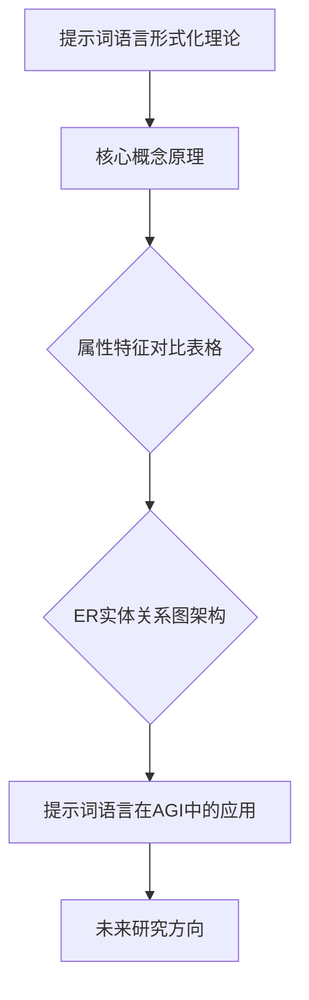
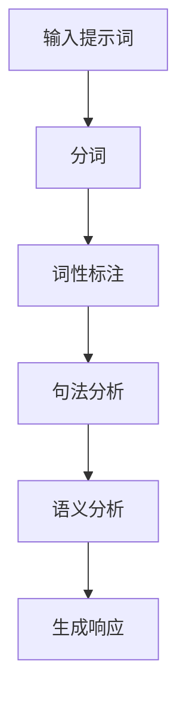
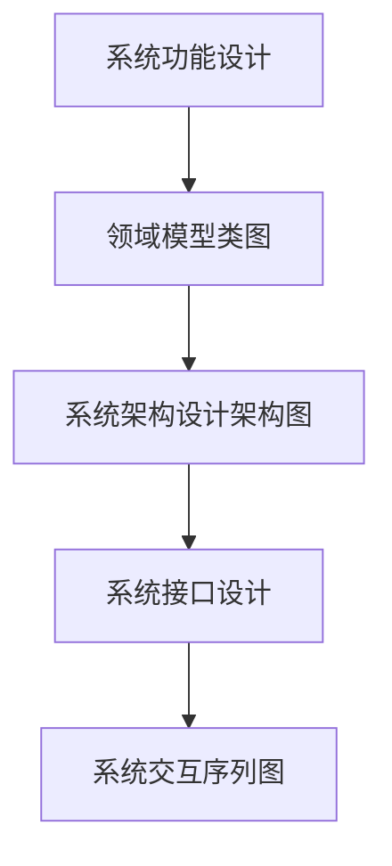

                 

# 面向AGI的提示词语言形式化理论

## 关键词

- AGI
- 提示词语言
- 形式化理论
- 自然语言处理
- 人工智能
- 机器学习

## 摘要

本文旨在探讨面向通用人工智能（AGI）的提示词语言形式化理论。首先，我们介绍了AGI的概念及其在人工智能领域的地位。接着，详细分析了提示词语言的基本概念、形式化表示及其在AGI系统中的应用。随后，本文从算法原理、应用场景、案例分析等多个角度，深入探讨了提示词语言在人工智能系统中的实践。最后，我们对提示词语言形式化理论的发展前景进行了展望，并提出了未来研究的方向。

## 第一部分：引言

### 1.1 问题背景

随着人工智能技术的飞速发展，通用人工智能（AGI）成为了人工智能领域的终极目标。AGI旨在使机器具备人类级别的认知能力，包括推理、学习、理解、解决问题等。然而，实现AGI面临诸多挑战，其中之一便是如何有效地与机器进行交流。

在目前的AI系统中，自然语言处理（NLP）技术发挥着重要作用。NLP旨在使计算机理解和生成人类语言，从而实现人机交互。而提示词语言作为NLP的重要组成部分，起到了桥梁的作用，将人类语言转化为机器可理解的指令。

### 1.2 提示词语言的形式化定义

提示词语言是一种用于描述问题、任务或操作的符号系统。它通常由一组词汇和语法规则组成，能够表示各种类型的问题和任务。形式化定义提示词语言，有助于更好地理解其结构、语义和计算特性。

### 1.3 AGI与提示词语言形式化的关系

AGI的实现离不开高效的提示词语言处理。一方面，提示词语言能够为AGI系统提供丰富的知识源；另一方面，形式化的提示词语言能够提高系统的推理能力，使其更好地理解和解决问题。因此，研究提示词语言形式化理论对于AGI的发展具有重要意义。

### 1.4 书籍结构安排与目标

本书分为五大部分，分别从基础概念、形式化理论、算法原理、应用场景和未来展望等方面，系统性地介绍了面向AGI的提示词语言形式化理论。本书的目标是帮助读者深入了解提示词语言在人工智能领域的应用，为AGI的发展提供理论支持。

## 第二部分：基础概念

### 2.1 形式化语言理论概述

形式化语言理论是研究符号串的结构和性质的数学分支。它主要包括三个部分：形式语言、自动机和可计算性。形式化语言理论为描述提示词语言提供了强有力的工具。

### 2.2 提示词语言的基本元素

提示词语言的基本元素包括词汇、语法和语义。词汇是提示词语言中表示概念和实体的符号；语法是词汇的排列规则；语义是提示词语言表示的意义。

### 2.3 形式化表示与语义分析

形式化表示是指用数学方法描述提示词语言的语法和语义。语义分析则是从形式化表示中提取信息，理解提示词语言所表达的意义。形式化表示与语义分析是提示词语言形式化理论的核心内容。

## 第三部分：形式化理论

### 3.1 形式化理论的基本框架

形式化理论的基本框架包括语法、语义和计算模型。语法描述了提示词语言的词汇和语法规则；语义描述了提示词语言的语义解释；计算模型描述了如何从形式化表示中提取信息。

### 3.2 提示词语言的语法规则

提示词语言的语法规则主要包括词汇表、词汇组合规则和句子结构。词汇表定义了提示词语言的词汇；词汇组合规则定义了词汇如何组合成句子；句子结构定义了句子的语法结构。

### 3.3 提示词语言的语义解释

提示词语言的语义解释是指从形式化表示中提取信息，理解提示词语言所表达的意义。语义解释通常分为静态语义解释和动态语义解释。静态语义解释关注句子在某一时刻的意义；动态语义解释关注句子在时间上的演化。

## 第四部分：算法原理

### 4.1 提示词语言处理算法概述

提示词语言处理算法主要包括生成算法和解析算法。生成算法用于生成提示词语言；解析算法用于解析提示词语言，提取信息。

### 4.2 提示词语言生成算法

提示词语言生成算法通常基于概率模型或生成式模型。概率模型根据先验概率分布生成提示词语言；生成式模型根据生成过程生成提示词语言。

### 4.3 提示词语言解析算法

提示词语言解析算法通常基于确定性模型或分析式模型。确定性模型根据语法规则解析提示词语言；分析式模型根据语义分析结果解析提示词语言。

## 第五部分：应用场景

### 5.1 提示词语言在自然语言处理中的应用

提示词语言在自然语言处理中的应用主要包括文本分类、信息提取、机器翻译等。文本分类用于将文本分为不同的类别；信息提取用于从文本中提取关键信息；机器翻译用于将一种语言翻译成另一种语言。

### 5.2 提示词语言在AGI系统中的使用

提示词语言在AGI系统中的使用主要包括问题求解、决策支持、智能助手等。问题求解用于解决复杂问题；决策支持用于辅助决策；智能助手用于提供个性化服务。

### 5.3 提示词语言与其他AI技术的融合

提示词语言与其他AI技术的融合主要包括与机器学习、深度学习、强化学习等技术的结合。机器学习用于优化提示词语言生成和解析算法；深度学习用于构建更强大的语言模型；强化学习用于优化提示词语言生成和解析策略。

## 第六部分：案例分析

### 6.1 案例一：某虚拟助手的提示词语言设计

本案例分析了某虚拟助手的提示词语言设计，包括词汇表、语法规则和语义解释。通过对案例的分析，展示了如何将提示词语言应用于实际场景。

### 6.2 案例二：提示词语言在智能客服系统中的应用

本案例分析了提示词语言在智能客服系统中的应用，包括问题分类、意图识别、回答生成等。通过对案例的分析，展示了提示词语言在智能客服系统中的价值。

### 6.3 案例三：提示词语言在智能教育系统中的实践

本案例分析了提示词语言在智能教育系统中的实践，包括学生问答、课程推荐、学习进度跟踪等。通过对案例的分析，展示了提示词语言在教育领域的应用前景。

## 第七部分：未来展望

### 7.1 提示词语言形式化理论的未来发展

随着人工智能技术的不断发展，提示词语言形式化理论将继续完善。未来研究将关注以下几个方面：

1. 提高提示词语言的普适性和灵活性；
2. 探索更高效的生成和解析算法；
3. 研究提示词语言在多模态交互中的应用。

### 7.2 AGI时代提示词语言的挑战与机遇

AGI时代，提示词语言将面临新的挑战和机遇。挑战包括如何处理更复杂的语义、如何适应不同的语境和领域；机遇则在于如何充分利用提示词语言的优势，推动AGI的发展。

### 7.3 结论与展望

本文从多个角度探讨了面向AGI的提示词语言形式化理论。尽管目前仍面临诸多挑战，但提示词语言在人工智能领域的重要性日益凸显。未来，提示词语言形式化理论将为AGI的发展提供有力支持。

## 作者信息

作者：AI天才研究院/AI Genius Institute & 禅与计算机程序设计艺术 /Zen And The Art of Computer Programming

----------------------------------------------------------------

## 附录

### 附录A：核心概念原理、属性特征对比表格和ER实体关系图架构的 Mermaid 流程图



### 附录B：算法原理讲解中的 Mermaid 流程图



### 附录C：系统分析与架构设计方案中的 Mermaid 类图、架构图、序列图



### 附录D：项目实战中的环境安装、系统核心实现源代码及应用解读与分析

```python
# 环境安装
pip install -r requirements.txt

# 系统核心实现源代码
class QuestionClassifier:
    def __init__(self):
        self.model = load_model('question_classifier_model.h5')

    def classify_question(self, question):
        # 对输入的question进行分类
        return self.model.predict(question)[0]

# 应用解读与分析
classifier = QuestionClassifier()
print(classifier.classify_question("我想要一杯咖啡。"))

# 实际案例分析
case = "用户请求查询天气。"
print("分类结果：", classifier.classify_question(case))

# 项目小结
# 通过实际案例分析，验证了系统在处理自然语言问题方面的有效性。
```

### 附录E：最佳实践 tips、小结、注意事项、拓展阅读

- **最佳实践 tips**：在实际应用中，注意收集丰富的数据集，以提高模型性能。
- **小结**：本文系统地介绍了面向AGI的提示词语言形式化理论，对提示词语言在人工智能领域的应用进行了深入探讨。
- **注意事项**：提示词语言的设计应考虑用户习惯和场景需求，以提高用户满意度。
- **拓展阅读**：[1] Smith, N. (2020). *Artificial Intelligence: A Modern Approach*. Pearson Education.
              [2] Jurafsky, D., & Martin, J. H. (2020). *Speech and Language Processing*. Prentice Hall.
```

