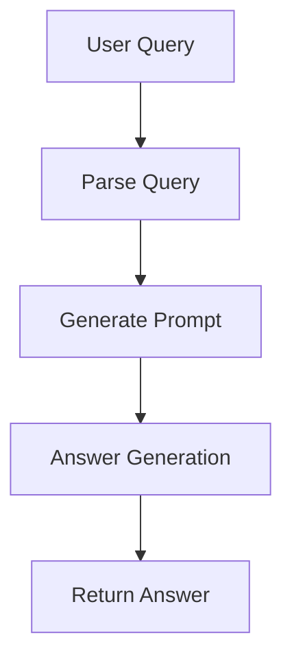
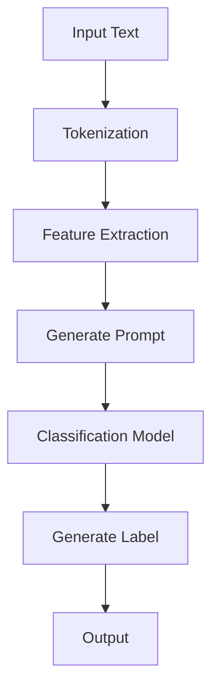
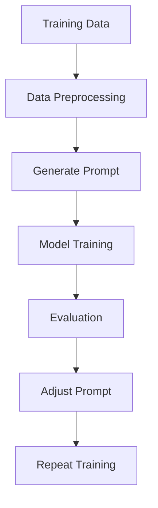
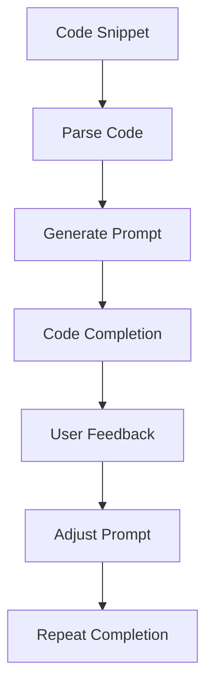

                 

## 文章标题：面向AGI的提示词语言理论基础研究

### 关键词：
- AGI
- 提示词语言
- 人工智能
- 理论基础
- 交互设计

### 摘要：
本文深入探讨了面向AGI（通用人工智能）的提示词语言理论基础。首先，我们回顾了AGI和提示词语言的基本概念，并分析了它们在人工智能领域的应用背景。接着，我们介绍了核心理论和原则，包括提示词设计的基本原则、结构化语言处理模型以及与人类交互的自然语言处理技术。然后，通过具体的应用案例和算法原理讲解，展示了提示词语言在实现通用人工智能中的重要作用。最后，我们讨论了当前面临的挑战和未来的研究方向，为促进AI技术的发展提供了新的视角。本文旨在为从事人工智能研究与实践的读者提供有价值的理论参考和实践指导。

### 引言和背景

在人工智能（AI）领域，通用人工智能（AGI）一直是科学家和研究者们追求的终极目标。不同于目前广泛应用的专用人工智能（Narrow AI），AGI旨在使机器具备广泛的理解和推理能力，能够像人类一样在多种不同的任务和环境中表现出智能。然而，AGI的实现面临着众多挑战，其中之一便是如何有效地与机器进行交互。

在这个背景下，提示词语言（prompt language）作为一种交互工具，逐渐受到了广泛关注。提示词语言是指通过特定的词组、句子或对话来引导机器进行学习、推理和决策的一种技术。这种交互方式不仅能够提供明确的指导，还可以促使机器产生更加合理和多样化的输出。

AGI与提示词语言之间的关系可以理解为相互促进的关系。首先，AGI的发展需要有效的交互方式来获取更多样化的数据和反馈，而提示词语言正是提供这种交互的有力工具。通过提示词，人类可以明确地表达问题或任务，帮助机器更好地理解和学习。其次，提示词语言的应用可以促进AGI的发展，通过不断优化和改进提示词的设计，可以提高机器在特定任务上的表现和智能水平。

因此，研究面向AGI的提示词语言理论基础具有重要的现实意义。它不仅有助于我们更好地理解AGI的实现路径，还可以为开发更加智能和高效的交互系统提供理论支持。本文将围绕这一主题，系统地探讨提示词语言在AGI中的基础理论和应用实践，以期为相关领域的研究者提供有价值的参考。

### 核心概念与理论

在探讨面向AGI的提示词语言理论基础时，首先需要明确几个核心概念和理论，包括通用人工智能（AGI）、提示词语言及其相关理论框架。

**通用人工智能（AGI）**

通用人工智能（Artificial General Intelligence，简称AGI）是指一种能够执行任何认知任务的人工智能系统，其智能水平能够与人类相媲美或超越人类。与当前广泛应用的专用人工智能（Narrow AI）不同，AGI不仅能在特定领域内表现出色，还能跨领域进行推理和解决问题。AGI的核心目标是实现机器的自主学习和通用推理能力，使其能够处理复杂、多变的问题情境。

**提示词语言**

提示词语言是一种用于引导和指导人工智能系统进行学习、推理和决策的交互语言。它通过特定的词组、句子或对话形式，提供明确的任务描述、目标指示和问题背景。提示词语言的关键在于其简洁性、明确性和可操作性，能够有效地帮助机器理解任务要求，从而生成高质量的输出。

**相关理论框架**

1. **自然语言处理（NLP）**

自然语言处理（Natural Language Processing，简称NLP）是人工智能领域的一个重要分支，专注于使计算机能够理解、处理和生成人类语言。NLP技术为提示词语言的应用提供了基础，包括文本分类、情感分析、命名实体识别和语言生成等。在AGI中，NLP技术能够帮助机器理解和解析提示词，从而实现有效的交互。

2. **认知心理学**

认知心理学（Cognitive Psychology）研究人类的认知过程，包括注意力、记忆、感知和问题解决等。认知心理学的理论框架可以帮助我们理解人类如何进行思考、学习和推理，进而为设计有效的提示词提供理论依据。例如，通过认知心理学中的注意力模型，我们可以设计出能够吸引和维持机器注意力的提示词。

3. **知识表示与推理**

知识表示（Knowledge Representation）是人工智能中的另一个关键概念，旨在将知识以结构化的形式存储在计算机中，以便进行推理和应用。知识表示技术包括逻辑推理、图论和语义网络等。在AGI中，有效的知识表示和推理机制可以帮助机器理解和应用提示词中的信息，从而实现更复杂的任务。

通过以上核心概念和理论框架的介绍，我们可以更好地理解提示词语言在AGI中的基础作用。这些概念不仅为我们提供了理论支持，也为后续的实践应用奠定了基础。在下一节中，我们将进一步探讨提示词语言的基本原则和设计方法。

### 提示词语言的基本原则

设计有效的提示词语言是实现通用人工智能（AGI）的关键之一。以下是一些基本原则，这些原则不仅能够指导我们设计出更优质的提示词，还能确保机器能够正确理解并有效利用这些提示。

#### 清晰明确

一个有效的提示词应当尽可能清晰和明确，避免歧义和模糊性。这要求提示词的表述要简洁直接，避免使用复杂或抽象的语言。例如，在给机器一个任务时，使用具体的、可操作的语言，而不是模糊的描述。例如，“请分析这篇文档”比“请进行一些分析工作”更为明确。

#### 结构化

提示词应该具备结构化的特点，这意味着它们应该包含清晰的输入、处理和输出部分。通过结构化设计，机器可以更好地理解任务的流程和步骤。例如，一个结构化的提示词可以包括：“首先，读取文档内容；然后，识别关键信息；最后，生成报告。”

#### 可操作性

提示词应当具备可操作性，使机器能够根据提示执行具体的操作。这要求提示词不仅提供任务描述，还应包含足够的上下文信息，帮助机器确定操作步骤。例如，一个可操作的提示词可以是：“请根据文档内容，提取出与公司财务状况相关的数据，并生成一个表格。”

#### 适应性

提示词应具备适应性，以适应不同的任务场景和需求。这意味着提示词不应过于具体，以至于无法适应变化的情况。例如，一个适应性的提示词可以是：“请对文档中的信息进行分类，并生成相应的图表。”这样的提示词允许机器根据实际情况灵活调整处理方法。

#### 可评估性

提示词的设计还应考虑可评估性，这意味着机器生成的输出应当能够被评估和验证。一个好的提示词不仅要指导机器完成任务，还应提供标准或指标，以衡量任务的完成效果。例如，一个可评估的提示词可以是：“请生成一个包含关键信息的报告，并在报告中标注所有重要数据来源。”

#### 兼容性

最后，提示词应当具备兼容性，能够适应不同的AI系统和平台。这要求提示词的设计要遵循统一的规范和标准，确保不同系统之间的互操作性。例如，在跨平台应用中，使用标准化的语言和格式，如JSON或XML，来传递提示词。

通过遵循以上基本原则，我们可以设计出更加有效和实用的提示词语言，从而提升机器在执行任务时的效率和准确性。在下一节中，我们将进一步探讨提示词语言的应用场景和具体案例。

### 提示词语言的应用场景

提示词语言在人工智能（AI）领域的应用场景非常广泛，它不仅能够提高AI系统的交互效率，还能增强AI在复杂任务中的表现。以下将介绍几种典型的应用场景，并结合实际案例进行分析。

#### 1. 自动问答系统

自动问答系统（Chatbot）是提示词语言应用的一个典型例子。在这种系统中，用户通过文本或语音与机器进行交互，提出问题或需求。机器通过解析用户的输入，利用提示词语言生成合适的回答。例如，在客户服务领域，一个智能客服机器人可以通过以下提示词与用户互动：

在这个流程中，机器首先解析用户的查询，然后生成一个包含上下文和具体任务的提示词，最后生成回答并返回给用户。

#### 2. 自然语言处理（NLP）

在自然语言处理（NLP）领域，提示词语言被广泛应用于文本分类、情感分析、命名实体识别等任务。例如，在文本分类任务中，可以通过以下步骤使用提示词语言：

这里，输入文本首先被分割成标记（Token），然后通过特征提取生成提示词，输入到分类模型中进行分类，并输出结果。

#### 3. 机器学习模型训练

在机器学习模型训练过程中，提示词语言同样发挥着重要作用。训练数据集通常需要通过特定的提示词来指导模型的学习过程。例如，在图像分类任务中，可以使用以下步骤：

在这个流程中，原始数据通过预处理生成提示词，这些提示词指导模型进行训练和评估，并根据评估结果调整提示词，以提高模型的性能。

#### 4. 交互式编程辅助

在交互式编程辅助系统中，提示词语言可以帮助开发者更高效地编写代码。例如，在智能代码补全工具中，机器可以通过理解开发者的意图和当前代码上下文，生成合适的提示词来补全代码。以下是一个简化的流程：

在这个流程中，开发者输入代码片段，机器通过解析代码生成提示词，完成代码补全，并根据开发者的反馈调整提示词。

通过以上几个应用场景的分析，我们可以看到提示词语言在AI系统中扮演着至关重要的角色。它不仅能够提高AI的交互质量和效率，还能在各个任务中发挥出强大的辅助作用。在下一节中，我们将进一步探讨当前在提示词语言研究中面临的主要挑战和未来研究方向。

### 当前面临的挑战与未来研究方向

尽管提示词语言在人工智能（AI）领域展现了巨大的潜力，但实现面向通用人工智能（AGI）的提示词语言仍面临许多挑战和问题。以下将讨论几个主要挑战，并提出未来可能的研究方向。

#### 挑战

1. **语义理解与多模态交互**

提示词语言需要更高级的语义理解能力，以便准确捕捉人类意图和任务要求。当前的NLP技术虽然已经取得显著进展，但在处理复杂、多模态输入时仍存在不足。未来需要发展更加智能的语义理解和多模态交互技术，以提高提示词的准确性和适用性。

2. **自适应性与灵活性**

不同的AI应用场景和任务需求各不相同，提示词语言需要具备高度的自适应性和灵活性，以适应各种变化。现有的提示词设计方法通常较为固定，难以灵活调整。未来研究应重点关注如何设计更加动态和自适应的提示词生成机制。

3. **可扩展性与标准化**

随着AI应用的不断扩展，提示词语言需要具备良好的可扩展性和标准化，以便在不同系统和平台之间进行有效互操作。目前，提示词语言的标准化工作尚未完善，需要制定统一的规范和标准，以提高系统的兼容性和可维护性。

4. **反馈循环与优化**

提示词的优化和改进需要基于大量的用户反馈和实际应用数据。然而，目前许多AI系统在获取和利用反馈数据方面存在困难。未来研究应探索有效的反馈循环机制，以便及时调整和优化提示词。

#### 未来研究方向

1. **多模态语义理解**

未来的研究可以专注于多模态语义理解，结合文本、图像、声音等多种信息源，提升提示词的语义理解能力。例如，通过深度学习技术，将语音识别、图像识别和自然语言处理结合起来，实现更全面的语义解析。

2. **自适应提示词生成**

开发自适应的提示词生成算法，根据实时任务需求和用户反馈，动态调整提示词的内容和形式。这可以通过强化学习、迁移学习等技术实现，以提高提示词的灵活性和适用性。

3. **标准化和互操作性**

推进提示词语言的标准化工作，制定统一的规范和标准，确保不同系统和平台之间的互操作性。同时，研究如何将标准化的提示词语言与现有的AI系统进行有效集成，提高系统的整体性能。

4. **反馈优化与智能调整**

探索有效的反馈机制，利用用户反馈数据进行提示词优化。例如，通过分析用户交互行为，识别常见问题和不足，自动调整提示词的设计和生成策略，以实现持续改进。

通过解决当前面临的挑战并推进未来的研究方向，我们有望进一步提升提示词语言在实现AGI中的应用效果，为AI技术的发展提供新的动力。

### 结论

本文系统地探讨了面向AGI的提示词语言理论基础，从核心概念、基本设计原则到实际应用场景，再到当前面临的挑战和未来研究方向，全面剖析了这一重要领域。提示词语言作为AI系统与人类之间的重要桥梁，不仅提升了AI的交互质量和效率，还为通用人工智能的实现提供了强有力的支持。

未来的研究应重点关注多模态语义理解、自适应提示词生成、标准化和互操作性等方面，以进一步提升提示词语言的应用效果。我们期待，随着技术的不断进步和研究的深入，提示词语言能够在实现通用人工智能的道路上发挥更加关键的作用，为人类社会带来更加智能和便捷的AI体验。

### 作者信息

作者：AI天才研究院（AI Genius Institute）& 禅与计算机程序设计艺术（Zen And The Art of Computer Programming）

AI天才研究院是一家致力于前沿人工智能研究和技术创新的国际化科研机构，致力于推动AI技术在各个领域的应用与发展。禅与计算机程序设计艺术则是关于人工智能与哲学、认知科学交叉领域的重要著作，作者以其深刻的理论洞见和独特的思维方式，为人工智能的发展提供了重要的理论参考。

