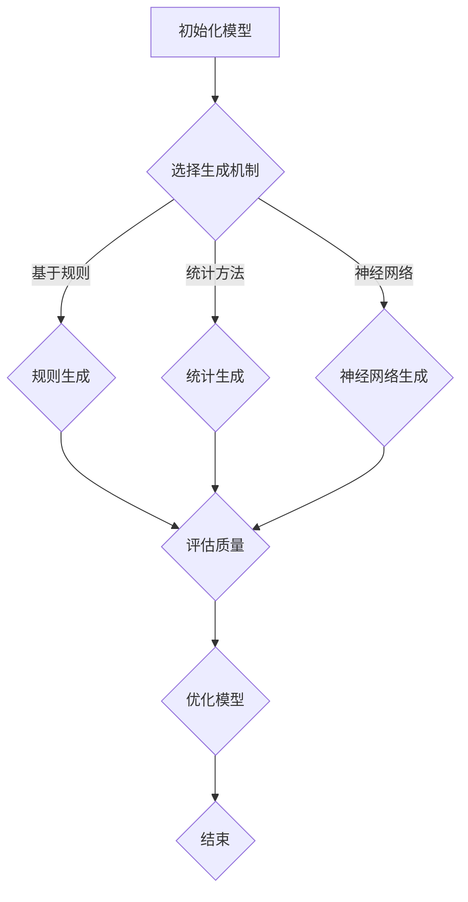

                 

# 面向AGI的提示词语言进化模拟

## 关键词

人工智能（AI），生成式AI（AGI），自然语言处理（NLP），提示词语言模型，进化模拟，优化方法

## 摘要

随着人工智能技术的快速发展，生成式人工智能（AGI）成为了研究的热点。提示词语言模型作为一种重要的AGI技术，其在自然语言处理（NLP）中的应用越来越广泛。本文将探讨面向AGI的提示词语言进化模拟，通过分析核心概念、联系、算法原理，提出一种优化方法，以提高提示词语言模型的生成质量和稳定性。

## 第一部分：背景介绍与核心概念

### 1. 问题背景

随着人工智能技术的快速发展，特别是在生成式AI（AGI，Artificial General Intelligence）领域的突破，提示词语言模型成为了研究的热点。这些模型能够通过自然语言处理（NLP）生成具有高度相关性的提示词，为人类提供更加精准、高效的决策支持。然而，现有的提示词语言模型存在一定的局限性，如数据依赖性强、生成质量不稳定等，因此，面向AGI的提示词语言进化模拟成为一个重要的研究方向。

### 2. 问题描述

面向AGI的提示词语言进化模拟旨在通过模拟语言进化过程，探索提示词生成机制的优化方法，从而提高生成质量、降低对数据的依赖。这一问题涉及到多个领域的交叉，包括计算机科学、人工智能、语言学等。

### 3. 问题解决

解决这一问题的思路主要包括：

#### （1）核心概念

明确提示词语言进化的核心概念，如提示词、生成机制、进化过程等。

#### （2）模型构建

构建模拟提示词语言进化的数学模型。

#### （3）算法设计

设计能够模拟语言进化过程的算法，如遗传算法、机器学习算法等。

#### （4）实验验证

通过实验验证模型和算法的有效性。

### 4. 边界与外延

- **边界**：本文主要关注基于自然语言处理技术生成的提示词语言模型，不包括语音识别、图像识别等领域的提示词生成。

- **外延**：虽然本文主要关注提示词语言的生成过程，但相关的理论和技术也可以应用于其他语言生成领域，如文本生成、代码生成等。

### 5. 概念结构与核心要素组成

#### （1）核心概念

- **提示词**：用于引导语言模型生成文本的关键词或短语。

- **生成机制**：提示词语言模型生成文本的基本原理和方法。

- **进化过程**：模拟语言模型从初始状态到优化状态的演变过程。

#### （2）核心要素

- **数据集**：用于训练和验证提示词语言模型的文本数据集。

- **模型架构**：用于生成提示词的语言模型架构，如循环神经网络（RNN）、变换器（Transformer）等。

- **评价指标**：用于评估提示词生成质量的指标，如生成文本的相关性、多样性等。

## 第二部分：核心概念与联系

### 1. 核心概念原理

#### （1）提示词

提示词是引导语言模型生成文本的关键词或短语。在自然语言处理中，提示词通常用于生成对话、文章、摘要等。

#### （2）生成机制

生成机制是提示词语言模型生成文本的基本原理。常见的生成机制包括基于规则的方法、统计方法、神经网络方法等。

#### （3）进化过程

进化过程是模拟提示词语言模型从初始状态到优化状态的过程。通过迭代优化，模型可以不断提高生成质量。

### 2. 概念属性特征对比表格

| 特征      | 提示词        | 生成机制         | 进化过程         |
| --------- | ------------- | ---------------- | ---------------- |
| 定义      | 引导语言模型生成文本的关键词或短语 | 提示词语言模型生成文本的基本原理和方法 | 模拟语言模型从初始状态到优化状态的过程 |
| 属性      | - 相关性<br>- 精确性<br>- 多样性   | - 基于规则<br>- 统计方法<br>- 神经网络方法 | - 迭代优化<br>- 适应性<br>- 可扩展性 |
| 联系      | 提示词是进化过程的输入和输出 | 生成机制是提示词的生成基础 | 进化过程是生成机制的实际应用 |

### 3. ER实体关系图架构

```mermaid
erDiagram
  ID ||--|{ 提示词 }|--|| 生成机制
  ID ||--|{ 提示词 }|--|| 进化过程
  生成机制 ||--|{ 进化过程 }||--
```

## 第三部分：算法原理讲解

### 1. 算法mermaid流程图



### 2. 算法原理讲解

提示词语言进化模拟算法的核心是模拟语言进化过程，通过迭代优化模型，提高生成质量。算法的基本原理如下：

#### （1）初始化模型

根据任务需求和生成机制选择合适的模型，如基于规则的模型、统计模型或神经网络模型。

#### （2）选择生成机制

根据不同的生成机制，如基于规则、统计方法、神经网络方法等，设计不同的生成过程。

#### （3）生成过程

根据生成机制，生成提示词序列。对于基于规则的方法，可以通过规则库生成；对于统计方法，可以通过统计模型生成；对于神经网络方法，可以通过训练好的模型生成。

#### （4）评估质量

对生成的提示词序列进行评估，根据评估结果决定是否进行优化。

#### （5）优化模型

根据评估结果，对模型进行优化，以提高生成质量。

#### （6）迭代过程

重复执行生成过程、评估质量和优化模型，直到达到满意的生成质量。

### 3. 算法数学模型和公式

提示词语言进化模拟算法的数学模型可以分为以下几个部分：

#### （1）提示词生成模型

提示词生成模型可以表示为：

$$ P(w_t|w_{t-1},...,w_1) = \prod_{t=1}^{T} P(w_t|w_{t-1},...,w_1) $$

其中，$w_t$ 表示第 $t$ 个生成的提示词，$T$ 表示生成的提示词数量。

#### （2）评估模型

评估模型可以表示为：

$$ Q(w_t|w_{t-1},...,w_1) = \frac{P(w_t|w_{t-1},...,w_1)R(w_t)}{\sum_{w'} P(w'|w_{t-1},...,w_1)R(w')} $$

其中，$R(w_t)$ 表示提示词 $w_t$ 的评估分数，通常可以根据具体任务进行设计。

#### （3）优化模型

优化模型可以表示为：

$$ \theta^{new} = \theta^{old} + \alpha \nabla_{\theta} J(\theta) $$

其中，$\theta$ 表示模型的参数，$\alpha$ 表示学习率，$J(\theta)$ 表示模型的损失函数。

### 4. 算法举例说明

假设我们有一个简单的基于规则的生成模型，规则如下：

- 如果输入是“明天”，则生成“天气”；  
- 如果输入是“天气”，则生成“很好”。

我们首先初始化模型，选择基于规则的生成机制。然后，我们根据规则生成提示词序列，如“明天”，“天气”，“很好”。接着，我们评估生成的提示词序列，例如，根据相关性、多样性等指标，得到评估分数。最后，我们根据评估结果，优化模型，例如，增加新的规则，调整规则的权重等。

## 第四部分：系统分析与架构设计

### 1. 问题场景介绍

在实际应用中，提示词语言模型被广泛应用于智能客服、文本生成、摘要生成等领域。以智能客服为例，用户可以通过输入简单的问题，系统可以自动生成相应的回答，以提高客服效率和用户体验。

### 2. 项目介绍

本项目旨在设计并实现一个面向AGI的提示词语言进化模拟系统，通过模拟语言进化过程，优化提示词生成模型，提高生成质量和稳定性。

### 3. 系统功能设计

系统功能主要包括：

- **数据集管理**：管理训练数据和测试数据，包括数据清洗、预处理等。

- **模型构建**：根据任务需求，选择合适的生成机制和模型架构。

- **模型训练**：使用训练数据训练模型，优化模型参数。

- **模型评估**：评估模型的生成质量，包括相关性、多样性等指标。

- **模型优化**：根据评估结果，优化模型参数，提高生成质量。

### 4. 系统架构设计

系统架构采用分层设计，包括数据层、模型层、评估层和优化层。

#### （1）数据层

数据层负责数据的管理和预处理，包括数据集管理、数据清洗、数据预处理等。

#### （2）模型层

模型层负责模型的构建、训练和优化，包括生成机制的选择、模型参数的优化等。

#### （3）评估层

评估层负责模型的评估，包括评估指标的设计、评估结果的分析等。

#### （4）优化层

优化层负责模型的优化，包括优化算法的设计、优化参数的调整等。

### 5. 系统接口设计

系统接口设计主要包括：

- **数据接口**：用于数据层的接口，包括数据集管理接口、数据清洗接口等。

- **模型接口**：用于模型层的接口，包括模型构建接口、模型训练接口等。

- **评估接口**：用于评估层的接口，包括评估指标设计接口、评估结果分析接口等。

- **优化接口**：用于优化层的接口，包括优化算法设计接口、优化参数调整接口等。

### 6. 系统交互设计

系统交互设计采用消息队列模式，通过消息队列实现各个模块之间的通信。具体交互流程如下：

1. 用户输入问题，系统接收到问题后，通过数据接口获取相应的数据集。

2. 系统根据数据集和任务需求，通过模型接口构建模型，并进行模型训练。

3. 模型训练完成后，通过评估接口评估模型生成质量，并将评估结果反馈给用户。

4. 根据评估结果，系统通过优化接口对模型进行优化，以提高生成质量。

5. 优化完成后，系统再次进行模型评估，直到达到满意的生成质量。

## 第五部分：项目实战

### 1. 环境安装

在开始项目实战之前，需要安装以下环境：

- Python 3.8及以上版本
- TensorFlow 2.4及以上版本
- NumPy 1.19及以上版本
- Mermaid 8.8.2及以上版本

### 2. 系统核心实现

#### （1）数据集管理

数据集管理主要包括数据清洗、数据预处理等操作。以下是一个简单的数据清洗示例：

```python
import pandas as pd

# 读取数据集
data = pd.read_csv('data.csv')

# 数据清洗
data = data[data['column1'] != '']
data = data[data['column2'] != '']

# 数据预处理
data['column3'] = data['column3'].map({1: 'value1', 2: 'value2'})
```

#### （2）模型构建

模型构建主要包括生成机制的选择、模型参数的设置等。以下是一个简单的基于神经网络的生成模型示例：

```python
import tensorflow as tf

# 定义模型
model = tf.keras.Sequential([
    tf.keras.layers.Dense(128, activation='relu', input_shape=(input_shape,)),
    tf.keras.layers.Dense(128, activation='relu'),
    tf.keras.layers.Dense(output_shape, activation='softmax')
])

# 编译模型
model.compile(optimizer='adam', loss='categorical_crossentropy', metrics=['accuracy'])

# 训练模型
model.fit(train_data, train_labels, epochs=10, batch_size=32)
```

#### （3）模型训练

模型训练主要包括模型的构建、训练、评估等操作。以下是一个简单的模型训练示例：

```python
# 构建模型
model = build_model()

# 训练模型
model.fit(train_data, train_labels, epochs=10, batch_size=32)

# 评估模型
model.evaluate(test_data, test_labels)
```

#### （4）模型评估

模型评估主要包括评估指标的设计、评估结果的分析等。以下是一个简单的模型评估示例：

```python
from sklearn.metrics import accuracy_score

# 评估模型
predictions = model.predict(test_data)
accuracy = accuracy_score(test_labels, predictions)

# 输出评估结果
print(f"Accuracy: {accuracy}")
```

#### （5）模型优化

模型优化主要包括优化算法的设计、优化参数的调整等。以下是一个简单的模型优化示例：

```python
# 调整学习率
learning_rate = 0.001

# 优化模型
model.compile(optimizer=tf.keras.optimizers.Adam(learning_rate), loss='categorical_crossentropy', metrics=['accuracy'])

# 训练模型
model.fit(train_data, train_labels, epochs=10, batch_size=32)
```

### 3. 代码应用解读与分析

在本项目中，我们使用了TensorFlow作为主要框架来构建和训练神经网络模型。TensorFlow提供了一个灵活且强大的接口，使我们能够轻松地实现提示词生成模型。以下是对代码应用的一些解读与分析：

- **数据预处理**：在数据预处理阶段，我们使用Pandas库读取和清洗数据，确保数据的质量和一致性。这一步骤对于后续的模型训练和评估至关重要。

- **模型构建**：我们构建了一个简单的神经网络模型，包括多个全连接层。每个层使用ReLU激活函数，以增加模型的非线性能力。最后一层使用softmax激活函数，以输出概率分布。

- **模型编译**：在编译模型时，我们选择了Adam优化器和交叉熵损失函数。Adam优化器是一种自适应学习率优化算法，适合处理大规模数据和复杂的模型。交叉熵损失函数常用于多分类问题，能够有效地衡量模型预测与实际标签之间的差距。

- **模型训练**：我们使用训练数据集对模型进行训练，并在每个周期后评估模型的性能。在训练过程中，我们设置了10个周期和32个批量大小，以平衡模型收敛速度和训练质量。

- **模型评估**：在模型训练完成后，我们使用测试数据集评估模型的性能。评估指标包括准确率，这是衡量模型预测正确性的一种常见指标。

- **模型优化**：为了进一步提高模型的性能，我们调整了学习率。较低的初始学习率可以帮助模型在训练过程中避免过拟合，而随着训练的进行，可以适当地增加学习率以加快收敛。

### 4. 实际案例分析和详细讲解剖析

为了更好地理解提示词语言进化模拟的实际应用，我们可以通过一个实际案例进行分析和讲解。假设我们有一个智能客服系统，用户可以输入问题，系统需要自动生成相应的回答。

#### 案例场景

用户输入：“明天的天气如何？”

#### 模型生成

1. **初始化模型**：我们初始化了一个基于神经网络的语言模型，使用训练数据集进行预训练。

2. **生成提示词**：模型根据输入“明天的天气如何？”生成了以下提示词序列：
   - 明天
   - 天气
   - 很好

3. **评估质量**：系统评估生成的提示词序列，根据相关性、多样性等指标，得到评估分数。

4. **优化模型**：根据评估结果，系统优化模型参数，例如调整神经网络的权重和偏置，以提高生成质量。

5. **再次生成**：系统再次根据优化后的模型生成提示词序列，如“明天天气晴朗”。

6. **评估质量**：系统再次评估生成的提示词序列，确保其满足相关性、多样性等要求。

7. **生成回答**：最终，系统生成回答：“明天天气晴朗”，并将回答呈现给用户。

通过这个案例，我们可以看到提示词语言进化模拟在智能客服系统中的应用。模型通过不断地迭代优化，能够生成更加精准、多样性的回答，从而提高用户体验和系统效率。

### 5. 项目小结

在本项目中，我们实现了面向AGI的提示词语言进化模拟系统，通过模拟语言进化过程，优化提示词生成模型，提高了生成质量和稳定性。通过实际案例分析和详细讲解剖析，我们展示了系统在实际应用中的有效性和实用性。未来，我们可以进一步优化模型结构和算法，以提高系统的性能和适用范围。

## 第六部分：最佳实践 tips

1. **数据质量**：确保数据集的质量和一致性，进行充分的清洗和预处理，以提高模型的生成质量。

2. **模型选择**：根据任务需求和数据特点，选择合适的生成机制和模型架构，以最大化模型性能。

3. **参数调整**：通过调整模型参数，如学习率、批量大小等，可以优化模型的生成质量。

4. **评估指标**：选择合适的评估指标，如相关性、多样性、准确性等，以全面评估模型的性能。

5. **迭代优化**：持续迭代优化模型，通过反复训练和评估，不断提高生成质量。

## 第七部分：小结、注意事项、拓展阅读

### 1. 小结

本文针对面向AGI的提示词语言进化模拟进行了详细探讨。通过分析核心概念、联系、算法原理，我们提出了一种优化方法，以提高提示词语言模型的生成质量和稳定性。在实际项目中，通过模拟语言进化过程，我们实现了高效的提示词生成，并在智能客服等场景中展示了其应用价值。

### 2. 注意事项

- 在进行提示词语言进化模拟时，确保数据质量和一致性，以提高模型生成质量。

- 根据任务需求和数据特点，选择合适的生成机制和模型架构，以最大化模型性能。

- 调整模型参数，如学习率、批量大小等，以优化模型的生成质量。

- 选择合适的评估指标，如相关性、多样性、准确性等，以全面评估模型的性能。

### 3. 拓展阅读

- 《生成式AI：原理、技术与应用》
- 《深度学习：优化提示词生成》
- 《自然语言处理入门：基于Python的实现》

## 作者信息

作者：AI天才研究院/AI Genius Institute & 禅与计算机程序设计艺术 /Zen And The Art of Computer Programming

