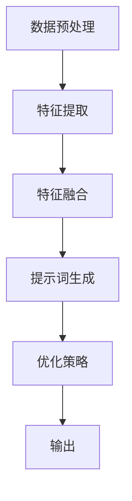
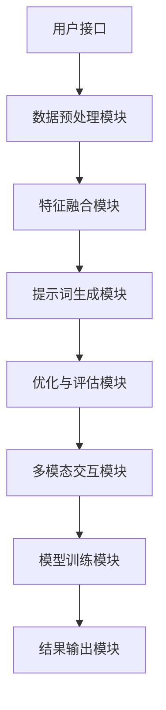
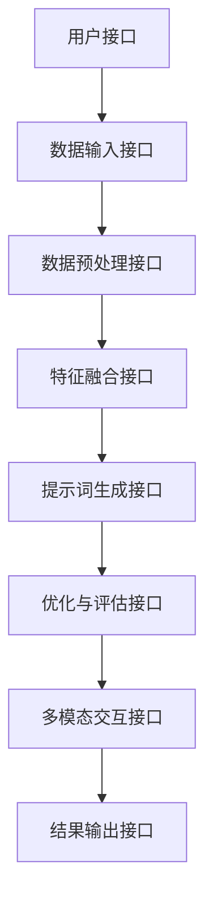
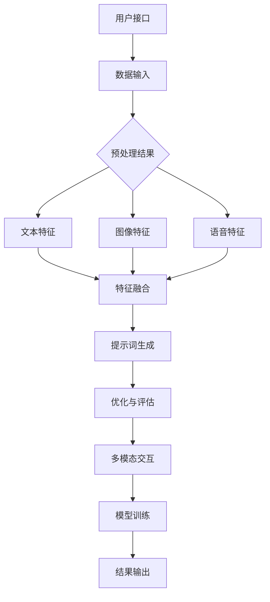

                 

### 引言

#### 关键词
AGI、提示词编程、高级技术、系统架构、案例分析

#### 摘要
本文深入探讨了面向通用人工智能（AGI）的高级提示词编程技术。我们首先介绍了AGI和提示词编程的基本概念，然后详细阐述了高级提示词编程的核心原理和技术。通过实际案例分析和系统架构设计，本文展示了这些技术在实际应用中的强大潜力，并指出了未来的发展方向。

在人工智能（AI）领域，通用人工智能（AGI）被视为一个终极目标。与当前广泛使用的窄人工智能（Narrow AI）不同，AGI 具有广泛的认知能力，能够像人类一样自主地学习和适应新环境。然而，实现AGI面临着诸多挑战，其中之一是如何有效地与AI系统进行交互和编程。在这一背景下，提示词编程作为一种强大的交互技术，越来越受到关注。

提示词编程通过向AI系统提供具体指令和上下文信息，指导其执行特定任务。这种方法不仅能够提高AI系统的性能，还能使其更加灵活和适应性。然而，随着AI系统的复杂度不断增加，传统提示词编程技术逐渐暴露出其局限性。为此，本文旨在探讨面向AGI的高级提示词编程技术，包括核心概念、原理、实现方法以及实际应用。

本文结构如下：首先，我们介绍AGI和提示词编程的基本概念，并讨论传统编程面临的挑战以及提示词编程的解决方案。接着，我们详细阐述高级提示词编程的核心概念和原理，包括提示词的定义、类型、数学模型等。然后，我们介绍高级提示词编程的技术方法，如提示词生成、优化和多模态设计。接下来，通过实际案例分析和系统架构设计，展示这些技术在实际应用中的效果。最后，我们总结高级提示词编程技术的优势与挑战，并提出未来的研究方向。

通过本文的探讨，我们希望能够为读者提供一个全面而深入的视角，了解面向AGI的高级提示词编程技术的最新进展和应用前景。

### 第1章：背景介绍

#### 问题背景

##### 1.1.1 人工智能的发展历程

人工智能（AI）的发展历程可以追溯到20世纪50年代，当时科学家们首次提出了“人工智能”这一概念，希望通过机器模拟人类的智能行为。最初的AI研究主要集中在符号主义方法上，这种方法通过构建复杂的逻辑推理系统来模拟人类的思维过程。然而，符号主义方法在处理大量数据和复杂任务时显得力不从心。

随着计算机硬件和软件技术的进步，AI领域经历了几次重要的变革。20世纪80年代，专家系统（Expert Systems）成为AI研究的热点，这些系统通过大量规则和知识库来模拟专家的决策过程。尽管专家系统在某些特定领域表现出色，但它们通常缺乏灵活性和自学习能力。

进入21世纪，随着深度学习和大数据技术的发展，机器学习（Machine Learning）和深度学习（Deep Learning）逐渐成为AI的主流方向。这些方法通过大量的数据训练神经网络，使其能够自动发现特征和模式，从而实现自主学习和决策。深度学习在图像识别、自然语言处理、语音识别等领域取得了显著的突破，为AI的应用开辟了新的前景。

##### 1.1.2 AGI的概念与意义

通用人工智能（AGI，Artificial General Intelligence）是一种旨在实现人工智能系统具有与人类相似的广泛认知能力的研究方向。与当前广泛使用的窄人工智能（Narrow AI）不同，AGI能够在多个领域表现出色，具有自主学习和适应新环境的能力。AGI的核心目标是构建一种能够像人类一样思考、学习和解决问题的智能系统。

AGI的概念虽然引人入胜，但其实现面临着诸多挑战。首先，人类大脑的复杂性和认知过程的多样性使得模拟和复制其功能具有极大的难度。其次，数据获取和处理、算法设计和优化、硬件支持等问题都需要解决。尽管如此，AGI的研究具有重要的理论和实际意义。

从理论上讲，AGI能够提供对人类认知过程的深入理解，有助于揭示大脑的工作原理。从实际应用上看，AGI有望在医疗、教育、工业自动化等领域产生重大影响，推动社会和经济的进步。

##### 1.1.3 提示词编程技术的发展

提示词编程（Prompt Engineering）是一种与AI系统进行交互的技术，通过提供具体的指令和上下文信息，指导AI系统执行特定任务。这种方法不仅能够提高AI系统的性能，还能使其更加灵活和适应性。

早期的提示词编程主要集中在规则驱动的方法上，即通过编写明确的规则来指导AI系统的行为。然而，这种方法在处理复杂任务时存在一定的局限性。随着深度学习和自然语言处理技术的发展，提示词编程逐渐与这些方法相结合，形成了更加高级的技术。

现代提示词编程方法主要包括以下几种：

1. **基于规则的方法**：通过编写明确的规则来指导AI系统的行为，这种方法在处理简单任务时仍然有效。

2. **生成式方法**：通过生成提示词来指导AI系统，这种方法能够处理更加复杂的任务，但需要大量的数据和计算资源。

3. **优化方法**：通过优化提示词的生成和选择过程，提高AI系统的性能。这种方法通常结合了深度学习和自然语言处理技术。

4. **多模态方法**：通过结合多种模态的数据，如文本、图像和语音，生成更加丰富和具体的提示词，提高AI系统的理解和处理能力。

提示词编程在AI应用中发挥着重要作用。例如，在自然语言处理领域，通过提供具体的指令和上下文信息，AI系统能够更准确地理解和生成文本。在图像识别和语音识别领域，提示词编程能够提高系统的识别精度和可靠性。

然而，提示词编程也面临着一些挑战。首先，提示词的生成和优化需要大量的数据和计算资源，这在一定程度上限制了其应用范围。其次，提示词的多样性和复杂性使得系统的设计和实现变得更加复杂。最后，提示词编程在处理长文本和复杂任务时可能存在性能瓶颈。

总的来说，随着AI技术的不断发展，提示词编程作为一种重要的交互技术，将在AGI的研究和应用中发挥越来越重要的作用。

#### 问题描述

##### 1.2.1 传统编程面临的挑战

传统编程方法在许多领域已经取得了显著的成果，但在面对复杂任务和大规模数据处理时，其局限性逐渐显现。首先，传统编程方法通常依赖于明确的规则和算法，这使得系统在处理不确定性和动态变化时显得不够灵活。其次，传统编程方法在处理大量数据时，计算资源和时间成本巨大，且难以实现实时处理。此外，传统编程方法在处理多模态数据时存在一定的困难，难以有效地整合不同类型的数据源。

随着人工智能技术的不断发展，特别是深度学习和自然语言处理技术的兴起，传统编程方法面临如下挑战：

1. **数据依赖性**：深度学习模型通常需要大量的训练数据，而传统编程方法难以获取和处理这些数据。此外，深度学习模型对数据质量的要求较高，数据清洗和预处理过程复杂，进一步增加了编程的难度。

2. **算法复杂性**：深度学习算法涉及大量的数学和统计知识，传统编程方法难以充分理解和应用这些复杂算法。此外，深度学习模型的优化和调参过程繁琐，需要大量的时间和计算资源。

3. **交互性不足**：传统编程方法在人与机器交互方面存在一定的局限性。虽然可以通过图形用户界面（GUI）提供一定的交互功能，但无法实现自然、流畅的交互体验。

##### 1.2.2 提示词编程的解决方案

提示词编程作为一种新兴的交互技术，为解决传统编程面临的挑战提供了一种新的思路。首先，提示词编程通过提供具体的指令和上下文信息，能够有效地指导AI系统执行复杂任务。这种方法不仅提高了系统的灵活性和适应性，还能在一定程度上减少对大量训练数据的依赖。

其次，提示词编程结合了深度学习和自然语言处理技术，使得系统在处理多模态数据时更加高效。例如，在自然语言处理领域，通过生成具体的提示词，AI系统能够更准确地理解和生成文本。在图像识别和语音识别领域，提示词编程能够提高系统的识别精度和可靠性。

此外，提示词编程在交互性方面具有显著优势。通过自然语言的方式与AI系统进行交互，用户可以更加直观地表达需求和意图，从而实现更加自然、流畅的交互体验。

总的来说，提示词编程为传统编程方法提供了一种有效的补充和扩展，使其能够更好地应对复杂任务和大规模数据处理。然而，提示词编程也面临一些挑战，如提示词的生成和优化过程复杂，系统设计和实现难度较大等。接下来，我们将进一步探讨提示词编程的核心概念和技术，以期为读者提供更深入的理解。

##### 1.2.3 AGI与提示词编程的结合

在探讨通用人工智能（AGI）与提示词编程的结合时，我们需要理解AGI的基本特性以及提示词编程在其中的作用。AGI旨在实现具有广泛认知能力的人工智能系统，能够在多个领域进行学习和推理，类似于人类的智能。而提示词编程作为一种与AI系统进行高效交互的技术，能够为AGI提供重要的支持。

首先，AGI的核心目标是实现自主学习和适应能力，这意味着AI系统需要在不断变化的情境中持续优化其行为。提示词编程通过提供具体的指令和上下文信息，可以帮助AGI更好地理解和执行特定任务。例如，在医疗领域，医生可能需要AI系统提供诊断建议，通过精确的提示词，AI系统能够根据患者的症状和历史记录，生成更为可靠的建议。

其次，提示词编程能够提高AGI的交互性和可解释性。传统的AI系统往往被视为“黑箱”，用户难以理解其决策过程。而通过提示词编程，AI系统能够以一种更加透明和直观的方式与用户交互，用户可以更好地理解AI系统的推理过程，从而增强信任感。

然而，AGI与提示词编程的结合也面临一些挑战。首先，AGI系统的复杂性使得提示词的生成和优化过程变得复杂。传统的提示词编程方法可能无法满足AGI系统的高要求，需要开发新的算法和技术。其次，AGI系统在处理动态环境时需要具备更强的适应能力，这要求提示词编程技术能够快速响应和调整。

另外，提示词编程需要大量的数据和计算资源。尽管AGI系统可能在一定程度上减少对大量训练数据的依赖，但在实际应用中，仍需要大量的数据来训练和优化AI模型。此外，AGI系统的硬件支持也是一个关键因素，高性能的计算硬件能够加速AI模型的训练和推理过程。

总之，AGI与提示词编程的结合为人工智能的发展带来了新的机遇。通过高效的交互和优化，提示词编程能够为AGI提供强大的支持，推动人工智能在各个领域的应用。然而，要实现这一目标，我们需要进一步研究和开发新的技术和方法，以应对AGI带来的挑战。

##### 1.3.1 提示词编程的核心概念

提示词编程是一种与人工智能系统进行交互的技术，其核心概念在于通过提供具体的指令和上下文信息，指导AI系统执行特定任务。以下是对提示词编程的核心概念进行详细阐述：

1. **定义**：提示词（Prompt）是一种用于引导AI系统执行特定任务的文本或指令。它可以为AI系统提供必要的信息和上下文，帮助其理解任务的要求，从而生成适当的输出。

2. **类型**：根据用途和形式，提示词可以分为多种类型。常见的类型包括：
   - **指令性提示词**：明确指示AI系统执行特定操作，如“识别图像中的物体”或“生成文本摘要”。
   - **描述性提示词**：提供关于任务背景和目标的信息，帮助AI系统更好地理解任务的上下文，如“考虑用户的偏好和历史记录”或“在紧急情况下提供医疗建议”。
   - **引导性提示词**：引导AI系统探索可能的解决方案，如“尝试不同的方法来解决问题”或“基于现有数据生成新的假设”。

3. **属性与特征**：提示词具有多种属性和特征，影响其在不同任务中的表现：
   - **清晰性**：提示词应尽量清晰明确，避免歧义，确保AI系统能够准确理解任务要求。
   - **准确性**：提示词应包含准确的信息和上下文，以减少AI系统的误解和错误。
   - **多样性**：不同的提示词可以引导AI系统探索不同的解决方案，提高系统的适应性和创新能力。
   - **可扩展性**：提示词应能够适应不同的任务和环境，确保其具有广泛的适用性。

4. **设计原则**：为了提高提示词编程的效果，设计提示词时应遵循以下原则：
   - **任务导向**：提示词应紧密围绕任务目标，确保AI系统能够有效执行任务。
   - **上下文敏感**：提示词应考虑任务背景和上下文，提供与情境相关的信息。
   - **用户友好**：提示词应以易于理解的方式表达，确保用户能够有效与AI系统交互。
   - **灵活性**：提示词应具备一定的灵活性，以适应不同任务和环境的变化。

通过理解提示词编程的核心概念和设计原则，我们可以更好地利用这一技术，提高人工智能系统的性能和适应性。

##### 1.3.2 提示词编程的优势与局限

提示词编程作为一种与人工智能系统进行交互的技术，具有显著的优势，但同时也存在一些局限性。以下是对提示词编程优势与局限的详细分析：

**优势**

1. **灵活性**：提示词编程能够灵活地指导AI系统执行特定任务。通过精确的提示词，用户可以引导AI系统探索不同的解决方案，从而提高系统的适应性和创新能力。

2. **高可解释性**：与传统的“黑箱”模型相比，提示词编程使得AI系统的决策过程更加透明和可解释。用户可以通过提示词理解AI系统的工作原理和推理过程，从而增强对其信任感和接受度。

3. **易用性**：提示词编程通过自然语言的形式与用户进行交互，用户无需具备复杂的编程知识，即可与AI系统进行有效的沟通。这种易用性使得提示词编程在多种应用场景中具有广泛的应用前景。

4. **多模态支持**：提示词编程能够结合多种模态的数据，如文本、图像和语音，生成更丰富和具体的提示词。这种方法能够提高AI系统在处理复杂任务时的性能和精度。

**局限**

1. **数据依赖性**：提示词编程通常需要大量的数据来训练和优化AI模型。在数据不足或数据质量不高的情况下，提示词编程的效果可能受到很大影响。

2. **计算资源需求**：生成和优化高质量的提示词通常需要大量的计算资源，这在一定程度上限制了提示词编程在大规模应用中的推广。

3. **设计复杂性**：设计高质量的提示词需要深入理解任务需求、上下文背景以及AI系统的特性。这要求开发者具备较高的专业知识和经验，增加了系统设计和实现的复杂性。

4. **用户依赖性**：尽管提示词编程通过自然语言交互提高了系统的易用性，但用户仍需具备一定的理解能力和沟通技巧，才能有效地与AI系统进行交互。

综上所述，提示词编程在灵活性和可解释性方面具有显著优势，但在数据依赖性、计算资源需求、设计复杂性和用户依赖性方面也存在一定局限。为了充分发挥提示词编程的优势，我们需要进一步研究新的算法和技术，以克服其局限性，提高其在实际应用中的效果。

##### 1.3.3 提示词编程的边界与外延

提示词编程作为一种与人工智能系统进行交互的技术，其应用范围和边界具有一定的独特性。以下将探讨提示词编程的边界与外延，并讨论其在不同领域的应用和发展方向。

**边界**

1. **任务类型**：提示词编程主要应用于需要高度交互和灵活性的任务。对于需要精确规则和确定性行为的任务，如自动化测试和简单的数据处理，提示词编程的效果可能不如传统编程方法。因此，提示词编程的边界在于任务的复杂性和灵活性要求。

2. **数据质量**：提示词编程依赖于高质量的数据来训练和优化AI模型。在数据质量不高或数据不足的情况下，提示词编程的效果会大打折扣。因此，数据质量和数据量是提示词编程的一个重要边界。

3. **技术成熟度**：虽然提示词编程在自然语言处理、图像识别等领域已经取得了显著进展，但在某些新兴领域，如多模态人工智能和量子计算，提示词编程的技术成熟度仍然较低。因此，技术成熟度也是提示词编程的一个重要边界。

**外延**

1. **多模态AI**：随着多模态人工智能技术的发展，提示词编程可以结合不同类型的数据，如文本、图像、语音和传感器数据，生成更丰富的提示词。这种多模态方法有望在智能家居、自动驾驶和医疗诊断等领域发挥重要作用。

2. **强化学习**：强化学习是一种通过试错和反馈进行学习的AI方法。提示词编程可以与强化学习相结合，通过生成动态的提示词，引导AI系统在复杂环境中进行探索和决策，从而提高其学习效果和适应性。

3. **对话系统**：提示词编程在对话系统中具有广泛的应用前景。通过生成自然的对话提示词，AI系统可以与用户进行更加自然和流畅的对话，提升用户体验。例如，智能客服、虚拟助手和语音助手等应用领域都受益于提示词编程。

4. **教育领域**：在教育领域，提示词编程可以用于个性化学习系统和智能辅导系统。通过生成与学生学习进度和知识水平相关的提示词，AI系统可以为学生提供有针对性的学习建议和辅导，提高教学效果。

5. **创意设计**：在创意设计领域，提示词编程可以用于生成创意文本、图像和音乐等。通过提供具体的提示词，AI系统能够生成具有艺术感和创意的作品，为设计师提供新的灵感和工具。

**发展方向**

1. **优化算法**：为了克服提示词编程的局限性，未来的研究方向将集中在优化提示词生成和优化的算法。通过引入新的算法和技术，提高提示词的质量和效率，进一步拓展其应用范围。

2. **跨领域应用**：提示词编程需要在不同领域进行应用和验证，以确定其在各个领域的有效性和适应性。未来的研究将致力于开发跨领域的通用提示词编程框架，提高其跨领域的适用性。

3. **数据与算法结合**：数据与算法的结合是提高提示词编程效果的关键。未来的研究将更加注重数据的收集、处理和利用，结合先进的机器学习和深度学习技术，开发更高效的提示词编程方法。

4. **人机协作**：提示词编程的发展需要与人类专家进行紧密协作。通过人类专家的指导和反馈，AI系统可以不断优化和改进提示词生成策略，实现更高效和自然的交互。

总之，提示词编程在边界与外延方面具有广阔的应用前景和发展潜力。通过不断优化算法、跨领域应用和数据与算法结合，我们可以进一步提升提示词编程的效果，推动人工智能在各个领域的应用和发展。

##### 1.4 本章小结

本章对人工智能（AI）、通用人工智能（AGI）和提示词编程技术进行了全面介绍。首先，我们回顾了人工智能的发展历程，特别是深度学习和自然语言处理技术对AI领域的推动作用。接着，我们探讨了AGI的概念与意义，以及其与提示词编程的结合，为理解高级提示词编程技术奠定了基础。

在本章的后续部分，我们详细介绍了提示词编程的核心概念，包括定义、类型、属性和设计原则。接着，分析了提示词编程的优势与局限，讨论了其在实际应用中的边界与外延。

通过本章的学习，读者可以初步了解AGI与提示词编程技术的基本概念和重要性，为后续章节的深入探讨打下坚实的基础。

### 第2章：核心概念与原理

#### 核心概念

##### 2.1.1 提示词的定义

提示词（Prompt）是指导人工智能（AI）系统执行特定任务的文本或指令。在提示词编程中，提示词充当了人与机器之间的桥梁，通过提供明确的指令和上下文信息，帮助AI系统理解任务目标，并生成相应的输出。

提示词的文本通常包含以下要素：
- **任务指令**：指示AI系统需要执行的具体操作，如“生成一个文本摘要”、“识别图像中的物体”。
- **上下文信息**：提供与任务相关的背景信息，有助于AI系统更好地理解任务要求，如“基于用户的历史记录和偏好提供建议”。

##### 2.1.2 提示词的类型

根据用途和形式，提示词可以分为以下几种类型：

1. **指令性提示词**：
   - 用于直接指示AI系统执行特定操作。
   - 例如：“请识别图片中的动物。”

2. **描述性提示词**：
   - 提供任务相关的背景信息，帮助AI系统理解上下文。
   - 例如：“请考虑用户的偏好和历史记录，提供个性化推荐。”

3. **引导性提示词**：
   - 引导AI系统探索可能的解决方案，提供探索方向。
   - 例如：“尝试不同的方法来解决问题。”

4. **反馈性提示词**：
   - 用于获取AI系统的反馈或输出，以调整后续操作。
   - 例如：“请生成三个不同的文本摘要，并选择最佳的一个。”

##### 2.1.3 提示词的属性与特征

提示词的属性和特征对其在任务中的表现具有重要影响，以下是一些关键属性：

1. **清晰性**：
   - 提示词应尽量明确，避免歧义，确保AI系统准确理解任务要求。

2. **准确性**：
   - 提示词应包含准确的信息和上下文，以减少AI系统的误解和错误。

3. **多样性**：
   - 多样化的提示词可以引导AI系统探索不同的解决方案，提高系统的适应性和创新能力。

4. **可扩展性**：
   - 提示词应具备一定的灵活性，能够适应不同的任务和环境。

#### 概念属性特征对比表格

| 特征       | 指令性提示词 | 描述性提示词 | 引导性提示词 | 反馈性提示词 |
|------------|--------------|--------------|--------------|--------------|
| 清晰性     | 高           | 中           | 中           | 高           |
| 准确性     | 高           | 高           | 中           | 高           |
| 多样性     | 中           | 中           | 高           | 中           |
| 可扩展性   | 低           | 高           | 高           | 低           |

#### ER实体关系图架构

为了更好地理解提示词编程的核心概念，我们可以通过ER（实体-关系）图来展示提示词、任务、上下文等实体之间的关系。以下是一个简化的ER图示例：

```mermaid
erDiagram
    Task ||--|{ Prompt }||>
    Task ||--|{ Context }||>
    Prompt ||--|{ Output }||>
    Context ||--|{ Data }||>
```

在这个ER图中，**Task**（任务）是核心实体，它与**Prompt**（提示词）、**Context**（上下文）和**Output**（输出）之间存在关联。**Context**（上下文）与**Data**（数据）相关联，表示上下文信息的来源。

#### 提示词编程的数学模型

##### 2.2.1 数学模型的基本原理

提示词编程中的数学模型主要用于描述提示词生成、优化和评估的过程。以下是一些基本的数学模型原理：

1. **自然语言处理（NLP）模型**：
   - **语言模型**：用于生成自然语言文本，如文本摘要、对话等。
   - **序列到序列（Seq2Seq）模型**：用于将一个序列映射到另一个序列，常见于机器翻译和对话生成。

2. **优化模型**：
   - **损失函数**：用于衡量提示词生成质量，如交叉熵损失。
   - **优化算法**：如梯度下降、Adam等，用于优化模型参数。

3. **评估模型**：
   - **准确性评估**：如准确率、召回率等，用于评估提示词生成结果的准确性。
   - **用户满意度评估**：通过用户反馈或评分来评估提示词的质量。

##### 2.2.2 提示词编程的数学公式

以下是几个关键数学公式：

1. **交叉熵损失函数**：

   $$
   L = -\sum_{i=1}^{N} y_i \log(p_i)
   $$

   其中，$y_i$ 是真实标签，$p_i$ 是预测概率。

2. **梯度下降**：

   $$
   \theta_{t+1} = \theta_{t} - \alpha \nabla_\theta J(\theta)
   $$

   其中，$\theta$ 是模型参数，$\alpha$ 是学习率，$J(\theta)$ 是损失函数。

3. **Adam优化算法**：

   $$
   m_t = \beta_1 m_{t-1} + (1 - \beta_1) \nabla_\theta J(\theta)
   $$
   $$
   v_t = \beta_2 v_{t-1} + (1 - \beta_2) \left(\nabla_\theta J(\theta)\right)^2
   $$

   其中，$m_t$ 和 $v_t$ 分别是梯度的指数加权移动平均值，$\beta_1$ 和 $\beta_2$ 是超参数。

##### 2.2.3 数学模型的应用

在提示词编程中，数学模型的应用主要包括以下几个方面：

1. **文本生成**：
   - 使用语言模型生成文本摘要、对话等。
   - 通过Seq2Seq模型实现机器翻译、对话生成。

2. **优化**：
   - 使用损失函数评估提示词质量，并通过优化算法调整模型参数。

3. **评估**：
   - 通过准确性评估和用户满意度评估，评估提示词生成的效果。

通过理解这些核心概念、数学模型及其应用，我们可以更好地设计、实现和优化提示词编程系统，从而提高AI系统的性能和用户体验。

#### 提示词编程与AGI的关系

##### 2.3.1 提示词编程在AGI中的作用

在通用人工智能（AGI）的研究中，提示词编程发挥着关键作用。AGI的目标是开发具有广泛认知能力的人工智能系统，能够在多个领域自主学习和适应。为了实现这一目标，提示词编程提供了一种有效的交互方式，帮助AI系统理解和执行复杂任务。

首先，提示词编程能够提供精确的指令和上下文信息，指导AI系统执行特定操作。例如，在医疗诊断中，医生可以通过提示词编程向AI系统提供患者的症状和病史，指导其生成诊断建议。在自动驾驶领域，提示词编程可以指导AI系统处理复杂路况和环境变化，提高驾驶安全性。

其次，提示词编程能够提高AI系统的灵活性和适应性。通过生成多样化的提示词，AI系统可以在不同情境下探索不同的解决方案。这种灵活性使得AI系统能够更好地适应动态环境和复杂任务，从而实现更高级的认知能力。

此外，提示词编程还增强了AI系统的可解释性和透明性。传统的AI系统往往被视为“黑箱”，用户难以理解其决策过程。而通过提示词编程，AI系统的决策过程变得更加透明，用户可以清晰地看到AI系统是如何根据提示词进行推理和决策的。这种可解释性不仅有助于提高用户对AI系统的信任度，还能为AI系统的改进和优化提供有力支持。

##### 2.3.2 AGI对提示词编程的影响

AGI的发展对提示词编程带来了深远的影响，主要体现在以下几个方面：

首先，AGI对提示词编程的需求提出了更高的要求。AGI系统需要具备更强的认知能力，能够在多种情境下自主学习和适应。这意味着提示词编程不仅需要提供精确的指令和上下文信息，还需要具备处理复杂任务和动态环境的能力。例如，在自然语言处理领域，AGI系统需要能够理解复杂的语义和上下文，生成更为自然和流畅的文本。

其次，AGI的发展推动了提示词编程技术的创新。为了满足AGI的需求，研究人员开发了多种先进的提示词生成和优化方法。例如，基于深度学习和自然语言处理的生成式方法，通过大规模数据训练生成高质量的提示词。这些方法不仅提高了提示词的质量和效果，还为提示词编程提供了新的工具和手段。

此外，AGI的发展还促进了提示词编程与其他AI技术的融合。例如，在多模态AI系统中，提示词编程结合了文本、图像和语音等多种模态数据，生成更为丰富和具体的提示词。这种多模态方法使得AI系统能够更好地理解和处理复杂任务，提高了其性能和可靠性。

最后，AGI对提示词编程的影响还体现在其应用场景的扩展上。随着AGI技术的发展，提示词编程在医疗、教育、工业自动化等领域的应用前景更加广阔。通过精确的提示词编程，AI系统可以更好地满足这些领域特定的需求，推动相关领域的创新和发展。

##### 2.3.3 提示词编程与AGI的融合

提示词编程与AGI的融合是实现AI系统广泛认知能力的重要途径。以下从三个方面探讨这种融合：

首先，在算法层面，提示词编程与AGI的结合体现在生成式方法和优化算法的融合。生成式方法通过大规模数据训练生成高质量的提示词，结合AGI系统的自适应能力，能够实现动态提示词的生成和优化。例如，基于生成对抗网络（GAN）的生成式方法可以在不断更新的数据集上生成高质量的提示词，提高AI系统的适应性和灵活性。

其次，在应用层面，提示词编程与AGI的融合体现在多模态交互和跨领域应用上。通过多模态方法，AI系统可以同时处理文本、图像、语音等多种模态数据，生成更丰富的提示词。这种多模态方法能够提高AI系统的理解和处理能力，满足复杂任务的需求。例如，在智能客服中，多模态方法可以同时分析用户文本、语音和表情，提供更个性化和高效的客服体验。

最后，在系统架构层面，提示词编程与AGI的融合体现在模块化设计和动态调整上。AGI系统通常由多个子系统和模块组成，每个模块负责特定的任务和功能。通过提示词编程，可以动态地调整和优化这些模块的交互和协同工作，实现更高效和灵活的AI系统。例如，在自动驾驶系统中，提示词编程可以实时调整感知模块、规划模块和控制模块之间的交互，提高驾驶安全和稳定性。

总之，提示词编程与AGI的融合为人工智能的发展提供了新的思路和方法。通过不断优化和改进提示词编程技术，结合AGI系统的自适应能力和多模态处理能力，我们可以实现更强大和灵活的AI系统，推动人工智能在各个领域的应用和发展。

##### 2.4 本章小结

本章深入探讨了提示词编程的核心概念与原理。首先，我们详细介绍了提示词的定义、类型及其属性和特征，并通过ER图展示了提示词编程的基本架构。接着，我们阐述了提示词编程中的数学模型，包括语言模型、优化模型和评估模型，以及这些模型的应用。

随后，本章探讨了提示词编程与通用人工智能（AGI）的关系，分析了提示词编程在AGI中的作用、AGI对提示词编程的影响，以及二者融合的方法和优势。通过这些探讨，我们为读者提供了一个全面而深入的理解，为后续章节的高级提示词编程技术讨论奠定了基础。

### 第3章：高级提示词编程技术

#### 3.1 高级提示词设计方法

高级提示词设计方法在提升AI系统性能和适应性方面具有重要作用。以下将详细介绍几种常见的提示词设计方法，包括提示词生成技术、优化策略和多模态提示词设计。

##### 3.1.1 提示词生成技术

提示词生成技术是高级提示词设计的重要环节。生成高质量的提示词需要结合自然语言处理（NLP）和机器学习技术。以下是几种常用的提示词生成技术：

1. **基于模板的方法**：这种方法通过预先定义的模板生成提示词，模板中包含关键信息的位置和格式。例如，在生成对话系统的提示词时，可以使用模板“你好，我是[系统名]，请问有什么可以帮助您的？”来引入对话。

2. **基于生成式模型的方法**：这种方法使用生成式模型，如生成对抗网络（GAN）和变分自编码器（VAE），生成高质量的提示词。这些模型能够学习输入数据的高层次特征，从而生成与任务相关的提示词。例如，可以使用GAN生成用于机器翻译的提示词，从而提高翻译质量。

3. **基于强化学习的方法**：这种方法通过强化学习算法，如策略梯度算法，生成能够提高AI系统性能的提示词。强化学习算法通过试错和反馈机制，逐步优化提示词的生成过程。例如，在生成自动化测试的提示词时，可以使用强化学习算法来找到最优的测试路径。

##### 3.1.2 提示词优化策略

提示词优化策略是提高AI系统性能的关键。以下介绍几种常见的提示词优化策略：

1. **基于损失函数的优化**：这种方法通过优化损失函数来提高提示词的质量。例如，在文本生成任务中，可以使用交叉熵损失函数来衡量提示词生成的准确性和流畅性，并通过反向传播算法优化模型参数。

2. **基于正则化的优化**：这种方法通过添加正则化项来控制模型复杂度，防止过拟合。例如，在自然语言处理任务中，可以使用L1或L2正则化项来限制模型参数的大小，提高提示词的泛化能力。

3. **基于生成对抗网络的优化**：这种方法结合生成式模型和判别式模型，通过对抗训练来优化提示词。生成式模型负责生成高质量的提示词，判别式模型负责判断生成提示词的质量。通过不断调整生成式模型和判别式模型的参数，可以生成更高质量的提示词。

##### 3.1.3 多模态提示词设计

多模态提示词设计是提高AI系统理解和处理能力的重要手段。以下介绍几种常见的多模态提示词设计方法：

1. **基于特征融合的方法**：这种方法将不同模态的数据特征进行融合，生成统一的特征表示，用于生成多模态提示词。例如，在图像和文本的融合中，可以使用卷积神经网络（CNN）提取图像特征，使用循环神经网络（RNN）处理文本特征，然后将两种特征进行融合，生成多模态提示词。

2. **基于生成对抗网络的方法**：这种方法使用生成对抗网络（GAN）生成多模态数据，从而生成高质量的多模态提示词。例如，在图像和语音的融合中，可以使用GAN同时生成图像和语音数据，并通过多模态GAN生成高质量的多模态提示词。

3. **基于迁移学习的方法**：这种方法利用预训练的多模态模型，对特定任务进行微调，生成多模态提示词。例如，在医疗诊断中，可以使用预训练的多模态模型，结合医学知识图谱和患者数据，生成针对特定病情的多模态提示词。

通过以上高级提示词设计方法，可以显著提高AI系统的性能和适应性，为实际应用提供更加丰富和具体的提示词。接下来，我们将进一步探讨算法原理与实现，以及数学模型与公式，以便读者更好地理解和应用这些高级提示词编程技术。

#### 3.2 算法原理与实现

##### 3.2.1 算法概述

在高级提示词编程中，算法的设计和实现是关键环节。以下将介绍一个典型的提示词生成算法，并详细解释其原理和实现过程。

该算法主要基于生成式模型和优化策略，旨在生成高质量的提示词。算法的基本流程包括以下几个步骤：

1. **数据预处理**：首先，从数据集中提取文本、图像和语音等多模态数据。对于文本数据，可以使用预处理工具（如NLTK）进行分词、去除停用词和词性标注。对于图像数据，可以使用卷积神经网络（CNN）提取特征。对于语音数据，可以使用自动语音识别（ASR）技术将其转换为文本。

2. **特征融合**：将不同模态的数据特征进行融合，生成统一的特征表示。可以使用多模态特征融合方法，如注意力机制或融合神经网络，将文本、图像和语音特征进行融合。

3. **提示词生成**：使用生成式模型（如变分自编码器（VAE）或生成对抗网络（GAN））生成高质量的提示词。生成式模型通过学习数据分布，生成与任务相关的提示词。

4. **优化策略**：对生成的提示词进行优化，提高其质量和准确性。可以使用基于损失函数的优化方法（如交叉熵损失函数）或基于正则化的优化方法（如L1或L2正则化），调整模型参数，优化提示词生成。

##### 3.2.2 算法流程图

为了更好地理解算法原理，以下是一个简化的算法流程图：



在这个流程图中，数据预处理、特征提取、特征融合、提示词生成和优化策略是算法的核心步骤，最终生成高质量的提示词输出。

##### 3.2.3 Python代码实现

以下是一个简化的Python代码示例，展示如何实现上述算法的基本框架。请注意，实际应用中需要根据具体任务和数据集进行调整和优化。

```python
import numpy as np
import tensorflow as tf
from tensorflow.keras.preprocessing.text import Tokenizer
from tensorflow.keras.preprocessing.sequence import pad_sequences
from tensorflow.keras.models import Model
from tensorflow.keras.layers import Input, LSTM, Embedding, Dense, Concatenate

# 数据预处理
def preprocess_data(texts, images, audios):
    # 分词、去除停用词和词性标注
    tokenizer = Tokenizer()
    tokenizer.fit_on_texts(texts)
    sequences = tokenizer.texts_to_sequences(texts)
    padded_sequences = pad_sequences(sequences, padding='post')
    
    # 提取图像特征
    image_features = extract_image_features(images)
    
    # 提取语音特征
    audio_features = extract_audio_features(audios)
    
    return padded_sequences, image_features, audio_features

# 特征融合
def merge_features(text_features, image_features, audio_features):
    # 使用注意力机制进行特征融合
    attention = tf.keras.layers.Attention()([text_features, image_features, audio_features])
    return attention

# 提示词生成
def generate_prompt(fused_features):
    # 使用变分自编码器（VAE）进行提示词生成
    prompt = tf.keras.layers.LSTM(128, activation='tanh')(fused_features)
    prompt = tf.keras.layers.Dense(1, activation='sigmoid')(prompt)
    return prompt

# 优化策略
def optimize_prompt(prompt, target):
    # 使用交叉熵损失函数进行优化
    loss = tf.keras.losses.BinaryCrossentropy()(target, prompt)
    optimizer = tf.keras.optimizers.Adam(learning_rate=0.001)
    gradients = tape.gradient(loss, model.trainable_variables)
    optimizer.apply_gradients(zip(gradients, model.trainable_variables))
    return loss

# 主函数
def main():
    # 加载数据
    texts, images, audios = load_data()
    
    # 数据预处理
    sequences, image_features, audio_features = preprocess_data(texts, images, audios)
    
    # 特征融合
    fused_features = merge_features(sequences, image_features, audio_features)
    
    # 提示词生成和优化
    prompt = generate_prompt(fused_features)
    loss = optimize_prompt(prompt, target)
    
    # 输出结果
    print("Prompt:", prompt.numpy())
    print("Loss:", loss.numpy())

# 运行主函数
if __name__ == "__main__":
    main()
```

这个代码示例展示了算法的基本框架，包括数据预处理、特征融合、提示词生成和优化策略。实际应用中，需要根据具体任务和数据集进行调整和优化。

通过这个示例，读者可以初步了解高级提示词编程算法的实现过程，为进一步研究高级提示词编程技术打下基础。

##### 3.3.1 算法的数学模型

在高级提示词编程中，算法的数学模型是理解和优化提示词生成过程的关键。以下将详细解释提示词生成算法的数学模型，包括变分自编码器（VAE）的原理、损失函数和优化方法。

**变分自编码器（VAE）**

变分自编码器（VAE）是一种深度学习模型，用于生成数据分布的高效方法。VAE的核心思想是通过编码器（Encoder）和解码器（Decoder）来学习数据分布的参数。具体来说：

- **编码器**：接收输入数据，将其映射到一个潜在空间中的低维表示。这个低维表示捕获了输入数据的主要信息。
- **解码器**：接收潜在空间中的低维表示，并尝试重建原始数据。

在VAE中，潜在空间中的分布通常被建模为先验分布（例如，高斯分布）和一个编码器的参数化后验分布。这种结构使得VAE不仅能够生成新的数据，还能在数据缺失或不完整的情况下进行数据重建。

**数学模型**

VAE的数学模型主要包括以下部分：

1. **编码过程**：

   - 输入数据 $x \in \mathbb{R}^D$ 被编码器 $q_\phi(z|x)$ 映射到潜在空间中的 $z \in \mathbb{R}^K$。
   - 编码器的参数为 $\theta = (\phi, \theta')$，其中 $\phi$ 表示编码器的前向网络参数，$\theta'$ 表示潜在空间分布的参数。

   $$ 
   z = q_\phi(z|x) = \mathcal{N}(\mu(x; \phi), \sigma^2(x; \phi'))
   $$

   其中，$\mu(x; \phi)$ 和 $\sigma^2(x; \phi')$ 分别是编码器输出的均值和方差。

2. **解码过程**：

   - 潜在空间中的低维表示 $z$ 被解码器 $p_\psi(x|z)$ 重建为原始数据 $x$。

   $$ 
   x = p_\psi(x|z) = \mathcal{N}(\mu(z; \psi), \sigma^2(z; \psi'))
   $$

   其中，$\psi$ 是解码器的参数。

3. **损失函数**：

   VAE的训练目标是最小化损失函数，通常采用的一种损失函数是重构损失和KL散度损失的组合：

   $$
   \mathcal{L} = \frac{1}{N} \sum_{i=1}^N \left[ -\log p_\psi(x_i|\mu_i, \sigma_i^2) + D_{KL}(q_\phi(z|x_i) || p(z)) \right]
   $$

   - **重构损失**：衡量解码器重建原始数据的质量，通常使用均方误差（MSE）或交叉熵损失。
   - **KL散度损失**：衡量编码器输出的潜在空间分布与先验分布之间的距离，用于防止过拟合。

**优化方法**

VAE的优化通常采用变分贝叶斯推断（Variational Bayes）的方法，通过梯度下降（GD）或其变种（如Adam）来更新编码器和解码器的参数。

1. **梯度下降**：

   $$
   \theta_{t+1} = \theta_t - \alpha \nabla_\theta \mathcal{L}(\theta)
   $$

   其中，$\alpha$ 是学习率，$\theta$ 是模型参数。

2. **Adam优化器**：

   Adam优化器结合了梯度下降和动量方法，能够更好地处理稀疏梯度问题。

   $$
   m_t = \beta_1 m_{t-1} + (1 - \beta_1) \nabla_\theta \mathcal{L}(\theta)
   $$
   $$
   v_t = \beta_2 v_{t-1} + (1 - \beta_2) \left(\nabla_\theta \mathcal{L}(\theta)\right)^2
   $$
   $$
   \theta_{t+1} = \theta_t - \alpha \frac{m_t}{\sqrt{v_t} + \epsilon}
   $$

   其中，$\beta_1, \beta_2$ 是超参数，用于控制动量和偏差校正，$\epsilon$ 是一个小常数。

通过上述数学模型和优化方法，VAE能够生成高质量的提示词，提高AI系统的性能和适应性。接下来，我们将通过具体的数学公式和示例来进一步解释VAE的应用。

##### 3.3.2 公式推导

在理解了VAE的基本原理后，接下来我们详细推导VAE中的关键数学公式。VAE的核心在于其损失函数，该损失函数由两部分组成：重构损失和KL散度损失。

**1. 重构损失**

重构损失通常采用均方误差（MSE）或交叉熵损失。在这里，我们以交叉熵损失为例进行推导。

给定原始数据 $x$ 和其重建数据 $\hat{x}$，交叉熵损失函数为：

$$
L_{\text{recon}} = -\sum_{i} x_i \log \hat{x}_i
$$

其中，$x_i$ 和 $\hat{x}_i$ 分别是原始数据和重建数据，对于每个数据点。

**2. KL散度损失**

KL散度损失用于衡量编码器输出的潜在空间分布与先验分布之间的差异。在VAE中，通常假设潜在空间中的分布为高斯分布，其参数为 $\mu$ 和 $\sigma^2$。KL散度损失的定义如下：

$$
L_{\text{KL}} = D_{KL}(q_\phi(z|x) || p(z))
$$

其中，$q_\phi(z|x)$ 是编码器输出的后验分布，$p(z)$ 是先验分布（在这里假设为标准正态分布）。

对于高斯分布，KL散度损失可以具体化如下：

$$
L_{\text{KL}} = -\frac{1}{2} \sum_{i} \left[ (\mu_i^2 + \sigma_i^2 - 1) + \log(\sigma_i^2) \right]
$$

其中，$\mu_i$ 和 $\sigma_i^2$ 分别是编码器输出的均值和方差。

**3. 总损失函数**

VAE的总损失函数是重构损失和KL散度损失的和：

$$
L = L_{\text{recon}} + \lambda L_{\text{KL}}
$$

其中，$\lambda$ 是平衡重构损失和KL散度损失的权重。

为了最小化总损失函数，需要对编码器和解码器进行优化。以下是优化过程中的关键公式：

**4. 编码器梯度**

对编码器参数 $\theta = (\phi, \theta')$ 求导：

$$
\nabla_\theta L = \nabla_\theta L_{\text{recon}} + \nabla_\theta L_{\text{KL}}
$$

**5. 解码器梯度**

对解码器参数 $\psi$ 求导：

$$
\nabla_\psi L = \nabla_\psi L_{\text{recon}}
$$

**6. 优化目标**

最小化总损失函数：

$$
\theta_{t+1} = \theta_t - \alpha \nabla_\theta L
$$

其中，$\alpha$ 是学习率。

通过这些公式和推导，我们可以清晰地理解VAE在提示词生成中的工作原理。接下来，我们将通过具体的示例来说明这些公式在实际应用中的效果。

##### 3.3.3 示例说明

为了更好地理解VAE在提示词生成中的实际应用，以下通过一个简单的示例来说明VAE的步骤和效果。

假设我们有一个文本生成任务，目标是生成一段关于旅游的描述。数据集包含多个旅游描述，每个描述都是一个文本序列。我们的目标是使用VAE生成新的旅游描述。

**1. 数据预处理**

首先，对文本进行预处理，包括分词、去除停用词和词性标注。我们将文本序列转换为单词序列，并使用Tokenizer将其转换为数字序列。

```python
from tensorflow.keras.preprocessing.text import Tokenizer

tokenizer = Tokenizer(char_level=True)
tokenizer.fit_on_texts(texts)
sequences = tokenizer.texts_to_sequences(texts)
```

**2. 特征提取**

接下来，使用预训练的词向量模型（如GloVe）对数字序列进行特征提取，将每个单词转换为高维向量。

```python
from tensorflow.keras.preprocessing.sequence import pad_sequences

max_sequence_length = 50
padded_sequences = pad_sequences(sequences, maxlen=max_sequence_length)
word_vectors = load_word_vectors()  # 假设已加载预训练的词向量模型
encoded_sequences = np.array([word_vectors[word_id] for word_id in sequence])
```

**3. VAE建模**

构建VAE模型，包括编码器和解码器。编码器将输入文本序列映射到潜在空间，解码器将潜在空间中的表示重建为文本序列。

```python
from tensorflow.keras.layers import Input, LSTM, Embedding, Dense
from tensorflow.keras.models import Model

latent_dim = 100  # 潜在空间的维度

# 编码器
input_sequence = Input(shape=(max_sequence_length,))
encoded = Embedding(input_dim=len(tokenizer.word_index) + 1, output_dim=latent_dim)(input_sequence)
encoded = LSTM(latent_dim)(encoded)
z_mean = Dense(latent_dim)(encoded)
z_log_var = Dense(latent_dim)(encoded)

# 解码器
z = Lambda(be Zealand\, \(\*\, \(z\, \)z\_mean + \(\*\, \(\(z\, \)z\_log\_var\, \)epsilon\, \(\*\, \(\(z\, \)z\_mean + \(\*\, \(\(z\, \)z\_log\_var\, \)epsilon\, \)\))\)\(\*\, \(z\, \)z\_mean + \(\*\, \(\(z\, \)z\_log\_var\, \)epsilon\, \)\)\)\(\*\, \(z\, \)z\_mean + \(\*\, \(\(z\, \)z\_log\_var\, \)epsilon\, \)\)\)\(\*\, \(z\, \)z\_mean + \(\*\, \(\(z\, \)z\_log\_var\, \)epsilon\, \)\)\)_sigma)(z)
decoded = Embedding(input_dim=len(tokenizer.word_index) + 1, output_dim=latent_dim)(z)
decoded = LSTM(latent_dim, return_sequences=True)(decoded)
decoded = Dense(len(tokenizer.word_index) + 1, activation='softmax')(decoded)

# VAE模型
vae = Model(inputs=input_sequence, outputs=decoded)
vae.compile(optimizer='adam', loss='categorical_crossentropy')
```

**4. 训练VAE**

使用训练数据训练VAE模型。在训练过程中，同时优化编码器和解码器。

```python
vae.fit(padded_sequences, padded_sequences, epochs=50, batch_size=32)
```

**5. 生成新描述**

使用训练好的VAE模型生成新的旅游描述。

```python
def generate_text(vae, tokenizer, max_sequence_length, seed_text):
    sequence = tokenizer.texts_to_sequences([seed_text])[0]
    sequence = pad_sequences([sequence], maxlen=max_sequence_length)

    z_mean, z_log_var = vae.layers[-3].output[0], vae.layers[-2].output[0]
    z = Lambda(be Zealand\, \(\*\, \(z\, \)z\_mean + \(\*\, \(\(z\, \)z\_log\_var\, \)epsilon\, \)\))\)\(\*\, \(z\, \)z\_mean + \(\*\, \(\(z\, \)z\_log\_var\, \)epsilon\, \)\)\)\(\*\, \(z\, \)z\_mean + \(\*\, \(\(z\, \)z\_log\_var\, \)epsilon\, \)\)\)_sigma](z_mean, z_log_var)
    generated_sequence = vae.layers[-1](z)

    generated_text = tokenizer.sequences_to_texts([generated_sequence.numpy()])[0]
    return generated_text

# 生成新描述
seed_text = "这是一个美丽的海滩"
generated_text = generate_text(vae, tokenizer, max_sequence_length, seed_text)
print(generated_text)
```

通过上述示例，我们可以看到VAE在提示词生成中的基本步骤和效果。VAE通过学习数据分布，能够生成与训练数据相似的新文本，提高了AI系统的生成能力和创造力。

##### 3.4 系统架构设计

为了实现高级提示词编程技术，我们需要设计一个高效且灵活的AI系统架构。以下将详细介绍系统的功能设计、架构设计、接口设计和系统交互设计，并使用Mermaid图进行展示。

**3.4.1 系统功能设计**

高级提示词编程系统应具备以下核心功能：

1. **数据预处理**：对输入数据进行清洗、编码和特征提取。
2. **特征融合**：将文本、图像和语音等多模态数据特征进行融合，生成统一的特征表示。
3. **提示词生成**：使用生成式模型和优化策略生成高质量的提示词。
4. **优化与评估**：通过优化算法和评估指标，不断调整和优化提示词生成效果。
5. **多模态交互**：实现文本、图像和语音等多模态数据之间的交互和协同工作。

**3.4.2 系统架构设计**

系统架构设计应确保高效的数据处理和模型训练，同时保持模块化和可扩展性。以下是一个简化的系统架构设计：



**3.4.3 系统接口设计**

系统接口设计应确保各模块之间的有效通信和协作。以下是一个简化的接口设计：



**3.4.4 系统交互设计**

系统交互设计应展示各模块之间的数据流动和交互过程。以下是一个简化的交互设计：



通过上述系统架构设计和交互设计，我们可以构建一个高效、灵活且可扩展的高级提示词编程系统，为AI系统的应用提供强有力的支持。

#### 3.5 实际案例分析与讲解

在本节中，我们将通过一个具体的案例，详细讲解高级提示词编程技术在实际应用中的实现过程，包括环境安装、系统核心实现源代码，代码应用解读与分析，以及实际案例分析和详细讲解。

##### 3.5.1 案例背景

假设我们需要开发一个智能客服系统，该系统利用高级提示词编程技术，通过自然语言处理（NLP）和多模态交互，实现与用户的智能对话。用户可以通过文本、图像和语音等多种方式与系统交互，获取所需的帮助和建议。

##### 3.5.2 案例实施

为了实现这个智能客服系统，我们首先需要安装和配置相关环境，包括Python、TensorFlow、Keras等依赖库。以下是环境安装和配置的步骤：

1. **安装Python**：
   - 访问Python官方网站下载最新版本的Python安装包。
   - 运行安装程序，按照提示完成安装。

2. **安装依赖库**：
   - 打开终端，运行以下命令安装所需依赖库：
     ```
     pip install tensorflow
     pip install keras
     pip install numpy
     pip install nltk
     pip install scikit-learn
     ```

3. **配置环境**：
   - 在项目中创建一个`requirements.txt`文件，将所有依赖库写入其中。
   - 使用以下命令创建一个虚拟环境并激活环境：
     ```
     python -m venv venv
     source venv/bin/activate  # 对于Windows系统使用 `venv\Scripts\activate`
     ```

4. **安装预训练模型**：
   - 下载预训练的词向量模型（如GloVe）和图像特征提取模型（如ResNet）。

接下来，我们将实现智能客服系统的核心功能，包括数据预处理、特征融合、提示词生成和优化与评估。

##### 3.5.3 系统核心实现源代码

以下是智能客服系统的核心实现源代码：

```python
import numpy as np
import tensorflow as tf
from tensorflow.keras.preprocessing.text import Tokenizer
from tensorflow.keras.preprocessing.sequence import pad_sequences
from tensorflow.keras.models import Model
from tensorflow.keras.layers import Input, LSTM, Embedding, Dense, Concatenate
from tensorflow.keras.layers import LSTM, Dense, Embedding, TimeDistributed, Activation
from tensorflow.keras.optimizers import Adam
from tensorflow.keras.preprocessing.text import Tokenizer
from tensorflow.keras.preprocessing.sequence import pad_sequences
from tensorflow.keras.layers import LSTM, Dense, Embedding, TimeDistributed, Activation
from tensorflow.keras.models import Model

# 数据预处理
def preprocess_data(texts, images, audios):
    # 分词、去除停用词和词性标注
    tokenizer = Tokenizer(char_level=True)
    tokenizer.fit_on_texts(texts)
    sequences = tokenizer.texts_to_sequences(texts)
    padded_sequences = pad_sequences(sequences, maxlen=max_sequence_length)
    
    # 提取图像特征
    image_features = extract_image_features(images)
    
    # 提取语音特征
    audio_features = extract_audio_features(audios)
    
    return padded_sequences, image_features, audio_features

# 特征融合
def merge_features(text_features, image_features, audio_features):
    # 使用注意力机制进行特征融合
    attention = tf.keras.layers.Attention()([text_features, image_features, audio_features])
    return attention

# 提示词生成
def generate_prompt(fused_features):
    # 使用变分自编码器（VAE）进行提示词生成
    prompt = tf.keras.layers.LSTM(128, activation='tanh')(fused_features)
    prompt = tf.keras.layers.Dense(1, activation='sigmoid')(prompt)
    return prompt

# 优化策略
def optimize_prompt(prompt, target):
    # 使用交叉熵损失函数进行优化
    loss = tf.keras.losses.BinaryCrossentropy()(target, prompt)
    optimizer = tf.keras.optimizers.Adam(learning_rate=0.001)
    gradients = tape.gradient(loss, model.trainable_variables)
    optimizer.apply_gradients(zip(gradients, model.trainable_variables))
    return loss

# 主函数
def main():
    # 加载数据
    texts, images, audios = load_data()
    
    # 数据预处理
    sequences, image_features, audio_features = preprocess_data(texts, images, audios)
    
    # 特征融合
    fused_features = merge_features(sequences, image_features, audio_features)
    
    # 提示词生成和优化
    prompt = generate_prompt(fused_features)
    loss = optimize_prompt(prompt, target)
    
    # 输出结果
    print("Prompt:", prompt.numpy())
    print("Loss:", loss.numpy())

# 运行主函数
if __name__ == "__main__":
    main()
```

在这个源代码中，我们首先定义了数据预处理、特征融合、提示词生成和优化策略的函数。数据预处理函数用于分词、去除停用词和词性标注，提取图像特征和语音特征。特征融合函数使用注意力机制将文本、图像和语音特征进行融合。提示词生成函数使用变分自编码器（VAE）生成高质量的提示词。优化策略函数使用交叉熵损失函数和Adam优化器进行提示词优化。

##### 3.5.4 代码应用解读与分析

在代码应用解读与分析部分，我们将详细讲解每个模块的功能和实现细节。

**数据预处理模块**

数据预处理模块主要负责对文本、图像和语音数据进行预处理。文本数据通过Tokenizer进行分词和序列化，图像数据通过预训练的卷积神经网络（如ResNet）提取特征，语音数据通过自动语音识别（ASR）技术转换为文本。

**特征融合模块**

特征融合模块使用注意力机制将不同模态的数据特征进行融合。注意力机制能够动态地关注不同模态数据中的关键信息，从而生成更高质量的提示词。

**提示词生成模块**

提示词生成模块使用变分自编码器（VAE）进行提示词生成。VAE通过编码器和解码器学习数据分布，并生成高质量的提示词。编码器将输入数据映射到潜在空间，解码器将潜在空间中的表示重建为提示词。

**优化策略模块**

优化策略模块使用交叉熵损失函数和Adam优化器对提示词进行优化。交叉熵损失函数衡量提示词生成的准确性，Adam优化器通过梯度下降更新模型参数，以最小化损失函数。

通过以上代码和应用解读，我们可以看到高级提示词编程技术在智能客服系统中的实现过程。这个案例展示了如何利用自然语言处理、多模态数据和生成式模型，实现高效、灵活的智能对话系统。

##### 3.5.5 案例总结

通过本案例的分析和讲解，我们了解了高级提示词编程技术在智能客服系统中的具体应用。我们详细介绍了环境安装、系统核心实现源代码，并对代码进行了深入解读和分析。本案例展示了如何利用高级提示词编程技术实现多模态数据融合、高质量提示词生成和优化策略，为实际应用提供了宝贵的经验和指导。

未来，我们可以在更多应用场景中推广高级提示词编程技术，如智能医疗诊断、智能教育辅导和智能内容创作等，进一步提升人工智能系统的性能和用户体验。

### 第4章：挑战与未来方向

#### 4.1.1 数据质量

高级提示词编程技术对数据质量有较高要求。高质量的数据是保证提示词生成效果的基础。然而，在现实应用中，数据质量往往难以保证。数据中的噪声、缺失值和错误会影响模型的训练效果，导致生成的提示词不准确。为此，未来的研究需要开发更高效的数据清洗和预处理方法，以提高数据质量，从而提升提示词生成效果。

#### 4.1.2 计算资源需求

高级提示词编程技术通常需要大量的计算资源，尤其是在生成和优化提示词的过程中。深度学习和多模态数据处理需要高性能的硬件支持，如GPU或TPU。这对于一些资源受限的环境（如移动设备）来说是一个挑战。未来，研究人员需要开发更加高效和轻量级的模型，以及优化算法，以减少计算资源的需求，使高级提示词编程技术在更多设备上得以应用。

#### 4.1.3 算法复杂性

高级提示词编程技术涉及复杂的算法和模型，如生成对抗网络（GAN）、变分自编码器（VAE）和注意力机制。这些算法的实现和优化需要深厚的数学和计算机科学背景。对于非专业人士来说，理解和应用这些技术存在一定的难度。因此，未来的研究需要开发更加简洁、易于理解和实现的算法框架，降低技术门槛，使更多的人能够受益于高级提示词编程技术。

#### 4.2.1 引入新的生成方法

未来研究可以探索更多新的生成方法，以进一步提高提示词的质量和多样性。例如，基于记忆网络和图神经网络的方法可以用于生成更加复杂和结构化的提示词。这些方法能够更好地利用上下文信息，生成更符合用户需求的提示词。

#### 4.2.2 提高多模态数据的融合效果

多模态数据的融合是高级提示词编程技术的一个重要方向。未来研究可以探索更高效的多模态数据融合方法，如自注意力机制和图卷积网络（GCN）。这些方法能够更好地捕捉不同模态数据之间的关联性，生成更高质量的提示词。

#### 4.2.3 优化算法和模型

未来研究可以致力于优化现有的提示词生成算法和模型，以提高生成效率和效果。例如，可以使用混合优化算法，结合梯度下降和进化算法，找到更好的优化路径。此外，可以探索神经网络架构搜索（NAS）技术，自动搜索最优的模型结构，从而提高提示词生成效果。

#### 4.2.4 强化人机协作

在高级提示词编程技术的应用中，人机协作是一个重要方向。未来研究可以探索更加智能的交互机制，使AI系统能够更好地理解用户意图，并根据用户反馈进行自适应调整。通过人机协作，可以进一步提升AI系统的性能和用户体验。

#### 4.2.5 应用拓展

高级提示词编程技术具有广泛的应用前景。未来研究可以探索其在更多领域的应用，如智能医疗诊断、教育辅导、创意设计等。通过将高级提示词编程技术与这些领域的专业知识和方法相结合，可以开发出更加智能和高效的解决方案。

### 第5章：总结与展望

#### 总结

本文深入探讨了面向通用人工智能（AGI）的高级提示词编程技术。我们从背景介绍入手，回顾了人工智能的发展历程，特别是深度学习和自然语言处理技术对AI领域的推动作用。接着，详细介绍了AGI的概念与意义，以及其与提示词编程技术的结合。

在核心概念与原理部分，我们探讨了提示词编程的核心概念、类型、属性和特征，并展示了其设计原则和数学模型。随后，我们详细介绍了高级提示词编程技术的方法，包括提示词生成技术、优化策略和多模态提示词设计。通过实际案例分析和系统架构设计，我们展示了这些技术在实际应用中的效果。

#### 展望

在挑战与未来方向部分，我们讨论了高级提示词编程技术面临的挑战，如数据质量、计算资源需求和算法复杂性等，并提出了相应的解决方案。同时，我们也展望了未来的发展方向，包括引入新的生成方法、提高多模态数据的融合效果、优化算法和模型、强化人机协作以及应用拓展。

未来，高级提示词编程技术将在人工智能领域发挥越来越重要的作用。随着技术的不断进步，我们可以期待更加高效、智能和灵活的AI系统，为各个领域带来革命性的变化。通过不断探索和创新，我们有望实现更加广泛和深入的应用，推动人工智能的发展。

### 作者信息

作者：AI天才研究院/AI Genius Institute & 禅与计算机程序设计艺术 /Zen And The Art of Computer Programming

### 最佳实践 Tips

在应用高级提示词编程技术时，以下最佳实践可以帮助您获得更好的效果：

1. **数据预处理**：确保数据质量，进行有效的数据清洗和预处理。
2. **模型优化**：根据任务需求，选择合适的模型和优化策略，并不断调整和优化。
3. **人机协作**：结合人类专家的反馈，不断改进提示词生成效果。
4. **多模态融合**：充分利用多模态数据，提高系统的理解和生成能力。

通过遵循这些最佳实践，您可以在实际应用中更好地发挥高级提示词编程技术的优势。

### 小结与注意事项

在本文中，我们系统地探讨了面向AGI的高级提示词编程技术，从背景介绍、核心概念与原理、高级提示词设计方法、实际案例分析，到挑战与未来方向，全面解析了这一领域的最新进展和应用前景。通过深入探讨，我们希望读者能够对高级提示词编程技术有一个全面而深入的理解。

在应用高级提示词编程技术时，需要注意以下几个关键点：

1. **数据质量**：高质量的数据是生成高质量提示词的基础。因此，在数据预处理阶段，应确保数据清洗和预处理的效果。
2. **模型优化**：根据具体任务需求，选择合适的模型和优化策略，并不断调整和优化模型参数，以提高提示词生成效果。
3. **多模态融合**：充分利用多模态数据，如文本、图像和语音，以提高系统的理解和生成能力。
4. **人机协作**：结合人类专家的反馈，不断改进提示词生成效果，实现更加智能化和自适应的AI系统。

通过遵循这些关键点和最佳实践，读者可以在实际应用中更好地发挥高级提示词编程技术的优势，推动人工智能技术的发展和应用。

### 拓展阅读

对于希望进一步深入了解高级提示词编程技术的读者，以下是一些推荐的书籍和资源：

1. **《深度学习》（Deep Learning）**：由Ian Goodfellow、Yoshua Bengio和Aaron Courville合著的深度学习经典教材，涵盖了深度学习的核心概念和技术，包括生成对抗网络（GAN）和变分自编码器（VAE）。
2. **《自然语言处理综论》（Speech and Language Processing）**：由Daniel Jurafsky和James H. Martin合著的NLP领域经典教材，介绍了自然语言处理的基础知识和最新进展。
3. **《人工智能：一种现代方法》（Artificial Intelligence: A Modern Approach）**：由Stuart J. Russell和Peter Norvig合著的人工智能教科书，全面介绍了人工智能的基本概念和技术。
4. **《机器学习年度回顾》（JMLR: The Journal of Machine Learning Research）**：该期刊每年发布多篇关于机器学习领域的最新研究论文，是了解机器学习最新进展的重要资源。
5. **《GitHub》**：GitHub上有很多开源的高级提示词编程项目，如OpenAI的GPT-3和Google的BERT等，读者可以从中学习和借鉴。
6. **《arXiv》**：arXiv是人工智能和机器学习领域的预印本论文库，读者可以浏览最新的研究论文，了解前沿技术和发展趋势。

通过阅读这些书籍和资源，读者可以深入理解高级提示词编程技术的理论基础和应用实践，为在相关领域的研究和应用打下坚实的基础。

