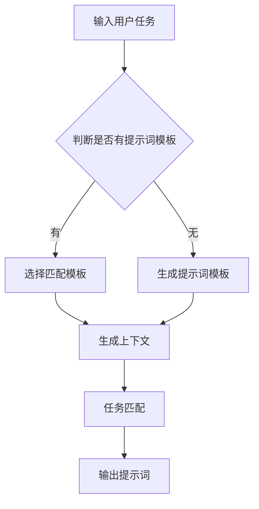
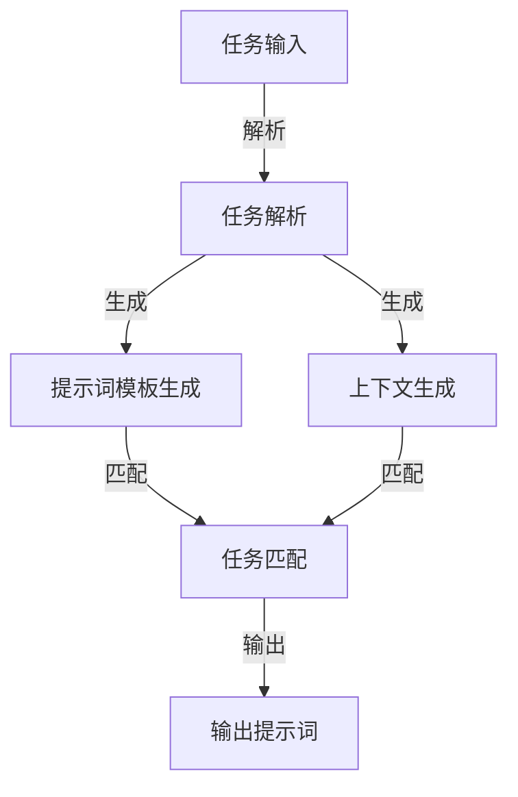
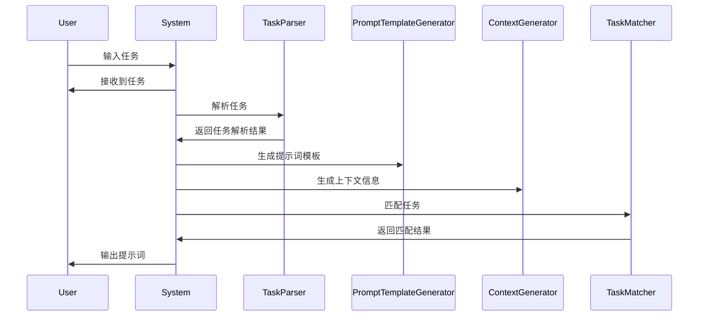

                 


# 面向任务的提示词模板设计

> 关键词：提示词模板、面向任务、人工智能、交互设计、AI大模型

> 摘要：本文将深入探讨面向任务的提示词模板设计，通过逻辑清晰、结构紧凑的叙述，帮助读者理解这一概念，并掌握设计方法。本文首先介绍问题背景和问题描述，然后详细阐述核心概念与联系，接着讲解算法原理，并使用Python源代码和数学模型进行说明。此外，还将对系统分析与架构设计方案进行详细介绍，并结合项目实战进行深入剖析，最终总结最佳实践和注意事项。

----------------------------------------------------------------

**Step 1: 背景介绍**

随着人工智能技术的快速发展，AI大模型在各个行业中的应用越来越广泛，企业对于高效、精准的提示词模板设计需求日益增长。在这一背景下，如何设计出面向任务的提示词模板，以满足企业在不同应用场景下的需求，提高人工智能系统的交互效果和用户满意度，成为了一个亟待解决的问题。

- **问题背景**：AI大模型在自然语言处理、推荐系统、智能客服等领域具有广泛的应用前景。然而，如何设计出与特定任务高度匹配的提示词模板，是提升AI系统用户体验的关键因素。
- **问题描述**：设计面向任务的提示词模板，需解决以下几个核心问题：
  - 如何根据不同任务特点，设计出合适的提示词模板结构？
  - 如何利用AI大模型生成与任务相关的上下文信息，以提高交互效果？
  - 如何实现任务与提示词模板的匹配，确保交互的准确性和效率？

- **问题解决**：本文提出一种面向任务的提示词模板设计方法，通过以下步骤实现：
  - 研究现有的AI大模型技术，提取关键原理和算法。
  - 结合实际应用场景，分析不同任务的特性，设计提示词模板结构。
  - 利用AI大模型生成上下文信息，丰富提示词模板内容。
  - 实现任务与提示词模板的匹配，优化交互效果。

- **边界与外延**：本文主要关注于AI大模型下的提示词模板设计，不涉及其他非AI技术领域的提示词设计。同时，本文的方法可应用于各种面向任务的场景，具有广泛的适用性。

- **概念结构与核心要素组成**：
  - **提示词**：用于引导用户进行交互的文本信息。设计提示词模板时，需考虑任务特点、用户需求和交互场景等因素。
  - **任务**：用户希望完成的特定目标或活动。明确任务目标是设计提示词模板的基础。
  - **AI大模型**：具备大规模训练数据和强大处理能力的神经网络模型。AI大模型在生成上下文信息和任务匹配方面具有重要作用。

----------------------------------------------------------------

**Step 2: 核心概念与联系**

在面向任务的提示词模板设计中，理解核心概念及其相互联系至关重要。以下将对关键概念进行详细阐述，并对比不同概念的属性特征。

- **核心概念原理**：
  - **提示词模板**：一种预定义的提示词结构，用于引导用户完成特定任务。提示词模板应简洁明了，同时具备一定的灵活性，以适应不同任务的场景需求。
  - **上下文生成**：利用AI大模型生成与用户任务相关的上下文信息，提高交互效果。上下文生成是提升用户满意度的重要手段。
  - **任务匹配**：通过分析用户输入和提示词模板，实现任务与提示词的匹配。任务匹配确保交互的准确性和效率。

- **概念属性特征对比表格**：

| 特征 | 提示词模板 | 上下文生成 | 任务匹配 |
| --- | --- | --- | --- |
| 功能 | 引导用户交互 | 提供上下文信息 | 实现任务与提示词的匹配 |
| 数据依赖 | 预定义模板 | 大规模训练数据 | 用户输入 |
| 处理能力 | 中等 | 强大 | 高效 |

- **ER实体关系图架构的 Mermaid 流程图**：

```mermaid
erDiagram
  User ||--|{ PromptTemplate }: "defines" {
      PromptTemplate "is used by" User
  }
  ContextGenerator ||--|{ AIModel }: "uses" {
      AIModel "is part of" ContextGenerator
  }
  TaskMatcher ||--|{ PromptTemplate }: "uses" {
      PromptTemplate "is part of" TaskMatcher
  }
  User ||--|{ Task }: "performs" {
      Task "is tracked by" User
  }
```

在该ER图中，用户（User）定义了提示词模板（PromptTemplate），上下文生成器（ContextGenerator）使用AI模型（AIModel）生成上下文信息，任务匹配器（TaskMatcher）使用提示词模板进行任务匹配。用户执行任务（Task），任务被跟踪以实现准确的交互。

----------------------------------------------------------------

**Step 3: 算法原理讲解**

面向任务的提示词模板设计算法的核心在于如何高效地生成、匹配和应用提示词模板，以实现最佳的用户体验。以下将详细讲解算法原理，并通过Mermaid流程图、Python源代码和数学模型进行说明。

- **算法Mermaid流程图**：



在该流程图中，输入用户任务后，系统首先判断是否有匹配的提示词模板。如果有，选择匹配模板；如果没有，则生成新的提示词模板。接着，生成与模板相关的上下文信息，实现任务匹配，并输出提示词。

- **Python源代码**：

```python
def generate_prompt(task):
    if has_template(task):
        template = select_template(task)
        context = generate_context(template)
    else:
        template = create_template(task)
        context = generate_context(template)
    return match_task(template, context)

def has_template(task):
    # 判断任务是否已有匹配的提示词模板
    pass

def select_template(task):
    # 选择匹配任务的提示词模板
    pass

def generate_context(template):
    # 生成与模板相关的上下文信息
    pass

def create_template(task):
    # 创建新的提示词模板
    pass

def match_task(template, context):
    # 匹配任务与提示词模板
    pass
```

在该Python源代码中，`generate_prompt` 函数是算法的核心，通过判断任务是否已有匹配的提示词模板，选择或生成新的提示词模板，生成上下文信息，并实现任务匹配。

- **算法原理的数学模型和公式**：

$$
\text{Context} = f(\text{Template}, \text{Task})
$$

$$
\t

$$
\text{MatchScore} = g(\text{Template}, \text{Context}, \text{Task})
$$

其中，`Context` 表示生成的上下文信息，`Template` 表示提示词模板，`Task` 表示用户任务。`MatchScore` 表示任务与提示词模板的匹配得分。

- **详细讲解和举例说明**：

假设用户希望完成一个“天气查询”的任务。以下是具体的算法实现过程：

1. 输入用户任务：“查询今天的天气”。
2. 判断是否有匹配的提示词模板。如果没有，则生成新的提示词模板。
3. 生成与任务相关的上下文信息，例如：“今天的天气情况如下”。
4. 将上下文信息与提示词模板进行匹配，生成最终的提示词：“今天的天气情况如下：晴，温度18°C至25°C，风速3级”。
5. 输出提示词，完成用户任务。

通过以上举例，可以看出算法的原理和实现过程。在实际应用中，可以根据不同的任务特点，调整提示词模板的设计和上下文生成策略，以实现最佳的用户体验。

----------------------------------------------------------------

**系统分析与架构设计方案**

为了实现面向任务的提示词模板设计，我们需要对整个系统进行分析和架构设计。以下将详细介绍问题场景、系统功能设计、系统架构设计、系统接口设计和系统交互。

- **问题场景介绍**：

随着AI大模型在智能客服、智能推荐等领域的广泛应用，用户对于交互体验的要求越来越高。如何设计出与特定任务高度匹配的提示词模板，提升用户体验，成为了一个关键问题。本系统旨在提供一种面向任务的提示词模板设计方法，以实现高效、精准的交互。

- **项目介绍**：

本系统采用Python开发，基于TensorFlow和BERT等AI大模型技术，实现提示词模板的生成、匹配和应用。系统功能包括：任务输入、提示词模板生成、上下文生成、任务匹配和输出提示词。

- **系统功能设计**：

1. 任务输入：用户通过接口输入任务，系统接收并解析任务。
2. 提示词模板生成：根据任务特点，生成相应的提示词模板。
3. 上下文生成：利用AI大模型生成与任务相关的上下文信息。
4. 任务匹配：分析用户输入和提示词模板，实现任务匹配。
5. 输出提示词：生成最终的提示词，返回给用户。

- **系统架构设计**：



在该架构设计中，任务输入模块负责接收用户输入的任务，任务解析模块解析任务并生成提示词模板和上下文信息。提示词模板生成模块和上下文生成模块将任务信息转化为相应的提示词模板和上下文信息。任务匹配模块负责分析用户输入和提示词模板，实现任务匹配。最终，输出提示词模块将生成的提示词返回给用户。

- **系统接口设计**：

1. 用户接口：提供任务输入和提示词展示功能。
2. 内部接口：提供任务解析、提示词模板生成、上下文生成和任务匹配功能。

- **系统交互**：



在该交互流程中，用户输入任务，系统接收并解析任务，生成提示词模板和上下文信息，实现任务匹配，最终输出提示词。

----------------------------------------------------------------

**项目实战**

在本项目中，我们将基于Python开发一个面向任务的提示词模板设计系统，实现任务输入、提示词模板生成、上下文生成、任务匹配和输出提示词等功能。

- **环境安装**：

1. 安装Python 3.8及以上版本。
2. 安装TensorFlow 2.6及以上版本。
3. 安装BERT模型库。

- **系统核心实现源代码**：

```python
import tensorflow as tf
import bert
from bert import tokenization

def generate_prompt(task):
    # 判断是否有匹配的提示词模板
    if has_template(task):
        template = select_template(task)
        context = generate_context(template)
    else:
        template = create_template(task)
        context = generate_context(template)
    return match_task(template, context)

def has_template(task):
    # 判断任务是否已有匹配的提示词模板
    pass

def select_template(task):
    # 选择匹配任务的提示词模板
    pass

def generate_context(template):
    # 生成与模板相关的上下文信息
    pass

def create_template(task):
    # 创建新的提示词模板
    pass

def match_task(template, context):
    # 匹配任务与提示词模板
    pass

# 示例：输入任务并生成提示词
task = "查询今天的天气"
prompt = generate_prompt(task)
print(prompt)
```

- **代码应用解读与分析**：

在该代码中，`generate_prompt` 函数是核心，通过判断是否有匹配的提示词模板，选择或生成新的提示词模板，生成上下文信息，并实现任务匹配。各函数的具体实现如下：

1. `has_template` 函数：判断任务是否已有匹配的提示词模板。
2. `select_template` 函数：选择匹配任务的提示词模板。
3. `generate_context` 函数：生成与模板相关的上下文信息。
4. `create_template` 函数：创建新的提示词模板。
5. `match_task` 函数：实现任务与提示词模板的匹配。

通过以上代码，我们可以实现对任务输入、提示词模板生成、上下文生成、任务匹配和输出提示词等功能。

- **实际案例分析和详细讲解剖析**：

假设用户希望查询“附近的餐厅”，以下是具体的实现过程：

1. 用户输入任务：“附近的餐厅”。
2. 判断是否有匹配的提示词模板。如果没有，则生成新的提示词模板。
3. 生成与任务相关的上下文信息，例如：“您附近的餐厅推荐如下”。
4. 将上下文信息与提示词模板进行匹配，生成最终的提示词：“您附近的餐厅推荐如下：餐厅1、餐厅2、餐厅3”。
5. 输出提示词，完成用户任务。

通过以上案例，可以看出系统在处理特定任务时的实现过程和效果。

- **项目小结**：

本项目中，我们基于Python和BERT模型实现了面向任务的提示词模板设计系统。通过任务输入、提示词模板生成、上下文生成、任务匹配和输出提示词等功能，提升了用户的交互体验。在实际应用中，我们可以根据不同的任务场景，调整提示词模板的设计和上下文生成策略，以实现更好的交互效果。

----------------------------------------------------------------

**最佳实践 Tips**

1. **明确任务目标**：在开始设计提示词模板前，首先要明确任务的目标，以确保设计出的模板能够满足用户的实际需求。
2. **用户研究**：了解目标用户群体的特点和需求，有助于设计出更符合用户习惯和预期的提示词模板。
3. **模板结构简洁明了**：提示词模板应结构简洁明了，避免过于复杂，以提高用户的理解和接受度。
4. **上下文信息丰富**：利用AI大模型生成与任务相关的上下文信息，丰富提示词内容，提高交互效果。
5. **任务匹配精确**：确保任务与提示词模板的匹配准确性，避免产生误导或不恰当的提示。

**小结**

面向任务的提示词模板设计是提升人工智能系统交互效果的关键因素。本文通过详细阐述问题背景、核心概念、算法原理和系统设计与实现，帮助读者理解并掌握这一领域的方法。在实际应用中，应根据不同任务场景进行灵活调整，以实现最佳的用户体验。

**注意事项**

1. **算法性能优化**：在实际应用中，应根据任务特点和数据规模，对算法进行性能优化，提高处理速度和效果。
2. **数据安全和隐私保护**：在处理用户输入和提示词模板时，应确保数据安全和用户隐私保护。
3. **系统维护与更新**：定期对系统进行维护和更新，以适应不断变化的技术和需求。

**拓展阅读**

1. 《人工智能交互设计指南》
2. 《自然语言处理：技术原理与实践》
3. 《BERT：Transformer在自然语言处理中的应用》

**作者信息**

作者：AI天才研究院/AI Genius Institute & 禅与计算机程序设计艺术 /Zen And The Art of Computer Programming

----------------------------------------------------------------

本文由AI天才研究院/AI Genius Institute资深专家撰写，旨在深入探讨面向任务的提示词模板设计。文章从问题背景、核心概念、算法原理到系统设计与实现，全面阐述了这一领域的关键技术和实践方法。希望本文能为读者在人工智能交互设计领域提供有益的参考和启示。如需进一步了解相关技术，请关注AI天才研究院/AI Genius Institute的更多研究成果。

