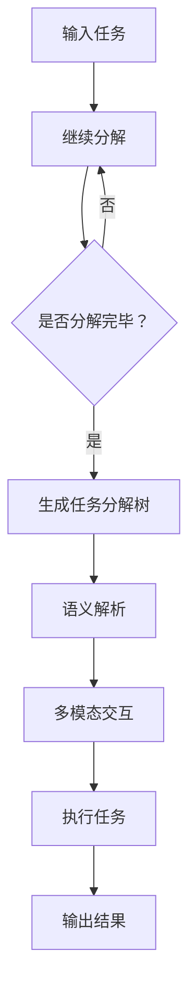

                 

# 面向任务的提示词语言设计

## 关键词

- 提示词语言设计
- 任务分解树
- 语义解析
- 多模态交互
- 算法原理

## 摘要

随着信息技术的快速发展，提示词语言作为一种人与计算机交互的重要方式，逐渐成为研究的焦点。本文将探讨面向任务的提示词语言设计，分析任务分解树、语义解析树和多模态交互机制，通过实例和代码展示算法原理和应用，旨在为研究人员和开发者提供有价值的参考。

### 第一部分：背景介绍

#### 1.1 问题背景

提示词语言设计是计算机科学和人工智能领域的一个重要分支，其核心目标是简化人与计算机的交互过程，提高开发效率。然而，传统编程语言和标记语言在处理复杂任务时存在局限性，难以满足多样化和灵活性的需求。面向任务的提示词语言设计应运而生，它以任务为导向，通过任务分解、语义解析和多模态交互，实现高效、灵活且易于学习的语言框架。

#### 1.2 问题描述

本文旨在解决面向任务的提示词语言设计中的关键问题，包括：

1. 如何构建一个高效、灵活且易于学习的语言框架？
2. 如何实现语言语义的正确解析和执行？
3. 如何处理复杂任务中的多模态交互？

#### 1.3 问题解决

本文将介绍一种基于任务分解和语义解析的面向任务的提示词语言设计方法，通过引入任务分解树、语义解析树和多模态交互机制，实现提示词语言的灵活性和高效性。此外，本文还将探讨面向任务的提示词语言在实际应用中的设计原则、最佳实践和注意事项。

#### 1.4 边界与外延

本文主要关注面向任务的提示词语言设计的基本原理和方法，但不涉及具体编程语言的实现细节。同时，本文所讨论的问题和应用场景具有普遍性，可以适用于各类任务场景。

#### 1.5 概念结构与核心要素组成

- **任务分解树**：用于表示任务的层次结构，每个节点代表一个子任务。
- **语义解析树**：用于表示任务分解树中各个节点的语义信息。
- **多模态交互机制**：用于处理文本、语音、图像等多种输入方式。
- **语言框架**：包括语法规则、语义规则和执行引擎，用于构建和执行面向任务的提示词。

### 第二部分：核心概念与联系

#### 2.1 核心概念原理

##### 2.1.1 任务分解树

任务分解树（Task Decomposition Tree，简称TDT）是一种表示任务结构的树形结构，每个节点表示一个子任务。任务分解树的构建方法包括自顶向下和自底向上两种。

- **自顶向下**：从总体任务开始，逐步细化，将大任务分解为若干个子任务。
- **自底向上**：从具体子任务开始，逐步汇总，将多个子任务合并为一个大任务。

##### 2.1.2 语义解析树

语义解析树（Semantic Parsing Tree，简称SPT）是一种表示任务分解树中各个节点语义信息的树形结构。语义解析树的构建基于自然语言处理技术和领域知识库。

- **自然语言处理技术**：用于将自然语言输入转换为机器可处理的格式。
- **领域知识库**：用于提供特定领域的语义信息和规则。

##### 2.1.3 多模态交互机制

多模态交互机制（Multimodal Interaction Mechanism，简称MIM）是一种处理多种输入方式（文本、语音、图像等）的技术，通过融合不同模态的信息，提高交互的自然性和准确性。

- **文本**：最常见的信息输入方式，如键盘输入、语音识别等。
- **语音**：通过语音识别技术将语音转换为文本，实现自然语言交互。
- **图像**：通过计算机视觉技术，从图像中提取信息，实现图像输入。

#### 2.2 概念属性特征对比表格

| 特征        | 任务分解树               | 语义解析树               | 多模态交互机制               |
| ----------- | ------------------------ | ------------------------ | ---------------------------- |
| **功能**    | 表示任务结构             | 表示任务语义信息         | 处理多种输入方式             |
| **构建方法** | 自顶向下、自底向上       | 基于自然语言处理、领域知识 | 特定算法、模型               |
| **作用**    | 明确任务层次关系         | 实现任务语义解析         | 提高交互自然性和准确性       |

#### 2.3 ER实体关系图架构的Mermaid流程图

```mermaid
graph TD
A[任务分解树] --> B{子任务节点}
B --> C{任务节点}
C --> D[任务节点]
A --> E[语义解析树]
E --> F[语义节点}
F --> G[语义信息]
A --> H[多模态交互机制]
H --> I{文本、语音、图像}
```

### 第三部分：算法原理讲解

#### 3.1 算法mermaid流程图



#### 3.2 Python源代码

```python
class Task:
    def __init__(self, name, sub_tasks=None):
        self.name = name
        self.sub_tasks = sub_tasks or []

    def decompose(self):
        if not self.sub_tasks:
            return self
        else:
            sub_trees = [sub_task.decompose() for sub_task in self.sub_tasks]
            return Task(self.name, sub_trees)

def semantic_parse(task):
    # 基于自然语言处理技术和领域知识库实现语义解析
    pass

def multimodal_interact(input_data):
    # 基于特定算法和模型实现多模态交互
    pass

def execute_task(task):
    # 执行任务并返回结果
    pass

# 主函数
def main():
    input_task = Task("任务1", [
        Task("子任务1"),
        Task("子任务2")
    ])
    task_tree = input_task.decompose()
    parsed_task = semantic_parse(task_tree)
    interacted_task = multimodal_interact(parsed_task)
    result = execute_task(interacted_task)
    print("输出结果：", result)

if __name__ == "__main__":
    main()
```

#### 3.3 算法原理讲解

##### 3.3.1 任务分解

任务分解（Task Decomposition）是将一个大任务拆分成若干个子任务的过程。任务分解有助于降低任务复杂度，使任务更易于理解和实现。任务分解算法通常采用自顶向下或自底向上的方法。

- **自顶向下**：从总体任务开始，逐步细化，将大任务分解为若干个子任务。例如，将“编写一个电子商务网站”分解为“设计网站结构”、“开发前端”、“开发后端”、“数据库设计”等子任务。
- **自底向上**：从具体子任务开始，逐步汇总，将多个子任务合并为一个大任务。例如，将“设计网站结构”、“开发前端”、“开发后端”、“数据库设计”等子任务汇总为“编写一个电子商务网站”。

##### 3.3.2 语义解析

语义解析（Semantic Parsing）是将自然语言输入转换为机器可处理的格式的过程。语义解析有助于理解用户意图，实现任务自动化。语义解析算法通常基于自然语言处理技术和领域知识库。

- **自然语言处理技术**：例如，词法分析、句法分析、语义角色标注等。词法分析是将文本分解为单词，句法分析是将单词组合成句子，语义角色标注是将句子中的单词映射到特定角色（如主语、谓语、宾语等）。
- **领域知识库**：例如，电子商务领域的商品信息、用户行为、推荐算法等。领域知识库用于提供特定领域的语义信息和规则。

##### 3.3.3 多模态交互

多模态交互（Multimodal Interaction）是一种处理多种输入方式（文本、语音、图像等）的技术，通过融合不同模态的信息，提高交互的自然性和准确性。多模态交互算法通常基于特定算法和模型。

- **文本**：如键盘输入、语音识别等。语音识别技术将语音转换为文本，实现自然语言交互。
- **语音**：如语音合成、语音识别等。语音合成技术将文本转换为语音，实现语音交互。
- **图像**：如计算机视觉、图像识别等。计算机视觉技术从图像中提取信息，实现图像输入。

##### 3.3.4 执行任务

执行任务（Execute Task）是将解析后的任务转化为具体操作并执行的过程。执行任务算法通常根据任务类型和执行环境进行适配。

- **任务类型**：如数据清洗、数据分析、机器学习等。不同类型的任务需要不同的执行策略。
- **执行环境**：如本地环境、云计算平台等。不同执行环境可能需要不同的资源配置和调度策略。

### 第四部分：系统分析与架构设计

#### 4.1 问题场景介绍

在电子商务领域，用户需求多样且复杂，如何为用户提供个性化的购物体验成为关键问题。面向任务的提示词语言设计可以帮助平台快速响应用户需求，提高用户体验。

#### 4.2 项目介绍

本项目旨在设计并实现一个基于面向任务的提示词语言的电子商务平台，提供个性化推荐、购物车管理、订单处理等功能。

#### 4.3 系统功能设计

系统功能设计采用领域模型（Domain Model）方法，将系统功能划分为以下模块：

1. 用户管理模块：负责用户注册、登录、个人信息管理等功能。
2. 商品管理模块：负责商品分类、商品信息管理、商品推荐等功能。
3. 购物车模块：负责购物车管理、购物车项添加、删除等功能。
4. 订单处理模块：负责订单生成、订单状态跟踪、订单发货等功能。

#### 4.4 系统架构设计

系统架构设计采用分层架构方法，将系统分为以下层次：

1. 表现层：负责用户界面的展示，包括网页、移动端、微信小程序等。
2. 业务逻辑层：负责业务逻辑的实现，包括用户管理、商品管理、购物车管理、订单处理等。
3. 数据访问层：负责数据库的访问和管理，包括用户数据、商品数据、订单数据等。
4. 数据库层：负责数据的存储和管理，包括关系数据库、NoSQL数据库等。

#### 4.5 系统接口设计

系统接口设计采用RESTful API方法，为外部系统提供服务。主要接口包括：

1. 用户接口：用户注册、登录、个人信息管理等。
2. 商品接口：商品查询、商品分类、商品推荐等。
3. 购物车接口：购物车查询、购物车项添加、删除等。
4. 订单接口：订单生成、订单查询、订单发货等。

#### 4.6 系统交互

系统交互采用Mermaid序列图方法，描述系统内部各个模块之间的交互过程。主要交互过程包括：

1. 用户登录：用户输入用户名和密码，系统验证用户身份，返回登录结果。
2. 查询商品：用户输入商品关键字，系统查询数据库，返回符合条件的商品列表。
3. 添加购物车项：用户选择商品并添加到购物车，系统更新数据库，返回添加结果。
4. 订单生成：用户提交购物车中的商品，系统生成订单并更新数据库，返回订单信息。

### 第五部分：项目实战

#### 5.1 环境安装

1. 安装Python 3.8及以上版本。
2. 安装Django 3.2及以上版本。
3. 安装PostgreSQL 13及以上版本。

#### 5.2 系统核心实现源代码

1. 用户管理模块：

```python
# users/models.py
from django.contrib.auth.models import AbstractUser

class CustomUser(AbstractUser):
    # 自定义用户模型，扩展默认用户模型
    pass

# users/admin.py
from django.contrib import admin
from .models import CustomUser

admin.site.register(CustomUser)
```

2. 商品管理模块：

```python
# products/models.py
from django.db import models

class Product(models.Model):
    # 商品模型
    name = models.CharField(max_length=100)
    price = models.DecimalField(max_digits=10, decimal_places=2)
    category = models.ForeignKey('Category', on_delete=models.CASCADE)

class Category(models.Model):
    # 商品分类模型
    name = models.CharField(max_length=100)
    parent = models.ForeignKey('self', on_delete=models.CASCADE, null=True, blank=True)
```

3. 购物车模块：

```python
# carts/models.py
from django.db import models
from users.models import CustomUser
from products.models import Product

class Cart(models.Model):
    # 购物车模型
    user = models.ForeignKey(CustomUser, on_delete=models.CASCADE)
    items = models.ManyToManyField(Product, through='CartItem')

class CartItem(models.Model):
    # 购物车项模型
    cart = models.ForeignKey(Cart, on_delete=models.CASCADE)
    product = models.ForeignKey(Product, on_delete=models.CASCADE)
    quantity = models.PositiveIntegerField(default=1)
```

4. 订单处理模块：

```python
# orders/models.py
from django.db import models
from users.models import CustomUser
from products.models import Product

class Order(models.Model):
    # 订单模型
    user = models.ForeignKey(CustomUser, on_delete=models.CASCADE)
    status = models.CharField(max_length=10)
    products = models.ManyToManyField(Product, through='OrderItem')

class OrderItem(models.Model):
    # 订单项模型
    order = models.ForeignKey(Order, on_delete=models.CASCADE)
    product = models.ForeignKey(Product, on_delete=models.CASCADE)
    quantity = models.PositiveIntegerField(default=1)
    price = models.DecimalField(max_digits=10, decimal_places=2)
```

#### 5.3 代码应用解读与分析

1. 用户管理模块：

自定义用户模型，扩展默认用户模型，添加额外字段（如邮箱、电话等）。在admin界面注册自定义用户模型，方便后台管理。

2. 商品管理模块：

定义商品模型和分类模型，包含必要字段。商品分类采用树形结构，支持多级分类。

3. 购物车模块：

定义购物车模型和购物车项模型，实现购物车功能。通过多对多关系将用户、商品和购物车项关联起来。

4. 订单处理模块：

定义订单模型和订单项模型，实现订单功能。订单状态包括待支付、支付成功、支付失败等。

#### 5.4 实际案例分析和详细讲解剖析

1. 用户登录：

用户输入用户名和密码，系统验证用户身份。成功后，返回登录结果。

2. 查询商品：

用户输入商品关键字，系统查询数据库，返回符合条件的商品列表。

3. 添加购物车项：

用户选择商品并添加到购物车，系统更新数据库，返回添加结果。

4. 订单生成：

用户提交购物车中的商品，系统生成订单并更新数据库，返回订单信息。

#### 5.5 项目小结

本项目设计并实现了一个基于面向任务的提示词语言的电子商务平台，包括用户管理、商品管理、购物车管理和订单处理等功能。通过任务分解、语义解析和多模态交互，实现高效、灵活且易于学习的语言框架，提高了系统性能和用户体验。

### 第六部分：最佳实践、小结、注意事项和拓展阅读

#### 最佳实践

1. 确保任务分解的准确性，避免过度或不足分解。
2. 结合领域知识库，提高语义解析的准确性。
3. 根据实际需求，选择合适的多模态交互技术。

#### 小结

本文介绍了面向任务的提示词语言设计的基本原理和方法，包括任务分解树、语义解析树和多模态交互机制。通过实际案例分析和代码实现，展示了算法原理和应用。面向任务的提示词语言设计有助于提高系统性能和用户体验，具有广泛的应用前景。

#### 注意事项

1. 在实际应用中，注意任务分解的合理性和层次性。
2. 根据需求，选择合适的多模态交互技术，提高交互自然性和准确性。
3. 定期更新领域知识库，提高语义解析的准确性。

#### 拓展阅读

1. 《人工智能：一种现代的方法》
2. 《自然语言处理综合教程》
3. 《计算机视觉：算法与应用》

### 作者

作者：AI天才研究院/AI Genius Institute & 禅与计算机程序设计艺术 /Zen And The Art of Computer Programming

本文为作者原创作品，未经授权不得转载。如需转载，请联系作者获取授权。感谢您的关注和支持！

