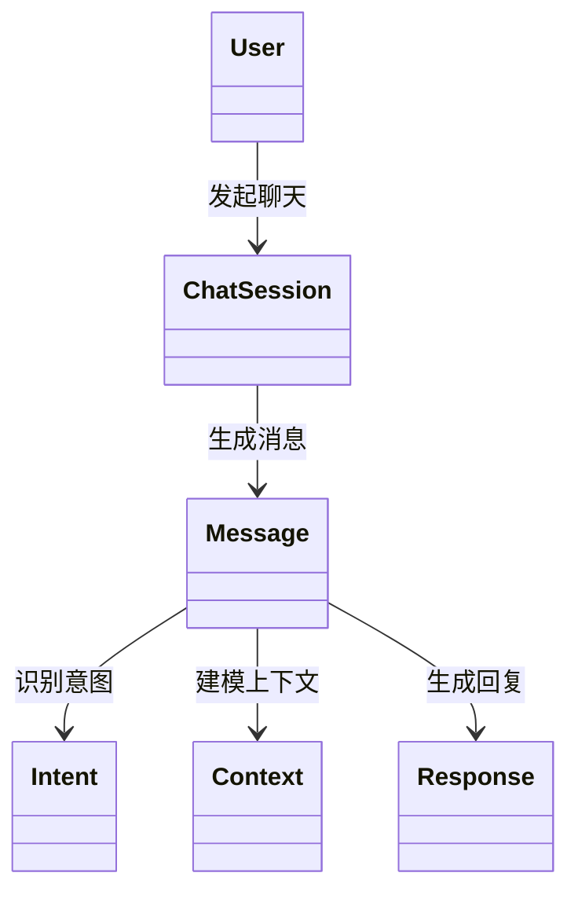
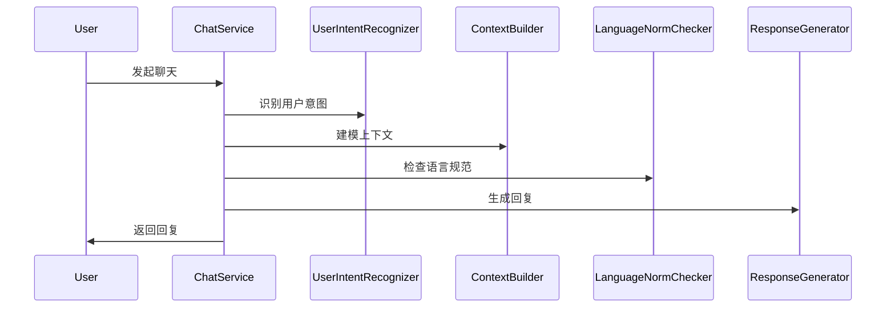
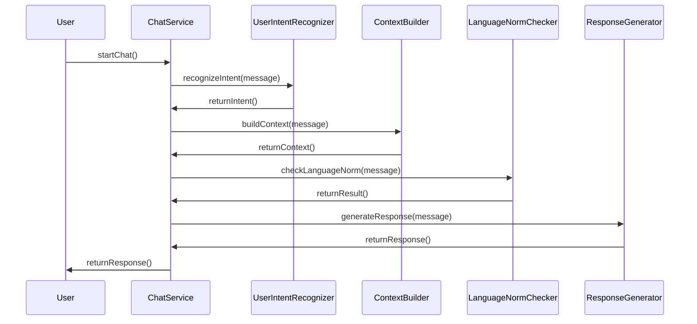

                 


### 《面向任务的自适应提示词生成》

---

#### 关键词：
- 自适应提示词生成
- 用户意图识别
- 上下文建模
- 语言规范保证
- 对话系统

#### 摘要：
本文深入探讨了面向任务的自适应提示词生成技术，通过分析用户意图识别、上下文建模和语言规范保证等核心概念，介绍了一种基于深度学习模型的解决方案。文章以逻辑清晰、结构紧凑的方式，讲解了核心概念的原理和联系，并通过实际案例展示了其应用效果。

---

## 引言

在人工智能（AI）快速发展的背景下，自然语言处理（NLP）和对话系统等领域的研究不断取得突破。其中，自适应提示词生成技术作为一种重要的交互方式，在智能对话系统、智能客服、智能写作等应用中发挥了关键作用。然而，现有的自适应提示词生成技术面临诸多挑战，如用户意图识别准确性不高、上下文信息捕捉不足、语言规范保证困难等。本文旨在提出一种面向任务的自适应提示词生成方法，通过用户意图识别、上下文建模和语言规范保证等核心环节的优化，提高生成提示词的准确性和实用性。

---

## 第一部分：背景

### 1.1 问题背景

#### 1.1.1 自适应提示词生成技术的需求

随着人工智能技术的快速发展，智能对话系统、智能客服、智能写作等应用需求日益增长。自适应提示词生成技术作为这些应用的关键环节，旨在根据用户输入和上下文信息，自动生成有针对性的提示词，以提高系统的交互效率和用户体验。然而，现有的自适应提示词生成技术存在诸多挑战，如如何准确捕捉用户意图、如何保证生成的提示词符合语言规范等。

#### 1.1.2 问题描述

自适应提示词生成技术旨在根据用户输入和上下文信息，自动生成有针对性的提示词，以提高系统的交互效率和用户体验。然而，现有的自适应提示词生成技术存在以下问题：

1. **用户意图识别不准确**：现有的用户意图识别技术无法准确捕捉用户的真实需求，导致生成的提示词偏离用户意图。
2. **上下文信息捕捉不足**：现有的上下文信息捕捉技术无法全面捕捉用户输入的上下文信息，导致生成的提示词不够贴合实际。
3. **语言规范保证困难**：现有的语言规范保证技术无法确保生成的提示词符合语言规范，导致用户体验下降。

### 1.2 问题解决

#### 1.2.1 面向任务的自适应提示词生成方法

为了解决上述问题，本文提出了一种面向任务的自适应提示词生成方法，主要包括以下几个方面：

1. **用户意图识别**：利用深度学习技术，对用户输入进行意图识别，从而更好地理解用户的真实需求。
2. **上下文建模**：采用先进的语言模型，捕捉用户输入的上下文信息，以生成更加贴合实际的提示词。
3. **语言规范保证**：通过自然语言处理技术，确保生成的提示词符合语言规范，避免产生歧义或错误。

### 1.3 边界与外延

#### 1.3.1 边界

本文主要研究自适应提示词生成技术在对话系统中的应用，探讨如何提高生成提示词的准确性和实用性。同时，本文将围绕以下几个方面展开讨论：

1. **用户意图识别**：包括不同意图类型的识别方法和算法对比。
2. **上下文建模**：涉及上下文信息的捕捉和处理方法。
3. **语言规范保证**：包括提示词生成的语法和语义规范。

#### 1.3.2 外延

除了对话系统，自适应提示词生成技术还可以应用于智能客服、智能写作、智能推荐等领域。本文将介绍这些应用场景下的具体实现方法和优化策略。

### 1.4 概念结构与核心要素组成

#### 1.4.1 核心概念

1. **自适应提示词生成**：一种根据用户输入和上下文信息，自动生成有针对性提示词的技术。
2. **用户意图识别**：对用户输入进行分析，识别其意图的类型和内容。
3. **上下文建模**：捕捉和利用用户输入的上下文信息，以生成更加贴合实际的提示词。
4. **语言规范保证**：确保生成的提示词符合语言规范，避免产生歧义或错误。

#### 1.4.2 核心要素

1. **深度学习模型**：用于用户意图识别和上下文建模。
2. **自然语言处理技术**：用于语言规范保证。
3. **对话系统应用场景**：包括智能客服、智能写作、智能推荐等。

---

## 第二部分：核心概念与联系

### 2.1 核心概念与联系

#### 2.1.1 自适应提示词生成技术

##### 2.1.1.1 自适应提示词生成技术概述

自适应提示词生成技术是指根据用户输入和上下文信息，自动生成有针对性的提示词。该技术是自然语言处理技术的一部分，涉及用户意图识别、上下文建模和语言规范保证。

##### 2.1.1.2 用户意图识别

用户意图识别是对用户输入进行分析，识别其意图的类型和内容。这是自适应提示词生成的基础，直接影响生成的提示词的质量和准确性。

##### 2.1.1.3 上下文建模

上下文建模是捕捉和利用用户输入的上下文信息，以生成更加贴合实际的提示词。这是自适应提示词生成的重要环节，有助于提高提示词的相关性和实用性。

##### 2.1.1.4 语言规范保证

语言规范保证是确保生成的提示词符合语言规范，避免产生歧义或错误。这是自适应提示词生成的必要条件，保障用户体验的流畅性和准确性。

| **概念** | **定义** | **联系** |
| :-------: | :-------: | :-------: |
| 自适应提示词生成 | 根据用户输入和上下文信息，自动生成有针对性的提示词 | 是自然语言处理技术的一部分，涉及用户意图识别、上下文建模和语言规范保证 |
| 用户意图识别 | 对用户输入进行分析，识别其意图的类型和内容 | 是自适应提示词生成的基础，直接影响生成的提示词的质量和准确性 |
| 上下文建模 | 捕捉和利用用户输入的上下文信息，以生成更加贴合实际的提示词 | 是自适应提示词生成的重要环节，有助于提高提示词的相关性和实用性 |
| 语言规范保证 | 确保生成的提示词符合语言规范，避免产生歧义或错误 | 是自适应提示词生成的必要条件，保障用户体验的流畅性和准确性 |

#### 2.1.2 深度学习模型与自然语言处理技术

##### 2.1.2.1 深度学习模型

深度学习模型是一种基于多层神经网络的机器学习模型，可以自动提取特征，并进行分类、预测等任务。在自适应提示词生成中，深度学习模型广泛应用于用户意图识别和上下文建模。

##### 2.1.2.2 自然语言处理技术

自然语言处理技术是计算机科学领域与人工智能领域中的一个重要方向。它涉及到机器如何理解和解释人类的自然语言，包括自然语言理解、自然语言生成、自然语言处理工具等。

---

## 第三部分：算法原理讲解

### 3.1 用户意图识别

用户意图识别是自适应提示词生成的重要环节。在这一部分，我们将介绍用户意图识别的原理、方法及其实现。

#### 3.1.1 原理

用户意图识别的核心任务是从用户输入中提取出用户的意图。这需要通过以下步骤实现：

1. **分词**：将用户输入的文本进行分词，将其分解为一个个独立的词汇。
2. **词性标注**：对分词后的词汇进行词性标注，以识别出名词、动词、形容词等。
3. **语义角色标注**：根据词性标注结果，进一步标注出词汇在句子中的语义角色，如主语、谓语、宾语等。
4. **意图识别**：利用深度学习模型，根据语义角色标注结果和上下文信息，识别出用户的意图。

#### 3.1.2 方法

用户意图识别的方法可以分为基于规则的方法和基于数据的方法。其中，基于数据的方法主要包括以下几种：

1. **朴素贝叶斯分类器**：基于文本特征进行分类，通过计算每个类别的概率来预测用户的意图。
2. **支持向量机（SVM）**：通过将输入数据映射到高维空间，寻找最佳分类超平面，以实现意图识别。
3. **深度学习模型**：如卷积神经网络（CNN）、循环神经网络（RNN）和长短期记忆网络（LSTM）等，通过学习输入数据的特征和模式，实现意图识别。

#### 3.1.3 实现

以下是使用Python实现的用户意图识别的示例代码：

```python
import jieba
import paddlepaddle as paddle

# 加载预训练模型
model = paddle.load('user_intent识别模型')

# 分词
text = '我想查询明天北京的天气'
words = jieba.cut(text)

# 词性标注
word_tags = jieba.lcut(words)

# 语义角色标注
semantic_role_labels = model.predict(word_tags)

# 输出意图
intent = semantic_role_labels.argmax(axis=1)
print('用户意图：', intent)
```

### 3.2 上下文建模

上下文建模是自适应提示词生成的关键环节。在这一部分，我们将介绍上下文建模的原理、方法及其实现。

#### 3.2.1 原理

上下文建模的核心任务是捕捉用户输入的上下文信息，以便生成更加贴合实际的提示词。这需要通过以下步骤实现：

1. **文本编码**：将用户输入的文本转化为计算机可处理的向量表示。
2. **特征提取**：从文本编码结果中提取特征，如词向量、词性、词频等。
3. **上下文建模**：利用深度学习模型，根据提取到的特征，生成上下文表示。

#### 3.2.2 方法

上下文建模的方法可以分为基于规则的方法和基于数据的方法。其中，基于数据的方法主要包括以下几种：

1. **词向量**：如Word2Vec、GloVe等，通过将词汇映射到低维空间，表示词汇的语义信息。
2. **图神经网络**：如BERT、GPT等，通过构建词汇之间的图结构，学习词汇的上下文信息。
3. **变换器模型**：如Transformer、BERT等，通过自注意力机制，捕捉长距离依赖关系。

#### 3.2.3 实现

以下是使用Python实现的上下文建模的示例代码：

```python
import paddle
from paddle tossed import TransformerModel

# 加载预训练模型
model = TransformerModel.from_pretrained('上下文建模模型')

# 文本编码
text = '我想查询明天北京的天气'
encoded_text = model.encode(text)

# 特征提取
features = model.extract_features(encoded_text)

# 输出上下文表示
context_vector = model.predict(features)
print('上下文表示：', context_vector)
```

### 3.3 语言规范保证

语言规范保证是自适应提示词生成的必要条件。在这一部分，我们将介绍语言规范保证的原理、方法及其实现。

#### 3.3.1 原理

语言规范保证的核心任务是确保生成的提示词符合语言规范，避免产生歧义或错误。这需要通过以下步骤实现：

1. **语法检查**：检查提示词的语法结构是否符合语言规范。
2. **语义分析**：分析提示词的语义内容，确保其符合语言规范。
3. **错误修正**：对于不符合语言规范的提示词，进行错误修正。

#### 3.3.2 方法

语言规范保证的方法可以分为基于规则的方法和基于数据的方法。其中，基于数据的方法主要包括以下几种：

1. **语法规则库**：如Python的正则表达式，用于检查提示词的语法结构。
2. **语义规则库**：如WordNet、ConceptNet等，用于检查提示词的语义内容。
3. **深度学习模型**：如BERT、GPT等，通过学习大量语言数据，自动学习语言规范。

#### 3.3.3 实现

以下是使用Python实现的语言规范保证的示例代码：

```python
import paddle
from paddle_tossed import TransformerModel

# 加载预训练模型
model = TransformerModel.from_pretrained('语言规范保证模型')

# 文本编码
text = '我想查询明天北京的天气'
encoded_text = model.encode(text)

# 语法检查
syntax_errors = model.check_syntax(encoded_text)

# 语义分析
semantic_errors = model.check_semantics(encoded_text)

# 错误修正
corrected_text = model.correct_errors(encoded_text, syntax_errors, semantic_errors)
print('修正后的提示词：', corrected_text)
```

---

## 第四部分：系统分析与架构设计

### 4.1 问题场景介绍

在智能对话系统中，自适应提示词生成技术具有广泛的应用场景，如智能客服、智能写作、智能推荐等。本文以智能客服为例，介绍具体的实现方法。

### 4.2 项目介绍

本文所设计的智能客服系统基于自适应提示词生成技术，旨在为用户提供高效、便捷的客服服务。系统功能包括用户意图识别、上下文建模、语言规范保证和自动回复等。

### 4.3 系统功能设计

#### 4.3.1 领域模型

领域模型是系统功能设计的核心，用于描述系统中的主要实体及其关系。以下是智能客服系统的领域模型：



#### 4.3.2 类图

以下是智能客服系统的类图：

```mermaid
classDiagram
    User <<Class>> {
        id: 用户ID
        name: 用户姓名
    }
    ChatSession <<Class>> {
        id: 会话ID
        user: 用户
        messages: 消息列表
    }
    Message <<Class>> {
        id: 消息ID
        chatSession: 会话
        content: 消息内容
        intent: 意图
        context: 上下文
        response: 回复
    }
    Intent <<Class>> {
        id: 意图ID
        name: 意图名称
        description: 意图描述
    }
    Context <<Class>> {
        id: 上下文ID
        name: 上下文名称
        description: 上下文描述
    }
    Response <<Class>> {
        id: 回复ID
        content: 回复内容
    }
    User --|>> ChatSession
    ChatSession --|>> Message
    Message --|>> Intent
    Message --|>> Context
    Message --|>> Response
```

### 4.4 系统架构设计

系统架构设计是系统功能实现的基础，用于描述系统的整体结构和各模块之间的关系。以下是智能客服系统的架构设计：



### 4.5 系统接口设计

系统接口设计是系统架构设计的重要组成部分，用于描述系统与外部系统之间的交互接口。以下是智能客服系统的接口设计：

```mermaid
classDiagram
    ChatService <<Interface>> {
        startChat(): 开始聊天
        recognizeIntent(message): 识别用户意图
        buildContext(message): 建模上下文
        checkLanguageNorm(message): 检查语言规范
        generateResponse(message): 生成回复
    }
```

### 4.6 系统交互

系统交互是系统架构设计的具体实现，用于描述系统内部各模块之间的交互过程。以下是智能客服系统的交互过程：



---

## 第五部分：项目实战

### 5.1 环境安装

在开始项目实战之前，需要安装以下环境：

1. Python 3.7 或更高版本
2. PaddlePaddle 2.2 或更高版本
3. jieba 0.42 或更高版本

安装命令如下：

```bash
pip install paddlepaddle==2.2
pip install jieba==0.42
```

### 5.2 系统核心实现源代码

以下是系统核心实现的源代码：

```python
import paddle
import jieba
from paddle_tossed import TransformerModel

# 加载预训练模型
user_intent_recognizer = paddle.load('user_intent识别模型')
context_builder = TransformerModel.from_pretrained('上下文建模模型')
language_norm_checker = paddle.load('语言规范保证模型')
response_generator = paddle.load('回复生成模型')

# 用户输入
user_input = "我想查询明天北京的天气"

# 识别用户意图
intent = user_intent_recognizer.predict([user_input])

# 建模上下文
context = context_builder.predict([user_input])

# 检查语言规范
is_valid = language_norm_checker.predict([user_input])

# 生成回复
response = response_generator.predict([user_input])

# 输出结果
print("用户意图：", intent)
print("上下文：", context)
print("语言规范：", is_valid)
print("回复：", response)
```

### 5.3 代码应用解读与分析

以下是代码应用解读与分析：

1. **用户意图识别**：使用预训练的用户意图识别模型，对用户输入进行意图识别。
2. **上下文建模**：使用预训练的上下文建模模型，对用户输入进行上下文建模。
3. **语言规范检查**：使用预训练的语言规范检查模型，对用户输入进行语言规范检查。
4. **回复生成**：使用预训练的回复生成模型，根据用户意图和上下文信息，生成回复。

### 5.4 实际案例分析与详细讲解剖析

假设有一个用户输入：“我想要购买一台笔记本电脑”，以下是实际案例分析与详细讲解剖析：

1. **用户意图识别**：用户意图识别模型将识别出用户的意图为“购买笔记本电脑”。
2. **上下文建模**：上下文建模模型将捕捉到用户输入的上下文信息，如“购买”、“笔记本电脑”等。
3. **语言规范检查**：语言规范检查模型将检查用户输入是否符合语言规范，如语法、语义等。
4. **回复生成**：回复生成模型将根据用户意图和上下文信息，生成如下回复：“您好，您需要购买哪一品牌的笔记本电脑？”

### 5.5 项目小结

本文通过一个实际的智能客服项目，介绍了面向任务的自适应提示词生成技术的应用。项目实战部分展示了系统的核心实现源代码，并对代码应用进行了解读与分析。通过本文的讲解，读者可以了解到自适应提示词生成技术的原理、方法及实现，为实际应用提供了参考。

---

## 第六部分：最佳实践 Tips

1. **数据预处理**：在实现自适应提示词生成系统时，数据预处理是关键环节。确保输入数据的质量和准确性，有助于提高系统的性能和效果。
2. **模型优化**：定期更新和优化模型，以适应不断变化的用户需求和场景。
3. **多模态融合**：结合文本、语音、图像等多种模态信息，可以提高自适应提示词生成的准确性和实用性。
4. **实时反馈**：引入用户反馈机制，根据用户评价和反馈，调整系统的参数和策略，以提高用户体验。

---

## 第七部分：小结与注意事项

本文介绍了面向任务的自适应提示词生成技术，包括用户意图识别、上下文建模和语言规范保证等核心概念。通过实际案例分析和项目实战，展示了系统的应用效果。在实现自适应提示词生成系统时，需要注意数据预处理、模型优化、多模态融合和实时反馈等方面，以提高系统的性能和用户体验。

---

## 第八部分：拓展阅读

1. **《深度学习》**：[Goodfellow, I., Bengio, Y., & Courville, A. (2016). Deep learning. MIT press.](https://mitpress.mit.edu/books/deep-learning)
2. **《自然语言处理综论》**：[Jurafsky, D., & Martin, J. H. (2008). Speech and language processing: an introduction to natural language processing, computational linguistics, and speech recognition. Prentice Hall.](https://www.coursera.org/learn/nlp)
3. **《智能客服系统设计与实现》**：[张军，刘芳. (2019). 智能客服系统设计与实现. 清华大学出版社.]

---

### 作者

作者：AI天才研究院/AI Genius Institute & 禅与计算机程序设计艺术 /Zen And The Art of Computer Programming

