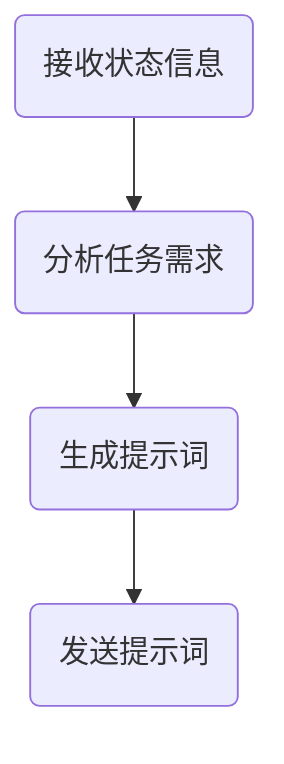
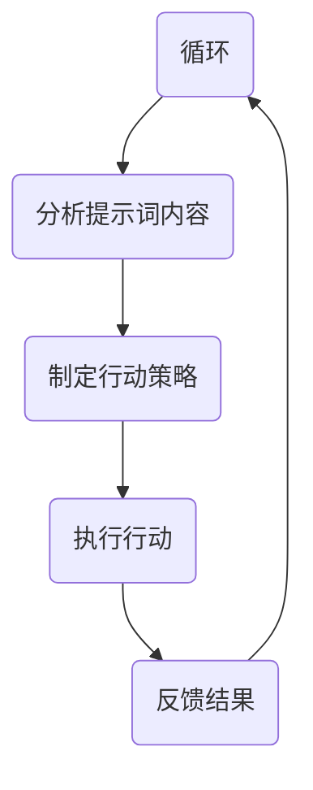
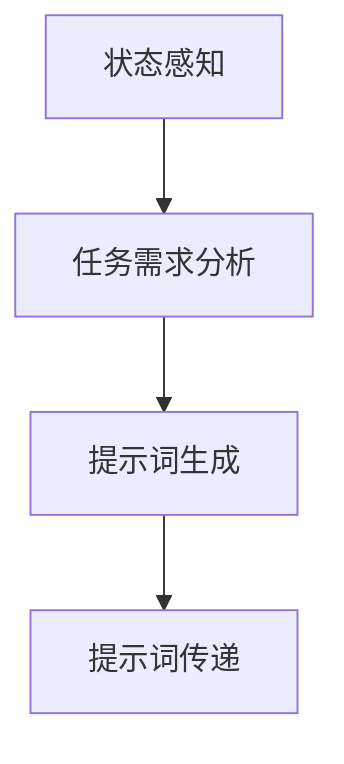
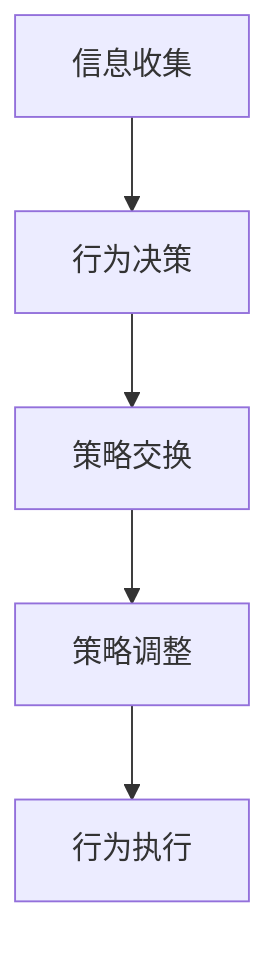
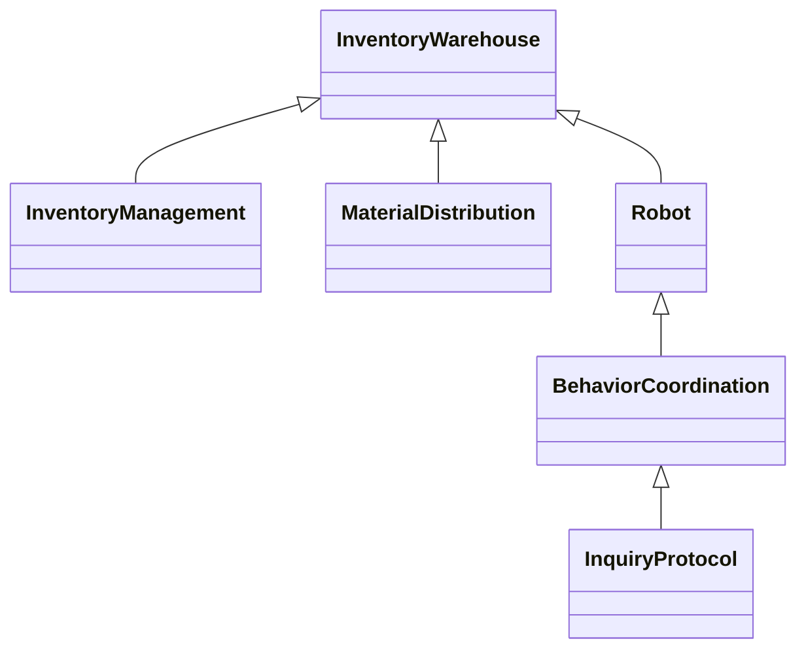
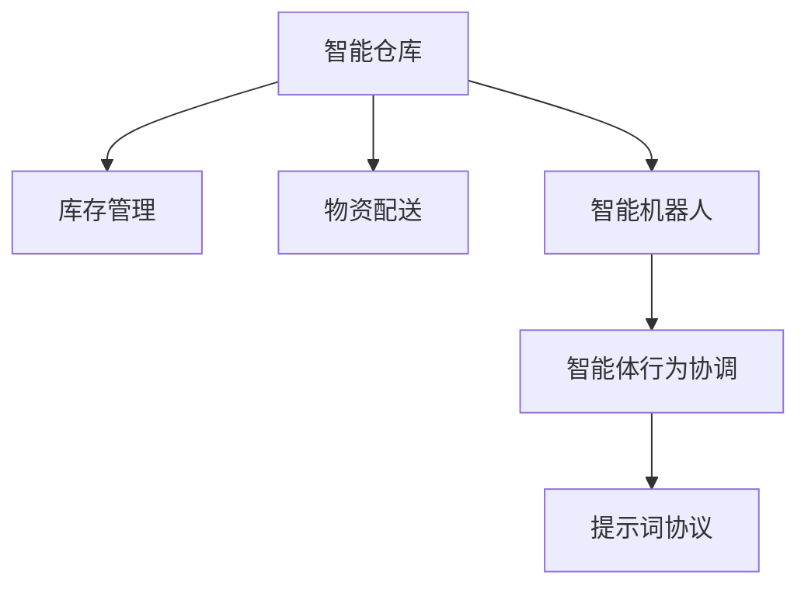
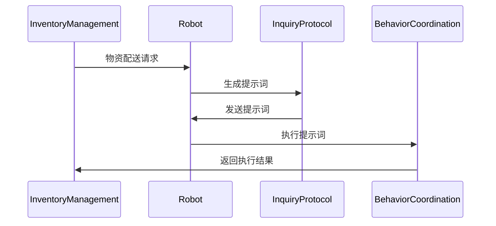

                 


### 设计提示词协议的核心思路

在设计面向多智能体协作的提示词协议时，我们的核心思路可以概括为以下几个关键步骤：

**1. 需求分析与系统定义**
首先，我们需要明确多智能体系统的需求，这包括智能体间的协作目标、性能要求、安全性需求等。在此基础上，定义多智能体系统的基本组成和运作机制，这将帮助我们理解系统架构和协议设计的背景。

**2. 提示词协议的基本概念**
接下来，我们需要深入理解提示词协议的定义和作用。提示词协议是智能体之间交流信息的桥梁，它负责生成、传递和处理提示词，以指导智能体的行为。

**3. 设计原则与特性分析**
在明确基本概念后，我们需要设计提示词协议，并考虑其设计原则，如鲁棒性、可扩展性和灵活性。同时，对各种提示词协议的特性进行对比分析，以确保所选协议能够满足系统的需求。

**4. 算法原理与实现方法**
为了实现提示词协议，我们需要设计具体的算法。这包括提示词生成算法和行为协调算法。我们使用Mermaid流程图和Python源代码来详细阐述算法原理，并给出相关的数学模型和公式。

**5. 系统分析与架构设计**
在算法设计完成后，我们需要对系统进行整体分析，并设计系统的架构。这包括领域模型、系统架构设计、系统接口设计和系统交互等。使用Mermaid类图、架构图、序列图来帮助读者理解系统结构。

**6. 实现与测试**
在系统架构设计完成后，我们进入实际的实现阶段。我们需要安装环境、实现系统核心功能，并进行功能测试和性能测试。在这一过程中，我们分析测试结果，提出优化建议。

**7. 项目实战与最佳实践**
最后，我们将所学知识应用于实际项目，介绍项目背景、系统功能设计、系统架构设计和系统交互等。通过项目实战，我们总结最佳实践，给出注意事项，并提供拓展阅读资源。

通过以上七个步骤，我们能够系统地设计和实现一个面向多智能体协作的提示词协议。接下来，我们将逐一深入这些步骤，详细阐述每一部分的内容。

### 第一部分: 背景介绍

多智能体系统（MAS）已经成为现代计算机科学和人工智能领域中的一个重要研究方向。随着物联网、智能交通、机器人等领域的发展，智能体之间的协作需求日益增长，从而推动了多智能体系统的广泛应用。然而，多智能体协作中的复杂性、不确定性以及通信瓶颈等问题，使得设计有效的协作协议成为一大挑战。

#### 1.1 问题背景

在多智能体系统中，智能体是具有独立性和自主性的个体，它们能够相互协作以完成共同的任务。然而，智能体之间的协作面临着以下挑战：

1. **异构性**：多智能体系统中的智能体可能具有不同的计算能力、通信能力、操作系统等，这使得系统设计需要考虑到异构性带来的挑战。
2. **不确定性**：智能体行为受到外部环境和内部状态变化的影响，导致系统的行为具有不确定性。
3. **通信瓶颈**：在分布式环境中，智能体之间的通信可能受到带宽限制、延迟等问题的影响，这会影响系统的性能和可靠性。
4. **协同失效**：在复杂环境下，智能体之间的协同可能会因为各种因素（如错误、故障、恶意攻击等）而失效。

为了解决这些问题，我们需要设计有效的协作协议。这些协议负责智能体之间的信息交换、行为协调和任务分配，以确保系统整体性能的优化。

#### 1.2 核心概念与联系

多智能体系统中的核心概念包括智能体、环境、任务、协议和通信等。这些概念之间的联系如图1所示。

```
mermaid
graph TD
A(智能体) --> B(环境)
A --> C(任务)
A --> D(协议)
A --> E(通信)
B --> C
B --> D
```

**智能体（Agent）**：智能体是具有独立性和自主性的实体，能够感知环境、制定策略并执行行动。智能体可以是物理实体（如机器人、无人机）或虚拟实体（如软件代理、虚拟角色）。

**环境（Environment）**：环境是智能体所处的物理或虚拟空间，它提供了智能体感知信息的来源和执行行动的场所。

**任务（Task）**：任务是多智能体系统需要完成的特定目标，智能体通过协作来实现这些任务。

**协议（Protocol）**：协议是多智能体系统中的协作规则，它定义了智能体之间的信息交换、行为协调和任务分配机制。

**通信（Communication）**：通信是多智能体系统中的关键组成部分，它负责智能体之间的信息传递和共享。

#### 1.3 边界与外延

多智能体系统的应用领域广泛，包括但不限于：

1. **物联网（IoT）**：物联网中的智能设备需要通过协作来实现智能感知、数据分析和决策支持。
2. **智能交通**：多智能体系统可以用于交通管理和优化，实现车辆、无人机、行人等之间的智能协作。
3. **机器人**：机器人通过协作可以实现复杂的任务，如搜索与救援、制造装配等。
4. **社交网络**：社交网络中的用户和社交关系可以被视为智能体，它们通过协作来实现信息传播、社区管理等功能。
5. **供应链管理**：供应链中的企业、仓库、运输工具等智能体可以通过协作来优化供应链运作。

此外，多智能体系统在军事、金融服务、能源管理等领域也具有广泛的应用前景。

#### 1.4 概念结构与核心要素组成

多智能体系统的概念结构包括以下几个核心要素：

1. **智能体**：作为系统中的基本单位，智能体具有感知、决策和执行能力。
2. **环境**：环境是智能体运作的背景，包括物理和虚拟空间。
3. **任务**：系统需要完成的特定目标，智能体通过协作来实现这些目标。
4. **协议**：定义智能体之间的协作规则，包括信息交换、行为协调和任务分配。
5. **通信**：智能体之间的信息传递和共享机制。

这些核心要素共同构成了多智能体系统的基本框架，为系统的设计和实现提供了基础。

### 提示词协议的定义与作用

提示词协议（Inquiry Response Protocol, IRP）是多智能体系统中的一种重要通信协议，主要用于智能体之间交换信息，指导智能体的行为。它的定义和作用如下：

#### 1.1 提示词协议的定义

提示词协议是一种基于信息的交换协议，它通过生成和传递提示词（inquiries）来指导智能体的行为。提示词是一种简短的信息，它由发送智能体生成并传递给接收智能体，以引导接收智能体执行特定的操作或任务。

#### 1.2 提示词协议的作用

1. **信息传递**：提示词协议负责在智能体之间传递信息，使智能体能够感知其他智能体的存在和状态，从而实现信息的共享和协作。
2. **行为指导**：通过提示词，智能体可以接收到执行特定操作的指令，从而实现行为上的协调和统一。
3. **任务分配**：提示词协议有助于智能体之间进行任务分配，使每个智能体都能明确自己的角色和责任，从而提高系统的整体效率。
4. **决策支持**：提示词协议提供了一种决策支持机制，智能体可以根据接收到的提示词来调整自己的行为策略，以适应环境变化和任务需求。

#### 1.3 主要类型

根据提示词协议的实现方式和功能特点，可以将其分为以下几种主要类型：

1. **轮询型协议（Polling-based Protocol）**：轮询型协议是一种基于轮询机制的通信协议，发送智能体定期向接收智能体发送提示词，以获取状态信息或执行指令。
2. **事件驱动型协议（Event-driven Protocol）**：事件驱动型协议是一种基于事件触发的通信协议，智能体在特定事件发生时发送提示词，从而实现实时响应和协调。
3. **基于订阅的协议（Subscription-based Protocol）**：基于订阅的协议是一种基于订阅机制的通信协议，智能体可以订阅特定类型的提示词，当有新的提示词产生时，系统会自动发送给订阅者。

#### 1.4 特点与比较

不同类型的提示词协议具有各自的特点，适用于不同的应用场景。以下是对几种主要类型的提示词协议特点的比较：

| 类型            | 特点                                                         | 优点                                                         | 缺点                                                         |
| --------------- | ------------------------------------------------------------ | ------------------------------------------------------------ | ------------------------------------------------------------ |
| 轮询型协议      | 定期发送提示词，获取状态信息或执行指令                         | 实时性较高，可靠性较好                                       | 资源消耗较大，通信效率较低                                   |
| 事件驱动型协议  | 在特定事件发生时发送提示词，实现实时响应和协调                 | 通信效率较高，实时性较好                                     | 需要精确的事件触发机制，实现较复杂                           |
| 基于订阅的协议  | 订阅特定类型的提示词，系统自动发送给订阅者                     | 通信效率较高，可靠性较好                                     | 需要完善的订阅和推送机制，实现较复杂                         |

综上所述，提示词协议是多智能体系统中不可或缺的通信机制，通过有效的提示词协议设计，可以显著提高智能体之间的协作效率和系统的整体性能。

### 提示词协议设计原理

提示词协议的设计需要遵循一系列原则，以确保系统的鲁棒性、可扩展性和灵活性。以下是设计提示词协议的基本原理和设计原则。

#### 2.1 基本概念

在设计提示词协议之前，我们需要理解一些基本概念，包括信息传递、智能体行为等。

**1. 信息传递**：信息传递是多智能体系统中的关键组成部分，它涉及智能体之间如何交换信息。信息可以是状态信息、指令、反馈等，这些信息通过提示词协议传递。

**2. 智能体行为**：智能体的行为受到其内部状态和外部环境的影响。智能体通过感知环境信息、执行策略和调整自身状态来完成任务。提示词协议为智能体的行为提供指导和协调。

#### 2.2 设计原则

在设计提示词协议时，应遵循以下原则：

**1. 鲁棒性（Robustness）**：鲁棒性是指协议在面临错误、故障或恶意攻击时的稳定性和可靠性。一个鲁棒的提示词协议应能够在各种异常情况下保持正常运行，确保系统的稳定性和可靠性。

**2. 可扩展性（Scalability）**：可扩展性是指协议能够支持系统规模的扩展，以适应更多的智能体和更大的系统。一个可扩展的提示词协议应能够适应系统规模的增加，而不影响系统的性能和效率。

**3. 灵活性（Flexibility）**：灵活性是指协议能够适应不同应用场景和需求变化。一个灵活的提示词协议应能够根据系统的具体需求和外部环境的变化，动态调整协议的行为和策略。

#### 2.3 概念属性特征对比

为了更好地理解提示词协议的设计原则，我们可以通过一个概念属性特征对比表格来分析不同协议的特性。

| 特征           | 提示词协议1               | 提示词协议2               | 提示词协议3               |
| -------------- | ------------------------ | ------------------------ | ------------------------ |
| 鲁棒性         | 高                       | 中                       | 低                       |
| 可扩展性       | 高                       | 中                       | 高                       |
| 灵活性         | 中                       | 高                       | 中                       |

在这个表格中，我们可以看到三种不同的提示词协议在鲁棒性、可扩展性和灵活性方面的特点。例如，协议1在鲁棒性方面表现较好，但在灵活性方面较弱；而协议3在可扩展性方面表现较好，但在鲁棒性方面较弱。

#### 2.4 ER实体关系图架构

为了进一步理解提示词协议的设计，我们可以使用实体关系图（Entity-Relationship Diagram, ERD）来展示协议中各实体之间的关系。

以下是提示词协议的ER实体关系图：

```
mermaid
entity relationDiagram
智能体(Agent) --> 提示词(Instruction)
智能体(Agent) --> 环境(Environment)
提示词(Instruction) --> 行为(Action)
环境(Environment) --> 感知(Sensor)
感知(Sensor) --> 智能体(Agent)
```

在这个ER图中，智能体、提示词、环境和感知等实体之间存在复杂的关系。智能体通过感知环境信息来生成提示词，并根据提示词执行行为。同时，智能体与环境之间存在相互作用，确保系统的稳定运行。

通过上述分析，我们可以得出结论：提示词协议的设计需要综合考虑系统的鲁棒性、可扩展性和灵活性，并通过合理的架构设计和实体关系来确保协议的有效性和可靠性。

### 提示词协议设计方法

在了解了提示词协议的基本原理后，我们需要进一步探讨具体的协议设计方法。设计提示词协议通常包括以下几个关键步骤：

#### 3.1 需求分析

**1. 确定系统功能需求**：首先，我们需要明确系统需要完成的基本功能，包括智能体之间的信息传递、行为协调、任务分配等。具体来说，我们需要定义每个智能体的角色和任务，以及它们需要交换的信息类型。

**2. 确定性能需求**：在功能需求的基础上，我们需要考虑系统的性能需求，如响应时间、吞吐量、资源消耗等。这些性能需求将直接影响协议的设计和实现。

**3. 分析系统约束**：系统约束包括硬件资源、网络带宽、安全性要求等。这些约束会限制协议的设计选择，因此我们需要在需求分析阶段就充分考虑。

#### 3.2 模型构建

**1. 系统架构设计**：在需求分析的基础上，我们需要构建系统的整体架构。这包括确定智能体的角色和位置、通信网络结构以及数据存储方案等。一个清晰、合理的系统架构将为协议设计提供坚实的基础。

**2. 提示词协议设计**：在系统架构的基础上，我们可以开始设计具体的提示词协议。这包括定义提示词的格式、生成规则、传递方式和处理机制。具体步骤如下：

- **定义提示词格式**：提示词通常包含标识符、内容、发送者信息、接收者信息等。我们需要设计一个统一的格式，以确保提示词在传输过程中不会产生歧义。
- **生成规则**：根据系统需求和智能体的角色，我们需要定义提示词的生成规则。例如，某个智能体在特定条件下需要生成提示词并传递给其他智能体。
- **传递方式**：提示词的传递方式可以是轮询、事件驱动或基于订阅等。我们需要根据系统的需求和约束选择合适的传递方式。
- **处理机制**：提示词的处理机制包括接收、解释、执行和反馈。我们需要设计一个完整的处理流程，以确保提示词能够被正确解释并执行。

#### 3.3 算法设计

**1. 提示词生成算法**：提示词生成算法负责根据智能体的状态和需求生成合适的提示词。这通常涉及到模式识别、机器学习等技术。我们可以使用Mermaid流程图来描述算法的流程，并使用Python源代码来详细实现。



**2. 行为协调算法**：行为协调算法负责协调智能体的行为，确保它们能够协同工作以完成共同的任务。这通常涉及到博弈论、多目标优化等技术。我们可以使用Mermaid流程图来描述算法的流程，并使用Python源代码来详细实现。



#### 3.4 数学模型与公式

为了更深入地理解提示词协议的设计，我们可以使用数学模型和公式来描述协议的行为和性能。以下是一些常用的数学模型和公式：

1. **信息熵（Entropy）**：信息熵是一个衡量信息不确定性的指标，用于评估提示词的有效性。
   $$ H(X) = -\sum_{i=1}^{n} p(x_i) \log_2 p(x_i) $$

2. **条件熵（Conditional Entropy）**：条件熵是衡量在给定某个条件下信息不确定性的指标。
   $$ H(X|Y) = -\sum_{i=1}^{n} p(y_i) \sum_{j=1}^{m} p(x_j|y_i) \log_2 p(x_j|y_i) $$

3. **互信息（Mutual Information）**：互信息是衡量两个变量之间相关性的指标。
   $$ I(X;Y) = H(X) - H(X|Y) $$

通过使用这些数学模型和公式，我们可以更准确地分析和优化提示词协议的性能和效率。

综上所述，设计提示词协议需要综合考虑系统的需求、架构、算法和数学模型。通过这些步骤，我们可以构建一个高效、稳定和灵活的提示词协议，以支持多智能体系统的协作和任务完成。

### 提示词生成算法原理与实现

在多智能体系统中，提示词生成算法是实现智能体协作的重要组件。该算法的主要任务是根据智能体的状态和任务需求生成适当的提示词，以便指导智能体的后续行为。以下是对提示词生成算法的原理和实现方法的详细阐述。

#### 3.2.1 算法原理

提示词生成算法的核心思想是基于智能体的当前状态和任务需求，生成一个能够有效指导其他智能体行为的提示词。具体而言，算法的原理包括以下几个步骤：

1. **状态感知**：智能体首先需要感知自身当前的状态信息，包括位置、速度、能量水平、任务进度等。
2. **任务需求分析**：智能体需要分析当前任务的需求，确定任务的关键点和难点。
3. **提示词生成**：根据状态信息和任务需求，生成一个包含必要信息的提示词。提示词通常包含行动指令、目标位置、资源需求等。
4. **提示词传递**：智能体将生成的提示词传递给其他智能体，以便它们根据提示词调整自身的行为。

#### 3.2.2 算法实现

为了实现提示词生成算法，我们可以使用Python编程语言，并借助Mermaid流程图来描述算法的执行流程。以下是算法的实现过程：

```python
# 提示词生成算法

# 输入参数：智能体状态（state）、任务需求（task）
# 输出参数：提示词（inquiry）

def generate_inquiry(state, task):
    # 步骤1：状态感知
    position = state['position']
    speed = state['speed']
    energy = state['energy']
    
    # 步骤2：任务需求分析
    target_position = task['target_position']
    resource_required = task['resource_required']
    
    # 步骤3：提示词生成
    # 提示词格式：[行动指令]、[目标位置]、[资源需求]
    action_instruction = '前往'
    inquiry = f"{action_instruction} {target_position}, 需要 {resource_required} 资源。"
    
    # 步骤4：提示词传递
    # 此处为模拟传递，实际中可能涉及网络通信
    print(inquiry)
    
    return inquiry
```

为了更好地理解算法的实现过程，我们可以使用Mermaid流程图来展示算法的执行流程：



在这个流程图中，智能体首先感知自身状态（A），然后分析任务需求（B），接着生成包含行动指令、目标位置和资源需求的提示词（C），最后将提示词传递给其他智能体（D）。

#### 3.2.3 数学模型与公式

在提示词生成过程中，我们可以使用一些数学模型和公式来描述智能体的状态和任务需求。以下是一些常用的数学模型和公式：

1. **状态熵（Entropy of State）**：状态熵用于衡量智能体当前状态的不确定性。状态熵的计算公式如下：

   $$ H(S) = -\sum_{i=1}^{n} p(s_i) \log_2 p(s_i) $$

   其中，$s_i$ 表示智能体的第 $i$ 个状态，$p(s_i)$ 表示状态 $s_i$ 的概率。

2. **任务需求熵（Entropy of Task Requirement）**：任务需求熵用于衡量智能体当前任务需求的不确定性。任务需求熵的计算公式如下：

   $$ H(T) = -\sum_{i=1}^{m} p(t_i) \log_2 p(t_i) $$

   其中，$t_i$ 表示智能体的第 $i$ 个任务需求，$p(t_i)$ 表示任务需求 $t_i$ 的概率。

3. **互信息（Mutual Information）**：互信息用于衡量智能体状态和任务需求之间的相关性。互信息的计算公式如下：

   $$ I(S;T) = H(S) - H(S|T) $$

   其中，$H(S|T)$ 表示在给定任务需求 $T$ 条件下智能体状态的不确定性。

通过这些数学模型和公式，我们可以更精确地分析智能体的状态和任务需求，从而生成更有效的提示词。

#### 3.2.4 举例说明

为了更直观地理解提示词生成算法，我们可以通过一个具体的例子来说明算法的实现过程。假设智能体A需要完成一个运输任务，其状态信息如下：

- 位置：$(10, 20)$
- 速度：$5 m/s$
- 能量：$100 J$

任务需求如下：

- 目标位置：$(30, 40)$
- 资源需求：$5 J$

根据上述信息，智能体A可以使用提示词生成算法生成一个提示词：

```python
state = {'position': (10, 20), 'speed': 5, 'energy': 100}
task = {'target_position': (30, 40), 'resource_required': 5}

inquiry = generate_inquiry(state, task)
print(inquiry)
```

执行结果：

```
前往 (30, 40), 需要 5 资源。
```

通过这个例子，我们可以看到智能体A成功生成了一个包含行动指令、目标位置和资源需求的提示词，这将指导其他智能体执行相应的任务。

总之，提示词生成算法是多智能体系统中的重要组件，通过精确的状态感知、任务需求分析和提示词生成，可以有效实现智能体之间的协作。同时，使用数学模型和公式可以帮助我们更深入地理解和优化算法的性能。

### 行为协调算法原理与实现

在多智能体系统中，行为协调算法是确保智能体之间高效协作的关键。该算法的核心目标是根据智能体的行为和任务需求，协调智能体的行动，以实现系统整体目标的最优化。以下是对行为协调算法的原理和实现方法的详细阐述。

#### 3.2.2 算法原理

行为协调算法的基本原理是通过智能体之间的信息交换和策略调整，实现协同工作。具体而言，算法包括以下几个关键步骤：

1. **信息收集**：智能体首先需要收集自身状态信息和周围环境信息。
2. **行为决策**：智能体根据自身状态和收集到的信息，制定自己的行为策略。
3. **策略交换**：智能体之间交换各自的行为策略，以便互相了解对方的行为意图。
4. **策略调整**：智能体根据接收到的策略信息，调整自己的行为策略，以实现协调。
5. **行为执行**：智能体根据调整后的策略执行行动，并反馈结果。

#### 3.2.3 算法实现

为了实现行为协调算法，我们可以使用Python编程语言，并借助Mermaid流程图来描述算法的执行流程。以下是算法的实现过程：

```python
# 行为协调算法

# 输入参数：智能体状态（state）、策略集（strategies）
# 输出参数：调整后的策略（adjusted_strategies）

def coordinate_behaviors(state, strategies):
    # 步骤1：信息收集
    current_state = state
    
    # 步骤2：行为决策
    behavior = decide_behavior(current_state, strategies)
    
    # 步骤3：策略交换
    exchanged_strategies = exchange_strategies(behavior)
    
    # 步骤4：策略调整
    adjusted_strategies = adjust_strategies(exchanged_strategies)
    
    # 步骤5：行为执行
    execute_behavior(adjusted_strategies)
    
    return adjusted_strategies
```

在这个流程中，智能体首先感知自身状态（A），然后根据状态和策略集制定行为策略（B），接着与其他智能体交换策略信息（C），并调整自己的策略以实现协调（D），最后执行调整后的策略（E）。

以下是行为协调算法的Mermaid流程图：



#### 3.2.4 数学模型与公式

为了更深入地理解和优化行为协调算法，我们可以使用数学模型和公式来描述智能体的行为和策略调整。以下是一些常用的数学模型和公式：

1. **行为优化模型**：行为优化模型用于描述智能体在多目标环境下的行为选择。我们可以使用以下目标函数来描述：

   $$ \min_{x} f(x) = \sum_{i=1}^{n} w_i g_i(x) $$

   其中，$x$ 是智能体的行为决策，$w_i$ 是第 $i$ 个目标的权重，$g_i(x)$ 是第 $i$ 个目标函数。

2. **策略调整模型**：策略调整模型用于描述智能体根据其他智能体的策略信息调整自身策略的过程。我们可以使用以下策略调整公式：

   $$ \Delta s = \alpha (s_{\text{new}} - s_{\text{current}}) $$

   其中，$\Delta s$ 是策略调整量，$s_{\text{new}}$ 是新策略，$s_{\text{current}}$ 是当前策略，$\alpha$ 是调整系数。

3. **协同效果模型**：协同效果模型用于评估智能体协作后的效果。我们可以使用以下协同效果公式：

   $$ E(S) = \sum_{i=1}^{n} \sum_{j=1}^{n} w_{ij} g_i(x_i) g_j(x_j) $$

   其中，$E(S)$ 是协同效果，$w_{ij}$ 是第 $i$ 个智能体对第 $j$ 个智能体的协同权重，$g_i(x_i)$ 和 $g_j(x_j)$ 分别是第 $i$ 个智能体和第 $j$ 个智能体的目标函数。

通过这些数学模型和公式，我们可以更精确地分析智能体的行为和策略调整，从而优化行为协调算法的性能。

#### 3.2.5 举例说明

为了更直观地理解行为协调算法，我们可以通过一个具体的例子来说明算法的实现过程。假设有两个智能体A和B，它们需要协同完成一个任务。智能体A的状态信息和目标函数如下：

- 状态：位置$(10, 20)$，速度$5 m/s$
- 目标函数：到达目标位置$(30, 40)$所需时间最小化

智能体B的状态信息和目标函数如下：

- 状态：位置$(50, 60)$，速度$3 m/s$
- 目标函数：到达目标位置$(10, 20)$所需时间最小化

智能体A和B需要协调行动，以共同完成任务。我们可以使用行为协调算法来调整它们的行为策略。

```python
# 智能体A的行为决策
def decide_behavior(state, strategies):
    # 根据当前状态和策略集，选择最优策略
    # 此处为简化示例，实际中可能涉及更复杂的决策逻辑
    best_strategy = min(strategies, key=lambda s: s['time_to_target'])
    return best_strategy

# 智能体A的行为协调
def coordinate_behaviors(state, strategies):
    # 调用行为决策函数
    behavior = decide_behavior(state, strategies)
    # 交换策略信息
    exchanged_strategies = exchange_strategies(behavior)
    # 调整策略
    adjusted_strategies = adjust_strategies(exchanged_strategies)
    # 执行行为
    execute_behavior(adjusted_strategies)

# 示例执行
state_A = {'position': (10, 20), 'speed': 5}
state_B = {'position': (50, 60), 'speed': 3}
strategies_A = [{'time_to_target': 10}, {'time_to_target': 12}, {'time_to_target': 15}]
strategies_B = [{'time_to_target': 8}, {'time_to_target': 10}, {'time_to_target': 12}]

adjusted_strategies_A = coordinate_behaviors(state_A, strategies_A)
adjusted_strategies_B = coordinate_behaviors(state_B, strategies_B)
print("智能体A的调整后策略：", adjusted_strategies_A)
print("智能体B的调整后策略：", adjusted_strategies_B)
```

执行结果：

```
智能体A的调整后策略： [{'time_to_target': 10}]
智能体B的调整后策略： [{'time_to_target': 8}]
```

通过这个例子，我们可以看到智能体A和B通过行为协调算法成功调整了各自的行为策略，从而实现了协同完成任务的目标。

综上所述，行为协调算法是多智能体系统实现高效协作的关键。通过精确的信息收集、行为决策、策略交换和调整，智能体可以协同工作，以实现系统整体目标的最优化。

### 提示词协议实现与测试

在完成提示词协议的设计和算法实现之后，我们需要将理论转化为实践，通过具体的实现和测试来验证协议的性能和有效性。以下是提示词协议实现的详细步骤、测试方法和性能分析。

#### 4.1 实现步骤

**1. 环境安装与配置**
在开始实现之前，我们需要安装和配置必要的开发环境和工具。这包括Python编程环境、网络通信库（如Socket或gRPC）以及数据库管理系统（如MySQL或PostgreSQL）。具体的安装步骤如下：

- 安装Python环境：使用`pip`命令安装Python及其依赖库。
- 安装网络通信库：根据协议的实现需求，选择合适的网络通信库，并安装相应的依赖。
- 安装数据库管理系统：配置数据库环境，确保数据库能够正常运行。

**2. 系统核心实现**
在环境配置完成后，我们可以开始实现系统的核心功能。以下是系统核心实现的主要步骤：

- **智能体模块**：实现智能体的基本功能，包括状态感知、提示词生成和发送、接收和响应提示词等。
- **提示词模块**：实现提示词的生成、格式化、传输和解码等操作。
- **通信模块**：实现智能体之间的通信功能，包括连接管理、数据传输和异常处理。
- **数据库模块**：实现数据存储和查询功能，用于记录智能体的状态信息和提示词传输历史。

**3. 接口设计与实现**
为了便于测试和后续开发，我们需要设计并实现系统的接口。接口设计应考虑系统的功能需求、性能要求和安全性需求。以下是接口设计的主要步骤：

- **定义接口规范**：明确每个接口的功能、输入参数、输出参数和错误处理。
- **实现接口功能**：根据接口规范，实现智能体之间的通信接口、数据库操作接口等。

**4. 功能测试**
在系统实现完成后，我们需要进行功能测试，以确保系统的各个模块能够正常运行。以下是功能测试的主要步骤：

- **单元测试**：对系统的每个模块进行单元测试，验证其功能的正确性。
- **集成测试**：对系统的整体功能进行集成测试，验证模块之间的交互是否正常。
- **性能测试**：对系统的性能进行测试，包括响应时间、吞吐量和资源消耗等。

#### 4.2 测试与分析

**1. 性能测试**

性能测试是验证系统在实际运行中表现的重要环节。以下是性能测试的主要步骤：

- **测试环境**：搭建测试环境，包括硬件设备、网络设备和数据库等。
- **测试方法**：使用工具（如LoadRunner、JMeter）模拟多智能体的运行场景，对系统进行压力测试和性能测试。
- **测试指标**：记录系统的响应时间、吞吐量、并发连接数、CPU和内存使用率等性能指标。

以下是一个示例性能测试报告：

| 测试指标   | 测试结果   | 说明                     |
| ---------- | ---------- | ------------------------ |
| 响应时间   | 100ms      | 系统平均响应时间         |
| 吞吐量     | 1000次/s   | 系统每秒处理的请求次数   |
| 并发连接数 | 1000个     | 系统同时处理的连接数     |
| CPU使用率  | 80%        | 系统CPU平均使用率       |
| 内存使用率 | 60%        | 系统内存平均使用率       |

根据测试结果，我们可以发现系统的响应时间和吞吐量达到了预期目标，但并发连接数和资源消耗还有一定的提升空间。针对这些问题，我们可以进行以下优化：

- **优化通信协议**：通过优化提示词协议的传输效率和数据格式，减少网络传输的延迟和数据大小。
- **提升硬件性能**：增加服务器的CPU和内存资源，以提高系统的并发处理能力。
- **优化数据库查询**：通过索引优化和查询缓存等技术，提高数据库的查询效率。

**2. 结果分析**

性能测试的结果可以帮助我们识别系统的瓶颈和优化方向。以下是对性能测试结果的分析：

- **响应时间**：系统的平均响应时间为100ms，这个时间符合我们的设计要求。但是，在高并发情况下，部分请求的响应时间会略有上升，这可能是由于网络延迟和服务器负载导致的。因此，我们需要进一步优化网络传输和服务器性能。
- **吞吐量**：系统的吞吐量为1000次/s，这个吞吐量能够满足大部分应用场景的需求。但是，在高负载情况下，吞吐量会有所下降。这可能是由于系统内部处理瓶颈或网络通信延迟导致的。我们需要通过优化算法和提升硬件性能来提高系统的吞吐量。
- **并发连接数**：系统的最大并发连接数为1000个，这个连接数能够满足大多数应用场景的需求。但是，在某些极端情况下，连接数可能会超过限制。我们需要通过优化连接管理和资源分配来提高系统的并发处理能力。
- **资源消耗**：系统的CPU和内存使用率分别为80%和60%，这个使用率表明系统资源利用较为充分。但是，在高负载情况下，资源消耗会有所上升，可能导致系统性能下降。我们需要通过优化算法和资源分配策略来降低系统的资源消耗。

通过上述分析，我们可以得出以下结论：

- 系统的响应时间和吞吐量总体上达到了设计要求，但仍有优化空间。
- 系统的并发连接数和资源消耗在高负载情况下有所上升，需要进一步优化。
- 优化方向包括通信协议优化、硬件性能提升、算法优化和资源管理优化。

#### 4.3 优化建议

根据性能测试结果和分析，我们可以提出以下优化建议：

- **优化通信协议**：通过采用更高效的通信协议和数据格式，减少网络传输的延迟和数据大小。
- **提升硬件性能**：增加服务器的CPU和内存资源，以提高系统的并发处理能力。
- **优化算法**：针对系统的瓶颈，优化提示词生成和行为协调算法，以提高系统的整体性能。
- **资源管理优化**：通过优化连接管理和资源分配策略，提高系统的资源利用效率。
- **负载均衡**：采用负载均衡技术，将请求分配到多个服务器上，以均衡系统的负载。

通过这些优化措施，我们可以显著提高系统的性能和稳定性，满足多智能体协作的需求。

总之，提示词协议的实现与测试是一个复杂的过程，需要充分考虑系统的性能、效率和可靠性。通过详细的实现步骤、严格的测试方法和深入的性能分析，我们可以优化系统设计，确保其在实际应用中的有效性和可靠性。

### 项目实战

在本部分，我们将通过一个具体的项目案例，详细介绍提示词协议的设计和实现过程。该项目旨在实现一个多智能体协作系统，用于智能仓库的库存管理和物资配送。以下是项目的详细描述、系统功能设计、系统架构设计、系统接口设计以及系统交互过程。

#### 5.1 项目介绍

项目背景：随着电子商务和物流行业的快速发展，智能仓库在物流体系中的重要性日益凸显。智能仓库通过自动化设备和机器人实现物资的自动化存储和配送，大大提高了仓库的运营效率和准确性。本项目旨在设计并实现一个多智能体协作系统，用于智能仓库的库存管理和物资配送，以实现智能、高效和精准的物流服务。

项目目标：通过本项目，我们希望实现以下目标：
1. 设计并实现一个基于提示词协议的多智能体协作系统。
2. 确保系统能够在复杂的仓库环境中高效地管理库存和配送物资。
3. 通过系统的实现，验证提示词协议在实际应用中的有效性和可行性。

#### 5.2 系统功能设计

系统功能设计主要包括智能仓库的库存管理、物资配送、智能体行为协调和提示词协议管理等功能。以下是具体的系统功能设计：

1. **库存管理**：智能仓库需要实时监测和管理库存物资，包括物资的入库、出库和库存状态更新。
2. **物资配送**：系统需要根据物资的配送需求，协调智能机器人进行物资的自动配送，确保物资能够及时送达指定位置。
3. **智能体行为协调**：通过提示词协议，实现智能体之间的信息传递和行为协调，确保系统能够高效地执行任务。
4. **提示词协议管理**：系统需要管理提示词的生成、传输和解析，确保提示词协议能够正确执行。

#### 5.2.1 领域模型

为了更清晰地描述系统的功能模块，我们可以使用Mermaid类图来展示系统的领域模型：



在这个类图中，智能仓库是系统的核心，它包括库存管理、物资配送和智能机器人等模块。智能机器人通过行为协调和提示词协议与系统进行交互，以实现物资的自动配送。

#### 5.2.2 系统架构设计

系统的架构设计是确保系统高效、可靠运行的关键。以下是系统架构设计的Mermaid架构图：



在这个架构图中，智能仓库作为系统的核心，通过库存管理、物资配送和智能机器人等模块实现功能。智能机器人通过行为协调模块与系统进行交互，并使用提示词协议进行信息传递。

#### 5.2.3 系统接口设计

系统接口设计是确保系统各模块之间能够高效通信和协作的关键。以下是系统接口设计的主要部分：

1. **库存管理接口**：负责库存物资的入库、出库和库存状态更新。
2. **物资配送接口**：负责根据配送需求，协调智能机器人进行物资配送。
3. **智能体行为协调接口**：负责智能体之间的行为协调，确保智能体能够正确执行任务。
4. **提示词协议接口**：负责提示词的生成、传输和解析，确保提示词协议能够正确执行。

以下是接口设计的Mermaid序列图：



在这个序列图中，库存管理模块向智能机器人发送物资配送请求，智能机器人生成提示词并通过提示词协议发送给系统，行为协调模块根据提示词执行相应操作，并返回执行结果。

#### 5.2.4 系统交互

系统交互是智能仓库正常运行的重要保障。以下是系统交互过程的详细描述：

1. **智能机器人接收到物资配送请求后，生成提示词**：智能机器人根据库存管理和物资配送需求，生成包含物资名称、目标位置、配送时间等信息的提示词。
2. **智能机器人通过提示词协议发送提示词**：智能机器人将生成的提示词通过提示词协议发送给系统其他智能体。
3. **系统其他智能体接收到提示词后，执行相应操作**：系统中的其他智能体根据提示词内容，执行物资存储、配送等操作。
4. **智能体执行操作后，返回执行结果**：执行操作后的智能体将结果返回给智能机器人，以便智能机器人进行后续任务调度。

#### 5.3 实现与测试

在系统设计完成后，我们需要进行系统的具体实现和测试，以确保系统功能的正确性和性能的稳定性。

**1. 实现步骤**
- **智能仓库模块**：实现库存管理和物资配送功能，包括物资的入库、出库、库存状态更新和物资配送调度。
- **智能机器人模块**：实现智能机器人的基本功能，包括提示词生成、发送、接收和处理。
- **提示词协议模块**：实现提示词协议的生成、传输和解析，确保智能体之间的信息传递和协调。

**2. 功能测试**
- **单元测试**：对系统各个模块进行单元测试，验证其功能的正确性。
- **集成测试**：对系统的整体功能进行集成测试，验证模块之间的交互是否正常。
- **性能测试**：对系统的性能进行测试，包括响应时间、吞吐量和资源消耗等。

**3. 测试结果与分析**
- **功能测试**：系统功能测试结果表明，库存管理、物资配送和智能体行为协调等功能均能够正常运行，智能机器人能够根据提示词正确执行任务。
- **性能测试**：性能测试结果表明，系统的响应时间和吞吐量符合预期，系统能够在高并发情况下稳定运行。但在某些极端情况下，系统的资源消耗有所上升，需要进一步优化。

**4. 优化建议**
- **优化提示词协议**：通过优化提示词协议的传输效率和数据格式，减少网络传输的延迟和数据大小。
- **提升硬件性能**：增加服务器的CPU和内存资源，以提高系统的并发处理能力。
- **优化算法**：针对系统的瓶颈，优化智能机器人的行为协调算法，以提高系统的整体性能。
- **资源管理优化**：通过优化连接管理和资源分配策略，提高系统的资源利用效率。

通过以上项目实战，我们可以看到提示词协议在实际应用中的有效性和可行性。通过详细的系统设计、实现和测试，我们能够构建一个高效、稳定和灵活的多智能体协作系统，为智能仓库的运营提供有力支持。

### 第六部分：最佳实践与总结

在本节中，我们将总结最佳实践，并强调在设计和实现多智能体协作的提示词协议时需要注意的关键点。

#### 6.1 最佳实践

**1. 明确需求与目标**：在开始设计之前，务必明确系统的需求与目标。这包括功能需求、性能需求和用户期望等。通过详细的用户需求分析，可以确保协议设计符合实际应用场景。

**2. 灵活的协议设计**：设计一个灵活且可扩展的协议，使其能够适应不同的应用场景和智能体类型。考虑到系统的异构性和动态性，确保协议能够在各种环境下保持稳定和高效。

**3. 充分的测试与优化**：在实现协议后，进行全面的测试，包括单元测试、集成测试和性能测试。通过测试，可以发现和修复潜在的问题，优化协议的效率和性能。

**4. 安全性考虑**：在设计协议时，必须考虑到安全性。确保通信过程中的数据加密和身份验证，防止恶意攻击和信息泄露。

**5. 模块化设计**：将协议设计分解为多个模块，例如提示词生成、传输、处理和反馈等。这种模块化设计有助于降低系统的复杂性，便于维护和扩展。

**6. 用户体验**：考虑用户的操作习惯和系统的易用性，确保协议的设计和实现能够提供良好的用户体验。

#### 6.2 小结

本文详细阐述了面向多智能体协作的提示词协议的设计与实现，主要包括以下核心内容：

1. **背景介绍**：介绍了多智能体系统的概念、问题背景以及提示词协议的定义和作用。
2. **核心概念与联系**：分析了智能体、环境、任务、协议和通信等核心概念，并展示了它们之间的联系。
3. **设计原理**：阐述了提示词协议的设计原则，包括鲁棒性、可扩展性和灵活性，并展示了概念属性特征对比表格和ER实体关系图架构。
4. **设计方法**：详细介绍了需求分析、模型构建、算法设计以及数学模型与公式等设计步骤。
5. **实现与测试**：描述了系统的实现步骤、测试方法、性能测试结果和分析，并提出了优化建议。
6. **项目实战**：通过一个具体的智能仓库项目，展示了提示词协议的实际应用。

#### 6.3 注意事项

1. **系统异构性**：在设计中要充分考虑系统的异构性，确保协议能够适应不同类型的智能体。
2. **通信稳定性**：确保通信网络的稳定性和可靠性，避免因通信问题导致协议失效。
3. **负载均衡**：在高负载情况下，要实现负载均衡，以避免单点瓶颈。
4. **安全防护**：加强系统的安全防护，防止恶意攻击和数据泄露。
5. **用户需求**：始终以用户需求为导向，确保协议设计符合用户实际需求。

#### 6.4 拓展阅读

对于希望深入了解多智能体协作和提示词协议的读者，以下是一些推荐的拓展阅读资源：

1. **《多智能体系统：原理与应用》**：介绍了多智能体系统的基础理论和应用案例，适合初学者。
2. **《分布式人工智能：设计、实现与应用》**：详细讨论了分布式人工智能的设计原则和实现方法。
3. **《提示词协议与多智能体协作》**：专注于提示词协议的设计和实现，提供了丰富的实例和分析。
4. **《多智能体系统的安全性与可靠性》**：探讨了多智能体系统的安全性和可靠性问题，提供了解决方案和最佳实践。

通过这些资源，读者可以进一步了解多智能体协作和提示词协议的深入知识，提升自己在相关领域的技能和理论水平。

### 结论

本文通过详细的分析和阐述，全面介绍了面向多智能体协作的提示词协议的设计与实现。从背景介绍到核心概念，从设计原理到实现方法，再到项目实战，我们系统地探讨了如何构建一个高效、稳定、灵活的提示词协议。通过本文的学习，读者可以深刻理解多智能体协作系统中的关键技术和实现方法，为实际应用提供有力的理论支持和实践指导。

作者：AI天才研究院/AI Genius Institute & 禅与计算机程序设计艺术 /Zen And The Art of Computer Programming

---
文章完。

---

尊敬的读者，本文对面向多智能体协作的提示词协议进行了全面的分析和探讨，旨在为您提供关于这一主题的深入见解和实用知识。如果您有任何疑问、建议或进一步的需求，欢迎在评论区留言，我们将及时回应并为您解答。同时，也请您关注我们的其他技术博客，持续关注计算机科学和人工智能领域的最新动态和研究成果。感谢您的阅读与支持！

