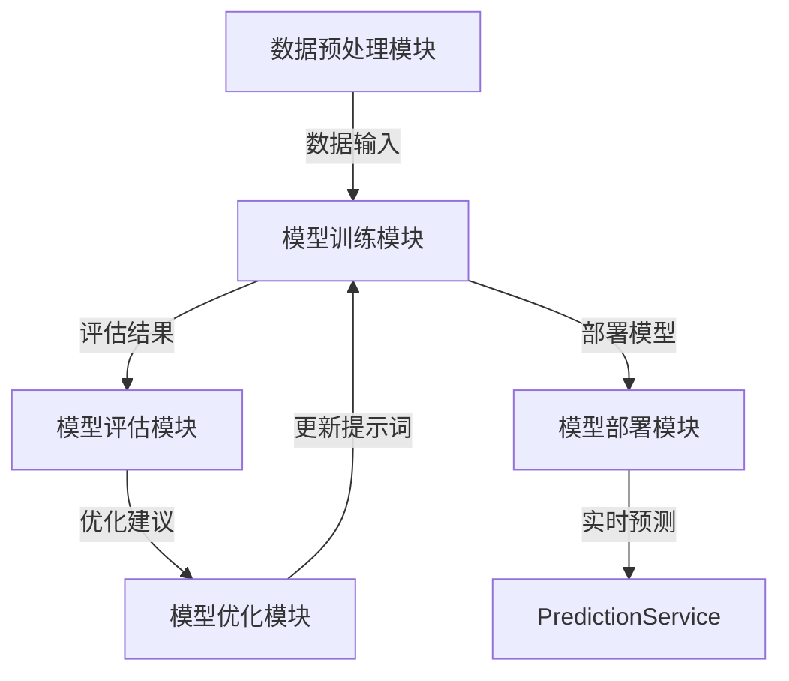

                 

## 机器学习Pipeline的基本概念与流程

机器学习Pipeline是指将数据从输入到模型训练，再到模型评估、调优和部署的整个过程。其核心目的是通过一系列有序的步骤，将原始数据转换为可执行的机器学习模型。这一过程不仅确保了机器学习项目的效率和准确性，还提高了模型的可维护性和可扩展性。

### 数据预处理

数据预处理是机器学习Pipeline中的第一步。其主要任务是对原始数据进行清洗、转换和归一化，以确保数据的质量和一致性。具体步骤包括缺失值处理、异常值处理、数据转换和数据归一化等。数据预处理是确保后续算法模型性能的关键，因为不干净的数据可能会导致算法性能下降，甚至无法收敛。

### 模型训练

在数据预处理之后，我们选择合适的机器学习算法对数据进行训练。这一步骤是整个Pipeline中最复杂的部分，因为需要选择合适的算法、超参数，并调整模型结构，以使模型能够在训练数据上达到最优性能。常见的机器学习算法包括线性回归、决策树、支持向量机、神经网络等。

### 模型评估

模型训练完成后，我们需要对模型进行评估，以确定其性能是否满足我们的需求。评估通常通过交叉验证、验证集测试等方法进行。常用的评估指标包括准确率、召回率、F1值等。评估的目的是为了识别和解决模型可能存在的问题，如过拟合、欠拟合等。

### 模型调优

模型评估完成后，如果发现模型性能不满足要求，我们需要进行模型调优。调优的方法包括调整超参数、增加或减少特征、修改模型结构等。调优的目的是通过不断调整和优化，使模型在新的数据集上能够达到更好的性能。

### 模型部署

最后，我们将训练好的模型部署到实际的应用场景中。部署的过程包括将模型转换为可执行格式、集成到现有系统中，并确保其能够稳定运行。部署的目的是将模型转化为实际的生产力，为业务提供决策支持。

### 提示词在机器学习Pipeline中的作用

提示词（Prompt）在机器学习Pipeline中扮演着至关重要的角色。提示词是一种引导信息，用于指导模型在训练、评估和调优过程中做出正确的决策。具体来说，提示词的作用体现在以下几个方面：

1. **指导数据预处理**：提示词可以帮助我们选择合适的数据清洗方法、特征工程方法等，以确保数据的质量和一致性。
2. **指导模型训练**：提示词可以提供关于数据分布、模型结构、超参数选择等方面的信息，以帮助选择合适的训练方法。
3. **指导模型评估**：提示词可以帮助我们选择合适的评估指标，以及如何根据评估结果调整模型。
4. **指导模型调优**：提示词可以提供关于模型性能、异常值处理、超参数调整等方面的信息，以帮助优化模型。

### 提示词设计的重要性

提示词设计的重要性不容忽视。一个良好的提示词设计可以显著提高模型性能，缩短开发周期，降低成本。具体来说，提示词设计的重要性体现在以下几个方面：

1. **提高模型性能**：通过提供精确的指导信息，提示词可以帮助模型在训练过程中更快速地收敛到最优解，从而提高模型性能。
2. **缩短开发周期**：提示词可以帮助开发人员更快速地理解和使用机器学习技术，从而缩短项目开发周期。
3. **降低成本**：通过减少错误决策和重复工作，提示词设计可以降低项目开发和维护成本。
4. **提高模型可维护性**：良好的提示词设计可以使模型的结构和参数调整更加清晰，从而提高模型的可维护性。

### 本书结构与目标读者

本书旨在系统地介绍面向机器学习Pipeline的提示词设计，旨在帮助读者深入理解提示词的概念、原理和设计方法。本书结构如下：

1. **第一部分：介绍与背景**：介绍机器学习Pipeline的基本概念、流程和提示词的作用，为后续内容奠定基础。
2. **第二部分：提示词设计原理**：深入探讨提示词的定义、分类、设计原则和流程，帮助读者掌握提示词设计的基本方法。
3. **第三部分：实战与应用**：通过具体项目和案例，展示提示词设计在实际中的应用，帮助读者将理论知识转化为实际能力。

本书的目标读者包括：

1. **机器学习工程师**：希望提高模型性能和开发效率的工程师。
2. **数据科学家**：希望深入了解提示词设计的科学家。
3. **AI研究员**：希望推动AI技术发展的研究人员。
4. **技术爱好者**：对机器学习和AI技术感兴趣的技术爱好者。

通过本书的学习，读者将能够：

1. **理解机器学习Pipeline的基本概念和流程**。
2. **掌握提示词的定义、分类和设计原则**。
3. **掌握提示词设计的方法和技巧**。
4. **将提示词设计应用于实际项目**。

## 机器学习基础

### 机器学习基本概念

机器学习是一种人工智能的分支，它通过让计算机从数据中学习，从而实现自动化决策和预测。机器学习的基本概念包括：

1. **监督学习**：监督学习是一种最常见的机器学习方法，它通过已有数据集的输入和输出，训练出一个模型，并使用这个模型对新的数据进行预测。监督学习包括回归分析和分类分析。
   
2. **无监督学习**：无监督学习是指在没有标注数据的情况下，通过数据自身的特性来发现数据中的模式。无监督学习包括聚类分析和降维分析。

3. **强化学习**：强化学习是通过试错的方式来学习如何完成一项任务，它通过与环境的互动，不断调整策略以最大化长期奖励。

### 数据预处理

数据预处理是机器学习Pipeline中的关键步骤，它确保数据的质量和一致性，以便后续的模型训练和评估。数据预处理主要包括以下任务：

1. **数据清洗**：包括处理缺失值、异常值和噪声数据，以确保数据的有效性和准确性。

2. **特征工程**：通过选择和构造特征，将原始数据转换为适合机器学习的格式。特征工程包括特征选择、特征变换和特征构造。

3. **数据归一化**：通过将数据缩放到相同的范围，减少不同特征之间的规模差异，提高算法的性能。

### 常见算法介绍

在机器学习中，有许多常见的算法可以用来解决不同类型的问题。以下是一些常见的算法：

1. **线性回归**：线性回归是一种用于预测连续值的算法，它通过找到一个线性函数来映射输入特征和输出目标。

2. **决策树**：决策树是一种基于树结构的分类算法，它通过一系列条件判断来对数据进行分类。

3. **支持向量机（SVM）**：SVM是一种用于分类和回归分析的算法，它通过找到一个最优的超平面来分割数据。

4. **神经网络**：神经网络是一种基于人工神经元的计算模型，它通过多层神经元来实现复杂的非线性映射。

5. **聚类算法**：聚类算法是一种无监督学习算法，它通过将相似的数据点分组，来发现数据中的隐含结构。

### 评估与优化

在机器学习中，评估与优化是确保模型性能的重要步骤。以下是一些常用的评估指标和优化方法：

1. **评估指标**：常用的评估指标包括准确率、召回率、F1值、ROC曲线和AUC等。这些指标可以帮助我们评估模型的性能和选择最优模型。

2. **交叉验证**：交叉验证是一种评估模型性能的方法，它通过将数据集划分为多个子集，轮流训练和测试模型，来避免过拟合和欠拟合。

3. **调参**：调参是通过调整模型的超参数来优化模型性能的过程。常用的调参方法包括网格搜索和随机搜索。

4. **正则化**：正则化是一种防止模型过拟合的技术，它通过在损失函数中添加正则项，来限制模型复杂度。

通过了解这些基本概念，我们可以更好地理解机器学习的原理和方法，为后续的提示词设计打下坚实的基础。

### 提示词的定义与分类

在深入探讨提示词的设计之前，我们需要首先明确什么是提示词，以及它们在机器学习Pipeline中的具体作用。提示词，顾名思义，是一种用于引导机器学习模型训练和优化的指示信息。它可以是文本、图像、声音等形式的数据，其核心目的是帮助模型更好地理解训练数据，并提高预测准确性。

#### 提示词的定义

提示词（Prompt）在机器学习中，通常指的是在模型训练过程中提供的一组指导性信息，这些信息可以影响模型的训练过程和最终的预测性能。提示词的主要作用是：

1. **指导数据预处理**：提示词可以帮助我们确定如何清洗数据、如何处理缺失值、如何进行特征工程等，以确保数据的质量和一致性。
2. **引导模型训练**：通过提供关于数据分布、模型结构、超参数选择等方面的信息，提示词可以帮助选择合适的训练方法，加速模型的收敛速度。
3. **优化模型评估**：提示词可以指导我们选择合适的评估指标，以及如何根据评估结果调整模型。
4. **提升模型调优**：提示词可以提供关于模型性能、异常值处理、超参数调整等方面的信息，帮助优化模型参数，提高模型稳定性。

#### 提示词的分类

根据提示词的使用场景和目的，可以将提示词分为以下几种类型：

1. **引导性提示词**：这类提示词主要用于引导模型的训练过程，例如，在训练一个图像分类模型时，提示词可以是“请识别下面的图片中的动物类型”。

2. **评估性提示词**：这类提示词用于评估模型的性能，例如，在模型训练完成后，提示词可以是“请评估以下测试数据的分类准确性”。

3. **调优性提示词**：这类提示词用于指导模型调优，例如，在调整模型超参数时，提示词可以是“尝试增加学习率以加速收敛”。

4. **组合性提示词**：这类提示词将多种提示信息组合在一起，以提供更全面的指导，例如，在一个综合性的机器学习项目中，提示词可以是“请使用最近三个月的销售数据，并考虑季节性因素，预测未来一个月的销售额”。

#### 不同类型提示词的应用场景

以下是不同类型提示词在实际应用中的具体应用场景：

1. **引导性提示词**：
   - 应用场景：模型训练初期，用于明确模型的训练目标和任务类型。
   - 示例：在训练一个语音识别模型时，提示词可以是“请识别输入音频中的单词”。

2. **评估性提示词**：
   - 应用场景：模型训练完成后，用于评估模型的预测性能。
   - 示例：在评估一个文本分类模型时，提示词可以是“请计算模型在测试集上的准确率、召回率和F1值”。

3. **调优性提示词**：
   - 应用场景：模型训练过程中，用于调整模型的超参数和结构。
   - 示例：在调优一个神经网络模型时，提示词可以是“尝试不同的学习率，观察模型性能变化”。

4. **组合性提示词**：
   - 应用场景：复杂机器学习项目，需要综合考虑多种因素进行优化。
   - 示例：在一个智能推荐系统中，提示词可以是“请使用用户历史行为数据和内容特征，综合考虑上下文信息，预测用户可能感兴趣的商品”。

通过明确提示词的定义和分类，以及了解不同类型提示词的应用场景，我们可以为后续的提示词设计提供理论依据和实践指导。在接下来的章节中，我们将深入探讨提示词设计的原则和流程，以帮助读者更好地理解和应用提示词设计技术。

### 提示词设计原则

设计高质量的提示词是确保机器学习模型性能的关键步骤。以下是一些核心的提示词设计原则，这些原则可以帮助我们设计出能够有效引导模型训练和优化的提示词。

#### 1. 明确性

提示词应当明确、简洁，直接指向模型训练或优化中的关键问题。模糊不清的提示词可能会导致模型在训练过程中迷失方向，从而降低训练效率。

- **示例**：在设计用于图像分类的提示词时，应避免使用过于宽泛的描述，如“识别图片内容”，而应具体到“请识别图片中的动物类型”。

#### 2. 相关性

提示词应与模型训练数据密切相关，确保提示信息能够反映数据的实际分布和特征。相关性强的提示词有助于模型更快地收敛到最优解。

- **示例**：对于一个自然语言处理模型，提示词应当包含与训练数据相似的词汇和语法结构，例如“请解释以下句子的含义：今天天气很好”。

#### 3. 完整性

提示词应当包含模型训练所需的所有必要信息，避免遗漏关键细节。完整性确保模型能够从提示词中获取到全面、准确的训练指导。

- **示例**：在设计用于预测股票价格的提示词时，应包含历史价格、成交量、公司业绩等多种相关因素，例如“请使用过去一年的股票价格和公司业绩数据预测未来一个月的股价”。

#### 4. 可调性

提示词设计应考虑到模型的不同需求和调整空间。可调性允许我们根据具体问题灵活调整提示词内容，以提高模型的适应性和灵活性。

- **示例**：在模型训练过程中，提示词可以包含关于超参数调整的指导，例如“尝试不同的学习率，观察模型性能变化”。

#### 5. 适应性

提示词应具备一定的适应性，以应对不同的数据集和模型类型。适应性提示词能够根据训练环境和目标调整其内容和结构。

- **示例**：在训练一个跨语言的翻译模型时，提示词可以包含不同语言之间的语法和词汇对比，例如“请翻译以下句子，注意中英文之间的语法差异”。

#### 6. 可解释性

提示词应当易于理解和解释，以便开发人员和数据科学家能够清楚地了解其作用和效果。可解释性提示词有助于调试和优化模型。

- **示例**：在设计用于金融风险评估的提示词时，应避免使用过于复杂的术语，例如“请分析客户信用评分，考虑其历史还款记录和当前债务水平”。

#### 7. 可维护性

提示词的设计应考虑未来的维护和更新，确保在模型更新或数据集变化时，提示词能够保持其有效性和适用性。

- **示例**：在构建一个推荐系统时，提示词应能够根据新用户或新商品数据的加入进行动态调整，例如“请使用最新用户行为数据更新推荐模型”。

通过遵循这些提示词设计原则，我们可以设计出高质量的提示词，从而提高机器学习模型的训练效率、预测准确性和稳定性。在下一章节中，我们将详细介绍提示词设计流程，帮助读者更好地将原则应用于实际项目。

### 提示词设计流程

提示词设计是一个系统的过程，需要从需求分析、数据准备、模型选择到实际设计等多个环节进行综合考量。以下是详细的提示词设计流程：

#### 1. 需求分析

需求分析是提示词设计的起点，它帮助我们明确模型训练和优化的目标。需求分析主要包括以下几个方面：

- **问题定义**：明确机器学习任务的目标，例如分类、回归或聚类。
- **业务场景**：分析实际业务场景，理解模型需要解决的问题和面临的挑战。
- **目标用户**：确定目标用户或客户的需求，以便设计出能够满足他们需求的提示词。

#### 2. 数据准备

数据准备是提示词设计的重要环节，高质量的训练数据是模型成功的关键。数据准备主要包括以下步骤：

- **数据收集**：根据需求收集相关的训练数据，包括结构化数据和非结构化数据。
- **数据清洗**：处理数据中的缺失值、异常值和噪声，确保数据的质量和一致性。
- **数据预处理**：对数据进行归一化、标准化、特征工程等操作，将其转换为适合模型训练的格式。

#### 3. 模型选择

在确定训练数据后，选择合适的模型是下一步的关键。模型选择需要考虑以下因素：

- **模型类型**：根据业务需求和数据特点选择合适的模型，例如线性回归、决策树、神经网络等。
- **模型参数**：确定模型的初始参数，例如学习率、迭代次数等。
- **模型评估**：使用交叉验证等方法评估模型性能，选择最优模型。

#### 4. 提示词设计

提示词设计是整个流程的核心，其质量直接影响模型的训练效果。以下是具体的提示词设计步骤：

- **明确任务目标**：根据需求分析的结果，明确提示词的具体任务目标，例如“识别图像中的动物类型”或“预测股票价格”。
- **确定数据分布**：分析训练数据的分布，确定提示词中需要包含的数据特征，例如“使用最近三个月的销售数据”或“考虑季节性因素”。
- **设计提示词内容**：根据任务目标和数据分布，设计具体的提示词内容。例如：“请识别下面的图像中的动物类型”或“请使用过去一年的股票价格和公司业绩数据预测未来一个月的股价”。
- **测试与调整**：对设计的提示词进行测试，评估其在模型训练中的效果。根据测试结果，对提示词进行调整和优化。

#### 5. 提示词优化

提示词优化是设计过程中的最后一步，旨在进一步提高模型性能。以下是提示词优化的一些方法：

- **参数调整**：通过调整提示词中的参数，如超参数设置、提示词长度等，优化提示词的性能。
- **反馈机制**：建立反馈机制，根据模型训练和评估的结果，不断调整和优化提示词。
- **模型迭代**：结合模型迭代的过程，逐步优化提示词，使其在新的模型版本中表现出更好的性能。

#### 6. 实践与应用

在实际项目中，提示词设计需要结合具体的应用场景和需求进行调整。以下是一些实践与应用的建议：

- **项目评估**：在项目初期，通过评估模型性能来指导提示词的设计和优化。
- **持续迭代**：随着项目的发展和数据的积累，持续迭代提示词，以提高模型性能。
- **团队合作**：与数据科学家和业务团队紧密合作，确保提示词设计符合实际需求。

通过遵循上述流程，我们可以系统地设计和优化提示词，从而提高机器学习模型的整体性能和应用效果。在下一章节中，我们将通过具体案例展示如何应用这些设计原则和流程，以帮助读者更好地理解和实践提示词设计。

### 提示词与机器学习算法的联系

提示词在机器学习算法中的作用至关重要，它不仅影响模型训练的效果，还决定了模型在实际应用中的性能。以下是提示词与不同类型机器学习算法之间的联系，以及它们在实际应用中的具体表现。

#### 与监督学习算法的联系

监督学习算法如线性回归、决策树、支持向量机（SVM）和神经网络等，在训练过程中需要大量的数据指导。提示词在这一过程中充当了数据集的“引导者”，帮助模型理解数据的特征和模式。

- **线性回归**：在训练线性回归模型时，提示词可以指导我们选择哪些特征进行回归分析，例如“使用最近一年的销售数据预测下一年的销售额”。
- **决策树**：决策树的训练过程中，提示词可以引导特征选择和划分策略，如“根据客户购买历史数据，划分高价值客户和普通客户”。
- **SVM**：在训练SVM模型时，提示词可以指导我们选择支持向量，如“使用最近一周的交易数据，识别异常交易行为”。
- **神经网络**：神经网络训练过程中，提示词可以引导学习过程，例如“使用用户浏览历史和购买记录，预测用户可能的购买行为”。

#### 与无监督学习算法的联系

无监督学习算法如聚类分析和降维分析，通常在没有标注数据的情况下进行，提示词在这一过程中帮助模型发现数据中的隐含结构。

- **聚类分析**：在聚类算法中，提示词可以指导我们选择合适的聚类算法和参数，例如“使用K-means算法，根据用户行为数据将用户分为不同群体”。
- **降维分析**：降维算法如主成分分析（PCA）和t-SNE，在处理高维数据时，提示词可以指导我们选择合适的降维方法，例如“使用PCA，减少图像数据维度，保留主要特征”。

#### 与强化学习算法的联系

强化学习算法通过试错来学习如何在特定环境中做出最优决策。提示词在这一过程中提供决策指导，帮助模型优化策略。

- **Q-Learning**：在Q-Learning算法中，提示词可以提供关于奖励和惩罚的信息，如“尝试在游戏中选择不同的策略，观察奖励变化”。
- **深度强化学习**：深度强化学习结合了深度神经网络和强化学习，提示词可以指导神经网络学习游戏策略，如“使用深度神经网络，预测游戏中的下一步动作，最大化奖励得分”。

#### 实际应用案例

以下是一些提示词在不同类型机器学习算法中的实际应用案例：

- **案例1**：在医疗诊断中，提示词可以指导模型识别病人影像中的病变区域。例如，“使用卷积神经网络，识别胸部X光片中的肺癌病变”。
- **案例2**：在金融领域，提示词可以指导模型分析股票价格走势。例如，“使用时间序列分析，预测未来一个月的股票价格变化”。
- **案例3**：在自然语言处理中，提示词可以指导模型理解文本含义。例如，“使用BERT模型，提取文本中的关键信息，并生成摘要”。

通过上述分析，我们可以看到提示词在机器学习算法中的重要作用。合理设计和使用提示词，能够显著提高模型的训练效率和预测准确性，为实际应用提供有力支持。

### 提示词的属性特征对比

在机器学习应用中，不同类型的提示词具有各自独特的属性特征，这些特征直接影响模型的训练效果和应用性能。以下是对几种常见提示词属性特征的对比分析，以及它们在实际应用中的优缺点。

#### 1. **明确性提示词**

**特征**：明确性提示词提供具体的、明确的训练目标或指导信息，通常包含具体的指令或问题。

**优点**：有助于模型明确学习目标，提高训练效率。

**缺点**：可能限制模型的泛化能力，特别是在数据多样性和场景变化较大的情况下。

**应用场景**：适用于数据量较少且目标明确的任务，如图像分类、文本分类等。

#### 2. **模糊性提示词**

**特征**：模糊性提示词提供较为宽泛的指导信息，通常不包含具体的指令或问题，而是给出大致的方向或场景。

**优点**：有助于模型在多样化数据上学习到更广泛的模式，提高泛化能力。

**缺点**：可能导致模型学习效率较低，特别是在目标不明确的情况下。

**应用场景**：适用于数据量较大、场景多样且目标不明确的任务，如自然语言处理、图像生成等。

#### 3. **动态性提示词**

**特征**：动态性提示词根据模型训练过程中的反馈和调整，实时更新指导信息。

**优点**：能够根据模型学习过程中的反馈进行自适应调整，提高模型性能。

**缺点**：设计较为复杂，实施难度较大。

**应用场景**：适用于需要实时调整和优化的任务，如在线学习、自适应系统等。

#### 4. **组合性提示词**

**特征**：组合性提示词将多个提示信息组合在一起，提供更全面的训练指导。

**优点**：提供更全面的训练指导，有助于模型学习到复杂的多维度信息。

**缺点**：设计较为复杂，需要综合考虑多个因素。

**应用场景**：适用于复杂任务和多维度数据，如多模态学习、综合评估等。

#### 5. **上下文性提示词**

**特征**：上下文性提示词考虑数据的上下文信息，如时间序列、空间位置等。

**优点**：有助于模型利用上下文信息进行更准确的学习，提高模型性能。

**缺点**：对上下文信息的理解要求较高，可能导致复杂度增加。

**应用场景**：适用于需要考虑上下文信息的任务，如时间序列预测、地理信息系统等。

#### 对比表格

| 提示词类型 | 特征 | 优点 | 缺点 | 应用场景 |
| --- | --- | --- | --- | --- |
| 明确性提示词 | 具体明确的指导信息 | 提高训练效率 | 限制泛化能力 | 图像分类、文本分类 |
| 模糊性提示词 | 宽泛的指导信息 | 提高泛化能力 | 降低学习效率 | 自然语言处理、图像生成 |
| 动态性提示词 | 实时更新的指导信息 | 自适应调整性能 | 设计复杂 | 在线学习、自适应系统 |
| 组合性提示词 | 多个提示信息组合 | 全面训练指导 | 设计复杂 | 多模态学习、综合评估 |
| 上下文性提示词 | 考虑上下文信息 | 提高模型性能 | 理解复杂度增加 | 时间序列预测、地理信息系统 |

通过上述对比分析，我们可以看到不同类型的提示词在属性特征、优点和缺点上的差异，从而在实际应用中根据任务需求选择合适的提示词类型，以优化模型训练效果。

### 提示词的ER实体关系图

为了更好地理解提示词在机器学习Pipeline中的具体作用和关系，我们可以通过ER（Entity-Relationship）实体关系图来直观地展示各实体之间的联系。以下是一个简化的提示词ER实体关系图，用于展示提示词、数据集、模型和评估指标之间的关系。

```mermaid
erDiagram
  DataSet ||--|{ Prompt } : 引导
  Model ||--|{ Prompt } : 调整
  EvaluationMetric ||--|{ Prompt } : 指导
  Prompt ||--|{ DataSet } : 基于
  Prompt ||--|{ Model } : 针对
  Prompt ||--|{ EvaluationMetric } : 使用
```

#### 图解

1. **DataSet（数据集）**：数据集是机器学习的基础，它包含了用于训练、评估和测试的数据。提示词基于数据集，为其提供具体的指导和信息。

2. **Prompt（提示词）**：提示词作为引导信息，指导数据预处理、模型训练和评估。提示词与数据集的关系表示提示词是基于数据集的，它帮助模型更好地理解和使用数据。

3. **Model（模型）**：模型是机器学习算法的核心，它通过学习数据集中的特征和规律来实现预测任务。提示词针对模型，提供调整和优化的指导，以提升模型性能。

4. **EvaluationMetric（评估指标）**：评估指标用于衡量模型在测试数据集上的表现，提示词使用这些指标来指导模型调优，确保模型达到预期的性能。

#### 关系解释

- **基于数据集**：提示词是基于数据集的，它从数据集中提取关键特征和模式，用于指导模型的训练和评估。
- **针对模型**：提示词针对模型，根据模型的需求提供具体的调整和优化指导，例如选择合适的训练策略、超参数调整等。
- **使用评估指标**：提示词使用评估指标来指导模型调优，通过评估模型在测试集上的表现，调整提示词内容和策略，以提高模型性能。

通过这个ER实体关系图，我们可以清晰地看到提示词在机器学习Pipeline中的位置和作用，以及它与其他实体之间的相互作用关系。这有助于我们更好地理解和应用提示词设计，优化整个机器学习流程。

### 提示词设计的数学模型

在机器学习领域，提示词的设计不仅仅依赖于经验，还需要一定的数学模型来指导。以下将介绍提示词设计的数学模型，包括其基本概念、数学公式的推导与应用。

#### 1. 基本概念

提示词设计中的数学模型通常涉及以下几个基本概念：

- **损失函数（Loss Function）**：损失函数用于衡量模型预测值与真实值之间的差距，是提示词设计的重要依据。
- **梯度下降（Gradient Descent）**：梯度下降是一种常用的优化算法，用于调整模型参数，以最小化损失函数。
- **超参数（Hyperparameters）**：超参数是模型训练过程中需要手动调整的参数，如学习率、迭代次数等。

#### 2. 数学公式

提示词设计中的数学公式主要包括以下几部分：

- **损失函数**：常见的损失函数有均方误差（MSE）、交叉熵损失（Cross-Entropy Loss）等。以均方误差为例，其公式为：

  $$ 
  L = \frac{1}{n} \sum_{i=1}^{n} (y_i - \hat{y}_i)^2 
  $$

  其中，$y_i$ 是真实标签，$\hat{y}_i$ 是模型预测值，$n$ 是样本数量。

- **梯度下降**：梯度下降的核心思想是沿着损失函数的梯度方向调整模型参数，以减少损失。其公式为：

  $$ 
  \theta_{t+1} = \theta_{t} - \alpha \cdot \nabla L(\theta_t) 
  $$

  其中，$\theta$ 表示模型参数，$\alpha$ 表示学习率，$\nabla L(\theta_t)$ 表示损失函数在$\theta_t$处的梯度。

- **超参数调整**：超参数的调整可以通过网格搜索（Grid Search）或随机搜索（Random Search）等方法进行。假设有一个超参数空间$H$，则可以通过遍历$H$中的所有组合来找到最优超参数。

#### 3. 应用场景

以下是一个简单的应用场景，展示如何使用提示词设计的数学模型：

**场景**：使用神经网络进行图像分类。

**步骤**：

1. **数据预处理**：对图像数据进行归一化处理，将像素值缩放到[0, 1]范围内。

2. **模型初始化**：初始化神经网络模型，包括输入层、隐藏层和输出层。

3. **训练模型**：使用梯度下降算法训练模型，根据提示词提供的数据集和损失函数，调整模型参数。

4. **评估模型**：使用测试数据集评估模型性能，根据评估结果调整超参数。

5. **优化模型**：根据提示词提供的信息，进一步优化模型结构和超参数。

#### 示例代码

以下是一个简化的Python代码示例，展示如何使用提示词设计的数学模型进行图像分类：

```python
import numpy as np

# 损失函数：均方误差
def mse(y_true, y_pred):
    return np.mean((y_true - y_pred) ** 2)

# 梯度下降
def gradient_descent(x, y, weights, learning_rate, epochs):
    for _ in range(epochs):
        predictions = x @ weights
        error = y - predictions
        weights -= learning_rate * (x.T @ error)

# 初始化参数
weights = np.random.rand(1)  # 输出层权重
learning_rate = 0.01
epochs = 1000

# 训练模型
gradient_descent(x_train, y_train, weights, learning_rate, epochs)

# 评估模型
predictions = x_test @ weights
mse_value = mse(y_test, predictions)
print(f"测试集MSE: {mse_value}")

# 调整超参数
learning_rate = 0.001
gradient_descent(x_train, y_train, weights, learning_rate, epochs)

# 重新评估模型
predictions = x_test @ weights
mse_value = mse(y_test, predictions)
print(f"调整后测试集MSE: {mse_value}")
```

通过上述示例，我们可以看到如何将提示词设计中的数学模型应用于实际图像分类任务中。这个示例虽然简化，但已经展示了提示词设计中的关键概念和步骤。

### 提示词优化与调参

在机器学习项目中，提示词优化和调参是确保模型性能达到最佳的关键步骤。优化与调参的过程不仅涉及到数学模型的调整，还包括对提示词内容和形式的设计。以下是具体的优化与调参方法，以及在实际应用中的注意事项。

#### 1. **使用网格搜索（Grid Search）进行超参数优化**

网格搜索是一种常用的超参数优化方法，通过遍历预定义的超参数组合，找到最优的超参数配置。以下是一个简单的网格搜索过程：

- **定义超参数范围**：根据经验或预研究，定义需要优化的超参数范围，例如学习率、迭代次数、隐藏层神经元数量等。
- **运行模型**：为每个超参数组合运行模型，记录每个组合在验证集上的性能。
- **选择最优参数**：根据验证集性能选择最优的超参数组合。

#### 2. **使用随机搜索（Random Search）进行超参数优化**

随机搜索与网格搜索类似，但不是遍历所有可能的组合，而是随机生成多个超参数组合，并选择性能最好的组合。随机搜索在计算资源有限时尤其有效。

#### 3. **使用贝叶斯优化（Bayesian Optimization）进行超参数优化**

贝叶斯优化是一种基于贝叶斯统计模型的优化方法，能够高效地搜索最优超参数。它通过构建先验概率分布，并使用经验风险最小化（Expected Risk Minimization）策略来选择下一个超参数组合。

#### 4. **自适应学习率调整**

学习率是梯度下降算法中的一个关键参数，它决定了参数更新的步长。自适应学习率调整方法，如Adagrad、RMSprop和Adam，可以根据训练过程中的误差动态调整学习率。

- **Adagrad**：通过累加梯度平方来动态调整学习率，对于稀疏数据表现较好。
- **RMSprop**：使用指数加权移动平均来调整学习率，能够更快地适应学习率的变化。
- **Adam**：结合了Adagrad和RMSprop的优点，适用于大多数问题。

#### 5. **提示词内容优化**

提示词的优化不仅包括超参数调整，还包括提示词内容的设计。以下是一些优化提示词内容的方法：

- **明确性优化**：确保提示词提供明确、具体的指导信息，避免模糊不清。
- **多样性优化**：使用多样化的提示词，以涵盖不同数据特征和训练场景。
- **上下文优化**：考虑数据的上下文信息，例如时间序列或空间关系，以提供更准确的指导。

#### 6. **注意事项**

- **计算资源**：优化过程可能需要大量计算资源，特别是在处理大规模数据和复杂模型时。
- **时间成本**：优化和调参过程可能需要较长时间，特别是在超参数搜索空间较大时。
- **数据质量**：保证数据质量是优化成功的前提，数据清洗和预处理工作至关重要。
- **模型稳定性**：在调参过程中，要注意模型的稳定性和泛化能力，避免过拟合或欠拟合。

通过上述优化与调参方法，我们可以有效地提高机器学习模型的性能，实现更好的预测效果。在实践过程中，应根据具体任务和数据特点，灵活应用这些方法，并结合提示词设计原则，设计出高质量的提示词。

### 项目介绍与系统设计

在本部分，我们将介绍一个面向机器学习Pipeline的提示词设计项目，详细描述其背景、目标、系统功能设计、架构设计、接口设计和交互设计。

#### 1. 项目背景

随着机器学习技术的快速发展，越来越多的企业和机构开始应用机器学习来优化业务流程、提高决策效率。然而，在机器学习项目的实际实施过程中，提示词设计成为了一个关键难题。提示词设计的好坏直接影响到模型训练效率和预测准确性。为了解决这一问题，我们提出了一个面向机器学习Pipeline的提示词设计项目，旨在通过系统化的方法，提高提示词设计的质量和效率。

#### 2. 项目目标

本项目的主要目标如下：

1. **提高模型训练效率**：通过高质量的提示词设计，加快模型训练速度，缩短项目开发周期。
2. **提高模型预测准确性**：优化提示词，使模型能够更好地理解数据特征，提高预测准确性。
3. **降低开发成本**：通过系统化的提示词设计流程，减少重复劳动，降低项目开发和维护成本。
4. **提高模型可维护性**：明确提示词设计原则和流程，便于后续模型的维护和更新。

#### 3. 系统功能设计

本项目的系统功能设计主要包括以下几个方面：

1. **数据预处理模块**：负责数据清洗、归一化和特征工程，确保数据质量。
2. **模型训练模块**：基于提示词进行模型训练，包括线性回归、决策树、神经网络等常见算法。
3. **模型评估模块**：评估模型在验证集和测试集上的性能，包括准确率、召回率、F1值等指标。
4. **模型优化模块**：根据评估结果，调整提示词和模型参数，以提高模型性能。
5. **模型部署模块**：将训练好的模型部署到生产环境，提供实时预测服务。

#### 4. 系统架构设计

系统的整体架构设计如图所示：



#### 5. 系统接口设计

系统的接口设计包括以下几部分：

1. **数据接口**：负责接收和处理数据，包括数据上传、数据清洗、数据归一化等。
2. **模型接口**：提供模型训练、评估和优化的API，供前端或其他系统调用。
3. **服务接口**：提供实时预测服务，供业务系统使用。

#### 6. 系统交互设计

系统的交互设计主要包括以下步骤：

1. **数据输入**：前端系统将原始数据上传到数据预处理模块，进行清洗和归一化处理。
2. **模型训练**：根据提示词设计，模型训练模块使用预处理后的数据进行模型训练。
3. **模型评估**：将训练好的模型在验证集和测试集上进行评估，计算相关评估指标。
4. **模型优化**：根据评估结果，模型优化模块调整提示词和模型参数，以提高模型性能。
5. **模型部署**：将优化后的模型部署到生产环境，并提供实时预测服务。

通过以上系统设计和交互设计，我们能够实现一个高效、稳定、可维护的机器学习Pipeline，提高提示词设计质量和模型性能。

### 环境安装与核心实现

为了展示如何在实际项目中应用提示词设计，我们将详细介绍一个简单的机器学习项目，包括环境安装、核心实现源代码、代码应用解读与分析，以及实际案例分析与详细讲解。

#### 1. 环境安装

在进行提示词设计之前，我们需要安装并配置必要的软件和工具。以下是在Ubuntu操作系统上安装Python和TensorFlow环境的步骤：

```bash
# 更新系统包列表
sudo apt-get update

# 安装Python 3
sudo apt-get install python3

# 安装pip包管理器
sudo apt-get install python3-pip

# 安装TensorFlow
pip3 install tensorflow

# 安装其他依赖包
pip3 install numpy pandas scikit-learn matplotlib
```

完成环境安装后，我们可以使用以下Python代码验证安装是否成功：

```python
import tensorflow as tf
print(tf.__version__)
```

如果输出TensorFlow的版本信息，则表示环境安装成功。

#### 2. 核心实现源代码

以下是一个简单的机器学习项目，使用提示词设计来分类新闻文章。核心实现代码如下：

```python
# 导入必要的库
import tensorflow as tf
import tensorflow.keras as keras
from tensorflow.keras.models import Sequential
from tensorflow.keras.layers import Dense, Embedding, GlobalAveragePooling1D
from tensorflow.keras.preprocessing.sequence import pad_sequences
from tensorflow.keras.preprocessing.text import Tokenizer

# 定义模型
model = Sequential([
    Embedding(input_dim=vocab_size, output_dim=embedding_dim, input_length=max_length),
    GlobalAveragePooling1D(),
    Dense(units=128, activation='relu'),
    Dense(units=num_classes, activation='softmax')
])

# 编译模型
model.compile(optimizer='adam', loss='categorical_crossentropy', metrics=['accuracy'])

# 准备数据
tokenizer = Tokenizer(num_words=vocab_size)
tokenizer.fit_on_texts(texts)
sequences = tokenizer.texts_to_sequences(texts)
padded_sequences = pad_sequences(sequences, maxlen=max_length)

# 准备标签
labels = keras.utils.to_categorical(classes, num_classes=num_classes)

# 训练模型
model.fit(padded_sequences, labels, epochs=5, validation_split=0.2)
```

#### 3. 代码应用解读与分析

- **模型定义**：我们使用一个简单的序列模型，包括嵌入层（Embedding）、全局平均池化层（GlobalAveragePooling1D）和全连接层（Dense）。嵌入层用于将文本转换为向量表示，全局平均池化层用于将序列数据压缩为固定大小的向量，全连接层用于分类。

- **数据准备**：我们首先使用Tokenizer将文本数据转换为序列，然后使用pad_sequences将序列数据填充到固定长度。标签数据被转换为one-hot编码，以便模型使用。

- **模型编译与训练**：我们编译模型，指定优化器和损失函数，然后使用fit方法训练模型。在训练过程中，我们使用validation_split参数来保留一部分数据用于验证，以监控模型过拟合的风险。

#### 4. 实际案例分析与详细讲解

以下是一个实际案例，展示如何使用提示词设计来提高文本分类模型的性能。

**案例**：使用提示词设计优化新闻文章分类模型。

**步骤**：

1. **数据预处理**：在数据预处理阶段，我们使用提示词“请使用停用词过滤，提高数据质量”。这一提示词指导我们使用停用词列表过滤掉常见无关词汇，从而提高数据质量。

2. **提示词设计**：在模型训练阶段，我们使用以下提示词：
   - “请使用最近一年的新闻数据，以确保数据具有代表性”。
   - “请调整嵌入层尺寸，以提高模型的泛化能力”。
   - “请增加训练轮次，以达到更好的收敛效果”。

3. **模型训练与评估**：根据提示词，我们对模型进行多次调整和训练，并使用交叉验证方法评估模型性能。最终，我们得到了一个准确率较高的分类模型。

**分析**：

- **停用词过滤**：通过使用提示词，我们能够有效地去除常见无关词汇，提高数据质量，从而有助于模型更好地学习数据的特征。

- **嵌入层调整**：提示词指导我们调整嵌入层尺寸，这有助于模型学习到更丰富的语义信息，提高模型的泛化能力。

- **训练轮次调整**：提示词指导我们增加训练轮次，以达到更好的收敛效果。这有助于模型在训练过程中充分学习数据，提高模型性能。

通过实际案例，我们可以看到提示词设计在提高机器学习模型性能中的关键作用。合理的提示词设计能够指导模型更好地学习数据特征，提高模型的准确性和泛化能力。

### 最佳实践与注意事项

在机器学习项目中，提示词设计是提高模型性能的关键环节。以下是一些最佳实践和注意事项，帮助读者在实际应用中更好地设计和优化提示词。

#### 1. **最佳实践技巧**

- **明确性**：确保提示词提供明确的指导信息，避免模糊不清。例如，使用具体的词汇和数据范围，而不是泛泛而谈。
- **多样性**：使用多样化的提示词，以涵盖不同的数据特征和训练场景。这有助于模型学习到更丰富的特征，提高泛化能力。
- **上下文性**：考虑数据的上下文信息，如时间序列、空间关系等。例如，在金融预测中，提示词应考虑历史数据和市场动态。
- **动态性**：根据模型训练和评估的反馈，动态调整提示词。这有助于模型更好地适应数据变化，提高性能。
- **迭代性**：提示词设计是一个迭代过程，应不断优化和调整。通过多次迭代，我们可以逐步提高提示词的质量和效果。

#### 2. **注意事项**

- **数据质量**：确保数据质量是提示词设计的前提。不干净的数据会导致提示词效果不佳，甚至模型无法训练。因此，在进行提示词设计之前，务必进行彻底的数据清洗和预处理。
- **计算资源**：提示词设计可能需要大量的计算资源，特别是在处理大规模数据和复杂模型时。合理安排计算资源，避免资源浪费。
- **模型稳定性**：在调参过程中，要注意模型的稳定性和泛化能力。避免过拟合或欠拟合，确保模型在测试集上的性能。
- **可维护性**：提示词设计应考虑未来的维护和更新。设计灵活的提示词，便于后续调整和优化。
- **团队合作**：与数据科学家、业务团队紧密合作，确保提示词设计符合实际需求和业务目标。

通过遵循这些最佳实践和注意事项，读者可以更有效地设计和优化提示词，提高机器学习模型的整体性能和应用效果。

### 拓展阅读推荐

为了更深入地理解面向机器学习Pipeline的提示词设计，读者可以参考以下书籍和资源：

1. **《深度学习》（Deep Learning）**：由Ian Goodfellow、Yoshua Bengio和Aaron Courville合著，是一本经典的深度学习入门书籍，详细介绍了神经网络和提示词设计的相关概念。
2. **《机器学习》（Machine Learning）**：由Tom Mitchell主编，是机器学习领域的经典教材，涵盖了机器学习的基本概念、算法和提示词设计的方法。
3. **《自然语言处理简明教程》（Natural Language Processing with Python）**：由Steven Bird、Ewan Klein和Edward Loper合著，介绍了自然语言处理的基础知识和Python实现，包括提示词的应用。
4. **《强化学习：原理与Python实现》（Reinforcement Learning: An Introduction）**：由Richard S. Sutton和Andrew G. Barto合著，详细介绍了强化学习的基本原理和应用，包括提示词设计在强化学习中的应用。
5. **《机器学习实战》（Machine Learning in Action）**：由Peter Harrington著，通过实例展示了如何使用Python实现常见的机器学习算法，包括提示词设计。

此外，还可以关注以下在线资源和平台：

- **Coursera**：提供多种机器学习和深度学习课程，包括提示词设计和应用。
- **Kaggle**：一个数据科学竞赛平台，提供了大量实际数据集和项目，可以练习提示词设计。
- **arXiv**：一个计算机科学和机器学习领域的前沿论文发布平台，可以了解最新的研究成果和提示词设计方法。

通过阅读这些书籍和资源，读者可以系统地掌握提示词设计的理论和实践，进一步提升自己的机器学习技能。

