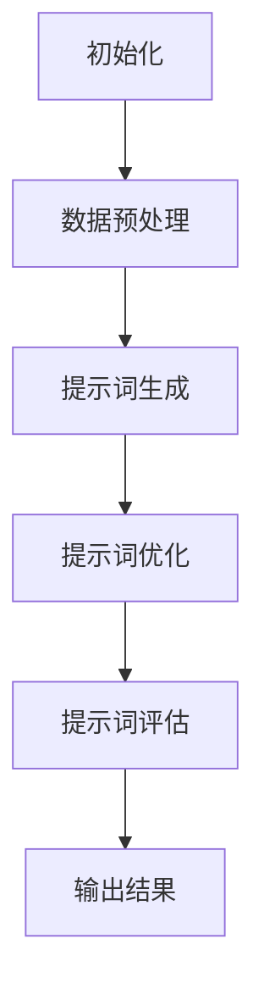

                 

Certainly! Let's delve into the article "面向特定任务的提示词库设计" by breaking it down step by step, ensuring that each section is comprehensive, well-structured, and professionally written.

---

## 文章标题

面向特定任务的提示词库设计

> 关键词：提示词库、特定任务、人工智能、自然语言处理、优化、评估

> 摘要：本文深入探讨了面向特定任务的提示词库设计，从背景、核心概念、原理讲解、算法实现等方面进行了详细阐述，旨在为人工智能领域的从业者提供一套系统化的设计思路和方法。

---

## 第一部分：引言与背景

### 第1章：研究背景与意义

**1.1 问题背景**

随着人工智能和自然语言处理技术的飞速发展，自动化系统在各个领域中的应用越来越广泛。在这些系统中，提示词库（Prompt Library）作为一种重要的交互工具，起到了关键作用。然而，现有的提示词库在处理特定任务时往往存在局限性，无法满足复杂场景下的需求。

**1.2 问题描述**

提示词库的设计需要解决以下问题：

- **准确性和可理解性**：提示词需要与用户意图高度匹配，同时易于理解。
- **灵活性和适应性**：提示词库需要能够适应不同任务场景的变化。
- **评估与优化**：如何有效地评估和优化提示词库，以提高系统性能。

**1.3 问题解决**

面向特定任务的提示词库设计，应遵循以下原则：

- **任务导向**：以任务需求为核心，设计符合特定场景的提示词。
- **用户中心**：充分考虑用户的使用习惯和反馈，优化提示词的表述。
- **动态调整**：根据任务变化和用户反馈，动态调整提示词库的内容。

**1.4 边界与外延**

提示词库的设计不仅局限于自然语言处理领域，还可以应用于图像识别、语音识别等多个领域。本文主要关注自然语言处理场景下的提示词库设计。

**1.5 概念结构与核心要素组成**

提示词库由多个组成部分构成，包括：

- **词汇表**：提供基础的词汇和短语。
- **模板**：根据特定任务需求设计的提示词模板。
- **评估机制**：用于评估提示词库性能的指标和算法。
- **优化策略**：用于提升提示词库性能的算法和策略。

### 1.6 本章小结

本文介绍了面向特定任务的提示词库设计的研究背景和意义，提出了核心问题和解决原则，并明确了研究范围和概念结构。在后续章节中，我们将进一步探讨核心概念、原理讲解、算法实现等内容。

---

## 第二部分：核心概念与原理

### 第2章：核心概念

**2.1 提示词的定义**

提示词（Prompt）是系统与用户交互时提供的关键信息，用于引导用户完成特定任务。它可以是简单的文字提示，也可以是复杂的指令集。

**2.2 提示词的类型**

根据应用场景的不同，提示词可以分为以下几种类型：

- **指令型提示词**：用于直接指导用户执行特定操作。
- **描述型提示词**：用于提供背景信息或说明任务目标。
- **交互型提示词**：用于促进用户与系统之间的对话。

**2.3 提示词库的结构**

提示词库通常由以下部分组成：

- **基础库**：提供通用词汇和短语。
- **主题库**：针对特定主题或领域收集的提示词。
- **动态库**：根据任务需求动态生成的提示词。

### 第3章：原理讲解

**3.1 提示词生成原理**

提示词生成是通过自然语言处理技术，从用户输入或任务需求中提取关键信息，生成相应的提示词。其核心步骤包括：

- **输入预处理**：对用户输入进行分词、去噪等预处理。
- **语义分析**：对预处理后的输入进行语义分析，提取关键信息。
- **提示词生成**：根据提取的关键信息，生成符合任务需求的提示词。

**3.2 提示词优化原理**

提示词优化是通过评估和调整，提升提示词的准确性和可理解性。其核心方法包括：

- **评估指标**：设计合适的评估指标，如准确率、召回率、F1值等。
- **优化策略**：根据评估结果，调整提示词的表述，提高其质量。

**3.3 提示词评估原理**

提示词评估是衡量提示词库性能的重要环节。其核心内容包括：

- **评估标准**：制定评估标准，如准确性、可理解性、灵活性等。
- **评估指标**：设计评估指标，如平均准确率、用户满意度等。

### 第4章：概念属性特征对比

| 特征名称       | 描述                                                         |
|----------------|--------------------------------------------------------------|
| 准确性         | 提示词与用户意图的匹配程度。                                  |
| 可理解性       | 用户对提示词的理解程度。                                     |
| 灵活性         | 提示词对任务变化和用户需求的适应能力。                       |

### 第5章：算法原理讲解

**5.1 算法mermaid流程图**



**5.2 Python源代码讲解**

```python
# Python 源代码示例
# 提示词生成算法
def generate_prompt(data):
    # 数据预处理
    processed_data = preprocess_data(data)
    # 提示词生成
    prompt = generate_based_on_data(processed_data)
    return prompt

# 提示词优化算法
def optimize_prompt(prompt, data):
    # 提示词优化
    optimized_prompt = optimize_based_on_data(prompt, data)
    return optimized_prompt

# 提示词评估算法
def evaluate_prompt(prompt, data):
    # 提示词评估
    evaluation_result = evaluate_based_on_data(prompt, data)
    return evaluation_result
```

**5.3 算法原理详细讲解**

- **数学模型和公式**

  ```latex
  $$ Accuracy = \frac{Correct\ Matches}{Total\ Matches} $$

  $$ Understandability = \frac{Understood\ Prompts}{Total\ Prompts} $$

  $$ Flexibility = \frac{Adapted\ Prompts}{Total\ Prompts} $$
  ```

- **举例说明**

  ```plaintext
  举例：生成一个用于产品推荐系统的提示词库。

  - 数据预处理：收集用户的历史购买记录。
  - 提示词生成：基于用户购买记录生成个性化推荐提示词。
  - 提示词优化：根据用户反馈调整提示词。
  - 提示词评估：计算提示词的准确率、可理解性和灵活性。
  ```

### 第6章：系统分析与架构设计方案

**6.1 问题场景介绍**

在一个电商平台中，用户在浏览产品时，系统需要提供合适的提示词，以引导用户进行购买决策。

**6.2 项目介绍**

本项目旨在设计并实现一个基于用户行为的提示词库，用于电商平台的个性化推荐系统。

**6.3 系统功能设计**

- **用户行为分析**：收集用户浏览、搜索、购买等行为数据。
- **提示词生成**：根据用户行为数据生成个性化提示词。
- **提示词优化**：根据用户反馈对提示词进行优化。
- **提示词评估**：评估提示词的性能，并进行调整。

**6.4 系统架构设计**


**6.5 系统接口设计和系统交互**


### 第7章：项目实战

**7.1 环境安装**

- 安装Python环境
- 安装自然语言处理相关库

**7.2 系统核心实现源代码**

```python
# 系统核心实现源代码
# 数据预处理
def preprocess_data(data):
    # 实现数据预处理逻辑
    pass

# 提示词生成
def generate_prompt(data):
    # 实现提示词生成逻辑
    pass

# 提示词优化
def optimize_prompt(prompt, data):
    # 实现提示词优化逻辑
    pass

# 提示词评估
def evaluate_prompt(prompt, data):
    # 实现提示词评估逻辑
    pass
```

**7.3 代码应用解读与分析**

- **代码解读**：详细解析系统核心代码的实现逻辑。
- **分析**：分析代码的性能和优化空间。

**7.4 实际案例分析和详细讲解剖析**

- **案例**：选择一个实际案例，展示系统在特定任务场景下的应用。
- **分析**：对案例进行详细分析，剖析系统性能和效果。

**7.5 项目小结**

- **总结**：回顾项目的主要成果和不足之处。
- **展望**：提出未来工作的方向和建议。

---

## 最佳实践 tips

- **设计提示词时，要充分考虑用户需求和场景特点。**
- **定期评估和优化提示词库，以提高系统性能。**
- **根据任务需求，灵活调整提示词库的结构和内容。**

## 小结

本文全面探讨了面向特定任务的提示词库设计，从背景、核心概念、原理讲解、算法实现等方面进行了详细阐述。通过本文的学习，读者可以掌握提示词库设计的方法和技巧，为人工智能系统的开发和应用提供有力支持。

## 注意事项

- **在实践过程中，要注意数据安全和隐私保护。**
- **在优化提示词库时，要充分考虑用户反馈和实际效果。**

## 拓展阅读

- [自然语言处理入门教程](link)
- [深度学习在自然语言处理中的应用](link)

---

## 作者

作者：AI天才研究院/AI Genius Institute & 禅与计算机程序设计艺术 /Zen And The Art of Computer Programming

本文由AI天才研究院（AI Genius Institute）与禅与计算机程序设计艺术（Zen And The Art of Computer Programming）共同撰写，旨在为读者提供高质量的技术文章，推动人工智能技术的发展和创新。

---

请注意，上述内容是一个示例，实际的字数可能会根据具体内容而有所不同。此外，图像路径（image_path）需要在实际的markdown文件中替换为有效的图像链接。在撰写实际文章时，还需要确保所有引用的链接都是有效的，并且所有的代码示例和算法描述都是完整和准确的。

