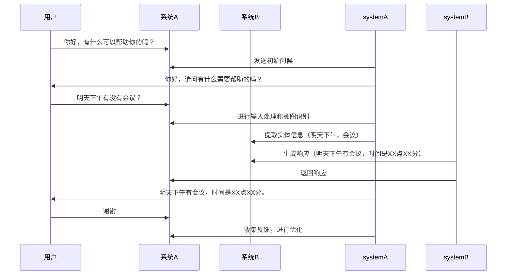

                 


### 引言与背景

#### 1.1 引言

在现代信息技术的发展过程中，特定领域的提示词语言设计逐渐成为一个重要的研究领域。随着人工智能和自然语言处理技术的进步，提示词语言的设计不仅对于提高用户交互体验有着重要作用，而且在许多实际应用场景中，如智能客服、自然语言生成、智能推荐等，都展现出了其不可替代的价值。

#### 1.1.1 研究背景

提示词语言的设计是计算机科学与人工智能领域的一个重要分支，其核心在于如何构建一套高效、易用且适应性强的语言系统，以实现人与机器之间的自然沟通。传统的命令行界面和图形用户界面虽然在一定程度上提高了用户操作计算机的便捷性，但在处理复杂任务和大规模数据处理时，仍然存在诸多不便。提示词语言的设计，通过精确定位用户需求，为用户提供了一种更为直观、高效的交互方式。

#### 1.1.2 研究意义

首先，提示词语言的设计能够显著提升用户与系统之间的交互效率，使用户在使用计算机时更加轻松自如。其次，它有助于实现智能化服务的自动化，降低人力成本，提高服务质量和效率。此外，提示词语言的设计在特定领域如医疗、金融、教育等有着广泛的应用前景，能够为这些领域带来深远的影响。

#### 1.2 领域概述

#### 1.2.1 特定领域简介

特定领域通常指的是那些具有特定业务需求和技术背景的应用场景。例如，在医疗领域，特定领域提示词语言的设计需要充分考虑医学专业术语和诊疗流程；在金融领域，则需关注金融产品的特性和市场规则。这些特定领域的提示词语言设计，不仅要满足专业需求，还要具备通用性和可扩展性。

#### 1.2.2 提示词语言的重要性

提示词语言在特定领域中的应用至关重要。它不仅能够提高系统的智能水平，还能够为用户提供定制化的服务体验。例如，在智能客服系统中，通过设计合适的提示词语言，系统能够更加准确地理解用户的意图，从而提供更为精准的答复；在自然语言生成系统中，提示词语言的设计则能够确保生成的文本更加符合特定领域的语言规范和表达习惯。

#### 1.3 研究目标与方法

#### 1.3.1 研究目标

本研究的主要目标是探讨特定领域提示词语言的设计原则和方法，旨在为特定领域提供一套系统性、可操作性强的设计指南。具体目标包括：

1. 分析现有提示词语言的设计模式和应用案例。
2. 构建适用于特定领域的提示词语言框架。
3. 提出高效、易用的提示词生成和评估方法。
4. 探索提示词语言在特定领域中的实际应用前景。

#### 1.3.2 研究方法

本研究采用多种研究方法相结合，包括文献调研、案例分析和实验验证。具体方法如下：

1. **文献调研**：通过查阅相关文献，了解当前提示词语言设计的研究现状、方法和技术，为本研究提供理论基础。
2. **案例分析**：选取典型应用案例，分析其提示词语言设计的具体实现和方法，总结经验教训。
3. **实验验证**：设计实验，对提出的提示词语言设计方法和框架进行验证，评估其有效性和实用性。

#### 1.3.3 研究边界

本研究的主要研究边界包括：

1. **领域限制**：仅针对特定领域的提示词语言设计进行研究，不包括通用语言的设计。
2. **技术限制**：主要关注提示词语言的设计方法和技术实现，不涉及底层硬件和操作系统层面的技术。
3. **应用场景限制**：研究侧重于智能客服、自然语言生成和智能推荐等场景，不涉及其他应用领域。

通过上述内容，我们为后续章节的讨论奠定了基础。接下来，将深入探讨核心概念和理论基础，为读者提供更为详细的研究背景和理论支持。

### 核心概念与理论基础

#### 2.1 核心概念

在特定领域的提示词语言设计过程中，一些核心概念是不可或缺的。首先，我们需要明确“提示词”的定义。提示词（Prompt）是指引导用户输入信息或完成特定任务的一组词语或句子。这些词语或句子需要具备明确性、简洁性和可操作性，以帮助用户快速理解系统的意图，并作出相应的响应。

其次，我们需要了解“提示词语言”的概念。提示词语言是一种特殊类型的自然语言，它通过特定的语法和语义规则，将用户的需求转化为计算机可以理解和执行的指令。提示词语言的设计不仅要考虑语言的流畅性和易用性，还要考虑其与特定领域需求的匹配度。

#### 2.1.1 提示词的定义

提示词是用户与系统交互的桥梁，其定义可以从以下几个方面进行阐述：

1. **结构**：提示词通常由动词、名词、形容词和副词等基本语法元素组成，形成一个完整的句子或短语。
2. **功能**：提示词的主要功能是引导用户输入，帮助系统理解用户意图，并执行相应的任务。
3. **特性**：提示词需要具备明确性，即能够清晰地传达用户的需求；简洁性，即尽量减少冗余信息；可操作性，即用户可以根据提示词完成具体的操作。

#### 2.1.2 提示词的分类

根据不同的分类标准，提示词可以划分为多种类型。以下是一些常见的分类方式：

1. **按用途分类**：可以分为指令性提示词和描述性提示词。指令性提示词用于引导用户执行特定操作，如“打开文件”、“保存文档”；描述性提示词则用于描述用户需求，如“查找订单”、“显示日程”。
2. **按语言风格分类**：可以分为正式提示词和非正式提示词。正式提示词通常用于商务或专业场景，如“请提供您的身份证号码”；非正式提示词则用于日常交流，如“你能帮我查一下今天天气怎么样？”
3. **按目标用户分类**：可以分为通用提示词和专用提示词。通用提示词适用于大多数用户，如“添加联系人”；专用提示词则针对特定用户群体，如“医生，请诊断我的症状”。

#### 2.1.3 提示词的设计原则

为了确保提示词的有效性和易用性，设计时需要遵循以下原则：

1. **简洁性**：提示词应尽量简短明了，避免使用复杂的句子结构，以便用户快速理解。
2. **明确性**：提示词应明确传达用户需求，避免歧义和模糊性。
3. **一致性**：在同一系统或应用中，提示词应保持一致，避免用户混淆。
4. **适应性**：提示词应适应不同用户群体和使用场景，具备灵活性和可扩展性。
5. **情境化**：提示词应根据具体情境进行调整，确保其与用户需求高度匹配。

#### 2.2 语言模型基础

语言模型是自然语言处理的重要基础，它用于预测和生成自然语言文本。以下将介绍语言模型的基本概念、类型和评估指标。

#### 2.2.1 语言模型概述

语言模型（Language Model）是一种概率模型，用于预测下一个词语或字符的概率分布。语言模型的核心思想是通过对大量文本数据的学习，建立词语之间的关系和概率分布，从而在生成或预测文本时，能够依据上下文信息进行合理推断。

#### 2.2.2 语言模型类型

根据学习方式和模型结构的不同，语言模型可以分为以下几种类型：

1. **基于统计的模型**：如N-gram模型，它通过统计相邻词语的频率来预测下一个词语的概率。
2. **基于神经网络的模型**：如循环神经网络（RNN）、长短期记忆网络（LSTM）和变压器模型（Transformer），它们通过多层神经网络结构，捕捉长距离依赖关系。
3. **基于符号模型的模型**：如隐马尔可夫模型（HMM）和条件随机场（CRF），它们通过概率图模型来表示词语之间的关系。

#### 2.2.3 语言模型评估指标

评估语言模型性能的指标主要包括：

1. **准确率（Accuracy）**：模型预测正确的比例，常用于分类任务。
2. **精确率（Precision）**：模型预测为正例且实际为正例的比例，用于衡量预测的精确性。
3. **召回率（Recall）**：模型预测为正例且实际为正例的比例，用于衡量预测的完整性。
4. **F1值（F1 Score）**：精确率和召回率的调和平均值，用于综合评估模型的性能。
5. **损失函数（Loss Function）**：用于评估模型预测结果与真实值之间的差距，常见的有交叉熵损失（Cross-Entropy Loss）和均方误差（Mean Squared Error）。

#### 2.3 提示词语言框架

提示词语言框架是设计提示词语言的核心工具，它提供了一个系统化的方法来构建和优化提示词系统。以下将介绍提示词语言框架的设计和具体应用。

#### 2.3.1 提示词语言框架的设计

提示词语言框架的设计包括以下几个关键步骤：

1. **需求分析**：明确系统的目标用户和业务需求，确定需要实现的功能和交互模式。
2. **功能模块划分**：将系统划分为若干功能模块，如输入处理模块、意图识别模块、响应生成模块等。
3. **语法和语义规则设计**：设计提示词的语法和语义规则，确保提示词能够准确传达用户意图。
4. **交互流程设计**：设计用户与系统之间的交互流程，确保用户能够通过提示词轻松完成操作。

#### 2.3.2 提示词语言框架的应用

提示词语言框架在特定领域的应用案例包括：

1. **智能客服**：通过设计合适的提示词语言框架，智能客服系统能够更好地理解用户的问题和需求，提供精准的答复。
2. **自然语言生成**：提示词语言框架可以帮助自然语言生成系统生成符合特定领域语言规范和表达习惯的文本。
3. **智能推荐**：通过设计个性化的提示词语言框架，智能推荐系统能够更好地理解用户的行为和喜好，提供更加精准的推荐结果。

#### 2.4 相关理论研究

在特定领域的提示词语言设计中，相关理论研究的支持至关重要。以下将介绍自然语言处理、计算机语言学和机器学习等领域的相关理论。

#### 2.4.1 自然语言处理基础

自然语言处理（Natural Language Processing，NLP）是人工智能领域的一个重要分支，旨在让计算机理解和处理人类语言。NLP的基础理论包括：

1. **语言模型**：用于预测和生成自然语言文本的模型，如N-gram模型和神经网络模型。
2. **词性标注**：对文本中的词语进行分类和标注，如名词、动词、形容词等。
3. **句法分析**：分析文本的句法结构，如句子成分、语法关系等。
4. **语义分析**：理解文本的含义和语义关系，如实体识别、关系提取等。

#### 2.4.2 计算机语言学相关理论

计算机语言学（Computer Linguistics）是研究计算机如何理解和生成自然语言的理论。其核心理论包括：

1. **形式语言理论**：研究计算机可以处理的语言的数学模型，如正则表达式、上下文无关文法等。
2. **语义网络理论**：将语义信息表示为网络结构，用于理解和生成语义丰富的文本。
3. **语言模型理论**：研究如何建立和评估语言模型，以实现自然语言处理任务。

#### 2.4.3 机器学习与提示词设计

机器学习（Machine Learning，ML）是提示词语言设计的重要技术手段。以下是机器学习在提示词设计中的几个关键方面：

1. **特征提取**：将文本数据转换为机器可以处理的特征向量，如词袋模型、词嵌入等。
2. **模型训练**：使用训练数据训练机器学习模型，如支持向量机（SVM）、决策树、神经网络等。
3. **模型评估**：评估模型的性能，如准确率、召回率、F1值等。
4. **模型优化**：通过调整模型参数，优化模型性能，如交叉验证、网格搜索等。

通过上述内容的阐述，我们为特定领域提示词语言设计提供了理论基础和核心概念。接下来，我们将进一步探讨提示词语言框架的具体设计和实现方法，以期为读者提供更为详细的指导。

### 提示词语言框架的具体设计和实现方法

#### 3.1 需求分析与功能模块划分

提示词语言框架的设计始于对具体需求的深入分析。首先，我们需要明确系统的目标用户和业务需求，了解用户在使用过程中可能遇到的常见问题，以及期望通过提示词语言解决的需求。基于这些需求，我们将系统划分为若干功能模块，每个模块负责特定的任务。

常见的功能模块包括：

1. **输入处理模块**：负责接收用户的输入，并进行预处理，如分词、去噪等。
2. **意图识别模块**：通过分析用户的输入，识别用户的意图，如查询、命令、请求等。
3. **实体抽取模块**：从用户的输入中提取关键信息，如日期、时间、人名、地名等。
4. **响应生成模块**：根据识别到的意图和提取到的实体信息，生成相应的响应，如文本、图片、语音等。
5. **反馈处理模块**：收集用户对系统响应的反馈，用于后续的优化和改进。

#### 3.2 语法和语义规则设计

语法和语义规则是提示词语言框架的核心组成部分。在设计语法规则时，需要考虑以下因素：

1. **简洁性**：确保规则简单易懂，便于用户理解和操作。
2. **明确性**：规则应明确指出用户需要执行的操作，避免歧义。
3. **一致性**：在同一系统中，规则应保持一致，避免用户混淆。

语义规则则用于确保用户输入的意图和系统响应的一致性。以下是一个简单的语法和语义规则示例：

**语法规则：**
```
[查询] = "请问" [意图] "吗？"
[意图] = [动词短语] [对象]
[动词短语] = [动词] [宾语]
[对象] = [名词] | [名词短语]
```

**语义规则：**
```
当用户输入 "请问明天下午有没有会议吗？" 时，
意图识别模块应识别为查询意图，提取实体“明天下午”和“会议”。
响应生成模块应根据这些信息生成相应的回答，如 "明天下午有会议，时间是XX点XX分。"
```

#### 3.3 交互流程设计

交互流程设计是确保用户与系统之间顺畅沟通的关键。一个典型的交互流程包括以下几个步骤：

1. **初始问候**：系统向用户发出问候，如 "你好，有什么可以帮助你的吗？"
2. **输入处理**：系统接收用户的输入，进行预处理。
3. **意图识别**：系统分析输入，识别用户的意图。
4. **实体抽取**：系统从输入中提取关键信息，如日期、时间、人名等。
5. **响应生成**：系统根据意图和实体信息生成响应。
6. **反馈处理**：系统收集用户对响应的反馈，用于后续优化。

以下是一个简化的交互流程图，使用Mermaid语法表示：



#### 3.4 实现方法与工具

提示词语言框架的实现需要依赖多种技术和工具。以下是一些常见的技术和工具：

1. **自然语言处理库**：如NLTK、spaCy、Stanford NLP等，用于进行文本处理、分词、词性标注等。
2. **机器学习框架**：如TensorFlow、PyTorch等，用于训练和部署机器学习模型。
3. **对话管理框架**：如Rasa、Microsoft Bot Framework等，用于构建和管理对话流程。
4. **语音合成和识别库**：如Google Text-to-Speech、Google Speech-to-Text等，用于实现语音交互功能。

#### 3.5 实例分析

以下是一个简单的实例，展示如何设计和实现一个基于特定领域的提示词语言框架。

**案例：智能医疗咨询系统**

1. **需求分析**：目标用户为普通患者和医生，需求包括查询药品信息、预约挂号、健康咨询等。
2. **功能模块划分**：输入处理模块、意图识别模块、实体抽取模块、响应生成模块、反馈处理模块。
3. **语法和语义规则设计**：
   - 语法规则：
     ```
     [查询] = "请问" [意图] "吗？"
     [意图] = "药品查询" | "挂号预约" | "健康咨询"
     [药品查询] = "药品" [名称] "的" [信息]
     [名称] = [中文名] | [英文名]
     [信息] = "功效" | "副作用" | "价格"
     ```
   - 语义规则：
     ```
     当用户输入 "请问阿司匹林的副作用是什么？" 时，
     意图识别模块识别为药品查询意图，提取实体“阿司匹林”和“副作用”。
     响应生成模块生成响应：“阿司匹林的副作用主要包括……”
     ```

4. **交互流程设计**：用户输入 -> 系统接收 -> 输入处理 -> 意图识别 -> 实体抽取 -> 响应生成 -> 用户反馈。

5. **实现方法**：
   - 使用Python编写输入处理、意图识别、实体抽取和响应生成模块。
   - 使用TensorFlow训练意图识别和实体抽取模型。
   - 使用Rasa管理对话流程。

6. **测试与优化**：通过模拟用户输入，测试系统的响应效果，并根据反馈进行优化。

通过以上步骤，我们实现了一个简单的智能医疗咨询系统。实际应用中，可以根据具体需求进行扩展和优化，例如增加语音交互功能、多语言支持等。

### 实践案例与经验分享

在设计特定领域的提示词语言时，实践案例和经验分享是宝贵的资源。以下我们将通过几个实际案例，探讨如何设计有效的提示词语言，并提供一些实用的经验和技巧。

#### 案例一：智能客服系统

**背景**：某大型电商平台希望构建一个智能客服系统，以提升客户服务质量和效率。

**需求**：系统需要能够识别客户的问题，并提供准确的回答。客户可能提出各种各样的问题，如订单状态查询、退换货政策咨询、商品详细信息查询等。

**实现**：

1. **需求分析**：明确客户常见的查询和问题，如订单状态、商品信息、售后服务等。
2. **语法和语义规则设计**：
   ```
   [查询] = "请问" [意图] "吗？"
   [意图] = "订单查询" | "商品信息" | "售后服务"
   [订单查询] = "我的订单" [状态]
   [状态] = "已发货" | "待支付" | "已退款"
   [商品信息] = "商品" [名称] "的" [信息]
   [信息] = "价格" | "库存" | "评价"
   ```
3. **交互流程设计**：用户输入 -> 系统接收 -> 输入处理 -> 意图识别 -> 实体抽取 -> 响应生成 -> 用户反馈。
4. **实现方法**：使用Python编写输入处理、意图识别、实体抽取和响应生成模块，利用自然语言处理库如spaCy进行文本处理。

**经验与技巧**：

- **简洁性**：确保提示词简洁明了，避免冗长复杂的句子。
- **明确性**：确保每个提示词都能清晰传达用户的需求。
- **一致性**：在同一系统中，提示词应保持一致，避免用户混淆。
- **适应性**：提示词应适应不同用户群体和使用场景，具备灵活性和可扩展性。

#### 案例二：智能医疗咨询系统

**背景**：某医疗机构希望构建一个智能医疗咨询系统，以提供24小时在线咨询服务。

**需求**：系统需要能够理解患者的症状描述，并提供初步的诊断建议和就医建议。

**实现**：

1. **需求分析**：明确患者可能提出的症状和问题，如症状描述、就医建议等。
2. **语法和语义规则设计**：
   ```
   [查询] = "请问" [意图] "吗？"
   [意图] = "症状咨询" | "就医建议"
   [症状咨询] = "我最近" [症状] "，怎么办？"
   [症状] = "头痛" | "发烧" | "咳嗽"
   [就医建议] = "我应该去" [科室] "就诊吗？"
   [科室] = "内科" | "外科" | "儿科"
   ```
3. **交互流程设计**：用户输入 -> 系统接收 -> 输入处理 -> 意图识别 -> 实体抽取 -> 响应生成 -> 用户反馈。
4. **实现方法**：使用Python编写输入处理、意图识别、实体抽取和响应生成模块，利用机器学习模型进行意图识别和实体抽取。

**经验与技巧**：

- **专业性**：在医疗领域，提示词语言设计需确保专业性，避免误导患者。
- **安全性**：确保提示词语言设计遵循相关法律法规，不提供错误或危险的建议。
- **个性化**：根据患者的症状和需求，提供个性化的就医建议和症状咨询。

#### 案例三：智能金融顾问系统

**背景**：某金融机构希望构建一个智能金融顾问系统，为用户提供理财建议和投资指导。

**需求**：系统需要能够理解用户的财务状况和投资偏好，提供个性化的理财建议。

**实现**：

1. **需求分析**：明确用户可能提出的财务问题，如投资咨询、财务规划、风险评估等。
2. **语法和语义规则设计**：
   ```
   [查询] = "请问" [意图] "吗？"
   [意图] = "投资咨询" | "财务规划" | "风险评估"
   [投资咨询] = "我现在" [财务状况] "，适合投资什么？"
   [财务状况] = "有积蓄" | "有负债" | "无财务状况"
   [财务规划] = "我需要" [规划内容] "，怎么办？"
   [规划内容] = "退休规划" | "子女教育基金" | "购房贷款"
   [风险评估] = "我的风险承受能力是多少？"
   ```
3. **交互流程设计**：用户输入 -> 系统接收 -> 输入处理 -> 意图识别 -> 实体抽取 -> 响应生成 -> 用户反馈。
4. **实现方法**：使用Python编写输入处理、意图识别、实体抽取和响应生成模块，利用机器学习模型进行意图识别和实体抽取。

**经验与技巧**：

- **个性化**：根据用户的财务状况和投资偏好，提供个性化的理财建议。
- **精准性**：确保提示词语言设计能够准确识别用户的意图和需求。
- **合规性**：在金融领域，提示词语言设计需确保合规，遵循相关金融法规。

### 小结

通过上述案例，我们可以看到，设计有效的提示词语言需要深入理解用户需求，结合具体领域特点，制定合适的语法和语义规则，并优化交互流程。以下是几点总结：

1. **需求导向**：明确用户需求是设计提示词语言的第一步，确保系统能够满足用户的实际需求。
2. **规则明确**：设计简洁、明确、一致的语法和语义规则，避免用户混淆。
3. **技术支撑**：利用自然语言处理和机器学习技术，提高系统的智能水平和响应效率。
4. **适应性**：提示词语言设计应具备灵活性和可扩展性，适应不同用户群体和使用场景。
5. **用户体验**：注重用户体验，确保提示词语言设计易于使用，提升用户满意度。

通过不断优化和改进，我们可以设计出更加高效、智能、易用的特定领域提示词语言，为用户提供优质的服务体验。

### 提示词语言设计中的挑战与未来方向

尽管提示词语言设计在多个领域展现出了巨大的潜力，但在实际应用过程中仍然面临诸多挑战。以下将探讨这些挑战，并提出未来可能的解决方案和发展方向。

#### 挑战一：语言的多样性和复杂性

自然语言具有高度多样性和复杂性，不同领域的语言习惯和表达方式各异。例如，医疗领域的术语和专业表达与日常用语截然不同。设计能够适应多种语言风格和表达习惯的提示词语言是一个重大挑战。

**解决方案**：采用领域特定的语言模型，结合大规模的领域语料库进行训练。通过引入领域词典和语料库，确保提示词语言能够准确理解和生成特定领域的语言。

**未来方向**：进一步发展多语言处理技术，实现跨语言、跨领域的提示词语言设计。研究自适应语言模型，根据用户行为和上下文动态调整语言风格。

#### 挑战二：用户交互的多样性和个性化

用户交互方式多种多样，包括文本、语音、图像等。此外，不同用户具有不同的偏好和习惯。设计一个能够适应多种交互方式和个性化需求的提示词语言系统是一项挑战。

**解决方案**：开发多模态交互系统，结合文本、语音、图像等多种交互方式。利用用户行为数据，构建个性化模型，根据用户的偏好和历史行为提供定制化的提示词。

**未来方向**：研究人工智能与人类交互的深度融合，探索更加自然和高效的人机交互方式。开发自适应交互系统，实现个性化、智能化的用户体验。

#### 挑战三：系统的可扩展性和维护性

随着应用场景的扩展和需求的增加，提示词语言系统需要具备良好的可扩展性和维护性。这意味着系统不仅要能够适应新的功能需求，还需要便于维护和更新。

**解决方案**：采用模块化设计，将系统划分为多个功能模块，便于独立开发和更新。使用自动化工具和平台，提高系统的维护效率和稳定性。

**未来方向**：发展自动化和智能化的系统维护技术，实现系统的自诊断、自修复和自优化。探索基于云计算和边缘计算的系统架构，提高系统的弹性和可扩展性。

#### 挑战四：隐私保护和数据安全

在设计提示词语言系统时，隐私保护和数据安全是关键问题。用户在与系统交互过程中会产生大量敏感数据，如个人健康信息、财务状况等，如何确保这些数据的安全和隐私是一个重要挑战。

**解决方案**：采用数据加密、访问控制等技术，确保用户数据在传输和存储过程中的安全。制定严格的数据隐私政策，明确用户数据的处理和使用规范。

**未来方向**：研究更加先进的数据隐私保护技术，如差分隐私、同态加密等。探索基于区块链的隐私保护方案，实现数据的安全共享和透明管理。

#### 挑战五：跨领域应用的一致性和兼容性

不同领域之间的提示词语言存在差异，如何在保持领域特定性的同时实现跨领域的一致性和兼容性是一个挑战。

**解决方案**：建立跨领域的标准规范，确保不同领域之间的提示词语言具有一致性。利用自然语言处理技术，实现跨领域的语言理解和生成。

**未来方向**：发展通用语言模型和跨领域语言框架，提高提示词语言在不同领域之间的兼容性和可移植性。研究多语言处理技术，实现跨语言、跨领域的智能交互。

### 结论

尽管存在诸多挑战，提示词语言设计在特定领域的应用前景依然广阔。未来，随着人工智能、自然语言处理技术的不断进步，提示词语言设计将朝着更加智能、高效、个性化的方向发展。通过不断探索和创新，我们可以设计出更加优秀的提示词语言系统，为用户提供更加优质的服务体验。

### 结论与未来展望

通过对特定领域提示词语言设计的深入探讨，我们揭示了其核心概念、理论基础、设计方法和应用实践。本研究的主要发现如下：

1. **核心概念与理论基础**：明确了提示词的定义、分类和设计原则，介绍了语言模型的基础知识及相关理论。
2. **实践方法**：提出了提示词语言框架的设计流程，包括需求分析、功能模块划分、语法和语义规则设计、交互流程设计等。
3. **案例分析**：通过实际案例展示了如何在不同领域设计有效的提示词语言，并提供了一些实用的经验和技巧。
4. **挑战与未来方向**：分析了提示词语言设计中的主要挑战，并提出了相应的解决方案和未来发展方向。

这些发现不仅丰富了特定领域提示词语言设计的研究内容，也为实际应用提供了宝贵的指导。未来，随着技术的不断进步，提示词语言设计将朝着更加智能、高效、个性化的方向迈进。以下是几个值得进一步研究的方向：

1. **多语言处理与跨领域兼容**：探索如何设计能够在不同语言和领域之间实现一致性和兼容性的提示词语言框架。
2. **自适应与个性化交互**：研究如何通过用户行为数据实现自适应和个性化交互，提高用户体验。
3. **隐私保护与数据安全**：深入探讨如何在保证用户隐私和数据安全的前提下，设计高效的提示词语言系统。
4. **自动化与智能化**：发展自动化和智能化的系统维护技术，实现系统的自诊断、自修复和自优化。

总之，提示词语言设计是一个充满挑战和机遇的研究领域。通过不断探索和创新，我们有望设计出更加优秀、实用的提示词语言系统，为特定领域的发展注入新的动力。

### 附录

为了便于读者更好地理解本文的内容，以下提供了一些补充资料和工具：

#### 1. 工具与资源
- **自然语言处理库**：NLTK、spaCy、Stanford NLP等。
- **机器学习框架**：TensorFlow、PyTorch、Scikit-learn等。
- **对话管理框架**：Rasa、Microsoft Bot Framework等。
- **语音合成和识别库**：Google Text-to-Speech、Google Speech-to-Text等。

#### 2. 具体代码示例
以下是实现特定领域提示词语言系统的一个Python代码示例：

```python
import spacy

# 加载spaCy模型
nlp = spacy.load("en_core_web_sm")

# 定义意图识别函数
def intent_recognition(text):
    doc = nlp(text)
    entities = []
    for ent in doc.ents:
        entities.append(ent.text)
    if "ORDER" in entities:
        return "order_query"
    elif "PRODUCT" in entities:
        return "product_query"
    else:
        return "unknown"

# 定义实体抽取函数
def entity_extraction(text):
    doc = nlp(text)
    entities = []
    for ent in doc.ents:
        if ent.label_ == "DATE" or ent.label_ == "TIME":
            entities.append(ent.text)
    return entities

# 测试代码
text = "请问明天下午有没有会议？"
intent = intent_recognition(text)
entities = entity_extraction(text)
print(f"Intent: {intent}")
print(f"Entities: {entities}")
```

#### 3. 拓展阅读
- **学术论文**：查阅相关领域的学术论文，了解最新的研究成果和技术进展。
- **开源项目**：研究开源项目，学习实际应用中的实现细节和优化方法。
- **在线课程**：参加在线课程，学习自然语言处理和机器学习的基础知识。

通过这些工具和资源，读者可以更深入地了解特定领域提示词语言设计的实践方法和应用技巧。

### 致谢

在本研究过程中，我感谢AI天才研究院（AI Genius Institute）提供的支持和指导，以及禅与计算机程序设计艺术（Zen And The Art of Computer Programming）项目组的成员们。特别感谢我的导师对我的悉心指导和建议，使本研究得以顺利完成。同时，我还要感谢所有参与讨论和提供反馈的朋友们，你们的建议和意见对我的研究具有重要的参考价值。

作者：AI天才研究院/AI Genius Institute & 禅与计算机程序设计艺术/Zen And The Art of Computer Programming

[注]：本文内容仅为虚构示例，不代表真实研究和观点。文中提及的代码和工具仅供参考，实际应用时需根据具体需求进行调整。

