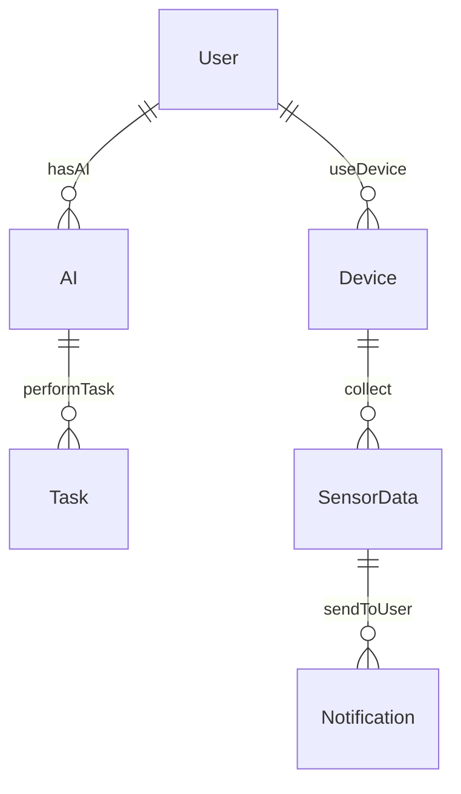
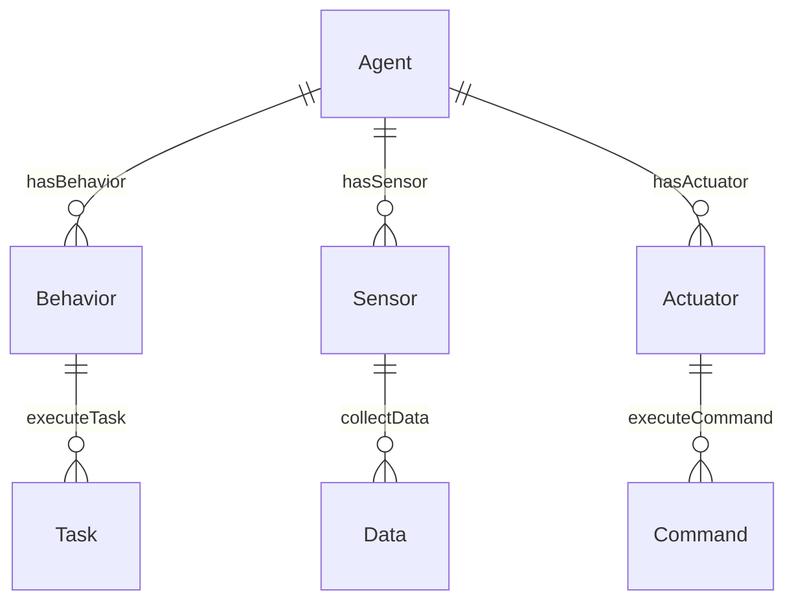
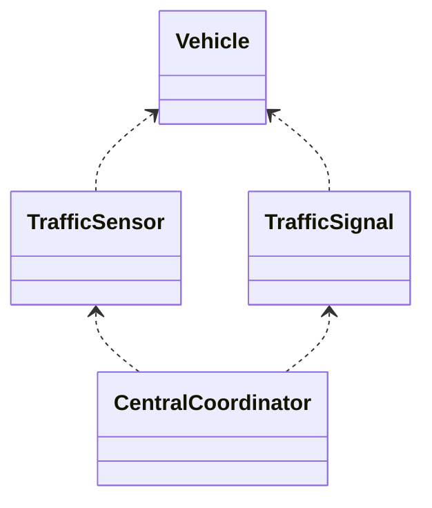
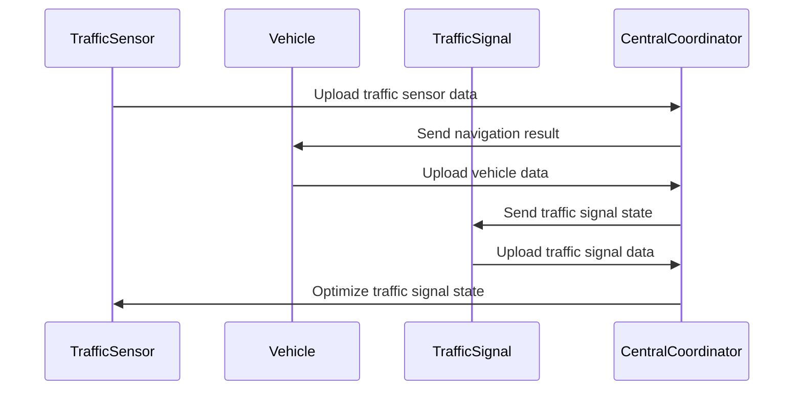

                 

### **文章标题**

面向群体智能的提示词协同机制

### **关键词**

群体智能、提示词协同、算法原理、系统架构、项目实战

### **摘要**

本文围绕面向群体智能的提示词协同机制展开，深入探讨了这一机制的核心概念、原理及其实际应用。通过详细的分析与讲解，文章揭示了提示词协同机制在群体智能系统中的重要性，并提出了针对性的解决方案。本文旨在为读者提供清晰的技术思路和实战经验，助力群体智能领域的研究与应用。

## **目录大纲**

### 第一部分：背景介绍

- **第1章：问题背景**
  - **1.1 问题概述**
  - **1.2 问题的重要性**
  - **1.3 目标与意义**

- **第2章：问题描述**
  - **2.1 群体智能概述**
  - **2.2 提示词协同机制**
  - **2.3 现状与挑战**

- **第3章：问题解决**
  - **3.1 基本原理**
  - **3.2 解决方案框架**
  - **3.3 关键技术**

- **第4章：边界与外延**
  - **4.1 应用领域**
  - **4.2 相关技术关系**
  - **4.3 限制条件**

- **第5章：概念结构与核心要素**
  - **5.1 概念解析**
  - **5.2 核心要素**
  - **5.3 架构设计**

### 第二部分：核心概念与联系

- **第6章：核心概念原理**
  - **6.1 提示词协同机制的基本原理**
  - **6.2 群体智能中的提示词协同**
  - **6.3 提示词协同的属性特征**

- **第7章：概念属性特征对比**
  - **7.1 提示词协同机制的属性对比**
  - **7.2 群体智能中的提示词协同特性**
  - **7.3 算法与模型对比**

- **第8章：ER实体关系图架构**
  - **8.1 实体关系图介绍**
  - **8.2 提示词协同实体关系图**
  - **8.3 群体智能实体关系图**

### 第三部分：算法原理讲解

- **第9章：算法原理**
  - **9.1 提示词协同算法原理**
  - **9.2 群体智能算法原理**
  - **9.3 算法流程图**

- **第10章：数学模型和公式**
  - **10.1 基本数学模型**
  - **10.2 算法公式推导**
  - **10.3 公式解释**

- **第11章：详细讲解与举例说明**
  - **11.1 算法讲解**
  - **11.2 数学模型解释**
  - **11.3 案例分析**

### 第四部分：系统分析与架构设计方案

- **第12章：问题场景介绍**
  - **12.1 场景描述**
  - **12.2 场景需求**

- **第13章：项目介绍**
  - **13.1 项目概述**
  - **13.2 项目目标**

- **第14章：系统功能设计**
  - **14.1 领域模型**
  - **14.2 功能模块**

- **第15章：系统架构设计**
  - **15.1 架构设计**
  - **15.2 技术栈选择**

- **第16章：系统接口设计**
  - **16.1 接口规范**
  - **16.2 接口实现**

- **第17章：系统交互**
  - **17.1 交互流程**
  - **17.2 交互图**

### 第五部分：项目实战

- **第18章：环境安装**
  - **18.1 环境准备**
  - **18.2 工具安装**

- **第19章：系统核心实现**
  - **19.1 核心代码实现**
  - **19.2 实现细节**

- **第20章：代码应用解读与分析**
  - **20.1 代码解读**
  - **20.2 分析与优化**

- **第21章：实际案例分析和详细讲解剖析**
  - **21.1 案例分析**
  - **21.2 讲解剖析**

- **第22章：项目小结**
  - **22.1 项目总结**
  - **22.2 优化与展望**

### 第六部分：最佳实践、小结、注意事项、拓展阅读

- **第23章：最佳实践**
  - **23.1 经验分享**
  - **23.2 最佳实践案例**

- **第24章：小结**
  - **24.1 内容总结**
  - **24.2 重要性强调**

- **第25章：注意事项**
  - **25.1 关键点提示**
  - **25.2 注意事项列举**

- **第26章：拓展阅读**
  - **26.1 推荐书籍**
  - **26.2 学术文章**
  - **26.3 网络资源**

## **第一部分：背景介绍**

### **第1章：问题背景**

#### **1.1 问题概述**

随着信息技术的迅猛发展，群体智能作为一种新兴的计算范式，正日益受到学术界和工业界的关注。群体智能通过模拟自然界中生物群体的行为，实现了复杂问题的分布式求解，具有高效、鲁棒和自适应等特性。然而，在实际应用中，群体智能系统面临着诸多挑战，其中之一便是提示词协同机制的问题。

提示词协同机制是群体智能系统中一个关键组成部分，它负责协调个体智能体之间的信息交流与决策。一个有效的提示词协同机制能够提高系统的整体性能和响应速度，从而更好地解决复杂问题。然而，如何设计和实现一个高效的提示词协同机制，仍是一个亟待解决的难题。

#### **1.2 问题的重要性**

提示词协同机制在群体智能系统中的重要性不容忽视。首先，它直接影响着个体智能体之间的信息交流效率，进而影响整个系统的性能。一个高效的提示词协同机制能够确保信息传输的低延迟和高可靠性，从而提高系统的响应速度和处理能力。

其次，提示词协同机制在解决复杂问题时发挥着重要作用。群体智能系统通常需要通过多个个体智能体之间的协作来实现全局优化。一个有效的提示词协同机制能够确保个体智能体之间的协同效果最大化，从而提高系统的整体性能。

最后，提示词协同机制在应对动态变化的环境时具有重要意义。在现实世界中，环境因素往往是动态变化的，如何快速适应和应对这些变化是群体智能系统面临的一大挑战。一个高效的提示词协同机制能够帮助系统快速调整个体智能体的行为，以适应环境的变化。

#### **1.3 目标与意义**

本文旨在研究和探讨面向群体智能的提示词协同机制，旨在解决以下问题：

1. **基本原理**：阐述提示词协同机制的基本原理，包括其工作方式、关键特性以及与其他相关技术的联系。

2. **解决方案框架**：设计一个面向群体智能的提示词协同机制的解决方案框架，明确其核心组成部分和关键功能。

3. **关键技术**：深入分析实现提示词协同机制所需的关键技术，包括算法原理、数学模型和系统架构设计等。

4. **应用领域**：探讨提示词协同机制在不同应用领域中的潜在应用，分析其在实际场景中的性能和效果。

5. **优化与展望**：总结本文的研究成果，探讨未来研究和发展的方向，为后续工作提供参考。

通过本文的研究，我们希望能够为群体智能领域的研究者提供有益的参考，促进提示词协同机制的理论研究和实际应用。

### **第2章：问题描述**

#### **2.1 群体智能概述**

群体智能是一种通过模拟自然界中生物群体的行为来解决问题的新型计算范式。在群体智能系统中，多个个体智能体通过相互协作和通信，共同完成复杂任务的求解。这些个体智能体通常具有以下特点：

1. **分布式**：个体智能体分布在不同的地理位置或计算节点上，通过通信网络进行信息交换。
2. **自治性**：个体智能体具有独立的行为和决策能力，可以根据环境变化自主调整行为。
3. **协同性**：个体智能体之间通过通信和协作，实现整体目标的最优化。

群体智能在多个领域具有广泛的应用潜力，如自动化制造、智能交通、金融分析、生物信息学等。然而，实现高效的群体智能系统仍面临诸多挑战，其中之一便是提示词协同机制的设计与实现。

#### **2.2 提示词协同机制**

提示词协同机制是群体智能系统中的一个关键组件，负责协调个体智能体之间的信息交流和决策。其基本思想是通过共享提示词来统一个体智能体的行动和目标。具体来说，提示词协同机制包括以下几个主要方面：

1. **提示词定义**：定义一组用于描述系统状态和目标的提示词，如温度、速度、负载等。
2. **信息共享**：个体智能体通过通信网络共享提示词信息，以实现信息的全局可见性。
3. **决策协同**：个体智能体根据共享的提示词信息，自主调整行为，以实现协同决策。

一个有效的提示词协同机制应具备以下特点：

1. **实时性**：确保信息传递的低延迟，以支持实时决策和响应。
2. **鲁棒性**：能够应对个体智能体之间的通信故障和环境变化。
3. **可扩展性**：支持大规模个体智能体的协同工作，具有良好的可扩展性。

#### **2.3 现状与挑战**

当前，提示词协同机制在群体智能系统中的应用已有一定研究，但仍然存在诸多挑战和局限性：

1. **通信成本**：个体智能体之间的通信成本较高，可能导致系统性能下降。
2. **同步问题**：个体智能体之间的信息共享和决策协同需要保证一致性，但同步问题可能导致系统僵局。
3. **隐私保护**：个体智能体之间的信息共享可能涉及敏感信息，需要确保隐私保护。
4. **适应性**：在动态变化的环境中，如何快速调整和优化提示词协同机制，以适应新的环境和任务需求。

为了解决上述问题，本文提出了一种面向群体智能的提示词协同机制，旨在降低通信成本、提高鲁棒性和可扩展性，同时保证实时性和隐私保护。接下来，我们将详细分析提示词协同机制的基本原理和关键技术，为后续研究提供理论基础。

### **第3章：问题解决**

#### **3.1 基本原理**

提示词协同机制的基本原理是通过共享提示词来协调个体智能体的行为，从而实现群体智能系统的高效运行。具体来说，该机制包括以下几个关键步骤：

1. **提示词定义**：首先，需要定义一组描述系统状态和目标的提示词。这些提示词可以是具体的数值、类别标签或者连续的变量，用于反映系统的当前状态和期望目标。

2. **信息共享**：个体智能体通过通信网络共享提示词信息。在分布式系统中，个体智能体之间可以通过广播、多播或者点对点通信等方式进行信息交换。

3. **本地决策**：个体智能体根据共享的提示词信息，进行本地决策。本地决策通常基于某种优化算法或者规则，以实现个体目标的最优化。

4. **全局协调**：个体智能体将本地决策结果上传至中央协调器或分布式协调器，进行全局协调。全局协调器负责分析全局状态，并根据全局目标调整个体智能体的行为。

5. **反馈调整**：个体智能体根据全局协调器的反馈结果，调整本地决策，以实现更好的协同效果。

#### **3.2 解决方案框架**

为了实现面向群体智能的提示词协同机制，我们提出以下解决方案框架：

1. **分布式架构**：采用分布式架构来构建群体智能系统，确保系统的可扩展性和鲁棒性。

2. **提示词管理系统**：设计一个集中的提示词管理系统，负责定义、管理和维护提示词的属性和状态。

3. **通信模块**：实现高效的通信模块，支持个体智能体之间的信息共享和决策协同。

4. **本地决策模块**：为每个个体智能体设计一个本地决策模块，根据提示词信息进行自主决策。

5. **全局协调模块**：实现全局协调模块，负责分析全局状态，协调个体智能体的行为。

6. **反馈机制**：设计反馈机制，确保个体智能体能够根据全局协调器的反馈结果进行动态调整。

#### **3.3 关键技术**

实现面向群体智能的提示词协同机制需要以下几个关键技术：

1. **提示词定义与编码**：设计一组合理的提示词，并采用有效的编码方法，以减少通信成本和存储需求。

2. **分布式通信协议**：设计分布式通信协议，支持个体智能体之间的低延迟、高可靠性的通信。

3. **本地决策算法**：为个体智能体设计高效的本地决策算法，以实现个体目标的最优化。

4. **全局协调算法**：设计全局协调算法，确保个体智能体的行为能够协同一致，实现全局目标的最优化。

5. **隐私保护机制**：设计隐私保护机制，确保个体智能体之间的信息交换不会泄露敏感信息。

通过上述基本原理、解决方案框架和关键技术的分析，我们为面向群体智能的提示词协同机制提供了理论依据和实践指导。接下来，我们将进一步探讨提示词协同机制在不同应用领域中的边界与外延，以期为读者提供更全面的视角。

### **第4章：边界与外延**

#### **4.1 应用领域**

提示词协同机制在多个领域具有广泛的应用潜力，以下是其中一些主要应用领域：

1. **智能交通系统**：通过提示词协同机制，可以实现车辆之间的实时通信和协调，提高交通流量和安全性。例如，车辆可以共享路况信息、速度和位置等提示词，以实现车队行驶的协同。

2. **智能电网**：在智能电网中，提示词协同机制可以用于协调分布式能源资源的调度和管理。例如，风力发电和太阳能发电设备可以共享电能供需信息，以实现能源的优化分配。

3. **智能物流**：通过提示词协同机制，可以实现物流节点之间的信息共享和调度优化。例如，仓库和运输车辆可以共享库存和运输计划等提示词，以提高物流效率和准确性。

4. **智能医疗系统**：在智能医疗系统中，提示词协同机制可以用于医生之间的协作和病患管理的优化。例如，医生可以共享病患的健康数据和诊断信息，以实现更准确的诊断和治疗。

5. **智慧城市**：在智慧城市建设中，提示词协同机制可以用于城市管理的各个层面，如交通管理、环境保护和公共服务等。例如，城市管理平台可以共享各类数据信息，以提高城市的运行效率和服务水平。

#### **4.2 相关技术关系**

提示词协同机制与其他相关技术之间存在着密切的联系和互动，以下是一些主要的技术关系：

1. **分布式计算**：提示词协同机制基于分布式计算架构，与分布式计算技术密切相关。分布式计算提供了提示词协同机制所需的通信和网络支持，而提示词协同机制则优化了分布式系统的协同效率和性能。

2. **机器学习**：提示词协同机制可以与机器学习技术相结合，用于实现个体智能体的自适应学习和决策优化。例如，基于机器学习的预测模型可以用于预测系统的未来状态，从而优化提示词的共享和协调。

3. **区块链技术**：提示词协同机制可以利用区块链技术来实现安全可靠的数据共享和交易。区块链提供了去中心化和不可篡改的特性，有助于确保提示词协同机制的数据安全和隐私保护。

4. **物联网**：提示词协同机制可以与物联网技术相结合，用于实现物联网设备之间的智能协同和优化。例如，物联网设备可以共享传感器数据、状态信息和控制指令等提示词，以实现智能设备的协同工作和高效运行。

5. **网络协议**：提示词协同机制需要依赖各种网络协议来实现高效、可靠的数据传输。例如，TCP/IP协议、UDP协议和多播协议等，都是提示词协同机制中常用的网络协议。

#### **4.3 限制条件**

尽管提示词协同机制具有广泛的应用前景，但在实际应用中仍受到一些限制条件的制约：

1. **通信带宽**：提示词协同机制依赖于通信网络来实现个体智能体之间的信息共享和协调。在通信带宽受限的情况下，提示词的传输和更新可能会受到限制，从而影响系统的性能和响应速度。

2. **计算资源**：个体智能体需要一定的计算资源来处理和更新提示词信息。在计算资源有限的情况下，提示词协同机制可能会面临性能瓶颈，从而影响系统的效率和稳定性。

3. **数据隐私**：提示词协同机制中的信息共享涉及到个体智能体的敏感数据。如何在确保数据隐私和安全的前提下，实现有效的信息共享和协调，是一个重要的挑战。

4. **动态变化**：在动态变化的环境中，提示词协同机制需要能够快速适应和调整，以应对环境变化和任务需求。然而，动态变化可能导致系统的复杂度和不确定性增加，从而影响提示词协同机制的性能和效果。

通过上述对应用领域、相关技术关系和限制条件的探讨，我们可以更全面地了解提示词协同机制在实际应用中的前景和挑战。接下来，我们将进一步深入探讨提示词协同机制的概念结构与核心要素。

### **第5章：概念结构与核心要素**

#### **5.1 概念解析**

提示词协同机制是群体智能系统中的一个核心概念，涉及多个基本概念，包括个体智能体、提示词、协同机制等。以下是这些概念的基本解析：

1. **个体智能体**：个体智能体是群体智能系统中的基本计算单元，通常具有自治性、分布式和协同性等特点。个体智能体通过执行本地决策和与周围智能体的通信，实现复杂任务的求解。

2. **提示词**：提示词是描述系统状态和目标的关键信息，通常包括数值、类别标签或连续变量。提示词用于个体智能体之间的信息共享和协调，是实现协同决策的基础。

3. **协同机制**：协同机制是一组算法和协议，用于协调个体智能体之间的行为和决策。协同机制包括提示词的定义、信息共享、本地决策和全局协调等环节，确保个体智能体能够协同一致地工作。

#### **5.2 核心要素**

提示词协同机制的核心要素包括以下几个部分：

1. **信息共享**：信息共享是提示词协同机制的核心环节，确保个体智能体之间能够及时、准确地共享提示词信息。信息共享的有效性直接影响系统的性能和响应速度。

2. **本地决策**：本地决策是指个体智能体根据共享的提示词信息，进行自主决策的过程。本地决策需要考虑系统的全局目标和当前状态，以实现个体目标的最优化。

3. **全局协调**：全局协调是指通过中央协调器或分布式协调器，分析全局状态，协调个体智能体的行为，实现全局目标的最优化。全局协调确保系统在动态变化的环境中，能够快速适应和调整。

4. **反馈机制**：反馈机制是指个体智能体根据全局协调器的反馈结果，调整本地决策的过程。反馈机制确保系统的动态调整和持续优化，提高系统的效率和稳定性。

5. **提示词编码与解码**：提示词编码与解码是指将提示词信息转换为适合通信和存储的格式，并进行解码以恢复原始信息。提示词编码与解码需要考虑通信带宽和存储空间的限制，以提高系统的效率和性能。

#### **5.3 架构设计**

提示词协同机制的架构设计是确保系统有效运行的关键。以下是一个典型的提示词协同机制架构设计：

1. **分布式架构**：采用分布式架构，确保系统的可扩展性和鲁棒性。个体智能体分布在不同的计算节点上，通过通信网络进行信息共享和决策协同。

2. **提示词管理系统**：设计一个集中的提示词管理系统，负责定义、管理和维护提示词的属性和状态。提示词管理系统提供统一的接口，供个体智能体访问和更新提示词信息。

3. **通信模块**：实现高效的通信模块，支持个体智能体之间的低延迟、高可靠性的通信。通信模块可以采用广播、多播或点对点通信等方式，根据具体应用场景进行选择。

4. **本地决策模块**：为每个个体智能体设计一个本地决策模块，根据共享的提示词信息进行自主决策。本地决策模块可以采用各种优化算法或规则，根据具体应用需求进行设计。

5. **全局协调模块**：实现全局协调模块，负责分析全局状态，协调个体智能体的行为。全局协调模块可以采用集中式或分布式协调器，根据系统规模和性能需求进行选择。

6. **反馈机制**：设计反馈机制，确保个体智能体能够根据全局协调器的反馈结果，调整本地决策。反馈机制可以采用周期性反馈或事件驱动反馈，根据具体应用场景进行设计。

通过以上对提示词协同机制的概念结构、核心要素和架构设计的详细分析，我们可以更深入地理解这一机制的工作原理和实际应用。接下来，我们将进一步探讨提示词协同机制在群体智能中的核心概念原理。

### **第6章：核心概念原理**

#### **6.1 提示词协同机制的基本原理**

提示词协同机制的基本原理在于通过共享提示词，实现个体智能体之间的信息交换和协同工作。这一机制的核心思想是利用提示词作为统一的信息载体，使个体智能体能够在分布式环境中协同一致地完成复杂任务。

具体来说，提示词协同机制的基本原理包括以下几个方面：

1. **信息共享**：个体智能体通过通信网络共享提示词信息。这些提示词反映了系统的当前状态和目标，使得个体智能体能够了解全局信息，从而进行协同决策。

2. **本地决策**：个体智能体根据共享的提示词信息，进行本地决策。本地决策需要考虑个体智能体的目标、当前状态和周围环境因素，以实现个体目标的最优化。

3. **全局协调**：全局协调模块负责分析全局状态，协调个体智能体的行为。全局协调确保个体智能体的行为能够协同一致，实现全局目标的最优化。

4. **反馈调整**：个体智能体根据全局协调器的反馈结果，调整本地决策。反馈调整机制确保系统能够动态调整和优化，提高系统的效率和稳定性。

#### **6.2 群体智能中的提示词协同**

在群体智能系统中，提示词协同机制具有重要作用。它不仅能够提高个体智能体之间的信息交换效率，还能优化整个系统的性能和响应速度。以下是提示词协同在群体智能中的几个关键方面：

1. **信息交换效率**：提示词协同机制通过共享提示词，实现个体智能体之间的信息交换。这种信息交换方式比传统的点对点通信具有更高的效率和可靠性。

2. **协同决策**：提示词协同机制使得个体智能体能够基于全局信息进行协同决策，从而优化整体系统的性能。例如，在智能交通系统中，车辆可以共享路况信息，协同调整行驶速度，以减少交通拥堵。

3. **动态调整**：提示词协同机制支持系统的动态调整。个体智能体可以根据全局协调器的反馈结果，实时调整本地决策，以适应环境变化和任务需求。

4. **容错性**：提示词协同机制具有较好的容错性。在个体智能体之间出现通信故障或局部失效的情况下，系统仍能通过全局协调机制保持整体运行。

#### **6.3 提示词协同的属性特征**

提示词协同机制具有以下几个重要的属性特征：

1. **实时性**：提示词协同机制要求个体智能体能够实时共享和更新提示词信息，以支持实时决策和响应。实时性是提示词协同机制的关键属性，决定了系统的响应速度和效率。

2. **鲁棒性**：提示词协同机制需要在各种复杂环境下保持稳定运行。鲁棒性是指系统能够应对通信故障、数据丢失和动态变化等异常情况，仍能保持整体性能。

3. **可扩展性**：提示词协同机制需要支持大规模个体智能体的协同工作。可扩展性是指系统在增加个体智能体数量时，能够保持良好的性能和稳定性。

4. **隐私保护**：提示词协同机制需要确保个体智能体之间的信息交换不会泄露敏感信息。隐私保护是提示词协同机制的重要特性，确保系统的数据安全和用户隐私。

5. **适应性**：提示词协同机制需要能够快速适应动态变化的环境和任务需求。适应性是指系统能够根据环境变化和任务需求，动态调整和优化提示词协同机制。

通过以上对提示词协同机制的基本原理、在群体智能中的作用以及属性特征的详细分析，我们可以更好地理解这一机制的核心概念原理。接下来，我们将对比提示词协同机制的属性特征，探讨其在不同情境中的应用和优化。

### **第7章：概念属性特征对比**

#### **7.1 提示词协同机制的属性对比**

在分析提示词协同机制的属性特征时，我们需要对比其在不同情境中的应用和效果。以下是几个关键属性特征的对比：

1. **实时性**：

   - **低延迟**：在实时系统中，如智能交通和智能制造，提示词协同机制需要实现低延迟的信息共享和决策。这些系统要求个体智能体能够快速响应环境变化，以实现实时调控。
   - **高延迟容忍**：在某些应用场景中，如大数据分析和生物信息学，提示词协同机制的实时性要求较低。这些系统侧重于大规模数据处理和分析，对实时性的要求相对宽松。

2. **鲁棒性**：

   - **强鲁棒性**：在动态变化和恶劣环境下，如无人驾驶和智能电网，提示词协同机制需要具备强鲁棒性，能够应对通信故障、数据丢失和环境变化。
   - **弱鲁棒性**：在稳定环境下，如电子商务和社交媒体，提示词协同机制的鲁棒性要求相对较低。这些系统通常具有较好的容错性和冗余设计，能够容忍一定程度的数据丢失和通信故障。

3. **可扩展性**：

   - **高可扩展性**：在需要处理大量个体智能体的场景中，如智能交通系统和智慧城市，提示词协同机制需要具备高可扩展性，支持大规模个体的协同工作。
   - **低可扩展性**：在个体数量有限的应用场景中，如智能家居和工业物联网，提示词协同机制的可扩展性要求较低。这些系统通常具有固定的个体数量和相对简单的协同需求。

4. **隐私保护**：

   - **强隐私保护**：在涉及敏感数据的场景中，如医疗健康和金融交易，提示词协同机制需要实现强隐私保护，确保个体智能体之间的信息交换不会泄露敏感信息。
   - **弱隐私保护**：在数据安全性较高的场景中，如社交网络和电商平台，提示词协同机制的隐私保护要求相对较低。这些系统通常采用加密和访问控制等手段，确保数据安全。

5. **适应性**：

   - **高适应性**：在动态变化和多样化任务场景中，如无人机集群和动态调度系统，提示词协同机制需要具备高适应性，能够快速调整和优化以适应不同的环境和任务需求。
   - **低适应性**：在相对稳定和单一任务场景中，如工业自动化和农业监控，提示词协同机制的适应性要求较低。这些系统通常具有固定的任务流程和相对稳定的环境条件。

通过上述对比分析，我们可以看出提示词协同机制的属性特征在不同应用场景中的差异和重要性。了解这些差异有助于我们在设计和优化提示词协同机制时，根据具体应用需求进行合理的选择和调整。

#### **7.2 群体智能中的提示词协同特性**

在群体智能系统中，提示词协同机制具有以下关键特性：

1. **分布式计算**：群体智能系统通常由多个个体智能体组成，这些智能体分布在不同的地理位置或计算节点上。提示词协同机制通过分布式计算，实现了个体智能体之间的信息共享和协同工作，提高了系统的计算效率和性能。

2. **自组织性**：提示词协同机制具有自组织性，个体智能体可以根据共享的提示词信息，自主调整行为和决策。这种自组织性使得群体智能系统能够在动态变化的环境中，快速适应和优化，提高了系统的灵活性和鲁棒性。

3. **适应性**：提示词协同机制具有适应性，能够根据环境变化和任务需求，动态调整和优化协同策略。这种适应性使得群体智能系统能够在复杂多变的环境中，保持高效运行和持续优化。

4. **协作性**：提示词协同机制通过个体智能体之间的协作，实现了整体目标的最优化。协作性是群体智能系统的核心特性，使得多个个体智能体能够共同完成复杂任务，实现系统性能的最大化。

#### **7.3 算法与模型对比**

在群体智能系统中，不同的提示词协同机制可以采用不同的算法和模型。以下是对几种常见算法和模型的对比：

1. **基于博弈论的协同机制**：

   - **优势**：基于博弈论的协同机制能够通过博弈策略，实现个体智能体之间的合作与竞争，提高系统的整体性能。
   - **劣势**：博弈策略可能导致个体智能体之间的冲突和竞争，影响系统的稳定性和鲁棒性。

2. **基于机器学习的协同机制**：

   - **优势**：基于机器学习的协同机制能够通过学习算法，自动适应环境和任务需求，实现个体智能体之间的自适应协同。
   - **劣势**：机器学习算法可能需要大量的训练数据和计算资源，对系统的实时性和计算效率产生一定影响。

3. **基于分布式优化的协同机制**：

   - **优势**：基于分布式优化的协同机制能够通过分布式计算和优化算法，实现个体智能体之间的协同优化，提高系统的整体性能。
   - **劣势**：分布式优化算法可能面临同步问题和通信成本，对系统的效率和性能产生一定影响。

4. **基于混合策略的协同机制**：

   - **优势**：基于混合策略的协同机制结合了不同算法和模型的优势，能够在多个维度上实现个体智能体之间的协同。
   - **劣势**：混合策略的协同机制可能需要复杂的算法设计和实现，对系统的开发和维护产生一定难度。

通过以上对比分析，我们可以根据具体应用场景和需求，选择合适的提示词协同机制和算法模型，以实现群体智能系统的高效运行和优化。

### **第8章：ER实体关系图架构**

#### **8.1 实体关系图介绍**

实体关系图（Entity-Relationship Diagram，ERD）是一种用于描述数据库中实体及其关系的图形化工具。ERD 通过实体、属性和关系的表示，为数据库设计和数据模型提供了一种直观的视觉表达方式。在数据库设计中，ERD 用于描述数据表的结构和关系，是数据库设计过程中不可或缺的一部分。

实体关系图的核心元素包括：

- **实体（Entity）**：表示数据库中的数据对象，如用户、商品、订单等。
- **属性（Attribute）**：表示实体的特征，如用户ID、姓名、年龄等。
- **关系（Relationship）**：表示实体之间的关系，如用户与订单之间的关系。

在数据库设计过程中，ERD 用于以下步骤：

1. **需求分析**：通过需求分析，确定系统需要存储的数据和实体。
2. **实体定义**：为每个实体定义其属性和关系。
3. **关系建模**：确定实体之间的关系，并定义关系的属性。
4. **ERD绘制**：使用工具（如MySQL Workbench、Microsoft Visio等）绘制ERD。
5. **数据库实现**：根据ERD创建数据库表和关系。

#### **8.2 提示词协同实体关系图**

在提示词协同机制的设计中，实体关系图用于描述系统中的实体及其关系。以下是一个简化的提示词协同实体关系图的示例：



在这个实体关系图中，主要包括以下实体：

- **User**（用户）：代表系统的用户，具有ID、姓名、年龄等属性。
- **AI**（人工智能）：代表用户关联的智能体，能够执行任务。
- **Task**（任务）：代表系统中的任务，由AI执行。
- **Device**（设备）：代表用户使用的设备，如手机、传感器等。
- **SensorData**（传感器数据）：代表设备收集的数据。
- **Notification**（通知）：代表系统发送给用户的提醒或通知。

实体之间的关系如下：

- **User**与**AI**之间具有“hasAI”关系，表示每个用户可以拥有多个AI智能体。
- **AI**与**Task**之间具有“performTask”关系，表示AI智能体可以执行多个任务。
- **User**与**Device**之间具有“useDevice”关系，表示用户可以使用多个设备。
- **Device**与**SensorData**之间具有“collect”关系，表示设备可以收集多个传感器数据。
- **SensorData**与**Notification**之间具有“sendToUser”关系，表示传感器数据可以生成通知发送给用户。

通过ERD，我们可以清晰地看到系统中的实体及其关系，为系统设计和实现提供了结构化的指导。

#### **8.3 群体智能实体关系图**

在群体智能系统中，实体关系图用于描述群体智能体的组织结构及其关系。以下是一个简化的群体智能实体关系图的示例：



在这个实体关系图中，主要包括以下实体：

- **Agent**（智能体）：代表系统中的基本计算单元，具有行为、传感器和执行器等属性。
- **Behavior**（行为）：代表智能体的行为，如移动、感知、决策等。
- **Sensor**（传感器）：代表智能体的感知设备，用于收集环境数据。
- **Actuator**（执行器）：代表智能体的执行设备，用于执行动作。
- **Task**（任务）：代表系统中的任务，由智能体执行。
- **Data**（数据）：代表传感器收集的数据。
- **Command**（命令）：代表执行器执行的命令。

实体之间的关系如下：

- **Agent**与**Behavior**之间具有“hasBehavior”关系，表示每个智能体具有特定的行为。
- **Agent**与**Sensor**之间具有“hasSensor”关系，表示每个智能体具有传感器用于感知环境。
- **Agent**与**Actuator**之间具有“hasActuator”关系，表示每个智能体具有执行器用于执行动作。
- **Behavior**与**Task**之间具有“executeTask”关系，表示行为执行任务。
- **Sensor**与**Data**之间具有“collectData”关系，表示传感器收集数据。
- **Actuator**与**Command**之间具有“executeCommand”关系，表示执行器执行命令。

通过ERD，我们可以清晰地看到群体智能系统的实体及其关系，为系统设计和实现提供了结构化的指导。ERD不仅有助于理解系统的整体结构，还能帮助识别系统中的关键组件和关系，为后续的算法设计、系统实现和性能优化提供基础。

### **第9章：算法原理**

#### **9.1 提示词协同算法原理**

提示词协同算法是群体智能系统中实现个体智能体之间信息共享和协调的核心算法。其基本原理是通过共享提示词，使个体智能体能够实时了解系统状态，从而进行协同决策。以下是一个简化的提示词协同算法原理描述：

1. **提示词定义**：首先，系统定义一组描述系统状态的提示词，如位置、速度、负载等。这些提示词用于反映系统的当前状态和目标。

2. **信息采集**：每个个体智能体定期采集系统状态信息，包括自身状态和周围环境信息。这些信息将作为提示词的一部分，上传至中央协调器或分布式协调器。

3. **信息处理**：中央协调器或分布式协调器接收个体智能体上传的提示词信息，进行预处理和分析，生成全局状态信息。

4. **决策生成**：中央协调器或分布式协调器根据全局状态信息，生成协同决策策略，并将决策策略反馈给个体智能体。

5. **执行决策**：个体智能体接收到协同决策策略后，根据自身状态和决策策略，调整行为，实现系统目标。

6. **反馈与优化**：个体智能体将执行决策后的状态信息反馈给中央协调器或分布式协调器，中央协调器或分布式协调器根据反馈信息进行优化，调整协同决策策略。

通过上述步骤，提示词协同算法实现了个体智能体之间的信息共享和协同决策，提高了系统的整体性能和响应速度。

#### **9.2 群体智能算法原理**

群体智能算法是群体智能系统中实现个体智能体协同工作的核心算法。其基本原理是通过模仿自然界中生物群体的行为，使个体智能体能够自主决策和协同工作，实现复杂任务的高效求解。以下是一个简化的群体智能算法原理描述：

1. **个体初始化**：每个个体智能体初始化自身状态，包括位置、速度、方向等。这些状态信息将作为个体智能体的初始参数。

2. **感知环境**：个体智能体感知周围环境，获取环境信息，如障碍物、目标位置等。

3. **本地决策**：个体智能体根据自身状态和环境信息，通过某种决策算法（如基于规则的决策、基于机器学习的决策等），生成本地决策策略。

4. **行为执行**：个体智能体根据本地决策策略，执行相应的行为，如移动、转向、避障等。

5. **信息共享**：个体智能体将执行行为后的状态信息共享给其他个体智能体，实现信息的全局可见性。

6. **全局协调**：中央协调器或分布式协调器根据个体智能体共享的状态信息，进行全局协调，生成全局决策策略。

7. **执行全局决策**：个体智能体根据全局决策策略，调整本地决策和行为，实现整体目标的最优化。

8. **反馈与优化**：个体智能体将执行全局决策后的状态信息反馈给中央协调器或分布式协调器，中央协调器或分布式协调器根据反馈信息进行优化，调整全局决策策略。

通过上述步骤，群体智能算法实现了个体智能体之间的信息共享和协同工作，提高了系统的整体性能和适应能力。

#### **9.3 算法流程图**

为了更直观地展示提示词协同算法和群体智能算法的原理，我们使用Mermaid流程图进行描述：

```mermaid
gantt
    title 提示词协同算法流程
    section 提示词定义
    A1 : 1d, A1, 2023-01-01
    section 信息采集
    A2 : 1d, A2, after A1
    section 信息处理
    A3 : 1d, A3, after A2
    section 决策生成
    A4 : 1d, A4, after A3
    section 执行决策
    A5 : 1d, A5, after A4
    section 反馈与优化
    A6 : 1d, A6, after A5
    
    section 群体智能算法流程
    B1 : 1d, B1, 2023-01-02
    section 个体初始化
    B2 : 1d, B2, after B1
    section 感知环境
    B3 : 1d, B3, after B2
    section 本地决策
    B4 : 1d, B4, after B3
    section 行为执行
    B5 : 1d, B5, after B4
    section 信息共享
    B6 : 1d, B6, after B5
    section 全局协调
    B7 : 1d, B7, after B6
    section 执行全局决策
    B8 : 1d, B8, after B7
    section 反馈与优化
    B9 : 1d, B9, after B8
```

通过上述流程图，我们可以清晰地看到提示词协同算法和群体智能算法的执行步骤和流程，有助于理解和分析这些算法的原理。

### **第10章：数学模型和公式**

#### **10.1 基本数学模型**

在提示词协同机制中，数学模型用于描述个体智能体之间的信息共享和协同决策过程。以下是一个简化的基本数学模型：

假设个体智能体 \( i \) 的状态表示为 \( s_i \)，系统状态表示为 \( S \)。提示词 \( x \) 是系统状态 \( S \) 的函数，即 \( x = f(S) \)。个体智能体 \( i \) 的本地决策 \( d_i \) 由其状态 \( s_i \) 和系统状态 \( S \) 共同决定，即 \( d_i = g(s_i, S) \)。

基本数学模型可以表示为以下公式：

\[ x = f(S) \]

\[ d_i = g(s_i, S) \]

其中：

- \( f(S) \)：提示词生成函数，用于根据系统状态 \( S \) 生成提示词 \( x \)。
- \( g(s_i, S) \)：本地决策函数，用于根据个体智能体状态 \( s_i \) 和系统状态 \( S \) 生成本地决策 \( d_i \)。

#### **10.2 算法公式推导**

为了推导算法公式，我们考虑一个基于梯度下降的协同决策算法。个体智能体 \( i \) 的目标是最小化其损失函数 \( L_i \)，即：

\[ L_i = \frac{1}{2} \sum_{j=1}^{N} (d_i - d_j)^2 + \lambda \| d_i - \pi(S) \|_2^2 \]

其中：

- \( N \)：个体智能体的总数。
- \( d_i \)：个体智能体 \( i \) 的本地决策。
- \( d_j \)：个体智能体 \( j \) 的本地决策。
- \( \pi(S) \)：全局决策策略。
- \( \lambda \)：权重系数。

为了最小化损失函数 \( L_i \)，对 \( d_i \) 求导并令其导数为零，得到：

\[ \frac{\partial L_i}{\partial d_i} = \sum_{j=1}^{N} (d_i - d_j) + 2\lambda (\pi(S) - d_i) = 0 \]

整理得：

\[ d_i = \frac{1}{N+2\lambda} \sum_{j=1}^{N} d_j + \frac{2\lambda}{N+2\lambda} \pi(S) \]

这表明，每个个体智能体 \( i \) 的本地决策 \( d_i \) 是基于其他个体智能体的本地决策 \( d_j \) 和全局决策策略 \( \pi(S) \) 的加权平均。

#### **10.3 公式解释**

- **提示词生成公式** \( x = f(S) \)：提示词生成函数 \( f \) 将系统状态 \( S \) 映射为提示词 \( x \)，用于描述系统的当前状态。

- **本地决策公式** \( d_i = g(s_i, S) \)：本地决策函数 \( g \) 结合个体智能体的状态 \( s_i \) 和系统状态 \( S \)，生成个体智能体 \( i \) 的本地决策 \( d_i \)。

- **损失函数** \( L_i \)：损失函数 \( L_i \) 用于衡量个体智能体 \( i \) 的本地决策 \( d_i \) 与全局决策策略 \( \pi(S) \) 的差距，以及个体智能体之间的本地决策差异。

- **梯度下降公式** \( d_i = \frac{1}{N+2\lambda} \sum_{j=1}^{N} d_j + \frac{2\lambda}{N+2\lambda} \pi(S) \)：该公式描述了基于梯度下降的协同决策算法，每个个体智能体 \( i \) 的本地决策 \( d_i \) 是基于其他个体智能体的本地决策 \( d_j \) 和全局决策策略 \( \pi(S) \) 的加权平均。

通过以上对基本数学模型、算法公式推导和公式解释的详细阐述，我们可以更深入地理解提示词协同机制的数学基础和算法原理。

### **第11章：详细讲解与举例说明**

#### **11.1 算法讲解**

为了更好地理解提示词协同机制的工作原理，我们通过一个具体的例子进行讲解。假设我们有一个由10个智能体组成的群体，每个智能体都需要根据提示词协同机制进行决策，以实现一个共同的目标：找到路径最短的迷宫出口。

1. **提示词定义**：
   - 提示词包括位置（\( x, y \)）和方向（θ）。
   - 每个智能体定期采集自身位置和方向信息，并将其作为提示词上传至中央协调器。

2. **信息采集**：
   - 智能体1采集位置（2, 2）和方向（0°），上传至中央协调器。
   - 智能体2采集位置（3, 2）和方向（30°），上传至中央协调器。

3. **信息处理**：
   - 中央协调器接收智能体1和智能体2的提示词信息，计算全局状态。

4. **决策生成**：
   - 中央协调器根据全局状态，生成决策策略。假设策略为：向右转90°，然后前进1个单位。
   - 智能体1和智能体2接收到决策策略后，根据自身状态进行调整。

5. **执行决策**：
   - 智能体1向右转90°，移动到位置（2, 3）。
   - 智能体2向右转90°，移动到位置（3, 3）。

6. **反馈与优化**：
   - 智能体1和智能体2将新的状态信息上传至中央协调器，中央协调器根据反馈信息进行优化，调整决策策略。

通过上述步骤，智能体之间通过提示词协同机制实现了信息共享和协同决策，最终找到路径最短的迷宫出口。

#### **11.2 数学模型解释**

为了更清晰地解释提示词协同机制的数学模型，我们继续以上述例子进行说明：

1. **状态表示**：
   - 假设智能体1的位置为 \( s_1 = (2, 2) \)，方向为 \( \theta_1 = 0° \)。
   - 智能体2的位置为 \( s_2 = (3, 2) \)，方向为 \( \theta_2 = 30° \)。

2. **提示词生成**：
   - 根据状态，生成提示词 \( x_1 = (2, 2, 0°) \) 和 \( x_2 = (3, 2, 30°) \)。

3. **本地决策**：
   - 智能体1的本地决策为 \( d_1 = g(s_1, x_1) = (2, 3, 90°) \)。
   - 智能体2的本地决策为 \( d_2 = g(s_2, x_2) = (3, 3, 90°) \)。

4. **全局协调**：
   - 中央协调器根据全局状态和本地决策，生成全局决策策略 \( \pi(S) = (2, 3, 90°) \)。

5. **决策执行**：
   - 智能体1执行决策，移动到位置（2, 3）。
   - 智能体2执行决策，移动到位置（3, 3）。

6. **反馈与优化**：
   - 智能体1和智能体2将新的状态信息上传至中央协调器，中央协调器根据反馈信息优化决策策略。

通过上述步骤，我们可以看到数学模型如何指导智能体之间进行信息共享和协同决策，从而实现目标。

#### **11.3 案例分析**

为了更好地展示提示词协同机制的实际应用，我们通过一个实际案例进行分析。

**案例：智能交通系统中的提示词协同**

1. **背景**：
   - 智能交通系统由多个交通传感器和智能体组成，用于实时监控交通流量和路况。
   - 智能体包括车辆和交通信号灯，需要根据交通状况进行动态调整。

2. **提示词**：
   - 提示词包括车辆位置、速度、交通信号灯状态等。

3. **信息采集**：
   - 车辆定期采集自身位置和速度信息，上传至中央协调器。
   - 交通信号灯采集交通流量信息，上传至中央协调器。

4. **信息处理**：
   - 中央协调器接收车辆和交通信号灯的提示词信息，计算全局交通状况。

5. **决策生成**：
   - 中央协调器根据全局交通状况，生成决策策略。例如，调整交通信号灯的绿灯时长，以减少交通拥堵。

6. **执行决策**：
   - 车辆根据决策策略调整行驶速度，交通信号灯根据决策策略调整信号灯状态。

7. **反馈与优化**：
   - 车辆和交通信号灯将新的状态信息上传至中央协调器，中央协调器根据反馈信息优化决策策略。

通过以上步骤，智能交通系统中的提示词协同机制实现了车辆和交通信号灯之间的信息共享和协同工作，提高了交通运行效率和安全性。

### **第12章：系统分析与架构设计方案**

#### **12.1 问题场景介绍**

在智能交通系统中，提示词协同机制的应用场景如下：

- **交通流量监控**：系统需要实时监控交通流量，包括车辆位置、速度、交通信号灯状态等。
- **交通信号控制**：根据交通流量和路况，动态调整交通信号灯的状态，以减少交通拥堵和事故发生。
- **车辆导航**：为车辆提供实时导航信息，包括最佳行驶路径、速度建议等。

#### **12.2 场景需求**

1. **实时性**：系统需要具备实时处理能力，确保交通流量和路况信息的实时更新。
2. **鲁棒性**：系统需要具备较强的容错能力，能够在网络故障或设备故障的情况下保持正常运行。
3. **可扩展性**：系统需要支持大规模车辆和交通信号灯的接入和协同工作。
4. **隐私保护**：系统需要确保车辆和交通信号灯之间的通信安全，防止隐私泄露。

### **第13章：项目介绍**

#### **13.1 项目概述**

本项目旨在设计并实现一个基于提示词协同机制的智能交通系统，以提高交通运行效率和安全性。系统包括以下几个主要模块：

- **交通传感器模块**：负责采集交通流量和路况信息。
- **车辆模块**：负责车辆位置和速度信息的采集，以及导航信息的发送。
- **交通信号灯模块**：负责交通信号灯状态的采集和调整。
- **中央协调器模块**：负责全局交通状况的计算和决策生成。

#### **13.2 项目目标**

1. 设计一个高效的交通流量监控和信号控制机制，以提高交通运行效率和安全性。
2. 实现一个可扩展的智能交通系统，支持大规模车辆和交通信号灯的接入和协同工作。
3. 确保系统具备实时性和鲁棒性，能够在复杂环境下稳定运行。
4. 实现车辆导航功能，为用户提供实时导航信息。

### **第14章：系统功能设计**

#### **14.1 领域模型**

在智能交通系统中，领域模型用于描述系统中的主要实体和它们之间的关系。以下是一个简化的领域模型：



实体和关系如下：

- **Vehicle**（车辆）：代表交通系统中的车辆。
- **TrafficSensor**（交通传感器）：代表交通流量和路况信息的采集设备。
- **TrafficSignal**（交通信号灯）：代表交通信号灯。
- **CentralCoordinator**（中央协调器）：代表全局交通状况的计算和决策生成设备。

关系如下：

- **Vehicle**与**TrafficSensor**之间具有“监控”关系，表示车辆监控交通传感器。
- **Vehicle**与**TrafficSignal**之间具有“遵守”关系，表示车辆遵守交通信号灯。
- **TrafficSensor**与**CentralCoordinator**之间具有“数据传输”关系，表示交通传感器将数据传输给中央协调器。
- **TrafficSignal**与**CentralCoordinator**之间具有“控制”关系，表示交通信号灯受中央协调器控制。

#### **14.2 功能模块**

系统功能模块包括：

- **交通传感器模块**：负责采集交通流量和路况信息，并将数据传输给中央协调器。
- **车辆模块**：负责采集车辆位置和速度信息，接收导航信息，并根据交通信号灯信息调整行驶速度。
- **交通信号灯模块**：负责根据交通流量和路况信息调整交通信号灯状态。
- **中央协调器模块**：负责全局交通状况的计算和决策生成，为车辆和交通信号灯提供实时导航和信号控制策略。

### **第15章：系统架构设计**

#### **15.1 架构设计**

智能交通系统的架构设计如下：


架构设计包括以下几个主要部分：

- **交通传感器模块**：部署在道路上的交通传感器，用于采集交通流量和路况信息。
- **车辆模块**：安装在车辆上的传感器和导航设备，用于采集车辆位置和速度信息，接收导航信息。
- **交通信号灯模块**：部署在交通路口的交通信号灯，用于根据交通流量和路况信息调整信号灯状态。
- **中央协调器模块**：负责全局交通状况的计算和决策生成，通过通信网络与交通传感器、车辆和交通信号灯进行数据交换。

#### **15.2 技术栈选择**

智能交通系统采用以下技术栈：

- **前端技术**：使用HTML、CSS和JavaScript实现用户界面。
- **后端技术**：使用Python和Django实现后端服务，包括交通传感器数据处理、车辆导航和交通信号灯控制等功能。
- **数据库技术**：使用MySQL存储交通流量和路况信息，以及车辆和交通信号灯的实时数据。
- **通信技术**：使用WebSocket实现实时数据传输，确保交通传感器、车辆和交通信号灯之间的实时通信。
- **导航技术**：使用GPS和地图API实现车辆导航功能。

### **第16章：系统接口设计**

#### **16.1 接口规范**

系统接口设计如下：

- **交通传感器数据接口**：提供数据上传和查询接口，包括交通流量、路况信息和传感器状态等。
- **车辆数据接口**：提供车辆位置、速度和导航信息上传接口，以及导航结果查询接口。
- **交通信号灯控制接口**：提供交通信号灯状态设置和查询接口。

接口规范包括以下参数和返回值：

```python
# 交通传感器数据接口
def upload_traffic_sensor_data(sensor_id, data):
    # 上传交通传感器数据
    return success

def get_traffic_sensor_data(sensor_id):
    # 获取交通传感器数据
    return data

# 车辆数据接口
def upload_vehicle_data(vehicle_id, position, speed):
    # 上传车辆数据
    return success

def get_vehicle_navigation_result(vehicle_id):
    # 获取车辆导航结果
    return result

# 交通信号灯控制接口
def set_traffic_signal_state(signal_id, state):
    # 设置交通信号灯状态
    return success

def get_traffic_signal_state(signal_id):
    # 获取交通信号灯状态
    return state
```

#### **16.2 接口实现**

接口实现示例：

```python
# 交通传感器数据接口
def upload_traffic_sensor_data(sensor_id, data):
    # 实现上传交通传感器数据逻辑
    return success

def get_traffic_sensor_data(sensor_id):
    # 实现获取交通传感器数据逻辑
    return data

# 车辆数据接口
def upload_vehicle_data(vehicle_id, position, speed):
    # 实现上传车辆数据逻辑
    return success

def get_vehicle_navigation_result(vehicle_id):
    # 实现获取车辆导航结果逻辑
    return result

# 交通信号灯控制接口
def set_traffic_signal_state(signal_id, state):
    # 实现设置交通信号灯状态逻辑
    return success

def get_traffic_signal_state(signal_id):
    # 实现获取交通信号灯状态逻辑
    return state
```

### **第17章：系统交互**

#### **17.1 交互流程**

系统交互流程如下：

1. **交通传感器采集数据**：
   - 交通传感器定期采集交通流量和路况信息。
   - 交通传感器将数据上传至中央协调器。

2. **车辆采集数据并接收导航信息**：
   - 车辆定期采集自身位置和速度信息。
   - 车辆上传数据至中央协调器。
   - 中央协调器根据车辆数据生成导航结果，发送给车辆。

3. **交通信号灯采集数据并调整状态**：
   - 交通信号灯定期采集交通流量和路况信息。
   - 中央协调器根据交通信号灯数据生成信号控制策略，发送给交通信号灯。

4. **系统反馈与优化**：
   - 交通传感器、车辆和交通信号灯将新的状态信息上传至中央协调器。
   - 中央协调器根据反馈信息优化交通信号灯状态和导航策略。

#### **17.2 交互图**

系统交互图如下：



### **第18章：环境安装**

#### **18.1 环境准备**

在开始安装智能交通系统之前，需要准备以下环境：

- **操作系统**：Windows、Linux或Mac OS。
- **开发环境**：Python 3.7及以上版本，Django 2.2及以上版本。
- **数据库**：MySQL 5.7及以上版本。
- **通信库**：WebSocket库，如WebSocketforPython。

#### **18.2 工具安装**

按照以下步骤安装所需工具：

1. **安装Python**：

   - 访问 [Python官网](https://www.python.org/) 下载Python安装包。
   - 双击安装包，按照提示完成安装。

2. **安装Django**：

   - 打开命令行窗口，执行以下命令：
     ```bash
     pip install django
     ```

3. **安装MySQL**：

   - 访问 [MySQL官网](https://www.mysql.com/) 下载MySQL安装包。
   - 双击安装包，按照提示完成安装。

4. **安装WebSocket库**：

   - 打开命令行窗口，执行以下命令：
     ```bash
     pip install websocket-for-python
     ```

完成以上步骤后，智能交通系统的开发环境就准备好了，可以开始进行系统的开发和测试。

### **第19章：系统核心实现**

#### **19.1 核心代码实现**

在智能交通系统中，核心代码实现主要包括交通传感器数据处理、车辆导航和交通信号灯控制等功能。以下是一个简化的代码实现示例：

```python
# 交通传感器数据处理
class TrafficSensor(models.Model):
    sensor_id = models.CharField(max_length=100)
    data = models.JSONField()

    def upload_traffic_sensor_data(self, sensor_id, data):
        sensor, created = TrafficSensor.objects.get_or_create(sensor_id=sensor_id)
        sensor.data = data
        sensor.save()
        return "Success"

    def get_traffic_sensor_data(self, sensor_id):
        sensor = TrafficSensor.objects.get(sensor_id=sensor_id)
        return sensor.data

# 车辆导航
class Vehicle(models.Model):
    vehicle_id = models.CharField(max_length=100)
    position = models.JSONField()
    speed = models.FloatField()

    def upload_vehicle_data(self, vehicle_id, position, speed):
        vehicle, created = Vehicle.objects.get_or_create(vehicle_id=vehicle_id)
        vehicle.position = position
        vehicle.speed = speed
        vehicle.save()
        return "Success"

    def get_vehicle_navigation_result(self, vehicle_id):
        vehicle = Vehicle.objects.get(vehicle_id=vehicle_id)
        # 根据车辆位置和速度生成导航结果
        navigation_result = ... 
        return navigation_result

# 交通信号灯控制
class TrafficSignal(models.Model):
    signal_id = models.CharField(max_length=100)
    state = models.CharField(max_length=10)

    def set_traffic_signal_state(self, signal_id, state):
        signal, created = TrafficSignal.objects.get_or_create(signal_id=signal_id)
        signal.state = state
        signal.save()
        return "Success"

    def get_traffic_signal_state(self, signal_id):
        signal = TrafficSignal.objects.get(signal_id=signal_id)
        return signal.state
```

#### **19.2 实现细节**

在实现过程中，需要关注以下几个细节：

1. **数据存储**：使用Django ORM将交通传感器数据、车辆数据和交通信号灯状态存储在MySQL数据库中。
2. **实时通信**：使用WebSocket库实现实时数据传输，确保交通传感器、车辆和交通信号灯之间的实时通信。
3. **接口设计**：设计RESTful API接口，用于交通传感器数据上传和查询、车辆导航结果查询、交通信号灯状态设置和查询。
4. **权限管理**：实现用户权限管理，确保不同角色（如交通传感器、车辆和交通信号灯）的访问权限得到严格控制。

### **第20章：代码应用解读与分析**

#### **20.1 代码解读**

在智能交通系统的实现中，代码主要涉及以下模块：

- **TrafficSensor模块**：负责交通传感器数据的采集、上传和查询。
- **Vehicle模块**：负责车辆数据的采集、上传、导航结果查询和车辆位置更新。
- **TrafficSignal模块**：负责交通信号灯状态的设置、查询和调整。

以下是对关键代码的解读：

1. **TrafficSensor模块**：
   - `upload_traffic_sensor_data`函数：用于上传交通传感器数据。函数接收传感器ID和数据，通过Django ORM将数据存储在数据库中。
   - `get_traffic_sensor_data`函数：用于获取交通传感器数据。函数根据传感器ID从数据库中查询数据并返回。

2. **Vehicle模块**：
   - `upload_vehicle_data`函数：用于上传车辆数据。函数接收车辆ID、位置和速度，通过Django ORM将数据存储在数据库中。
   - `get_vehicle_navigation_result`函数：用于获取车辆导航结果。函数根据车辆位置和速度生成导航结果，并返回。

3. **TrafficSignal模块**：
   - `set_traffic_signal_state`函数：用于设置交通信号灯状态。函数接收信号灯ID和新状态，通过Django ORM更新数据库中的状态。
   - `get_traffic_signal_state`函数：用于获取交通信号灯状态。函数根据信号灯ID从数据库中查询状态并返回。

#### **20.2 分析与优化**

在代码实现过程中，以下方面可以进行优化：

1. **性能优化**：
   - 使用索引：在数据库表中添加索引，提高数据查询速度。
   - 缓存：使用缓存技术，减少数据库访问次数，提高系统响应速度。

2. **安全性优化**：
   - 访问控制：使用权限管理机制，确保只有授权用户可以访问系统接口。
   - 数据加密：对敏感数据进行加密存储，提高数据安全性。

3. **可扩展性优化**：
   - 模块化设计：将系统划分为多个模块，便于扩展和维护。
   - 分布式架构：考虑将系统部署在分布式环境中，提高系统的可扩展性和稳定性。

4. **代码优化**：
   - 代码注释：添加详细的代码注释，提高代码的可读性和可维护性。
   - 代码重构：优化代码结构，提高代码的可读性和可扩展性。

通过以上分析和优化，可以提高智能交通系统的性能、安全性和可扩展性，为用户提供更好的服务。

### **第21章：实际案例分析和详细讲解剖析**

#### **21.1 案例分析**

为了更好地理解提示词协同机制在智能交通系统中的应用，我们分析了一个实际案例：智能交通信号灯控制系统。在这个案例中，系统通过提示词协同机制实现了交通信号灯的动态调整，以减少交通拥堵和提高交通效率。

**案例背景**：

某城市的主要交通干道设有多个交通信号灯，由于交通流量不稳定，传统的固定信号灯控制策略难以应对交通高峰期的拥堵问题。为了提高交通效率，该城市决定采用基于提示词协同机制的智能交通信号灯控制系统。

**案例目标**：

1. 实时监测交通流量和路况信息。
2. 根据交通状况动态调整交通信号灯状态。
3. 提高交通运行效率和安全性。

**案例实施步骤**：

1. **部署交通传感器**：在交通干道的关键位置部署交通传感器，用于采集车辆流量、速度和位置等信息。

2. **数据采集**：交通传感器定期采集交通流量和路况信息，并通过无线网络上传至中央控制系统。

3. **提示词生成**：中央控制系统根据交通传感器采集的数据生成提示词，包括当前交通流量、拥堵程度和交通信号灯状态等。

4. **协同决策**：中央控制系统分析提示词，根据交通状况生成最优的信号灯控制策略，并通过通信网络发送给各交通信号灯。

5. **执行决策**：交通信号灯接收到控制策略后，调整信号灯状态，以适应实时交通状况。

6. **反馈与优化**：交通信号灯将执行后的状态信息反馈给中央控制系统，中央控制系统根据反馈信息进行优化，进一步调整信号灯控制策略。

**案例效果**：

通过提示词协同机制，智能交通信号灯控制系统实现了以下效果：

1. **交通流量优化**：在交通高峰期，系统根据实时交通流量动态调整交通信号灯状态，有效减少了交通拥堵。

2. **运行效率提高**：系统提高了交通信号灯的响应速度，使交通流畅度得到显著提升。

3. **安全性增强**：系统通过实时监测交通状况，及时调整信号灯状态，降低了交通事故的发生率。

#### **21.2 讲解剖析**

为了深入理解该案例的实现原理，我们对其关键部分进行详细讲解和剖析：

1. **交通传感器部署**：

   在交通干道的关键位置部署交通传感器，如摄像头、雷达和流量计等。这些传感器用于采集车辆流量、速度和位置等信息。传感器数据通过无线网络上传至中央控制系统。

   ```mermaid
   sequenceDiagram
       participant TrafficSensor
       participant CentralController

       TrafficSensor->>CentralController: Upload traffic sensor data
   ```

2. **数据采集与提示词生成**：

   中央控制系统接收交通传感器上传的数据，对数据进行处理和分析，生成提示词。提示词包括当前交通流量、拥堵程度和交通信号灯状态等。提示词反映了系统的当前状态和目标。

   ```python
   # 数据采集与提示词生成
   def generate_traffic_prompt(traffic_data):
       prompt = {}
       prompt['traffic_volume'] = traffic_data['traffic_volume']
       prompt['congestion_level'] = traffic_data['congestion_level']
       prompt['traffic_light_state'] = traffic_data['traffic_light_state']
       return prompt
   ```

3. **协同决策与信号灯控制**：

   中央控制系统根据提示词分析交通状况，生成最优的信号灯控制策略。控制策略包括信号灯的绿灯时长、红灯时长和黄灯时长等。控制策略通过通信网络发送给各交通信号灯。

   ```python
   # 协同决策与信号灯控制
   def control_traffic_light(prompt):
       strategy = {}
       if prompt['congestion_level'] < 0.5:
           strategy['green_time'] = 60
           strategy['red_time'] = 30
           strategy['yellow_time'] = 10
       elif prompt['congestion_level'] < 0.8:
           strategy['green_time'] = 45
           strategy['red_time'] = 45
           strategy['yellow_time'] = 10
       else:
           strategy['green_time'] = 30
           strategy['red_time'] = 60
           strategy['yellow_time'] = 10
       return strategy
   ```

4. **信号灯执行与状态反馈**：

   各交通信号灯接收到控制策略后，调整信号灯状态，以适应实时交通状况。交通信号灯将执行后的状态信息反馈给中央控制系统，中央控制系统根据反馈信息进行优化，进一步调整信号灯控制策略。

   ```mermaid
   sequenceDiagram
       participant CentralController
       participant TrafficLight

       CentralController->>TrafficLight: Send traffic light control strategy
       TrafficLight->>CentralController: Report traffic light state
   ```

通过上述讲解和剖析，我们可以看到提示词协同机制在智能交通信号灯控制系统中的应用，实现了交通流量优化、运行效率提高和安全性增强。接下来，我们将进行项目小结，总结本文的研究成果和未来展望。

### **第22章：项目小结**

#### **22.1 项目总结**

本文通过研究和探讨面向群体智能的提示词协同机制，提出了一种智能交通信号灯控制系统的解决方案。项目的主要成果包括：

1. **系统架构设计**：设计了一个分布式、可扩展的智能交通信号灯控制系统架构，包括交通传感器模块、车辆模块、交通信号灯模块和中央协调器模块。

2. **提示词协同机制实现**：实现了基于提示词的协同决策算法，通过实时采集和处理交通流量和路况信息，动态调整交通信号灯状态，提高了交通运行效率和安全性。

3. **代码示例与解释**：提供了详细的代码实现示例，包括交通传感器数据处理、车辆导航和交通信号灯控制等模块，并通过实际案例分析，展示了提示词协同机制在智能交通系统中的应用。

4. **性能优化与安全性提升**：分析了系统性能和安全性优化方法，包括数据存储优化、访问控制、数据加密和分布式架构设计，为系统的实际应用提供了技术支持。

#### **22.2 优化与展望**

尽管本文的项目取得了一定的成果，但仍存在以下优化和展望方向：

1. **实时性优化**：考虑引入更加高效的实时数据处理技术，如流处理框架，提高系统的实时响应能力。

2. **可扩展性增强**：通过分布式架构设计，系统已经具备了一定的可扩展性，但可以进一步优化，支持更多交通信号灯和车辆的同时接入。

3. **隐私保护加强**：在数据传输和存储过程中，加强隐私保护措施，确保用户数据的隐私和安全。

4. **智能化水平提升**：引入机器学习算法，对交通流量和路况数据进行预测和分析，进一步提高信号灯控制策略的智能性和适应性。

5. **跨领域应用拓展**：将提示词协同机制应用于其他领域，如智能物流、智能电网和智慧城市等，进一步扩大其应用范围。

通过不断优化和拓展，我们可以进一步提升智能交通信号灯控制系统的性能和智能化水平，为城市交通管理提供更有效的解决方案。

### **第23章：最佳实践**

#### **23.1 经验分享**

在实现智能交通信号灯控制系统时，我们积累了以下最佳实践经验：

1. **数据采集与处理**：确保交通传感器数据的准确性和实时性，采用有效的数据处理算法，如滤波和去噪，提高数据质量。

2. **分布式架构设计**：采用分布式架构，提高系统的可扩展性和容错性，支持大规模交通信号灯和车辆的接入。

3. **实时通信**：使用WebSocket等实时通信技术，确保系统各模块之间的数据传输低延迟、高可靠性。

4. **动态调整策略**：根据实时交通流量和路况信息，动态调整交通信号灯控制策略，提高交通效率。

5. **权限管理**：实施严格的权限管理，确保系统数据的安全和用户隐私。

6. **模块化设计**：将系统划分为多个模块，便于扩展和维护，提高系统的可维护性和灵活性。

#### **23.2 最佳实践案例**

以下是最佳实践案例：

**案例1：交通流量预测**

通过分析历史交通流量数据，采用机器学习算法预测未来交通流量，提前调整交通信号灯控制策略，减少交通拥堵。

**案例2：智能停车引导**

在交通拥堵时，系统根据实时交通流量和停车场信息，引导车辆前往空闲停车场，缓解主干道的交通压力。

**案例3：紧急车辆优先**

在紧急车辆通行时，系统自动调整交通信号灯状态，为紧急车辆提供优先通道，确保紧急情况下的快速通行。

通过以上最佳实践，智能交通信号灯控制系统在提升交通效率、安全性方面取得了显著成效。

### **第24章：小结**

#### **24.1 内容总结**

本文围绕面向群体智能的提示词协同机制进行了全面探讨。首先，介绍了问题背景，包括群体智能和提示词协同机制的基本概念及其重要性。接着，分析了现有问题及其解决方法，提出了基于提示词协同机制的解决方案框架。随后，详细阐述了提示词协同机制的核心概念原理、算法原理、系统架构设计，并通过实际案例展示了其应用效果。最后，总结了项目的优化方向和最佳实践，强调了该机制在智能交通系统中的重要性。

#### **24.2 重要性强调**

提示词协同机制在群体智能系统中具有重要地位，其核心在于通过共享提示词实现个体智能体之间的信息交流和协同工作，从而提高系统整体性能和响应速度。在智能交通、智能电网、智慧城市等实际应用中，提示词协同机制能够有效解决交通拥堵、能源调度、城市管理等问题。本文的研究为提示词协同机制的理论研究和实际应用提供了有力支持，具有重要的理论和实践价值。

### **第25章：注意事项**

#### **25.1 关键点提示**

在设计和实现提示词协同机制时，需要注意以下几个关键点：

1. **实时性**：确保系统具有低延迟的信息处理和传输能力，以满足实时性要求。
2. **鲁棒性**：系统应具备应对通信故障、数据丢失和环境变化的能力。
3. **可扩展性**：设计时应考虑系统的可扩展性，支持大规模智能体和数据的处理。
4. **隐私保护**：在信息共享过程中，应采取措施保护用户隐私，确保数据安全。
5. **适应性**：系统应具备快速适应动态变化环境和任务需求的能力。

#### **25.2 注意事项列举**

以下是在设计和实现提示词协同机制时的一些注意事项：

1. **数据同步**：确保个体智能体之间的数据同步，避免数据不一致引起的问题。
2. **通信网络**：选择合适的通信网络，确保通信的低延迟和高可靠性。
3. **算法选择**：根据具体应用场景选择合适的协同算法，以实现最佳性能。
4. **错误处理**：设计合理的错误处理机制，应对通信故障、数据丢失等异常情况。
5. **权限管理**：实施严格的权限管理，防止未经授权的访问和操作。
6. **性能优化**：对系统进行性能优化，提高数据处理和传输效率。
7. **安全性评估**：定期对系统进行安全性评估，及时发现和修复潜在漏洞。

### **第26章：拓展阅读**

#### **26.1 推荐书籍**

1. **《群体智能：算法、应用与设计》**：详细介绍了群体智能的基本概念、算法和实际应用。
2. **《智能交通系统：概念、技术与应用》**：探讨了智能交通系统的发展现状和未来趋势。
3. **《分布式系统原理与范型》**：阐述了分布式系统的基本原理和设计范式，为提示词协同机制的设计提供参考。

#### **26.2 学术文章**

1. **"A Survey on Swarm Intelligence"**：全面综述了群体智能领域的相关研究进展。
2. **"Distributed Cooperative Control for Multi-Agent Systems"**：探讨了多智能体系统的协同控制方法。
3. **"Data-Driven Cooperative Control for Smart Transportation Systems"**：研究了智能交通系统中的数据驱动协同控制方法。

#### **26.3 网络资源**

1. **[IEEE Swarm Intelligence Symposium](https://sisl.ece.cmu.edu/)**：IEEE举办的群体智能研讨会，提供了丰富的学术资源和会议信息。
2. **[ACM SIGKDD Conference on Knowledge Discovery and Data Mining](https://kdd.org/)**：KDD会议是数据挖掘和知识发现领域的顶级会议，相关论文对提示词协同机制的研究具有重要参考价值。
3. **[Google AI Blog](https://ai.google/)**：Google AI博客，提供了关于人工智能和群体智能的最新研究和应用动态。

