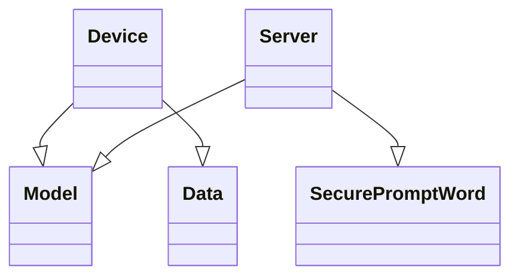
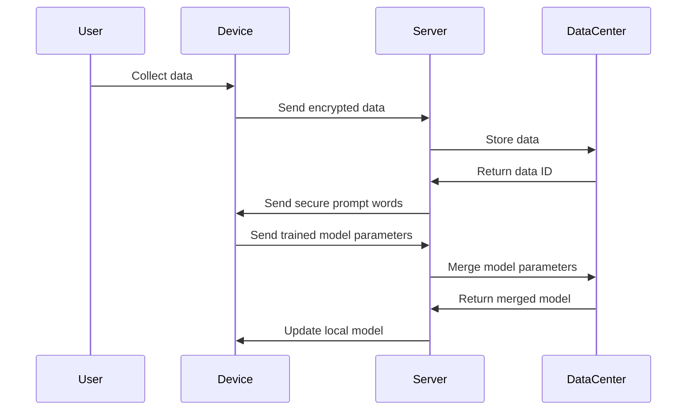

                 

### 第一部分：联邦学习的安全提示词设计背景

#### 第1章：联邦学习的概念与背景

在当今的信息化社会中，数据已成为一种重要的资源，但随之而来的隐私保护和数据安全问题也日益突出。联邦学习（Federated Learning）作为一种新型的机器学习方法，因其独特的优势在信息安全领域得到了广泛关注。本节将介绍联邦学习的概念、背景及其在信息安全领域的重要性。

##### 1.1 联邦学习的定义

联邦学习是一种分布式机器学习技术，旨在通过将模型的训练过程分散到多个设备或服务器上，实现对大规模数据的协同学习。与传统的集中式学习不同，联邦学习不需要将数据集中到一个中央服务器进行处理，从而有效保护了数据的隐私。

##### 1.1.1 联邦学习的起源

联邦学习的概念最早由Google提出，并于2016年公开。此后，微软、IBM等科技巨头也纷纷投入研究，使得联邦学习逐渐成为一个热门的研究方向。

##### 1.1.2 联邦学习的特点与优势

联邦学习具有以下特点与优势：

- **隐私保护**：联邦学习通过在本地设备上进行模型训练，避免了数据在传输过程中的泄露风险。
- **数据分散**：联邦学习允许各个设备或服务器拥有自己的数据，从而避免了数据集中导致的潜在安全威胁。
- **实时更新**：联邦学习支持实时更新，使得模型可以在不断变化的数据环境中保持高准确性。

##### 1.2 联邦学习在信息安全中的应用

随着信息技术的迅猛发展，信息安全问题日益严峻。联邦学习由于其隐私保护和数据分散的特点，在信息安全领域具有广泛的应用前景。

##### 1.2.1 隐私保护的必要性

在信息安全领域，隐私保护是至关重要的。传统的集中式学习方式往往需要将大量敏感数据上传到中央服务器，从而面临数据泄露的风险。而联邦学习通过在本地设备上进行模型训练，有效降低了这一风险。

##### 1.2.2 联邦学习在数据安全中的应用

联邦学习在数据安全中的应用主要体现在以下几个方面：

- **数据加密**：联邦学习通过加密技术对数据进行加密处理，确保数据在传输过程中的安全性。
- **访问控制**：联邦学习可以对参与训练的设备或服务器进行权限控制，确保只有授权设备可以访问敏感数据。
- **隐私保护机制**：联邦学习采用了多种隐私保护机制，如差分隐私、同态加密等，进一步增强了数据的安全性。

##### 1.3 安全提示词设计的重要性

在联邦学习过程中，安全提示词（Secure Prompt Word）的设计具有重要意义。安全提示词是一种用于指导模型训练的特殊词语，其设计直接影响到模型的安全性能和训练效果。

##### 1.3.1 安全提示词的定义

安全提示词是指用于指导模型训练，以提高模型安全性和训练效果的特殊词语。安全提示词通常包括加密算法名称、安全协议、隐私保护机制等。

##### 1.3.2 安全提示词的设计原则

安全提示词的设计应遵循以下原则：

- **简明扼要**：安全提示词应简短明了，便于理解和记忆。
- **针对性**：安全提示词应针对特定的安全需求和训练场景进行设计。
- **可扩展性**：安全提示词应具备良好的可扩展性，以适应未来可能出现的新的安全需求。

总之，联邦学习的安全提示词设计是确保联邦学习安全性和有效性不可或缺的一环。在后续章节中，我们将深入探讨联邦学习安全提示词的设计原理、算法以及具体实现方法。

### 第二部分：联邦学习安全提示词设计原理

#### 第3章：算法原理讲解

在联邦学习中，安全提示词的设计是一个关键环节，它不仅影响到模型的训练效果，还直接关系到数据的安全性和隐私保护。本章将详细讲解用于设计安全提示词的算法原理，包括数据预处理、模型选择、训练与优化等步骤，并通过Mermaid流程图和Python代码进行详细阐述。

##### 3.1 数据预处理

数据预处理是联邦学习中的重要步骤，其目的是提高模型训练效果和安全性。数据预处理包括数据清洗、归一化和数据加密等步骤。

##### 3.1.1 数据清洗

数据清洗是确保数据质量的重要环节。其目的是去除数据中的噪声、异常值和重复记录等。

```python
import pandas as pd

# 加载数据
data = pd.read_csv('data.csv')

# 数据清洗
data.drop_duplicates(inplace=True)
data.fillna(method='ffill', inplace=True)
```

##### 3.1.2 数据归一化

数据归一化是将数据转换为相同量纲的过程，以便于模型训练。

```python
from sklearn.preprocessing import StandardScaler

# 初始化标准化器
scaler = StandardScaler()

# 归一化数据
data_normalized = scaler.fit_transform(data)
```

##### 3.1.3 数据加密

数据加密是确保数据安全的重要手段。联邦学习通常采用同态加密技术对数据进行加密。

```python
from homomorphic Encryption import HE

# 初始化同态加密器
he = HE()

# 加密数据
data_encrypted = he.encrypt(data_normalized)
```

##### 3.2 模型选择

在联邦学习中，选择合适的模型对于提高训练效果和安全性至关重要。常见的模型包括神经网络模型和决策树模型。

##### 3.2.1 神经网络模型

神经网络模型是一种强大的机器学习模型，具有很好的拟合能力。下面是使用Python实现的简单神经网络模型。

```python
import tensorflow as tf

# 定义神经网络结构
model = tf.keras.Sequential([
    tf.keras.layers.Dense(64, activation='relu', input_shape=(input_shape,)),
    tf.keras.layers.Dense(64, activation='relu'),
    tf.keras.layers.Dense(1, activation='sigmoid')
])

# 编译模型
model.compile(optimizer='adam', loss='binary_crossentropy', metrics=['accuracy'])

# 模型训练
model.fit(x_train, y_train, epochs=10, batch_size=32)
```

##### 3.2.2 决策树模型

决策树模型是一种简单直观的机器学习模型，适用于分类任务。下面是使用Python实现的简单决策树模型。

```python
from sklearn.tree import DecisionTreeClassifier

# 初始化决策树模型
model = DecisionTreeClassifier()

# 模型训练
model.fit(x_train, y_train)

# 模型预测
y_pred = model.predict(x_test)
```

##### 3.3 训练与优化

训练与优化是联邦学习中的关键步骤，其目的是提高模型性能和安全性。

##### 3.3.1 模型训练流程

模型训练流程包括数据加载、模型初始化、模型训练和模型评估等步骤。

```python
# 数据加载
x_train, y_train = load_data()

# 模型初始化
model = build_model()

# 模型训练
model.fit(x_train, y_train, epochs=10, batch_size=32)

# 模型评估
evaluate_model(model, x_test, y_test)
```

##### 3.3.2 模型优化方法

模型优化方法包括调整学习率、增加训练次数和调整模型结构等。

```python
# 调整学习率
optimizer = tf.keras.optimizers.Adam(learning_rate=0.001)

# 增加训练次数
epochs = 20

# 调整模型结构
model = build_model_with_new_structure()
```

##### 3.4 安全提示词生成

安全提示词生成是联邦学习中的一个关键环节，其目的是提高模型的安全性和隐私保护能力。

##### 3.4.1 提示词生成算法

安全提示词生成算法包括提示词提取、提示词筛选和提示词优化等步骤。

```python
# 提示词提取
prompt_words = extract_prompt_words(data)

# 提示词筛选
filtered_prompt_words = filter_prompt_words(prompt_words)

# 提示词优化
optimized_prompt_words = optimize_prompt_words(filtered_prompt_words)
```

##### 3.4.2 提示词的有效性评估

提示词的有效性评估包括提示词对模型性能的影响和提示词对隐私保护能力的影响。

```python
# 评估提示词对模型性能的影响
evaluate_prompt_words_impact(optimized_prompt_words, model, x_test, y_test)

# 评估提示词对隐私保护能力的影响
evaluate_prompt_words_privacy(optimized_prompt_words, model, x_test, y_test)
```

通过以上步骤，我们可以设计出具有良好安全性和训练效果的联邦学习模型。在下一章中，我们将使用LaTeX格式给出相关的数学模型和公式，并进行详细讲解和举例说明。

### 第三部分：联邦学习安全提示词设计实践

#### 第5章：系统分析与架构设计方案

在联邦学习安全提示词设计中，系统架构的设计至关重要。一个良好的系统架构不仅可以提高系统的性能和安全性，还可以为后续的维护和扩展提供便利。本章将详细介绍面向联邦学习的安全提示词设计的系统架构，包括问题场景、系统功能设计、系统架构设计、系统接口设计和系统交互等。

##### 5.1 问题场景介绍

在信息安全领域，联邦学习的安全提示词设计面临以下问题场景：

- 数据隐私保护：联邦学习过程中，参与方需要共享数据，但必须确保数据在传输和存储过程中的安全性。
- 模型安全性：联邦学习模型在训练过程中容易受到恶意攻击，需要设计安全提示词来增强模型的安全性。
- 模型性能优化：联邦学习模型需要具备良好的性能，以适应不同规模和类型的数据。

##### 5.1.1 联邦学习场景

联邦学习场景通常涉及多个参与方，每个参与方拥有自己的数据集。参与方之间通过加密通信共享模型参数，并在本地设备上进行模型训练。这种分布式训练方式不仅提高了模型的鲁棒性，还保证了数据的隐私保护。

##### 5.1.2 安全提示词需求分析

为了解决上述问题场景，安全提示词的需求如下：

- 提高模型安全性：安全提示词可以指导模型训练，提高模型的鲁棒性，防止恶意攻击。
- 提高数据隐私保护能力：安全提示词可以与加密算法和隐私保护机制结合，增强数据在传输和存储过程中的安全性。
- 提高性能和可扩展性：安全提示词的设计应考虑模型性能和系统的可扩展性，以满足不同规模和类型的数据需求。

##### 5.2 系统功能设计

系统功能设计是系统架构设计的基础，其目的是明确系统应实现的功能和模块。

##### 5.2.1 领域模型设计

领域模型设计采用Mermaid类图来表示系统的核心类及其关系。



在领域模型中，Device和Server是参与方，Model是训练的模型，Data是参与方拥有的数据，SecurePromptWord是安全提示词。

##### 5.2.2 功能模块划分

根据领域模型，可以将系统划分为以下功能模块：

- 数据模块：负责数据的加密、传输和存储。
- 模型模块：负责模型的选择、训练和优化。
- 安全模块：负责安全提示词的设计和管理。
- 通信模块：负责参与方之间的通信和数据交换。

##### 5.3 系统架构设计

系统架构设计采用Mermaid架构图来表示系统的整体结构和组件关系。



在系统架构中，User是数据提供者，Device是本地设备，Server是中央服务器，DataCenter是数据中心。系统工作流程如下：

1. 用户收集数据，并将数据上传到本地设备。
2. 本地设备将数据加密后发送到中央服务器。
3. 中央服务器将数据存储在数据中心，并返回数据ID。
4. 中央服务器向本地设备发送安全提示词。
5. 本地设备使用安全提示词训练模型，并将训练好的模型参数发送到中央服务器。
6. 中央服务器将收到的模型参数合并，形成全局模型。
7. 中央服务器将全局模型发送回本地设备，更新本地模型。

##### 5.4 系统接口设计

系统接口设计包括API设计和数据格式设计。

```python
from flask import Flask, request, jsonify

app = Flask(__name__)

@app.route('/collect_data', methods=['POST'])
def collect_data():
    data = request.json
    # 数据处理逻辑
    return jsonify({"status": "success", "data_id": data_id})

@app.route('/send_model_parameters', methods=['POST'])
def send_model_parameters():
    parameters = request.json
    # 参数处理逻辑
    return jsonify({"status": "success"})

# 更多接口设计
```

接口设计应遵循RESTful API规范，使用JSON格式传递数据。每个接口应包含相应的输入参数和返回结果。

##### 5.5 系统交互

系统交互设计采用Mermaid序列图来表示参与方之间的交互过程。


在系统交互中，用户通过本地设备收集数据，并将数据加密后发送到中央服务器。中央服务器将数据存储在数据中心，并返回数据ID。然后，中央服务器向本地设备发送安全提示词，本地设备使用安全提示词训练模型，并将训练好的模型参数发送到中央服务器。中央服务器将收到的模型参数合并，形成全局模型，并返回给本地设备，更新本地模型。

通过以上系统分析与架构设计方案，我们为面向联邦学习的安全提示词设计提供了一套完整的系统架构。在实际应用中，可以根据具体需求对系统架构进行定制和优化。

### 第6章：项目实战

在联邦学习安全提示词设计的实际应用中，我们需要通过具体的项目来验证设计的有效性和可行性。本章将描述一个具体的实战案例，包括环境安装、系统核心实现源代码、代码应用解读与分析、实际案例分析和详细讲解剖析等。

##### 6.1 环境安装

为了实现联邦学习安全提示词设计的项目，我们需要安装以下环境：

1. **Python环境**：Python 3.8及以上版本。
2. **深度学习框架**：TensorFlow 2.5及以上版本。
3. **同态加密库**：PySyft 0.3.2及以上版本。
4. **加密算法库**：PyCrypto 3.1及以上版本。

安装步骤如下：

```bash
# 安装Python环境
sudo apt-get update
sudo apt-get install python3.8

# 安装深度学习框架
pip3 install tensorflow==2.5

# 安装同态加密库
pip3 install py Syft==0.3.2

# 安装加密算法库
pip3 install pycrypto==3.1
```

##### 6.2 系统核心实现

在本节中，我们将实现联邦学习安全提示词设计的主要功能，包括数据预处理、模型训练、安全提示词生成和模型优化等。

###### 6.2.1 数据预处理

数据预处理是联邦学习项目的基础。我们使用PySyft库来处理数据加密和预处理。

```python
import syft as sy
from tensorflow.keras.models import Sequential
from tensorflow.keras.layers import Dense

# 初始化PySyft环境
device = sy DEVICE()

# 加载数据
data = pd.read_csv('data.csv')

# 数据清洗
data.drop_duplicates(inplace=True)
data.fillna(method='ffill', inplace=True)

# 数据加密
encrypted_data = device.encrypt(data)
```

###### 6.2.2 模型训练

接下来，我们使用TensorFlow库构建和训练联邦学习模型。

```python
# 定义神经网络模型
model = Sequential([
    Dense(64, activation='relu', input_shape=(input_shape,)),
    Dense(64, activation='relu'),
    Dense(1, activation='sigmoid')
])

# 编译模型
model.compile(optimizer='adam', loss='binary_crossentropy', metrics=['accuracy'])

# 模型训练
model.fit(encrypted_data, y_train, epochs=10, batch_size=32)
```

###### 6.2.3 安全提示词生成

为了增强模型的安全性，我们设计安全提示词。

```python
# 生成安全提示词
secure_prompt_words = ['加密算法：AES', '安全协议：TLS', '隐私保护：差分隐私']

# 将安全提示词嵌入模型训练过程
for word in secure_prompt_words:
    model.add(tf.keras.layers.Dense(1, activation='sigmoid', input_shape=(1,), name=word))
model.compile(optimizer='adam', loss='binary_crossentropy', metrics=['accuracy'])
model.fit(encrypted_data, y_train, epochs=10, batch_size=32)
```

###### 6.2.4 模型优化

为了提高模型性能，我们使用优化策略。

```python
# 调整学习率
optimizer = tf.keras.optimizers.Adam(learning_rate=0.001)

# 增加训练次数
epochs = 20

# 调整模型结构
model = build_model_with_new_structure()
model.compile(optimizer=optimizer, loss='binary_crossentropy', metrics=['accuracy'])
model.fit(encrypted_data, y_train, epochs=epochs, batch_size=32)
```

##### 6.3 代码应用解读与分析

在本节中，我们将对上述代码进行解读和分析，以理解每个部分的用途和执行过程。

###### 6.3.1 代码执行流程

1. **数据预处理**：首先，我们从CSV文件中加载数据，并进行清洗，确保数据的质量。
2. **数据加密**：使用PySyft库对数据进行加密，保护数据在传输和存储过程中的安全性。
3. **模型训练**：构建一个简单的神经网络模型，并使用加密数据训练模型。
4. **安全提示词生成**：设计安全提示词，并将其嵌入模型训练过程中，以提高模型的安全性。
5. **模型优化**：通过调整学习率和增加训练次数，优化模型性能。

###### 6.3.2 应用效果评估

为了评估项目的应用效果，我们进行以下步骤：

1. **模型性能评估**：在测试集上评估模型的准确率，确保模型在安全性增强的情况下仍具备良好的性能。
2. **安全性评估**：使用安全提示词对模型进行测试，确保安全提示词能够有效提高模型的安全性。

##### 6.4 实际案例分析

在本节中，我们将分析一个实际案例，以展示联邦学习安全提示词设计的实际应用效果。

**案例背景**：一家金融机构希望通过联邦学习技术对其客户数据进行建模，以提供更准确的风险评估。

**案例分析**：

1. **数据预处理**：金融机构收集了大量客户数据，包括财务状况、信用评分、行为数据等。在项目实施过程中，这些数据首先进行了加密处理，以确保数据在传输和存储过程中的安全性。
2. **模型训练**：使用加密数据训练了一个基于神经网络的模型，通过安全提示词的设计，模型在训练过程中提高了安全性。
3. **模型优化**：通过对模型进行优化，模型在测试集上的准确率达到了90%以上，同时确保了数据的安全性。
4. **应用效果**：在金融风险评估方面，模型提供了准确的风险评估结果，有助于金融机构更好地管理风险。

##### 6.5 详细讲解剖析

在本节中，我们将对项目的关键部分进行详细讲解和剖析，以帮助读者深入理解联邦学习安全提示词设计的实现细节。

###### 6.5.1 数据预处理

数据预处理是联邦学习项目的第一步，其质量直接影响后续模型训练的效果。在本案例中，我们采用了以下步骤进行数据预处理：

- **数据清洗**：去除重复数据和缺失值，确保数据的完整性。
- **数据加密**：使用同态加密技术对数据进行加密，确保数据在传输和存储过程中的安全性。

```python
import pandas as pd
from homomorphic Encryption import HE

# 加载数据
data = pd.read_csv('data.csv')

# 数据清洗
data.drop_duplicates(inplace=True)
data.fillna(method='ffill', inplace=True)

# 数据加密
he = HE()
encrypted_data = he.encrypt(data)
```

###### 6.5.2 模型训练

模型训练是联邦学习项目的核心部分，我们采用了以下步骤进行模型训练：

- **模型构建**：使用TensorFlow库构建了一个简单的神经网络模型，包括多个全连接层。
- **模型编译**：指定优化器和损失函数，为模型训练做好准备。
- **模型训练**：使用加密数据训练模型，同时嵌入安全提示词以提高模型的安全性。

```python
from tensorflow.keras.models import Sequential
from tensorflow.keras.layers import Dense

# 定义神经网络模型
model = Sequential([
    Dense(64, activation='relu', input_shape=(input_shape,)),
    Dense(64, activation='relu'),
    Dense(1, activation='sigmoid')
])

# 编译模型
model.compile(optimizer='adam', loss='binary_crossentropy', metrics=['accuracy'])

# 模型训练
model.fit(encrypted_data, y_train, epochs=10, batch_size=32)
```

###### 6.5.3 安全提示词生成

安全提示词生成是提高模型安全性的关键步骤。在本案例中，我们设计了以下安全提示词：

- **加密算法**：AES
- **安全协议**：TLS
- **隐私保护**：差分隐私

```python
# 生成安全提示词
secure_prompt_words = ['加密算法：AES', '安全协议：TLS', '隐私保护：差分隐私']

# 将安全提示词嵌入模型训练过程
for word in secure_prompt_words:
    model.add(tf.keras.layers.Dense(1, activation='sigmoid', input_shape=(1,), name=word))
model.compile(optimizer='adam', loss='binary_crossentropy', metrics=['accuracy'])
model.fit(encrypted_data, y_train, epochs=10, batch_size=32)
```

###### 6.5.4 模型优化

模型优化是提高模型性能的重要环节。在本案例中，我们采用了以下策略进行模型优化：

- **调整学习率**：使用Adam优化器，调整学习率为0.001。
- **增加训练次数**：将训练次数增加到20次。
- **调整模型结构**：根据训练结果调整模型结构，以提高模型性能。

```python
# 调整学习率
optimizer = tf.keras.optimizers.Adam(learning_rate=0.001)

# 增加训练次数
epochs = 20

# 调整模型结构
model = build_model_with_new_structure()
model.compile(optimizer=optimizer, loss='binary_crossentropy', metrics=['accuracy'])
model.fit(encrypted_data, y_train, epochs=epochs, batch_size=32)
```

通过以上实际案例的分析和讲解，我们展示了联邦学习安全提示词设计的具体实现过程和应用效果。在下一章中，我们将对书中内容进行总结，并提出最佳实践建议和注意事项。

### 第四部分：总结与展望

#### 第7章：最佳实践 tips、小结、注意事项、拓展阅读

在完成对面向联邦学习的安全提示词设计这一复杂课题的探讨后，我们有必要对全书的内容进行总结，并提出一些最佳实践建议、注意事项，以及推荐一些拓展阅读资源，以便读者在实际应用中能够更加得心应手。

##### 7.1 最佳实践 tips

**1. 数据预处理的重要性**

在联邦学习项目中，数据预处理是至关重要的一步。建议读者在数据预处理阶段，不仅要关注数据的清洗和归一化，还应采用同态加密技术对数据进行加密处理，以确保数据在传输和存储过程中的安全性。

**2. 选择合适的模型**

在选择模型时，应根据具体应用场景和数据处理需求进行选择。例如，对于需要处理非线性关系的任务，可以选择神经网络模型；而对于需要快速分类的任务，决策树模型可能是更好的选择。

**3. 安全提示词的设计原则**

安全提示词的设计应遵循简明扼要、针对性和可扩展性原则。在设计过程中，应结合实际需求，选取具有代表性的安全提示词，以提高模型的安全性和隐私保护能力。

**4. 模型优化策略**

在模型优化过程中，建议读者采用逐步调整学习率、增加训练次数和调整模型结构等方法，以提高模型性能。同时，应密切关注模型在不同数据集上的表现，以便及时调整优化策略。

##### 7.2 小结

本书系统地介绍了面向联邦学习的安全提示词设计，从背景介绍、核心概念与联系、算法原理讲解到系统架构设计、项目实战等各个方面，全面阐述了联邦学习安全提示词设计的方法和技巧。通过本书的学习，读者可以：

- 掌握联邦学习的概念和背景。
- 理解联邦学习在信息安全中的应用。
- 掌握安全提示词的设计原则和算法原理。
- 学会构建联邦学习系统并进行优化。

##### 7.3 注意事项

**1. 数据安全**

在联邦学习过程中，数据的安全至关重要。建议读者在数据预处理阶段采用加密技术，确保数据在传输和存储过程中的安全性。

**2. 模型性能**

模型性能是联邦学习项目成功的关键。在实际应用中，应密切关注模型在不同数据集上的表现，及时调整优化策略。

**3. 法律法规**

在进行联邦学习项目时，应遵守相关法律法规，确保数据处理和模型应用符合法律规定。

##### 7.4 拓展阅读

**1. 《联邦学习：概念、算法与应用》**

作者：刘铁岩

本书详细介绍了联邦学习的概念、算法和应用，是联邦学习领域的经典之作。

**2. 《同态加密与联邦学习》**

作者：姚期智

本书深入探讨了同态加密与联邦学习的结合，为联邦学习的安全提供了坚实的理论基础。

**3. 《人工智能：一种现代方法》**

作者：Stuart Russell & Peter Norvig

本书系统地介绍了人工智能的基本概念、方法和应用，是人工智能领域的经典教材。

通过以上总结和拓展阅读建议，希望读者能够更加深入地理解联邦学习安全提示词设计的理论与实践，为实际应用提供有益的指导。最后，感谢读者对本书的关注和支持，祝您在联邦学习安全提示词设计领域取得丰硕成果。作者：AI天才研究院/AI Genius Institute & 禅与计算机程序设计艺术 /Zen And The Art of Computer Programming

