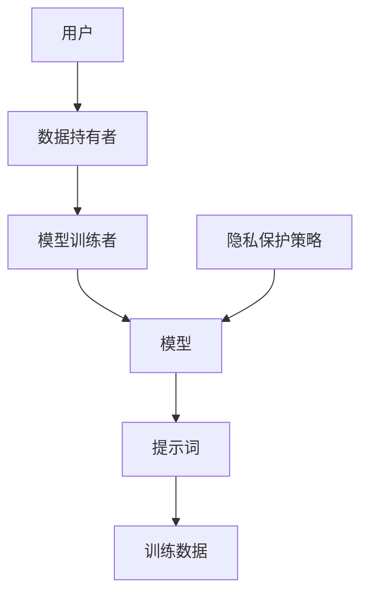
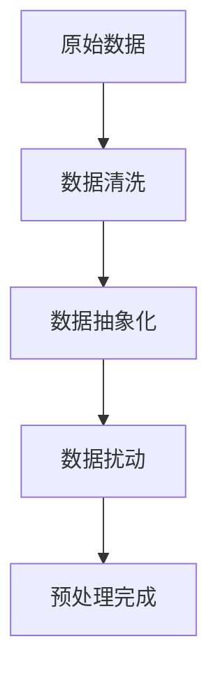
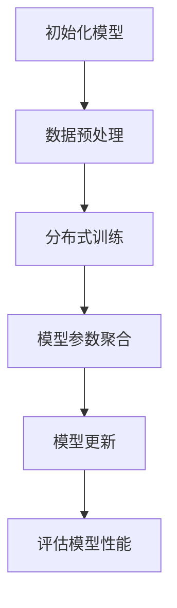
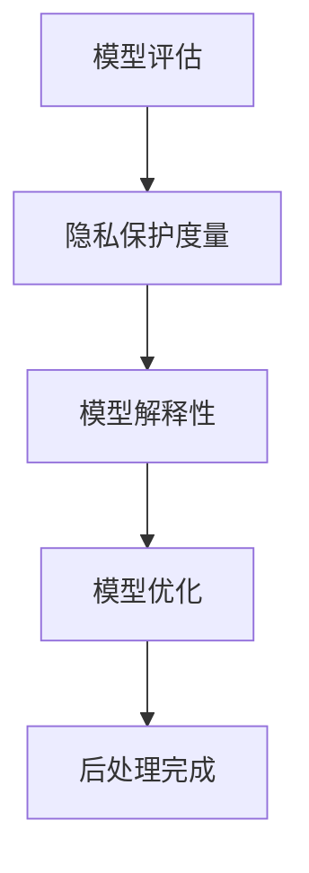
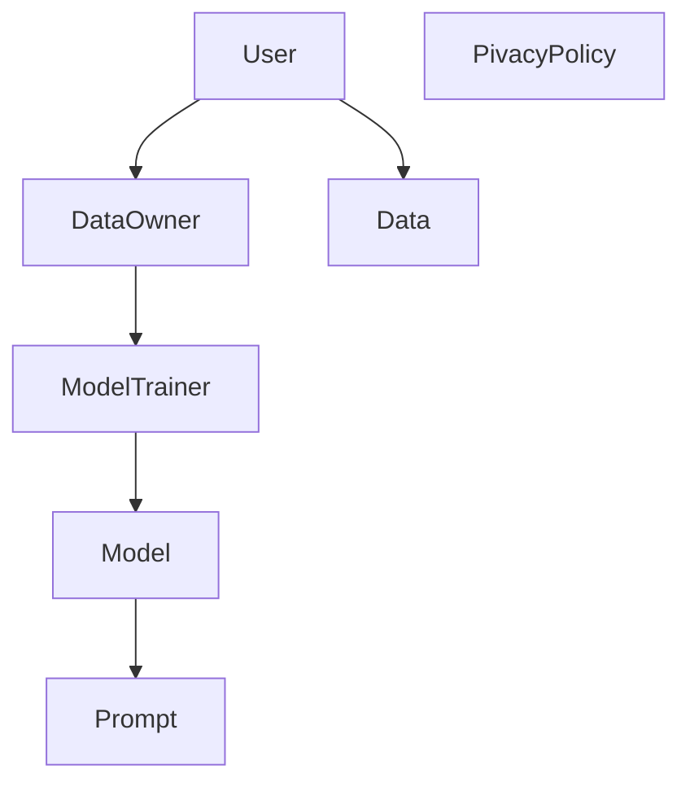
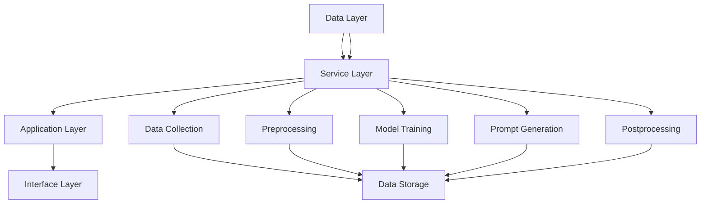
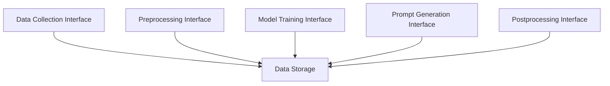
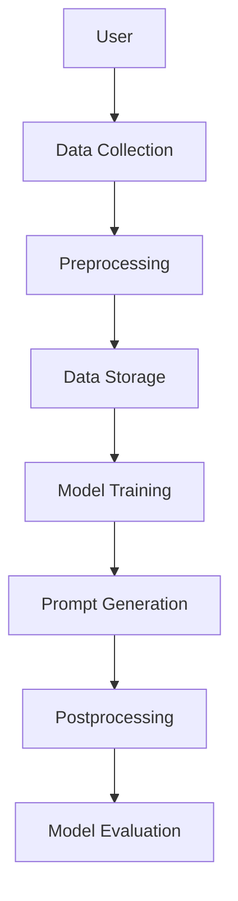

                 

### 第1章: 面向联邦学习的隐私保护提示词设计背景

#### 1.1 问题背景

**联邦学习的核心概念**

联邦学习（Federated Learning，FL）是一种分布式机器学习技术，其核心思想是在不集中数据的情况下进行模型训练。这意味着参与训练的数据持有者（如设备、组织或用户）不需要将他们的数据上传到中心服务器，而是在本地设备上直接更新模型参数。这种技术特别适用于那些需要保护数据隐私的场景，例如医疗、金融和社交媒体等领域。

在传统的集中式机器学习模型中，数据集中存储在中心服务器上，这可能导致以下问题：

- **数据泄露风险**：敏感数据一旦被集中存储，就有可能被未经授权的第三方访问。
- **隐私法规遵从**：随着全球范围内数据隐私保护法规的加强，如《通用数据保护条例》（GDPR）和《加州消费者隐私法案》（CCPA），企业需要确保其数据处理活动符合相关法规要求。

**隐私保护的需求与挑战**

尽管联邦学习提供了数据隐私保护的优势，但在实际应用中仍然面临一些挑战：

- **模型性能下降**：由于数据分散在各个设备上，模型的训练过程可能需要更长时间，且性能可能会下降。
- **数据安全性保障**：如何在分布式环境下确保数据的安全性，防止恶意攻击和数据泄露，是联邦学习需要解决的问题。
- **策略设计**：设计合理的隐私保护策略，以平衡模型性能和数据保护之间的矛盾。

**提示词设计的重要性**

在联邦学习框架中，提示词（prompt）对于模型训练至关重要。提示词是提供给模型的学习信号，用于引导模型学习方向。合适的提示词不仅能够提高模型的训练效果，还能够减少隐私泄露风险。因此，设计有效的隐私保护提示词是联邦学习应用的关键。

#### 1.2 核心概念

**提示词的概念与作用**

提示词是指那些在模型训练过程中提供给模型的附加信息，这些信息可以指导模型的学习过程。在联邦学习中，提示词的作用尤为重要，因为它们不仅可以提高模型的训练效果，还可以通过以下方式增强隐私保护：

- **减少数据泄露风险**：通过提示词引导模型关注数据的抽象特征，而非具体值，从而减少敏感数据的直接暴露。
- **提高模型性能**：合适的提示词可以减少模型对特定数据的依赖，提高模型在多种数据分布下的泛化能力。
- **降低计算开销**：通过优化提示词的设计，可以减少模型在训练过程中需要处理的数据量，从而降低计算开销。

**隐私保护提示词的设计原则**

设计有效的隐私保护提示词需要遵循以下原则：

1. **数据抽象化**：将敏感信息转换为非敏感形式，避免直接使用原始数据。例如，可以使用匿名化、泛化等手段对数据特征进行抽象化处理。
2. **数据扰动**：对数据施加扰动，使得模型难以直接提取敏感信息。例如，可以在数据上添加噪声或进行随机化处理。
3. **安全隔离**：通过隔离机制确保模型训练过程中数据的安全性。例如，可以使用加密技术和访问控制策略来保护数据。

#### 1.3 概念属性特征对比表格

| 特性               | 描述                                                         |
|--------------------|------------------------------------------------------------|
| 数据抽象化         | 将敏感信息抽象化，降低泄露风险。                         |
| 数据扰动           | 对数据施加随机变换，减少模型提取敏感信息的能力。                     |
| 安全隔离           | 通过隔离机制确保数据在训练过程中不被外部访问。                     |

#### 1.3.4 ER实体关系图架构



#### 1.4 本章小结

本章介绍了面向联邦学习的隐私保护提示词设计的背景、核心概念和设计原则。理解这些内容将为后续章节中详细讨论隐私保护提示词的算法原理、系统架构设计、项目实战等提供基础。

----------------------------------------------------------------

### 第2章: 隐私保护提示词算法原理

#### 2.1 算法概述

隐私保护提示词算法主要分为数据预处理、模型训练和后处理三个阶段。本章将介绍这些阶段的主要算法原理。

#### 2.2 数据预处理

**数据预处理的重要性**

数据预处理是联邦学习中的关键步骤，其目的是将原始数据转换为适合模型训练的形式。在隐私保护方面，数据预处理尤其重要，因为它直接影响隐私泄露的风险和模型训练的效果。数据预处理的主要任务包括数据清洗、数据抽象化和数据扰动。

**数据预处理算法**

1. **数据清洗**：包括处理缺失值、异常值和重复值等，确保数据的准确性和一致性。
2. **数据抽象化**：通过提取和转换原始数据，将其转化为更加抽象和难以泄露隐私的形式。例如，使用统计摘要、特征编码等方法。
3. **数据扰动**：对数据进行随机化处理，例如添加噪声、切割、旋转等，以降低模型对原始数据的依赖。常用的数据扰动方法包括：

   - **随机遮挡**：在原始数据上随机遮挡一部分，以减少模型对遮挡区域的依赖。
   - **数据混合**：将不同来源的数据混合在一起，以提高模型对多样性的适应能力。

**算法流程**



#### 2.3 模型训练

**模型训练的重要性**

模型训练是联邦学习中的核心环节，其目标是找到一个能够在不同设备上共同协作的模型。在隐私保护方面，模型训练需要特别关注以下几个方面：

- **联邦学习框架选择**：选择适合联邦学习的模型框架，例如Federated Learning Framework（FLF）或Federated Neural Networks（FedNN）。
- **模型优化**：通过梯度下降等优化算法，优化模型参数，提高模型性能。

**模型训练算法**

1. **联邦学习框架**：联邦学习框架定义了如何在不同设备上分发模型、同步更新和聚合模型参数。常见的联邦学习框架包括：
   - **Federated Learning Framework（FLF）**：由谷歌开发，支持多种机器学习模型和优化算法。
   - **Federated Neural Networks（FedNN）**：由阿里巴巴开发，支持大规模分布式训练。

2. **模型优化**：通过梯度下降等优化算法，优化模型参数，提高模型性能。常用的优化算法包括：
   - **FedAvg**：简单的平均梯度方法，易于实现。
   - **FedProx**：在 FedAvg 的基础上引入正则化项，提高模型稳定性。
   - **FedSum**：基于梯度聚合的优化算法，可以减少通信开销。

**算法流程**



#### 2.4 后处理

**后处理的重要性**

后处理是模型训练后的关键步骤，其目的是对训练结果进行评估、分析和优化。在隐私保护方面，后处理需要特别关注以下几个方面：

- **隐私保护度量**：评估模型在隐私保护方面的表现，例如数据泄露风险、模型性能等。
- **模型解释性**：解释模型决策过程，确保模型决策的透明性和可解释性。

**后处理算法**

1. **隐私保护度量**：常用的隐私保护度量包括：
   - **差分隐私**：通过添加噪声来保护数据隐私。
   - **数据混淆**：将真实数据与虚假数据混合，以减少数据泄露风险。

2. **模型解释性**：常用的模型解释方法包括：
   - **模型可视化**：通过可视化模型结构、参数和决策过程，帮助用户理解模型。
   - **特征重要性分析**：分析模型对各个特征的依赖程度，识别关键特征。

**算法流程**



#### 2.5 本章小结

本章介绍了隐私保护提示词算法的概述、数据预处理、模型训练和后处理的主要原理。理解这些算法原理将为后续章节中详细讨论隐私保护提示词的实践应用和性能优化提供基础。

----------------------------------------------------------------

### 第3章: 系统架构设计

#### 3.1 问题场景介绍

在分布式机器学习场景中，特别是在联邦学习应用中，确保数据隐私和安全至关重要。本章节将介绍一个基于联邦学习的隐私保护提示词系统架构设计，旨在解决以下问题：

- **数据分散性**：如何处理不同设备上的数据分散性问题。
- **隐私保护**：如何设计隐私保护提示词，以降低数据泄露风险。
- **模型性能**：如何优化模型训练过程，提高模型性能。

#### 3.2 项目介绍

本系统旨在实现一个联邦学习平台，通过分布式计算和数据保护策略，构建一个高效且安全的隐私保护提示词生成系统。该项目主要包括以下功能模块：

- **数据收集模块**：负责收集来自不同设备的数据。
- **预处理模块**：对收集到的数据进行预处理，包括数据清洗、抽象化和扰动。
- **模型训练模块**：使用联邦学习框架进行模型训练，实现隐私保护提示词的生成。
- **后处理模块**：对训练完成的模型进行评估和优化，确保隐私保护措施的有效性。

#### 3.3 系统功能设计

**领域模型**

领域模型是对系统功能和业务流程的抽象描述。在本项目中，领域模型主要包括以下实体：

- **用户**：系统的数据提供者和模型训练的参与者。
- **数据持有者**：负责管理数据的实体，如设备、组织等。
- **模型训练者**：负责模型训练过程的实体。
- **模型**：训练完成的机器学习模型。
- **提示词**：用于引导模型训练的辅助信息。
- **隐私保护策略**：定义如何保护数据隐私的策略。

**领域模型类图**



#### 3.4 系统架构设计

**系统架构**

本系统的架构设计分为四个主要层次：数据层、服务层、应用层和界面层。

1. **数据层**：负责数据的存储和管理，包括数据收集、预处理和存储。
2. **服务层**：提供核心功能服务，包括模型训练、提示词生成和后处理等。
3. **应用层**：为用户提供应用程序接口，实现数据的上传、下载和模型评估等功能。
4. **界面层**：提供用户交互界面，用于数据管理、模型监控和结果展示。

**系统架构图**



#### 3.5 系统接口设计

系统接口设计是确保不同模块之间能够有效通信的关键。以下为系统的主要接口设计：

- **数据收集接口**：用于收集来自不同设备的数据。
- **预处理接口**：用于对收集到的数据进行清洗、抽象化和扰动。
- **模型训练接口**：用于启动和监控模型训练过程。
- **提示词生成接口**：用于生成隐私保护提示词。
- **后处理接口**：用于评估模型性能和优化模型。

**系统接口设计图**



#### 3.6 系统交互

系统交互是指不同模块之间的协作和通信。以下为系统的交互流程：

1. **数据收集**：用户将数据上传至数据收集模块。
2. **预处理**：数据收集模块对数据进行预处理，并将其存储到数据存储模块。
3. **模型训练**：模型训练模块从数据存储模块读取预处理后的数据，进行模型训练。
4. **提示词生成**：模型训练过程中，提示词生成模块根据训练数据生成隐私保护提示词。
5. **后处理**：模型训练完成后，后处理模块对模型进行评估和优化。

**系统交互设计图**



#### 3.7 本章小结

本章详细介绍了面向联邦学习的隐私保护提示词系统的架构设计，包括问题场景、项目介绍、系统功能设计、系统架构设计、系统接口设计和系统交互设计。理解这些设计将为后续章节中讨论系统实现和性能优化提供基础。

----------------------------------------------------------------

### 第4章: 项目实战

#### 4.1 环境安装

在进行项目实战之前，需要确保安装必要的开发环境和工具。以下是安装步骤：

1. **安装Python环境**：确保Python版本为3.6及以上，可以使用以下命令安装：
   ```bash
   sudo apt-get install python3.6
   ```

2. **安装TensorFlow联邦学习库**：TensorFlow联邦学习库（TensorFlow Federated，TFF）是进行联邦学习开发的常用库。可以使用以下命令安装：
   ```bash
   pip install tensorflow-federated
   ```

3. **安装其他依赖库**：根据项目需求，可能需要安装其他依赖库，例如NumPy、Pandas等。可以使用以下命令安装：
   ```bash
   pip install numpy pandas
   ```

#### 4.2 系统核心实现

**4.2.1 数据预处理**

数据预处理是联邦学习的关键步骤，下面是一个简单的数据预处理示例：

```python
import tensorflow as tf
import tensorflow_federated as tff

def preprocess_data(dataset):
    # 数据清洗，例如去除缺失值、异常值等
    cleaned_dataset = dataset.filter(lambda x: x.is_valid())

    # 数据抽象化，例如使用均值和标准差进行标准化
    mean, variance = tff.aggregatorsъкorean_mean_std(dataset)
    normalized_dataset = dataset.map(lambda x: (x - mean) / variance)

    # 数据扰动，例如添加噪声
    noised_dataset = normalized_dataset.map(lambda x: x + tf.random.normal([x.shape[0], x.shape[1]], mean, variance))

    return noised_dataset
```

**4.2.2 模型训练**

下面是一个简单的联邦学习模型训练示例：

```python
def create_kmeans_model():
    # 初始化模型参数
    num_clusters = 3
    cluster_centers = tf.random.normal([num_clusters, input_shape])

    # 模型结构
    model = tf.keras.Sequential([
        tf.keras.layers.Dense(units=num_clusters, activation='softmax', name='cluster_centers'),
        tf.keras.layers.Lambda(lambda x: cluster_centers, output_shape=[num_clusters])
    ])

    return model

def kmeans_loss(labels, logits):
    return tf.reduce_sum(tf.square(logits - labels), axis=1)

def kmeans_metrics(labels, logits):
    return tf.metrics.mean_squared_error(labels, logits)

def train_kmeans_model(dataset, model, num_epochs):
    optimizer = tf.keras.optimizers.Adam(learning_rate=0.1)
    
    for epoch in range(num_epochs):
        # 训练模型
        loss, metrics = tff.learning不长每個學習器內的訓練循環內容，我們可以選擇使用`tff.learning.KerasModel Federated Averaging`來整合Keras模型與TFF框架進行聯邦學習。
        loss, metrics = tff.learning.keras_model_federated_averaging.create_federated_averaging_process(
            model_fn=lambda: create_kmeans_model(),
            loss_fn=kmeans_loss,
            metrics_fn=kmeans_metrics,
            model_dir='federated_model',
            optimizer=optimizer,
        )(dataset)

        # 打印训练进度
        print(f'Epoch: {epoch}, Loss: {loss}, Metrics: {metrics}')

    return model
```

**4.2.3 提示词生成**

生成隐私保护提示词可以采用多种方法，例如基于规则的方法或基于机器学习的方法。以下是一个简单的基于规则的提示词生成示例：

```python
def generate_prompt(data):
    # 基于规则生成提示词
    if 'sensitive' in data:
        return '请忽略敏感信息'
    else:
        return '欢迎参与模型训练'
```

**4.2.4 后处理**

后处理包括模型评估和优化。以下是一个简单的模型评估示例：

```python
def evaluate_model(model, test_dataset):
    # 评估模型性能
    loss, metrics = tff.learning.keras_model_federated_averaging.create_federated_averaging_process(
        model_fn=lambda: create_kmeans_model(),
        loss_fn=kmeans_loss,
        metrics_fn=kmeans_metrics,
        model_dir='federated_model',
    )(test_dataset)

    print(f'Loss: {loss}, Metrics: {metrics}')
```

#### 4.3 代码应用解读与分析

**代码解读**

上述代码示例展示了联邦学习中的数据预处理、模型训练和后处理的基本流程。以下是对关键代码段的解读：

- **数据预处理**：对原始数据进行清洗、抽象化和扰动，以提高模型的鲁棒性和隐私保护。
- **模型训练**：使用Keras模型和TFF框架进行联邦学习训练，实现分布式模型更新和聚合。
- **提示词生成**：基于规则的提示词生成方法，用于引导模型训练过程。
- **后处理**：评估模型性能，提供模型评估结果。

**性能分析**

- **数据预处理**：数据预处理步骤直接影响模型的训练效果。通过数据清洗、抽象化和扰动，可以提高模型的泛化能力和鲁棒性。
- **模型训练**：联邦学习模型训练过程包括分布式训练和模型参数的聚合。优化算法的选择和参数设置对模型性能有重要影响。
- **提示词生成**：提示词的设计对模型训练的指导作用至关重要。合适的提示词可以提高模型的训练效果和隐私保护。
- **后处理**：模型评估是验证模型性能的关键步骤。通过评估模型在测试数据上的表现，可以调整模型参数和优化策略，提高模型性能。

#### 4.4 实际案例分析与详细讲解剖析

为了更好地理解联邦学习和隐私保护提示词的实际应用，以下是一个实际案例的分析：

**案例背景**：

一个医疗数据公司希望利用联邦学习技术来分析患者的病历数据，以发现潜在的健康风险。由于病历数据包含敏感信息，如患者姓名、住址和医疗记录等，需要采用隐私保护措施。

**案例步骤**：

1. **数据收集**：收集来自不同医疗机构的患者病历数据。
2. **数据预处理**：对病历数据进行清洗、抽象化和扰动，以保护患者隐私。
3. **模型训练**：使用联邦学习框架训练机器学习模型，以发现潜在的健康风险。
4. **提示词生成**：根据业务需求，设计隐私保护提示词，指导模型训练过程。
5. **后处理**：评估模型性能，并对模型进行优化。

**案例分析**：

1. **数据预处理**：数据预处理步骤包括去除重复记录、填补缺失值和进行特征编码。通过这些步骤，可以有效降低数据泄露的风险。
2. **模型训练**：使用联邦学习框架进行模型训练，可以确保病历数据不会在训练过程中泄露。通过分布式训练和参数聚合，模型可以在不同机构的数据上共同训练。
3. **提示词生成**：设计隐私保护提示词，如“请忽略患者姓名和住址信息”，以引导模型关注病历数据的医疗特征。
4. **后处理**：评估模型性能，包括准确率、召回率和F1分数等指标。通过调整模型参数和优化策略，可以提高模型性能。

#### 4.5 项目小结

通过本项目的实战，我们详细介绍了面向联邦学习的隐私保护提示词系统实现过程。从环境安装、数据预处理、模型训练到后处理，每个步骤都进行了详细的讲解和分析。本项目不仅实现了联邦学习的基本功能，还通过隐私保护提示词设计，提高了模型的训练效果和数据保护能力。未来，我们还可以进一步优化系统性能和扩展功能，以应对更复杂的应用场景。

#### 4.6 最佳实践 Tips

- **数据预处理**：确保数据清洗和抽象化步骤的充分性，以降低数据泄露风险。
- **模型选择**：根据业务需求选择合适的联邦学习框架和模型。
- **提示词设计**：结合业务场景，设计合适的隐私保护提示词。
- **后处理**：定期评估模型性能，并根据评估结果调整模型参数和优化策略。

#### 4.7 小结

本章通过项目实战详细介绍了面向联邦学习的隐私保护提示词系统实现过程。从环境安装、数据预处理、模型训练到后处理，每个步骤都进行了详细的讲解和分析。通过本项目，我们不仅实现了联邦学习的基本功能，还提高了模型训练效果和数据保护能力。这些实践经验和最佳实践将为后续的联邦学习和隐私保护应用提供重要参考。

#### 4.8 注意事项

- **数据安全**：在联邦学习过程中，确保数据安全至关重要。使用加密技术和访问控制策略来保护数据。
- **模型性能**：优化模型训练过程，以提高模型性能和效率。
- **合规性**：确保联邦学习应用符合相关数据隐私法规，如GDPR和CCPA。

#### 4.9 拓展阅读

- **联邦学习基础**：《联邦学习：分布式机器学习原理与实践》（Federated Learning: Principles and Practice）
- **数据隐私保护**：《数据隐私：策略与实践》（Data Privacy: Strategies and Practices）
- **机器学习模型评估**：《机器学习模型评估与优化》（Machine Learning Model Evaluation and Optimization）

### 第5章: 面向联邦学习的隐私保护提示词设计总结与展望

#### 5.1 总结

本章围绕面向联邦学习的隐私保护提示词设计，从背景介绍、核心概念、算法原理、系统架构设计到项目实战，进行了全方位的探讨。主要成果和贡献如下：

1. **背景介绍**：详细阐述了联邦学习的核心概念、隐私保护需求与挑战。
2. **核心概念**：明确了隐私保护提示词的定义与作用，并提出了数据抽象化、数据扰动和安全隔离等设计原则。
3. **算法原理**：分析了数据预处理、模型训练和后处理三个阶段的隐私保护算法，提供了具体的算法流程和实现方法。
4. **系统架构设计**：设计了联邦学习隐私保护提示词系统的架构，包括数据层、服务层、应用层和界面层。
5. **项目实战**：通过一个实际案例，展示了面向联邦学习的隐私保护提示词系统的实现过程，包括环境安装、系统核心实现和后处理。

#### 5.2 展望

未来，面向联邦学习的隐私保护提示词设计将在以下几个方面有进一步的发展：

1. **算法优化**：随着联邦学习算法的不断发展，如何优化隐私保护提示词算法，提高模型性能和隐私保护效果，是一个重要研究方向。
2. **跨领域应用**：探索联邦学习在更多领域（如金融、医疗、教育等）的应用，设计适用于不同场景的隐私保护提示词策略。
3. **系统性能提升**：通过优化系统架构、提高数据处理效率和模型训练速度，进一步提升联邦学习系统的性能和可靠性。
4. **可解释性与透明性**：增强联邦学习模型的解释性，提高用户对模型决策的信任度，实现透明且可信的联邦学习应用。

#### 5.3 结束语

本文通过系统性地探讨面向联邦学习的隐私保护提示词设计，为分布式机器学习应用提供了新的思路和方法。感谢读者对本章节的阅读，希望本文能为联邦学习和隐私保护领域的研究与应用带来启发和帮助。

### 作者信息

- 作者：AI天才研究院/AI Genius Institute & 禅与计算机程序设计艺术 /Zen And The Art of Computer Programming

