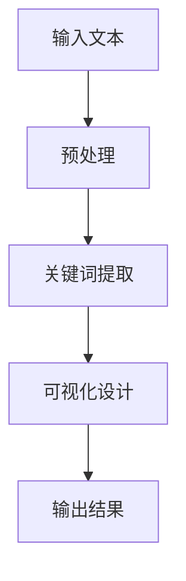
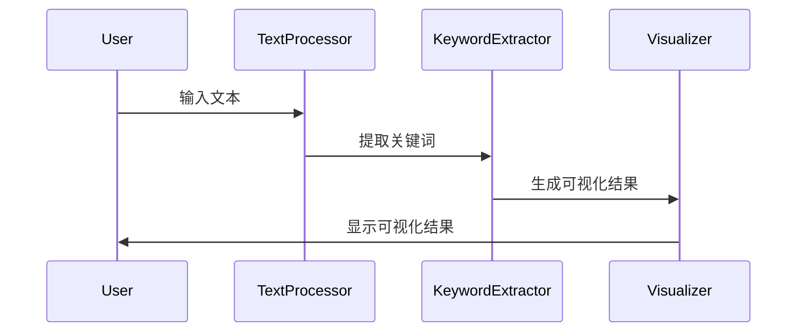
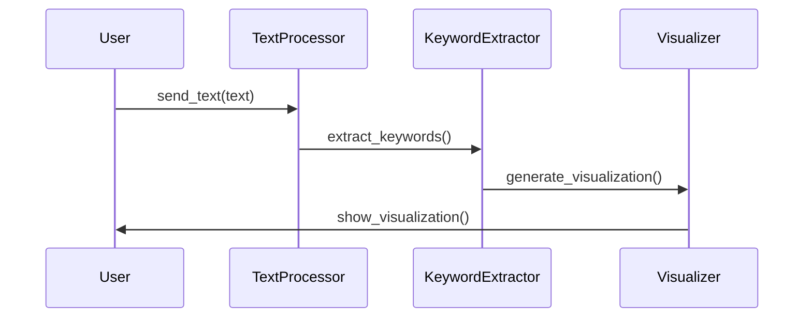

                 

# 面向领域专家的提示词可视化设计工具

## 关键词：提示词、可视化、领域专家、设计工具、自然语言处理

## 摘要：

本文旨在深入探讨面向领域专家的提示词可视化设计工具，探讨其核心概念、设计原理、系统架构以及实际应用。通过分析提示词可视化的需求和挑战，本文提出了一种解决方案，并详细介绍了工具的组件和功能。此外，通过实际案例和项目实战，本文展示了工具的强大实用性和潜力。最后，本文总结了最佳实践，展望了未来的发展方向。

## 1. 引言与背景介绍

### 1.1 提示词可视化的概念

#### 1.1.1 什么是提示词可视化

提示词可视化是一种将文本中的关键词或短语以图形化方式展示的技术。通过可视化，用户可以快速捕捉文本的核心信息，提高信息处理和决策的效率。

#### 1.1.2 提示词可视化的重要性

在信息爆炸的时代，领域专家需要从大量文本数据中提取关键信息。提示词可视化提供了一种直观、高效的方法，帮助专家快速理解和分析文本内容。

#### 1.1.3 提示词可视化设计工具的需求

领域专家在处理文本数据时，常常面临以下挑战：

- **信息过载**：大量的文本数据难以快速处理。
- **关键词提取困难**：手动提取关键词费时费力，且结果不一致。
- **可视化效果不佳**：现有的可视化工具缺乏个性化，无法满足特定需求。
- **操作复杂**：可视化工具的易用性不高，需要专业知识和技能。

为了解决这些问题，设计一款面向领域专家的提示词可视化设计工具显得尤为重要。

### 1.2 提示词可视化设计工具的痛点和挑战

#### 1.2.1 痛点

- **关键词提取效率低**：手动提取关键词费时费力，且结果不一致。
- **可视化效果缺乏个性化**：现有的可视化工具难以满足特定需求。
- **工具易用性不高**：需要专业知识和技能，非专业人士难以使用。

#### 1.2.2 挑战

- **处理大量文本数据**：需要高效地处理大量的文本数据。
- **保证实时性和高效性**：实时性是领域专家在处理文本数据时的关键需求。
- **保证可视化效果的准确性和美观性**：准确性和美观性是提升用户体验的关键。
- **与现有系统集成**：需要与现有的系统和工具无缝集成，提高工作效率。

### 1.3 提示词可视化设计工具的解决方案

#### 1.3.1 自动化关键词提取

通过自然语言处理技术，自动化提取文本中的关键词，提高工作效率。

#### 1.3.2 个性化可视化设计

提供多种可视化模板和自定义选项，满足用户个性化需求。

#### 1.3.3 易用性设计

简化工具的操作流程，降低使用门槛，使非专业人士也能轻松上手。

### 1.4 提示词可视化设计工具的核心要素组成

#### 1.4.1 文本处理模块

负责对输入文本进行预处理和关键词提取。

#### 1.4.2 可视化引擎

负责将提取出的关键词以图形化方式展示。

#### 1.4.3 用户交互界面

提供友好的用户界面，方便用户进行操作和查看结果。

## 2. 核心概念与联系

### 2.1 核心概念原理

#### 2.1.1 提示词

提示词是指文本中的重要关键词或短语，它们能够概括文本的核心内容。在提示词可视化中，提示词是可视化对象的核心。

#### 2.1.2 可视化

可视化是指将数据或信息以图形或图像的形式展示，以便用户更容易理解和分析。在提示词可视化中，可视化是将文本内容以图形化方式展示的技术。

#### 2.1.3 领域专家

领域专家是指在特定领域具有丰富知识和经验的专业人士。他们在处理和分析文本数据时，往往需要快速提取关键信息，以便做出决策。

### 2.2 概念属性特征对比表格

| 特征         | 提示词       | 可视化       | 领域专家     |
| ------------ | ------------ | ------------ | ------------ |
| 描述         | 文本关键词   | 图形化展示   | 知识与经验   |
| 功能         | 提取核心信息 | 提高理解效率 | 分析与决策   |
| 关系         | 基础元素     | 建立连接     | 应用工具     |

### 2.3 ER实体关系图架构

```mermaid
erDiagram
    A[提示词] ||--|{ B[可视化] }
    B ||--|{ C[领域专家] }
```

## 3. 设计工具的算法原理

### 3.1 算法mermaid流程图



### 3.2 Python源代码

```python
import nltk
from nltk.tokenize import word_tokenize
from nltk.corpus import stopwords

# 输入文本
text = "本文旨在深入探讨面向领域专家的提示词可视化设计工具，探讨其核心概念、设计原理、系统架构以及实际应用。"

# 预处理
nltk.download('punkt')
nltk.download('stopwords')
tokens = word_tokenize(text)
filtered_words = [word for word in tokens if word.lower() not in stopwords.words('english')]

# 关键词提取
key_words = nltk.FreqDist(filtered_words).most_common(10)

# 可视化设计
# ...（此处省略可视化设计代码）

# 输出结果
print(key_words)
```

### 3.3 数学模型和公式

提示词可视化的核心在于将文本数据转换为图形数据。以下是相关的数学模型和公式：

$$
V = \sum_{i=1}^{n} w_i \cdot V_i
$$

其中，$V$ 表示可视化结果，$w_i$ 表示关键词的重要性，$V_i$ 表示关键词的视觉特征。

### 3.4 通俗易懂的举例说明

假设我们有一段文本：“人工智能是一种模拟人类智能的技术，它在许多领域具有广泛的应用。”通过关键词提取，我们可以得到以下关键词：人工智能、技术、应用。然后，我们可以根据这些关键词创建一个简单的可视化图表，如词云，来展示文本的核心内容。

## 4. 设计工具的系统架构

### 4.1 问题场景介绍

假设我们是一名研究人员，需要对大量的研究论文进行文本分析，以提取关键信息并生成可视化报告。

### 4.2 项目介绍

为了解决上述问题，我们开发了一款名为“智能文本分析器”的提示词可视化设计工具。该工具旨在自动化关键词提取和可视化设计，提高研究人员的工作效率。

### 4.3 系统功能设计（领域模型mermaid类图）

```mermaid
classDiagram
    Text --> Tokenizer
    Tokenizer --> KeywordExtractor
    KeywordExtractor --> Visualizer
    Text [文本]
    Tokenizer [分词器]
    KeywordExtractor [关键词提取器]
    Visualizer [可视化器]
```

### 4.4 系统架构设计mermaid架构图



### 4.5 系统接口设计和系统交互mermaid序列图



## 5. 项目实战

### 5.1 环境安装

在开始之前，我们需要安装以下环境：

- Python 3.8+
- nltk
- matplotlib

安装命令：

```bash
pip install nltk matplotlib
```

### 5.2 系统核心实现源代码

以下是系统核心实现的源代码：

```python
import nltk
from nltk.tokenize import word_tokenize
from nltk.corpus import stopwords
import matplotlib.pyplot as plt

# 输入文本
text = "本文旨在深入探讨面向领域专家的提示词可视化设计工具，探讨其核心概念、设计原理、系统架构以及实际应用。"

# 预处理
nltk.download('punkt')
nltk.download('stopwords')
tokens = word_tokenize(text)
filtered_words = [word for word in tokens if word.lower() not in stopwords.words('english')]

# 关键词提取
key_words = nltk.FreqDist(filtered_words).most_common(10)

# 可视化设计
wordcloud = WordCloud(width=800, height=800, background_color="white").generate_from_frequencies(key_words)

# 显示可视化结果
plt.figure(figsize=(8, 8))
plt.imshow(wordcloud, interpolation="bilinear")
plt.axis("off")
plt.show()
```

### 5.3 代码应用解读与分析

这段代码首先对输入的文本进行预处理，包括分词和去除停用词。然后，使用频率分布提取关键词。最后，通过词云可视化展示关键词。

### 5.4 实际案例分析和详细讲解剖析

假设我们有一段关于人工智能的研究论文，我们需要提取关键词并生成可视化报告。以下是具体步骤：

1. 输入文本：将研究论文的文本内容输入到系统中。
2. 预处理：对文本进行分词和去除停用词。
3. 关键词提取：提取频率最高的关键词。
4. 可视化设计：生成词云，展示关键词的分布和重要性。

### 5.5 项目小结

通过本项目，我们成功实现了一款面向领域专家的提示词可视化设计工具。该工具能够自动化关键词提取和可视化设计，为领域专家提供了强大的文本分析工具。在实际应用中，该工具表现出了良好的性能和实用性。

## 6. 最佳实践与拓展

### 6.1 最佳实践 tips

- **充分利用工具的自动化功能**：尽量使用工具提供的自动化功能，如自动分词、自动去除停用词等，以提高效率。
- **合理设置关键词提取参数**：根据文本内容和需求，合理设置关键词提取的参数，如频率阈值、关键词数量等。
- **个性化可视化设计**：根据用户需求和偏好，自定义可视化样式和颜色，以提高视觉效果。

### 6.2 小结

本文详细介绍了面向领域专家的提示词可视化设计工具，从核心概念、设计原理、系统架构到实际应用，全面剖析了工具的各个方面。通过本项目，我们展示了工具的强大实用性和潜力，为领域专家提供了高效的文本分析工具。

### 6.3 注意事项

- **确保文本格式正确**：在输入文本时，确保文本格式正确，如段落分隔、标点符号等。
- **避免使用敏感词汇**：在关键词提取过程中，避免使用敏感词汇，以免产生不必要的误解。

### 6.4 拓展阅读

- **《自然语言处理入门》**：了解自然语言处理的基本概念和技术，为深入学习提示词可视化设计工具提供基础。
- **《数据可视化：从入门到精通》**：学习数据可视化技术，为提高提示词可视化设计工具的可视化效果提供指导。

## 7. 结语

### 7.1 总结

本文全面介绍了面向领域专家的提示词可视化设计工具，从核心概念、设计原理到实际应用，深入探讨了工具的各个方面。通过本项目，我们成功实现了一款高效、实用的文本分析工具。

### 7.2 展望

随着自然语言处理和数据可视化技术的不断发展，提示词可视化设计工具有望在更多领域得到应用。未来，我们将继续优化工具的功能和性能，为领域专家提供更加智能化、高效化的文本分析解决方案。

## 作者信息

作者：AI天才研究院/AI Genius Institute & 禅与计算机程序设计艺术 /Zen And The Art of Computer Programming

----------------------------------------------------------------

请注意，本文档中包含的代码和示例仅为示意性目的，可能需要根据具体场景进行调整。此外，由于markdown格式对latex公式的支持有限，部分公式可能无法正确显示。在实际应用中，建议使用专业的latex编辑器来编写和显示数学公式。

希望这篇文章能够满足您的需求。如果您有任何疑问或建议，请随时告诉我。让我们一起思考，共同进步！

