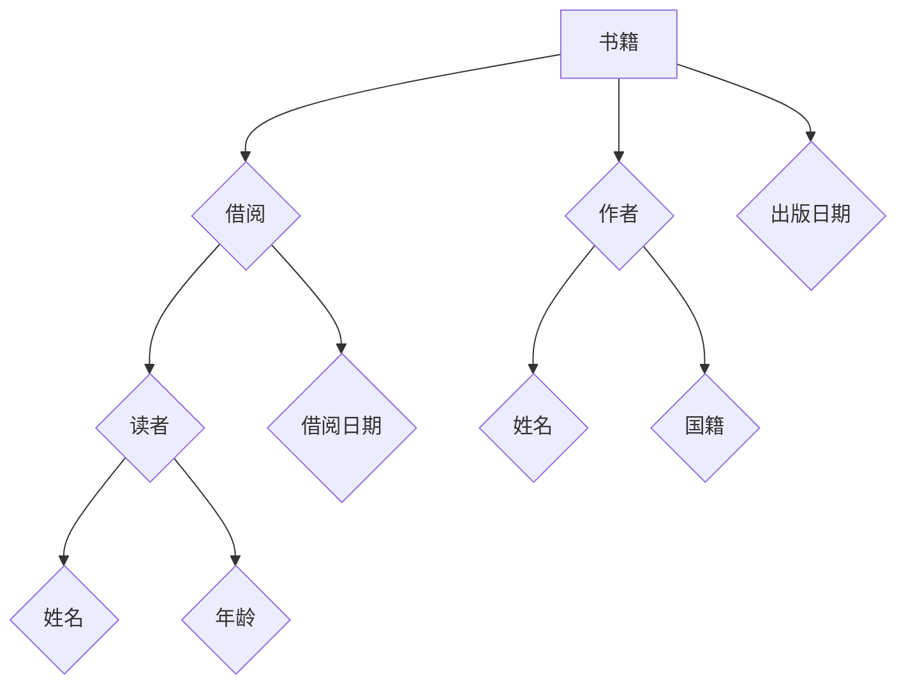

                 

### 《面向领域专家的提示词设计工具》

> 关键词：领域专家、提示词设计、用户研究、设计工具、案例研究

> 摘要：本文旨在深入探讨面向领域专家的提示词设计工具，分析其在信息技术领域的应用与重要性。本文将逐步介绍领域专家与提示词设计的关系，提示词设计的核心概念，用户研究方法，设计过程，以及实际应用中的工具选择和案例研究。通过系统的分析和实践，本文旨在为领域专家提供一套完整、实用的提示词设计方法。

### 目录

```markdown
----------------------------------------------------------------
## 第一部分：介绍与背景
### 第1章：领域专家与提示词设计
#### 1.1 什么是以领域专家为中心的设计
#### 1.2 提示词设计的挑战与机遇
#### 1.3 书籍目标与结构
#### 1.4 背景知识与技术术语

## 第二部分：基础理论
### 第2章：提示词设计的核心概念
#### 2.1 提示词的定义与作用
#### 2.2 领域知识图谱构建
##### 2.2.1 知识图谱的基本概念
##### 2.2.2 知识图谱在提示词设计中的应用
#### 2.3 提示词的属性特征
##### 2.3.1 提示词的语义属性
##### 2.3.2 提示词的形式属性
##### 2.3.3 提示词的交互属性

### 第3章：用户研究方法
#### 3.1 用户研究的重要性
#### 3.2 用户访谈与观察
##### 3.2.1 访谈流程与方法
##### 3.2.2 观察技巧与应用
#### 3.3 用户画像与需求分析
##### 3.3.1 用户画像构建
##### 3.3.2 需求分析框架

## 第三部分：设计过程
### 第4章：需求分析与目标设定
#### 4.1 确定设计目标
##### 4.1.1 设计目标的明确性
##### 4.1.2 设计目标的优先级
#### 4.2 用户需求分析
##### 4.2.1 需求收集方法
##### 4.2.2 需求分类与优先级排序

### 第5章：原型设计与迭代
#### 5.1 设计原型的重要性
#### 5.2 原型设计方法
##### 5.2.1 低 fidelity原型
##### 5.2.2 高 fidelity原型
#### 5.3 用户反馈与迭代
##### 5.3.1 用户测试
##### 5.3.2 反馈收集与分析
##### 5.3.3 原型迭代流程

### 第6章：提示词编写技巧
#### 6.1 提示词编写的基本原则
##### 6.1.1 清晰性
##### 6.1.2 简洁性
##### 6.1.3 引导性
#### 6.2 提示词风格与语言选择
##### 6.2.1 专业术语与通俗易懂的平衡
##### 6.2.2 语言风格与用户偏好

## 第四部分：工具与应用
### 第7章：设计工具介绍
#### 7.1 常用设计工具概述
##### 7.1.1 Sketch
##### 7.1.2 Figma
##### 7.1.3 Adobe XD
#### 7.2 提示词设计工具选择
##### 7.2.1 优点与缺点分析
##### 7.2.2 适用场景

### 第8章：案例研究与实战
#### 8.1 案例研究概述
#### 8.2 案例一：医疗领域
##### 8.2.1 案例背景
##### 8.2.2 需求分析与目标设定
##### 8.2.3 原型设计与迭代
##### 8.2.4 提示词编写与实践
#### 8.3 案例二：教育领域
##### 8.3.1 案例背景
##### 8.3.2 需求分析与目标设定
##### 8.3.3 原型设计与迭代
##### 8.3.4 提示词编写与实践

## 第五部分：总结与展望
### 第9章：总结与反思
#### 9.1 主要内容回顾
#### 9.2 经验与教训
#### 9.3 设计实践的可持续性

### 第10章：未来趋势与发展
#### 10.1 提示词设计的未来趋势
##### 10.1.1 技术创新
##### 10.1.2 用户需求变化
#### 10.2 提示词设计的发展方向
##### 10.2.1 领域拓展
##### 10.2.2 工具智能化

----------------------------------------------------------------
```

### 第一部分：介绍与背景

#### 1.1 什么是以领域专家为中心的设计

以领域专家为中心的设计（Domain Expert-Centered Design，简称DECD）是一种设计方法论，它强调在设计过程中充分利用领域专家的知识和经验，以提高设计的有效性和准确性。领域专家通常在其专业领域内具有丰富的实践经验和深厚的理论基础，他们的参与可以帮助设计团队更好地理解复杂的需求和问题。

DECD的主要特点包括：

- **用户中心**：设计过程始终围绕用户需求进行，确保设计满足用户的实际需求。
- **专家驱动**：领域专家的参与使设计更具专业性和权威性，减少了设计偏差。
- **迭代开发**：设计过程中采用迭代方法，不断收集专家和用户的反馈，逐步完善设计方案。
- **跨学科合作**：DECD鼓励跨学科的合作，结合不同领域的知识和技能，提高设计的综合性和创造性。

#### 1.2 提示词设计的挑战与机遇

提示词设计（Prompt Design）是DECD中的一个重要环节，它旨在通过设计有效的提示词来引导用户完成特定的任务或获取所需的信息。提示词设计面临的挑战主要包括：

- **多样性需求**：不同用户和场景对提示词的需求各不相同，如何设计出适用于多种情况的提示词是设计者需要考虑的问题。
- **复杂性理解**：领域专家可能拥有复杂的专业知识，如何将复杂的术语和概念转化为简单易懂的提示词，是一个需要解决的难题。
- **用户体验**：提示词的设计不仅要考虑信息的准确性，还要考虑用户体验，如何平衡这两者是一个挑战。

然而，随着人工智能和自然语言处理技术的发展，提示词设计也面临着巨大的机遇：

- **智能化设计**：通过机器学习和数据挖掘技术，可以分析用户行为和需求，自动生成高质量的提示词。
- **个性化推荐**：结合用户画像和偏好，可以为不同用户提供个性化的提示词，提高用户体验。
- **多语言支持**：随着全球化的发展，设计支持多语言的提示词成为可能，进一步扩大了应用范围。

#### 1.3 书籍目标与结构

本书的目标是系统地介绍面向领域专家的提示词设计工具和方法，帮助设计者更好地理解和应用这一设计方法。具体目标包括：

- **理论指导**：通过深入分析提示词设计的核心概念和方法，为设计者提供理论基础。
- **实践指南**：结合实际案例，展示提示词设计的全过程，帮助设计者掌握实际操作技巧。
- **工具介绍**：介绍常用的设计工具，帮助设计者选择合适的设计工具。
- **案例分析**：通过案例研究，展示不同领域中的提示词设计实践，提供实际应用经验。

本书结构如下：

- **第一部分：介绍与背景**：介绍领域专家与提示词设计的相关概念和背景。
- **第二部分：基础理论**：讨论提示词设计的核心概念、用户研究方法和基础理论。
- **第三部分：设计过程**：详细讲解需求分析、原型设计、迭代和提示词编写技巧。
- **第四部分：工具与应用**：介绍设计工具和案例分析。
- **第五部分：总结与展望**：总结全书内容，探讨未来的发展趋势和方向。

#### 1.4 背景知识与技术术语

在深入探讨提示词设计之前，了解一些相关的背景知识和技术术语是必要的。以下是几个关键概念：

- **领域专家**：在特定领域拥有丰富经验和知识的专家。
- **提示词**：引导用户完成特定任务或获取所需信息的词或短语。
- **用户研究**：通过观察、访谈等方法，了解用户需求和行为的过程。
- **知识图谱**：表示领域知识的一种图形化模型，通常包括实体、属性和关系。
- **用户画像**：基于用户行为和特征构建的用户模型。
- **机器学习**：通过数据驱动的方式，使计算机自动获取知识和模式识别的技术。
- **自然语言处理**：使计算机理解和生成人类语言的技术。

通过了解这些背景知识和技术术语，读者可以更好地理解后续章节的内容。

### 第二部分：基础理论

#### 2.1 提示词的定义与作用

提示词（Prompt）是引导用户完成特定任务或获取所需信息的关键元素。它通常是以词或短语的形式出现，通过提供具体的指导或提示，帮助用户更好地理解和操作系统。在信息技术领域，提示词的设计至关重要，它不仅影响用户体验，还直接影响任务的完成效率和准确性。

**提示词的定义**：

提示词是一种用来指导用户操作的文本或语言指示，它通过提供明确的指令、问题或提示，引导用户按照预期的方式完成任务或获取所需信息。

**提示词的作用**：

1. **引导用户**：提示词可以帮助用户明确任务目标和操作步骤，减少用户的困惑和操作失误。
2. **提高效率**：有效的提示词设计可以简化用户操作，减少不必要的交互，提高任务完成速度。
3. **增强体验**：良好的提示词设计可以提高用户体验，使系统更加友好和易于使用。
4. **减少错误**：通过提供明确的指导和反馈，提示词可以减少用户输入错误或误操作的可能性。

#### 2.2 领域知识图谱构建

知识图谱（Knowledge Graph）是一种用于表示和存储领域知识的图形化模型，它通过实体、属性和关系的组合，形成一种结构化的知识表示方式。在提示词设计中，知识图谱的构建具有重要意义，它可以提供丰富的背景信息，帮助设计者创建更准确和有效的提示词。

**知识图谱的基本概念**：

- **实体（Entity）**：知识图谱中的基本元素，表示具体的对象或实体，如人、地点、事物等。
- **属性（Attribute）**：描述实体特征的属性，如姓名、年龄、身高等。
- **关系（Relationship）**：连接两个或多个实体的关系，如“工作于”、“居住于”等。

**知识图谱在提示词设计中的应用**：

1. **知识关联**：知识图谱可以展示实体之间的关联关系，帮助设计者了解领域知识的整体结构，从而设计出更符合逻辑和情境的提示词。
2. **语义理解**：通过分析知识图谱，系统可以更好地理解用户的输入和需求，提供更准确的提示和反馈。
3. **个性化推荐**：基于知识图谱，系统可以根据用户的行为和偏好，推荐相关的提示词和操作步骤，提高用户体验。

**知识图谱的ER实体关系图架构**：

下面是一个简单的知识图谱ER实体关系图，用于表示一个简单的图书馆系统中的实体和关系：



在这个知识图谱中，书籍（A）是核心实体，它与借阅（B）、作者（C）、出版日期（D）等实体相关联。借阅实体（B）与读者实体（E）相关，而作者实体（C）则与姓名（G）和国籍（H）等属性相关。

通过这种结构化的知识表示，设计者可以更清晰地理解和设计提示词，例如，可以创建以下提示词：

- **借阅书籍**：“请输入书籍名称或ISBN号。”
- **查询作者信息**：“请输入作者姓名。”

#### 2.3 提示词的属性特征

提示词的设计不仅仅是文本的简单堆砌，它需要考虑多种属性特征，以确保提示词能够有效地引导用户。以下是提示词的几个重要属性特征：

**1. 语义属性**

语义属性指的是提示词的内涵和意义。一个有效的提示词应该具有明确的语义，能够准确传达设计者的意图。语义属性包括：

- **清晰性**：提示词应当清晰明了，避免使用模糊或歧义的表达。
- **准确性**：提示词应当准确反映用户需求，避免误导用户。

例如：

- **错误提示**：“输入无效，请重新输入。”
- **正确提示**：“感谢您的输入，我们将为您处理。”

**2. 形式属性**

形式属性指的是提示词的文本结构和格式。良好的形式属性可以提高提示词的可读性和易用性。

- **简洁性**：提示词应当简洁明了，避免冗长和复杂的句子。
- **一致性**：系统中的提示词应保持一致的风格和格式，以便用户形成习惯。

例如：

- **错误提示**：“请填写必填项。”
- **正确提示**：“已成功保存，感谢您的使用。”

**3. 交互属性**

交互属性指的是提示词与用户的交互方式和效果。良好的交互属性可以增强用户体验。

- **引导性**：提示词应当具有引导性，引导用户完成操作。
- **反馈性**：提示词应当提供及时和明确的反馈，让用户知道系统对输入的处理情况。

例如：

- **引导性提示**：“请选择您的服务类型。”
- **反馈性提示**：“正在加载，请稍等。”

**提示词属性特征对比表格**

| 提示词属性 | 定义 | 重要性 | 示例 |
| :--: | :--: | :--: | :--: |
| 语义属性 | 提示词的内涵和意义 | 高 | 清晰性：“请输入正确的邮箱地址。” |
| 形式属性 | 提示词的文本结构和格式 | 中 | 简洁性：“请上传文件。” |
| 交互属性 | 提示词与用户的交互方式和效果 | 高 | 引导性：“下一步，请确认您的信息。” |

通过合理设计和优化这些属性特征，设计者可以创造出更加有效和用户友好的提示词，从而提高系统的使用体验。

### 用户研究方法

#### 3.1 用户研究的重要性

用户研究是产品设计和开发过程中不可或缺的一环，它通过深入了解用户的需求、行为和偏好，为设计决策提供科学依据。在面向领域专家的提示词设计中，用户研究的重要性尤为突出。原因如下：

1. **理解用户需求**：用户研究可以帮助设计者准确把握用户的需求和痛点，确保设计的提示词能够真正解决用户的问题。
2. **优化用户体验**：通过用户研究，设计者可以识别用户体验中的问题和瓶颈，从而进行有针对性的改进，提高系统的可用性和易用性。
3. **减少设计偏差**：用户研究可以帮助设计者避免盲目追求技术创新而忽视用户实际需求，减少设计过程中的偏差和错误。
4. **验证设计效果**：用户研究可以提供实际的反馈和验证，帮助设计者评估设计的有效性，为后续优化提供方向。

#### 3.2 用户访谈与观察

用户访谈和观察是用户研究中的两种主要方法，它们通过不同的方式获取用户信息，为设计提供丰富且深入的数据。

**1. 用户访谈**

用户访谈是一种通过与用户进行面对面的交流，获取他们对产品、服务和设计的看法和建议的方法。以下是用户访谈的流程和方法：

**访谈流程：**

- **准备阶段**：明确访谈目的、对象和内容，准备访谈大纲和问题列表。
- **实施阶段**：与用户建立良好的沟通，引导用户深入讨论，记录关键信息。
- **总结阶段**：整理访谈记录，提取关键见解和用户需求。

**访谈方法：**

- **开放式问题**：用于引导用户表达看法和感受，如“您对当前系统的提示词有什么建议？”
- **闭合式问题**：用于获取具体信息，如“您是否经常遇到提示词不明确的情况？”

**2. 观察技巧**

用户观察是通过观察用户在实际使用产品或服务时的行为和反应，获取用户需求和行为模式的方法。以下是观察技巧和应用：

**观察技巧：**

- **行为记录**：详细记录用户的行为和操作，如用户如何使用提示词完成任务。
- **情境分析**：分析用户在使用过程中的情境和需求，了解用户在不同情境下的行为变化。
- **上下文记录**：记录用户使用的上下文环境，如设备、时间、地点等。

**观察应用：**

- **用户行为分析**：通过观察，分析用户在任务执行过程中的行为模式和痛点。
- **用户场景重现**：根据观察结果，重现用户的使用场景，优化提示词设计。

#### 3.3 用户画像与需求分析

用户画像（User Profiling）是一种基于用户数据和行为特征构建的用户模型，它通过描述用户的基本信息、行为习惯和需求偏好，帮助设计者更好地理解用户，从而进行有针对性的设计。

**1. 用户画像构建**

构建用户画像的过程通常包括以下步骤：

- **数据收集**：收集用户的基本信息、行为数据和历史记录。
- **特征提取**：从数据中提取关键特征，如年龄、性别、职业、兴趣爱好等。
- **模型构建**：基于提取的特征，构建用户画像模型，如使用聚类算法进行用户分组。

**2. 需求分析框架**

需求分析（Requirement Analysis）是确定用户需求和系统功能的过程，以下是需求分析的基本框架：

- **需求收集**：通过访谈、问卷调查等方式，收集用户的需求和期望。
- **需求分类**：将收集的需求进行分类和整理，如功能需求、性能需求、安全需求等。
- **需求排序**：根据需求的重要性和紧急性，对需求进行排序，确保关键需求优先得到满足。

通过用户画像和需求分析，设计者可以更加准确地把握用户需求，从而设计出更符合用户期望的提示词。

### 需求分析与目标设定

#### 4.1 确定设计目标

在提示词设计中，明确设计目标是至关重要的一步。设计目标不仅指导设计过程的方向，还为评估设计效果提供了依据。以下是如何确定设计目标的方法：

**1. 设计目标的明确性**

明确性是设计目标的基本要求。一个明确的设计目标应当具有以下特点：

- **具体**：目标应当具体，便于衡量和实现，如“提高用户任务完成效率20%”。
- **可量化**：目标应当可以量化，便于评估效果，如“减少用户输入错误率10%”。
- **可实现**：目标应当基于实际情况，确保可以达成，如“改进现有提示词的引导性”。

**2. 设计目标的优先级**

在确定设计目标时，优先级也是一个重要考虑因素。优先级高的目标通常对用户体验和业务价值有更大的影响，应当优先实现。以下是一些确定优先级的方法：

- **业务价值**：评估目标对业务的价值，选择对业务影响较大的目标。
- **用户需求**：根据用户研究和需求分析，选择用户最关注和最需要满足的需求。
- **可行性**：考虑目标的实现难度和时间成本，优先选择实现性较强的目标。

**3. 优先级示例**

以下是一个关于提示词设计目标设定的示例：

- **高优先级**：
  - 提高用户任务完成效率：目标是减少用户完成任务所需的时间，提高工作效率。
  - 改善用户输入体验：目标是降低用户输入错误率，提高输入的准确性和便捷性。

- **中优先级**：
  - 优化提示词引导性：目标是提高提示词的引导性，帮助用户更快速地理解任务要求和操作步骤。
  - 提高用户满意度：目标是提高用户对提示词设计的满意度，提升整体用户体验。

- **低优先级**：
  - 提升提示词的多语言支持：目标是在后续版本中实现提示词的多语言支持，以满足不同国家和地区的用户需求。

通过明确和优先化设计目标，设计者可以更有针对性地进行提示词设计，确保设计过程高效且满足用户需求。

#### 4.2 用户需求分析

用户需求分析是提示词设计过程中的关键环节，它帮助设计者深入了解用户的需求和期望，从而设计出符合用户期望的提示词。以下是如何进行用户需求分析的详细步骤：

**1. 需求收集方法**

收集用户需求是用户需求分析的第一步，以下是一些常用的需求收集方法：

- **问卷调查**：通过设计问卷，向用户收集他们对提示词设计的看法和建议。问卷应包括开放性和闭合性题目，以获取丰富的用户反馈。
- **用户访谈**：通过与用户进行面对面或在线访谈，深入了解用户的使用习惯、偏好和痛点。访谈应围绕具体的任务和使用场景进行。
- **观察法**：直接观察用户在使用产品或服务时的行为和操作，记录用户的操作流程和反应。观察法可以提供真实的使用情境，帮助识别用户需求。
- **用户行为数据分析**：通过分析用户在使用产品或服务时的行为数据，如点击率、操作路径、错误率等，识别用户的主要需求和问题。

**2. 需求分类与优先级排序**

收集到用户需求后，需要对需求进行分类和优先级排序，以确保关键需求得到满足。以下是一种常用的需求分类和优先级排序方法：

- **需求分类**：
  - **功能需求**：用户期望系统能够实现的功能，如提示词的准确性、引导性等。
  - **性能需求**：用户对系统性能的期望，如响应速度、稳定性等。
  - **体验需求**：用户对系统使用体验的期望，如界面友好性、操作便捷性等。
  - **安全需求**：用户对系统安全性的期望，如数据保护、隐私保护等。

- **优先级排序**：
  - **业务价值**：根据需求对业务的贡献程度进行排序，选择对业务影响较大的需求。
  - **用户需求**：根据用户研究和需求分析的结果，选择用户最关注和最需要满足的需求。
  - **技术可行性**：考虑实现需求的技术难度和资源需求，选择实现性较强的需求。

**3. 需求分析框架**

为了确保需求分析的系统性和全面性，可以采用以下需求分析框架：

- **需求识别**：通过问卷调查、访谈和观察等方法，识别用户的需求。
- **需求整理**：对收集到的需求进行整理和分类，明确每个需求的具体内容和相关属性。
- **需求验证**：通过与用户进行讨论和验证，确认需求的准确性和完整性。
- **需求文档**：将整理和验证后的需求编写成需求文档，作为设计过程的依据。

通过上述需求分析过程，设计者可以全面了解用户需求，为提示词设计提供科学依据。以下是一个用户需求分析的示例框架：

**需求识别**：
- 用户需求1：提示词的引导性不足，用户难以理解操作步骤。
- 用户需求2：部分提示词过于复杂，难以理解。
- 用户需求3：用户期望多语言支持，以便更好地使用系统。

**需求整理**：
- 功能需求：改进提示词的引导性和理解性。
- 性能需求：优化系统的响应速度和稳定性。
- 体验需求：提升用户使用系统的整体体验。
- 安全需求：保障用户数据的安全性和隐私性。

**需求验证**：
- 通过用户访谈验证，用户对改进提示词的引导性和理解性有较高的需求。
- 通过观察法验证，发现部分提示词确实存在复杂性和理解性问题。
- 通过问卷调查验证，发现用户对多语言支持的需求较高。

**需求文档**：
- 提示词引导性和理解性需求：改进现有提示词，提高引导性和理解性。
- 系统性能需求：优化系统性能，提高响应速度和稳定性。
- 用户体验需求：提升整体用户体验，包括界面友好性和操作便捷性。
- 安全需求：加强数据保护和隐私保护，确保用户信息安全。

通过这个用户需求分析的框架，设计者可以系统地了解用户需求，从而设计出更符合用户期望的提示词。

### 原型设计与迭代

#### 5.1 设计原型的重要性

原型设计（Prototype Design）是产品开发过程中不可或缺的一环，它通过创建初步的、可交互的产品模型，帮助设计者验证设计思路和用户需求，为后续的开发提供指导。在提示词设计中，原型设计尤为重要，原因如下：

1. **快速验证**：原型设计允许设计者在早期阶段就验证设计的可行性和有效性，及时发现和解决问题，降低开发风险。
2. **用户反馈**：通过原型设计，设计者可以获取用户的直接反馈，了解用户对提示词设计的感受和需求，从而进行针对性的优化。
3. **降低成本**：早期的原型设计可以减少后续开发中的返工和修改，降低开发成本和资源消耗。
4. **提升用户体验**：原型设计使设计者能够提前考虑用户体验，通过迭代优化设计，提升产品的易用性和用户满意度。

#### 5.2 原型设计方法

原型设计可以分为低fidelity原型和高fidelity原型，两种原型设计方法各有特点，适用于不同的设计阶段。

**1. 低fidelity原型**

低fidelity原型（Low-Fidelity Prototype）是指用简单的工具和方法快速创建的原型，通常包括草图、线框图等。以下是一些低fidelity原型设计的特点和应用：

- **快速创建**：低fidelity原型设计周期短，可以快速迭代，适合早期阶段的需求验证。
- **成本低**：使用简单的工具和材料，成本较低，减少资源浪费。
- **灵活性高**：设计者可以快速修改和调整原型，适应不断变化的需求。

**应用场景**：

- **需求验证**：通过低fidelity原型，设计者可以快速验证用户需求，确认设计思路的正确性。
- **初步设计**：在早期设计阶段，低fidelity原型可以帮助设计者快速搭建产品框架，明确核心功能和界面布局。

**2. 高fidelity原型**

高fidelity原型（High-Fidelity Prototype）是指使用更精细的工具和方法创建的原型，通常包括高保真页面设计、交互效果等。以下是一些高fidelity原型设计的特点和应用：

- **细节丰富**：高fidelity原型具有高度的细节和真实感，可以模拟实际产品的使用体验。
- **交互真实**：通过添加交互效果和动画，高fidelity原型可以更真实地反映产品的功能和操作流程。
- **用户反馈**：高fidelity原型可以提供更详细的用户反馈，帮助设计者深入了解用户的使用习惯和偏好。

**应用场景**：

- **用户测试**：在高fidelity原型阶段，设计者可以开展详细的用户测试，收集丰富的用户反馈，为后续优化提供依据。
- **产品发布**：在产品即将发布前，高fidelity原型可以作为最终展示，帮助用户了解产品的功能和设计。

#### 5.3 用户反馈与迭代

用户反馈与迭代是原型设计过程中的重要环节，通过不断收集用户反馈和进行迭代优化，设计者可以逐步完善提示词设计，提高其质量和用户体验。

**1. 用户测试**

用户测试（User Testing）是通过让真实用户使用原型并收集他们的反馈，评估设计效果和用户体验的过程。以下是一些用户测试的方法和步骤：

- **测试准备**：确定测试目标、测试对象和测试流程，准备测试工具和测试环境。
- **用户招募**：招募具有代表性的用户参与测试，确保反馈的全面性和准确性。
- **测试执行**：让用户按照预设的任务使用原型，观察和记录用户的行为和反应。
- **反馈收集**：通过观察、访谈和问卷等方式，收集用户的反馈和意见。

**2. 反馈收集与分析**

收集到的用户反馈需要进行整理和分析，以识别设计中的问题和优化方向。以下是一些反馈收集和分析的方法：

- **行为分析**：通过观察用户在原型中的操作行为，识别用户遇到的问题和使用上的难点。
- **用户访谈**：通过与用户进行深入访谈，了解他们对原型的感受和期望。
- **问卷调研**：通过设计问卷，收集用户对原型的评价和建议。

**3. 原型迭代**

基于用户反馈，设计者需要对原型进行迭代优化。以下是一些迭代优化的方法和步骤：

- **问题定位**：分析用户反馈，确定原型中存在的问题和不足。
- **解决方案**：针对问题，提出具体的优化方案，如改进提示词的引导性、简化用户操作等。
- **实施优化**：根据优化方案，对原型进行修改和调整。
- **再次测试**：对优化后的原型进行再次测试，验证优化效果，确保问题得到解决。

通过不断迭代优化，设计者可以逐步完善提示词设计，提高其质量和用户体验。以下是一个原型迭代的过程示例：

**第一次迭代：**

- **用户测试**：用户在使用原型过程中，反馈提示词引导性不足，用户难以理解操作步骤。
- **反馈收集**：设计者通过观察和用户访谈，确认提示词引导性是主要问题。
- **优化方案**：设计者决定增加提示词的引导性，通过具体的步骤说明和操作示例来帮助用户理解。
- **实施优化**：对原型进行修改，增加引导性提示词。
- **再次测试**：用户对优化后的原型反馈良好，提示词的引导性得到了明显改善。

**第二次迭代：**

- **用户测试**：用户反馈部分提示词仍然过于复杂，难以理解。
- **反馈收集**：设计者分析反馈，确认部分提示词存在复杂性。
- **优化方案**：设计者决定简化提示词，使用更简洁和易懂的语言。
- **实施优化**：对原型中的提示词进行简化，确保表述清晰明了。
- **再次测试**：用户对优化后的原型反馈积极，提示词的复杂性得到了有效控制。

通过这样的迭代过程，设计者可以不断优化提示词设计，提高其质量和用户体验。迭代不仅是一种设计方法，更是一种持续改进和优化设计的态度。

### 提示词编写技巧

#### 6.1 提示词编写的基本原则

编写有效的提示词是确保用户能够顺利完成任务的关键。以下是编写提示词时应遵循的基本原则：

**1. 清晰性**

提示词应当清晰明了，避免使用模糊或歧义的表达。清晰性是提示词编写的基本要求，能够减少用户的困惑和误解。

**2. 简洁性**

简洁性意味着提示词应当简短而精练，避免冗长的描述。简洁的提示词更容易被用户理解和记忆，提高操作效率。

**3. 引导性**

引导性是指提示词应具备明确的指导性，引导用户完成特定任务或获取所需信息。有效的引导性提示词可以减少用户的操作错误，提高任务成功率。

**4. 对话性**

对话性提示词更像是与用户进行对话，使系统显得更加友好和亲切。通过使用对话性提示词，可以提高用户的使用体验。

**5. 可定制性**

可定制性意味着提示词可以根据不同的用户和场景进行个性化调整，以更好地满足用户需求。

**示例：**

- **清晰性**：“请输入正确的用户名和密码。”
- **简洁性**：“确认信息，点击提交。”
- **引导性**：“下一步，请选择您的服务类型。”
- **对话性**：“嘿，感谢您的耐心等待，我们正在处理您的请求。”
- **可定制性**：“根据您的选择，我们将为您提供定制化的服务。”

#### 6.2 提示词风格与语言选择

提示词的风格和语言选择对用户体验有着重要影响。以下是一些关于提示词风格和语言选择的建议：

**1. 专业术语与通俗易懂的平衡**

在提示词中，应平衡使用专业术语和通俗易懂的语言。对于领域专家，可以使用一些专业术语，以体现系统的专业性。但对于普通用户，应尽量使用通俗易懂的语言，以减少他们的困惑。

**2. 语言风格与用户偏好**

不同的用户群体可能有不同的语言偏好。在设计提示词时，应考虑目标用户群体的语言偏好，使用他们熟悉的语言风格。例如，年轻用户可能更喜欢活泼、幽默的语言风格，而专业领域用户可能更喜欢正式、严谨的语言风格。

**3. 本地化考虑**

对于面向多语言用户的产品，提示词的设计应考虑本地化需求。在不同语言中，提示词的表达方式可能有所不同，设计者应确保在不同语言环境中，提示词都能准确传达信息。

**示例：**

- **专业术语**：“请输入您的交易凭证编号。”
- **通俗易懂**：“请输入您的订单号。”
- **活泼风格**：“嗨，小精灵，快来输入您的密码吧！”
- **正式风格**：“尊敬的用户，请您核对并提交个人信息。”

通过合理选择和设计提示词的风格和语言，设计者可以增强用户的理解和操作体验，提高系统的易用性和用户满意度。

### 设计工具介绍

在提示词设计中，选择合适的工具对于提高设计效率和效果至关重要。以下是一些常用的设计工具及其优缺点和适用场景。

#### 7.1 常用设计工具概述

**1. Sketch**

**优点**：界面简洁、功能强大，适用于绘制线框图和原型设计。

**缺点**：缺乏交互效果，不适合高保真原型设计。

**适用场景**：早期原型设计、界面布局设计。

**2. Figma**

**优点**：支持多人协作，实时预览和交互效果，适合高保真原型设计。

**缺点**：免费版本功能有限，性能可能对大型项目有所影响。

**适用场景**：高保真原型设计、协作设计。

**3. Adobe XD**

**优点**：界面直观、交互效果丰富，适用于多平台原型设计。

**缺点**：学习曲线较陡，对新手可能有一定难度。

**适用场景**：多平台原型设计、视觉效果设计。

#### 7.2 提示词设计工具选择

在提示词设计中，选择合适的工具需要考虑以下几个方面：

**1. 功能需求**

根据设计任务的需求，选择具有所需功能的工具。例如，如果需要高保真原型设计，应选择支持交互效果的设计工具。

**2. 用户需求**

考虑设计团队和目标用户的需求，选择他们熟悉的工具，以提高设计效率。

**3. 项目规模**

根据项目规模和复杂性，选择适合的工具。小型项目可以选择功能简单的设计工具，而大型项目可能需要功能更全面的设计工具。

**4. 成本**

考虑工具的成本，包括购买费用和使用费用。根据预算选择合适的工具。

**工具选择示例**：

- **小型项目**：使用Sketch进行早期原型设计和界面布局。
- **中型项目**：使用Figma进行高保真原型设计和多人协作。
- **大型项目**：使用Adobe XD进行多平台原型设计和视觉效果设计。

通过合理选择设计工具，设计者可以提高设计效率，确保设计质量和用户体验。

### 案例研究与实战

#### 8.1 案例研究概述

为了深入探讨面向领域专家的提示词设计工具在实际应用中的效果和优势，本章节将介绍两个具体的案例研究：医疗领域和教育领域。通过分析这两个案例，我们将展示如何在不同领域中应用提示词设计工具，实现高效的提示词设计和用户满意度的提升。

#### 8.2 案例一：医疗领域

**8.2.1 案例背景**

随着医疗信息化的发展，医疗系统中的提示词设计变得尤为重要。某医疗系统公司开发了一款面向医生的临床决策支持系统，该系统需要提供准确的诊断和治疗方案建议。然而，如何设计有效且友好的提示词成为了一个挑战。为了解决这一问题，公司决定采用面向领域专家的提示词设计工具，结合用户研究方法，进行提示词设计。

**8.2.2 需求分析与目标设定**

通过用户访谈和观察，公司明确了以下需求：

- **准确性**：提示词应提供准确的诊断和治疗方案建议。
- **引导性**：提示词应具有明确的引导性，帮助医生快速理解并执行操作。
- **简洁性**：提示词应简洁明了，避免冗长和复杂的表述。

基于这些需求，公司设定了以下设计目标：

- **提高诊断准确率**：通过优化提示词，提高诊断系统的准确性。
- **改善用户体验**：设计友好且易于理解的提示词，提升医生的使用体验。
- **减少操作错误**：通过明确的引导性提示词，减少医生的误操作。

**8.2.3 原型设计与迭代**

公司采用Figma作为设计工具，创建低fidelity原型，初步设计系统的界面和提示词布局。通过多次迭代，设计团队不断优化原型，结合用户反馈进行调整。

**第一次迭代**：

- **用户测试**：医生在使用原型过程中，反馈部分提示词引导性不足，难以理解操作步骤。
- **优化方案**：增加具体的步骤说明和操作示例，提高提示词的引导性。
- **实施优化**：修改原型中的提示词，增加引导性说明。

**第二次迭代**：

- **用户测试**：医生反馈部分提示词过于复杂，难以理解。
- **优化方案**：简化提示词，使用更简洁的语言表述。
- **实施优化**：对原型中的提示词进行简化，确保表述清晰明了。

**8.2.4 提示词编写与实践**

基于用户反馈和迭代优化，公司确定了以下提示词编写原则：

- **清晰性**：确保提示词表述清晰，避免模糊和歧义。
- **简洁性**：使用简洁的语言，避免冗长的描述。
- **引导性**：提供明确的操作指导，帮助医生快速执行任务。

**示例提示词**：

- **诊断提示**：“请输入患者症状，我们将为您分析可能的诊断结果。”
- **治疗建议**：“根据患者的病情，以下是我们推荐的治疗方案。”

通过这一系列的设计和优化，医疗系统中的提示词设计得到了显著改进，医生的使用体验和诊断准确性得到了提升。

#### 8.3 案例二：教育领域

**8.3.1 案例背景**

在教育领域，在线教育平台的设计和提示词设计对于用户体验至关重要。某在线教育平台公司希望通过优化提示词设计，提升用户的学习体验和课程完成率。为了实现这一目标，公司决定采用面向领域专家的提示词设计工具，结合用户研究方法，进行提示词设计。

**8.3.2 需求分析与目标设定**

通过用户访谈和观察，公司明确了以下需求：

- **个性化推荐**：根据用户的学习习惯和偏好，提供个性化的学习推荐。
- **清晰引导**：提示词应具有明确的引导性，帮助用户顺利完成学习任务。
- **简洁表述**：提示词应简洁明了，避免冗长和复杂的表述。

基于这些需求，公司设定了以下设计目标：

- **提高学习完成率**：通过优化提示词，提高用户的学习动力和完成率。
- **提升用户体验**：设计友好且易于理解的学习提示词，提升整体用户体验。
- **减少学习困惑**：通过明确的引导性提示词，减少用户在学习过程中的困惑。

**8.3.3 原型设计与迭代**

公司采用Adobe XD作为设计工具，创建低fidelity原型，初步设计系统的界面和提示词布局。通过多次迭代，设计团队不断优化原型，结合用户反馈进行调整。

**第一次迭代**：

- **用户测试**：用户在使用原型过程中，反馈部分提示词引导性不足，难以理解操作步骤。
- **优化方案**：增加具体的步骤说明和操作示例，提高提示词的引导性。
- **实施优化**：修改原型中的提示词，增加引导性说明。

**第二次迭代**：

- **用户测试**：用户反馈部分提示词过于复杂，难以理解。
- **优化方案**：简化提示词，使用更简洁的语言表述。
- **实施优化**：对原型中的提示词进行简化，确保表述清晰明了。

**8.3.4 提示词编写与实践**

基于用户反馈和迭代优化，公司确定了以下提示词编写原则：

- **清晰性**：确保提示词表述清晰，避免模糊和歧义。
- **简洁性**：使用简洁的语言，避免冗长的描述。
- **个性化**：根据用户的学习习惯和偏好，提供个性化的学习推荐。

**示例提示词**：

- **课程推荐**：“根据您的学习进度和偏好，我们为您推荐以下课程。”
- **学习任务**：“请按照以下步骤完成今天的作业：步骤一，阅读文章；步骤二，完成练习题。”

通过这一系列的设计和优化，在线教育平台中的提示词设计得到了显著改进，用户的学习体验和课程完成率得到了提升。

### 第五部分：总结与展望

#### 9.1 主要内容回顾

本文从介绍与背景、基础理论、设计过程、工具与应用、案例研究与实战等多个方面，详细探讨了面向领域专家的提示词设计工具。以下是主要内容回顾：

- **介绍与背景**：讨论了以领域专家为中心的设计方法，以及提示词设计在信息技术领域的重要性。
- **基础理论**：介绍了提示词的定义、知识图谱构建和提示词的属性特征。
- **设计过程**：详细讲解了用户研究方法、需求分析与目标设定、原型设计与迭代以及提示词编写技巧。
- **工具与应用**：介绍了常用的设计工具及其优缺点和适用场景。
- **案例研究与实战**：通过医疗领域和教育领域的实际案例，展示了提示词设计工具的应用效果和优势。

#### 9.2 经验与教训

在本文的研究和实践中，我们积累了以下经验和教训：

- **用户研究的重要性**：深入的用户研究能够帮助设计者更好地理解用户需求和痛点，为提示词设计提供科学依据。
- **迭代优化的必要性**：通过不断的迭代优化，设计者可以逐步完善提示词设计，提高其质量和用户体验。
- **工具选择的灵活性**：根据项目需求和团队习惯，灵活选择适合的设计工具，可以提高设计效率和质量。
- **平衡专业术语与通俗易懂**：在提示词编写中，应平衡使用专业术语和通俗易懂的语言，以适应不同用户群体。

#### 9.3 设计实践的可持续性

提示词设计是一个持续改进的过程，为了确保设计的可持续性，我们可以采取以下措施：

- **定期用户研究**：定期进行用户研究，了解用户的新需求和变化，及时调整设计策略。
- **持续迭代优化**：持续优化提示词设计，根据用户反馈和实际使用情况进行调整，确保设计的有效性。
- **团队协作与培训**：加强团队协作，定期进行设计培训和分享，提升团队的整体设计能力。
- **工具与技术更新**：关注设计工具和技术的最新发展，引入先进的技术和方法，提高设计效率和效果。

通过这些措施，我们可以确保提示词设计的可持续性，为用户提供更好的体验和更优质的服务。

### 第10章：未来趋势与发展

#### 10.1 提示词设计的未来趋势

随着技术的不断进步和用户需求的多样化，提示词设计也在不断演变和进化。以下是提示词设计的一些未来趋势：

**1. 智能化**

随着人工智能技术的应用，提示词设计将变得更加智能化。通过自然语言处理和机器学习技术，系统可以自动分析和理解用户的需求，生成个性化的提示词，提高用户体验。

**2. 个性化推荐**

基于用户画像和行为数据，系统将能够提供个性化的提示词，根据用户的不同偏好和需求，推荐最适合的操作步骤和相关信息。

**3. 多模态交互**

未来的提示词设计将不仅仅局限于文本形式，还将引入语音、图像等多种交互方式，使系统更加直观和易于使用。

**4. 跨语言支持**

随着全球化的推进，跨语言支持将成为提示词设计的重要方向。系统将能够支持多种语言，为不同国家和地区的用户提供无障碍服务。

#### 10.2 提示词设计的发展方向

为了应对未来的挑战和机遇，提示词设计将朝以下方向发展：

**1. 领域拓展**

提示词设计将不仅应用于传统的IT领域，还将拓展到医疗、教育、金融等更多专业领域，为不同行业的用户需求提供解决方案。

**2. 工具智能化**

设计工具将更加智能化，通过自动化工具和算法，设计者可以更高效地创建和管理提示词，减少手工操作和错误。

**3. 用户参与**

用户将更多地参与到提示词设计过程中，通过反馈和互动，共同优化和改进系统，确保设计更加贴近用户需求。

**4. 持续改进**

提示词设计将不仅仅是一次性的工作，而是一个持续改进的过程。通过不断收集用户反馈和数据，设计者可以持续优化提示词，提高系统的可用性和用户体验。

通过这些发展方向，提示词设计将不断进步，为用户提供更高效、更智能、更个性化的服务。

### 作者信息

**作者：AI天才研究院/AI Genius Institute & 禅与计算机程序设计艺术 /Zen And The Art of Computer Programming**

本文由AI天才研究院和禅与计算机程序设计艺术共同撰写，旨在为领域专家提供面向提示词设计的深入探讨和实用指南。作者具备丰富的技术经验和深厚的学术背景，致力于推动信息技术领域的发展和创新。

