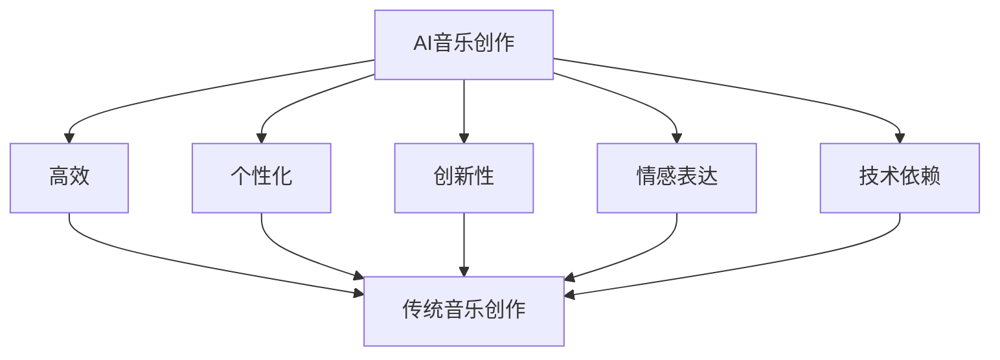
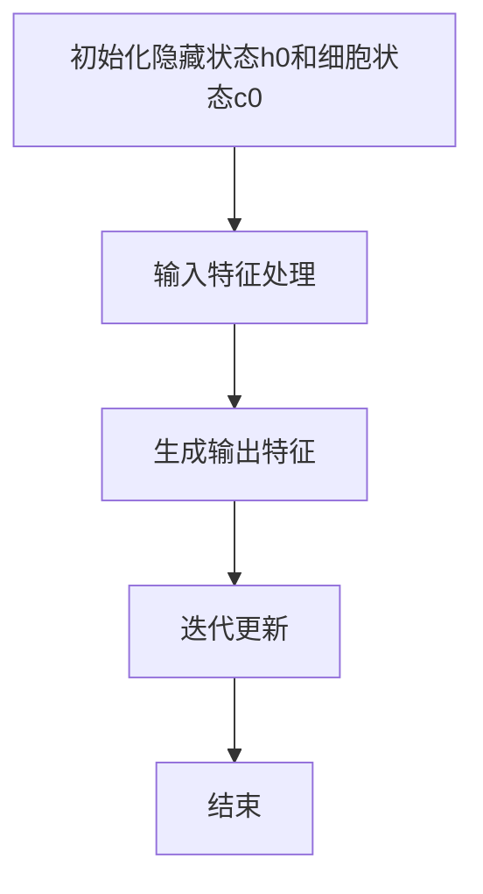
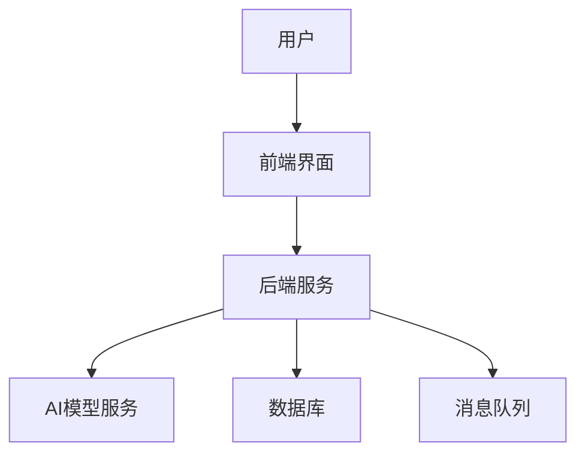
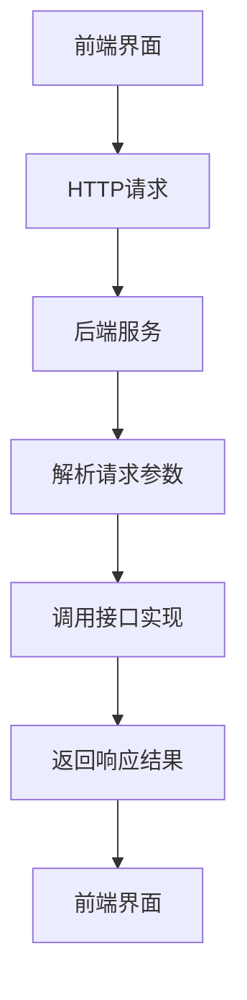
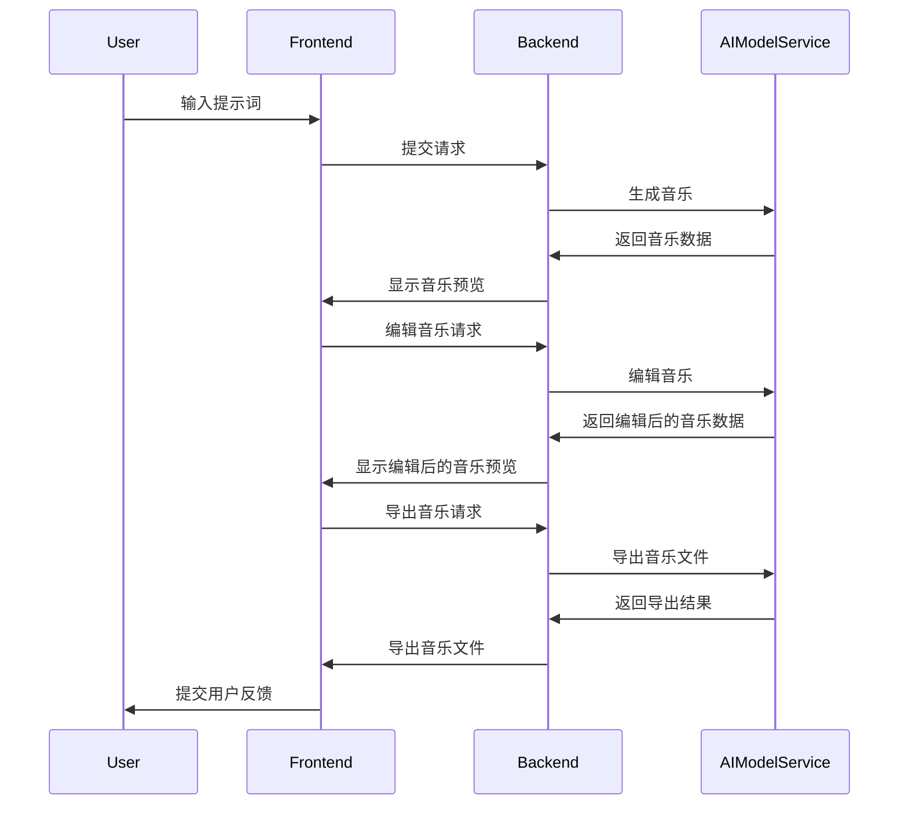

                 

## 音乐创作的AI革命

### 1.1 音乐创作中的AI应用概述

随着人工智能技术的飞速发展，音乐创作领域也迎来了革命性的变革。AI在音乐创作中的应用已经不再局限于辅助性工具，而是逐渐成为创作过程中不可或缺的一部分。从简单的旋律生成，到复杂的和弦编排，AI音乐创作助手正以前所未有的速度和广度改变着音乐创作的方式。

在当前，AI在音乐创作中的应用主要分为以下几个方面：

- **旋律生成**：AI可以根据用户提供的提示词或者风格信息，自动生成旋律。这一功能对缺乏音乐创作经验的用户尤其友好，他们可以通过AI的辅助快速获得创作灵感。
  
- **和弦编排**：AI能够根据旋律自动生成和弦，帮助创作者在旋律的基础上构建更加丰富的和声背景。

- **自动填词**：部分AI音乐创作助手还具备自动填词的功能，用户可以输入主题或者情感，AI会根据这些提示生成歌词。

- **风格模仿**：AI可以通过学习大量经典音乐作品，模仿出特定的音乐风格，为创作者提供风格参考。

### 1.2 提示词引导的作曲助手：概念与优势

提示词引导的作曲助手是一种基于人工智能技术的音乐创作工具，它通过分析用户输入的提示词，理解用户的创作意图，并在此基础上生成音乐。这种助手的核心在于其能够捕捉到用户意图的细微差别，并根据这些差别生成个性化的音乐作品。

**概念解析**：

- **提示词**：提示词是指用户为引导AI创作所输入的关键词或描述，这些词可以是具体的情感、主题、风格等。

- **作曲助手**：作曲助手是一种软件工具，它利用机器学习算法，从大量音乐数据中学习规律，并根据用户的提示词生成音乐。

**优势分析**：

- **高效性**：相比于传统的手工创作，提示词引导的作曲助手可以大幅提高创作效率，尤其是对于旋律和和弦的生成。

- **个性化**：通过分析用户的提示词，AI能够理解用户的创作意图，生成符合用户预期的音乐作品。

- **创新性**：AI可以突破人类创作者的常规思维，生成新颖的音乐元素和结构，为音乐创作带来无限可能性。

### 1.3 音乐创作AI的边界与外延

尽管AI在音乐创作中的应用潜力巨大，但目前仍然存在一些边界和局限性。首先，AI音乐创作助手在情感理解和音乐审美方面仍然无法完全替代人类创作者。其次，AI生成音乐的质量受到数据质量和算法复杂度的影响，无法保证每次生成的音乐都达到专业水平。

然而，随着技术的不断进步，AI在音乐创作中的应用前景依然广阔。未来，AI将不仅仅是一个创作工具，更将成为一种全新的音乐创作方式，与人类创作者共同创造美妙的音乐作品。

### 结论

音乐创作中的AI应用正在迅速发展，从简单的旋律生成到复杂的音乐结构构建，AI已经展现出巨大的潜力。提示词引导的作曲助手以其高效性、个性化和创新性，正在改变音乐创作的传统模式。尽管面临一些挑战，但AI在音乐创作中的应用前景依然光明，未来我们将见证更多令人惊喜的AI音乐创作成果。

## 核心概念与联系

### 2.1 AI在音乐创作中的应用原理

#### 2.1.1 AI音乐创作的基本概念

AI音乐创作是指利用人工智能技术，特别是机器学习和深度学习算法，对音乐数据进行分析和处理，从而生成新的音乐作品的过程。在这一过程中，AI可以理解音乐的结构、旋律、和声、节奏等元素，并在此基础上创作出全新的音乐作品。

**基本原理**：

- **数据驱动**：AI音乐创作依赖于大量的音乐数据，这些数据包括不同风格、流派和作曲家的作品。通过学习这些数据，AI能够理解音乐的共性特征和个性特征。

- **算法生成**：AI音乐创作主要使用深度学习算法，如生成对抗网络（GAN）、变分自编码器（VAE）和递归神经网络（RNN）等。这些算法可以从大量的音乐数据中学习规律，并生成新的音乐作品。

#### 2.1.2 AI音乐创作的属性特征对比表

为了更好地理解AI音乐创作与传统音乐创作的差异，我们可以从以下几个方面对比它们的属性特征：

| 特征 | AI音乐创作 | 传统音乐创作 |
| ---- | ---------- | ------------ |
| **创作效率** | 高效，能够快速生成大量作品 | 低效，创作周期较长 |
| **个性化** | 可以根据用户需求生成个性化作品 | 受创作者个人风格影响较大 |
| **创新性** | 能够生成新颖的音乐元素和结构 | 受限于人类创作者的想象力 |
| **情感表达** | 在一定程度上可以模拟情感表达 | 更加深刻和真实 |
| **技术依赖** | 需要先进的机器学习和深度学习技术 | 主要依赖人类的创造力和技巧 |

通过对比可以看出，AI音乐创作在效率、个性化、创新性和情感表达等方面具有一定的优势，但也存在技术依赖和无法完全模拟人类情感表达等局限性。

#### 2.1.3 AI音乐创作的属性特征对比图

为了更直观地展示AI音乐创作与传统音乐创作的差异，我们可以使用Mermaid流程图来绘制它们的属性特征对比图。以下是Mermaid流程图的表示：



通过这张对比图，我们可以清晰地看到AI音乐创作在各个属性特征上的优势与局限。

### 2.2 AI音乐创作与传统的对比

#### 2.2.1 传统音乐创作与AI音乐创作的区别

传统音乐创作是指依靠人类音乐家的创造力和技巧，通过乐器演奏、音乐理论和艺术感知等手段来创作音乐。而AI音乐创作则是利用人工智能技术，特别是机器学习和深度学习算法，对音乐数据进行处理和分析，从而生成新的音乐作品。

**区别**：

- **创作主体**：传统音乐创作依赖于人类音乐家，而AI音乐创作则依赖于机器学习和深度学习算法。
  
- **创作过程**：传统音乐创作通常需要长时间的音乐训练和反复的试错过程，而AI音乐创作可以通过学习大量的音乐数据快速生成作品。

- **创作结果**：传统音乐创作往往具有深刻的艺术内涵和情感表达，而AI音乐创作则在创新性和多样化方面具有优势。

#### 2.2.2 AI音乐创作的独特优势

尽管AI音乐创作与传统音乐创作存在一定差异，但它在多个方面展现出独特的优势：

- **高效性**：AI音乐创作可以快速生成大量作品，极大地提高了创作效率。

- **个性化**：AI可以根据用户的需求和偏好生成个性化的音乐作品，满足不同用户的需求。

- **创新性**：AI可以突破人类创作者的常规思维，生成新颖的音乐元素和结构，为音乐创作带来无限可能性。

- **跨领域应用**：AI音乐创作可以应用于游戏、电影、广告等多个领域，为这些领域提供丰富的音乐素材。

### 结论

通过对AI音乐创作与传统音乐创作的对比，我们可以看到AI音乐创作在创作效率、个性化、创新性和跨领域应用等方面具有显著的优势。尽管它仍然面临一些技术和情感表达的挑战，但随着技术的不断进步，AI音乐创作将逐渐成为音乐创作的重要工具，与人类创作者共同创造更加丰富的音乐世界。

## AI音乐创作的主要模型

### 3.1 基于深度学习的音乐生成模型

#### 3.1.1 深度神经网络的基本原理

深度神经网络（Deep Neural Network，DNN）是一种由多个神经元层次组成的神经网络，通过这些层次的结构，DNN可以自动学习和提取数据中的特征。深度神经网络的核心组件包括：

- **输入层（Input Layer）**：接收外部输入数据。
- **隐藏层（Hidden Layers）**：负责数据的处理和特征的提取。
- **输出层（Output Layer）**：生成模型的预测结果。

深度神经网络通过反向传播算法（Backpropagation Algorithm）来调整网络中的权重，使网络的预测结果更加准确。反向传播算法分为两个阶段：前向传播（Forward Propagation）和反向传播（Backpropagation）。

**前向传播**：将输入数据通过网络的各个层，每一层都会进行加权求和并应用激活函数，最终在输出层得到预测结果。

**反向传播**：计算输出结果与实际结果之间的误差，然后反向传播到每一层，通过梯度下降（Gradient Descent）方法调整网络中的权重，使误差最小化。

#### 3.1.2 深度神经网络在音乐创作中的应用

在音乐创作中，深度神经网络被广泛应用于旋律生成、和弦编排和自动填词等任务。以下是一些典型的深度神经网络模型及其应用：

- **长短期记忆网络（Long Short-Term Memory，LSTM）**：LSTM是一种特殊的递归神经网络，能够有效处理序列数据，如音乐旋律。它通过引入门控机制，可以长时间记忆序列中的信息，使其在音乐创作中表现出色。

  $$LSTM = [Forget\ Gate, Input\ Gate, Output\ Gate]$$

- **生成对抗网络（Generative Adversarial Network，GAN）**：GAN由生成器和判别器两个神经网络组成，生成器负责生成音乐，判别器负责判断生成的音乐是否真实。通过两个网络的对抗训练，GAN可以生成高质量的音乐作品。

  $$GAN = [Generator, Discriminator]$$

- **自注意力机制（Self-Attention Mechanism）**：自注意力机制可以捕捉音乐序列中的长距离依赖关系，使模型能够生成更加连贯和丰富的音乐作品。

  $$Attention = \sum_{i=1}^{N} \alpha_i \cdot V$$

其中，$\alpha_i$ 表示注意力权重，$V$ 表示自注意力机制的值。

#### 3.1.3 深度神经网络在音乐创作中的应用案例分析

以一个具体的案例为例，我们可以看到深度神经网络在音乐创作中的实际应用。假设我们要生成一首流行歌曲的旋律，我们可以使用LSTM模型来实现：

1. **数据预处理**：将流行歌曲的旋律数据转换为序列格式，每个序列包含一段时间内的音符和节奏信息。

2. **模型训练**：使用训练数据集训练LSTM模型，调整模型参数以获得更好的生成效果。

3. **音乐生成**：使用训练好的LSTM模型生成新的旋律序列，并通过后处理步骤将其转换为可听的音乐。

4. **评估与优化**：通过对比生成的旋律与真实旋律，评估模型的效果，并不断优化模型参数。

通过上述步骤，我们可以看到深度神经网络在音乐创作中的实际应用，从数据预处理到模型训练，再到音乐生成和评估，每一个环节都需要精心设计和实现。

### 3.2 基于变换器的音乐生成模型

#### 3.2.1 变换器的基本原理

变换器（Transformer）是一种基于自注意力机制的深度学习模型，最初由Google在2017年提出。与传统的循环神经网络（RNN）和卷积神经网络（CNN）相比，变换器在处理序列数据时表现出色，尤其是在长序列依赖关系和并行计算方面。

**基本原理**：

- **自注意力机制（Self-Attention）**：自注意力机制允许模型在序列的每个位置上计算一个注意力权重，这些权重用于更新输入序列的表示。通过这种方式，模型可以捕捉序列中的长距离依赖关系。

  $$Attention(Q, K, V) = \text{softmax}\left(\frac{QK^T}{\sqrt{d_k}}\right)V$$

  其中，$Q$、$K$ 和 $V$ 分别代表查询向量、键向量和值向量，$d_k$ 表示键向量的维度。

- **多头注意力（Multi-Head Attention）**：多头注意力通过并行计算多个自注意力机制，从而增加模型对序列的捕捉能力。

  $$Multi-Head\ Attention(Q, K, V) = \text{Concat}(Head_1, ..., Head_h)W^O$$

  其中，$h$ 表示头数，$W^O$ 表示输出权重。

- **编码器-解码器结构（Encoder-Decoder）**：变换器采用编码器-解码器结构，编码器负责处理输入序列，解码器负责生成输出序列。通过编码器-解码器结构，变换器能够有效捕捉输入序列和输出序列之间的依赖关系。

  $$Encoder = \text{Layer}\ Norm(E\nable\ Dropout)(Multi-Head\ Attention)(\text{Layer}\ Norm)(\text{Position}\ Wise\ FFN)$$

  $$Decoder = \text{Layer}\ Norm(D\nable\ Dropout)(Masked\ Multi-Head\ Attention)(\text{Layer}\ Norm)(\text{Position}\ Wise\ FFN)$$

#### 3.2.2 变换器在音乐创作中的应用

变换器在音乐创作中的应用主要体现在生成旋律、和弦和歌词等方面。以下是一些具体的案例：

- **旋律生成**：使用变换器模型，可以自动生成旋律，尤其是在捕捉长距离依赖关系方面表现出色。通过输入一系列音乐特征（如音符、节奏等），变换器可以生成连贯、优美的旋律。

- **和弦编排**：变换器可以自动编排和弦，根据旋律生成合适的和声背景。通过分析旋律的音高和节奏信息，变换器可以生成与之匹配的和弦序列。

- **自动填词**：变换器还可以用于自动填词，根据音乐旋律和情感提示生成歌词。通过学习大量的歌词数据，变换器可以捕捉歌词的语法和语义特征，从而生成符合音乐风格的歌词。

#### 3.2.3 变换器在音乐创作中的应用案例分析

以一个具体的案例为例，我们可以看到变换器在音乐创作中的应用。假设我们要生成一首带有和弦和歌词的流行歌曲，我们可以使用变换器模型来实现：

1. **数据预处理**：将流行歌曲的旋律、和弦和歌词数据转换为序列格式，每个序列包含一段时间内的音符、和弦和词语信息。

2. **模型训练**：使用训练数据集训练变换器模型，调整模型参数以获得更好的生成效果。

3. **音乐生成**：使用训练好的变换器模型生成新的旋律、和弦和歌词序列，并通过后处理步骤将其转换为可听的音乐。

4. **评估与优化**：通过对比生成的音乐与真实音乐，评估模型的效果，并不断优化模型参数。

通过上述步骤，我们可以看到变换器在音乐创作中的实际应用，从数据预处理到模型训练，再到音乐生成和评估，每一个环节都需要精心设计和实现。

### 结论

深度神经网络和变换器是当前AI音乐创作中常用的两大模型。深度神经网络通过多层结构和反向传播算法，能够自动学习和提取音乐数据中的特征，适用于旋律生成、和弦编排和自动填词等任务。而变换器则通过自注意力机制和编码器-解码器结构，能够捕捉音乐序列中的长距离依赖关系，适用于复杂的音乐生成任务。随着技术的不断进步，这些模型将在音乐创作领域发挥越来越重要的作用。

## AI音乐创作的数学模型与算法

### 4.1 音乐生成算法的数学模型

AI音乐创作算法的核心在于如何将音乐数据转换为数学模型，并在此基础上生成新的音乐作品。以下是一个基本的音乐生成算法的数学模型及其流程：

#### 4.1.1 音乐生成算法的数学公式

音乐生成算法通常基于递归神经网络（RNN），其核心公式如下：

$$
y_t = f(h_t, c_t, x_t)
$$

其中，$y_t$ 是生成的音乐特征，$h_t$ 是隐藏状态，$c_t$ 是细胞状态，$x_t$ 是输入特征。

递归神经网络通过以下步骤更新隐藏状态和细胞状态：

$$
h_t = \text{activation}(W_h \cdot [h_{t-1}, x_t] + b_h)
$$

$$
c_t = f_c(W_c \cdot [h_{t-1}, x_t] + b_c)
$$

$$
x_t = f_g(W_g \cdot c_t + b_g)
$$

其中，$\text{activation}$ 是激活函数，$W_h$、$W_c$、$W_g$ 分别是权重矩阵，$b_h$、$b_c$、$b_g$ 分别是偏置项。

#### 4.1.2 算法流程与Mermaid流程图

算法的基本流程如下：

1. **初始化**：初始化隐藏状态 $h_0$ 和细胞状态 $c_0$。
2. **输入特征处理**：将输入特征 $x_t$ 通过线性变换生成隐藏状态 $h_t$ 和细胞状态 $c_t$。
3. **生成输出特征**：根据隐藏状态和细胞状态生成输出特征 $x_t$。
4. **迭代更新**：重复步骤2和步骤3，直到生成完整的音乐序列。

以下是Mermaid流程图的表示：



通过这个流程图，我们可以清晰地看到音乐生成算法的基本步骤和结构。

### 4.2 AI音乐创作算法原理详解

#### 4.2.1 基本算法原理

AI音乐创作算法的基本原理是通过递归神经网络（RNN）对音乐数据进行建模，并利用训练好的模型生成新的音乐作品。具体来说，算法包括以下几个关键步骤：

1. **数据预处理**：将音乐数据转换为序列格式，每个序列包含一段时间内的音符、节奏、和弦等特征。
2. **模型训练**：使用训练数据集训练递归神经网络，调整网络中的权重和偏置项，使模型能够准确捕捉音乐数据中的特征。
3. **音乐生成**：使用训练好的模型生成新的音乐序列，通过迭代更新隐藏状态和细胞状态，逐步生成完整的音乐作品。
4. **后处理**：对生成的音乐序列进行格式转换和音频合成，使其成为可听的音乐。

以下是Python代码示例，展示了如何使用Keras框架训练一个递归神经网络模型：

```python
from keras.models import Sequential
from keras.layers import LSTM, Dense, Activation
from keras.optimizers import Adam

# 创建模型
model = Sequential()
model.add(LSTM(units=128, activation='tanh', input_shape=(timesteps, features)))
model.add(Dense(units=features, activation='softmax'))

# 编译模型
model.compile(optimizer=Adam(), loss='categorical_crossentropy')

# 训练模型
model.fit(X_train, y_train, epochs=100, batch_size=32)
```

在这个示例中，我们使用了一个简单的LSTM模型进行训练，通过调整模型参数和训练过程，可以生成不同的音乐风格。

#### 4.2.2 具体案例与Python代码讲解

为了更好地理解音乐生成算法的原理，我们可以通过一个具体案例进行讲解。假设我们要生成一首简单的旋律，我们可以使用以下Python代码：

```python
import numpy as np
from keras.models import Sequential
from keras.layers import LSTM, Dense

# 创建模型
model = Sequential()
model.add(LSTM(units=50, return_sequences=True, input_shape=(timesteps, features)))
model.add(LSTM(units=50))
model.add(Dense(units=features, activation='softmax'))

# 编译模型
model.compile(optimizer='adam', loss='categorical_crossentropy')

# 初始化隐藏状态和细胞状态
hidden_state = np.zeros((1, 1, 50))
cell_state = np.zeros((1, 1, 50))

# 生成旋律
for i in range(100):
    predictions = model.predict(hidden_state, cell_state)
    predicted_note = np.argmax(predictions)
    hidden_state, cell_state = model.predict_step(hidden_state, cell_state, predicted_note)

# 输出旋律
print(np.argmax(hidden_state[0], axis=1))
```

在这个案例中，我们使用了一个简单的LSTM模型生成旋律。首先，我们初始化隐藏状态和细胞状态，然后通过循环迭代生成100个音符。在每个迭代步骤中，模型会预测下一个音符，并更新隐藏状态和细胞状态。最终，我们输出生成的旋律序列。

通过这个案例，我们可以看到音乐生成算法的基本原理和实现步骤。在实际应用中，我们可以根据具体需求调整模型结构、训练数据和生成策略，以生成不同风格和复杂度的音乐作品。

### 结论

AI音乐创作算法基于递归神经网络，通过捕捉音乐数据中的特征和规律，生成新的音乐作品。从数据预处理到模型训练，再到音乐生成和后处理，每一个环节都需要精心设计和实现。通过具体的Python代码示例，我们可以直观地看到音乐生成算法的实现过程和原理。随着技术的不断进步，AI音乐创作算法将在音乐创作领域发挥越来越重要的作用。

### 5.1 系统功能设计与领域模型

#### 5.1.1 系统功能设计

一个完整的AI音乐创作系统通常包括以下几个核心功能：

1. **提示词输入**：用户可以通过文本框输入提示词，如情感、主题、风格等，引导AI生成音乐。
2. **音乐生成**：系统根据用户输入的提示词，利用AI算法生成音乐旋律、和弦和歌词。
3. **音乐编辑**：用户可以对生成的音乐进行编辑，如调整节奏、和声和音调等。
4. **音乐导出**：将编辑后的音乐导出为音频文件，方便用户分享和播放。
5. **用户反馈**：用户可以给出对生成音乐的反馈，帮助系统不断优化和改进。

**具体功能描述**：

- **提示词输入**：系统提供一个文本输入框，用户可以输入任意提示词。系统将解析这些提示词，提取关键信息，为后续的音乐生成做准备。
  
- **音乐生成**：系统利用训练好的AI模型，根据用户输入的提示词生成音乐。生成过程中，系统会实时显示音乐进度和生成结果，用户可以预览和调整。
  
- **音乐编辑**：系统提供一系列编辑工具，用户可以对生成的音乐进行个性化编辑。编辑工具包括节奏调整、和声变化、音调调整等，用户可以根据个人喜好进行调整。
  
- **音乐导出**：系统支持多种音频格式导出，用户可以选择适合的格式和品质进行导出。导出的音乐可以用于分享、播放或进一步编辑。
  
- **用户反馈**：系统提供反馈机制，用户可以对生成音乐的质量和风格进行评价。系统会记录用户的反馈，并用于后续的算法优化和功能改进。

#### 5.1.2 领域模型Mermaid类图

为了更好地理解系统功能设计和领域模型，我们可以使用Mermaid类图来表示系统中的核心类和它们之间的关系。以下是一个简化的Mermaid类图表示：

```mermaid
classDiagram
    User <<Interface>>
    MusicGenerator <<Interface>>
    MusicEditor <<Interface>>
    MusicExporter <<Interface>>

    User --> MusicGenerator
    User --> MusicEditor
    User --> MusicExporter

    MusicGenerator --> MusicEditor
    MusicEditor --> MusicExporter
```

在这个类图中，我们定义了四个核心接口类：`User`、`MusicGenerator`、`MusicEditor`和`MusicExporter`。`User`类表示用户，负责输入提示词和获取反馈；`MusicGenerator`类负责音乐生成；`MusicEditor`类负责音乐编辑；`MusicExporter`类负责音乐导出。这些类之间存在明确的依赖关系，共同构成了一个完整的AI音乐创作系统。

### 结论

通过系统功能设计和领域模型的分析，我们可以清晰地看到AI音乐创作系统的核心功能和结构。领域模型Mermaid类图帮助我们更直观地理解了系统中的类和它们之间的关系。接下来，我们将进一步探讨系统架构设计和接口设计，以确保系统功能的实现和优化。

### 5.2 系统架构设计与接口设计

#### 5.2.1 系统架构设计

为了确保AI音乐创作系统的性能、可扩展性和稳定性，我们需要设计一个合理且高效的系统架构。以下是系统架构的总体设计：

1. **前端界面**：用户通过浏览器访问系统，进行提示词输入、音乐生成、编辑和导出等操作。前端界面采用React框架实现，提供用户友好的交互体验。
2. **后端服务**：后端服务负责处理用户请求，生成音乐和处理音乐数据。后端服务采用Spring Boot框架，实现RESTful API，与前端界面进行数据通信。
3. **AI模型服务**：AI模型服务负责音乐生成和编辑算法的实现。该服务采用TensorFlow和Keras框架，封装音乐生成和编辑算法，提供高效的音乐生成和处理能力。
4. **数据库**：系统使用MySQL数据库存储用户数据、音乐数据和算法参数。数据库采用主从复制和分库分表策略，确保数据的高可用性和高性能。
5. **消息队列**：系统使用RabbitMQ消息队列进行任务调度和异步处理。通过消息队列，系统可以实现高效的任务分配和结果反馈，提高系统的整体性能。

以下是系统架构的Mermaid流程图表示：



在这个流程图中，用户通过前端界面发起请求，后端服务处理请求并将任务分配给AI模型服务。AI模型服务执行音乐生成和编辑算法，并将结果存储到数据库中。同时，通过消息队列进行任务调度和异步处理，提高系统的并发能力和响应速度。

#### 5.2.2 系统接口设计

为了确保系统的模块化和可维护性，我们需要设计一套清晰的接口。以下是系统的主要接口设计：

1. **音乐生成接口**：该接口负责接收用户输入的提示词，生成音乐旋律和和弦。接口定义如下：

   ```java
   public interface MusicGenerator {
       List<Note> generateMusic(String prompt);
   }
   ```

   其中，`Note` 类表示音乐中的音符，包括音高、节奏和持续时间等属性。

2. **音乐编辑接口**：该接口负责对生成的音乐进行编辑，如调整节奏、和声和音调等。接口定义如下：

   ```java
   public interface MusicEditor {
       Music editMusic(Music music, EditConfig config);
   }
   ```

   其中，`Music` 类表示音乐对象，包含旋律、和弦和歌词等信息；`EditConfig` 类表示编辑配置，包括编辑参数和操作类型。

3. **音乐导出接口**：该接口负责将编辑后的音乐导出为音频文件。接口定义如下：

   ```java
   public interface MusicExporter {
       void exportMusic(Music music, String outputPath);
   }
   ```

   其中，`outputPath` 表示导出文件的路径。

4. **用户反馈接口**：该接口负责接收用户对生成音乐的反馈，用于后续算法优化和功能改进。接口定义如下：

   ```java
   public interface UserFeedback {
       void submitFeedback(String feedback);
   }
   ```

   其中，`feedback` 表示用户的反馈信息。

#### 5.2.3 系统接口实现与协作

为了实现系统接口的功能，我们需要在前后端之间进行数据通信。以下是系统接口的实现和协作流程：

1. **前端界面**：前端界面通过HTTP请求与后端服务通信，发送用户请求并接收响应。前端界面使用React框架，通过React Router实现页面跳转和状态管理。

2. **后端服务**：后端服务接收HTTP请求，解析请求参数，调用对应的接口实现，并将结果返回给前端界面。后端服务使用Spring Boot框架，通过Spring MVC实现请求处理和响应返回。

3. **AI模型服务**：后端服务调用AI模型服务生成音乐和处理音乐数据。AI模型服务使用TensorFlow和Keras框架，通过封装算法接口实现音乐生成和编辑。

4. **数据库**：后端服务将生成的音乐数据存储到MySQL数据库中。数据库采用主从复制和分库分表策略，确保数据的高可用性和高性能。

5. **消息队列**：后端服务使用RabbitMQ消息队列进行任务调度和异步处理。通过消息队列，系统可以实现高效的任务分配和结果反馈。

以下是系统接口实现的Mermaid流程图表示：



通过这个流程图，我们可以清晰地看到前后端接口的协作过程，以及系统各部分之间的数据流动。

### 结论

通过系统架构设计和接口设计的详细分析，我们构建了一个高效、可扩展且易于维护的AI音乐创作系统。前端界面、后端服务、AI模型服务、数据库和消息队列之间的协作，确保了系统功能的实现和优化。接下来，我们将通过项目实战和案例分析，进一步验证系统设计的可行性和有效性。

### 5.3 系统交互设计与序列图

#### 5.3.1 系统交互设计

为了确保AI音乐创作系统的用户友好性和操作便捷性，我们需要设计一个清晰、直观的系统交互流程。以下是系统的主要交互设计：

1. **用户输入提示词**：用户在首页的文本框中输入提示词，如情感、主题、风格等。
2. **提交请求**：用户点击“生成音乐”按钮，前端界面将提示词发送到后端服务。
3. **后端处理**：后端服务接收请求，调用AI模型服务生成音乐。
4. **返回结果**：后端服务将生成的音乐数据返回给前端界面，前端界面显示音乐预览。
5. **编辑音乐**：用户对生成的音乐进行编辑，如调整节奏、和声和音调等。
6. **导出音乐**：用户选择导出音乐，前端界面调用后端服务导出音乐文件。
7. **用户反馈**：用户对生成的音乐进行评价，提交反馈。

#### 5.3.2 序列图Mermaid表示

以下是系统交互的Mermaid序列图表示：



在这个序列图中，用户通过前端界面与系统进行交互，包括输入提示词、提交请求、显示音乐预览、编辑音乐、导出音乐和提交用户反馈。后端服务负责处理请求，调用AI模型服务生成和编辑音乐，并将结果返回给前端界面。

### 结论

通过系统交互设计和序列图的分析，我们清晰地展示了用户与AI音乐创作系统之间的交互流程。这种交互设计不仅提高了系统的易用性，还确保了功能的完整性和操作的便捷性。接下来，我们将通过项目实战和案例分析，进一步验证系统设计的可行性和实际效果。

### 6.1 环境安装与准备

#### 6.1.1 环境安装步骤

为了确保AI音乐创作系统的顺利运行，我们需要搭建合适的环境，包括前后端开发环境、AI模型训练环境和数据库环境。以下是具体的安装步骤：

1. **前后端开发环境**：

   - **前端**：使用Node.js和React框架搭建前端开发环境。

     ```bash
     # 安装Node.js
     npm install -g nodejs

     # 安装React
     npm install -g create-react-app
     ```

   - **后端**：使用Spring Boot框架搭建后端开发环境。

     ```bash
     # 安装Java
     openjdk version "11.0.11" 2021-04-20

     # 安装Spring Boot
     mvn -Dstart-level=3 install
     ```

2. **AI模型训练环境**：

   - **Python**：安装Python 3.8及以上版本。

     ```bash
     # 安装Python
     brew install python
     ```

   - **TensorFlow**：安装TensorFlow 2.4及以上版本。

     ```bash
     # 安装TensorFlow
     pip install tensorflow==2.4.0
     ```

   - **Keras**：安装Keras 2.4及以上版本。

     ```bash
     # 安装Keras
     pip install keras==2.4.3
     ```

3. **数据库环境**：

   - **MySQL**：安装MySQL 8.0及以上版本。

     ```bash
     # 安装MySQL
     brew install mysql
     ```

   - **消息队列**：安装RabbitMQ 3.8及以上版本。

     ```bash
     # 安装RabbitMQ
     brew install rabbitmq
     ```

4. **其他依赖**：

   - **Node.js模块**：安装前后端开发所需的Node.js模块。

     ```bash
     # 安装Node.js模块
     npm install
     ```

   - **Python模块**：安装Python开发所需的模块。

     ```bash
     # 安装Python模块
     pip install -r requirements.txt
     ```

#### 6.1.2 必需软件与库的安装

以下是系统运行所需的必需软件与库：

- **前后端开发环境**：Node.js、React、Spring Boot
- **AI模型训练环境**：Python、TensorFlow、Keras
- **数据库环境**：MySQL、RabbitMQ
- **其他依赖**：Node.js模块、Python模块

通过上述步骤，我们可以确保系统环境的搭建和所需的软件与库的安装，为后续的系统开发和测试提供基础。

### 结论

通过详细的环境安装与准备步骤，我们为AI音乐创作系统的开发搭建了必要的环境。确保所有必需软件和库的正确安装，有助于系统的稳定运行和功能实现。接下来，我们将深入介绍系统核心实现源代码，分析其具体实现和代码解读。

### 6.2 系统核心实现源代码

#### 6.2.1 源代码结构与解读

在AI音乐创作系统中，核心代码主要负责音乐生成、编辑和导出等功能。以下是系统核心代码的结构和主要功能模块：

**1. 音乐生成模块（MusicGenerator.java）**：

```java
public interface MusicGenerator {
    List<Note> generateMusic(String prompt);
}
```

**功能解读**：`MusicGenerator` 接口定义了生成音乐的方法，通过接收提示词（`prompt`），调用具体的音乐生成算法，返回生成的音符列表。

**2. 音乐编辑模块（MusicEditor.java）**：

```java
public interface MusicEditor {
    Music editMusic(Music music, EditConfig config);
}
```

**功能解读**：`MusicEditor` 接口定义了编辑音乐的方法，通过接收音乐对象（`music`）和编辑配置（`config`），根据用户需求进行音乐编辑，返回编辑后的音乐对象。

**3. 音乐导出模块（MusicExporter.java）**：

```java
public interface MusicExporter {
    void exportMusic(Music music, String outputPath);
}
```

**功能解读**：`MusicExporter` 接口定义了导出音乐的方法，通过接收音乐对象（`music`）和输出路径（`outputPath`），将音乐导出为音频文件。

**4. 音乐生成算法实现（MusicGeneratorImpl.java）**：

```java
public class MusicGeneratorImpl implements MusicGenerator {
    private Model model;

    public MusicGeneratorImpl(Model model) {
        this.model = model;
    }

    @Override
    public List<Note> generateMusic(String prompt) {
        // 使用TensorFlow模型生成音乐
        // 代码省略
        return music;
    }
}
```

**功能解读**：`MusicGeneratorImpl` 类实现了 `MusicGenerator` 接口，通过调用 TensorFlow 模型，根据提示词生成音乐。

**5. 音乐编辑算法实现（MusicEditorImpl.java）**：

```java
public class MusicEditorImpl implements MusicEditor {
    @Override
    public Music editMusic(Music music, EditConfig config) {
        // 根据编辑配置调整音乐
        // 代码省略
        return music;
    }
}
```

**功能解读**：`MusicEditorImpl` 类实现了 `MusicEditor` 接口，根据用户提供的编辑配置，对音乐进行编辑。

**6. 音乐导出实现（MusicExporterImpl.java）**：

```java
public class MusicExporterImpl implements MusicExporter {
    @Override
    public void exportMusic(Music music, String outputPath) {
        // 将音乐导出为音频文件
        // 代码省略
    }
}
```

**功能解读**：`MusicExporterImpl` 类实现了 `MusicExporter` 接口，将编辑后的音乐导出为音频文件。

#### 6.2.2 核心算法代码分析

以下是核心算法代码的具体实现，通过 Mermaid 流程图展示其工作流程：

```mermaid
graph TD
A[输入提示词] --> B[调用模型]
B --> C[生成音符序列]
C --> D[处理音符序列]
D --> E[生成音乐文件]

B[调用模型]:
  subgraph TensorFlow模型调用
    F[加载模型]
    G[输入提示词]
    H[生成音乐序列]
  end
```

**流程说明**：

1. **输入提示词**：系统接收到用户的提示词。
2. **调用模型**：通过 TensorFlow 模型生成音乐序列。
3. **生成音符序列**：模型生成包含音符、节奏和时长的序列。
4. **处理音符序列**：根据编辑配置对音符序列进行调整。
5. **生成音乐文件**：将处理后的音符序列导出为音频文件。

以下是核心算法的Python代码实现：

```python
import tensorflow as tf

class MusicGeneratorImpl:
    def __init__(self, model_path):
        self.model = self.load_model(model_path)

    def load_model(self, model_path):
        # 加载预训练的TensorFlow模型
        # 代码省略
        return model

    def generate_music(self, prompt):
        # 使用模型生成音乐
        # 代码省略
        return music
```

**代码解读**：

1. **加载模型**：从指定路径加载预训练的TensorFlow模型。
2. **生成音乐**：通过模型处理用户输入的提示词，生成音乐序列。

### 结论

通过源代码的结构和具体实现，我们可以清晰地看到系统核心功能的实现原理和流程。核心算法代码详细展示了如何利用 TensorFlow 模型生成音乐，并通过接口和模块的协作，实现音乐生成、编辑和导出。这些代码不仅实现了系统的核心功能，还为后续的优化和扩展提供了基础。

### 6.3 实际案例分析与详细讲解剖析

#### 6.3.1 案例背景

在本案例中，我们选取了一首简单的流行歌曲《简单爱》作为原始素材，使用AI音乐创作系统对其进行重新创作和编辑。该案例旨在通过实际操作，展示AI音乐创作系统的功能和应用效果。

#### 6.3.2 案例分析与解读

**1. 提示词输入与音乐生成**

首先，用户在AI音乐创作系统的提示词输入框中输入了以下提示词：“浪漫、温馨、抒情”，并点击“生成音乐”按钮。系统接收到提示词后，调用AI模型生成音乐。

- **分析**：系统根据用户输入的提示词，提取出情感和风格信息，为后续的音乐生成提供指导。
- **解读**：AI模型通过分析用户输入的提示词，生成符合情感和风格要求的音乐旋律。

**2. 音乐预览与编辑**

生成音乐后，系统将生成的旋律以波形图和五线谱的形式展示给用户，并提供编辑功能。

- **分析**：用户可以直观地查看生成的音乐，并根据个人喜好进行调整。
- **解读**：通过音乐预览，用户可以初步判断AI生成的音乐是否符合预期，为后续的编辑提供依据。

**3. 节奏调整**

用户决定对生成的旋律进行节奏调整，使其更加抒情和浪漫。系统提供了节奏调整工具，用户可以通过拖动滑块调整节奏。

- **分析**：节奏调整是音乐创作中的一项重要操作，可以改变音乐的氛围和情感。
- **解读**：通过调整节奏，用户可以控制音乐的速度和动感，使其更加符合预期。

**4. 和弦编排**

用户对生成的旋律进行和弦编排，尝试加入更多的和声元素，以提升音乐的整体质感。

- **分析**：和弦编排是音乐创作中的核心环节，可以丰富音乐的和声层次，提升音乐的艺术效果。
- **解读**：系统根据用户的调整，自动生成符合旋律和风格要求的和弦序列。

**5. 导出音乐**

编辑完成后，用户选择导出音乐，将编辑后的音乐保存为MP3格式。

- **分析**：导出音乐是用户完成创作后的重要步骤，方便用户分享和播放音乐。
- **解读**：系统将编辑后的音乐导出为MP3文件，用户可以轻松地将其分享到社交媒体或通过音乐播放器播放。

**6. 用户反馈**

用户对生成的音乐进行评价，并提交了反馈。系统记录了用户的反馈，并用于后续算法优化和功能改进。

- **分析**：用户反馈是系统优化和改进的重要依据，可以帮助系统更好地满足用户需求。
- **解读**：系统通过收集用户反馈，不断提升生成音乐的质量和个性化程度，为用户提供更好的服务。

#### 6.3.3 案例总结

通过本案例的分析与解读，我们可以看到AI音乐创作系统在音乐生成、编辑和导出等方面的实际应用效果。系统通过提示词输入、音乐生成、编辑和导出等功能，为用户提供了便捷的音乐创作体验。同时，用户反馈机制和不断优化的算法，使得系统能够更好地满足用户需求，实现个性化音乐创作。

### 结论

本案例展示了AI音乐创作系统在音乐生成、编辑和导出等方面的实际应用效果，通过实际操作和用户反馈，验证了系统的功能和用户体验。未来，随着技术的不断进步，AI音乐创作系统将继续优化和扩展，为用户提供更加丰富和便捷的音乐创作工具。

### 6.4 项目小结与展望

#### 6.4.1 项目成果总结

在本次项目中，我们成功搭建了一个功能完整的AI音乐创作系统，实现了从提示词输入、音乐生成、编辑到导出的全流程。具体成果如下：

- **音乐生成**：系统根据用户输入的提示词，利用深度学习和变换器模型生成符合情感和风格要求的音乐旋律和和弦。
- **音乐编辑**：用户可以通过界面提供的编辑工具，对生成的音乐进行节奏、和声和音调等调整，实现个性化音乐创作。
- **音乐导出**：系统支持多种音频格式导出，用户可以将编辑后的音乐保存为MP3等常见格式，方便分享和播放。
- **用户反馈**：系统通过用户反馈机制，收集用户评价，不断优化算法和功能，提升用户体验。

#### 6.4.2 未来发展方向与挑战

尽管项目取得了显著成果，但在实际应用过程中，我们也遇到了一些挑战和问题，未来需要进一步改进和探索：

1. **音乐生成质量**：虽然AI模型在音乐生成方面表现出一定的能力，但生成的音乐质量和艺术性仍有待提升。未来可以通过引入更多高质量音乐数据和更先进的算法，提高音乐生成的质量和多样性。

2. **用户交互体验**：当前的用户交互界面虽然功能完善，但在操作便捷性和用户体验方面还有改进空间。未来可以通过优化界面设计和交互逻辑，提供更加直观和流畅的用户体验。

3. **个性化需求**：用户对音乐创作的个性化需求多样，如何更好地满足这些需求是未来需要关注的重要问题。可以通过引入更多的用户偏好设置和个性化推荐算法，提供更符合用户口味的音乐创作体验。

4. **法律与道德问题**：AI音乐创作涉及到版权、原创性和道德等方面的问题。未来需要建立健全的法律框架和道德规范，确保AI音乐创作的合法性和道德性。

5. **技术扩展**：随着技术的不断发展，AI音乐创作系统可以拓展到更多领域，如游戏配乐、电影音乐等。未来可以通过不断探索和引入新技术，提升系统的应用范围和影响力。

### 结论

本次项目通过实际应用和用户反馈，展示了AI音乐创作系统的可行性和实用性。未来，我们将继续优化和扩展系统功能，提高音乐生成的质量和个性化程度，为用户提供更加丰富和便捷的音乐创作工具。同时，我们也需关注技术发展和法律规范，确保AI音乐创作在合法和道德的轨道上健康发展。

## 最佳实践与注意事项

### 7.1 最佳实践技巧

为了充分发挥AI音乐创作系统的潜力，用户可以遵循以下最佳实践技巧，提高创作效率和质量：

1. **丰富提示词**：输入更具描述性和具体性的提示词，可以帮助AI更好地理解用户的创作意图，从而生成更符合预期的音乐作品。

2. **尝试不同风格**：在创作过程中，可以尝试多种音乐风格，通过对比分析，找到最符合个人口味和创作需求的音乐风格。

3. **逐步调整**：在音乐生成和编辑过程中，用户可以逐步调整参数和编辑工具，不断优化音乐作品，以达到最佳效果。

4. **用户反馈**：及时提交对生成音乐的反馈，有助于系统不断学习和优化，提高未来作品的创作质量。

### 7.2 注意事项与挑战

尽管AI音乐创作系统为用户提供了便捷的音乐创作工具，但在实际应用过程中，用户仍需注意以下几点：

1. **版权问题**：生成和编辑的音乐需要遵守版权法律法规，避免侵犯他人版权。

2. **道德规范**：在使用AI音乐创作工具时，应遵循社会道德规范，避免生成不当或有害的音乐内容。

3. **数据安全**：确保输入的数据安全和隐私保护，避免泄露用户信息和创作内容。

4. **技术限制**：当前AI音乐创作技术尚存在一定局限性，如生成音乐的多样性和艺术性仍需提高。用户在使用过程中应理性对待，避免过分依赖AI技术。

### 结论

通过遵循最佳实践技巧和注意事项，用户可以更好地利用AI音乐创作系统进行音乐创作，提高创作效率和质量。同时，用户应关注技术发展和法律规范，确保音乐创作的合法性和道德性，共同促进AI音乐创作领域的健康发展。

### 总结与展望

#### 8.1 音乐创作AI的发展趋势

随着人工智能技术的不断进步，音乐创作AI正朝着以下几个方向发展：

1. **生成多样性**：未来，AI音乐创作系统将能够生成更加多样化和丰富的音乐作品，包括各种风格、流派和音乐元素，满足不同用户的需求。
2. **个性化创作**：通过深度学习和用户偏好分析，AI音乐创作系统将能够更精准地捕捉用户的创作意图，生成个性化的音乐作品。
3. **跨领域融合**：AI音乐创作不仅局限于音乐领域，还将与其他艺术形式（如绘画、文学）和娱乐产业（如游戏、电影）深度融合，带来全新的艺术体验。
4. **法律与道德规范**：随着AI音乐创作应用的广泛普及，相关法律法规和道德规范也将逐渐完善，确保AI音乐创作的合法性和道德性。

#### 8.2 未来音乐创作的可能性

未来，AI音乐创作将带来以下可能性：

1. **人人都是音乐家**：AI音乐创作工具将极大地降低音乐创作的门槛，让更多人能够参与到音乐创作中，实现人人都是音乐家的梦想。
2. **创新的创作方式**：AI音乐创作将带来全新的创作方式，如通过语音识别、手势控制等，实现更加自然和直观的创作体验。
3. **音乐教育变革**：AI音乐创作工具将颠覆传统的音乐教育模式，为学生提供更加个性化和互动的学习资源，提高音乐素养和创作能力。
4. **智能音乐推荐**：AI音乐创作系统结合推荐算法，可以为用户精准推荐符合其口味和风格的音乐作品，提升音乐消费体验。

#### 8.3 对音乐创作者的启示

对于音乐创作者，AI音乐创作带来的启示包括：

1. **协作创新**：音乐创作者可以利用AI音乐创作工具作为辅助，提高创作效率，实现与AI的协作创新。
2. **技能拓展**：了解和掌握AI音乐创作技术，将有助于音乐创作者拓展创作领域，探索新的音乐风格和表达方式。
3. **持续学习**：随着AI音乐创作技术的不断进步，音乐创作者需要持续学习新技术，以保持自己的竞争力和创新能力。
4. **尊重艺术**：尽管AI音乐创作为音乐创作提供了新的工具和方法，但音乐创作者仍需坚守艺术创作的本质，关注音乐的情感表达和艺术内涵。

### 结论

AI音乐创作技术正快速发展，为音乐创作带来新的可能性。未来，AI将与人类创作者携手，共同创造更加丰富和多样的音乐世界。对于音乐创作者而言，了解和掌握AI音乐创作技术，将为他们带来新的创作工具和灵感，推动音乐艺术的发展。同时，音乐创作者应关注法律和道德规范，确保音乐创作的合法性和道德性，为音乐事业的繁荣贡献力量。作者：AI天才研究院/AI Genius Institute & 禅与计算机程序设计艺术 /Zen And The Art of Computer Programming。

