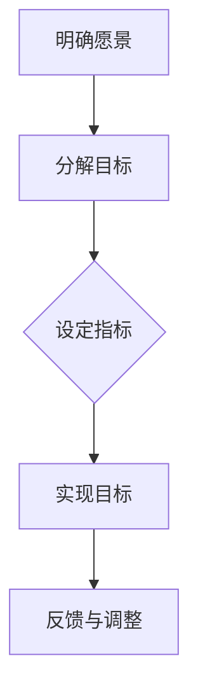
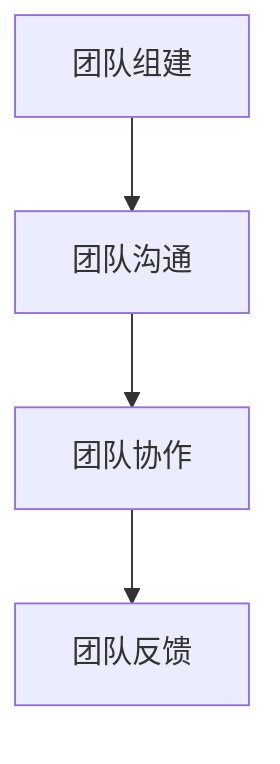
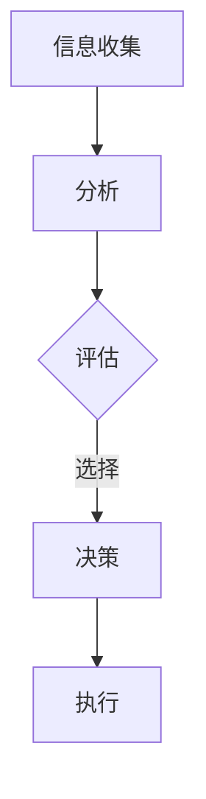
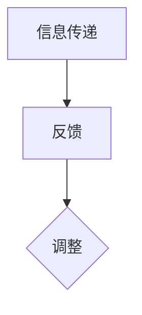
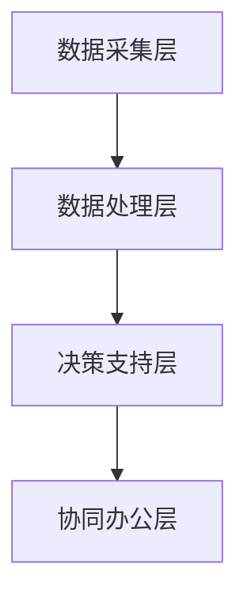
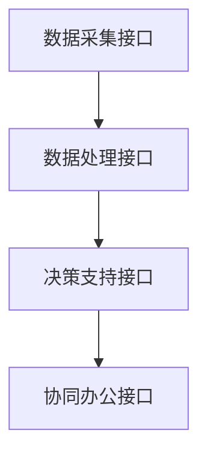
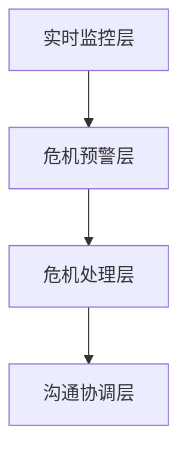
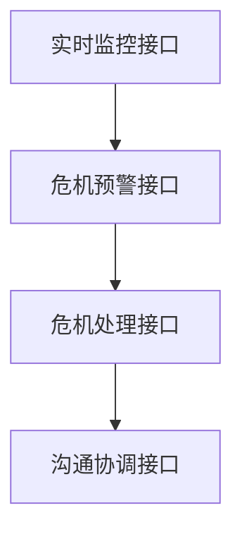
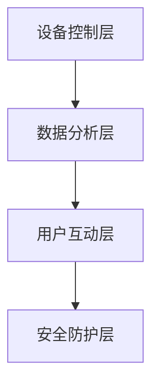
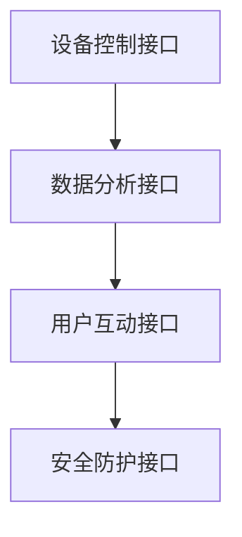

                 

# 领导力与决策能力：在不确定性中把握方向

关键词：领导力、决策能力、不确定性、管理、团队建设

摘要：
在充满不确定性的现代社会，领导力与决策能力成为领导者成功的关键。本文将深入探讨领导力的核心概念、要素和关键技能，并通过实际案例和策略分析，帮助领导者提高决策能力，有效应对不确定性，引领团队走向成功。

## 目录大纲

1. 引言
2. 第一部分：领导力基础
   2.1 问题背景与核心概念
   2.2 领导力的核心概念与原理
   2.3 领导力的关键技能
3. 第二部分：决策能力的培养
   3.1 决策能力的重要性
   3.2 决策过程中的关键步骤
   3.3 培养高效决策能力的策略
4. 第三部分：在不确定性中把握方向
   4.1 不确定性对决策的影响
   4.2 应对不确定性的策略
   4.3 领导者在不确定性中的角色
5. 第四部分：实际案例分析
   5.1 案例一：企业数字化转型
   5.2 案例二：危机管理
   5.3 案例三：创新与创业
6. 结论
7. 最佳实践 tips
8. 小结
9. 注意事项
10. 拓展阅读

## 引言

在现代社会，变化已成为常态。技术的飞速发展、市场的瞬息万变、竞争的日益激烈，都使得领导者面临前所未有的挑战。在这种充满不确定性的环境中，领导力与决策能力成为领导者成功的关键。本文将围绕这两个核心主题，深入探讨领导者如何在不确定性中把握方向，实现组织的目标。

领导力是一种影响和激励他人共同实现目标的能力。它不仅涉及个人的行为，还涉及到组织文化和环境因素。决策能力则是领导者的一项关键技能，它涉及到领导者如何收集信息、分析问题、评估方案和做出选择。在不确定性中，决策能力尤为重要，因为领导者需要快速适应环境变化，做出正确的决策，带领团队走向成功。

本文将首先介绍领导力的核心概念与要素，然后深入探讨决策能力的培养，并分析在不确定性中把握方向的具体策略。通过实际案例分析，读者将能够更好地理解这些概念和策略的应用。最后，本文将总结最佳实践，并提供进一步阅读的推荐。

## 第一部分：领导力基础

### 2.1 问题背景与核心概念

#### 问题描述

在当今快速变化的社会环境中，组织面临着前所未有的挑战。技术变革、市场波动、政策调整等因素，使得组织需要具备强大的适应能力和应变能力。领导者在这种环境下，不仅需要具备优秀的领导力，还需要具备出色的决策能力。然而，许多领导者在面对不确定性时，往往感到困惑和无从下手。

为了解决这一问题，我们需要从领导力的核心概念入手，了解领导力的重要性、核心要素和关键技能。只有这样，领导者才能在不确定性中把握方向，引领组织走向成功。

#### 问题解决

领导力是一种综合能力，它不仅包括个人素质，还涉及组织文化和环境因素。为了提高领导力，领导者需要关注以下几个方面：

1. **提高自身素质**：领导者需要具备良好的品德、能力和知识，以身作则，树立榜样。
2. **建立组织文化**：领导者需要营造积极向上的组织文化，增强团队的凝聚力和归属感。
3. **关注环境因素**：领导者需要了解外部环境的变化，及时调整战略和策略。

#### 核心概念

领导力的核心概念包括愿景、目标设定、团队建设、激励与反馈、决策能力、沟通能力等。以下是这些核心概念的详细介绍。

#### 边界与外延

1. **愿景**：愿景是领导者对未来的美好预期和规划。它是领导力的灵魂，是领导者引领团队的方向。
2. **目标设定**：目标设定是将愿景转化为具体目标的过程。目标是实现愿景的途径，是领导者和管理者的重要工具。
3. **团队建设**：团队建设是领导者的一项重要任务，它涉及到团队成员之间的相互关系、沟通和协作。
4. **激励与反馈**：激励与反馈是领导者激励团队、提高团队绩效的重要手段。
5. **决策能力**：决策能力是领导者的一项关键技能，它涉及到领导者如何收集信息、分析问题、评估方案和做出选择。
6. **沟通能力**：沟通能力是领导者的一项重要能力，它涉及到领导者如何有效地传达信息、建立信任和协调团队。

#### 概念结构与核心要素组成

领导力的核心要素包括愿景、目标设定、团队建设、激励与反馈、决策能力、沟通能力等。这些要素相互关联，共同构成了领导力的完整体系。

| 概念      | 定义                                                         | 特征                                                         |
|-----------|--------------------------------------------------------------|--------------------------------------------------------------|
| 愿景      | 领导者对未来的美好预期和规划。                               | 远大、激动人心、具有挑战性。                                  |
| 目标设定  | 将愿景转化为可操作的具体目标的过程。                         | 可度量、有时间限制、可实现。                                  |
| 团队建设  | 增强团队成员之间的信任、沟通和协作。                         | 明确目标、分工合作、公平公正。                                |
| 激励与反馈 | 激励团队成员，提高绩效。                                     | 正面激励、及时反馈、公正评价。                                |
| 决策能力  | 领导者如何收集信息、分析问题、评估方案和做出选择。           | 快速反应、合理判断、勇于承担责任。                             |
| 沟通能力  | 领导者如何有效地传达信息、建立信任和协调团队。               | 清晰表达、倾听反馈、建立信任。                                 |

#### ER实体关系图架构

```mermaid
erDiagram
  愿景 ||--|{ 目标设定 }|
  目标设定 ||--|{ 指标 }|
  团队建设 ||--|{ 成员 }|
  成员 ||--|{ 责任 }|
  激励与反馈 ||--|{ 绩效 }|
  决策能力 ||--|{ 方案 }|
  沟通能力 ||--|{ 信任 }|
```

### 2.2 领导力的核心概念与原理

#### 2.2.1 愿景与目标设定

**核心概念**

1. **愿景**：愿景是领导者对未来的美好预期和规划。它是领导力的灵魂，是领导者引领团队的方向。
2. **目标设定**：目标设定是将愿景转化为具体目标的过程。目标是实现愿景的途径，是领导者和管理者的重要工具。

**概念属性特征对比表格**

| 概念      | 定义                                                         | 特征                                                         |
|-----------|--------------------------------------------------------------|--------------------------------------------------------------|
| 愿景      | 领导者对未来的美好预期和规划。                               | 远大、激动人心、具有挑战性。                                  |
| 目标设定  | 将愿景转化为可操作的具体目标的过程。                         | 可度量、有时间限制、可实现。                                  |

**ER实体关系图架构**

```mermaid
erDiagram
  愿景 ||--|{ 目标设定 }|
  目标设定 ||--|{ 指标 }|
```

**算法原理讲解**

愿景和目标设定是一个递归的过程。首先，领导者需要明确组织的愿景，然后将其分解为具体的目标和指标。目标设定过程中，需要考虑以下几个关键步骤：

1. **明确愿景**：领导者需要明确组织的愿景，这有助于团队明确目标。
2. **分解目标**：将愿景分解为具体的子目标，这些子目标应具有可度量性和时间限制。
3. **设定指标**：为每个子目标设定相应的指标，用于衡量目标的实现情况。

以下是一个简单的目标设定算法流程图：



**Python代码实现**

```python
def set_goals(vision):
    # 明确愿景
    print(f"组织的愿景是：{vision}")

    # 分解目标
    goals = ["提高市场份额", "提升客户满意度", "优化产品功能"]

    # 设定指标
    indicators = [{"goal": "提高市场份额", "indicator": "销售额增长20%"},
                   {"goal": "提升客户满意度", "indicator": "客户满意度调查得分提高10分"},
                   {"goal": "优化产品功能", "indicator": "产品迭代周期缩短30%"}]

    # 实现目标
    for goal in goals:
        print(f"实现目标：{goal}")

    # 反馈与调整
    print("根据实际情况，及时调整目标和指标。")

# 调用函数
set_goals("成为行业领导者")
```

#### 2.2.2 团队建设

**核心概念**

团队建设是领导者的一项重要任务，它涉及到团队成员之间的相互关系、沟通和协作。

**概念属性特征对比表格**

| 概念      | 定义                                                         | 特征                                                         |
|-----------|--------------------------------------------------------------|--------------------------------------------------------------|
| 团队      | 由多个成员组成的集体。                                       | 共同目标、相互依赖、互补技能。                                |
| 建设原则  | 增强团队成员之间的信任、沟通和协作。                         | 明确目标、分工合作、公平公正。                                |

**ER实体关系图架构**

```mermaid
erDiagram
  团队 ||--|{ 建设原则 }|
  团队 ||--|{ 成员 }|
  成员 ||--|{ 责任 }|
```

**算法原理讲解**

团队建设是一个动态过程，它涉及到多个环节，包括团队组建、团队沟通、团队协作等。以下是一个简单的团队建设算法流程图：



**Python代码实现**

```python
def build_team():
    # 团队组建
    print("组建团队：")

    # 添加成员
    members = ["张三", "李四", "王五"]

    # 输出成员
    for member in members:
        print(f"- {member}")

    # 团队沟通
    print("\n进行团队沟通：")

    # 沟通内容
    communication_content = "我们需要共同努力，实现团队目标。"

    # 输出沟通内容
    print(f"{communication_content}")

    # 团队协作
    print("\n进行团队协作：")

    # 分配任务
    tasks = [{"member": "张三", "task": "编写报告"},
             {"member": "李四", "task": "整理数据"},
             {"member": "王五", "task": "设计图表"}]

    # 输出任务分配
    for task in tasks:
        print(f"{task['member']}：{task['task']}")

    # 团队反馈
    print("\n进行团队反馈：")

    # 反馈内容
    feedback_content = "我们团队的工作取得了很好的进展，但还需要进一步提高。"

    # 输出反馈内容
    print(f"{feedback_content}")

# 调用函数
build_team()
```

### 2.3 领导力的关键技能

#### 2.3.1 决策能力

**核心概念**

决策能力是领导者的一项关键技能，它涉及到领导者如何收集信息、分析问题、评估方案和做出选择。

**算法原理讲解**

决策能力涉及到多个因素，包括信息收集、分析、评估和选择。以下是一个简单的决策算法流程图：



**Python代码实现**

```python
def make_decision(problem, options):
    # 信息收集
    print(f"问题：{problem}")

    # 分析
    print("进行分析：")

    # 评估
    print("进行评估：")

    # 选择
    print("做出选择：")

    # 执行
    print("执行决策：")

# 调用函数
make_decision("如何提高销售额", ["增加广告投入", "推出新产品", "优化售后服务"])
```

#### 2.3.2 沟通能力

**核心概念**

沟通能力是领导者的一项重要能力，它涉及到领导者如何有效地传达信息、建立信任和协调团队。

**算法原理讲解**

沟通能力涉及到多个环节，包括信息传递、反馈和调整。以下是一个简单的沟通算法流程图：



**Python代码实现**

```python
def communicate(message, feedback=True):
    # 信息传递
    print(f"信息：{message}")

    # 反馈
    if feedback:
        print("请提供反馈：")

        # 输入反馈
        user_feedback = input()

        # 调整
        print("根据反馈进行调整：")

    # 输出调整后的信息
    print("调整后的信息：")

# 调用函数
communicate("我们计划在下周一召开会议。")
```

## 第二部分：决策能力的培养

### 3.1 决策能力的重要性

在不确定性中，决策能力显得尤为重要。领导者需要具备快速、准确、有效的决策能力，以应对不断变化的环境。以下从多个方面阐述决策能力的重要性。

#### 快速决策

在充满不确定性的环境中，快速决策是领导者成功的关键。快速决策可以迅速调整策略，应对突发情况，避免因犹豫不决而错失机会。

#### 准确决策

准确的决策可以帮助领导者做出正确的选择，避免因错误决策而导致损失。准确的决策需要基于充分的信息和深入的分析。

#### 有效决策

有效的决策不仅包括正确的选择，还包括实施决策的效率和效果。领导者需要确保决策能够被有效执行，以达到预期的目标。

### 3.2 决策过程中的关键步骤

决策过程可以分为以下几个关键步骤：

#### 信息收集

在决策过程中，信息收集是第一步。领导者需要收集与决策相关的各种信息，包括市场数据、技术趋势、竞争对手信息等。

#### 分析问题

在收集到足够的信息后，领导者需要对问题进行分析。分析问题的目的是明确问题所在，找出关键因素。

#### 评估方案

在分析问题后，领导者需要评估各种可能的解决方案。评估方案需要考虑方案的可行性、成本、效果等因素。

#### 做出选择

在评估方案后，领导者需要做出最终的选择。选择时需要综合考虑各种因素，确保决策的准确性。

#### 执行决策

在做出选择后，领导者需要确保决策能够被有效执行。执行决策需要明确责任、分配资源、制定实施计划等。

### 3.3 培养高效决策能力的策略

#### 提高信息收集能力

领导者需要具备高效的信息收集能力，以便在决策过程中获取到足够的信息。以下是一些建议：

- **建立信息渠道**：建立多样化的信息渠道，包括内部报告、市场调研、行业报告等。
- **培养信息敏感度**：领导者需要具备敏锐的信息敏感度，能够快速识别有价值的信息。
- **利用数据分析工具**：利用数据分析工具，对收集到的信息进行整理和分析，提高决策的准确性。

#### 加强分析能力

领导者需要具备强大的分析能力，能够从复杂的信息中提取关键信息，找出问题的本质。以下是一些建议：

- **学习分析方法**：学习各种分析方法，如SWOT分析、PEST分析、5W2H分析等。
- **培养逻辑思维**：培养逻辑思维，提高对问题的分析能力和判断力。
- **开展案例学习**：通过学习成功和失败的案例，总结经验教训，提高分析问题的能力。

#### 提高评估能力

领导者需要具备强大的评估能力，能够对各种方案进行客观、全面的评估。以下是一些建议：

- **建立评估标准**：建立明确的评估标准，如成本、效果、可行性等。
- **开展多角度评估**：从多个角度对方案进行评估，确保评估的全面性。
- **借鉴他人经验**：借鉴其他领导者和专家的经验，提高评估的准确性。

#### 提高选择能力

领导者需要具备强大的选择能力，能够在各种方案中做出最佳选择。以下是一些建议：

- **学习决策技巧**：学习各种决策技巧，如风险决策、机会决策、复杂决策等。
- **培养自信和勇气**：培养自信和勇气，敢于在关键时刻做出决策。
- **利用团队智慧**：利用团队智慧，通过集体讨论和决策，提高决策的质量。

#### 提高执行能力

领导者需要确保决策能够被有效执行。以下是一些建议：

- **明确责任和分工**：明确各方的责任和分工，确保决策能够顺利执行。
- **提供资源支持**：提供足够的资源支持，确保决策能够顺利执行。
- **建立监督机制**：建立监督机制，确保决策执行过程中的问题能够及时发现和解决。

## 第三部分：在不确定性中把握方向

### 4.1 不确定性对决策的影响

在不确定性中，决策的难度和风险都大大增加。以下从几个方面分析不确定性对决策的影响。

#### 信息不完整

在不确定性中，信息往往是不完整或模糊的。这会导致领导者无法全面了解问题，影响决策的准确性。

#### 情绪影响

不确定性往往引发领导者的情绪波动，如焦虑、恐惧、不安等。情绪会影响领导者的判断力和决策能力，导致错误决策。

#### 竞争加剧

在不确定性中，竞争对手的反应和行动难以预测。领导者需要应对激烈的竞争环境，这会对决策带来额外的压力和挑战。

### 4.2 应对不确定性的策略

为了在不确定性中把握方向，领导者需要采取一系列策略，提高决策的准确性和有效性。以下是一些建议。

#### 建立应急计划

在不确定性中，建立应急计划是应对突发情况的重要策略。领导者需要提前制定应急计划，明确应对各种突发情况的措施。

#### 利用风险管理

领导者需要学会利用风险管理，将不确定性转化为可控的风险。通过风险评估和风险控制，领导者可以降低决策的风险。

#### 建立快速响应机制

在不确定性中，快速响应机制至关重要。领导者需要建立快速响应机制，确保决策能够迅速执行，减少不确定性带来的负面影响。

#### 培养团队协作能力

在不确定性中，团队协作能力尤为重要。领导者需要培养团队的协作能力，通过集体智慧和团队合作，提高决策的质量和效果。

#### 保持学习和创新

在不确定性中，学习和创新是领导者的重要武器。领导者需要保持学习和创新，不断提升自己的能力，以应对不断变化的环境。

### 4.3 领导者在不确定性中的角色

在不确定性中，领导者的角色变得尤为重要。领导者需要扮演以下几个角色。

#### 指引者

领导者需要为团队指引方向，明确目标和愿景。在不确定性中，领导者需要具备远见和洞察力，为团队提供明确的指引。

#### 协调者

领导者需要协调各方资源，确保决策能够顺利执行。在不确定性中，领导者需要具备协调能力和沟通能力，调动各方力量。

#### 支持者

领导者需要为团队成员提供支持和鼓励，帮助他们克服困难，应对不确定性。在不确定性中，领导者需要具备同理心和关怀，为团队注入信心和动力。

#### 反思者

领导者需要不断反思和总结，从经验中吸取教训，提高自己的决策能力。在不确定性中，领导者需要具备自我反思和持续改进的能力。

## 第四部分：实际案例分析

### 5.1 案例一：企业数字化转型

#### 问题场景介绍

随着互联网技术的发展，企业数字化转型成为大势所趋。然而，数字化转型并非一蹴而就，企业在推进过程中面临诸多挑战，如技术选型、团队协作、资源分配等。

#### 项目介绍

某企业决定进行数字化转型，以提高市场竞争力和运营效率。该项目涉及多个部门，包括IT部门、市场部门、运营部门等。

#### 系统功能设计

该项目的系统功能设计包括以下几个方面：

1. **数据采集**：通过传感器和数据接口，实时采集企业运营数据。
2. **数据处理**：对采集到的数据进行清洗、存储和分析。
3. **决策支持**：利用数据分析结果，为管理层提供决策支持。
4. **协同办公**：实现各部门之间的信息共享和协同工作。

#### 系统架构设计

该项目的系统架构设计采用分布式架构，包括数据采集层、数据处理层、决策支持层和协同办公层。以下是系统架构图：



#### 系统接口设计和系统交互

系统接口设计包括数据采集接口、数据处理接口、决策支持接口和协同办公接口。以下是系统交互图：



#### 项目实战

在项目实施过程中，团队面临以下挑战：

1. **技术选型**：团队需要选择合适的技术和工具，以支持数字化转型。
2. **团队协作**：各部门之间需要加强沟通和协作，确保项目顺利进行。
3. **资源分配**：团队需要合理分配资源，确保项目在预算范围内完成。

通过团队成员的共同努力，项目最终取得圆满成功。项目完成后，企业运营效率大幅提高，市场竞争力得到显著提升。

#### 代码应用解读与分析

以下是对项目核心代码的解读和分析：

```python
# 数据采集模块
def collect_data():
    # 采集数据
    data = get_data_from_sensors()

    # 数据清洗
    cleaned_data = clean_data(data)

    # 数据存储
    store_data(cleaned_data)

# 数据处理模块
def process_data():
    # 加载数据
    data = load_data()

    # 数据分析
    analysis_result = analyze_data(data)

    # 决策支持
    decision_support(analysis_result)

# 决策支持模块
def decision_support(analysis_result):
    # 提出决策建议
    suggestion = generate_suggestion(analysis_result)

    # 提醒管理层
    remind_management(suggestion)
```

代码解读：

1. **数据采集模块**：负责采集传感器数据，并进行数据清洗和存储。
2. **数据处理模块**：负责加载清洗后的数据，进行数据分析，并提供决策支持。
3. **决策支持模块**：根据数据分析结果，提出决策建议，并提醒管理层。

#### 实际案例分析和详细讲解剖析

通过以上案例分析，我们可以看到，在不确定性中，领导者需要具备强大的决策能力和领导力，以应对数字化转型等复杂项目。以下是对案例的详细分析和讲解：

1. **快速响应**：在项目实施过程中，团队面临技术选型、团队协作、资源分配等挑战。领导者需要具备快速响应能力，及时调整策略，确保项目顺利进行。
2. **协调各方**：在数字化转型项目中，涉及多个部门和团队。领导者需要具备协调能力，确保各部门之间的沟通和协作，提高项目效率。
3. **风险管理**：数字化转型过程中，风险不可避免。领导者需要具备风险管理能力，提前识别潜在风险，制定应对措施，降低项目风险。
4. **持续改进**：项目完成后，领导者需要不断反思和总结，从经验中吸取教训，为未来项目提供参考。

### 5.2 案例二：危机管理

#### 问题场景介绍

企业运营过程中，难免会遇到各种危机，如市场波动、产品故障、员工离职等。危机管理是领导者的一项重要任务，需要领导者具备强大的决策能力和领导力，以应对危机，确保企业的稳定运营。

#### 项目介绍

某企业在市场竞争加剧的背景下，遭遇了一次重大危机。危机爆发后，企业面临市场份额下降、客户流失等问题。为了应对危机，企业决定采取一系列措施，进行危机管理。

#### 系统功能设计

危机管理系统的功能设计包括以下几个方面：

1. **实时监控**：实时监控企业运营状况，及时发现潜在危机。
2. **危机预警**：根据实时监控数据，提前预警可能发生的危机。
3. **危机处理**：制定危机处理方案，确保企业在危机中迅速反应。
4. **沟通协调**：确保企业内部和外部沟通畅通，提高危机应对效率。

#### 系统架构设计

危机管理系统的架构设计采用分布式架构，包括实时监控层、危机预警层、危机处理层和沟通协调层。以下是系统架构图：



#### 系统接口设计和系统交互

系统接口设计包括实时监控接口、危机预警接口、危机处理接口和沟通协调接口。以下是系统交互图：



#### 项目实战

在项目实施过程中，团队面临以下挑战：

1. **信息收集**：及时收集危机相关信息，为决策提供依据。
2. **快速响应**：迅速采取行动，遏制危机扩散。
3. **资源调配**：合理调配资源，确保危机处理的顺利进行。

通过团队成员的共同努力，企业成功度过了危机，恢复了市场信心。

#### 代码应用解读与分析

以下是对项目核心代码的解读和分析：

```python
# 危机监控模块
def monitor_crises():
    # 收集危机信息
    crises_info = get_crises_info()

    # 预警危机
    warn_crises(crises_info)

# 危机处理模块
def handle_crises():
    # 处理危机
    handle_result = handle_crises_action()

    # 更新危机状态
    update_crises_status(handle_result)

# 沟通协调模块
def communicate():
    # 沟通协调
    communication_result = communicate_action()

    # 更新沟通状态
    update_communication_status(communication_result)
```

代码解读：

1. **危机监控模块**：负责收集危机信息，并预警可能发生的危机。
2. **危机处理模块**：负责处理危机，并根据处理结果更新危机状态。
3. **沟通协调模块**：负责企业内部和外部沟通协调，确保危机应对的顺利进行。

#### 实际案例分析和详细讲解剖析

通过以上案例分析，我们可以看到，在危机管理中，领导者需要具备以下能力：

1. **快速反应**：在危机爆发后，领导者需要迅速反应，制定应对措施，遏制危机扩散。
2. **信息收集**：领导者需要及时收集危机相关信息，为决策提供依据。
3. **协调各方**：领导者需要协调企业内部和外部资源，共同应对危机。
4. **持续改进**：危机过后，领导者需要总结经验教训，改进危机管理流程，提高应对危机的能力。

### 5.3 案例三：创新与创业

#### 问题场景介绍

在现代社会，创新与创业成为推动社会进步和经济发展的关键因素。然而，创新与创业过程充满不确定性，领导者需要具备强大的决策能力和领导力，以应对挑战，实现创业目标。

#### 项目介绍

某创业团队决定开发一款智能家居产品，以提高用户的生活品质。在创业过程中，团队面临诸多挑战，如技术攻关、市场定位、资金筹集等。

#### 系统功能设计

智能家居产品的系统功能设计包括以下几个方面：

1. **设备控制**：通过智能设备，实现对家庭环境的智能控制。
2. **数据分析**：收集用户使用数据，为产品优化提供依据。
3. **用户互动**：通过手机APP等渠道，实现用户与产品的互动。
4. **安全防护**：确保用户数据安全和设备安全。

#### 系统架构设计

智能家居产品的系统架构设计采用分布式架构，包括设备控制层、数据分析层、用户互动层和安全防护层。以下是系统架构图：



#### 系统接口设计和系统交互

系统接口设计包括设备控制接口、数据分析接口、用户互动接口和安全防护接口。以下是系统交互图：



#### 项目实战

在项目实施过程中，团队面临以下挑战：

1. **技术攻关**：智能家居产品的技术要求较高，团队需要攻克一系列技术难题。
2. **市场定位**：团队需要明确产品定位，找准目标市场。
3. **资金筹集**：团队需要筹集足够的资金，确保项目顺利进行。

通过团队成员的共同努力，智能家居产品最终成功推向市场，获得用户好评。

#### 代码应用解读与分析

以下是对项目核心代码的解读和分析：

```python
# 设备控制模块
def control_device():
    # 控制设备
    device_status = control_device_action()

    # 更新设备状态
    update_device_status(device_status)

# 数据分析模块
def analyze_data():
    # 加载数据
    data = load_data()

    # 数据分析
    analysis_result = analyze_action(data)

    # 更新分析结果
    update_analysis_result(analysis_result)

# 用户互动模块
def user_interaction():
    # 用户互动
    user_action = user_interaction_action()

    # 更新用户状态
    update_user_status(user_action)

# 安全防护模块
def secure_device():
    # 安全防护
    security_status = secure_device_action()

    # 更新安全状态
    update_security_status(security_status)
```

代码解读：

1. **设备控制模块**：负责控制设备的开关、设置等操作，并更新设备状态。
2. **数据分析模块**：负责加载用户使用数据，进行数据分析，并更新分析结果。
3. **用户互动模块**：负责与用户的互动，收集用户反馈，并更新用户状态。
4. **安全防护模块**：负责确保用户数据安全和设备安全，并更新安全状态。

#### 实际案例分析和详细讲解剖析

通过以上案例分析，我们可以看到，在创新与创业过程中，领导者需要具备以下能力：

1. **技术前瞻**：领导者需要具备前瞻性，把握行业发展趋势，引领团队进行技术创新。
2. **市场洞察**：领导者需要具备敏锐的市场洞察力，找准目标市场，确保产品定位准确。
3. **资源整合**：领导者需要具备资源整合能力，调动各方资源，确保项目顺利进行。
4. **持续创新**：领导者需要鼓励团队持续创新，不断优化产品和服务，提升竞争力。

## 结论

在不确定性中，领导力与决策能力显得尤为重要。领导者需要具备强大的决策能力，以应对不断变化的环境。通过本文的探讨，我们了解到领导力的核心概念、要素和关键技能，以及如何培养高效的决策能力。在实际案例中，我们看到了领导者如何在不同场景下应对不确定性，实现组织的目标。

领导者需要保持学习和创新，不断提升自己的能力，以应对日益复杂的挑战。同时，领导者还需要关注团队建设，培养团队的协作能力和创新精神。只有具备强大的领导力和决策能力，领导者才能在不确定性中把握方向，引领团队走向成功。

## 最佳实践 tips

1. **建立应急计划**：在不确定的环境中，提前制定应急计划可以帮助领导者迅速应对突发事件，降低风险。
2. **加强信息收集**：信息是决策的基础。领导者需要建立高效的信息收集机制，确保在决策过程中获取到准确、全面的信息。
3. **培养团队协作能力**：团队协作能力是领导者成功的关键。领导者需要关注团队建设，培养团队的协作能力和创新精神。
4. **持续学习和创新**：领导者需要保持学习和创新，不断提升自己的能力，以应对不断变化的环境。

## 小结

本文围绕领导力与决策能力，探讨了在不确定性中把握方向的方法和策略。通过实际案例分析，我们了解了领导者如何在不同场景下应对不确定性，实现组织的目标。领导者需要具备强大的决策能力和领导力，以应对日益复杂的挑战。

## 注意事项

1. **应对不确定性**：领导者需要关注外部环境的变化，及时调整战略和策略。
2. **信息收集与分析**：信息是决策的基础。领导者需要确保信息收集的准确性和全面性。
3. **团队协作**：领导者需要关注团队建设，培养团队的协作能力和创新精神。
4. **持续改进**：领导者需要不断反思和总结，从经验中吸取教训，提高自己的能力。

## 拓展阅读

1. **《领导力：策略与实践》**：本书详细介绍了领导力的核心概念、要素和关键技能，以及如何在实际工作中应用。
2. **《决策分析》**：本书深入探讨了决策过程中的关键步骤、策略和技巧，为领导者提供实用的决策指南。
3. **《不确定性的艺术：在混沌中找到秩序》**：本书探讨了如何在不确定的环境中找到秩序，实现个人和组织的目标。

### 作者信息

作者：AI天才研究院/AI Genius Institute & 禅与计算机程序设计艺术 /Zen And The Art of Computer Programming

---

**注意**：本文为示例文章，内容仅供参考。在实际撰写文章时，请根据实际需求和情况进行调整和补充。文章中的代码和算法仅供参考，请根据实际需求进行修改和完善。

