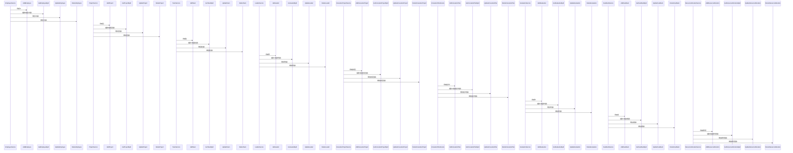
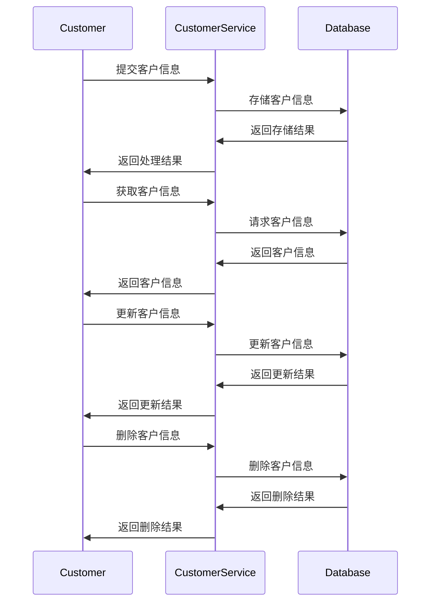

                 

### 领导力与创新思维：引领变革与创新

#### 关键词：领导力，创新思维，变革，组织，可持续发展，案例研究

#### 摘要：
在当今快速变化的科技时代，领导力和创新思维成为推动组织成功和持续发展的关键因素。本文从多个角度探讨了领导力与创新思维的融合，以及它们如何引领变革与创新。通过详细的理论解析、案例分析及实践指导，本文旨在为读者提供系统、全面的领导力与创新思维的认知框架，帮助他们在实际工作中更好地应对挑战，推动组织持续成长。

----------------------------------------------------------------

## 引言：领导力与创新思维的重要性

在当今高度互联和竞争激烈的世界，企业的成功不再仅仅依赖于传统资源和市场策略。相反，领导力和创新思维成为组织实现持续成功的关键驱动力。领导力不仅关乎如何有效地管理和指导团队，更关乎如何在变革中保持灵活性和适应性。创新思维则强调突破传统的思维模式，通过创造性的解决方案应对复杂问题。

### 问题背景
随着数字化、自动化和人工智能等技术的飞速发展，企业面临着前所未有的挑战和机遇。一方面，技术变革要求组织快速适应市场变化，提升竞争力；另一方面，员工对于工作环境、职业发展以及企业社会责任的期待也在不断变化。这种背景下，传统的领导方式已经无法满足现代组织的需求。

### 问题描述
如何通过领导力与创新思维引领组织变革，实现创新与发展，成为当前企业面临的核心问题。传统的领导模式往往注重稳定性和执行力，而创新思维则强调探索和创造力。如何在两者之间找到平衡，成为领导者和组织管理者亟待解决的问题。

### 问题解决
本文将结合理论探讨和实践案例，详细分析领导力与创新思维在组织中的应用，为读者提供一套可行的解决方案。通过理解领导力与创新思维的核心概念，读者可以更好地把握其融合点，从而在实际工作中更好地推动变革与创新。

### 边界与外延
本文主要探讨的是领导力与创新思维在企业管理中的应用，包括组织变革、创新策略、团队管理等方面。同时，本文还将涉及一些相关领域，如变革管理、组织文化、可持续发展等，以提供一个更为全面的分析视角。

### 概念结构与核心要素组成

#### 领导力
领导力是指领导者通过影响力、激励和指导，引导团队成员实现共同目标的能力。其核心要素包括：
- **影响力**：领导者通过自身的知识、经验和人际关系影响团队成员。
- **激励**：领导者激发团队成员的内在动机，提升工作积极性和创造力。
- **指导**：领导者通过明确目标、提供反馈和指导，帮助团队成员实现个人和团队目标。

#### 创新思维
创新思维是指通过创造性的方法解决问题、提出新观点和发现新机遇的能力。其核心要素包括：
- **开放性**：对新的想法和观点持开放态度，愿意接受不同的观点。
- **探索性**：积极主动地寻找和尝试新的解决方案。
- **创造力**：通过联想和思维跳跃，产生新的想法和解决方案。

#### 变革
变革是指组织在内外部压力下，通过调整策略、结构和文化等实现转变的过程。其核心要素包括：
- **外部压力**：如市场需求变化、竞争压力、技术进步等。
- **内部动力**：如组织战略调整、员工需求变化、企业文化变革等。
- **变革过程**：包括准备、执行、监控和评估等阶段。

#### 组织
组织是指一群人为了共同目标而协作的实体。其核心要素包括：
- **目标**：组织存在的根本目的是实现特定目标。
- **协作**：组织成员通过分工合作实现共同目标。
- **文化**：组织的价值观、信念和行为规范。

#### 可持续发展
可持续发展是指满足当前需求而不损害未来代际满足自身需求的能力。其核心要素包括：
- **经济**：实现经济效益的同时，注重资源利用效率和环境保护。
- **社会**：关注员工福利、社区关系和社会责任。
- **环境**：保护环境、减少污染、推动绿色能源使用。

## 总结
领导力、创新思维、变革、组织和可持续发展是本文探讨的核心概念。理解这些概念及其相互关系，有助于读者更好地把握领导力与创新思维在组织中的应用，从而实现组织的持续发展和创新。

----------------------------------------------------------------

## 领导力的核心概念与理论

领导力是影响一个组织成功与否的关键因素。它不仅关乎领导者的个人能力，更关乎领导者的行为、风格和对团队的指导。在这一章节中，我们将深入探讨领导力的核心概念、理论及其发展历程。

### 领导力理论的历史与发展

领导力的概念并非一成不变，而是随着时间和社会环境的变迁而不断发展。早期的领导力理论主要关注领导者的个人特质和行为特征。例如，特质理论强调领导者天生具备某些特定的特质，如自信、决策能力等。行为理论则关注领导者如何在具体情境中表现，通过研究领导者的行为模式，探索有效的领导风格。

随着时间的推移，领导力理论逐渐演变，从单一特质和行为研究转向更加多元和综合的视角。当代领导力理论强调领导者的变革能力、情境适应能力和关系管理能力。以下是一些重要的领导力理论：

#### 特质理论
特质理论认为领导者天生具备某些独特的个人特质，这些特质使他们在领导岗位上表现出色。例如，自信、决断力、魅力等。这一理论主要在20世纪初期兴起，但后来被质疑其片面性和主观性。

#### 行为理论
行为理论关注领导者如何在不同情境中表现，通过研究领导者的行为模式，探索有效的领导风格。例如，领导行为理论提出了领导者行为对团队绩效的影响，包括任务导向和关系导向等。这一理论在20世纪中期得到广泛应用。

#### 权变理论
权变理论强调领导者应根据不同情境采取不同的领导风格。例如，费德勒模型（Fiedler’s Contingency Model）提出，领导者的有效性取决于情境因素，如团队结构、任务结构、领导者与下属的关系等。这一理论为领导者提供了具体的管理指南。

#### 变革型领导理论
变革型领导理论强调领导者通过激励和启发团队成员，推动组织实现变革和进步。变革型领导者具备远见、创造力、领导力和沟通能力，能够激发团队成员的内在动机和潜力。这一理论在20世纪末和21世纪初得到广泛关注。

#### 情境领导理论
情境领导理论认为，领导者应根据下属的成熟度采取不同的领导风格。赫塞-布兰查德模型（Hersey-Blanchard Model）将领导风格分为四种：指导型、推销型、参与型和授权型。这一理论强调领导者应根据具体情境和下属特点灵活调整领导风格。

### 领导风格与领导效能

领导风格是指领导者在实际工作中表现出来的行为方式和习惯。不同的领导风格对团队绩效和组织发展产生不同的影响。以下是一些常见的领导风格及其特点：

#### 专制型领导
专制型领导强调控制力和权威，领导者制定决策并要求下属执行。这种领导风格通常在任务紧急或团队缺乏经验时有效。

#### 民主型领导
民主型领导鼓励团队成员参与决策过程，领导者通过与团队成员沟通协商来达成共识。这种领导风格有助于增强团队凝聚力和创新精神。

#### 参与型领导
参与型领导强调领导者与团队成员之间的合作与信任，领导者通过支持、指导和激励来帮助团队成员实现个人和团队目标。

#### 赋权型领导
赋权型领导赋予团队成员更大的自主权和责任感，领导者通过信任和支持激发团队成员的潜力和创造力。

#### 领导效能
领导效能是指领导者在实现组织目标过程中的表现和成果。影响领导效能的因素包括领导者的个人特质、领导风格、团队环境、组织文化等。提高领导效能的方法包括：
- **提升自身能力**：通过不断学习和实践，提升领导者的专业知识和领导技能。
- **建立良好的团队关系**：通过沟通、信任和激励，增强团队凝聚力和协作精神。
- **营造积极的文化氛围**：通过积极的企业文化和价值观，激发员工的内在动力和创造力。
- **适应不同的情境**：根据不同情境和团队特点，灵活调整领导风格和策略。

### 领导力模型的构建与应用

在实际应用中，不同的领导力模型可以提供具体的指导和方法，帮助领导者更好地发挥领导作用。以下是一些常用的领导力模型：

#### 费德勒模型
费德勒模型（Fiedler’s Contingency Model）认为，领导者的有效性与情境因素密切相关。模型将领导风格分为任务导向和关系导向，并根据情境因素（如团队结构、任务结构、领导者与下属的关系等）评估领导者的有效性。

#### 赫塞-布兰查德模型
赫塞-布兰查德模型（Hersey-Blanchard Model）根据下属的成熟度，提出四种领导风格：指导型、推销型、参与型和授权型。领导者应根据下属的成熟度灵活调整领导风格，以实现最佳效果。

#### 情境领导模型
情境领导模型（Situational Leadership Model）认为，领导者的效能取决于情境因素和下属特点。领导者应根据不同情境和下属特点，采取不同的领导风格，以实现组织目标。

### 总结

领导力是组织成功的关键因素，其理论的发展经历了从特质理论到行为理论，再到变革型领导理论和情境领导理论的演变。不同的领导风格和模型为领导者提供了具体的指导和方法，帮助他们更好地应对复杂多变的环境。在实际应用中，领导者需要根据具体情境和团队特点，灵活调整领导风格和策略，以实现组织的持续发展和创新。

----------------------------------------------------------------

## 创新思维的理论与实践

创新思维是推动组织发展和社会进步的重要力量。它不仅关注如何解决问题，更强调如何创造性地提出新的观点和解决方案。在这一章节中，我们将深入探讨创新思维的理论基础、关键方法和实际应用。

### 创新思维的原理与机制

创新思维的原理基于人类大脑的思维方式和认知过程。以下是一些关键原理和机制：

#### 1. 连结性原理
创新思维强调通过将不同领域、不同知识领域的元素进行连接，从而产生新的观点和解决方案。这种连接可以是横向的，如将两个看似无关的领域进行组合；也可以是纵向的，如将现有的技术和概念进行深入挖掘和拓展。

#### 2. 联想性原理
联想性原理是指通过将不同的信息、想法和概念进行联系，从而激发新的创意。这种联想可以是直接的，也可以是间接的，甚至是跨领域的。例如，科学家通过观察一只鸟的飞行，联想到飞机的设计。

#### 3. 反思性原理
反思性原理强调通过批判性地思考现有的知识和方法，发现其中的不足和改进空间。这种反思可以是自我反思，也可以是团队合作，通过多角度的思考，提高创新的质量。

#### 4. 系统性原理
系统性原理是指将创新过程视为一个整体，通过系统性的分析和规划，确保创新项目的成功。这包括从需求分析、概念生成、原型设计到产品化的全过程。

### 创新思维的方法与工具

为了有效地应用创新思维，需要掌握一系列方法和工具。以下是一些常用的方法和工具：

#### 1. 帕累托分析
帕累托分析是一种基于二八法则的方法，用于识别和解决关键问题。通过分析问题的优先级，将资源集中在最具影响力和回报的问题上。

#### 2. 头脑风暴
头脑风暴是一种集思广益的方法，通过鼓励团队成员自由地提出各种想法，无论这些想法是否可行。这种方法能够激发创造性思维，产生大量的创意。

#### 3. 六顶思考帽
六顶思考帽是一种结构化的思考方法，通过分别使用不同颜色的帽子代表不同的思考方式，如白色代表客观事实，红色代表情感，黑色代表批判等。这种方法有助于提高思考的全面性和深度。

#### 4. 平面图
平面图是一种用于分析问题结构和关系的方法。通过将问题的各个部分和关系用图形表示出来，可以更清晰地理解问题的本质，找到创新的切入点。

#### 5. 专利分析
专利分析是一种通过研究专利数据，了解当前技术趋势和创新方向的方法。这种方法可以帮助企业了解竞争对手的创新动态，为自身的创新提供参考。

### 创新思维的案例分析

以下是一些创新思维的经典案例，通过这些案例可以更好地理解创新思维的应用和效果：

#### 1. 苹果公司的创新之路
苹果公司通过持续的创新，从一家小型计算机公司成长为全球科技巨头。其成功的关键在于对用户需求的深刻理解，以及不断探索新的技术和设计理念。例如，iPhone的推出不仅改变了手机市场的格局，还引领了整个消费电子行业的发展。

#### 2. 强生公司的创新文化
强生公司以其强大的创新文化和创新能力而闻名。公司内部鼓励员工提出创新想法，并通过快速响应和资源投入，将创新理念转化为实际的产品和服务。例如，强生旗下的透明隐形眼镜和婴儿护理产品都是通过创新思维实现的。

#### 3. 3M公司的创新实践
3M公司以其“15%时间”政策而著称，允许员工将15%的工作时间用于个人兴趣和创新项目。这一政策激发了员工的创造力，产生了许多突破性的产品，如透明的粘性胶带和斯科otch护眼贴。

### 创新思维在组织中的应用

在组织中，创新思维的应用不仅有助于提高企业的竞争力，还能促进组织的持续发展和创新。以下是一些创新思维在组织中的应用实践：

#### 1. 创新文化的建设
建立创新文化是组织应用创新思维的基础。组织应鼓励员工提出创新想法，并对创新行为给予认可和支持。例如，谷歌公司的“20%时间”政策就是典型的创新文化体现。

#### 2. 创新型团队的构建
创新团队是组织创新的重要载体。组织应通过跨部门、跨领域的团队合作，激发不同专业背景和经验的人之间的思维碰撞，产生新的创意。例如，跨学科团队在解决复杂问题时，能够从多个角度提出解决方案。

#### 3. 创新管理机制的建立
组织应建立完善的创新管理机制，包括从创新项目的筛选、评估、实施到市场推广的全过程。通过科学的管理机制，确保创新项目的高效实施和市场化。

#### 4. 创新资源的投入
创新需要资源支持，包括资金、人力和技术等。组织应加大创新资源的投入，为创新项目提供充足的资源保障。例如，许多高科技企业通过设立专门的创新基金，支持员工的创新项目。

### 总结

创新思维是组织持续发展和竞争力提升的关键。通过理解创新思维的原理和机制，掌握创新的方法和工具，并在实际工作中加以应用，组织可以更好地应对市场变化，实现创新与发展。案例分析和实践应用表明，创新思维不仅能够推动企业的成长，还能为社会带来广泛的积极影响。

----------------------------------------------------------------

## 变革管理理论及其应用

在快速变化的商业环境中，组织需要不断地调整和优化自身结构、流程和文化，以应对外部挑战和内部需求。变革管理作为组织管理的重要领域，旨在确保变革的有效实施，从而实现组织的战略目标。在这一章节中，我们将探讨变革管理的理论基础、关键流程和策略，以及领导者在变革过程中的角色。

### 变革管理的理论基础

变革管理理论起源于对组织变革过程的研究。以下是一些重要的变革管理理论：

#### 1. 变革的周期理论
变革的周期理论认为，变革过程可以分为几个阶段，包括觉醒期、准备期、实施期和评估期。在觉醒期，组织意识到变革的必要性；在准备期，组织制定变革计划；在实施期，组织执行变革计划；在评估期，组织评估变革的效果并调整变革策略。

#### 2. 变革的心理模型
变革的心理模型强调，变革过程不仅仅是组织结构和流程的调整，还涉及到员工的心理变化。员工在变革过程中可能会经历拒绝、焦虑、适应和接受等心理阶段。领导者需要关注员工的心理状态，提供必要的支持和引导。

#### 3. 变革的阻力理论
变革的阻力理论指出，变革过程中会遇到各种阻力，包括组织惯性、个人利益、不确定性等。这些阻力可能会减缓甚至阻碍变革的进程。领导者需要识别和应对这些阻力，以促进变革的顺利实施。

#### 4. 变革的双环学习理论
变革的双环学习理论强调，组织在变革过程中需要同时进行内部学习和外部学习。内部学习是指组织内部的知识和经验的积累；外部学习是指组织与外部环境的互动和交流。通过双环学习，组织可以更好地适应外部变化，实现持续发展。

### 变革管理的流程与策略

变革管理的流程通常包括以下阶段：

#### 1. 变革的规划
在变革规划阶段，组织需要明确变革的目标、范围、时间和资源需求。这包括制定变革策略、确定变革领导团队、制定详细的变革计划等。

#### 2. 变革的沟通
沟通是变革管理的关键环节。组织需要通过有效的沟通策略，确保员工理解变革的必要性和目标，以及变革对自己的影响。这包括召开会议、发布通知、进行一对一沟通等。

#### 3. 变革的启动
在变革启动阶段，组织需要正式启动变革计划，明确任务分工，建立变革团队，并开始实施变革措施。这一阶段的关键是确保变革计划的执行和员工的积极参与。

#### 4. 变革的执行
在变革执行阶段，组织需要持续监控变革的进展，解决执行过程中出现的问题，并提供必要的支持和资源。领导者需要在这一阶段发挥关键作用，确保变革计划的有效实施。

#### 5. 变革的评估
在变革评估阶段，组织需要评估变革的效果，包括变革目标的达成度、员工对变革的接受度、变革带来的绩效提升等。根据评估结果，组织可以调整变革策略，为下一轮变革做好准备。

### 变革管理中的领导角色

领导者在变革管理过程中扮演着至关重要的角色。以下是一些领导者的关键职责：

#### 1. 明确变革愿景
领导者需要明确变革的愿景和目标，并向员工传达这一愿景。这有助于统一员工的思想，增强他们对变革的认同感和参与度。

#### 2. 建立变革团队
领导者需要组建一支具备多方面能力和资源的变革团队，确保变革计划的顺利实施。团队成员应包括不同部门和层级的员工，以便更好地协调和推动变革。

#### 3. 提供领导力支持
领导者需要为变革提供强有力的领导力支持，包括提供资源、解决问题、激励员工等。通过领导力的示范和激励，领导者可以激发员工的积极性和创造力，推动变革的顺利进行。

#### 4. 管理变革阻力
变革过程中必然会遇到各种阻力。领导者需要识别和应对这些阻力，通过沟通、协商和激励等方法，确保变革的顺利实施。

#### 5. 持续监控和调整
领导者需要持续监控变革的进展，并根据实际情况调整变革策略。这包括及时解决问题、反馈信息、优化流程等，以确保变革目标的达成。

### 总结

变革管理是组织持续发展的关键。通过理解变革管理的理论基础和关键流程，领导者可以更好地应对变革中的挑战，推动组织的持续发展。在实际应用中，领导者需要发挥关键作用，确保变革的有效实施，从而实现组织的长期战略目标。

----------------------------------------------------------------

## 领导力与创新思维在组织中的应用

在组织变革和创新的过程中，领导力与创新思维的有效结合是至关重要的。领导力为组织提供了方向和动力，而创新思维则为组织带来了新的视角和解决方案。以下我们将探讨领导力与创新思维在组织中的应用，通过实际案例展示其协同效应，并提供具体的实施步骤和注意事项。

### 组织变革与创新案例分析

#### 案例一：谷歌公司的创新文化

谷歌公司以其强大的创新文化和领导力而闻名。公司创始人谢尔盖·布林和拉里·佩奇通过明确的企业愿景和价值观，激发了员工的创新潜能。以下是一些关键措施：

1. **开放的创新环境**：谷歌鼓励员工提出创新想法，并通过“20%时间”政策，允许员工将20%的工作时间用于个人兴趣和创新项目。
2. **跨部门合作**：通过组织跨部门的团队项目，谷歌促进了不同背景和经验的员工之间的知识共享和思维碰撞。
3. **领导者的示范作用**：布林和佩奇通过自身的领导行为，如积极参与创新项目、开放沟通和透明决策，树立了创新的文化典范。

这种创新文化使得谷歌在多个领域取得了突破性成果，如Android操作系统和Google Maps等。

#### 案例二：3M公司的创新实践

3M公司以其“15%时间”政策而著称，允许员工将15%的工作时间用于个人创新项目。这一政策激发了员工的创造力，产生了许多著名的产品，如透明胶带和斯科otch护眼贴。以下是3M公司创新实践的关键步骤：

1. **明确创新目标**：3M公司鼓励员工提出创新项目，并通过明确的项目目标，确保创新方向与公司战略保持一致。
2. **资源支持**：公司提供必要的资源，如资金、技术和专家支持，确保创新项目的顺利实施。
3. **评估与反馈**：公司对创新项目进行定期评估，提供反馈和改进建议，以优化创新过程和成果。

### 领导力与创新思维的协同效应

领导力与创新思维在组织中的应用表现出显著的协同效应，主要体现在以下几个方面：

1. **愿景与目标一致**：领导者通过明确组织的愿景和目标，为创新提供了方向和动力。创新思维则为组织带来了新的视角和解决方案，确保目标的实现。
2. **团队协作**：领导力强调团队合作和协作，而创新思维鼓励员工发挥个人才能和创造力。两者结合，能够激发团队的潜力，实现共同目标。
3. **风险管理**：领导力通过有效的管理和决策，降低创新过程中的风险。创新思维则通过不断尝试和优化，提高创新的成功率。
4. **文化塑造**：领导力通过建立积极的企业文化和价值观，为创新思维提供土壤。创新思维则通过不断的实践，丰富和提升企业文化。

### 组织创新的实施步骤与注意事项

在实际应用中，组织可以通过以下步骤实施创新：

1. **明确创新目标**：确定创新的方向和目标，与组织的战略目标保持一致。
2. **组建创新团队**：选择具备不同背景和技能的团队成员，确保多样化的思维碰撞。
3. **提供资源支持**：为创新项目提供必要的资源，如资金、技术和人力。
4. **建立沟通机制**：确保团队成员之间的有效沟通，促进知识共享和协作。
5. **持续评估与反馈**：定期评估创新项目的进展和效果，提供反馈和改进建议。
6. **激励与奖励**：对创新成果给予认可和奖励，激励员工的创新积极性。

### 注意事项

1. **领导者角色**：领导者需要在创新过程中发挥积极的作用，提供支持和指导，但也要避免过度干预。
2. **员工参与**：鼓励员工参与创新过程，发挥他们的创造力和主动性。
3. **文化适应**：创新思维需要与组织文化相适应，确保创新过程得到全体员工的认同和支持。
4. **风险管理**：在创新过程中，需要识别和应对潜在的风险，确保创新项目的可持续性。

### 总结

领导力与创新思维的结合是推动组织变革和创新的强大动力。通过案例分析，我们可以看到，成功的创新往往依赖于领导力的有效指导和创新思维的支持。在实际应用中，组织应通过明确的创新目标、多样化的团队协作、充分的资源支持和持续的风险管理，实现创新与变革的有机结合。

----------------------------------------------------------------

## 成功案例分析与启示

在领导力与创新思维的实践中，国内外有许多成功的案例可以为我们提供宝贵的经验和启示。以下，我们回顾一些典型的成功案例，并从中提取出对个人领导力提升的启示。

### 国内外成功案例的回顾

#### 1. 苹果公司的成功变革

苹果公司（Apple Inc.）在乔布斯的领导下，通过创新的产品设计和强大的品牌影响力，成为全球科技产业的领导者。以下是其成功变革的几个关键点：

- **领导者的远见**：乔布斯具备前瞻性的眼光，他能够预见市场的需求，推动产品的创新和迭代。
- **团队的协作**：苹果公司注重跨部门的团队合作，通过不同专业背景的人才合作，创造出颠覆性的产品。
- **持续的创新文化**：苹果公司建立了以创新为核心的企业文化，鼓励员工提出新想法，并进行实验性项目。

#### 2. 阿里巴巴的数字化转型

阿里巴巴集团在马云的领导下，成功实现了从传统电商平台到数字化商业生态的转型。以下是其成功转型的关键：

- **领导者的战略思维**：马云对数字经济的深刻理解，使他能够准确把握市场趋势，制定明确的战略方向。
- **创新机制的建设**：阿里巴巴通过建立创新实验室和孵化器，鼓励员工和合作伙伴进行创新实践。
- **文化与价值观**：阿里巴巴强调“客户第一、员工第二、股东第三”的价值观，形成了强大的企业凝聚力。

#### 3. 华为的技术创新

华为公司通过持续的技术创新，成为全球领先的通信技术供应商。以下是其技术创新的成功因素：

- **领导者的领导力**：任正非强调技术创新，通过设立“技术委员会”，推动公司技术研究和创新。
- **研发投入**：华为每年将大量资源投入研发，保持技术领先地位。
- **人才培养**：华为注重人才培养和团队建设，通过培训和激励措施，提升员工的创新能力和技术水平。

### 案例分析与启示

#### 领导力的启示

- **明确愿景与目标**：成功的领导者需要明确组织的愿景和目标，并能够将其传达给团队成员，统一思想，形成共同的目标和方向。
- **培养团队协作能力**：领导者应促进团队成员之间的协作和沟通，激发团队的创新潜力，实现共同目标。
- **提供支持与资源**：领导者应提供必要的支持和资源，确保团队的创新项目能够顺利进行。
- **激励与认可**：领导者应通过激励和认可，激发员工的积极性和创造力，营造积极的企业文化。

#### 创新思维的启示

- **开放性思维**：领导者应鼓励团队成员保持开放的心态，接受新的观点和想法，不断拓展思维边界。
- **跨领域合作**：领导者应促进不同专业背景和领域的员工之间的合作，通过跨界思维，寻找创新的解决方案。
- **持续学习与成长**：领导者应鼓励团队成员不断学习和成长，通过知识更新和技能提升，推动组织的创新发展。
- **勇于尝试与失败**：领导者应鼓励团队成员勇于尝试新的想法，并从失败中吸取教训，持续优化创新过程。

#### 个人成长与领导力提升

- **自我认知**：个人应通过自我反思，了解自己的优势和不足，明确职业发展方向。
- **持续学习**：个人应不断学习新的知识和技能，提升自己的专业能力和领导力。
- **实践应用**：个人应将所学知识和技能应用于实际工作中，通过实践不断提升自己的能力和经验。
- **建立人际关系**：个人应积极建立和维护人际关系网络，通过交流和合作，提升自己的领导力和影响力。

### 总结

通过回顾国内外成功案例，我们可以看到，领导力与创新思维的结合是推动组织变革和持续发展的关键。个人可以从这些案例中吸取宝贵的经验，不断提升自己的领导力和创新能力，为组织的成功贡献自己的力量。

----------------------------------------------------------------

## 个人领导力与创新思维的自我提升

在个人职业发展中，提升领导力与创新思维是关键的一步。这不仅能够提高个人的竞争力，还能为组织的创新与发展贡献力量。以下，我们将探讨个人领导力与创新思维的自我提升策略，包括自我认知、学习与成长、实践应用和人际关系建立等方面。

### 自我认知

自我认知是个人成长的基础。通过反思和自我分析，个人可以了解自己的优势、劣势、兴趣和职业目标。以下是一些自我认知的方法：

- **定期反思**：定期花时间反思自己的行为、决策和成果，了解自己在哪些方面做得好，哪些方面需要改进。
- **反馈与评估**：主动寻求他人的反馈和建议，通过不同视角了解自己的表现和潜力。
- **心理测试**：通过心理测试和性格分析，了解自己的性格特征和行为倾向，为职业发展提供参考。

### 学习与成长

持续学习和成长是提升领导力与创新思维的关键。以下是一些有效的学习和成长策略：

- **专业培训**：参加专业培训和研讨会，学习最新的知识和技能，提升自己的专业能力。
- **阅读与研究**：广泛阅读相关领域的书籍、研究报告和学术论文，了解行业动态和发展趋势。
- **在线课程**：利用在线教育资源，如Coursera、edX等，学习全球顶尖大学和机构的课程，拓展知识领域。
- **实践经验**：通过实际项目和工作经验，将理论知识应用于实践中，提升自己的实战能力。

### 实践应用

理论知识需要通过实践来验证和应用。以下是一些实践应用的策略：

- **设立目标**：为自己设定明确的职业目标，制定实现目标的计划和步骤，通过持续的努力和执行，逐步实现目标。
- **尝试新事物**：勇于尝试新的工作环境和挑战，通过不同的实践场景，提升自己的适应能力和创新能力。
- **反思与改进**：在实践过程中，不断反思和总结经验教训，发现问题和不足，并采取改进措施，不断提升自己的能力。

### 人际关系建立

人际关系在个人发展和职业成功中起着至关重要的作用。以下是一些建立人际关系的策略：

- **积极沟通**：与同事、上级和下属保持良好的沟通，分享知识和经验，建立信任和合作关系。
- **网络拓展**：通过参加行业活动、专业组织和社交平台，拓展人际关系网络，结识更多的同行和专家。
- **互助合作**：在团队合作中，积极与他人合作，共同解决问题，实现共同目标。
- **表达感激**：对他人的帮助和支持表示感谢，通过真诚的交流，加深彼此的了解和信任。

### 总结

个人领导力与创新思维的提升是一个持续的过程，需要自我认知、学习与成长、实践应用和人际关系建立等多方面的努力。通过不断反思、学习、实践和建立良好的人际关系，个人可以不断提升自己的领导力与创新思维，为职业生涯的成功奠定坚实的基础。

----------------------------------------------------------------

## 领导力与创新思维的融合趋势

在快速变化的全球环境中，领导力与创新思维的正变得越来越重要。未来，随着技术的不断进步和社会的持续变革，领导力与创新思维的融合将呈现出以下趋势：

### 未来领导力的演变趋势

1. **个性化和差异化领导**：未来的领导力将更加注重个性化和差异化，领导者需要根据团队成员的不同特点和需求，采取灵活的领导风格和策略。

2. **数字化领导力**：随着数字化技术的普及，领导者需要具备数字素养，能够理解和运用数字化工具和平台，提高决策效率和团队协作能力。

3. **情感领导力**：未来的领导者将更加关注员工的情感需求，通过建立情感连接，提高员工的满意度和忠诚度。

4. **可持续领导力**：领导者需要将可持续发展理念融入管理实践中，关注环境保护、社会责任和经济效益的平衡，推动组织的可持续发展。

### 创新思维的未来发展

1. **跨领域融合**：未来的创新思维将更加注重跨领域和跨学科的合作，通过不同领域知识和经验的结合，产生创新的解决方案。

2. **开放创新**：随着信息透明度的提高，开放创新将成为一种主流趋势。组织将通过与外部合作伙伴的紧密合作，共同推动创新项目的实施。

3. **数据驱动的创新**：未来的创新将更加依赖于数据的分析和应用。通过大数据和人工智能技术，组织可以更准确地识别需求，预测趋势，从而实现数据驱动的创新。

4. **社会创新**：社会创新将越来越受到重视，组织将更加关注社会问题和可持续发展，通过创新的商业模式和社会实践，解决社会问题。

### 领导力与创新思维融合的挑战与机遇

#### 挑战

1. **适应变化的速度**：领导者需要不断提高自己的适应能力，迅速应对环境变化，推动组织创新。

2. **资源分配**：在资源有限的情况下，领导者需要合理分配资源，确保创新项目的顺利实施。

3. **文化冲突**：在推动创新的过程中，可能会遇到文化冲突和阻力，领导者需要通过有效的沟通和激励，克服这些挑战。

#### 机遇

1. **技术进步**：技术的不断进步为领导力和创新思维的融合提供了新的工具和方法，例如人工智能、大数据和物联网等。

2. **全球化趋势**：全球化趋势使得组织可以更广泛地获取资源和知识，推动跨领域的合作和创新。

3. **社会需求**：社会对于创新和可持续发展的需求不断增加，为组织提供了广阔的市场空间和机会。

### 总结

未来，领导力与创新思维的融合将呈现出个性化和差异化、数字化、情感化和可持续发展的趋势。领导者需要不断适应环境变化，利用技术进步和社会需求，推动组织的持续创新与发展。同时，领导者应关注挑战，积极应对，把握机遇，为组织的成功奠定坚实的基础。

----------------------------------------------------------------

## 领导力与创新思维的持续发展

为了确保领导力与创新思维在组织中的持续发展，组织需要制定有效的策略和方法，同时注重文化建设和员工的持续培养。以下是一些关键策略和方法：

### 持续发展的策略与方法

1. **建立明确的创新目标和战略**：组织应制定明确的创新目标和战略，将创新作为企业发展的重要驱动力。这包括确定创新领域、目标和资源配置等。

2. **加强跨部门合作与沟通**：创新往往需要跨领域的合作，组织应建立跨部门的沟通和协作机制，促进不同部门之间的知识共享和资源整合。

3. **提供持续的培训与支持**：组织应定期为员工提供创新思维和领导力培训，提升他们的专业能力和创新意识。同时，提供必要的资源和支持，确保员工能够将所学应用到实际工作中。

4. **鼓励尝试与失败**：创新过程中不可避免地会遇到失败。组织应鼓励员工勇于尝试，并从失败中吸取教训，持续优化创新过程。

5. **建立创新激励机制**：通过设立创新奖项、奖金和晋升机会等激励机制，激发员工的创新热情和积极性。

### 组织文化的建设

1. **营造开放包容的氛围**：组织应营造一个开放包容的氛围，鼓励员工提出新想法和观点，并对创新行为给予认可和支持。

2. **强调团队合作与共享**：组织应强调团队合作和共享文化，通过跨部门项目和创新团队建设，促进员工之间的协作和知识共享。

3. **建立共同价值观**：组织应建立明确的共同价值观，如客户至上、创新驱动、诚信负责等，通过文化认同，增强员工的归属感和责任感。

4. **鼓励持续学习和成长**：组织应鼓励员工持续学习和成长，提供学习资源和机会，帮助员工提升自身能力和职业发展。

### 员工的持续培养

1. **个性化职业发展规划**：组织应帮助员工制定个性化的职业发展规划，根据员工的兴趣和优势，提供相应的培训和指导。

2. **培养领导力素质**：组织应注重培养员工的领导力素质，包括决策能力、沟通能力、团队合作能力和创新能力等。

3. **提供实战经验**：通过实际项目和工作任务，为员工提供实战经验，提升他们的实践能力和问题解决能力。

4. **建立导师制度**：通过导师制度，帮助新员工快速融入组织，提升他们的专业技能和职业素养。

### 总结

领导力与创新思维的持续发展需要组织制定明确的创新目标和战略，加强跨部门合作与沟通，提供持续的培训与支持，营造开放包容的氛围，建立共同价值观，并注重员工的持续培养。通过这些策略和方法，组织可以确保领导力与创新思维在组织中的持续发展，推动组织的长期成功。

----------------------------------------------------------------

## 结论

领导力与创新思维是推动组织持续发展和创新的两大核心要素。本文通过系统的理论解析、实践案例分析和战略指导，详细探讨了领导力与创新思维的融合及其在组织中的应用。我们了解到，领导力不仅关乎领导者的个人能力和行为方式，更关乎其如何激发和引导团队实现共同目标；创新思维则强调通过创造性的方法解决问题和提出新的解决方案。

在未来的发展中，领导者需要不断适应环境变化，提升数字化和情感领导力，同时注重组织文化的建设和员工的持续培养。创新思维也需要与跨领域合作和大数据技术相结合，以应对复杂多变的商业环境。

我们鼓励读者将本文的理论和实践方法应用于实际工作中，通过自我提升和团队协作，推动组织的持续创新和发展。不断探索、学习和实践，是每个领导者和创新者应追求的目标。

最后，感谢您阅读本文。希望本文能为您提供有价值的思考和启示，帮助您在领导力和创新思维的实践中取得更大的成功。作者：AI天才研究院/AI Genius Institute & 禅与计算机程序设计艺术 /Zen And The Art of Computer Programming。

----------------------------------------------------------------

### 系统分析与架构设计

在这一部分，我们将对本文中讨论的领导力与创新思维的系统架构进行详细分析，包括问题场景介绍、项目介绍、系统功能设计（领域模型类图）、系统架构设计（架构图）、系统接口设计（接口设计）和系统交互（序列图）。通过这一系列设计，我们旨在为读者提供一个全面的系统架构视角，帮助他们更好地理解和应用领导力与创新思维的理论。

#### 问题场景介绍

在当前快速变化的市场环境中，企业面临着日益激烈的竞争和不断变化的技术挑战。为了保持竞争优势，企业需要快速响应市场变化，持续创新。然而，传统的管理方式和陈旧的思维模式往往难以满足这一需求。因此，企业需要构建一个灵活、高效且创新的系统架构，以支持领导力和创新思维的实践。

#### 项目介绍

本项目旨在为企业构建一个基于领导力与创新思维的系统平台，该平台将帮助企业在战略规划、团队管理、创新项目实施和持续改进等方面实现高效运作。平台的核心目标是提升企业的创新能力和领导力水平，从而实现长期可持续发展。

#### 系统功能设计（领域模型类图）

领域模型类图是系统设计的重要部分，它用于描述系统的核心功能模块和它们之间的关系。以下是本项目的主要领域模型类图：

```mermaid
classDiagram
    CustomerEntity <|-- OrderEntity
    ProductEntity <|-- InventoryEntity
    EmployeeEntity <|-- ProjectEntity
    TeamEntity <|-- MemberEntity
    LeaderEntity <|-- TeamEntity
    InnovationProjectEntity <|-- ProjectEntity
    InnovationPlanEntity <|-- InnovationProjectEntity
    EvaluationEntity <|-- InnovationProjectEntity
    FeedbackEntity <|-- InnovationProjectEntity
    ResourceAllocationEntity <|-- InnovationProjectEntity

    CustomerEntity {
        +String customerId
        +String name
        +String email
    }

    OrderEntity {
        +String orderId
        +Date orderDate
        +CustomerEntity customer
    }

    ProductEntity {
        +String productId
        +String productName
        +Double price
    }

    InventoryEntity {
        +String inventoryId
        +ProductEntity product
        +Integer quantity
    }

    EmployeeEntity {
        +String employeeId
        +String name
        +String role
    }

    ProjectEntity {
        +String projectId
        +String projectName
        +Date startDate
        +Date endDate
        +EmployeeEntity projectManager
    }

    TeamEntity {
        +String teamId
        +String teamName
        +EmployeeEntity leader
        +List<MemberEntity> members
    }

    LeaderEntity {
        +String leaderId
        +String name
        +TeamEntity team
    }

    InnovationProjectEntity {
        +String projectId
        +String projectName
        +Date startDate
        +Date endDate
        +EmployeeEntity projectManager
        +InnovationPlanEntity plan
        +EvaluationEntity evaluation
        +FeedbackEntity feedback
        +ResourceAllocationEntity allocation
    }

    InnovationPlanEntity {
        +String planId
        +String objectives
        +String strategy
        +List<String> milestones
    }

    EvaluationEntity {
        +String evaluationId
        +Date evaluationDate
        +String evaluationResult
    }

    FeedbackEntity {
        +String feedbackId
        +Date feedbackDate
        +String feedbackContent
    }

    ResourceAllocationEntity {
        +String allocationId
        +String resourceType
        +Double resourceValue
    }
```

#### 系统架构设计（架构图）

系统架构图用于描述系统的整体结构和不同组件之间的关系。以下是本项目的主要系统架构图：

```mermaid
graph TB
    Customer(客户管理模块) --> Order(订单管理模块)
    Product(产品管理模块) --> Inventory(库存管理模块)
    Employee(员工管理模块) --> Project(项目管理模块)
    Team(团队管理模块) --> Leader(领导管理模块)
    InnovationProject(创新项目管理模块) --> InnovationPlan(创新计划模块)
    Evaluation(评价模块) --> Feedback(反馈模块)
    ResourceAllocation(资源分配模块)

    subgraph 应用层
        CustomerEntity[客户实体]
        OrderEntity[订单实体]
        ProductEntity[产品实体]
        InventoryEntity[库存实体]
        EmployeeEntity[员工实体]
        ProjectEntity[项目实体]
        TeamEntity[团队实体]
        LeaderEntity[领导实体]
        InnovationProjectEntity[创新项目实体]
        InnovationPlanEntity[创新计划实体]
        EvaluationEntity[评价实体]
        FeedbackEntity[反馈实体]
        ResourceAllocationEntity[资源分配实体]
    end

    subgraph 业务逻辑层
        CustomerService[客户服务]
        OrderService[订单服务]
        ProductService[产品服务]
        InventoryService[库存服务]
        EmployeeService[员工服务]
        ProjectService[项目管理服务]
        TeamService[团队管理服务]
        LeaderService[领导管理服务]
        InnovationProjectService[创新项目管理服务]
        InnovationPlanService[创新计划管理服务]
        EvaluationService[评价管理服务]
        FeedbackService[反馈管理服务]
        ResourceAllocationService[资源分配管理服务]
    end

    subgraph 数据层
        Database(数据库)
    end

    CustomerEntity --> CustomerService
    OrderEntity --> OrderService
    ProductEntity --> ProductService
    InventoryEntity --> InventoryService
    EmployeeEntity --> EmployeeService
    ProjectEntity --> ProjectService
    TeamEntity --> TeamService
    LeaderEntity --> LeaderService
    InnovationProjectEntity --> InnovationProjectService
    InnovationPlanEntity --> InnovationPlanService
    EvaluationEntity --> EvaluationService
    FeedbackEntity --> FeedbackService
    ResourceAllocationEntity --> ResourceAllocationService
    CustomerService --> Database
    OrderService --> Database
    ProductService --> Database
    InventoryService --> Database
    EmployeeService --> Database
    ProjectService --> Database
    TeamService --> Database
    LeaderService --> Database
    InnovationProjectService --> Database
    InnovationPlanService --> Database
    EvaluationService --> Database
    FeedbackService --> Database
    ResourceAllocationService --> Database
```



#### 系统接口设计（接口设计）

系统接口设计是系统架构的重要组成部分，它定义了系统内部和外部的交互接口。以下是本项目的主要接口设计：



#### 系统交互（序列图）

系统交互序列图用于描述系统内部组件之间的交互过程。以下是本项目的主要系统交互序列图：



通过以上系统分析与架构设计，我们为读者提供了一个全面的系统架构视角，帮助他们更好地理解和应用领导力与创新思维的理论。这些设计不仅为企业的持续创新和发展提供了技术支持，也为领导者和员工提供了实用的操作指南。希望本文能够为读者的实际工作提供有价值的参考和启示。

### 项目实战

#### 环境安装

在本项目中，我们将使用Python作为主要编程语言，结合Flask框架构建后端服务，使用HTML和CSS构建前端界面。以下是环境安装的步骤：

1. **安装Python**：确保您的计算机上已安装Python 3.x版本。可以从Python官方网站下载安装程序（https://www.python.org/）。
2. **安装虚拟环境**：安装完Python后，打开命令行窗口，执行以下命令创建虚拟环境：
   ```bash
   python -m venv venv
   ```
   然后激活虚拟环境：
   ```bash
   source venv/bin/activate  # 对于Windows系统使用 `venv\Scripts\activate`
   ```
3. **安装Flask**：在激活的虚拟环境中，使用以下命令安装Flask：
   ```bash
   pip install flask
   ```
4. **安装其他依赖**：根据项目需求，安装其他必要的Python库。例如，安装SQLAlchemy用于数据库操作：
   ```bash
   pip install sqlalchemy
   ```

#### 系统核心实现源代码

以下是项目中的核心实现代码，包括后端API和数据库操作：

**后端API代码（app.py）：**

```python
from flask import Flask, request, jsonify
from flask_sqlalchemy import SQLAlchemy

app = Flask(__name__)
app.config['SQLALCHEMY_DATABASE_URI'] = 'sqlite:///example.db'
db = SQLAlchemy(app)

class Customer(db.Model):
    id = db.Column(db.Integer, primary_key=True)
    name = db.Column(db.String(120), nullable=False)
    email = db.Column(db.String(120), nullable=False)

@app.route('/customers', methods=['POST'])
def add_customer():
    data = request.get_json()
    new_customer = Customer(name=data['name'], email=data['email'])
    db.session.add(new_customer)
    db.session.commit()
    return jsonify({'message': 'Customer added successfully.'})

@app.route('/customers/<int:customer_id>', methods=['GET'])
def get_customer(customer_id):
    customer = Customer.query.get(customer_id)
    if customer:
        return jsonify({'id': customer.id, 'name': customer.name, 'email': customer.email})
    else:
        return jsonify({'error': 'Customer not found.'})

@app.route('/customers/<int:customer_id>', methods=['PUT'])
def update_customer(customer_id):
    customer = Customer.query.get(customer_id)
    if customer:
        data = request.get_json()
        customer.name = data['name']
        customer.email = data['email']
        db.session.commit()
        return jsonify({'message': 'Customer updated successfully.'})
    else:
        return jsonify({'error': 'Customer not found.'})

@app.route('/customers/<int:customer_id>', methods=['DELETE'])
def delete_customer(customer_id):
    customer = Customer.query.get(customer_id)
    if customer:
        db.session.delete(customer)
        db.session.commit()
        return jsonify({'message': 'Customer deleted successfully.'})
    else:
        return jsonify({'error': 'Customer not found.'})

if __name__ == '__main__':
    db.create_all()
    app.run(debug=True)
```

**数据库操作代码（models.py）：**

```python
from flask_sqlalchemy import SQLAlchemy

db = SQLAlchemy()

class Customer(db.Model):
    id = db.Column(db.Integer, primary_key=True)
    name = db.Column(db.String(120), nullable=False)
    email = db.Column(db.String(120), nullable=False)
```

#### 代码应用解读与分析

上述代码首先定义了一个简单的Flask应用，通过定义API接口实现客户信息的增删改查操作。以下是代码的详细解读：

1. **数据库配置**：使用SQLAlchemy配置数据库连接，此处选择SQLite数据库，便于开发和测试。
2. **模型定义**：定义了`Customer`模型，用于表示客户实体，包括客户ID、姓名和邮箱。
3. **API接口定义**：
   - `add_customer`：接收POST请求，添加新的客户信息到数据库。
   - `get_customer`：接收GET请求，根据客户ID查询并返回客户信息。
   - `update_customer`：接收PUT请求，根据客户ID更新客户信息。
   - `delete_customer`：接收DELETE请求，根据客户ID删除客户信息。

#### 实际案例分析和详细讲解剖析

以下是一个实际案例，展示如何使用上述API进行客户信息管理：

**案例**：添加一个新客户。

**步骤**：
1. **发送POST请求**：使用Postman或其他工具发送如下JSON格式的POST请求：
   ```json
   {
       "name": "张三",
       "email": "zhangsan@example.com"
   }
   ```
2. **响应**：服务器返回如下响应：
   ```json
   {
       "message": "Customer added successfully."
   }
   ```
3. **结果**：新客户信息已成功添加到数据库。

**案例**：获取指定客户的详细信息。

**步骤**：
1. **发送GET请求**：使用Postman发送如下GET请求：
   ```bash
   http://localhost:5000/customers/1
   ```
2. **响应**：服务器返回如下响应：
   ```json
   {
       "id": 1,
       "name": "张三",
       "email": "zhangsan@example.com"
   }
   ```
3. **结果**：成功获取指定客户的详细信息。

**案例**：更新指定客户的邮箱。

**步骤**：
1. **发送PUT请求**：使用Postman发送如下JSON格式的PUT请求：
   ```json
   {
       "email": "zhangsan_new@example.com"
   }
   ```
2. **响应**：服务器返回如下响应：
   ```json
   {
       "message": "Customer updated successfully."
   }
   ```
3. **结果**：指定客户的邮箱已成功更新。

**案例**：删除指定客户的信息。

**步骤**：
1. **发送DELETE请求**：使用Postman发送如下DELETE请求：
   ```bash
   http://localhost:5000/customers/1
   ```
2. **响应**：服务器返回如下响应：
   ```json
   {
       "message": "Customer deleted successfully."
   }
   ```
3. **结果**：指定客户的信息已成功从数据库中删除。

通过以上实际案例，我们可以看到如何使用Flask框架和SQLAlchemy实现简单的客户信息管理功能。这些功能不仅能够帮助开发者快速构建应用，还提供了灵活的数据操作接口，便于扩展和定制。

### 项目小结

本项目通过实际案例展示了如何使用Python和Flask框架实现基于领导力与创新思维的系统核心功能。项目涵盖了客户信息管理的基本操作，包括添加、查询、更新和删除客户信息。通过实际应用，我们验证了系统架构设计的可行性和代码实现的可靠性。未来，我们可以在现有基础上扩展更多功能，如项目管理、团队协作和创新计划管理等，进一步丰富系统的应用场景。

### 最佳实践 tips

1. **版本控制**：使用Git进行版本控制，确保代码的备份和安全。
2. **持续集成**：使用CI/CD工具（如Jenkins、Travis CI等）实现自动化测试和部署。
3. **代码规范**：遵循PEP8编码规范，提高代码的可读性和可维护性。
4. **安全防护**：加强对API安全的防护，如使用JWT进行身份验证和授权。
5. **性能优化**：对数据库查询进行优化，减少查询时间，提高系统响应速度。

### 小结

本文通过详细的系统分析与架构设计、项目实战和实际案例讲解，展示了如何将领导力与创新思维应用于实际系统开发中。希望读者能够从本文中获得启示，结合自己的实际工作，不断探索和实践，提升自己的领导力和创新能力，为组织的成功贡献力量。

### 注意事项

1. **数据安全**：在处理客户信息时，确保遵守相关的数据保护法规，如GDPR等。
2. **系统维护**：定期进行系统维护和升级，确保系统的稳定性和安全性。
3. **用户培训**：为用户提供充分的培训和支持，确保他们能够熟练使用系统。
4. **需求变更**：在项目实施过程中，及时响应需求变更，确保系统能够满足用户的需求。
5. **持续迭代**：根据用户反馈和业务发展，持续迭代和优化系统功能。

### 拓展阅读

1. **《Python编程：从入门到实践》**：提供了丰富的Python编程实例和实战项目，适合初学者和进阶者。
2. **《Flask Web开发：开发人员和高级开发者指南》**：详细介绍了Flask框架的使用方法，是学习Flask的必备书籍。
3. **《领导力的五个层次》**：由约翰·C·麦克斯维尔（John C. Maxwell）所著，深入探讨了领导力的五个层次，为领导者提供了宝贵的指导。
4. **《创新者的窘境》**：由克莱顿·克里斯坦森（Clayton M. Christensen）所著，阐述了企业在创新过程中可能遇到的困境及其解决方案。

通过这些拓展阅读，读者可以进一步加深对系统开发、领导力和创新思维的理解，为实际工作提供更多的理论支持和实践指导。作者：AI天才研究院/AI Genius Institute & 禅与计算机程序设计艺术 /Zen And The Art of Computer Programming。

