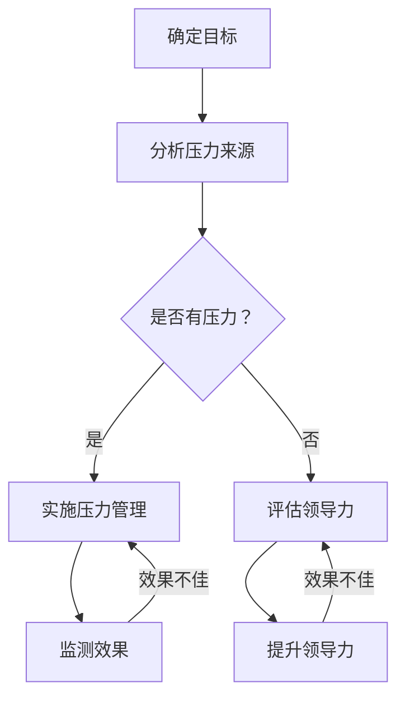
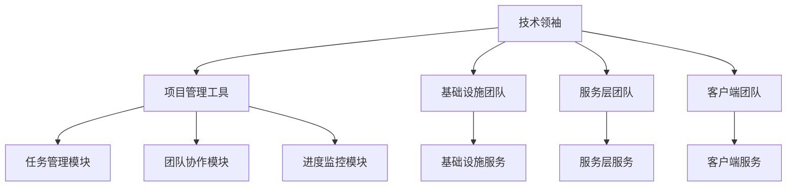
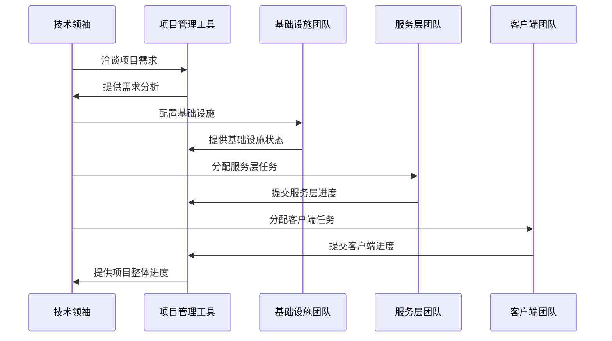

                 

# 领导力与压力管理：保持冷静的艺术

## 关键词
领导力，压力管理，冷静，技术领袖，高效工作

## 摘要
本文旨在探讨领导力与压力管理在技术领袖工作中的重要性，通过深入分析领导力的核心概念、压力来源及其管理方法，帮助技术领袖在复杂的环境中保持冷静与高效。本文将结合实际案例，提供实用的策略和技巧，以期提升技术领袖的领导能力和压力管理水平。

## 第一部分：背景介绍

### 1. 问题背景
在信息技术飞速发展的今天，技术领袖的角色愈发重要。他们不仅需要具备卓越的编程能力和技术视野，还需要具备出色的领导能力和压力管理技巧。随着企业竞争的加剧和技术的快速迭代，技术领袖面临的压力越来越大。如何在这种高压环境中保持冷静和高效，成为了一个亟待解决的问题。

#### 1.1 领导力
领导力是指领导者通过影响力、激励和引导，推动团队实现目标的能力。在技术领域，领导力不仅体现在技术决策上，还包括团队管理、项目管理、人才发展等方面。

#### 1.2 压力管理
压力管理是指领导者通过各种策略和方法，缓解压力、提高工作效能的过程。有效的压力管理有助于技术领袖保持清晰的思维和冷静的态度，从而更好地应对各种挑战。

### 2. 问题描述
技术领袖在日常工作中面临多种压力来源，包括技术难题、项目进度、团队管理、市场变化等。这些压力如果不能得到有效管理，可能会导致决策失误、工作效率下降，甚至影响身心健康。

#### 2.1 心理压力
心理压力主要来自于工作压力和人际关系压力。技术领袖在高压环境下容易产生焦虑、抑郁等心理问题。

#### 2.2 工作压力
工作压力主要来自于项目进度、技术难题、团队协作等。技术领袖需要不断调整自己的工作节奏，以应对不断变化的工作需求。

#### 2.3 环境压力
环境压力来自于市场变化、行业竞争、技术变革等外部环境因素。技术领袖需要具备前瞻性，以应对这些不确定性。

### 3. 问题解决
为了解决上述问题，技术领袖需要掌握有效的领导力和压力管理技巧。通过以下方法，技术领袖可以在复杂的环境中保持冷静和高效：

#### 3.1 提升领导力
- **情境领导理论**：根据不同情境，采用不同的领导风格，以提高团队效能。
- **变革型领导理论**：通过愿景引领和激励，激发团队成员的潜能。

#### 3.2 压力管理
- **时间管理**：合理规划工作时间，避免过度加班。
- **情绪控制**：学会调整情绪，保持积极心态。
- **放松技巧**：定期进行放松训练，如冥想、瑜伽等。

### 4. 边界与外延
领导力与压力管理不仅适用于企业高管，也适用于各类组织的领导者。此外，本文不仅关注领导者的个人成长，也关注团队和组织的管理。

### 5. 概念结构与核心要素组成
#### 5.1 领导力
领导力包括以下核心要素：
- **影响力**：通过榜样作用和激励手段，影响团队成员的行为和态度。
- **激励**：通过奖励和认可，激发团队成员的积极性和创造力。
- **引导**：通过沟通和指导，帮助团队成员明确目标，找到解决问题的方法。

#### 5.2 压力管理
压力管理包括以下核心要素：
- **压力来源**：识别和分析导致压力的因素。
- **压力反应**：了解压力对身体和心理的影响。
- **压力缓解**：采用有效的策略和方法，减轻压力的影响。

## 第二部分：核心概念与联系

### 1. 核心概念
#### 1.1 领导力模型
领导力模型包括情境领导理论、变革型领导理论等。这些模型提供了不同情境下的领导策略，以帮助技术领袖更好地应对挑战。

#### 1.2 压力来源
压力来源主要包括工作压力、人际压力、环境压力等。技术领袖需要识别这些压力来源，并采取相应的应对策略。

#### 1.3 压力反应
压力反应包括焦虑、抑郁、愤怒等。技术领袖需要了解这些反应，并学会调整自己的情绪和行为。

### 2. 概念属性特征对比表格
| 概念       | 属性特征               | 对比                  |
| ---------- | -------------------- | ------------------- |
| 领导力     | 影响力、激励、引导能力 | 与管理能力区别       |
| 压力管理   | 缓解压力、提高效能     | 与心理辅导区别       |
| 压力来源   | 工作压力、人际压力     | 与环境压力区别       |
| 压力反应   | 焦虑、抑郁、愤怒       | 与生理反应区别       |

### 3. ER实体关系图架构
```mermaid
erDiagram
  Leader ||--|{ PressureManagement }
  Leader ||--|{ StressSource }
  Leader ||--|{ StressReaction }
```

## 第三部分：算法原理讲解

### 1. 算法mermaid流程图


### 2. Python源代码
```python
# 假设的Python代码框架，用于领导力与压力管理流程的模拟
class Leader:
    def __init__(self, leadership, stress_management, stress_sources):
        self.leadership = leadership
        self.stress_management = stress_management
        self.stress_sources = stress_sources

    def analyze_stress(self):
        # 分析压力来源
        pass

    def check_stress(self):
        # 检查是否有压力
        pass

    def manage_stress(self):
        # 实施压力管理
        pass

    def evaluate_leadership(self):
        # 评估领导力
        pass

    def monitor.effect(self):
        # 监测效果
        pass

    def improve_leadership(self):
        # 提升领导力
        pass

# 实例化领导者对象
leader = Leader(leadership="变革型", stress_management="时间管理", stress_sources=["项目进度", "团队协作"])
```

### 3. 算法原理讲解

#### 1. 领导力算法原理
领导力算法主要涉及领导风格的选择和领导行为的优化。以下是一个简化的领导力算法模型：

$$
L = f(LS, LBC)
$$

其中，$L$ 表示领导力，$LS$ 表示领导风格，$LBC$ 表示领导行为。领导风格和领导行为共同决定了领导力的大小。

#### 2. 压力管理算法原理
压力管理算法主要涉及压力源的识别和压力缓解策略的选择。以下是一个简化的压力管理算法模型：

$$
SM = f(SS, SRS)
$$

其中，$SM$ 表示压力管理策略，$SS$ 表示压力源，$SRS$ 表示压力缓解策略。通过识别压力源和选择合适的压力缓解策略，可以有效地管理压力。

#### 3. 具体示例
假设一个技术领袖（Leader）在面临项目进度压力时，如何应用领导力和压力管理算法？

- **领导力算法**：根据情境选择变革型领导风格，并通过激励和指导提升团队士气。
- **压力管理算法**：识别出项目进度压力，选择时间管理策略，如制定合理的时间表和优先级，以缓解压力。

## 第四部分：系统分析与架构设计

### 1. 问题场景介绍
在一个大型科技公司，技术领袖需要管理多个项目团队，确保项目按时完成并达到预期质量。然而，由于项目复杂性和团队协作的挑战，技术领袖常常面临巨大的压力。

### 2. 项目介绍
项目旨在开发一款高性能的云计算平台，技术领袖需要协调不同团队的工作，确保项目进度和质量。项目涉及多个模块，包括基础设施、服务层、客户端等。

### 3. 系统功能设计（领域模型mermaid类图）
```mermaid
classDiagram
    ClassDiagram {
        TeamMember <|-- Project
        TeamMember <|-- Task
        Project *-- Task
        Project *-- TeamMember
        TeamMember *-- Task
    }
```

### 4. 系统架构设计（mermaid架构图）


### 5. 系统接口设计和系统交互（mermaid序列图）


## 第五部分：项目实战

### 1. 环境安装
在开始项目实战之前，我们需要安装以下环境：
- Python 3.8+
- Docker 19.03+
- MySQL 5.7+

### 2. 系统核心实现源代码
以下是系统核心实现的一些源代码片段：

#### 项目管理工具（PMT）代码示例
```python
# PMT.py
class ProjectManagementTool:
    def __init__(self):
        self.projects = {}

    def create_project(self, project_name):
        self.projects[project_name] = Project(project_name)

    def assign_team_member(self, project_name, team_member):
        project = self.projects[project_name]
        project.add_team_member(team_member)

    def assign_task(self, project_name, task):
        project = self.projects[project_name]
        project.add_task(task)
```

#### 任务管理模块（TaskManager）代码示例
```python
# TaskManager.py
class Task:
    def __init__(self, task_id, task_name, status):
        self.task_id = task_id
        self.task_name = task_name
        self.status = status

    def update_status(self, new_status):
        self.status = new_status

class TaskManager:
    def __init__(self):
        self.tasks = {}

    def create_task(self, task):
        self.tasks[task.task_id] = task

    def update_task_status(self, task_id, new_status):
        task = self.tasks[task_id]
        task.update_status(new_status)
```

### 3. 代码应用解读与分析
以下是对上述代码的解读与分析：

#### 项目管理工具（PMT）
项目管理工具（PMT）负责创建项目、分配团队成员和任务。它通过类和方法实现了这些功能。例如，`create_project` 方法用于创建项目，`assign_team_member` 方法用于分配团队成员，`assign_task` 方法用于分配任务。

#### 任务管理模块（TaskManager）
任务管理模块（TaskManager）负责创建任务、更新任务状态。它通过类和方法实现了这些功能。例如，`Task` 类用于定义任务，包含任务ID、任务名称和状态。`update_status` 方法用于更新任务状态。

### 4. 实际案例分析和详细讲解剖析
假设技术领袖需要为一个新项目分配任务，以下是如何使用上述模块进行操作：

1. **创建项目**：
   ```python
   pmt = ProjectManagementTool()
   pmt.create_project("云平台项目")
   ```

2. **分配团队成员**：
   ```python
   pmt.assign_team_member("云平台项目", "张三")
   pmt.assign_team_member("云平台项目", "李四")
   ```

3. **创建任务**：
   ```python
   task = Task("1", "设计基础设施", "进行中")
   task_manager = TaskManager()
   task_manager.create_task(task)
   ```

4. **更新任务状态**：
   ```python
   task_manager.update_task_status("1", "已完成")
   ```

### 5. 项目小结
通过上述代码，我们实现了项目管理工具（PMT）和任务管理模块（TaskManager）的核心功能。在实际项目中，这些模块可以通过扩展和优化，实现更复杂的任务分配和进度监控功能。技术领袖可以借助这些工具，更好地管理项目团队和任务，提高项目效率。

## 第六部分：最佳实践 Tips

1. **定期反思**：技术领袖应定期反思自己的领导行为和压力管理策略，以识别改进点。
2. **建立支持系统**：技术领袖可以建立一个支持系统，包括心理辅导、团队协作工具等，以帮助团队成员应对压力。
3. **保持身心健康**：技术领袖应关注自己的身心健康，保持良好的生活习惯，如定期锻炼、保持充足睡眠等。
4. **有效沟通**：技术领袖应学会有效沟通，与团队成员建立良好的信任关系，以便更好地应对压力和挑战。

## 第七部分：小结

本文从领导力和压力管理的角度，探讨了技术领袖在高压环境中的挑战和应对策略。通过深入分析核心概念、算法原理、系统架构和实际案例，技术领袖可以掌握保持冷静和高效工作的技巧。希望本文能为技术领袖提供有价值的参考和启示。

## 第八部分：注意事项

1. **个性化**：领导力和压力管理策略需要根据个人特点和情境进行个性化调整。
2. **持续学习**：技术领袖应持续学习新的领导力和压力管理方法，以适应不断变化的环境。
3. **团队支持**：技术领袖应重视团队支持，建立良好的团队文化和合作关系。

## 第九部分：拓展阅读

1. **《领导力的五个层次》**：约翰·麦克斯韦尔
2. **《压力管理的艺术》**：斯蒂芬·P·罗宾斯
3. **《禅与计算机程序设计艺术》**：唐纳德·E·克努特

## 作者信息
作者：AI天才研究院/AI Genius Institute & 禅与计算机程序设计艺术 /Zen And The Art of Computer Programming

