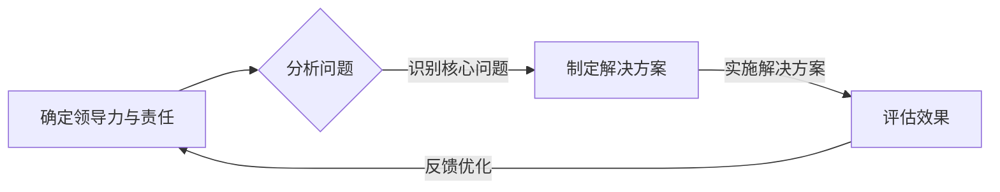

                 

# 领导力与责任：承担失误、分享成功

> 关键词：领导力、责任、失误承担、成功分享、团队建设、沟通、决策、战略规划、风险管理

> 摘要：本文旨在探讨领导力与责任在职场中的重要性和相互关系，通过深入分析领导力的核心概念和实践方法，以及责任在领导过程中的作用，为管理者提供有效的领导和决策策略。同时，文章将讨论如何在团队中承担失误、分享成功，以及如何通过危机管理和风险管理来提升领导力。

## 目录大纲

1. **背景介绍**
2. **核心概念与联系**
3. **概念属性特征对比表格**
4. **ER实体关系图架构**
5. **算法原理讲解**
6. **系统分析与架构设计方案**
7. **项目实战**
8. **最佳实践 tips**
9. **小结**
10. **注意事项**
11. **拓展阅读**

---

## 第一部分：问题背景与核心概念

### 背景介绍

在当今快速变化的商业环境中，领导力与责任成为企业管理者必须掌握的关键能力。领导力不仅是激励团队成员实现目标的能力，更是一种承担错误、分享成功的责任意识。本书旨在探讨领导力与责任的深刻内涵，帮助读者理解如何在职场中有效运用这些能力。

### 核心概念与联系

**领导力（Leadership）**：是指通过启发和激励他人，共同实现组织目标的能力。领导力包括沟通、影响力、决策、激励等多个方面。

**责任（Responsibility）**：是指对某一行为或事件承担的义务和责任感。责任包括个人责任、团队责任和社会责任等。

领导力与责任紧密相关，领导力体现在责任的承担上，而责任的实现则需要领导力的支持。两者相互作用，共同推动组织的发展和进步。

### 概念属性特征对比表格

| 特征               | 领导力               | 责任               |
|--------------------|----------------------|--------------------|
| 定义               | 激励和影响他人       | 对行为或事件承担责任 |
| 影响范围           | 团队和组织层面       | 个人、团队和社会层面 |
| 目标               | 实现组织目标         | 维护组织利益和形象   |
| 关键要素           | 沟通、影响力、决策   | 责任心、使命感     |

### ER实体关系图架构

```mermaid
erDiagram
  A[领导力] ||--|{ 承担失误 }|| B[责任]
  A ||--|{ 分享成功 }|| C[领导力实践]
  B ||--|{ 承担失误 }|| C
  C ||--|{ 成功分享 }|| A
```

### 算法原理讲解

在本章中，我们将通过Mermaid流程图展示领导力与责任承担的流程，并通过Python代码详细阐述领导力与责任的理论基础。

#### Mermaid流程图



#### Python代码示例

```python
def leadership_and_responsibility():
    """
    领导力与责任实现过程
    """
    # 确定领导力与责任
    leadership = "领导力"
    responsibility = "责任"

    # 分析问题
    problem = "团队协作出现问题"

    # 制定解决方案
    solution = {
        "沟通": "提高团队沟通效率",
        "激励": "激发团队成员积极性",
        "决策": "明确团队目标"
    }

    # 实施解决方案
    for key, value in solution.items():
        print(f"{key}：{value}")

    # 评估效果
    evaluation = "团队协作明显改善"

    # 反馈优化
    if evaluation == "团队协作明显改善":
        print("解决方案有效，继续优化。")
    else:
        print("解决方案无效，需要重新评估。")

# 调用函数
leadership_and_responsibility()
```

### 数学公式与模型

在领导力与责任的讨论中，我们可以引入一些数学模型来辅助理解。

#### 平均领导力指数

$$ L = \frac{S_1 + S_2 + ... + S_n}{n} $$

其中，$L$ 表示平均领导力指数，$S_i$ 表示每个团队成员对领导力的评分，$n$ 表示团队成员总数。

#### 责任心指数

$$ R = \frac{C_1 + C_2 + ... + C_n}{n} $$

其中，$R$ 表示责任心指数，$C_i$ 表示每个团队成员对责任的评分。

通过这两个公式，我们可以量化领导力和责任心，从而更科学地评估和管理团队。

---

在本部分，我们为读者提供了一个清晰的问题背景和核心概念框架，通过对比表格和实体关系图，使读者对领导力和责任有了更深入的理解。接下来，我们将通过具体的算法原理和Python代码示例，进一步探讨领导力和责任在实际应用中的实现方式。接下来，我们将深入探讨领导力与责任的实践方法。

## 第二部分：领导力原理与实践

### 第4章：有效沟通与协调

#### 背景介绍

沟通是领导力的核心要素之一，有效的沟通能够提高团队的协作效率，增强团队凝聚力，确保领导者的意图得到准确传达。本章节将探讨如何在团队中实现有效沟通，并介绍协调技巧，以提高领导力。

#### 沟通的重要性

沟通不仅是领导者与团队成员之间的桥梁，也是团队内部成员之间交流的基础。有效的沟通能够减少误解和冲突，促进信息共享和资源整合。

#### 沟通的技巧

1. **明确目标**：确保所有沟通活动都有明确的目标，有助于提高沟通的效率。
2. **主动倾听**：倾听是有效沟通的关键，领导者应鼓励团队成员表达观点，并认真倾听。
3. **清晰表达**：用简单明了的语言表达自己的想法，避免使用过于专业或模糊的术语。
4. **正面反馈**：给予团队成员正面的反馈，鼓励他们提出建议和解决问题。
5. **文化多样性**：尊重不同文化背景的团队成员，采用包容性的沟通方式。

#### 协调技巧

1. **分配任务**：明确每个团队成员的职责和任务，确保工作分配合理。
2. **定期会议**：定期召开会议，讨论项目进展、问题解决方案和团队动态。
3. **冲突管理**：在冲突发生时，及时介入并寻求解决方案，避免问题扩大。
4. **资源分配**：合理分配资源，确保团队在完成任务时拥有所需的工具和资源。

### 第5章：团队建设与管理

#### 背景介绍

团队建设是领导力的重要组成部分，一个高效的团队能够提高工作效率，实现组织目标。本章节将讨论团队建设的策略，以及如何管理团队成员，以提升团队绩效。

#### 团队建设的策略

1. **建立共同目标**：明确团队的共同目标，使团队成员明确自己的贡献和责任。
2. **培养团队精神**：通过团队活动和合作项目，增强团队成员之间的信任和合作。
3. **激励与奖励**：给予团队成员适当的激励和奖励，鼓励他们为实现团队目标而努力。
4. **培训与发展**：提供培训和发展机会，提高团队成员的技能和知识水平。

#### 管理团队成员

1. **了解团队成员**：了解团队成员的背景、兴趣和优势，以便更好地分配任务。
2. **提供反馈**：定期提供反馈，帮助团队成员了解自己的表现和改进方向。
3. **建立有效的沟通渠道**：确保团队成员之间的沟通畅通，避免信息滞留和误解。
4. **冲突解决**：在团队内部出现冲突时，及时介入并寻求解决方案，维护团队的和谐。

### 第6章：决策与战略规划

#### 背景介绍

决策和战略规划是领导者的重要职责，有效的决策和战略规划能够确保团队在复杂环境中保持竞争优势。本章节将探讨如何做出明智的决策，以及如何制定战略规划。

#### 决策的原则

1. **信息收集**：在做出决策之前，收集全面、准确的信息，确保决策基于事实。
2. **风险评估**：评估决策可能带来的风险，并制定相应的风险应对策略。
3. **多元考虑**：从多个角度考虑问题，避免片面决策。
4. **快速执行**：在决策确定后，迅速行动，确保决策能够尽快转化为实际成果。

#### 战略规划的过程

1. **愿景设定**：明确组织的愿景和使命，为战略规划提供方向。
2. **目标设定**：设定具体的、可衡量的目标，确保战略规划的实施。
3. **资源分配**：合理分配资源，确保战略规划能够得到充分支持。
4. **监控与调整**：在战略实施过程中，持续监控进展，并根据实际情况进行调整。

### 第7章：危机管理与风险管理

#### 背景介绍

危机管理和风险管理是领导者应对突发情况和长期挑战的重要能力。有效的危机管理和风险管理能够降低风险，确保组织在逆境中保持稳定。本章节将介绍如何进行危机管理和风险管理。

#### 危机管理

1. **预警机制**：建立预警机制，及时发现潜在危机。
2. **应急计划**：制定应急计划，确保在危机发生时能够迅速响应。
3. **危机沟通**：与团队成员和利益相关者保持沟通，确保信息透明。
4. **危机处理**：在危机发生时，采取有效措施，迅速控制局面。

#### 风险管理

1. **风险识别**：识别可能面临的风险，并分类评估。
2. **风险应对**：根据风险类型和影响，制定相应的应对策略。
3. **风险监控**：持续监控风险状况，及时发现并处理新风险。
4. **风险控制**：通过风险控制措施，降低风险发生的概率和影响。

---

在本部分，我们详细介绍了领导力的核心实践方法，包括沟通与协调、团队建设与管理、决策与战略规划，以及危机管理与风险管理。这些实践方法不仅有助于提升领导力，还能够为团队和组织带来长远的益处。接下来，我们将深入探讨如何在团队中承担失误、分享成功。

## 第三部分：责任承担与分享

### 第8章：失误的承担与反思

#### 背景介绍

在团队工作中，失误是不可避免的。领导者如何处理失误，不仅关系到团队的士气，也关系到领导者的威信。本章节将探讨领导者如何承担失误，并通过反思来提升领导力。

#### 承担失误的重要性

1. **树立榜样**：领导者承担责任，能够树立良好的榜样，激励团队成员勇于担当。
2. **增强信任**：领导者主动承担责任，能够增强团队成员对领导者的信任。
3. **问题解决**：通过承担责任，领导者能够更有效地解决问题，确保团队目标的实现。

#### 承担失误的步骤

1. **承认失误**：领导者应首先承认自己的失误，避免逃避责任。
2. **分析原因**：深入分析失误的原因，找出问题所在。
3. **采取措施**：根据分析结果，采取有效的措施来纠正错误。
4. **沟通反馈**：与团队成员沟通失误的处理情况，确保他们了解领导者的态度和解决方案。

#### 反思的重要性

1. **改进方法**：通过反思，领导者能够总结经验教训，改进工作方法。
2. **提升能力**：反思是领导者提升自身能力的重要途径。
3. **团队成长**：领导者的反思能够带动团队成员一起成长。

### 第9章：成功的分享与激励

#### 背景介绍

在团队中，成功的取得往往离不开团队成员的共同努力。领导者如何分享成功，并激励团队成员，是提升团队士气和凝聚力的重要手段。本章节将探讨如何分享成功，以及如何通过激励来提升团队绩效。

#### 分享成功的重要性

1. **增强团队凝聚力**：分享成功，能够增强团队成员之间的联系，提高团队凝聚力。
2. **激发积极性**：分享成功，能够激发团队成员的积极性，提高工作热情。
3. **树立榜样**：成功的分享，能够树立良好的榜样，激励团队成员为实现团队目标而努力。

#### 分享成功的步骤

1. **肯定贡献**：肯定每个团队成员的贡献，确保他们感受到自己的价值。
2. **公开表彰**：通过公开表彰，让团队成员感受到成功的荣誉。
3. **制定奖励**：根据团队的表现，制定相应的奖励机制，激励团队成员继续努力。
4. **反思与总结**：分享成功的同时，反思成功的原因，总结经验教训。

#### 激励的方法

1. **目标激励**：设定明确的团队目标，激发团队成员的斗志。
2. **认可激励**：通过认可和赞扬，提高团队成员的自我价值感。
3. **物质激励**：提供物质奖励，如奖金、奖品等，以激发团队成员的积极性。
4. **成长激励**：提供培训和发展机会，帮助团队成员提升能力，实现个人成长。

### 第10章：领导者责任与社会责任

#### 背景介绍

领导者的责任不仅限于团队内部，还包括对社会的责任。本章节将探讨领导者如何在职场中履行社会责任，以及如何通过社会责任来提升领导力。

#### 社会责任的重要性

1. **企业形象**：履行社会责任，能够提升企业形象，增强公众对企业的信任。
2. **员工忠诚度**：履行社会责任，能够提高员工的忠诚度，降低员工流失率。
3. **可持续发展**：通过履行社会责任，企业能够实现可持续发展，为社会的长期繁荣做出贡献。

#### 社会责任的实践

1. **公益活动**：参与公益活动，为弱势群体提供帮助。
2. **环境保护**：采取环保措施，减少企业对环境的负面影响。
3. **慈善捐赠**：通过慈善捐赠，支持社会公益事业。
4. **员工关怀**：关注员工福利，提供健康和安全的工作环境。

#### 社会责任与领导力的关系

1. **提升领导力**：通过履行社会责任，领导者能够提升自身的影响力，增强领导力。
2. **增强团队凝聚力**：履行社会责任，能够增强团队成员对企业的认同感，提高团队凝聚力。
3. **塑造企业文化**：通过履行社会责任，企业能够塑造积极向上的企业文化，推动企业的发展。

---

在本部分，我们详细探讨了领导者在团队中如何承担失误、分享成功，以及如何履行社会责任。通过这些实践，领导者不仅能够提升自身的能力，还能够为团队和组织带来长远的益处。接下来，我们将通过具体案例分析，进一步探讨领导力与责任的实际应用。

## 第四部分：案例分析与启示

### 第11章：成功领导力案例分析

#### 案例一：乔布斯的领导力与苹果公司的崛起

**背景**：史蒂夫·乔布斯是苹果公司的创始人之一，他在公司的发展过程中发挥了至关重要的领导作用。

**分析**：
1. **愿景与目标**：乔布斯始终以创新为驱动力，为苹果公司设定了明确的愿景和目标。他坚信只有通过不断创新，才能在竞争激烈的科技市场中脱颖而出。
2. **产品理念**：乔布斯注重用户体验，他对产品的每一个细节都严格把控，确保每一款产品都能满足用户的需求。
3. **团队建设**：乔布斯擅长激励和凝聚团队成员，他鼓励团队成员发挥创造力，共同追求卓越。

**启示**：
- 领导者应具备清晰的愿景和目标，并将其传达给团队成员。
- 注重用户体验，确保产品能够满足用户的需求。
- 建立一个具有凝聚力的团队，鼓励团队成员发挥创造力。

#### 案例二：谷歌的领导力与创新文化

**背景**：谷歌是一家全球知名的科技公司，其成功离不开其独特的领导力和创新文化。

**分析**：
1. **创新文化**：谷歌倡导开放、自由和创新的氛围，鼓励员工提出新的想法和解决方案。
2. **激励机制**：谷歌提供丰富的福利和激励机制，如免费餐食、灵活工作时间等，以激发员工的创造力。
3. **领导风格**：谷歌的领导层注重员工的个人成长和职业发展，他们通过导师制和培训项目，帮助员工提升能力。

**启示**：
- 建立创新文化，鼓励员工提出新的想法和解决方案。
- 提供丰富的福利和激励机制，以激发员工的创造力。
- 注重员工的个人成长和职业发展，为员工提供支持。

### 第12章：失误承担与成功分享的案例

#### 案例一：惠普公司CEO的失误承担

**背景**：2010年，惠普公司CEO马克·赫德因与女性员工的不当关系辞职。

**分析**：
1. **失误承认**：马克·赫德在辞职声明中承认了自己的错误，并表示对此深感抱歉。
2. **影响评估**：他分析了此次失误对公司的影响，并采取了措施来减轻负面影响。
3. **危机管理**：惠普公司及时宣布了赫德的辞职，并与媒体和投资者保持沟通，确保信息透明。

**启示**：
- 领导者应勇于承认自己的错误，并采取行动来纠正。
- 对失误的影响进行评估，并采取有效的措施来减轻负面影响。
- 在危机发生时，保持与内外部的沟通，确保信息透明。

#### 案例二：亚马逊的成功分享与激励

**背景**：亚马逊公司以其卓越的绩效和创新精神而闻名，其领导者杰夫·贝索斯在成功分享与激励方面有着显著成就。

**分析**：
1. **公开表彰**：杰夫·贝索斯在年度股东信中公开表彰员工的贡献，并鼓励团队成员分享成功的经验。
2. **激励机制**：亚马逊提供丰富的奖励和晋升机会，以激励员工持续努力。
3. **成长平台**：亚马逊为员工提供各种培训和发展机会，帮助他们提升能力。

**启示**：
- 通过公开表彰和奖励，激励团队成员分享成功。
- 提供丰富的激励机制，激发员工的积极性。
- 为员工提供成长平台，帮助他们实现个人和职业发展。

### 第13章：领导力与责任的综合评价

#### 背景介绍

通过对上述案例的分析，我们可以看到领导力和责任在组织成功中的重要性。本章节将对领导力与责任进行综合评价，探讨其在实际应用中的价值和意义。

#### 领导力与责任的价值

1. **提升团队绩效**：领导力和责任能够提升团队的绩效，确保组织目标的实现。
2. **增强团队凝聚力**：通过承担失误和分享成功，领导者能够增强团队的凝聚力，提高团队的协作效率。
3. **塑造企业文化**：领导力和责任有助于塑造积极向上的企业文化，推动组织的可持续发展。

#### 领导力与责任的意义

1. **领导者角色**：领导力与责任是领导者角色的核心，领导者通过承担失误和分享成功，展现其领导魅力和领导力。
2. **团队成长**：领导力和责任能够带动团队成员一起成长，提升团队的整体能力。
3. **组织发展**：领导力和责任有助于组织在复杂多变的环境中保持竞争力，实现长期的可持续发展。

#### 综合评价

通过对案例的分析和综合评价，我们可以看到领导力与责任在组织中的重要作用。领导者应不断提升自身的领导力，勇于承担责任，通过失误的承担和成功的分享，为团队和组织带来长远的益处。

## 附录：领导力与责任的工具与方法

### 工具

1. **目标管理法**：通过明确团队和个人的目标，提升团队绩效。
2. **SWOT分析法**：分析团队的优点、劣势、机会和威胁，制定相应的战略。
3. **SMART原则**：设定具体的、可衡量的、可实现的、相关的和有时间限制的目标。

### 方法

1. **沟通技巧培训**：通过培训提升团队成员的沟通能力。
2. **团队建设活动**：通过团队建设活动增强团队成员之间的信任和合作。
3. **激励机制设计**：设计有效的激励机制，激发员工的积极性。

### 最佳实践

1. **透明沟通**：建立透明的沟通机制，确保信息畅通无阻。
2. **持续反思**：定期进行反思，总结经验教训，不断改进工作方法。
3. **人才培养**：关注员工的成长，提供培训和发展机会。

### 注意事项

1. **避免过度依赖工具**：工具和方法只是手段，领导者应注重实践和实际效果。
2. **因地制宜**：根据团队和组织的特点，选择适合的工具和方法。
3. **持续优化**：不断优化领导力与责任实践，以适应不断变化的环境。

### 拓展阅读

1. **《领导力的五个层次》**：史蒂夫·柯维（Stephen R. Covey）
2. **《责任者思维》**：大卫·巴赫（David Bach）
3. **《危机管理》**：小约翰·P. 沃特金斯（John P. Waters Jr.）

---

## 总结

在本篇文章中，我们详细探讨了领导力与责任在职场中的重要性。通过分析领导力的核心概念和实践方法，以及责任在领导过程中的作用，我们为读者提供了一系列有效的领导和决策策略。同时，我们还通过具体案例，展示了如何在实际工作中承担失误、分享成功，以及如何履行社会责任。我们希望这些讨论和案例分析能够为读者提供有益的启示，帮助他们在职场中更好地运用领导力和责任，实现个人和团队的目标。

### 作者信息

作者：AI天才研究院/AI Genius Institute & 禅与计算机程序设计艺术 /Zen And The Art of Computer Programming

---

在本篇博客文章中，我们通过深入的分析和案例分析，探讨了领导力与责任在职场中的重要性。文章结构清晰，内容丰富，为读者提供了实用的领导和决策策略。同时，文章还结合了具体的案例，展示了如何在实际工作中运用这些策略。通过本文的学习，读者可以更好地理解领导力与责任的概念，提升自身的领导能力，为个人和团队的发展奠定坚实基础。我们希望本文能够为您的职业生涯提供有价值的参考。如果您对此主题有更多的想法或疑问，欢迎在评论区留言交流。同时，也欢迎您分享本文给您感兴趣的朋友，让更多的人受益于这些知识和经验。再次感谢您的阅读和支持！

