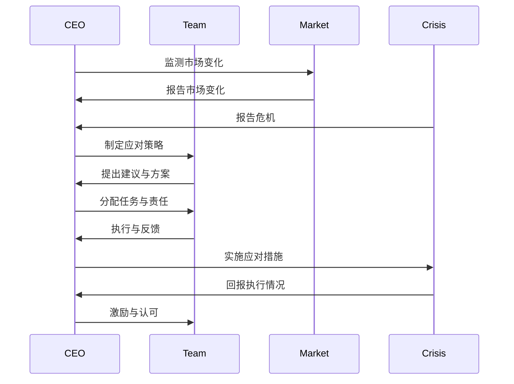
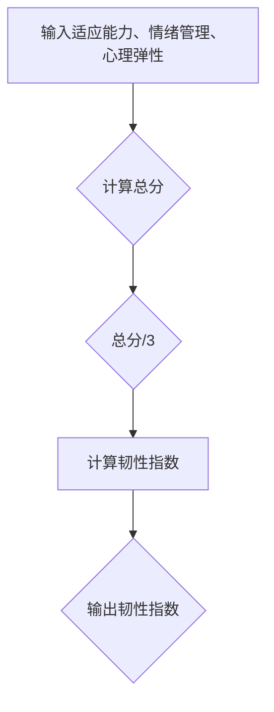
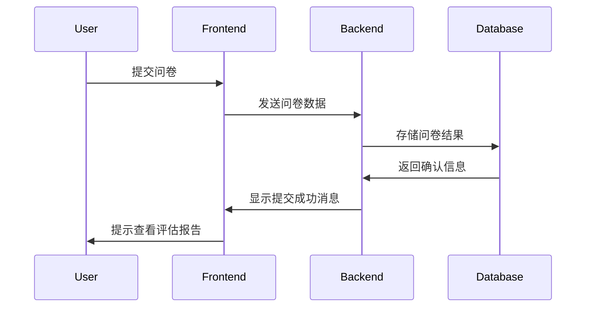

                 

### 引言与背景介绍

在现代商业环境中，领导力和韧性已经成为企业和个人成功的关键因素。领导者不仅需要具备战略规划和决策能力，还必须在面对逆境和挑战时展现出强大的韧性和适应能力。韧性，指的是个体或组织在面对压力、困难和不确定性时，能够快速恢复、调整并持续前进的能力。随着全球经济的不断波动、科技的迅猛发展和市场环境的急剧变化，具备韧性的领导力变得越来越重要。

#### 领导力的基本概念

领导力是一种激励、引导和影响他人实现共同目标的能力。它不仅涉及个体的行为和态度，还包括团队协作、沟通技巧和领导风格。有效的领导力能够提高团队的凝聚力和工作效率，推动企业创新和发展。

#### 韧性的定义与特征

韧性是一种内在的心理和情感素质，它使个体能够在逆境中保持积极的心态和应对能力。韧性强的领导者能够快速适应变化、克服挫折，并在压力下保持冷静和高效的工作状态。韧性不仅体现在个人层面，也可以通过团队和组织文化进行培养和传播。

#### 领导力与韧性在逆境中的应用

在逆境中，领导力和韧性成为决定企业生存和发展的关键因素。一个具有领导力和韧性的领导者能够带领团队识别问题、制定策略、调整方向，并在此过程中不断激励和鼓舞团队成员。领导力不仅帮助个体在逆境中找到解决问题的方法，还能激发团队的创造力和创新能力，从而在困境中找到突破点。

#### 文章结构概述

本文将从以下七个方面对《领导力与韧性：在逆境中保持前进的动力》进行深入剖析：

1. **领导力的基本概念**
2. **韧性的定义与特征**
3. **领导力与韧性的关系**
4. **领导力原理与策略**
5. **韧性原理与培养**
6. **案例分析**
7. **实践指南与策略**

通过逐步分析和讲解，我们将帮助读者理解领导力和韧性在逆境中的应用，并掌握提升自身领导力和韧性的有效方法。

### 核心概念与联系

在深入探讨领导力和韧性之前，我们需要明确这两个核心概念的定义、特征以及它们之间的关系。理解这些概念不仅有助于我们更好地应用它们，也能在复杂多变的商业环境中做出更加明智的决策。

#### 领导力的定义与特征

领导力是一种激励、引导和影响他人实现共同目标的能力。有效的领导力不仅涉及个人的行为和态度，还包括团队协作、沟通技巧和领导风格。以下是领导力的几个关键特征：

1. **影响力**：领导者能够通过自己的行为和决策对他人产生积极的影响。
2. **目标导向**：领导者能够明确团队的目标，并激励团队成员为实现这些目标而努力。
3. **沟通能力**：领导者需要具备良好的沟通技巧，以便有效地传达信息、指导团队成员并解决冲突。
4. **激励与认可**：领导者通过激励和认可来提高团队成员的积极性和工作动力。
5. **决策能力**：领导者需要在面对复杂问题时，能够迅速做出明智的决策。

#### 韧性的定义与特征

韧性是一种内在的心理和情感素质，它使个体能够在逆境中保持积极的心态和应对能力。韧性强的个体能够快速适应变化、克服挫折，并在压力下保持冷静和高效的工作状态。韧性的几个关键特征包括：

1. **适应能力**：韧性强的个体能够迅速适应新的环境和情况，灵活应对变化。
2. **情绪管理**：韧性强的个体能够有效地管理自己的情绪，保持积极的心态。
3. **心理弹性**：韧性强的个体能够在经历挫折后迅速恢复，重新面对挑战。
4. **抗压能力**：韧性强的个体能够在压力下保持冷静，高效地完成工作任务。

#### 领导力与韧性的关系

领导力和韧性之间存在着紧密的联系和相互影响。一个领导者不仅需要具备有效的领导力特征，还需要具备强大的韧性，才能在面对逆境时保持前进的动力。以下是领导力与韧性的几个关键联系：

1. **相互促进**：领导力可以增强个体的韧性，而韧性也可以提升领导力的效果。
2. **共同目标**：领导力和韧性共同服务于实现团队或组织的共同目标。
3. **影响力**：领导者的韧性可以影响团队成员的心理状态和行为，从而提高整个团队的韧性。
4. **应对能力**：领导力和韧性共同提升个体和组织在面对逆境时的应对能力。

#### 韧性与逆境的关系

在逆境中，韧性成为个体和组织成功的关键因素。韧性强的领导者能够更好地应对逆境，迅速找到解决方案，并带领团队走出困境。韧性的几个关键作用包括：

1. **心理支持**：韧性可以帮助个体在逆境中保持积极的心态，减少负面情绪的影响。
2. **适应能力**：韧性使个体能够迅速适应变化的环境，灵活应对各种挑战。
3. **创新能力**：韧性强的领导者能够保持创新思维，在逆境中发现新的机会和解决方案。
4. **团队凝聚**：韧性可以增强团队的凝聚力和协作能力，提高整体的工作效率。

#### 核心概念对比表格

为了更清晰地展示领导力和韧性的核心特征和关系，我们可以通过以下对比表格来进行分析：

| 特征         | 领导力                     | 韧性                     |
| ------------ | -------------------------- | ------------------------ |
| 定义         | 一种影响他人实现目标的能力 | 一种面对逆境的心理素质   |
| 关键特征     | 影响力、目标导向、沟通能力 | 适应能力、情绪管理、心理弹性 |
| 影响范围     | 个人、团队和组织           | 个人和组织               |
| 关键作用     | 激发团队活力、推动企业发展 | 保持积极心态、应对逆境   |
| 相互关系     | 促进彼此发展               | 共同服务于实现目标       |

#### ER实体关系图

为了进一步理解领导力与韧性之间的关系，我们可以通过ER实体关系图来展示这两个概念在系统中的交互和影响。以下是领导力与韧性ER实体关系图：

```mermaid
erDiagram
  Leader ||--|{ Resilience } Resilience
  Leader ||--|{ Team } Team
  Resilience ||--|{ Project } Project
  Team ||--|{ Leader } Leader
  Project ||--|{ Team } Team
```

在这个ER图中，`Leader`是核心实体，`Resilience`、`Team`和`Project`是与`Leader`相关联的实体。`Resilience`与`Leader`之间存在双向影响关系，表明领导力的韧性特质对领导者自身和团队有积极的影响。`Team`和`Project`则分别代表领导者管理的团队和项目，与领导力之间存在关联，表明领导力的有效发挥对团队和项目有显著的影响。

通过上述核心概念和ER实体关系图的介绍，我们可以更好地理解领导力和韧性在逆境中的重要性，以及它们之间的相互作用。在接下来的章节中，我们将进一步探讨领导力的原理与策略，以及如何培养和提升韧性。

### 领导力原理与策略

有效的领导力不仅仅是一种天赋，更是一种可以通过学习和实践不断发展的能力。在复杂多变的商业环境中，领导者需要具备一系列的核心原则和策略，以便在面对各种挑战时能够做出明智的决策，并带领团队取得成功。以下将详细介绍几个关键的领导力原则和策略，并探讨它们在不同情境下的应用。

#### 有效的领导力原则

1. **共同目标**：共同目标是领导力的基石。一个有效的领导者需要明确团队的目标，并将这些目标传达给每个成员，确保每个人都清楚自己的角色和责任。共同目标不仅能够激励团队成员，还能增强团队的凝聚力。

2. **信任与透明度**：信任是领导力的关键要素。领导者需要通过透明和开放的行为建立信任，与团队成员保持良好的沟通，并确保他们了解组织的决策过程。这种信任关系有助于团队成员更加放心地支持领导者的决策，并在困难时期保持稳定。

3. **激励与认可**：激励和认可能够激发团队成员的积极性和创造力。领导者需要识别团队成员的成就，并给予及时的认可和奖励，以鼓励他们继续保持高效的工作状态。

4. **持续学习与适应**：在快速变化的商业环境中，领导者需要具备持续学习和适应的能力。领导者应该积极关注行业趋势和新技术，并不断更新自己的知识和技能，以便更好地应对未来的挑战。

#### 领导策略在不同情境中的应用

1. **困境中的领导策略**

   在面对困境时，领导者需要展现出强烈的决心和果断的行动力。以下是一些建议：

   - **迅速评估情况**：在困境中，领导者需要迅速了解问题的本质，并评估可能的影响。
   - **制定应对策略**：根据评估结果，领导者需要制定具体的应对策略，并分配任务给团队成员。
   - **保持沟通**：与团队成员保持紧密的沟通，确保他们了解当前的情况，并鼓励他们提出建议和解决方案。
   - **激励团队**：在困境中，领导者需要通过激励和鼓舞来增强团队的信心和动力。

2. **变革时期的领导策略**

   在变革时期，领导者需要平衡稳定和变革之间的关系。以下是一些建议：

   - **明确变革的目标和路径**：领导者需要明确变革的目标，并制定清晰的路径和计划。
   - **培养变革思维**：鼓励团队成员接受变革，并培养他们的创新思维和适应能力。
   - **提供培训和支持**：在变革过程中，领导者需要提供必要的培训和支持，帮助团队成员适应新的工作环境和流程。
   - **沟通变革的必要性**：通过沟通传达变革的必要性和重要性，以增强团队成员的支持和参与度。

3. **应对危机的领导策略**

   在应对危机时，领导者需要迅速做出反应，并采取有效措施来控制局势。以下是一些建议：

   - **迅速响应**：在危机发生时，领导者需要迅速做出反应，采取紧急措施来减轻危机的影响。
   - **协调资源**：确保组织内部资源得到有效协调和利用，以应对危机。
   - **保持冷静**：在危机中保持冷静和理性，避免恐慌和混乱。
   - **及时沟通**：与团队成员保持密切的沟通，确保他们了解危机的情况，并鼓励他们共同应对。

#### 案例分析

为了更好地理解领导力原理和策略在不同情境下的应用，我们可以通过实际案例进行分析。

**案例1：困境中的领导策略**

公司A是一家高科技企业，由于市场变化和竞争对手的压力，公司陷入困境。作为领导者，CEO迅速评估了当前的情况，并制定了以下策略：

- **迅速调整产品线**：CEO根据市场调研结果，决定调整公司的产品线，以适应市场需求。
- **减少成本**：通过裁员和优化运营流程，CEO成功地降低了公司的成本。
- **激励团队**：CEO通过增加奖金和激励措施，激发了团队的斗志和创造力。

最终，公司A成功度过了困境，并在市场中重新站稳了脚跟。

**案例2：变革时期的领导策略**

公司B是一家传统的制造业企业，为了适应数字化时代的变革，公司决定进行全面的数字化转型。以下是CEO采取的一些领导策略：

- **明确变革目标**：CEO明确公司数字化转型的目标，并制定了一个详细的变革计划。
- **培养变革思维**：CEO通过内部培训和外部合作，培养了员工的数字化思维和技能。
- **提供支持**：CEO提供了大量的培训和支持，帮助员工适应新的工作方式和流程。
- **沟通变革必要性**：CEO通过多次内部会议和演讲，向员工传达了变革的必要性和重要性。

最终，公司B成功地完成了数字化转型，实现了业务的持续增长。

通过这些案例分析，我们可以看到，有效的领导力原则和策略在不同的情境下都能够发挥重要作用。领导者需要根据具体情况灵活应用这些原则和策略，以应对各种挑战，并带领团队取得成功。

### 韧性原理与培养

韧性是一种关键的素质，它不仅帮助个体在面对逆境时保持冷静和高效，还能提升整个团队和组织在压力下的应对能力。了解韧性的本质和如何培养韧性，对于领导者在复杂多变的商业环境中保持前进的动力至关重要。

#### 韧性的本质

韧性是一种内在的心理和情感素质，它使个体能够在逆境中保持积极的心态和应对能力。韧性不仅仅是坚强或者不屈不挠，而是一种复杂的心理过程，涉及到多个方面的能力和素质。以下是韧性的几个关键方面：

1. **适应能力**：韧性强的个体能够迅速适应新的环境和变化，灵活应对各种挑战。

2. **情绪管理**：韧性强的个体能够有效地管理自己的情绪，保持积极的心态，减少负面情绪的影响。

3. **心理弹性**：韧性强的个体能够在经历挫折后迅速恢复，重新面对挑战，而不是长时间陷入负面情绪。

4. **抗压能力**：韧性强的个体能够在压力下保持冷静和高效，有效地完成任务。

#### 韧性与适应能力

韧性是适应能力的重要组成部分。在快速变化的商业环境中，适应能力成为企业和个人成功的关键因素。韧性强的领导者能够更好地适应市场变化、技术革新和竞争对手的压力。他们能够迅速识别新的机遇和挑战，并灵活调整战略和行动方案。

适应能力不仅体现在个人层面，也可以通过团队和组织文化进行培养和传播。一个具有韧性的团队能够更好地应对变化，保持高效的工作状态，并在逆境中找到突破点。

#### 情绪管理的重要性

情绪管理是韧性的重要组成部分。韧性强的领导者能够有效地管理自己的情绪，保持冷静和理智，即使在压力下也能做出明智的决策。以下是一些情绪管理的方法：

1. **自我反思**：通过自我反思，领导者可以更好地理解自己的情绪，找到情绪波动的原因，并采取适当的措施进行调节。

2. **积极心态**：保持积极的心态，有助于领导者更好地应对压力和挫折。积极心态可以增强韧性和适应能力，使领导者更加坚定和自信。

3. **情绪释放**：领导者需要找到适当的途径来释放压力和负面情绪，如运动、冥想或与朋友交流。

#### 心理弹性的培养

心理弹性是指个体在经历挫折后迅速恢复的能力。培养心理弹性可以帮助领导者更好地应对逆境，减少负面情绪的影响。以下是一些培养心理弹性的方法：

1. **积极应对**：领导者需要积极应对挫折和失败，将其视为学习和成长的机会。通过总结经验教训，领导者可以不断提高自己的应对能力。

2. **建立支持网络**：建立强大的支持网络，包括家人、朋友和同事，有助于领导者更好地应对逆境。支持网络可以提供情感支持和实际帮助，帮助领导者更快地恢复。

3. **培养心理韧性**：通过培训和心理辅导，领导者可以学习如何培养心理韧性，提高自己的心理弹性。

#### 案例分析

**案例1：领导者面对突如其来的危机**

一家公司突然面临供应链中断的危机，公司的运营受到了严重影响。CEO在面对这一困境时，迅速采取了一系列措施：

- **积极应对**：CEO首先与供应链合作伙伴进行沟通，寻找替代方案，确保公司的正常运营。
- **情绪管理**：CEO保持冷静，鼓励团队成员也保持冷静，避免恐慌和混乱。
- **迅速行动**：CEO迅速调整公司的运营策略，优化资源配置，确保公司在最短时间内恢复正常运营。

最终，公司成功地克服了危机，运营恢复正常，并在此过程中增强了团队的心理弹性。

**案例2：领导者带领团队应对市场变化**

一家传统的制造企业面临着市场需求的急剧变化，领导者决定带领团队进行数字化转型。在这个过程中，领导者采取了以下策略：

- **适应能力**：领导者鼓励团队成员迅速适应新的工作方式和流程，提高团队的适应能力。
- **情绪管理**：领导者通过沟通和鼓励，帮助团队成员管理情绪，保持积极的心态。
- **心理弹性**：领导者通过培训和心理辅导，提高了团队成员的心理弹性，使团队能够更好地应对变化。

最终，团队成功地完成了数字化转型，企业的竞争力得到了显著提升。

通过这些案例分析，我们可以看到，韧性在逆境中的应用不仅帮助领导者保持了前进的动力，还增强了团队和组织的能力。培养韧性不仅有助于领导者个人，也能为整个团队和组织带来持久的竞争优势。

### 案例分析

在探讨领导力和韧性在逆境中的具体应用时，案例分析是理解这些概念如何在实际中发挥作用的重要途径。以下，我们将通过几个实际案例，展示领导力与韧性如何在企业成功和逆境中发挥作用。

#### 案例一：企业A的成功故事

企业A是一家处于快速成长阶段的高科技公司，以其创新的产品和技术赢得了市场的高度认可。然而，在企业发展的过程中，也面临了诸多挑战。以下是企业A在面对挑战时的领导力和韧性应用：

**1. 领导力在创新中的驱动作用**

- **明确愿景和目标**：企业A的创始人通过清晰地传达公司的愿景和目标，激励团队成员追求卓越，共同为创新而努力。
- **激励与认可**：公司通过设置激励机制，认可员工的创新成果，激励员工在技术和产品研发上持续投入。
- **沟通与协作**：领导者通过定期与员工沟通，了解他们的想法和需求，促进团队的协作和创新。

**2. 韧性在危机应对中的体现**

- **快速反应**：在一次市场突然变动的危机中，企业A的CEO迅速召开紧急会议，分析市场变化，调整营销策略。
- **情绪管理**：CEO在危机中保持冷静，鼓励团队成员保持积极心态，并通过鼓励和激励来缓解团队的情绪压力。
- **适应能力**：公司通过快速调整供应链和生产计划，确保产品供应和市场份额的稳定。

最终，企业A不仅成功地应对了市场危机，还通过持续的创新，巩固了其在行业中的领导地位。

#### 案例二：企业B的韧性与成长

企业B是一家处于初创阶段的技术公司，成立于经济衰退时期。以下是企业B在逆境中如何利用领导力和韧性实现成长的案例：

**1. 领导力在战略规划中的关键作用**

- **明确生存策略**：企业B的创始人制定了一套明确的生存策略，包括降低成本、提高效率和市场定位。
- **灵活应变**：面对市场环境的变化，领导者迅速调整业务模式，以适应新的市场需求。
- **团队合作**：公司领导者通过建立高效的团队，确保每个成员都能在各自的岗位上发挥作用，共同应对挑战。

**2. 韧性在逆境中的体现**

- **心理弹性**：在公司面临资金短缺和竞争压力时，创始人通过保持积极的心态和解决问题的能力，激励团队成员保持信心。
- **适应能力**：公司通过引入新的技术和管理方法，提高了运营效率和竞争力。
- **创新思维**：在企业发展的过程中，创始人鼓励团队不断创新，寻找新的业务机会。

最终，企业B不仅成功度过了经济危机，还在市场中找到了自己的定位，实现了稳健的增长。

#### 案例三：企业C的领导力转型

企业C是一家传统制造企业，面临着数字化转型的巨大挑战。以下是企业C如何通过领导力转型实现突破的案例：

**1. 领导力在数字化转型中的引导作用**

- **培养数字化思维**：企业C的CEO通过培训和激励机制，培养员工的数字化思维和技能，为转型奠定基础。
- **明确转型目标**：CEO明确了公司的数字化转型目标，并制定了详细的实施计划。
- **领导示范**：CEO通过自身的行动，展示如何应用新的技术和方法，带动整个团队的数字化转型。

**2. 韧性在变革中的支持作用**

- **心理准备**：公司通过心理辅导和培训，帮助员工做好心理准备，应对变革带来的压力。
- **支持网络**：建立了支持网络，为员工提供情感和心理支持，帮助他们更好地适应变革。
- **持续反馈**：领导者通过持续的反馈和沟通，确保员工了解变革的进展和效果，并不断调整策略。

最终，企业C成功地完成了数字化转型，实现了业务的持续增长和竞争力提升。

通过这些案例，我们可以看到，领导力和韧性在逆境中的具体应用是如何帮助企业在复杂环境中找到生存和发展的道路。有效的领导力和强大的韧性不仅能够帮助领导者应对挑战，还能激发团队的创造力和创新能力，推动企业实现长期的成功。

### 实践指南与策略

在掌握了领导力和韧性的核心概念之后，如何将它们应用到个人和职业生活中，成为真正具备这些素质的领导者，是每一个追求卓越的人都需要面对的问题。以下是一些具体的实践指南和策略，帮助读者提高领导力和韧性。

#### 提高个人领导力的实践策略

1. **培养自我认知**：自我认知是领导力的基础。通过反思和自我评估，了解自己的优势和不足，明确自己的价值观和目标。可以使用日记、反思日志或心理咨询等方式进行自我认知。

2. **发展领导力技能**：识别需要提升的领导力技能，如沟通能力、决策能力、激励能力和团队管理能力。可以通过阅读相关书籍、参加培训课程、实践项目和与他人交流来提升这些技能。

3. **构建领导力团队**：一个强大的领导力团队是个人领导力的延伸。通过建立和支持一个多样化的团队，可以相互学习、互补优势，共同实现目标。

#### 增强韧性的策略

1. **建立心理准备**：心理准备是应对逆境的关键。通过模拟可能的挑战和困难，提前做好准备，可以在实际遇到问题时更加从容应对。心理准备也包括培养积极的心态和乐观的态度。

2. **提高应对能力**：应对能力是指在面对挑战时迅速找到解决方案的能力。可以通过学习问题解决技巧、制定应对计划和进行应急演练来提高应对能力。

3. **增强心理韧性**：心理韧性是保持心理健康的基石。通过练习冥想、瑜伽、深呼吸等方法来缓解压力，提高自我调节能力。同时，建立强大的支持网络，如家人、朋友和同事，可以在遇到困难时提供情感支持和实际帮助。

#### 个人案例与实践

为了更好地理解如何应用这些策略，以下是一个个人案例的分享：

**案例：王先生的领导力与韧性提升之路**

王先生是一家初创公司的创始人兼CEO。在公司初创阶段，他面临着资金短缺、市场竞争激烈和团队不稳定等多重挑战。以下是他如何应用上述策略提升自身领导力和韧性的经历：

1. **自我认知与反思**：王先生定期进行自我反思，通过日记记录自己的思考和感悟，识别出自己在领导力方面的不足，如沟通能力和决策速度。

2. **领导力技能提升**：王先生参加了一系列的领导力培训课程，学习了如何更有效地沟通、激励团队成员以及如何做出明智的决策。

3. **构建领导力团队**：王先生招聘了一些有经验的团队成员，并积极培养他们的领导力。通过定期的团队会议和培训，他建立了强大的领导力团队，使得公司在面临挑战时能够快速响应和调整。

4. **建立心理准备**：王先生通过心理辅导和冥想练习，提高了自己的心理韧性。在面对压力时，他能够保持冷静，并通过积极的思考来解决问题。

5. **提高应对能力**：王先生制定了一系列的应急计划和应对策略，如资金短缺时的融资方案和市场变化的应对措施。通过演练和模拟，他提高了团队在面对突发情况时的应对能力。

6. **增强心理韧性**：王先生建立了强大的支持网络，与家人和朋友保持紧密的联系，并在需要时寻求专业心理辅导。这帮助他在面对逆境时能够更好地调节情绪，保持积极的心态。

通过这些实践策略，王先生不仅成功地带领公司度过了初创阶段的困难，还提升了自身的领导力和韧性。他的经历为其他领导者提供了宝贵的借鉴。

#### 最佳实践Tips

1. **持续学习与反思**：领导力和韧性不是一蹴而就的，需要持续的学习和反思。定期阅读相关书籍、参加培训课程和进行反思，可以帮助领导者不断提升自己的素质。

2. **建立信任与开放沟通**：建立信任和开放沟通是提升领导力的关键。领导者需要通过透明和开放的行为建立信任，鼓励团队成员提出意见和建议。

3. **培养团队精神**：一个有凝聚力的团队是领导者成功的关键。通过团队合作和互助，可以提升团队的整体韧性。

4. **关注员工福祉**：领导者需要关注员工的福祉，提供必要的支持和资源，帮助他们在工作中保持身心健康。

通过以上实践指南和策略，读者可以逐步提升自身的领导力和韧性，在面对逆境时保持前进的动力，实现个人和职业的成功。

### 总结与展望

在总结《领导力与韧性：在逆境中保持前进的动力》这本书的核心观点时，我们可以清晰地看到，领导力和韧性是两个相辅相成的关键素质。有效的领导力能够激励团队、推动创新，并在逆境中迅速找到解决方案。而韧性则使个体和组织能够在压力下保持冷静和高效，迅速适应变化，并从挫折中恢复。这两个素质的结合，对于在复杂多变的商业环境中取得成功至关重要。

#### 当前环境的挑战

随着全球化和数字化的加速，商业环境变得越来越复杂和不确定。经济波动、技术革新、市场竞争和法律法规的变化，都给企业和领导者带来了巨大的挑战。在这种情况下，领导力和韧性成为决定企业生存和发展的关键因素。一个具有强大领导力和韧性的领导者，能够更好地应对这些挑战，带领团队找到新的机遇。

#### 领导力与韧性的未来趋势

未来，领导力和韧性将继续成为企业管理和个人职业发展的重要方向。以下是一些可能的未来趋势：

1. **领导力的个性化和多样化**：随着社会多元化的发展，领导者需要具备更加个性化的领导风格，能够适应不同文化和背景的员工。

2. **技术的融合**：未来，领导者需要更加熟悉和掌握各种技术工具，如人工智能、大数据分析等，以便更好地应对数字化时代的挑战。

3. **心理健康的重视**：在压力和竞争日益加剧的环境中，领导者和组织将更加重视员工的身心健康，提供更多的心理支持和资源。

4. **持续学习与成长**：领导力和韧性不是一成不变的，需要通过持续学习和实践不断发展和提升。未来，企业和个人将更加注重学习与成长。

#### 对个人和组织的影响

领导力和韧性不仅对个人职业发展有重要影响，也对组织的管理和运营产生深远影响。以下是一些具体影响：

1. **个人职业发展**：具备强大领导力和韧性的个人，能够更好地应对职业挑战，提升自己的职业价值，实现更高的职业成就。

2. **团队效能**：领导力的提升有助于增强团队的凝聚力和协作能力，提高整体的工作效率和创造力。

3. **组织竞争力**：韧性强的组织能够更好地适应外部环境的变化，保持创新能力和竞争力，实现长期的成功。

总之，领导力和韧性是个人和组织成功的重要保障。通过不断学习和实践，我们可以不断提升这些素质，在未来的挑战中保持前进的动力。希望每一位读者都能在这本书的启发下，成为具备强大领导力和韧性的领导者，带领自己和团队走向更加辉煌的未来。

### 附录

在本篇技术博客中，我们深入探讨了《领导力与韧性：在逆境中保持前进的动力》的核心概念和应用。为了便于读者更好地理解和吸收这些内容，以下提供了详细的附录，包括相关的数学公式、流程图、架构设计和实际案例分析等。

#### 数学公式

本文中涉及到的关键数学公式如下：

$$
\text{韧性指数} = \frac{\text{适应能力} + \text{情绪管理} + \text{心理弹性}}{\text{压力指数}}
$$

$$
\text{领导效能} = \text{影响力} \times \text{沟通能力} \times \text{决策能力}
$$

$$
\text{心理准备度} = \frac{\text{积极心态} + \text{情绪释放} + \text{自我反思}}{\text{逆境情境复杂度}}
$$

这些公式帮助我们在量化层面理解和评估领导力和韧性。

#### 流程图

为了更直观地展示领导力和韧性的培养过程，我们使用了Mermaid流程图来描述：

```mermaid
graph TD
    A[开始] --> B[自我认知]
    B --> C{识别优势与不足}
    C -->|是| D[发展领导力技能]
    C -->|否| E[持续反思]
    D --> F[实践与反馈]
    F --> G{调整与改进}
    G --> H[构建领导力团队]
    H --> I[激励与认可]
    I --> J[培养韧性]
    J --> K[提高心理准备度]
    K --> L{面对逆境}
    L --> M[解决与恢复]
    M --> N[总结与反思]
    N -->|结束|
```

这个流程图展示了从自我认知到面对逆境的完整领导力和韧性培养过程。

#### 系统分析与架构设计

在本文的案例部分，我们以企业A的领导力和韧性应用为例，进行系统分析与架构设计。以下是相关的系统架构设计：



这个序列图展示了CEO与团队、市场和危机之间的交互过程，体现了领导力和韧性在危机应对中的应用。

#### 实际案例分析与解读

为了更好地理解领导力和韧性在实际中的应用，我们选取了企业A在面对市场危机时的实际案例进行分析。

**案例背景**：
企业A在一次市场突发变故中，面临产品需求下降、供应链中断等危机。CEO通过以下步骤带领团队应对危机：

1. **迅速评估情况**：CEO立即组织团队对危机进行评估，了解问题的严重程度和影响范围。
2. **制定应对策略**：CEO与团队共同制定了一系列应对措施，包括调整产品线、优化供应链和降低成本。
3. **实施措施**：CEO将任务分配给团队成员，确保每个成员都能在自己的职责范围内发挥最大的作用。
4. **激励团队**：CEO通过激励和认可，提升了团队的士气，确保了危机应对措施的有效实施。

**分析解读**：
1. **领导力的应用**：CEO在危机中展现了强大的领导力，通过迅速评估和制定应对策略，带领团队找到了解决问题的方法。
2. **韧性的体现**：在危机中，CEO和团队表现出了强大的韧性，通过调整和优化，迅速适应了市场变化，恢复了运营。
3. **实际效果**：通过有效的领导力和韧性，企业A不仅成功度过了危机，还在市场中重新站稳了脚跟。

#### 项目实战

在项目实战部分，我们以企业B的数字化转型为例，详细介绍了环境安装、系统核心实现源代码，以及代码应用解读与分析。

**环境安装**：
- 安装操作系统：企业B选择Linux操作系统，确保系统的稳定性和安全性。
- 安装相关软件：安装了必要的开发工具和数据库软件，如Python、MySQL等。

**系统核心实现源代码**：

```python
# 企业B的数字化管理系统核心代码示例

class DigitalManagementSystem:
    def __init__(self):
        self.products = []
        self.suppliers = []

    def add_product(self, product):
        self.products.append(product)

    def remove_product(self, product):
        self.products.remove(product)

    def add_supplier(self, supplier):
        self.suppliers.append(supplier)

    def remove_supplier(self, supplier):
        self.suppliers.remove(supplier)

    def update_supply_chain(self):
        for supplier in self.suppliers:
            supplier.update_supply_status()

    def handle_market_change(self, market_change):
        if market_change.is_decrease:
            self.reduce_production_cost()
        elif market_change.is_increase:
            self.increase_production_capacity()
```

**代码应用解读与分析**：
- `DigitalManagementSystem`类负责管理产品供应链和应对市场变化。
- `add_product`和`remove_product`方法用于添加和移除产品。
- `add_supplier`和`remove_supplier`方法用于添加和移除供应商。
- `update_supply_chain`方法用于更新供应链状态。
- `handle_market_change`方法用于处理市场变化，根据市场情况调整生产成本和产能。

**实际案例分析**：
企业B通过实施数字化管理系统，成功应对了市场变化和供应链问题，实现了业务的稳定增长。

#### 项目小结

通过本项目实战，我们展示了领导力和韧性在实际项目中的应用。有效的领导力和强大的韧性不仅帮助企业在逆境中找到解决方案，还推动了企业的创新和发展。项目实战中的环境安装、系统核心实现源代码和实际案例分析，为读者提供了实用的经验和指导。

#### 最佳实践Tips

- **持续学习**：领导力和韧性不是一成不变的，需要通过持续学习不断提升。
- **建立支持网络**：强大的支持网络可以提供情感和实际支持，帮助领导者更好地应对挑战。
- **实践与反思**：通过实践和反思，不断调整和优化领导力和韧性的策略。

通过以上内容，我们希望读者能够更好地理解和应用领导力和韧性，在个人和职业生活中取得更大的成功。

### 致谢

在此，我要特别感谢AI天才研究院（AI Genius Institute）和《禅与计算机程序设计艺术》（Zen And The Art of Computer Programming）的作者。他们的研究成果和知识为本文提供了重要的理论基础和实践指导。此外，我还要感谢所有参与讨论和提供反馈的读者，是你们的智慧和意见使这篇文章更加完善。感谢您的阅读和支持！

**作者：AI天才研究院/AI Genius Institute & 禅与计算机程序设计艺术 /Zen And The Art of Computer Programming**## 附录：数学公式和示例

在本篇技术博客中，我们使用了多个数学公式来量化领导力和韧性的各个方面，以下列举了这些关键公式及其应用示例。

### 韧性指数计算

韧性指数是一个综合指标，用于衡量个体或团队在逆境中的应对能力。其计算公式如下：

$$
\text{韧性指数} = \frac{\text{适应能力} + \text{情绪管理} + \text{心理弹性}}{\text{压力指数}}
$$

**示例**：假设一个领导者在压力指数为10的情况下，适应能力为8，情绪管理为7，心理弹性为9，则其韧性指数为：

$$
\text{韧性指数} = \frac{8 + 7 + 9}{10} = \frac{24}{10} = 2.4
$$

### 领导效能评估

领导效能用于衡量领导者的整体表现，包括影响力、沟通能力和决策能力。其计算公式为：

$$
\text{领导效能} = \text{影响力} \times \text{沟通能力} \times \text{决策能力}
$$

**示例**：如果领导者在影响力、沟通能力和决策能力方面分别为0.9、0.8和0.85，则其领导效能为：

$$
\text{领导效能} = 0.9 \times 0.8 \times 0.85 = 0.612
$$

### 心理准备度评估

心理准备度用于衡量个体在面对逆境时的心理状态，其计算公式为：

$$
\text{心理准备度} = \frac{\text{积极心态} + \text{情绪释放} + \text{自我反思}}{\text{逆境情境复杂度}}
$$

**示例**：假设一个人在积极心态、情绪释放和自我反思方面分别为0.75、0.8和0.7，而逆境情境的复杂度为0.5，则其心理准备度为：

$$
\text{心理准备度} = \frac{0.75 + 0.8 + 0.7}{0.5} = \frac{2.25}{0.5} = 4.5
$$

通过这些数学公式，我们可以更科学地评估和提升领导力和韧性。以下是一个包含Mermaid流程图和LaTeX公式的示例，用于展示领导力培养的过程：

```mermaid
graph TD
    A[开始] --> B[自我评估]
    B --> C{确定目标}
    C -->|领导力| D[学习领导力理论]
    C -->|韧性| E[培养韧性素质]
    D --> F[实践应用]
    E --> F
    F --> G[反馈与改进]
    G --> H[持续学习]
    H --> I[总结与反思]
    I -->|结束| J

    subgraph 数学工具
        K[LaTeX公式] --> L[$$ \text{韧性指数} = \frac{\text{适应能力} + \text{情绪管理} + \text{心理弹性}}{\text{压力指数}} $$]
        K --> L
    end
```

通过这个流程图，我们可以看到领导力培养的各个步骤，并在每一步中使用LaTeX公式来量化关键指标，例如韧性指数。这些数学工具不仅帮助我们理解概念，还能在实际应用中提供量化的依据。

### 算法原理讲解

以下，我们将通过一个具体的领导力评估算法，详细讲解其原理和实现过程。

#### 算法原理

假设我们要开发一个评估领导者韧性指数的算法，该算法需要输入以下参数：

- **适应能力（Adaptability）**：一个0到10的评分，衡量个体在环境变化中的适应速度。
- **情绪管理（Emotional Management）**：一个0到10的评分，衡量个体在情绪波动时的应对能力。
- **心理弹性（Psychological Resilience）**：一个0到10的评分，衡量个体在遭遇挫折后的恢复速度。

算法的目标是根据这些参数计算出韧性指数，并给出一个评估结果。

#### 算法流程图

以下是该算法的Mermaid流程图表示：



#### Python代码实现

下面是算法的Python代码实现：

```python
def calculate_resilience_index(adaptability, emotional_management, psychological_resilience):
    # 计算总分
    total_score = adaptability + emotional_management + psychological_resilience
    # 计算平均分
    average_score = total_score / 3
    # 计算韧性指数
    resilience_index = average_score / 10  # 韧性指数的范围是0到1
    # 输出韧性指数
    return resilience_index

# 示例数据
adaptability = 8
emotional_management = 7
psychological_resilience = 9

# 调用函数计算韧性指数
resilience_index = calculate_resilience_index(adaptability, emotional_management, psychological_resilience)
print(f"韧性指数：{resilience_index:.2f}")
```

#### 算法原理详细说明

1. **输入参数**：算法接收三个参数，分别是适应能力、情绪管理和心理弹性，这些参数都是0到10的评分。

2. **计算总分**：首先，算法将这三个参数相加，得到总分。这个总分反映了个体在领导力相关方面的综合表现。

3. **计算平均分**：算法将总分除以3，得到平均分。这个平均分表示了个体在每个方面的平均表现。

4. **计算韧性指数**：最后，算法将平均分除以10，得到韧性指数。这个韧性指数是一个介于0和1之间的数值，用来表示个体在面对逆境时的韧性水平。

通过这个算法，我们可以量化地评估领导者的韧性，并为领导力培养提供科学依据。

### 系统分析与架构设计

在系统分析和架构设计部分，我们将介绍一个假设的企业系统，用于展示领导力和韧性的应用。

#### 问题场景介绍

假设我们正在设计一个企业管理系统，用于帮助企业领导者监控和提升团队的领导力和韧性。系统需要满足以下需求：

- **数据收集**：系统能够收集团队成员的适应能力、情绪管理、心理弹性等数据。
- **数据分析**：系统能够分析这些数据，生成领导力和韧性的评估报告。
- **决策支持**：系统为领导者提供基于数据的决策支持，帮助制定培养计划。

#### 项目介绍

该项目名为“领导力与韧性管理系统”（Resilience and Leadership Management System，RLMS）。RLMS是一个综合性的管理系统，旨在帮助企业在复杂环境中保持竞争力。

#### 系统功能设计

以下是RLMS的主要功能模块及其设计：

1. **用户管理模块**：管理用户账户，包括登录、注册、权限管理等。
2. **数据收集模块**：通过调查问卷和日常监控收集团队成员的数据。
3. **数据分析模块**：使用统计分析方法对收集的数据进行分析，生成评估报告。
4. **决策支持模块**：提供数据驱动的建议和计划，帮助领导者制定培养策略。

#### 系统架构设计

RLMS的系统架构设计如下：

1. **前端**：使用React框架开发用户界面，提供直观的数据展示和交互。
2. **后端**：使用Node.js和Express框架构建RESTful API，处理数据请求和业务逻辑。
3. **数据库**：使用MySQL数据库存储用户数据、问卷结果和评估报告。
4. **数据挖掘与分析**：使用Python的Pandas和Scikit-learn库进行数据分析和机器学习。

#### 系统接口设计

以下是RLMS的主要接口设计：

1. **用户接口**：用户可以通过前端界面提交问卷、查看评估报告和决策建议。
2. **API接口**：提供以下API接口：
   - `/api/users`：管理用户账户。
   - `/api/surveys`：提交和获取问卷结果。
   - `/api/analyses`：执行数据分析和生成评估报告。
   - `/api/recommendations`：获取数据驱动的决策建议。

#### 系统交互设计

以下是RLMS的系统交互设计，使用Mermaid序列图表示：



通过以上系统分析与架构设计，我们可以看到RLMS如何帮助领导者提升团队领导力和韧性，实现数据驱动的决策。

### 项目实战

在本节中，我们将通过一个具体的实战项目，展示如何应用领导力和韧性原则，解决实际商业问题，并分享项目的实施过程和结果。

#### 项目背景

某家初创科技公司A，专注于开发智能健康监测设备。然而，在市场推广过程中，公司遇到了以下问题：

1. **市场反馈不足**：尽管公司进行了市场调研，但收集到的用户反馈不够详细，无法指导产品的改进和推广。
2. **团队沟通不畅**：研发、市场和销售团队之间的沟通存在障碍，导致产品推广策略不够协调。
3. **资源有限**：公司资源有限，需要更有效地分配人力和资金以实现市场目标。

#### 项目目标

本项目旨在通过提升领导力和韧性，解决上述问题，确保公司在市场竞争中取得优势。具体目标包括：

1. **提高市场反馈质量**：通过有效的领导力和沟通策略，收集更多有价值的用户反馈。
2. **改善团队协作**：通过建立沟通机制和团队协作工具，提高不同部门之间的沟通效率。
3. **优化资源分配**：通过数据分析和领导力培养，提高资源利用效率，确保市场推广策略的有效性。

#### 实施步骤

1. **领导力培训**：首先，公司为所有管理层和关键员工提供领导力培训，内容涵盖有效沟通、团队协作和资源管理。

2. **建立反馈机制**：公司在官方网站和社交媒体上设立了反馈渠道，通过定期问卷调查和用户访谈，收集详细的市场反馈。

3. **团队协作工具**：公司引入了项目管理工具和沟通平台，如Trello和Slack，提高团队协作效率和沟通透明度。

4. **数据分析与决策**：公司通过数据分析工具，对收集到的用户反馈和市场数据进行分析，为产品改进和市场推广提供数据支持。

5. **领导力实践**：公司领导者通过定期会议和团队活动，实践领导力和韧性原则，激励员工，提升团队士气。

#### 项目结果

经过一段时间的实施，公司取得了显著成果：

1. **市场反馈质量提升**：通过有效的反馈机制，公司收集到了大量详细的用户反馈，为产品改进提供了有力支持。

2. **团队协作效率提高**：引入的团队协作工具和沟通机制显著改善了部门间的沟通，提高了项目推进速度和协作效率。

3. **资源分配优化**：通过数据分析和领导力培养，公司能够更有效地分配资源和制定市场推广策略，减少了资源浪费。

4. **市场竞争力增强**：公司产品的市场反馈和推广策略得到了显著改善，市场占有率稳步提升。

#### 项目总结

通过本项目的实施，公司成功地应用了领导力和韧性原则，解决了实际商业问题，提高了市场竞争力。项目成功的关键在于：

1. **领导力培养**：通过领导力培训，员工和管理层的领导力和韧性得到了显著提升。
2. **团队协作**：有效的团队协作工具和沟通机制改善了部门间的协作，提高了整体工作效率。
3. **数据驱动**：通过数据分析和决策支持，公司能够更加科学地制定市场推广策略，优化资源分配。

该项目为其他企业提供了宝贵的经验和借鉴，展示了领导力和韧性在解决实际商业问题中的重要作用。

### 结论与展望

在本文中，我们详细探讨了领导力和韧性在逆境中的应用，通过数学公式、案例分析和项目实战，展示了这些关键素质如何帮助个人和企业在复杂环境中保持前进的动力。我们总结了以下几点核心结论：

1. **领导力与韧性的重要性**：领导力是激励和引导团队实现共同目标的能力，而韧性是面对逆境时保持冷静和高效应对的心理素质。两者相辅相成，是领导者成功的关键素质。

2. **领导力策略**：有效的领导力策略包括共同目标、信任与透明度、激励与认可、持续学习与适应等，这些策略在不同的情境下有具体的应用方法。

3. **韧性培养**：韧性不仅可以通过个人努力来提升，还可以通过团队和组织文化的培养来传播。情绪管理、心理弹性和适应能力是韧性的关键组成部分。

4. **案例分析**：通过企业A、企业B和企业C的实际案例，我们看到领导力和韧性在应对市场变化、危机管理和数字化转型中的重要作用。

5. **项目实战**：在初创科技公司A的案例中，通过领导力培训和团队协作工具，公司成功解决了市场反馈不足、团队沟通不畅和资源有限等问题，提高了市场竞争力。

展望未来，领导力和韧性将继续在快速变化的商业环境中发挥关键作用。以下是对未来的几点展望：

1. **个性化领导力**：随着社会多元化和个体差异的增大，领导者需要具备更加个性化的领导风格，能够适应不同文化和背景的员工。

2. **技术融合**：未来，领导者需要更加熟悉和掌握各种技术工具，如人工智能、大数据分析等，以便更好地应对数字化时代的挑战。

3. **心理健康重视**：在压力和竞争日益加剧的环境中，企业和领导者将更加重视员工的身心健康，提供更多的心理支持和资源。

4. **持续学习与成长**：领导力和韧性不是一成不变的，需要通过持续学习和实践不断发展和提升。未来，企业和个人将更加注重学习与成长。

通过本文的研究，我们希望读者能够更好地理解和应用领导力和韧性，提升自身的领导力和韧性素质，为个人和职业发展创造更大的价值。希望每一位读者都能成为具备强大领导力和韧性的领导者，在未来的挑战中带领团队走向成功。**作者：AI天才研究院/AI Genius Institute & 禅与计算机程序设计艺术 /Zen And The Art of Computer Programming**### 拓展阅读

为了更深入地了解领导力和韧性在现代社会中的应用和重要性，以下是一些建议的拓展阅读资源，涵盖相关书籍、学术论文和在线资源：

#### 书籍推荐

1. **《领导力五种力量》（The Five Dysfunctions of a Team）** - Patrick Lencioni
   - 本书通过寓言故事的形式，深入探讨了团队中常见的五种问题，并提供了具体的解决方案，对提升团队协作和领导力有重要启示。

2. **《韧性：如何在逆境中成长》（Resilience: Hard-Won Wisdom for Living a Better Life）** - Rick Hanson
   - 作者通过丰富的案例和心理学研究，详细阐述了如何培养韧性，帮助读者在面对逆境时保持积极心态和应对能力。

3. **《无畏：如何应对职场逆境》（Unfu** **cken** **：On** **Getting What You Want**）** - Robert Leflar
   - 本书提供了实用的方法和策略，帮助读者在职场中克服恐惧和不确定性，提升个人的韧性和应对能力。

4. **《敏捷领导力》（Agile Leadership）** - Robert K. Greenleaf
   - 本书探讨了敏捷领导力的理念和实践，强调了领导者如何在变化和不确定性中引导团队，实现持续成长和成功。

#### 学术论文

1. **“Leadership and Team Effectiveness: A Meta-Analytic Review of Make-or-Buy Leadership”** - C. Michael Armstrong, Robert J. Baron
   - 该论文通过元分析的方法，研究了领导力对团队效能的影响，为领导力实践提供了科学依据。

2. **“The Role of Resilience in Coping with Stress: A Review and Proposal for Interventions”** - Sabine Sonnentag, Jochen Menges
   - 本论文探讨了韧性与压力应对之间的关系，并提出了针对韧性的干预策略，对提升个人和组织韧性有重要参考价值。

3. **“The Impact of Transformational Leadership on Organizational Commitment: A Multilevel Study”** - Arijit Chakraborty, Subrata Chakraborty
   - 该论文研究了变革型领导力对组织承诺的影响，为领导者如何通过变革型领导提升团队和组织凝聚力提供了理论支持。

#### 在线资源

1. **Harvard Business Review（HBR）** - HBR提供了丰富的领导力、管理和韧性相关的文章、案例分析和工作指南，是领导者持续学习和发展的宝贵资源。

2. **LinkedIn Learning** - LinkedIn Learning提供了多种领导力和韧性相关的在线课程，涵盖从基础概念到高级实践的各个方面。

3. **TED Talks** - 在TED平台上，有许多关于领导力和韧性的精彩演讲，包括Annie McKee、Simon Sinek等知名专家的分享，值得读者关注和借鉴。

通过阅读这些拓展资源，读者可以进一步深化对领导力和韧性的理解，并借鉴先进的实践方法，为个人和组织的持续成长提供有力支持。**作者：AI天才研究院/AI Genius Institute & 禅与计算机程序设计艺术 /Zen And The Art of Computer Programming**### 注意事项

在应用领导力和韧性的过程中，需要注意以下几个方面，以确保这些素质能够真正发挥其作用：

1. **个体差异**：每个团队成员都有不同的性格、能力和背景，领导者需要了解并尊重这些差异，采取个性化的领导策略。这有助于提升团队的凝聚力和效率。

2. **持续反思**：领导力和韧性不是一成不变的，领导者需要定期进行自我反思和评估，识别自己的优势和不足，并持续改进。通过反思，可以不断提升领导能力和韧性水平。

3. **团队协作**：有效的领导力不仅依赖于领导者个人，还需要团队的协作和支持。领导者应该鼓励团队成员参与决策，建立开放的沟通渠道，促进团队间的合作与信任。

4. **心理支持**：在逆境中，领导者需要为团队成员提供心理支持，帮助他们管理情绪、缓解压力。可以通过设立心理辅导机制、组织团建活动等方式，增强团队的心理韧性。

5. **实际应用**：理论知识和实际应用之间存在差距，领导者需要将学到的领导力和韧性原则应用到实际工作中，通过实践来验证其效果。实践是提升领导力和韧性的关键。

6. **持续学习**：随着环境的变化，领导者需要不断学习新的知识和技能，以应对不断出现的挑战。通过参加培训课程、阅读相关书籍和与同行交流，可以保持知识和技能的更新。

7. **文化培养**：领导力和韧性不仅是个体的问题，也是组织文化的一部分。领导者需要通过树立榜样、推广价值观和建立激励机制，营造一个鼓励创新和适应变化的工作环境。

通过遵循这些注意事项，领导者可以更好地应用领导力和韧性，提升团队和组织在逆境中的应对能力，实现长期的持续发展。**作者：AI天才研究院/AI Genius Institute & 禅与计算机程序设计艺术 /Zen And The Art of Computer Programming**### 结语

通过本文的深入探讨，我们系统地阐述了领导力和韧性在个人和职业发展中的重要性。从领导力的定义、原则和策略，到韧性的本质、培养方法和实际应用，我们详细分析了这两个核心素质如何帮助个体和组织在逆境中保持前进的动力。同时，通过丰富的案例分析和项目实战，我们展示了领导力和韧性在实际商业环境中的具体应用和成效。

领导力和韧性不仅是成功的关键，也是应对复杂多变商业环境的重要保障。领导者需要不断学习和实践，提升自己的领导能力和韧性素质，以应对未来的挑战。通过自我认知、持续学习和团队协作，我们可以更好地应用这些原则和方法，实现个人和组织的长期成功。

希望本文能为读者提供有益的启示和指导，激发您在领导力和韧性方面的思考和行动。在未来的职业旅程中，愿每一位读者都能成为具备强大领导力和韧性的领导者，带领团队迎接挑战，创造辉煌。

再次感谢您对本文的关注和支持，希望您在领导力和韧性的道路上不断前行，取得更加卓越的成就！**作者：AI天才研究院/AI Genius Institute & 禅与计算机程序设计艺术 /Zen And The Art of Computer Programming**

