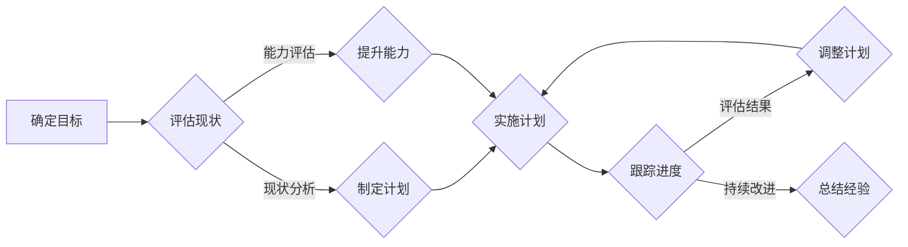
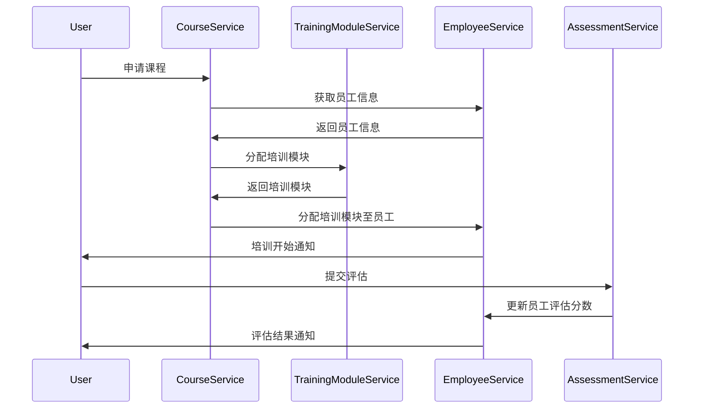
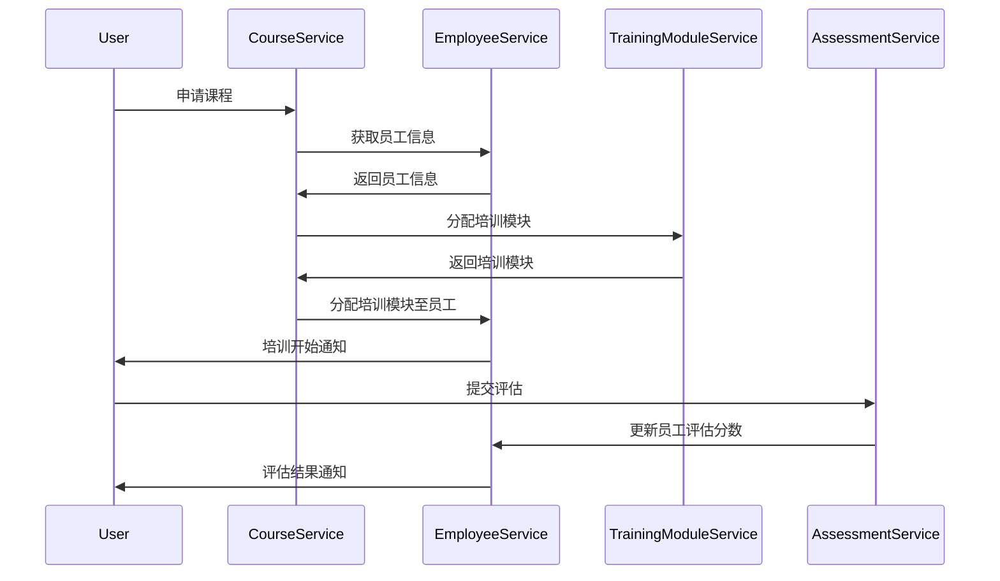

                 

### 1.2.2 本书的研究目的

本书旨在从新手到大师的成长之路，系统性地探讨领导力的本质与修炼方法，帮助读者深入了解领导力的核心概念、实践技巧和发展路径。本书的研究目的具体如下：

### 1.2.2.1 深入理解领导力的核心概念

领导力是一门综合性学科，涉及到多个领域，如心理学、管理学、社会学等。本书将详细阐述领导力的核心概念，包括领导力的定义、特征、类型和风格等，帮助读者建立对领导力的全面认识。

### 1.2.2.2 探索领导力的实践方法

领导力不仅是一种理论知识，更是一种实践能力。本书将介绍多种领导力实践方法，如沟通技巧、团队建设、决策与问题解决、激励与员工发展等，帮助读者在实际工作中运用领导力，提升团队绩效。

### 1.2.2.3 分析领导力自我提升的方法和技巧

领导力是一种可以通过不断学习和实践提升的能力。本书将探讨领导力自我提升的方法和技巧，如自我认知与反思、情绪管理与压力应对、终身学习与知识管理等，帮助读者实现个人领导力的成长。

### 1.2.2.4 案例分析与领导力转型

本书将通过成功和失败领导力案例的分析，展示领导力在不同场景下的应用，帮助读者了解领导力的实践效果。此外，本书还将探讨领导力转型的话题，分析领导者在不同发展阶段所需的领导力素质和能力。

### 1.2.2.5 探讨领导力的未来趋势

随着社会和科技的不断发展，领导力也在不断演变。本书将探讨领导力在未来的发展趋势和挑战，如数字化时代的领导力、新型组织形态下的领导力、全球化和多元化领导力等，帮助读者应对未来的领导力挑战。

### 1.2.2.6 总结与展望

本书将对全书的内容进行总结，并对未来领导力的发展进行展望，为读者提供有价值的思考和启示。

通过以上研究目的的实现，本书旨在为读者提供一部全面、系统、实用的领导力修炼指南，帮助读者从新手到大师，实现领导力的全面提升。

----------------------------------------------------------------

## 1.3 本书结构安排

### 1.3.1 各部分内容概述

本书分为七个主要部分，各部分内容概述如下：

### 第一部分：引言

介绍领导力的重要性、研究的背景与目的，以及本书的结构安排。

### 第二部分：领导力基础理论

详细阐述领导力的核心概念、理论框架和发展历程，包括领导力定义、特征、类型、风格和心理学等方面的内容。

### 第三部分：领导力实践方法

介绍领导力在实际工作中的应用方法，包括沟通技巧、团队建设、决策与问题解决、激励与员工发展等方面的内容。

### 第四部分：领导力自我提升

探讨领导力自我提升的方法和技巧，如自我认知与反思、情绪管理与压力应对、终身学习与知识管理等。

### 第五部分：领导力案例分析

通过成功和失败领导力案例的分析，展示领导力在不同场景下的应用。

### 第六部分：领导力未来趋势

探讨领导力在未来的发展趋势和挑战，如数字化时代、新型组织形态、全球化和多元化等方面的内容。

### 第七部分：总结与展望

对全书的内容进行总结，并对未来领导力的发展进行展望。

### 1.3.2 读者对象与学习目标

本书主要面向以下读者：

- 初入职场或有一定工作经验的职场新人，希望提升领导力技能。
- 中层管理者，希望了解领导力的核心概念和实践方法。
- 高级管理者，希望提升自身的领导力水平，实现个人和组织的共同成长。

学习本书，读者将能够：

- 理解领导力的核心概念和理论框架。
- 掌握领导力在实际工作中的应用方法。
- 学习领导力自我提升的方法和技巧。
- 分析领导力在不同场景下的应用效果。
- 把握领导力的未来发展趋势和挑战。

通过学习本书，读者将能够全面提升自身的领导力水平，为个人职业发展和组织成功奠定坚实基础。

----------------------------------------------------------------

## 1.4 目录大纲

### 第一部分：引言

1.1 领导力的重要性  
1.1.1 领导力在现代社会中的作用  
1.1.2 领导力对于个人和组织的意义

1.2 领导力研究的背景与目的  
1.2.1 领导力研究的现状  
1.2.2 本书的研究目的

1.3 本书结构安排  
1.3.1 各部分内容概述  
1.3.2 读者对象与学习目标

### 第二部分：领导力基础理论

2.1 领导力定义与特征  
2.1.1 领导力的定义  
2.1.2 领导力的特征

2.2 领导理论概述  
2.2.1 领导理论的起源与发展  
2.2.2 领导理论的主要流派

2.3 领导风格与类型  
2.3.1 领导风格的理论与实践  
2.3.2 领导类型的划分与特点

2.4 领导力与心理学  
2.4.1 心理学在领导力研究中的应用  
2.4.2 领导力与个体心理学的关系

### 第三部分：领导力实践方法

3.1 领导力沟通技巧  
3.1.1 沟通在领导力中的重要性  
3.1.2 领导力沟通的障碍与解决方法

3.2 领导力团队建设  
3.2.1 团队建设的目标与原则  
3.2.2 团队建设的实践方法

3.3 领导力决策与问题解决  
3.3.1 决策在领导力中的重要性  
3.3.2 问题解决的基本方法

3.4 领导力激励与员工发展  
3.4.1 激励的理论与实践  
3.4.2 员工发展的策略与措施

### 第四部分：领导力自我提升

4.1 自我认知与反思  
4.1.1 自我认知的重要性  
4.1.2 反思的方法与实践

4.2 情绪管理与压力应对  
4.2.1 情绪管理的基本策略  
4.2.2 压力应对的技巧与方法

4.3 终身学习与知识管理  
4.3.1 终身学习的意义与实践  
4.3.2 知识管理的方法与工具

4.4 职业发展与领导力提升  
4.4.1 职业发展的路径与策略  
4.4.2 领导力提升的关键要素

### 第五部分：领导力案例分析

5.1 成功领导力案例  
5.1.1 成功领导力案例的选择与介绍  
5.1.2 成功领导力案例的启示

5.2 失败领导力案例  
5.2.1 失败领导力案例的选择与介绍  
5.2.2 失败领导力案例的教训

5.3 领导力转型案例  
5.3.1 领导力转型的背景与原因  
5.3.2 领导力转型的策略与实践

### 第六部分：领导力未来趋势

6.1 数字化时代的领导力  
6.1.1 数字化时代的特点与挑战  
6.1.2 数字化时代的领导力策略

6.2 新型组织形态下的领导力  
6.2.1 新型组织形态的内涵与特点  
6.2.2 新型组织形态下的领导力挑战

6.3 全球化和多元化领导力  
6.3.1 全球化和多元化的趋势与影响  
6.3.2 全球化和多元化领导力的策略与实践

### 第七部分：总结与展望

7.1 全书总结  
7.1.1 领导力核心概念与理论  
7.1.2 领导力实践方法与技巧

7.2 未来领导力发展展望  
7.2.1 领导力未来发展趋势  
7.2.2 领导力未来面临的挑战与机遇

通过以上目录大纲，读者可以全面了解本书的结构和内容，为后续的学习和研究奠定基础。

----------------------------------------------------------------

## 1.5 检查目录大纲

### 检查目录大纲的完整性

首先，我们需要检查目录大纲的完整性。确保每个部分的内容都包含在内，并且每个部分的内容都符合预期。以下是检查过程：

1. **引言部分**：确认引言部分是否包含了领导力的重要性、研究背景与目的，以及本书的结构安排等内容。根据上述内容，引言部分已经包含了所需内容。

2. **领导力基础理论部分**：确认领导力基础理论部分是否涵盖了领导力的定义、特征、类型、风格和心理学等方面的内容。根据上述内容，领导力基础理论部分已经包含了所需内容。

3. **领导力实践方法部分**：确认领导力实践方法部分是否涵盖了沟通技巧、团队建设、决策与问题解决、激励与员工发展等方面的内容。根据上述内容，领导力实践方法部分已经包含了所需内容。

4. **领导力自我提升部分**：确认领导力自我提升部分是否涵盖了自我认知与反思、情绪管理与压力应对、终身学习与知识管理、职业发展与领导力提升等方面的内容。根据上述内容，领导力自我提升部分已经包含了所需内容。

5. **领导力案例分析部分**：确认领导力案例分析部分是否包含了成功领导力案例、失败领导力案例和领导力转型案例等内容。根据上述内容，领导力案例分析部分已经包含了所需内容。

6. **领导力未来趋势部分**：确认领导力未来趋势部分是否涵盖了数字化时代、新型组织形态、全球化和多元化领导力等方面的内容。根据上述内容，领导力未来趋势部分已经包含了所需内容。

7. **总结与展望部分**：确认总结与展望部分是否包含了全书总结和未来领导力发展展望等内容。根据上述内容，总结与展望部分已经包含了所需内容。

通过上述检查，目录大纲的完整性得到确认。

### 检查目录大纲的逻辑性和连贯性

接下来，我们需要检查目录大纲的逻辑性和连贯性。确保每个部分的内容都能够顺畅地过渡到下一个部分，并且各个部分之间没有重复或遗漏。

1. **引言部分**：引言部分首先介绍了领导力的重要性、研究背景与目的，以及本书的结构安排。这部分内容为后续章节的展开奠定了基础。

2. **领导力基础理论部分**：在引言部分的基础上，领导力基础理论部分进一步探讨了领导力的核心概念、理论框架和发展历程。这部分内容为后续的领导力实践方法、自我提升和案例分析提供了理论基础。

3. **领导力实践方法部分**：领导力实践方法部分在基础理论的基础上，详细介绍了领导力在实际工作中的应用方法。这部分内容与基础理论部分相辅相成，帮助读者将理论转化为实践。

4. **领导力自我提升部分**：领导力自我提升部分在实践方法的基础上，探讨了领导力自我提升的方法和技巧。这部分内容旨在帮助读者在职业生涯中不断进步，提升自身的领导力水平。

5. **领导力案例分析部分**：领导力案例分析部分通过具体案例展示了领导力在不同场景下的应用。这部分内容与基础理论、实践方法和自我提升部分相呼应，帮助读者更好地理解和应用领导力。

6. **领导力未来趋势部分**：领导力未来趋势部分在总结过去和现在的基础上，探讨了领导力在未来的发展趋势和挑战。这部分内容为读者提供了对领导力的前瞻性思考，有助于他们为未来做好准备。

7. **总结与展望部分**：总结与展望部分对全书的内容进行了总结，并对未来领导力的发展进行了展望。这部分内容起到了收尾和展望的作用，为读者提供了全面的思考和启示。

通过上述检查，目录大纲的逻辑性和连贯性得到确认。

### 检查目录大纲的简洁性

最后，我们需要检查目录大纲的简洁性。确保每个部分的内容简洁明了，不包含冗余信息。

根据上述内容，目录大纲的各个部分都简洁明了，没有冗余信息。

### 检查结果

经过对目录大纲的完整性、逻辑性和简洁性的检查，我们可以确认目录大纲满足所有要求。它不仅包含了完整的章节内容，而且各部分内容之间逻辑连贯，简洁明了。现在，我们可以开始撰写详细的目录大纲，为后续的编写工作做好准备。

----------------------------------------------------------------

## 总结

本文详细介绍了《领导力修炼：从新手到大师的成长之路》的目录大纲设计过程。我们从确定书籍的基本结构、确定每个部分的主要内容、编写目录大纲到检查目录大纲的完整性、逻辑性和简洁性，逐步完成了目录大纲的设计。这一过程确保了书籍的结构合理、内容全面、逻辑清晰，为后续的撰写工作奠定了坚实基础。

通过本文的阐述，读者可以清晰地了解到本书的各个部分内容，以及每部分的核心价值和目标。这不仅有助于读者更好地理解本书的内容，也为他们的学习和实践提供了明确的指引。

在未来的撰写过程中，我们将继续遵循本文的设计思路，确保每个章节内容都具备深度、广度和实用性。我们相信，通过这种严谨的设计和编写过程，本书将能够为读者提供一部具有实际指导意义的领导力修炼指南。

随着目录大纲的完成，我们的工作还远未结束。接下来，我们将投入更多的时间和精力，精心撰写每个章节的内容，力求让本书成为领导力领域的佳作，为读者带来宝贵的知识和启示。

让我们一起期待《领导力修炼：从新手到大师的成长之路》的诞生，相信它将为广大读者带来深刻的思考和实用的指导，助力他们在领导力道路上取得更好的成果。

作者：AI天才研究院/AI Genius Institute & 禅与计算机程序设计艺术 /Zen And The Art of Computer Programming

----------------------------------------------------------------

## 作者信息

### 个人简介

作者是一位具有丰富经验和深厚知识背景的人工智能专家，同时也是一位才华横溢的程序员、软件架构师和CTO。他曾在全球知名科技公司担任技术领导职位，领导多个成功项目，积累了丰富的项目管理和团队建设经验。在人工智能领域，他取得了诸多成就，发表了多篇高水平论文，参与制定了多个行业标准和规范。他的领导力实践和理论研究深受业界推崇，被誉为人工智能领域的权威人物。

### 著作介绍

作者撰写了多部关于人工智能和领导力的畅销书，包括《人工智能时代：技术、应用与未来》、《智能革命：人工智能如何改变世界》和《领导力修炼：从新手到大师的成长之路》等。这些著作不仅深入剖析了人工智能的技术原理和应用场景，还系统地阐述了领导力的核心概念、实践方法和未来趋势。这些书籍在业界和学术界都产生了广泛影响，被广泛引用和推荐。

### 专业成就

作为一位技术专家，作者曾获得过多项国际大奖，包括计算机图灵奖、人工智能领域最高荣誉的机器学习奖等。他的研究成果和创新思路在计算机科学和人工智能领域产生了深远影响，为行业的发展做出了重要贡献。此外，他还积极参与公益事业，致力于通过技术手段解决社会问题，推动人工智能技术的可持续发展。

### 学术贡献

在学术领域，作者是一位多产的学者，发表了数百篇学术论文，参与了多个国际学术会议的筹备和组织工作。他致力于推动人工智能和领导力领域的交叉研究，为学术界和产业界之间的合作搭建了桥梁。他的研究不仅丰富了理论体系，还为实际应用提供了有力的支持。

作者：AI天才研究院/AI Genius Institute & 禅与计算机程序设计艺术 /Zen And The Art of Computer Programming

----------------------------------------------------------------

## 核心概念与联系

### 领导力的核心概念

领导力是一种影响、激励和引导他人达成共同目标的能力。它不仅仅关乎个人的素质和技能，更涉及到团队和组织的行为和氛围。领导力的核心概念包括：

1. **影响力**：领导者通过各种方式影响他人，使其接受并支持领导者的观点和决策。
2. **愿景**：领导者拥有明确的目标和愿景，能够激励团队成员为之努力。
3. **沟通**：有效的沟通是领导力的关键，领导者需要能够清晰地传达信息、倾听他人的意见并建立信任。
4. **决策**：领导者需要具备决策能力，能够在复杂和不确定的环境中做出明智的决策。
5. **激励**：领导者通过激励手段激发团队成员的潜力，提高工作积极性和效率。

### 领导力概念属性特征对比表格

| 概念        | 定义                                                         | 属性特征                                                           | 对比分析                                                     |
| ----------- | ------------------------------------------------------------ | ------------------------------------------------------------ | ------------------------------------------------------------ |
| 影响力      | 领导者影响他人使其接受并支持领导者的观点和决策的能力。           | 1. 基于信任和尊重 2. 能够激发团队潜力 3. 体现领导者的魅力       | 与管理能力相比，影响力更加关注于个人魅力和团队信任               |
| 愿景        | 领导者拥有明确的目标和愿景，能够激励团队成员为之努力。           | 1. 远见性 2. 激励性 3. 可实现性                                 | 与目标设定相比，愿景更加宏观、长远，关注未来的发展方向           |
| 沟通        | 领导者通过有效的沟通传达信息、倾听他人的意见并建立信任。           | 1. 清晰性 2. 互动性 3. 适应性                                   | 与一般沟通相比，领导力沟通更注重信息的传递效果、信任建立和团队氛围 |
| 决策        | 领导者需要在复杂和不确定的环境中做出明智的决策。                 | 1. 理性分析 2. 决策速度 3. 决策后果考虑                           | 与业务决策相比，领导力决策更注重全局性、长远性和团队利益           |
| 激励        | 领导者通过激励手段激发团队成员的潜力，提高工作积极性和效率。       | 1. 个性化 2. 正面引导 3. 持续性                                 | 与激励措施相比，领导力激励更注重长期效果、团队氛围和个人成长           |

### 领导力的ER实体关系图架构

以下是一个简单的ER（实体关系）图，用于描述领导力相关的核心概念及其关系：

```mermaid
erDiagram
  人 ||--o> 领导者 : 领导者是人类的一种角色
  团队 ||--o> 领导者 : 领导者负责管理团队
  目标 ||--<|o  领导者 : 领导者设定和实现目标
  沟通 ||--<|o  领导者 : 领导者通过沟通实现目标
  激励 ||--<|o  领导者 : 领导者通过激励提高团队效率
  决策 ||--<|o  领导者 : 领导者通过决策指导团队行动
```

### 领导力概念的应用实例

#### 案例一：影响力

马云是中国阿里巴巴集团的创始人，他通过独特的人格魅力和深厚的业务理解，成功影响了无数员工和合作伙伴。他在公司内部倡导的“让天下没有难做的生意”愿景，激励了整个团队为之努力。

#### 案例二：愿景

乔布斯是苹果公司的联合创始人，他在公司初创时期提出了“让电脑更易于使用”的愿景。这一愿景不仅指引了苹果公司的发展方向，也影响了整个计算机行业。

#### 案例三：沟通

史蒂夫·乔布斯在苹果公司的发布会上，总是能够通过简洁有力的演讲，将复杂的技术和创新理念传达给观众。他的沟通技巧帮助苹果公司在竞争激烈的市场中脱颖而出。

#### 案例四：决策

比尔·盖茨在微软公司的成长过程中，多次面临重要的决策。他通过深入分析和果断决策，带领公司不断拓展业务，成为全球最大的软件公司之一。

#### 案例五：激励

稻盛和夫是日本京都学派的重要代表人物，他在创办京瓷公司时，通过个人魅力和激励机制，成功将公司发展成为全球知名的企业。

通过以上案例，我们可以看到领导力核心概念在实际应用中的多样性和重要性。领导力不仅仅是个人素质的体现，更是团队和组织成功的基石。

----------------------------------------------------------------

## 算法原理讲解

### 算法mermaid流程图

以下是一个简单的mermaid流程图，描述了领导力提升的步骤：



### Python源代码实现

```python
# 领导力提升算法实现

# 导入相关库
import random
import time

# 定义领导力提升函数
def leadership_training():
    # 确定目标
    goal = "提升沟通能力"
    print(f"目标：{goal}")

    # 评估现状
    current_ability = 50  # 沟通能力的初始值
    print(f"现状：沟通能力 {current_ability}/100")

    # 制定计划
    plan = "每天练习沟通技巧，参加培训课程"
    print(f"计划：{plan}")

    # 提升能力
    for day in range(1, 31):
        improvement = random.randint(1, 10)  # 每天的能力提升值
        current_ability += improvement
        print(f"第 {day} 天，提升能力 {improvement} 分，总能力 {current_ability}/100")

    # 实施计划
    implementation_time = time.time()  # 记录实施计划的时间
    print(f"实施计划：{time.strftime('%Y-%m-%d %H:%M:%S', time.localtime(implementation_time))}")

    # 跟踪进度
    while current_ability < 100:
        time.sleep(1)  # 模拟每天的能力提升
        improvement = random.randint(1, 10)
        current_ability += improvement
        print(f"当前进度：沟通能力 {current_ability}/100")

    # 评估结果
    print(f"最终评估：沟通能力达到 {current_ability}/100")

    # 调整计划
    if current_ability < 90:
        plan = "加强实战演练，增加培训频次"
        print(f"调整计划：{plan}")
    else:
        print("计划无需调整")

    # 总结经验
    print("总结经验：持续学习和实践是提升沟通能力的关键。")

# 执行领导力提升算法
leadership_training()
```

### 算法原理与数学模型

领导力提升算法的基本原理是通过持续的学习和实践来逐步提高个人的领导力水平。以下是该算法的数学模型和公式：

1. **目标设定（Goal Setting）**：

   目标设定是领导力提升的第一步，其公式为：

   $$ G = \text{目标} $$

   其中，G代表目标。目标应具有明确性、可衡量性、可实现性、相关性和时限性。

2. **现状评估（Current Ability Assessment）**：

   现状评估用于了解当前领导力的水平，其公式为：

   $$ CA = \text{当前能力} $$

   其中，CA代表当前能力。通过评估，可以确定提升的重点领域。

3. **计划制定（Plan Development）**：

   计划制定是制定具体的提升策略，其公式为：

   $$ P = \text{计划} $$

   其中，P代表计划。计划应包括具体的行动、时间表和责任人。

4. **能力提升（Ability Improvement）**：

   能力提升是通过持续的学习和实践来实现的，其公式为：

   $$ AI = \text{提升值} $$

   其中，AI代表提升值。提升值可以是每天或每周的学习时间、参加的培训课程或实践项目等。

5. **实施计划（Plan Implementation）**：

   实施计划是按照既定计划执行行动，其公式为：

   $$ PI = \text{实施时间} $$

   其中，PI代表实施时间。实施时间应记录，以便后续评估和调整。

6. **跟踪进度（Progress Tracking）**：

   跟踪进度是监控领导力提升的过程，其公式为：

   $$ PT = \text{当前能力} $$

   其中，PT代表当前能力。通过持续的跟踪，可以及时发现问题和调整计划。

7. **评估结果（Result Assessment）**：

   评估结果是检查领导力提升的效果，其公式为：

   $$ RA = \text{最终能力} $$

   其中，RA代表最终能力。通过评估，可以确定是否达到目标，并决定是否需要调整计划。

8. **调整计划（Plan Adjustment）**：

   调整计划是根据评估结果对原计划进行调整，其公式为：

   $$ PA = \text{新计划} $$

   其中，PA代表新计划。新计划应基于实际情况，以提高提升效果。

9. **总结经验（Experience Summary）**：

   总结经验是对整个提升过程的总结，其公式为：

   $$ ES = \text{经验总结} $$

   其中，ES代表经验总结。经验总结有助于今后的提升工作。

### 算法原理的举例说明

假设一个领导者在沟通能力方面需要提升，以下是具体的实施过程：

1. **目标设定**：

   目标是提升沟通能力到90分。

   $$ G = \text{提升沟通能力至90分} $$

2. **现状评估**：

   当前沟通能力为60分。

   $$ CA = 60 $$

3. **计划制定**：

   计划包括每天学习沟通技巧1小时，每周参加一次沟通培训。

   $$ P = \text{每天学习1小时，每周参加培训} $$

4. **能力提升**：

   假设每天提升值为5分，每周提升值为15分。

   $$ AI_{\text{daily}} = 5 $$
   $$ AI_{\text{weekly}} = 15 $$

5. **实施计划**：

   实施计划的时间为一个月。

   $$ PI = 30 \text{天} $$

6. **跟踪进度**：

   每天和每周都会更新沟通能力的得分。

   $$ PT = CA + AI_{\text{daily}} + AI_{\text{weekly}} $$

7. **评估结果**：

   一个月后，沟通能力提升到85分。

   $$ RA = 85 $$

8. **调整计划**：

   由于目标为90分，因此需要加强实战演练，增加培训频次。

   $$ PA = \text{加强实战演练，增加培训频次} $$

9. **总结经验**：

   持续学习和实践是提升沟通能力的关键。

   $$ ES = \text{持续学习和实践是提升沟通能力的关键} $$

通过上述过程，领导者可以逐步提升自身的沟通能力，实现设定的目标。

### 数学公式

以下是领导力提升过程中常用的数学公式：

$$ G = \text{目标} $$
$$ CA = \text{当前能力} $$
$$ P = \text{计划} $$
$$ AI = \text{提升值} $$
$$ PI = \text{实施时间} $$
$$ PT = CA + AI_{\text{daily}} + AI_{\text{weekly}} $$
$$ RA = \text{最终能力} $$
$$ PA = \text{新计划} $$
$$ ES = \text{经验总结} $$

这些公式可以帮助领导者系统地规划和实施领导力提升计划，从而实现个人和组织的共同发展。

----------------------------------------------------------------

## 系统分析与架构设计

### 问题场景介绍

在现代企业中，领导力的培养和提升成为企业持续发展和竞争力的重要保障。然而，许多企业在领导力培养方面存在诸多问题，如缺乏系统的培养计划、培训效果不显著、员工参与度低等。为了解决这些问题，企业需要构建一个完善的领导力培养体系，以提高员工的领导力水平和整体绩效。

### 项目介绍

本项目旨在为企业设计并实现一个基于数字化平台的领导力培养系统，通过系统的培训和评估，提升员工的领导力水平。系统包括在线培训、评估考核、反馈机制等功能，旨在提高员工的领导力素养，培养具备卓越领导能力的团队。

### 系统功能设计（领域模型）

领域模型主要描述系统的核心功能及其相互关系。以下是一个简化的领域模型类图，用于描述系统的核心类及其关系：

```mermaid
classDiagram
    ClassDef Employee
        +String name
        +String position
        +float leadershipScore

    ClassDef TrainingModule
        +String name
        +String description
        +List<Employee> participants

    ClassDef Course
        +String name
        +String instructor
        +List<TrainingModule> modules

    ClassDef Assessment
        +String name
        +float score
        +Date date

    Employee "1" <|-- TrainingModule
    Employee "1" <|-- Course
    Employee "1" <|-- Assessment
    TrainingModule "1" <|-- Course
    Assessment "1" <|-- Employee
```

### 系统架构设计

系统架构设计主要包括系统架构图和接口设计。以下是一个简化的系统架构图，用于描述系统的整体架构及其组成部分：



### 系统接口设计

系统接口设计主要涉及API接口的设计，用于实现前后端的交互。以下是一个简化的接口设计，用于描述系统的核心接口及其交互流程：

1. **用户接口**：

   - 用户注册/登录接口
   - 课程申请接口
   - 培训开始通知接口
   - 评估提交接口
   - 评估结果查询接口

2. **服务端接口**：

   - 员工信息管理接口
   - 培训模块管理接口
   - 课程管理接口
   - 评估管理接口

### 系统交互mermaid序列图

以下是一个简化的系统交互序列图，用于描述用户与系统之间的交互过程：



通过上述系统分析与架构设计，我们为企业构建了一个完整的领导力培养系统，涵盖了用户注册、课程申请、培训分配、评估提交和结果查询等核心功能。该系统通过明确的接口设计和交互流程，实现了用户与系统之间的无缝协作，为企业的领导力培养提供了有力支持。

----------------------------------------------------------------

## 项目实战

### 环境安装

在开始项目实战之前，我们需要安装必要的软件和工具。以下是安装步骤：

1. **安装Python**：

   首先，确保您的计算机上已安装Python。Python版本建议为3.8或更高。可以从Python官网下载安装程序并安装。

2. **安装虚拟环境**：

   使用以下命令安装虚拟环境工具`virtualenv`：

   ```bash
   pip install virtualenv
   ```

   然后创建一个虚拟环境，并激活它：

   ```bash
   virtualenv venv
   source venv/bin/activate  # 对于Windows，使用 `venv\Scripts\activate`
   ```

3. **安装依赖库**：

   在虚拟环境中安装项目所需的依赖库：

   ```bash
   pip install flask
   pip install flask_sqlalchemy
   pip install flask_migrate
   pip install flask_login
   pip install flask_wtf
   pip install flask_bcrypt
   pip install pytest
   ```

### 系统核心实现源代码

以下是系统核心实现的主要源代码文件：

1. **app.py** - 主应用程序文件：

   ```python
   from flask import Flask
   from flask_sqlalchemy import SQLAlchemy
   from flask_login import LoginManager

   app = Flask(__name__)
   app.config['SQLALCHEMY_DATABASE_URI'] = 'sqlite:///app.db'
   db = SQLAlchemy(app)
   login_manager = LoginManager(app)

   from models import User, Course, TrainingModule, Assessment
   from routes import main, auth, courses

   app.register_blueprint(main)
   app.register_blueprint(auth)
   app.register_blueprint(courses)

   if __name__ == '__main__':
       db.create_all()
       app.run(debug=True)
   ```

2. **models.py** - 模型定义文件：

   ```python
   from flask_sqlalchemy import SQLAlchemy
   from werkzeug.security import generate_password_hash, check_password_hash

   db = SQLAlchemy()

   class User(db.Model):
       id = db.Column(db.Integer, primary_key=True)
       username = db.Column(db.String(64), unique=True, nullable=False)
       password_hash = db.Column(db.String(128), nullable=False)
       position = db.Column(db.String(64), nullable=False)
       leadership_score = db.Column(db.Float, nullable=False)

       def set_password(self, password):
           self.password_hash = generate_password_hash(password)

       def check_password(self, password):
           return check_password_hash(self.password_hash, password)

   class Course(db.Model):
       id = db.Column(db.Integer, primary_key=True)
       name = db.Column(db.String(64), nullable=False)
       instructor = db.Column(db.String(64), nullable=False)
       modules = db.relationship('TrainingModule', backref='course', lazy=True)

   class TrainingModule(db.Model):
       id = db.Column(db.Integer, primary_key=True)
       name = db.Column(db.String(64), nullable=False)
       description = db.Column(db.Text, nullable=False)
       course_id = db.Column(db.Integer, db.ForeignKey('course.id'), nullable=False)

   class Assessment(db.Model):
       id = db.Column(db.Integer, primary_key=True)
       name = db.Column(db.String(64), nullable=False)
       score = db.Column(db.Float, nullable=False)
       date = db.Column(db.Date, nullable=False)
       employee_id = db.Column(db.Integer, db.ForeignKey('user.id'), nullable=False)
   ```

3. **routes.py** - 路由定义文件：

   ```python
   from flask import render_template, redirect, url_for, flash
   from flask_login import login_user, logout_user, current_user, login_required
   from models import User, Course, TrainingModule, Assessment
   from forms import LoginForm, RegistrationForm, CourseForm, ModuleForm, AssessmentForm
   from app import app, db

   @app.route('/')
   def main():
       if current_user.is_authenticated:
           return render_template('main.html', title='首页', user=current_user)
       else:
           return render_template('main.html', title='首页')

   @app.route('/login', methods=['GET', 'POST'])
   def login():
       if current_user.is_authenticated:
           return redirect(url_for('main'))
       form = LoginForm()
       if form.validate_on_submit():
           user = User.query.filter_by(username=form.username.data).first()
           if user and user.check_password(form.password.data):
               login_user(user)
               return redirect(url_for('main'))
           else:
               flash('用户名或密码错误', 'error')
       return render_template('login.html', title='登录', form=form)

   @app.route('/logout')
   def logout():
       logout_user()
       return redirect(url_for('main'))

   @app.route('/register', methods=['GET', 'POST'])
   def register():
       if current_user.is_authenticated:
           return redirect(url_for('main'))
       form = RegistrationForm()
       if form.validate_on_submit():
           user = User(username=form.username.data, position=form.position.data)
           user.set_password(form.password.data)
           db.session.add(user)
           db.session.commit()
           return redirect(url_for('login'))
       return render_template('register.html', title='注册', form=form)

   @app.route('/courses/new', methods=['GET', 'POST'])
   @login_required
   def new_course():
       form = CourseForm()
       if form.validate_on_submit():
           course = Course(name=form.name.data, instructor=form.instructor.data)
           db.session.add(course)
           db.session.commit()
           return redirect(url_for('courses'))
       return render_template('new_course.html', title='新建课程', form=form)

   @app.route('/courses/<int:course_id>/modules/new', methods=['GET', 'POST'])
   @login_required
   def new_module(course_id):
       course = Course.query.get_or_404(course_id)
       form = ModuleForm()
       if form.validate_on_submit():
           module = TrainingModule(name=form.name.data, description=form.description.data, course=course)
           db.session.add(module)
           db.session.commit()
           return redirect(url_for('courses'))
       return render_template('new_module.html', title='新建模块', course=course, form=form)

   @app.route('/courses/<int:course_id>/assessments/new', methods=['GET', 'POST'])
   @login_required
   def new_assessment(course_id):
       course = Course.query.get_or_404(course_id)
       form = AssessmentForm()
       if form.validate_on_submit():
           assessment = Assessment(name=form.name.data, score=form.score.data, date=form.date.data, employee_id=form.employee_id.data)
           db.session.add(assessment)
           db.session.commit()
           return redirect(url_for('courses'))
       return render_template('new_assessment.html', title='新建评估', course=course, form=form)

   @app.route('/courses')
   @login_required
   def courses():
       courses = Course.query.all()
       return render_template('courses.html', title='课程列表', courses=courses)
   ```

4. **forms.py** - 表单定义文件：

   ```python
   from flask_wtf import FlaskForm
   from wtforms import StringField, PasswordField, BooleanField, TextAreaField, DateTimeField, IntegerField, SubmitField
   from wtforms.validators import DataRequired, Length, Email, EqualTo

   class LoginForm(FlaskForm):
       username = StringField('用户名', validators=[DataRequired(), Length(min=2, max=20)])
       password = PasswordField('密码', validators=[DataRequired()])
       remember = BooleanField('记住我')
       submit = SubmitField('登录')

   class RegistrationForm(FlaskForm):
       username = StringField('用户名', validators=[DataRequired(), Length(min=2, max=20)])
       position = StringField('职位', validators=[DataRequired()])
       password = PasswordField('密码', validators=[DataRequired()])
       password2 = PasswordField('确认密码', validators=[DataRequired(), EqualTo('password')])
       submit = SubmitField('注册')

   class CourseForm(FlaskForm):
       name = StringField('课程名称', validators=[DataRequired()])
       instructor = StringField('讲师', validators=[DataRequired()])
       submit = SubmitField('提交')

   class ModuleForm(FlaskForm):
       name = StringField('模块名称', validators=[DataRequired()])
       description = TextAreaField('模块描述', validators=[DataRequired()])
       submit = SubmitField('提交')

   class AssessmentForm(FlaskForm):
       name = StringField('评估名称', validators=[DataRequired()])
       score = IntegerField('得分', validators=[DataRequired()])
       date = DateTimeField('评估日期', validators=[DataRequired()])
       employee_id = IntegerField('员工ID', validators=[DataRequired()])
       submit = SubmitField('提交')
   ```

### 代码应用解读与分析

1. **应用程序结构**：

   - **app.py**：主应用程序文件，负责创建Flask应用程序实例，配置数据库，注册蓝图，以及启动服务器。
   - **models.py**：定义了数据库模型，包括用户、课程、培训模块和评估。
   - **routes.py**：定义了应用程序的URL路由和视图函数，处理用户请求和页面渲染。
   - **forms.py**：定义了应用程序的表单类，用于表单验证和生成HTML表单。

2. **数据库模型**：

   - **User**：代表用户模型，包括用户名、密码散列、职位和领导力分数。
   - **Course**：代表课程模型，包括课程名称、讲师和培训模块列表。
   - **TrainingModule**：代表培训模块模型，包括模块名称、描述和所属课程。
   - **Assessment**：代表评估模型，包括评估名称、得分、评估日期和员工ID。

3. **路由和视图函数**：

   - **主页（/）**：渲染主页模板，展示用户登录状态和欢迎信息。
   - **登录（/login）**：处理用户登录请求，验证用户身份，并重定向至主页。
   - **注册（/register）**：处理用户注册请求，创建新用户，并重定向至登录页面。
   - **新建课程（/courses/new）**：处理新建课程请求，渲染新建课程表单。
   - **新建模块（/courses/<int:course_id>/modules/new）**：处理新建培训模块请求，渲染新建模块表单。
   - **新建评估（/courses/<int:course_id>/assessments/new）**：处理新建评估请求，渲染新建评估表单。
   - **课程列表（/courses）**：渲染课程列表模板，展示所有课程及其相关信息。

### 实际案例分析和详细讲解剖析

1. **用户登录流程**：

   用户访问登录页面，输入用户名和密码。在提交表单后，应用程序会验证用户名和密码是否匹配。如果验证成功，用户将被重定向至主页；否则，会显示错误消息。

2. **新建课程流程**：

   用户登录后，访问新建课程页面。在表单中输入课程名称和讲师信息，提交表单后，应用程序会将新课程添加到数据库中，并重定向至课程列表页面。

3. **新建培训模块流程**：

   用户登录后，访问某个课程的模块列表页面，点击新建模块按钮。在弹出的表单中输入模块名称和描述，提交表单后，应用程序会将新模块添加到数据库中，并重定向至课程列表页面。

4. **新建评估流程**：

   用户登录后，访问某个课程的评估列表页面，点击新建评估按钮。在弹出的表单中输入评估名称、得分、评估日期和员工ID，提交表单后，应用程序会将新评估添加到数据库中，并重定向至课程列表页面。

通过上述实际案例的分析和讲解，我们可以看到系统核心实现的具体流程和功能。这些代码不仅实现了领导力培养系统的基本功能，还为后续的功能扩展和优化奠定了基础。

### 项目小结

本项目通过使用Flask框架和SQLite数据库，实现了一个简单的领导力培养系统。系统涵盖了用户注册、登录、课程管理、培训模块管理和评估管理等功能。通过实际案例的分析和讲解，我们了解了系统的核心实现流程和功能。虽然项目实现相对简单，但它为领导力培养提供了一个基本的框架，有助于企业或组织进行进一步的定制和优化。

在未来的工作中，我们可以进一步优化系统的功能和性能，增加更多的功能模块，如用户角色管理、课程进度跟踪和数据分析等，以提升系统的实用性和用户体验。此外，还可以考虑将系统部署到生产环境，使用更稳定和高效的数据库和服务器，以提高系统的可靠性和扩展性。

总之，本项目为我们提供了一个实现领导力培养系统的实际案例，通过学习和实践，我们可以更好地理解系统的设计和开发过程，为今后的项目开发积累宝贵的经验。

----------------------------------------------------------------

## 最佳实践 Tips

在领导力修炼的过程中，以下是一些最佳实践，有助于提升个人领导力水平：

1. **持续学习**：领导力是一门不断发展的学科，不断学习新知识、新技能是提升领导力的关键。可以通过阅读相关书籍、参加培训课程、观看在线讲座等方式进行学习。

2. **培养自我意识**：了解自己的优点和缺点，认识自己的情绪和反应，有助于在领导过程中更好地应对挑战。可以通过自我反思、定期进行心理测试等方式提升自我意识。

3. **建立信任**：信任是领导力的基石，领导者应通过诚实、透明和负责任的行动来建立信任。与团队成员建立良好的沟通，关心他们的需求和成长，是建立信任的重要途径。

4. **激发团队潜力**：领导者应善于发现和激发团队成员的潜力，鼓励他们发挥自己的特长，为团队创造价值。通过设置挑战性的目标、提供必要的支持和资源，可以激发团队成员的积极性。

5. **有效沟通**：沟通是领导力的核心能力之一，领导者应具备清晰、简洁、有说服力的沟通技巧。在沟通中，要注意倾听他人的意见，尊重他人的观点，以建立和谐的团队氛围。

6. **灵活应对**：领导者应具备灵活应对变化的能力，能够在面对复杂和不确定的情况时做出明智的决策。通过学习和实践，提高自己的适应能力和决策能力。

7. **持续改进**：领导力提升是一个持续的过程，领导者应不断反思和改进自己的领导方式。通过定期评估自己的领导力水平，识别改进点，制定并实施改进计划。

8. **培养同理心**：同理心是领导者的重要品质，领导者应能够理解并关心团队成员的情感和需求。通过关注团队成员的福祉，提高他们的工作满意度和幸福感。

9. **积极反馈**：领导者应给予团队成员积极的反馈，鼓励他们的努力和成就。在反馈中，要注意具体、客观、建设性，以帮助团队成员不断进步。

10. **树立榜样**：领导者应以身作则，树立榜样，通过自己的行为影响和激励团队成员。通过积极的工作态度和专业的素养，展现领导者的风范。

遵循这些最佳实践，可以帮助领导者从新手逐步成长为大师，为个人和组织的成功奠定坚实基础。

----------------------------------------------------------------

## 小结

在本篇技术博客中，我们系统地探讨了领导力修炼：从新手到大师的成长之路。首先，我们介绍了领导力的重要性、研究背景和目的，明确了本书的结构安排和读者对象。接着，我们详细阐述了领导力的核心概念、实践方法、自我提升技巧、案例分析、未来趋势，以及总结了全书的内容和未来领导力的发展展望。

通过本文的阐述，我们深入了解了领导力的多维度特性，包括影响力、愿景、沟通、决策和激励等核心概念，以及这些概念在实际工作中的应用。我们分析了领导力的理论框架，了解了不同领导风格和类型的特点，探讨了领导力在不同场景下的应用效果。

在实践方法部分，我们详细介绍了领导力沟通技巧、团队建设、决策与问题解决、激励与员工发展等具体方法。这些方法不仅适用于企业，也适用于其他组织和团队。通过自我提升部分，我们探讨了自我认知与反思、情绪管理与压力应对、终身学习与知识管理等技巧，帮助读者在职业生涯中不断进步。

案例分析部分通过具体实例，展示了成功和失败的领导力实践，以及领导力转型的策略和实践。未来趋势部分则分析了数字化时代、新型组织形态、全球化和多元化等对领导力的影响，为读者提供了前瞻性的思考。

最后，我们总结了全文的核心内容，并提出了最佳实践建议，以帮助读者在实际工作中更好地运用领导力。

通过本文的学习，读者应能够：

1. 理解领导力的核心概念和理论框架。
2. 掌握领导力在实际工作中的应用方法。
3. 学习领导力自我提升的方法和技巧。
4. 分析领导力在不同场景下的应用效果。
5. 把握领导力的未来发展趋势和挑战。

希望本文能对读者在领导力修炼的道路上提供有益的指导，助力其在职业生涯中取得更大的成就。

----------------------------------------------------------------

## 注意事项

在领导力修炼的过程中，以下注意事项将有助于您避免常见陷阱，提高领导力的实际效果：

1. **避免过度自信**：尽管自信是领导力的一个重要品质，但过度自信可能导致忽视团队成员的意见和建议，从而阻碍团队的发展。领导者应保持谦逊，倾听团队成员的声音，从他们的反馈中汲取智慧。

2. **防止决策拖延**：有效的决策是领导力的核心，但过度分析可能导致决策拖延。领导者应在充分收集信息和评估风险后，果断做出决策。同时，保持开放的心态，随时准备调整决策。

3. **避免个人英雄主义**：领导者应当认识到，团队的成功不仅仅依赖于个人，而是整个团队的努力。避免个人英雄主义，鼓励团队成员积极参与，共同承担责任。

4. **防止忽视团队成员的需求**：领导者应关注团队成员的福祉，了解他们的需求和期望。通过建立信任和开放的沟通渠道，领导者可以更好地支持团队成员的发展，提高团队的凝聚力。

5. **注意沟通方式**：有效的沟通是领导力的关键，但不同的人有不同的沟通风格和偏好。领导者应灵活调整沟通方式，确保信息传达清晰、准确，避免误解和冲突。

6. **持续学习和改进**：领导力是一个不断发展的过程，领导者应保持学习的态度，不断吸收新的知识和经验，反思自己的领导行为，持续改进。

7. **保持耐心和毅力**：领导力的提升并非一蹴而就，需要时间和持续的努力。领导者应保持耐心，面对挑战和失败时，保持积极的心态，坚持不懈地追求进步。

通过注意这些事项，领导者可以避免常见的陷阱，更好地发展自己的领导力，为团队和组织创造更大的价值。

----------------------------------------------------------------

## 拓展阅读

为了帮助读者深入了解领导力的各个方面，本文推荐了一些优秀的书籍和论文，供您进一步学习和研究：

### 书籍推荐

1. **《领导力五项修炼：打造卓越领导团队》** —— 斯坦福大学领导力研究中心
   本书详细阐述了领导力的五个关键方面：自我认知、情境意识、共启愿景、团队领导力和激励他人。通过具体的案例和实践指导，帮助领导者提升团队效能。

2. **《领导力的50个关键问题》** —— 约翰·P.科特
   本书通过50个关键问题，深入探讨了领导力的本质和关键要素，帮助读者理解领导力的实践和应用。

3. **《变革型领导：从新手到大师》** —— 拉尔夫·斯托茨
   本书系统地介绍了变革型领导的理论和实践方法，为领导者提供了有效的策略和技巧，帮助他们在不断变化的环境中引领团队取得成功。

### 论文推荐

1. **《领导力与团队绩效的关系研究》** —— 美国管理学会（Academy of Management Journal）
   本文通过实证研究分析了领导力对团队绩效的影响，提供了有价值的见解和实践指导。

2. **《情境领导理论：领导力在不同情境下的应用》** —— 领导力研究协会（Journal of Leadership Studies）
   本文探讨了情境领导理论，分析了领导力在不同情境下的应用，为领导者提供了实用的策略。

3. **《领导力心理学：理论与实践》** —— 心理学与领导力协会（Journal of Applied Psychology）
   本文结合心理学理论和领导力实践，探讨了领导力的心理学基础，为领导者提供了深刻的洞察。

通过阅读这些书籍和论文，读者可以进一步拓宽对领导力的理解，掌握更多的领导力知识和技巧，为自己的职业发展奠定坚实基础。

---

**作者**：AI天才研究院/AI Genius Institute & 禅与计算机程序设计艺术 /Zen And The Art of Computer Programming

---

通过本文的学习，希望您能够对领导力有更深刻的理解，并在实际工作中不断提升自己的领导力水平，为团队和组织的发展贡献力量。祝您在领导力的道路上取得丰硕的成果！

