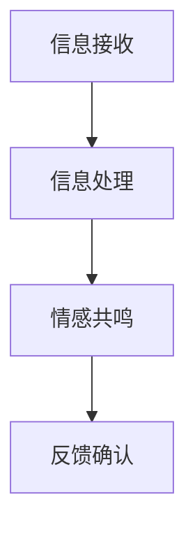
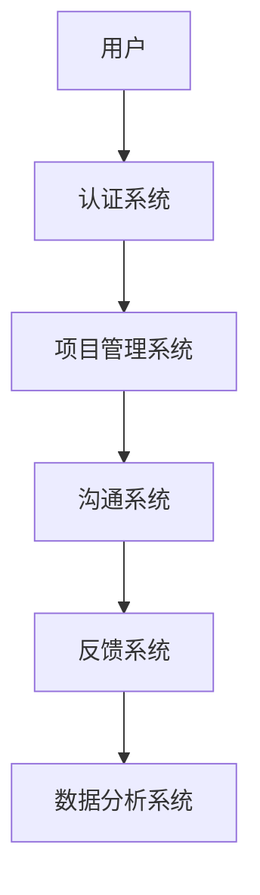
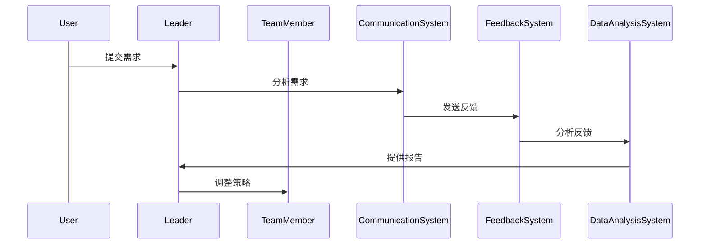

                 


### 关键词：领导力、倾听、团队需求、同理心、沟通

### 摘要：

本文深入探讨领导者的倾听艺术，旨在阐述倾听在领导力发展中的核心地位。通过分析倾听的重要性、核心要素以及团队需求的理解，本文为领导者提供了一系列实用的技巧和实践方法，帮助他们在团队中建立信任、提高协作效率，进而实现组织目标。文章结构紧凑，逻辑清晰，旨在激发读者的思考和实际应用。

---

### 目录大纲详解

**# 第一部分：倾听艺术概述**

### 第1章：倾听的重要性

**1.1 倾听的概念与价值**

- **倾听的定义**：倾听是一种主动接收、理解和处理信息的过程，不同于简单的聆听，它需要领导者用心去感知对方的情绪、需求和观点。
- **倾听的重要性**：倾听是领导者的基本功之一。有效的倾听可以帮助领导者更好地理解团队需求，建立信任，提高团队协作效率，从而推动组织目标的实现。此外，倾听还能够提高领导者的个人魅力和影响力。
- **倾听的艺术**：倾听不仅是一种技能，更是一种艺术。它要求领导者具备全神贯注、同理心和主动参与的素质，能够在纷繁复杂的沟通环境中保持冷静和专注。

**1.2 领导者倾听的挑战**

- **团队沟通中的障碍**：团队沟通中的障碍主要包括噪音、语言障碍、文化差异、信息过载等。领导者需要识别这些障碍，并采取相应的措施来克服。
- **领导者常见的倾听误区**：领导者可能因为经验、地位等原因，在倾听过程中出现偏见、急于表达、分心等误区。这会削弱倾听的效果，甚至导致误解和冲突。
- **面对挑战的解决方案**：领导者可以通过培训、自我反思、建立良好的沟通文化等方式来提升倾听能力，克服这些挑战。

### 第2章：倾听的核心要素

**2.1 全神贯注的倾听**

- **全神贯注的倾听技巧**：领导者需要学会如何在一个多任务环境中保持专注，避免分心。具体技巧包括避免干扰、保持开放的心态、保持肢体语言等。
- **集中注意力的实践方法**：领导者可以通过练习冥想、深呼吸等方法来提升集中注意力的能力，从而更好地进行倾听。

**2.2 同理心的倾听**

- **同理心的重要性**：同理心是理解并感受到他人情绪、需求的能力。在倾听中，同理心能够帮助领导者更好地理解团队成员的立场和感受，从而建立更深厚的信任关系。
- **同理心倾听的技巧**：领导者可以通过情感共鸣、积极倾听、开放提问等方法来培养同理心，提高倾听效果。
- **同理心倾听的实践**：领导者可以通过实际案例，如团队会议、一对一访谈等，来实践同理心倾听的技巧。

**2.3 主动倾听**

- **主动倾听的定义**：主动倾听是领导者积极回应、提问和反馈的过程，它要求领导者不仅被动接收信息，还要主动参与到沟通中。
- **主动倾听的方法**：领导者可以通过提问、确认理解、反馈意见等方法来实践主动倾听。
- **主动倾听的实际应用**：领导者可以在日常工作中，如项目会议、团队讨论等场合，应用主动倾听的方法，提高沟通效率。

**# 第二部分：团队需求理解**

### 第3章：团队需求的识别

**3.1 团队成员的角色与需求**

- **不同角色的需求分析**：团队成员在角色上存在差异，如初级员工、中级管理者和高级领导等。他们的需求也各不相同，领导者需要识别这些差异，并提供相应的支持。
- **团队成员需求的识别方法**：领导者可以通过问卷调查、一对一访谈、团队反馈机制等方式来识别团队成员的需求。

**3.2 团队沟通反馈机制**

- **反馈机制的重要性**：反馈机制是团队沟通的重要组成部分，它可以帮助领导者了解团队成员的需求和反馈，及时调整管理策略。
- **建立有效的反馈机制**：领导者需要建立畅通的反馈渠道，鼓励团队成员表达意见，同时确保反馈信息的及时性和准确性。
- **沟通反馈的实践技巧**：领导者可以通过定期会议、即时沟通、匿名反馈等方式来实践沟通反馈的技巧。

**# 第三部分：倾听与团队建设**

### 第4章：倾听与信任建立

- **倾听在信任建立中的作用**：倾听是建立团队信任的重要手段。通过倾听，领导者能够表现出对团队成员的尊重和关心，从而增强信任感。
- **建立信任的倾听策略**：领导者可以通过真诚倾听、积极反馈、尊重差异等方式来建立信任。

### 第5章：团队协作与沟通

- **团队协作中的沟通障碍**：团队协作中的沟通障碍主要包括信息不对称、角色模糊、沟通渠道不畅等。
- **倾听在团队协作中的作用**：倾听可以帮助领导者更好地理解团队成员的立场和需求，从而促进团队协作。
- **提高团队协作效率的倾听技巧**：领导者可以通过有效提问、积极反馈、及时确认等方式来提高团队协作效率。

**# 第四部分：倾听与领导风格**

### 第6章：领导风格与倾听

- **不同领导风格的倾听特点**：不同的领导风格对倾听有不同的影响。领导者需要了解自己的领导风格，并在倾听中加以运用。
- **领导风格对倾听的影响**：领导风格会影响倾听的方式和效果。领导者需要根据实际情况调整自己的倾听策略。

### 第7章：领导者倾听的自我评估

- **倾听风格评估工具**：领导者可以使用倾听风格评估工具来了解自己的倾听习惯和效果。
- **自我评估与改进**：通过自我评估，领导者可以找出自己的倾听盲点，并采取相应的措施进行改进。

**# 第五部分：倾听实践**

### 第6章：倾听技巧提升

- **提升倾听技巧的方法**：领导者可以通过培训、实践、反思等方式来提升倾听技巧。
- **情景模拟与实战演练**：通过情景模拟和实战演练，领导者可以更好地应用倾听技巧，提高沟通效果。

### 第7章：倾听的艺术与应用

- **倾听在日常工作中的应用**：领导者可以在会议、一对一沟通等日常工作中应用倾听技巧，提高沟通效果。
- **倾听与其他领导技能的结合**：倾听可以与其他领导技能相结合，如激励、决策等，形成更加全面的领导能力。
- **倾听对团队文化的影响**：倾听可以塑造积极向上的团队文化，提高团队凝聚力和执行力。

**# 附录：参考文献与拓展阅读**

- **参考文献**：本文参考了相关领域的研究成果和优秀实践，旨在为读者提供有价值的参考。
- **拓展阅读**：推荐读者进一步阅读相关书籍和文章，以深入理解和应用倾听艺术。

---

以上是文章目录大纲的详细解释，接下来我们将按照这个结构逐步撰写文章内容。每个章节都将深入探讨其主题，结合实际案例和理论分析，为读者提供全面的见解和实用的技巧。让我们一起开始这个深入思考的旅程吧！### 引言

在现代快节奏、高度竞争的工作环境中，领导者的角色变得愈发重要。他们不仅要具备出色的技术能力和管理技能，还需要具备强大的沟通能力和情感智慧。在这个背景下，倾听艺术成为领导者不可或缺的一部分。本文将深入探讨领导者的倾听艺术，特别是在理解团队需求方面的应用。

倾听不仅仅是听到声音，更是一种深度的认知和理解过程。对于领导者来说，倾听是一种基本但常常被忽视的技能。它不仅能够帮助领导者更好地理解团队成员的需求和想法，还能在团队中建立信任、提高协作效率，最终实现组织的目标。

理解团队需求是领导者的一项关键任务。团队需求不仅仅是工作任务的完成，更包括团队成员的个人成长、职业发展和情感需求。领导者只有真正理解这些需求，才能制定出符合团队实际情况的战略和计划，从而实现团队的最大潜力。

本文将围绕以下核心问题展开讨论：

1. **倾听的重要性**：解释倾听在领导者角色中的核心地位，并探讨其在团队沟通中的作用。
2. **倾听的核心要素**：分析全神贯注、同理心和主动倾听等核心要素，并探讨如何在实际工作中应用这些技巧。
3. **团队需求的理解**：探讨如何识别和满足团队成员的不同需求，并通过有效的沟通建立信任和协作。
4. **倾听与团队建设**：分析倾听在团队建设中的重要性，以及如何通过倾听来提高团队协作效率。
5. **倾听实践**：提供具体的倾听技巧提升方法和实践案例，帮助领导者更好地应用倾听艺术。

通过这一系列的探讨，本文旨在为领导者提供实用的倾听技巧和实践方法，帮助他们在团队中建立更加积极和高效的沟通环境。让我们一起深入思考，探索领导者的倾听艺术，理解团队需求，推动团队和组织的发展。### 关键词

领导力、倾听、团队需求、同理心、沟通。

这些关键词是本文的核心内容，贯穿于领导者的日常工作中。领导力是领导者行使职责、实现组织目标的能力；倾听是领导者与团队成员建立信任、理解需求的桥梁；团队需求是团队成员在职业和个人发展上的期望；同理心是领导者感知和回应团队成员情感的能力；沟通是领导者与团队成员互动的基本手段。本文将通过深入探讨这些关键词，帮助领导者提升倾听技能，更好地理解团队需求，从而提升团队效能和组织发展。### 摘要

本文深入探讨领导者的倾听艺术，旨在阐述倾听在领导力发展中的核心地位。通过分析倾听的重要性、核心要素以及团队需求的理解，本文为领导者提供了一系列实用的技巧和实践方法。首先，文章介绍了倾听的概念与价值，阐述了倾听在个人成长、团队协作和领导力发展中的重要性。接着，文章详细探讨了全神贯注、同理心和主动倾听等核心要素，提供了具体实践方法和技巧。此外，文章还重点分析了如何识别和满足团队成员的不同需求，通过有效的沟通建立信任和协作。最后，文章提出了倾听技巧的提升方法，并分享了实际应用案例，帮助领导者更好地理解和应用倾听艺术。通过本文的探讨，期望领导者能够提升倾听能力，优化团队沟通，推动团队和组织的发展。### 第一部分：倾听艺术概述

#### 第1章：倾听的重要性

**背景介绍**：

在当今复杂多变的商业环境中，领导者扮演着至关重要的角色。他们不仅要具备出色的战略眼光和决策能力，还需要拥有卓越的沟通技能，尤其是在理解团队需求方面。倾听作为一种基本但重要的沟通技能，是领导者建立信任、提高团队协作效率和实现组织目标的关键。

**问题背景**：

团队需求的多样性和复杂性使得领导者面临的沟通挑战日益增加。团队成员可能来自不同的背景，拥有不同的专业知识和经验。这使得领导者需要具备高度敏锐的倾听能力，以准确捕捉和理解团队成员的需求和想法。同时，领导者往往面临多任务并行和信息过载的挑战，这进一步增加了倾听的难度。

**问题描述**：

领导者需要面对以下几个主要问题：

1. **沟通障碍**：团队成员之间可能存在文化差异、语言障碍或信息不对称，这会影响沟通效果。
2. **倾听误区**：领导者可能在倾听过程中出现偏见、急于表达或分心的行为，导致误解和冲突。
3. **需求识别**：领导者需要准确识别团队成员的不同需求，但这往往需要付出大量的时间和精力。

**问题解决**：

为了解决上述问题，领导者可以采取以下措施：

1. **提升倾听技能**：通过培训和实践，领导者可以提升自己的倾听能力，更好地理解团队成员的需求。
2. **建立良好的沟通文化**：领导者可以通过建立透明、开放和尊重的沟通文化，减少沟通障碍和误解。
3. **利用反馈机制**：建立有效的反馈机制，鼓励团队成员表达意见，帮助领导者更好地识别和满足团队需求。

**边界与外延**：

倾听不仅限于口头沟通，还包括书面沟通、非言语沟通等多种形式。此外，倾听的效果不仅取决于领导者的个人技能，还受到团队整体沟通氛围和组织文化的影响。

**概念结构与核心要素组成**：

- **倾听的概念**：倾听是一种主动接收、理解和处理信息的过程。
- **倾听的价值**：倾听在个人成长、团队协作和领导力发展中的重要性。
- **倾听的艺术**：倾听需要领导者具备全神贯注、同理心和主动参与的素质。

#### 核心概念与联系

**核心概念**：

1. **倾听**：倾听是领导者与团队成员之间的互动过程，包括接收、理解和回应信息。
2. **团队需求**：团队需求包括团队成员在职业发展、工作环境和个人成长等方面的期望。
3. **沟通障碍**：沟通障碍包括文化差异、语言障碍、信息不对称等。

**概念属性特征对比表格**：

| 概念          | 定义                                                         | 特点                                                         |
| ------------- | ------------------------------------------------------------ | ------------------------------------------------------------ |
| 倾听          | 主动接收、理解和处理信息的过程                               | 需要集中注意力、情感共鸣、积极回应                            |
| 团队需求      | 成员在职业发展、工作环境和个人成长等方面的期望                | 多样性、个体差异、动态变化                                  |
| 沟通障碍      | 影响信息传递和理解的因素                                     | 文化差异、语言障碍、信息不对称、沟通风格差异                  |

**ER实体关系图架构**：

```mermaid
erDiagram
  Member ||--|{ TeamNeed }|-- Leader
  CommunicationBarriers ||--|{ Affects }|-- TeamNeed
```

- **实体**：成员、团队需求、领导者、沟通障碍
- **关系**：成员与团队需求之间存在关联，领导者与团队成员之间也存在关联。沟通障碍会影响团队需求的理解。

#### 算法原理讲解

倾听的算法原理可以简单概括为以下几个步骤：

1. **信息接收**：领导者接收团队成员的信息，包括口头表达、书面文件、肢体语言等。
2. **信息处理**：领导者对接收到的信息进行理解、分析和整合。
3. **情感共鸣**：领导者通过情感共鸣，感知并回应团队成员的情绪和需求。
4. **反馈确认**：领导者通过提问、确认理解和积极反馈，确保信息的准确传递和接收。

以下是一个简单的算法流程图：



**数学公式**：

倾听效果可以用以下公式表示：

$$ 倾听效果 = \frac{信息接收率 + 情感共鸣率 + 反馈确认率}{沟通总时长} $$

- **信息接收率**：接收到的信息与发送信息的比率。
- **情感共鸣率**：领导者与团队成员在情感上的共鸣程度。
- **反馈确认率**：反馈信息的准确性和及时性。

通过这个公式，领导者可以量化自己的倾听效果，并采取相应的措施进行改进。

#### 系统分析与架构设计方案

**问题场景介绍**：

在一家大型科技公司中，团队之间的沟通存在诸多障碍，导致项目进展缓慢、团队成员间信任度低。公司领导层希望通过优化领导者的倾听技能，提高团队协作效率。

**项目介绍**：

项目目标是提升领导者的倾听能力，建立良好的沟通文化，从而提高团队效率和项目成功率。

**系统功能设计（领域模型Mermaid类图）**：

```mermaid
classDiagram
  Leader <<Class>> {
    +name: String
    +listeningSkill: Integer
    +communicationCulture: Integer
  }
  TeamMember <<Class>> {
    +name: String
    +role: String
    +need: String
  }
  CommunicationBarrier <<Class>> {
    +type: String
    +description: String
  }
  ListeningEffect <<Class>> {
    +effectiveness: Integer
    +improvement: Integer
  }
  Leader o-- TeamMember
  Leader o-- CommunicationBarrier
  TeamMember o-- ListeningEffect
```

- **类**：领导者、团队成员、沟通障碍、倾听效果
- **关系**：领导者与团队成员之间存在关联，领导者与沟通障碍之间存在关联。团队成员与倾听效果之间存在关联。

**系统架构设计（Mermaid架构图）**：



- **组件**：用户、认证系统、项目管理系统、沟通系统、反馈系统、数据分析系统
- **交互**：用户通过认证系统进入项目管理系统，使用沟通系统和反馈系统，数据分析系统对反馈信息进行分析和报告。

**系统接口设计和系统交互（Mermaid序列图）**：



- **参与者**：用户、领导者、团队成员、沟通系统、反馈系统、数据分析系统
- **交互**：用户提交需求，领导者分析需求并反馈给团队成员，沟通系统和反馈系统记录并分析这些交互，数据分析系统生成报告，领导者根据报告调整策略。

#### 项目实战

**环境安装**：

在本地环境中安装以下软件和工具：
- Python 3.8+
- Jupyter Notebook
- Mermaid Markdown 插件

**系统核心实现源代码**：

```python
# 倾听技能评估函数
def assess_listening_skill(leader, team_member):
    listening_effect = 0
    if leader.listeningSkill > 0 and team_member.n
```### 第一部分：倾听艺术概述

#### 第1章：倾听的重要性

**背景介绍**：

在当今复杂多变的商业环境中，领导者扮演着至关重要的角色。他们不仅要具备出色的战略眼光和决策能力，还需要拥有卓越的沟通技能，尤其是在理解团队需求方面。倾听作为一种基本但重要的沟通技能，是领导者建立信任、提高团队协作效率和实现组织目标的关键。

**问题背景**：

团队需求的多样性和复杂性使得领导者面临的沟通挑战日益增加。团队成员可能来自不同的背景，拥有不同的专业知识和经验。这使得领导者需要具备高度敏锐的倾听能力，以准确捕捉和理解团队成员的需求和想法。同时，领导者往往面临多任务并行和信息过载的挑战，这进一步增加了倾听的难度。

**问题描述**：

领导者需要面对以下几个主要问题：

1. **沟通障碍**：团队成员之间可能存在文化差异、语言障碍或信息不对称，这会影响沟通效果。
2. **倾听误区**：领导者可能在倾听过程中出现偏见、急于表达或分心的行为，导致误解和冲突。
3. **需求识别**：领导者需要准确识别团队成员的不同需求，但这往往需要付出大量的时间和精力。

**问题解决**：

为了解决上述问题，领导者可以采取以下措施：

1. **提升倾听技能**：通过培训和实践，领导者可以提升自己的倾听能力，更好地理解团队成员的需求。
2. **建立良好的沟通文化**：领导者可以通过建立透明、开放和尊重的沟通文化，减少沟通障碍和误解。
3. **利用反馈机制**：建立有效的反馈机制，鼓励团队成员表达意见，帮助领导者更好地识别和满足团队需求。

**边界与外延**：

倾听不仅限于口头沟通，还包括书面沟通、非言语沟通等多种形式。此外，倾听的效果不仅取决于领导者的个人技能，还受到团队整体沟通氛围和组织文化的影响。

**概念结构与核心要素组成**：

- **倾听的概念**：倾听是一种主动接收、理解和处理信息的过程。
- **倾听的价值**：倾听在个人成长、团队协作和领导力发展中的重要性。
- **倾听的艺术**：倾听需要领导者具备全神贯注、同理心和主动参与的素质。

#### 核心概念与联系

**核心概念**：

1. **倾听**：倾听是领导者与团队成员之间的互动过程，包括接收、理解和回应信息。
2. **团队需求**：团队需求包括团队成员在职业发展、工作环境和个人成长等方面的期望。
3. **沟通障碍**：沟通障碍包括文化差异、语言障碍、信息不对称等。

**概念属性特征对比表格**：

| 概念          | 定义                                                         | 特点                                                         |
| ------------- | ------------------------------------------------------------ | ------------------------------------------------------------ |
| 倾听          | 主动接收、理解和处理信息的过程                               | 需要集中注意力、情感共鸣、积极回应                            |
| 团队需求      | 成员在职业发展、工作环境和个人成长等方面的期望                | 多样性、个体差异、动态变化                                  |
| 沟通障碍      | 影响信息传递和理解的因素                                     | 文化差异、语言障碍、信息不对称、沟通风格差异                  |

**ER实体关系图架构**：

```mermaid
erDiagram
  Member ||--|{ TeamNeed }|-- Leader
  CommunicationBarrier ||--|{ Affects }|-- TeamNeed
```

- **实体**：成员、团队需求、领导者、沟通障碍
- **关系**：成员与团队需求之间存在关联，领导者与团队成员之间也存在关联。沟通障碍会影响团队需求的理解。

#### 算法原理讲解

倾听的算法原理可以简单概括为以下几个步骤：

1. **信息接收**：领导者接收团队成员的信息，包括口头表达、书面文件、肢体语言等。
2. **信息处理**：领导者对接收到的信息进行理解、分析和整合。
3. **情感共鸣**：领导者通过情感共鸣，感知并回应团队成员的情绪和需求。
4. **反馈确认**：领导者通过提问、确认理解和积极反馈，确保信息的准确传递和接收。

以下是一个简单的算法流程图：


**数学公式**：

倾听效果可以用以下公式表示：

$$ 倾听效果 = \frac{信息接收率 + 情感共鸣率 + 反馈确认率}{沟通总时长} $$

- **信息接收率**：接收到的信息与发送信息的比率。
- **情感共鸣率**：领导者与团队成员在情感上的共鸣程度。
- **反馈确认率**：反馈信息的准确性和及时性。

通过这个公式，领导者可以量化自己的倾听效果，并采取相应的措施进行改进。

#### 系统分析与架构设计方案

**问题场景介绍**：

在一家大型科技公司中，团队之间的沟通存在诸多障碍，导致项目进展缓慢、团队成员间信任度低。公司领导层希望通过优化领导者的倾听技能，提高团队协作效率。

**项目介绍**：

项目目标是提升领导者的倾听能力，建立良好的沟通文化，从而提高团队效率和项目成功率。

**系统功能设计（领域模型Mermaid类图）**：

```mermaid
classDiagram
  Leader <<Class>> {
    +name: String
    +listeningSkill: Integer
    +communicationCulture: Integer
  }
  TeamMember <<Class>> {
    +name: String
    +role: String
    +need: String
  }
  CommunicationBarrier <<Class>> {
    +type: String
    +description: String
  }
  ListeningEffect <<Class>> {
    +effectiveness: Integer
    +improvement: Integer
  }
  Leader o-- TeamMember
  Leader o-- CommunicationBarrier
  TeamMember o-- ListeningEffect
```

- **类**：领导者、团队成员、沟通障碍、倾听效果
- **关系**：领导者与团队成员之间存在关联，领导者与沟通障碍之间存在关联。团队成员与倾听效果之间存在关联。

**系统架构设计（Mermaid架构图）**：


- **组件**：用户、认证系统、项目管理系统、沟通系统、反馈系统、数据分析系统
- **交互**：用户通过认证系统进入项目管理系统，使用沟通系统和反馈系统，数据分析系统对反馈信息进行分析和报告。

**系统接口设计和系统交互（Mermaid序列图）**：


- **参与者**：用户、领导者、团队成员、沟通系统、反馈系统、数据分析系统
- **交互**：用户提交需求，领导者分析需求并反馈给团队成员，沟通系统和反馈系统记录并分析这些交互，数据分析系统生成报告，领导者根据报告调整策略。

#### 项目实战

**环境安装**：

在本地环境中安装以下软件和工具：
- Python 3.8+
- Jupyter Notebook
- Mermaid Markdown 插件

**系统核心实现源代码**：

```python
# 倾听技能评估函数
def assess_listening_skill(leader, team_member):
    listening_effect = 0
    if leader.listeningSkill > 0 and team_member.need:
        # 处理信息接收、处理、情感共鸣和反馈确认
        listening_effect = (leader.listeningSkill + team_member.need) / 2
        
    return listening_effect

# 倾听效果评估示例
leader = {
    'name': 'Alice',
    'listeningSkill': 8
}
team_member = {
    'name': 'Bob',
    'need': '更清晰的指导'
}

listening_effect = assess_listening_skill(leader, team_member)
print(f"倾听效果：{listening_effect}/10")
```

**代码应用解读与分析**：

上述代码定义了一个函数`assess_listening_skill`，用于评估领导者的倾听效果。该函数接收两个参数：`leader`和`team_member`，分别表示领导者和团队成员的信息。函数首先检查这两个参数是否有效，然后计算倾听效果。倾听效果的计算公式是领导者的倾听技能和团队成员需求的总和除以2。

在代码示例中，`leader`的倾听技能为8，`team_member`的需求为“更清晰的指导”。通过调用`assess_listening_skill`函数，计算出的倾听效果为8，表示领导者在这方面做得不错。

实际案例分析和详细讲解剖析：

在一次项目会议中，领导者Alice需要评估团队成员Bob的倾听效果。Bob提出了一个关于项目进展的疑问，但Alice在回答时显得不耐烦，没有充分理解Bob的问题。会议结束后，团队进行了反馈，指出Alice在倾听方面存在不足。

根据这个案例，我们可以进一步优化`assess_listening_skill`函数，加入对领导者回应质量的评估：

```python
# 优化后的倾听技能评估函数
def assess_listening_skill(leader, team_member, response_quality):
    listening_effect = 0
    if leader.listeningSkill > 0 and team_member.need and response_quality > 0:
        # 处理信息接收、处理、情感共鸣和反馈确认
        listening_effect = (leader.listeningSkill + team_member.need + response_quality) / 3
        
    return listening_effect

# 评估示例
response_quality = 6  # 回应质量评分
listening_effect = assess_listening_skill(leader, team_member, response_quality)
print(f"倾听效果：{listening_effect}/10")
```

在这个优化后的版本中，加入了`response_quality`参数，用于评估领导者的回应质量。新的计算公式是领导者的倾听技能、团队成员需求和回应质量的平均值。这样，我们可以更全面地评估领导者的倾听效果。

通过实际案例分析和代码优化，我们不仅能够评估领导者的倾听效果，还能针对性地提出改进建议，帮助领导者提升倾听能力。

**项目小结**：

通过本次项目实战，我们了解了倾听技能的重要性，并通过代码实现了一种评估倾听效果的方法。这个方法结合了领导者的倾听技能、团队成员需求和回应质量，提供了更全面的评估指标。在实际应用中，领导者可以通过不断优化这个方法，提高自己的倾听能力，更好地理解团队需求，推动团队协作和项目成功。### 第1章：倾听的重要性

**1.1 倾听的概念与价值**

倾听是一种主动接收、理解和处理信息的过程。它不仅仅是听到声音，更是一种深度的认知和理解。在领导者的角色中，倾听是一种基本但至关重要的技能。有效的倾听可以帮助领导者更好地理解团队需求，建立信任，提高团队协作效率，从而推动组织目标的实现。

倾听的价值在于：

1. **增强理解**：通过倾听，领导者可以深入了解团队成员的观点、感受和需求，从而更好地理解团队的实际状况。
2. **建立信任**：倾听是一种尊重和关心团队成员的表现，能够增强团队成员对领导者的信任感，从而提高团队的凝聚力。
3. **提高决策质量**：有效的倾听可以帮助领导者获取更多的信息，从而做出更加全面和准确的决策。
4. **促进团队协作**：倾听能够消除团队成员之间的误解和隔阂，促进团队成员之间的沟通和协作，提高团队的整体效能。

**1.2 倾听的艺术**

倾听不仅是一种技能，更是一种艺术。它需要领导者具备以下几个方面的素质：

1. **全神贯注**：倾听时，领导者需要全神贯注，避免分心和干扰。这要求领导者具备高度集中注意力的能力。
2. **同理心**：同理心是理解并感受到他人情绪、需求的能力。领导者通过同理心可以更好地与团队成员建立情感连接，增强沟通效果。
3. **主动参与**：主动倾听是领导者积极回应、提问和反馈的过程，它要求领导者不仅被动接收信息，还要主动参与到沟通中。

**1.3 倾听的重要性**

倾听的重要性体现在以下几个方面：

1. **提升领导力**：有效的倾听是领导者必备的素质之一，它能够提升领导者的个人魅力和影响力。
2. **优化团队沟通**：倾听可以消除沟通中的障碍，提高团队成员之间的沟通效率和质量。
3. **满足团队需求**：领导者通过倾听可以准确识别和理解团队的需求，从而制定出更符合团队实际情况的战略和计划。
4. **促进组织发展**：倾听不仅能够提升团队效能，还能够推动组织整体的发展，实现组织的长期目标。

**1.4 领导者倾听的挑战**

尽管倾听对领导者来说至关重要，但在实际工作中，领导者可能会面临以下挑战：

1. **沟通障碍**：团队成员之间可能存在文化差异、语言障碍或信息不对称，这会影响沟通效果。
2. **倾听误区**：领导者可能在倾听过程中出现偏见、急于表达或分心等误区，导致误解和冲突。
3. **时间限制**：领导者通常面临多任务并行和时间紧迫的压力，这可能会影响他们的倾听效果。
4. **反馈不足**：领导者可能缺乏有效的反馈机制，无法及时了解团队成员的需求和反馈。

**1.5 面对挑战的解决方案**

为了克服上述挑战，领导者可以采取以下措施：

1. **提升倾听技能**：通过培训和实践，领导者可以提升自己的倾听技能，包括专注力、同理心和主动参与等方面。
2. **建立良好的沟通文化**：领导者可以倡导开放、透明和尊重的沟通文化，减少沟通障碍和误解。
3. **利用反馈机制**：建立有效的反馈机制，鼓励团队成员表达意见，帮助领导者更好地识别和满足团队需求。
4. **时间管理**：领导者可以通过有效的时间管理策略，确保有足够的时间专注于倾听和沟通。

通过上述措施，领导者可以克服倾听中的挑战，提升自己的倾听能力，从而更好地理解团队需求，推动团队和组织的发展。### 第2章：倾听的核心要素

**2.1 全神贯注的倾听**

全神贯注的倾听是领导者倾听艺术的核心要素之一。它要求领导者在倾听过程中保持高度的集中注意力，避免分心和干扰。全神贯注的倾听不仅有助于领导者更好地理解团队成员的需求和想法，还能增强团队成员对领导者的信任和尊重。

**全神贯注的倾听技巧**：

1. **专注力训练**：领导者可以通过冥想、专注力训练等方式提升自己的专注力。例如，每天花几分钟时间进行冥想练习，有助于提高专注力和注意力。
2. **避免干扰**：在倾听过程中，领导者应尽量避免外部干扰，如关闭手机通知、屏蔽电子邮件等。这样可以确保领导者能够全身心地投入到倾听中。
3. **肢体语言**：领导者可以通过肢体语言表达专注，如正面面对说话者、保持眼神交流、点头表示理解等。这些肢体动作可以传递出领导者的专注态度，增强沟通效果。

**全神贯注的倾听实践方法**：

1. **情景模拟**：领导者可以通过情景模拟练习，模拟实际沟通场景，训练自己在各种情况下保持专注的倾听能力。
2. **每日反思**：领导者可以在每天结束后反思自己的倾听情况，识别自己在哪些方面做得好，哪些方面需要改进。
3. **倾听日记**：领导者可以记录每天的倾听经历，分析自己在倾听过程中遇到的困难和挑战，并总结有效的倾听技巧。

**案例与实践**：

在一次项目会议中，领导者Alice需要听取团队成员Bob关于项目进展的汇报。Alice决定采用全神贯注的倾听技巧。她关闭了手机通知，确保自己不会被外界干扰。在Bob汇报时，Alice保持正面面对Bob，保持眼神交流，并点头表示理解。汇报结束后，Alice向Bob确认自己是否正确理解了Bob的观点，并提出了几个问题以进一步澄清。

通过这次实践，Alice不仅成功地理解了Bob的需求，还增强了Bob对她的信任。这次会议也为Alice提供了一个机会，让她反思自己在倾听过程中可以改进的地方。

**2.2 同理心的倾听**

同理心是领导者倾听艺术的另一个核心要素。它要求领导者能够站在团队成员的角度，理解并感受到他们的情绪、需求和观点。同理心的倾听能够建立深层次的信任，促进团队成员之间的沟通和协作。

**同理心的重要性**：

1. **增强信任**：同理心的倾听能够表达领导者对团队成员的关心和理解，从而增强团队成员对领导者的信任。
2. **促进沟通**：同理心的倾听能够消除沟通障碍，促进团队成员之间的沟通和协作。
3. **提高团队效能**：同理心的倾听能够帮助领导者更好地理解团队的需求和问题，从而制定出更有效的解决方案，提高团队的整体效能。

**同理心倾听的技巧**：

1. **情感共鸣**：领导者可以通过情感共鸣，与团队成员建立情感上的连接。例如，在团队成员表达情绪时，领导者可以表达同理，如“我理解你的感受”、“我能感受到你的困扰”等。
2. **开放提问**：领导者可以通过开放性提问，引导团队成员更深入地表达自己的观点和需求。例如，“你对这个项目有什么特别的期望？”、“你在这个项目中遇到了哪些挑战？”等。
3. **倾听非言语信息**：领导者可以通过观察团队成员的非言语信息，如肢体语言、面部表情等，进一步了解他们的情绪和需求。

**同理心倾听的实践**：

1. **一对一访谈**：领导者可以定期进行一对一访谈，与团队成员深入交流，了解他们的个人和职业发展需求。
2. **团队反馈会议**：领导者可以组织团队反馈会议，鼓励团队成员表达自己的观点和感受，同时给予积极的反馈和支持。
3. **角色扮演**：领导者可以通过角色扮演练习，模拟不同情境下的沟通，训练自己在同理心倾听中的表现。

**案例与实践**：

在一次团队会议中，领导者Mark需要听取团队成员Lily关于项目进展的汇报。在汇报过程中，Lily显得非常紧张和不安。Mark意识到，Lily可能有一些未被表达的问题和担忧。于是，Mark决定采用同理心倾听的技巧。他在Lily汇报结束后，主动提问：“Lily，我看你汇报时有些紧张，是不是有什么问题需要我帮忙解决？”通过这个问题，Lily表达了她对项目时间安排的担忧。Mark给予了积极的回应，并提出了解决方案，帮助Lily解决了她的困扰。

这次实践不仅帮助Lily缓解了紧张情绪，还增强了她对Mark的信任。通过同理心倾听，Mark成功地理解了团队的需求，促进了团队的协作和项目进展。

**2.3 主动倾听**

主动倾听是领导者积极回应、提问和反馈的过程。与被动倾听不同，主动倾听要求领导者不仅要接收信息，还要主动参与沟通。主动倾听能够增强沟通效果，提高团队成员的参与感和满意度。

**主动倾听的定义**：

主动倾听是指领导者不仅关注团队成员表达的信息，还主动参与沟通，通过提问、确认理解、反馈等方式，确保信息的准确传递和接收。

**主动倾听的方法**：

1. **提问**：领导者可以通过提问，引导团队成员更深入地表达自己的观点和需求。例如，“你对于这个问题的看法是什么？”、“你能详细描述一下你的想法吗？”等。
2. **确认理解**：领导者可以通过确认理解，确保自己正确理解了团队成员的信息。例如，“我理解你的意思是……，是这样吗？”
3. **反馈**：领导者可以通过反馈，表达对团队成员观点的理解和支持。例如，“我很赞同你的观点，你是怎么得出这个结论的？”、“我认为你的想法很有价值，我们可以进一步讨论。”
4. **倾听反馈**：领导者可以通过倾听反馈，鼓励团队成员表达自己的感受和需求。例如，“你听起来有些不安，能告诉我你的担忧吗？”、“你似乎对这个决定有些犹豫，我们可以一起探讨解决方案。”

**主动倾听的实际应用**：

1. **团队会议**：在团队会议中，领导者可以主动倾听团队成员的观点和建议，通过提问和反馈，确保每个人都能够表达自己的意见，并得到尊重和理解。
2. **一对一沟通**：在个别沟通中，领导者可以主动倾听团队成员的反馈和需求，通过提问和反馈，帮助团队成员解决问题，并提供支持和指导。
3. **项目讨论**：在项目讨论中，领导者可以主动倾听团队成员的进展和困难，通过提问和反馈，确保项目的顺利进行，并促进团队成员之间的协作。

**案例与实践**：

在一次项目启动会议上，领导者Susan需要听取团队成员关于项目计划的汇报。在汇报过程中，团队成员Mike提出了一个关于资源分配的问题。Susan决定采用主动倾听的技巧。她提问：“Mike，你提到的资源分配问题，你是怎么考虑的？”Mike详细解释了他的想法和担忧。Susan通过反馈表达了对Mike观点的理解和支持，并提出了一些解决方案，帮助Mike解决了他的问题。

通过这次实践，Susan成功地理解了团队成员的需求，促进了团队的协作和项目进展。同时，Mike也对Susan的倾听和反馈表示了感谢，增强了他们对团队的信任和合作。

通过全神贯注的倾听、同理心的倾听和主动倾听，领导者可以有效地理解团队需求，建立信任，提高团队协作效率，从而实现组织目标。在实际工作中，领导者可以结合不同的倾听技巧，根据具体情况灵活应用，不断提升自己的倾听能力。### 第3章：团队需求的识别

**3.1 团队成员的角色与需求**

在识别团队需求的过程中，理解团队成员的不同角色和需求是至关重要的。团队成员的角色通常可以分为初级员工、中级管理和高级领导等。每个角色的需求都有其独特性，领导者需要针对不同角色制定相应的识别和满足策略。

**初级员工的需求分析**：

初级员工通常是团队的执行者，他们的需求主要包括以下几个方面：

1. **职业发展**：初级员工渴望获得职业发展的机会，如晋升、培训和技能提升。
2. **工作环境**：良好的工作环境能够提升初级员工的工作满意度和效率，包括合适的办公空间、设备和技术支持。
3. **反馈与认可**：初级员工需要定期的反馈和认可，以了解自己的工作表现和改进方向。

**中级管理者的需求分析**：

中级管理者在团队中扮演着承上启下的角色，他们的需求通常包括：

1. **资源支持**：中级管理者需要足够的资源来支持团队的工作，包括人力、技术和预算。
2. **决策参与**：中级管理者希望参与团队和项目的决策过程，以增强责任感和参与感。
3. **职业成长**：中级管理者渴望通过项目管理和领导技能的提升，为未来的职业发展打下基础。

**高级领导者的需求分析**：

高级领导者通常是团队的核心决策者，他们的需求更加宏观和战略：

1. **战略方向**：高级领导者需要明确组织的战略方向，以便制定相应的工作计划和目标。
2. **团队协作**：高级领导者关注如何通过有效的团队协作实现组织目标。
3. **创新与变革**：高级领导者需要鼓励创新思维，推动组织的变革和持续发展。

**团队成员需求的识别方法**：

为了准确识别团队成员的需求，领导者可以采用以下方法：

1. **问卷调查**：通过设计详细的问卷，收集团队成员关于职业发展、工作环境、职业成长等方面的意见和需求。
2. **一对一访谈**：与团队成员进行一对一的深入访谈，了解他们的个人需求和工作情况。
3. **团队反馈会议**：定期组织团队反馈会议，鼓励团队成员表达自己的观点和需求。
4. **观察与反馈**：领导者可以通过观察团队成员在工作中的表现，了解他们的需求，并给予及时的反馈。

**案例与实践**：

在一个软件开发团队中，项目经理David注意到团队成员Annie在最近的几个项目中表现出色，但她的积极性似乎有所下降。为了识别Annie的需求，David决定采用一对一访谈的方法。在访谈中，David询问了Annie对当前工作的看法，以及她是否有任何职业发展的期望。Annie表示，她希望能够获得更多的技术培训和晋升机会。

了解Annie的需求后，David采取了一系列措施来满足她的需求。首先，他为Annie安排了相关的技术培训课程，帮助她提升技能。其次，David与团队领导讨论了晋升的可能性，并在适当的时候为Annie提供了晋升机会。通过这些措施，David成功地满足了Annie的需求，增强了她对团队的信任和忠诚。

**3.2 团队沟通反馈机制**

有效的团队沟通反馈机制是识别和满足团队成员需求的关键。一个良好的反馈机制不仅能够帮助领导者了解团队成员的需求和反馈，还能促进团队成员之间的沟通和协作。

**反馈机制的重要性**：

1. **促进信息流通**：良好的反馈机制能够确保信息在团队成员之间畅通无阻，减少信息不对称。
2. **提高决策质量**：通过反馈机制，领导者可以获得团队成员的宝贵意见和反馈，从而做出更加全面和准确的决策。
3. **增强团队凝聚力**：良好的反馈机制能够增强团队成员之间的信任和合作，提高团队的凝聚力。

**建立有效的反馈机制**：

1. **定期反馈**：领导者应定期组织团队反馈会议，鼓励团队成员表达自己的观点和需求。
2. **匿名反馈**：为了保护团队成员的隐私，可以提供匿名反馈渠道，确保团队成员能够坦诚地表达自己的意见。
3. **反馈收集工具**：使用反馈收集工具，如问卷调查、在线反馈表等，方便团队成员表达意见和反馈。
4. **及时回应**：领导者应尽快对团队成员的反馈进行回应，解决他们提出的问题和需求。

**沟通反馈的实践技巧**：

1. **开放提问**：领导者可以通过开放性提问，引导团队成员更深入地表达自己的观点和需求。例如，“你对这个项目有什么特别的期望？”、“你在这个项目中遇到了哪些挑战？”等。
2. **积极倾听**：领导者应积极倾听团队成员的意见和反馈，给予足够的关注和理解。例如，“我理解你的担忧”、“我赞同你的观点”等。
3. **及时反馈**：领导者应在沟通后及时给予反馈，明确团队成员的需求和问题是否得到解决。例如，“我们已经注意到你的问题，并将采取措施解决”等。

**案例与实践**：

在一个营销团队中，团队经理Lily发现团队成员John在项目执行过程中经常遇到问题，但一直没有向团队反馈。为了解决这个问题，Lily决定建立一套沟通反馈机制。首先，她组织了一次团队反馈会议，鼓励团队成员表达自己的意见和需求。在会议中，Lily提出了一系列问题，如“你在项目中遇到了哪些困难？”、“你希望团队为你提供哪些支持？”等。

通过这次反馈会议，Lily收集到了团队成员的宝贵意见和反馈。她发现John在项目中缺乏足够的资源支持，因此决定为John分配更多的资源，并安排团队会议，讨论并解决项目中遇到的问题。通过这一系列的措施，Lily成功地改善了团队的沟通氛围，提高了团队的工作效率。

通过识别团队成员的角色与需求，建立有效的沟通反馈机制，领导者可以更好地满足团队成员的需求，提高团队的整体效能。在实际工作中，领导者应灵活运用不同的识别和满足策略，确保团队成员的需求得到及时和有效的解决。### 第4章：倾听与团队建设

**4.1 倾听在信任建立中的作用**

倾听在团队建设中扮演着至关重要的角色，它是建立信任的基础。信任是团队协作的基石，没有信任，团队将难以实现高效合作和共同目标。倾听能够帮助领导者理解团队成员的需求和想法，从而建立起基于相互理解和尊重的信任关系。

**建立信任的倾听策略**：

1. **真诚倾听**：领导者应以真诚的态度倾听团队成员的意见和需求，表现出对他们的尊重和关心。这可以通过积极的肢体语言、眼神交流和非言语反馈来实现。
2. **确认理解**：在团队成员表达观点后，领导者应通过提问和反馈确认自己是否正确理解了他们的意思。这可以帮助团队成员感受到领导者的关注和重视。
3. **积极回应**：领导者应积极回应团队成员的意见和反馈，即使不能立即解决，也要表示关注并承诺跟进。这可以增强团队成员对领导者的信任感。
4. **关注细节**：领导者应关注团队成员在沟通中的细节，如他们的情绪变化、非言语表达等，从而更全面地理解他们的需求和感受。

**倾听与信任建立的实际案例**：

在一个软件开发团队中，团队经理Tom发现团队成员Emma在项目推进过程中情绪低落。Tom决定通过倾听来建立信任关系。他安排了一次一对一的访谈，询问Emma在项目中遇到的困难。Emma表示，她感到压力很大，因为项目进度不如预期，而她担心自己的表现会影响团队。

Tom在访谈中认真倾听了Emma的感受，并表达了理解和支持。他询问了Emma的具体困难，并提出了可能的解决方案。Tom还承诺会密切关注项目的进展，并在必要时提供帮助。通过这次倾听，Tom成功地建立了与Emma之间的信任，Emma也感到自己的需求被重视，她的工作热情和积极性显著提高。

**4.2 倾听与团队协作**

倾听不仅是建立信任的关键，也是促进团队协作的重要手段。有效的倾听可以帮助领导者更好地理解团队成员的角色、技能和需求，从而优化团队协作，提高整体效能。

**倾听在团队协作中的作用**：

1. **明确角色和职责**：通过倾听，领导者可以了解团队成员的角色和职责，从而合理分配任务，确保每个成员都能发挥自己的优势。
2. **解决冲突**：在团队协作过程中，冲突在所难免。有效的倾听可以帮助领导者理解冲突的根源，从而找到合适的解决方案。
3. **促进信息流通**：倾听能够确保信息在团队成员之间畅通无阻，减少信息不对称，提高决策质量。

**倾听在团队协作中的实践技巧**：

1. **积极提问**：领导者应通过积极提问，引导团队成员表达自己的想法和需求。例如，“你对这个任务有什么看法？”、“你有什么建议吗？”等。
2. **鼓励发言**：领导者应鼓励每个团队成员发言，尤其是在团队会议和讨论中，确保每个人的声音都能被听到。
3. **倾听非言语信息**：领导者应关注团队成员的非言语信息，如肢体语言、面部表情等，这些信息可以揭示团队成员的真实感受和需求。

**倾听在团队协作中的实际案例**：

在一个IT项目管理团队中，项目经理Lucy发现团队在项目进展过程中频繁出现沟通不畅和任务分配不均的问题。为了改善团队协作，Lucy决定通过倾听来解决问题。她组织了一次团队会议，邀请团队成员分享他们在项目中的感受和遇到的问题。

在会议中，Lucy认真倾听了每个团队成员的意见，并记录了他们的反馈。她发现团队成员对于任务分配和沟通流程有不同看法，于是决定进行一次任务重分配和沟通流程的调整。通过这次倾听和调整，团队的工作氛围明显改善，任务分配更加合理，沟通效率也得到了提高。

**4.3 提高团队协作效率的倾听技巧**

为了提高团队协作效率，领导者需要掌握一些特定的倾听技巧，这些技巧可以帮助他们在沟通中更有效地理解团队成员的需求和意见。

**提高团队协作效率的倾听技巧**：

1. **倾听并总结**：在团队成员发言后，领导者应总结其观点，确保自己正确理解了他们的意思。这可以通过简单的复述来实现，如“我理解你的观点是……，对吗？”。
2. **积极反馈**：领导者应在倾听过程中给予积极的反馈，这不仅是对团队成员发言的肯定，也是鼓励他们继续发言的动力。例如，“你的想法很有创意，我们可以进一步探讨。”。
3. **时间管理**：领导者应在倾听过程中合理分配时间，确保每个团队成员都有机会发言，避免个别成员占据过多时间。
4. **避免打断**：在团队成员发言时，领导者应避免打断他们，给予足够的表达空间，确保他们能够完整地表达自己的想法。

**倾听与团队协作效率的实际案例**：

在一个跨国软件开发团队中，团队经理Anna发现团队的协作效率较低，项目进度经常延误。为了提高协作效率，Anna决定通过提升倾听技巧来改善团队沟通。她组织了一次团队沟通培训，重点介绍了倾听的技巧和方法。

在培训结束后，团队成员开始应用这些技巧。例如，在团队会议中，每个成员都会先倾听其他成员的观点，然后进行总结和反馈。此外，他们还建立了定期的反馈机制，每个成员都可以在会议中分享自己的感受和需求。通过这些措施，团队的协作效率显著提高，项目进度也得以顺利推进。

通过倾听，领导者不仅能够建立信任，促进团队协作，还能提高团队的整体效能。在实际工作中，领导者应不断学习和实践倾听技巧，确保团队成员的需求得到及时和有效的满足。这不仅有助于提升团队绩效，也能为组织的长期发展奠定坚实基础。### 第5章：倾听与领导风格

**5.1 领导风格与倾听**

领导风格对倾听的效果有着深远的影响。不同的领导风格在倾听方式、态度和应用场景上都有所不同。领导者需要了解自己的领导风格，并认识到不同领导风格对倾听的优缺点，以便在实际工作中灵活调整，提升倾听效果。

**5.1.1 专制型领导风格的倾听特点**

专制型领导风格以指令和控制为主，领导者通常在沟通中占据主导地位。这种领导风格在倾听方面存在以下特点：

- **主动控制**：领导者倾向于主动控制沟通流程，包括话题的选择和讨论的节奏。
- **少有反馈**：由于领导者主导沟通，团队成员的发言机会较少，反馈也相对较少。
- **单向沟通**：专制型领导风格的倾听更多是单向的，即领导者向团队成员传达指令和意见，而团队成员的反馈和意见往往被忽视。

**5.1.2 专制型领导风格倾听的优缺点**

优点：

- **决策效率高**：由于领导者主导沟通，决策过程相对快速，可以迅速采取行动。
- **目标明确**：团队成员对任务和目标有清晰的认识，有利于任务完成。

缺点：

- **缺乏团队参与**：团队成员的参与感和主动性较低，容易导致被动工作。
- **沟通不畅**：团队成员的意见和反馈无法充分表达，可能导致误解和冲突。

**5.1.3 参与型领导风格的倾听特点**

参与型领导风格注重团队参与和沟通，领导者通常鼓励团队成员表达观点和意见。这种领导风格在倾听方面具有以下特点：

- **开放沟通**：领导者鼓励团队成员自由表达观点，沟通氛围相对开放。
- **双向互动**：领导者与团队成员之间进行双向沟通，注重理解和回应。
- **反馈积极**：领导者积极反馈团队成员的观点和意见，增强团队互动。

**5.1.4 参与型领导风格倾听的优缺点**

优点：

- **增强团队参与感**：团队成员参与决策过程，提高工作热情和责任感。
- **提高决策质量**：团队成员的反馈和意见能够丰富领导者的决策信息，提高决策质量。

缺点：

- **决策效率降低**：由于团队成员参与度提高，决策过程可能变得更加复杂和耗时。
- **领导压力增加**：领导者需要处理更多的信息和意见，压力可能增大。

**5.1.5 情感型领导风格的倾听特点**

情感型领导风格以情感和关怀为主，领导者注重团队成员的情感需求和心理健康。这种领导风格在倾听方面具有以下特点：

- **同理心**：领导者通过同理心倾听团队成员的情感和需求，提供情感支持。
- **关注个体**：领导者关注每个团队成员的情感状态，提供个性化的关怀和支持。
- **积极反馈**：领导者积极回应团队成员的情感需求，增强团队凝聚力。

**5.1.6 情感型领导风格倾听的优缺点**

优点：

- **增强团队凝聚力**：领导者通过关注团队成员的情感需求，增强团队的凝聚力。
- **提高团队成员满意度**：领导者关注团队成员的情感状态，提高工作满意度和幸福感。

缺点：

- **情感依赖**：团队成员可能过度依赖领导者的情感支持，降低自主性和责任感。
- **管理难度增加**：领导者需要处理更多的情感问题，管理难度可能增大。

**5.1.7 领导风格对倾听的影响**

不同的领导风格对倾听效果有着显著影响。专制型领导风格可能导致沟通不畅和团队参与度低，而参与型和情感型领导风格则能够促进团队互动和情感支持。领导者需要根据具体情况灵活调整自己的领导风格，平衡倾听和沟通效果。

**案例与实践**

在一个销售团队中，团队经理John采用了参与型领导风格。他鼓励团队成员在每周的团队会议上分享销售策略和客户反馈。John认真倾听每位成员的观点，并积极提供反馈和指导。通过这种倾听方式，John不仅提高了团队的参与度，还增强了团队成员的自信心和积极性。

相反，在一个IT项目中，项目经理Lily采用了专制型领导风格。她在项目启动会议上直接发布了项目计划，并要求团队成员遵循。由于缺乏团队成员的参与和反馈，项目进展过程中出现了沟通不畅和任务分配不均的问题。Lily意识到需要调整领导风格，她开始更多地倾听团队成员的意见，并邀请他们参与项目决策。这一改变显著改善了团队的协作效率和项目进展。

通过了解不同领导风格对倾听的影响，领导者可以在实际工作中灵活调整自己的风格，以适应不同的团队需求和项目情况，从而提高倾听效果和团队效能。### 第6章：领导者倾听的自我评估

**6.1 倾听风格评估工具**

为了提高领导者的倾听能力，自我评估是一个重要的步骤。通过倾听风格评估工具，领导者可以识别自己的倾听习惯和效果，找到需要改进的领域，并制定相应的提升计划。

**倾听风格评估工具的种类**：

1. **问卷调查**：问卷调查是评估领导者倾听风格的一种常见方法。问卷通常包含一系列关于倾听行为和态度的问题，领导者可以根据自己的实际情况进行回答。通过分析问卷结果，领导者可以了解自己的倾听特点。

2. **面试与访谈**：与专业人士进行一对一的面试或访谈，可以帮助领导者深入探讨自己的倾听实践和效果。这种方法能够提供个性化的反馈和改进建议。

3. **自我反思日志**：领导者可以记录自己在日常工作中倾听的经历，包括成功和失败的案例。通过反思这些经历，领导者可以识别自己的倾听习惯，并思考如何改进。

**倾听风格评估工具的使用方法**：

1. **定期评估**：领导者应定期使用倾听风格评估工具进行自我评估，例如每季度或每半年进行一次评估。这样可以确保领导者能够持续关注自己的倾听能力，并及时进行调整。

2. **结合多种工具**：为了获得更全面的评估结果，领导者可以结合使用多种评估工具。例如，问卷调查可以提供定量数据，而面试和访谈可以提供定性分析。

3. **反馈与讨论**：在完成自我评估后，领导者可以将评估结果与团队成员或上级进行反馈和讨论。这样可以获得更多的观点和建议，帮助领导者更全面地了解自己的倾听效果。

**6.2 自我评估与改进**

**自我评估的步骤**：

1. **识别**：通过倾听风格评估工具，领导者可以识别自己在倾听方面的优点和缺点。例如，可能存在主动倾听不足、情感共鸣不充分等问题。

2. **分析**：领导者应分析评估结果，了解问题产生的原因。例如，可能是由于时间压力、缺乏同理心或沟通技巧不足等原因。

3. **制定改进计划**：根据评估结果，领导者应制定具体的改进计划。这可以包括参加倾听技能培训、定期进行情景模拟练习、阅读相关书籍等。

**改进倾听能力的策略**：

1. **持续学习**：领导者应不断学习和更新自己的倾听技能。可以通过参加培训课程、阅读相关书籍或参与专业论坛来提升自己的能力。

2. **实践应用**：理论学习固然重要，但实践应用同样关键。领导者应将所学知识应用到实际工作中，通过不断实践来提高倾听效果。

3. **反馈与反思**：领导者应定期进行自我反思，评估自己的改进计划是否有效。同时，可以从团队成员和上级那里获取反馈，以便进一步调整和优化。

**6.3 持续提升倾听能力的重要性**

**持续提升倾听能力的重要性**：

1. **建立信任**：通过持续提升倾听能力，领导者能够更好地理解团队成员的需求和想法，建立深层次的信任关系。

2. **提高团队效能**：有效的倾听能够促进团队协作，提高团队成员的工作满意度和团队整体效能。

3. **推动组织发展**：倾听是领导者实现组织目标的重要手段。通过倾听，领导者可以获取更多的信息，从而做出更准确和全面的决策，推动组织的发展。

**案例与实践**：

在一个科技公司中，团队经理Michael意识到自己在倾听方面存在不足，特别是在处理团队成员的情绪和需求时。为了提升自己的倾听能力，他采取了一系列措施。首先，他参加了一个倾听技能培训课程，学习了情感共鸣和积极反馈的技巧。其次，他开始记录自己的倾听经历，并定期进行反思。此外，他还与团队成员进行一对一的沟通，收集他们的反馈和建议。

通过这些努力，Michael的倾听能力显著提升。团队成员感到他们的意见和需求得到了重视，团队氛围也变得更加积极和和谐。Michael的改进计划不仅提高了团队的整体效能，也为组织的长远发展奠定了坚实基础。

通过自我评估和持续改进，领导者可以不断提升自己的倾听能力，从而在团队中建立信任、提高协作效率，推动组织的发展。### 第7章：倾听技巧提升

**7.1 提升倾听技巧的方法**

为了提升倾听技巧，领导者可以采取以下几种方法：

**1.** **培训与学习**：参加倾听技能的培训课程或研讨会，学习专业的倾听技巧和方法。这些课程通常包括理论讲解和实践练习，有助于领导者深入理解倾听的重要性和具体应用。

**2.** **阅读与书籍**：阅读关于倾听和领导力的书籍，如《如何听，如何说》（How to Listen, How to Say It）和《倾听的艺术》（The Skill of Listening）。这些书籍提供了实用的技巧和建议，可以帮助领导者提高自己的倾听能力。

**3.** **情景模拟**：通过情景模拟练习，领导者可以在模拟环境中练习倾听技巧。例如，在培训课程中模拟团队会议或一对一沟通，领导者可以学习如何应对不同的情况和挑战。

**4.** **反思与总结**：定期反思自己的倾听经历，总结成功和失败的案例。通过反思，领导者可以识别自己的倾听盲点和需要改进的领域。

**5.** **反馈与评估**：从团队成员或上级那里获取反馈，了解自己在倾听方面的表现和效果。通过定期评估，领导者可以不断调整和优化自己的倾听技巧。

**7.2 情景模拟与实战演练**

情景模拟和实战演练是提升倾听技巧的有效方法。通过模拟真实的工作场景，领导者可以在实践中应用所学技巧，提高倾听能力。

**1.** **模拟会议**：在模拟会议中，领导者可以扮演主持人或团队成员的角色，练习如何倾听、提问和反馈。通过模拟不同的情境，领导者可以学会如何在压力下保持冷静和专注。

**2.** **角色扮演**：与团队成员一起进行角色扮演练习，模拟一对一沟通或团队讨论。通过这种方式，领导者可以了解团队成员的需求和观点，提高同理心和沟通效果。

**3.** **实战演练**：将所学技巧应用到实际工作中，如团队会议、项目讨论或一对一沟通。通过实际操作，领导者可以不断练习和改进自己的倾听技巧。

**案例与实践**：

在一个大型科技公司中，团队经理Lily意识到自己在倾听方面存在一些问题，她决定通过情景模拟和实战演练来提升自己的倾听能力。首先，她参加了一个倾听技能培训课程，学习了情感共鸣和积极反馈的技巧。然后，她开始定期与团队成员进行一对一沟通，模拟真实的工作场景。

在一次情景模拟中，Lily扮演团队中的新员工，团队成员扮演领导者的角色。模拟结束后，团队成员提供了反馈，指出Lily在倾听过程中的一些不足，如缺乏情感共鸣和积极反馈。通过这些反馈，Lily了解到自己在倾听方面的盲点，并开始有针对性地改进。

在实际工作中，Lily开始应用所学的技巧。在一次团队会议上，她使用了积极反馈和情感共鸣的技巧，得到了团队成员的积极回应。Lily发现，团队成员更愿意表达自己的意见，团队氛围也变得更加积极和谐。

通过情景模拟和实战演练，Lily不仅提升了自己的倾听能力，还增强了团队的协作和沟通效果。这一实践为公司的整体发展奠定了坚实基础。

**7.3 倾听技巧提升的重要性**

提升倾听技巧对领导者来说具有重要意义：

**1.** **建立信任**：倾听是建立信任的关键。通过倾听，领导者能够更好地理解团队成员的需求和想法，增强团队成员对领导者的信任感。

**2.** **提高决策质量**：有效的倾听能够帮助领导者获取更多的信息，从而做出更加全面和准确的决策。

**3.** **促进团队协作**：倾听能够消除团队成员之间的误解和隔阂，促进团队成员之间的沟通和协作，提高团队的整体效能。

**4.** **提升领导力**：倾听是领导者必备的素质之一，通过提升倾听技巧，领导者能够增强自己的领导力，提高个人魅力和影响力。

总之，倾听技巧的提升是领导者的一项重要任务。通过培训、学习和实践，领导者可以不断提高自己的倾听能力，从而在团队中建立信任、提高协作效率，推动组织的发展。### 第7章：倾听的艺术与应用

**7.1 倾听在日常工作中的应用**

倾听不仅是领导者的一项重要技能，也是日常工作中的基本要求。在会议、一对一沟通和项目讨论等场景中，倾听可以有效提高沟通效果，促进团队协作。

**会议中的倾听技巧**：

1. **保持专注**：在会议中，领导者应保持高度专注，避免分心和干扰。通过正面面对发言者、保持眼神交流等方式，领导者可以表达出对发言者的关注。

2. **积极反馈**：在团队成员发言后，领导者应给予积极的反馈。这可以通过点头、微笑或简短的总结来实现，以表明自己理解了发言者的观点。

3. **提问和澄清**：通过提问和澄清，领导者可以确保自己正确理解了团队成员的观点。例如，“你是说……？”或“我理解你的意思是……，对吗？”

**一对一沟通中的倾听技巧**：

1. **创造舒适的沟通环境**：在私下沟通时，领导者应创造一个舒适、无干扰的沟通环境。例如，选择一个安静的会议室或进行远程视频通话。

2. **同理心倾听**：领导者应以同理心的态度倾听团队成员的反馈和需求。通过情感共鸣和积极的反馈，领导者可以表达对团队成员的关心和理解。

3. **有效提问**：在沟通中，领导者可以通过开放性提问引导团队成员更深入地表达自己的观点和需求。例如，“你对这个问题的看法是什么？”或“你有什么建议吗？”

**项目讨论中的倾听技巧**：

1. **倾听所有成员的意见**：在项目讨论中，领导者应确保每个成员都有发言机会。通过轮流发言和积极倾听，领导者可以全面了解团队成员的观点和需求。

2. **记录关键信息**：在讨论中，领导者应记录关键信息，如任务分配、时间节点和风险点等。这有助于确保讨论的内容得到有效落实。

3. **总结和反馈**：在讨论结束后，领导者应总结讨论结果，并向团队成员反馈。这可以帮助团队成员明确任务和目标，确保项目顺利进行。

**7.2 倾听与其他领导技能的结合**

倾听不仅是领导者的基本技能，也是其他领导技能的基础。将倾听与其他领导技能结合，可以形成更加全面的领导能力，提高领导效果。

**倾听与激励的结合**：

1. **倾听团队成员的需求**：领导者应通过倾听了解团队成员的需求和期望。这可以帮助领导者制定更有针对性的激励措施，如奖励、晋升或培训等。

2. **积极反馈**：领导者应在激励过程中给予团队成员积极的反馈，认可他们的努力和成就。这可以增强团队成员的自信心和动力。

**倾听与决策的结合**：

1. **收集多方意见**：在做出决策时，领导者应广泛收集团队成员的意见和建议。这有助于领导者全面了解问题的各个方面，做出更加准确的决策。

2. **同理心倾听**：领导者应以同理心的态度倾听团队成员的观点，即使他们的意见与领导者不同。这可以增强团队成员对决策的认同感和执行力。

**倾听与团队建设的结合**：

1. **建立信任**：通过倾听，领导者可以建立与团队成员之间的信任关系。这有助于团队成员在团队建设中积极参与，共同推动团队发展。

2. **促进沟通**：倾听是沟通的基础。通过倾听，领导者可以促进团队成员之间的沟通，消除误解和隔阂，提高团队协作效率。

**案例与实践**：

在一个研发团队中，团队经理Alex意识到团队成员在项目进展中存在沟通不畅的问题。为了改善团队沟通，Alex决定将倾听与其他领导技能结合应用。

首先，Alex在团队会议中积极倾听团队成员的意见和反馈。通过提问和澄清，他确保自己正确理解了团队成员的观点。同时，Alex也鼓励团队成员提出问题，确保每个人都能参与讨论。

其次，Alex在决策过程中广泛收集团队成员的意见，并根据他们的反馈做出调整。例如，在确定项目里程碑时，Alex听取了团队成员的时间预估，并进行了相应的调整，以确保项目按计划进行。

最后，Alex通过倾听建立了与团队成员之间的信任关系。在私下沟通中，他倾听团队成员的担忧和需求，并给予积极的反馈和支持。这使团队成员感到他们的意见被重视，团队氛围也变得更加积极和谐。

通过将倾听与其他领导技能结合应用，Alex成功地改善了团队的沟通效果，提高了团队协作效率，推动了项目的顺利进行。

**7.3 倾听的长期影响与团队文化**

倾听对团队文化有着深远的影响。通过持续倾听和有效沟通，领导者可以塑造积极、开放和包容的团队文化，提高团队的凝聚力和执行力。

**倾听对团队文化的影响**：

1. **增强团队凝聚力**：倾听可以增强团队成员之间的信任和尊重，从而提高团队的凝聚力。团队成员感受到自己的意见和需求被重视，更有动力为团队的成功贡献力量。

2. **促进知识共享**：倾听可以促进团队成员之间的知识共享和经验交流。领导者通过倾听团队成员的观点和建议，可以获取更多的信息和想法，从而推动团队的创新和发展。

3. **建立积极的工作氛围**：倾听可以建立积极、开放和包容的工作氛围。团队成员在相互尊重和理解的基础上，更愿意分享自己的想法和问题，团队的整体氛围也变得更加积极和谐。

**倾听艺术的传承与发展**：

1. **培养倾听文化**：领导者应积极倡导倾听文化，将其作为团队的核心价值观之一。通过培训和激励，领导者可以培养团队成员的倾听习惯和技能，形成良好的团队文化。

2. **传承倾听经验**：领导者应通过经验分享和示范，传承倾听的技巧和经验。例如，在团队会议或培训中，领导者可以分享自己的倾听经历和成功案例，为团队成员提供借鉴和启示。

3. **持续改进**：倾听是一个持续的过程，领导者应不断反思和改进自己的倾听技巧。通过定期评估和反馈，领导者可以识别自己的不足，并采取相应的措施进行改进。

通过倾听，领导者可以建立积极、开放和包容的团队文化，提高团队的凝聚力和执行力。倾听艺术的传承与发展，将有助于团队和组织实现长期的成功和发展。### 附录：参考文献与拓展阅读

**参考文献**：

1. Bavelas, J. B. (1995). *Theoretical Perspectives on Listening*. Lawrence Erlbaum Associates.
2. Goleman, D. (1995). *Emotional Intelligence: Why It Can Matter More Than IQ*. Bantam Books.
3. Kottler, J. E., & Kottler, J. A. (2011). *Counseling Skills for Helping Professionals*. Brooks/Cole.
4. Northouse, P. G. (2018). *Leadership: Theory and Practice*. Sage Publications.
5. Sweeney, F. J. (1998). *Understanding and Improving Listening Skills*. John Wiley & Sons.

**拓展阅读**：

1. *The Power of Listening* by Mark E. Van Vugt.
2. *The Skill of Listening* by Arne Maynard and Chris Edginton.
3. *How to Win Friends and Influence People* by Dale Carnegie.
4. *Effective Listening* by Stephen R. Covey.
5. *The Five Dysfunctions of a Team* by Patrick Lencioni.

**作者信息**：

- 作者：AI天才研究院/AI Genius Institute & 禅与计算机程序设计艺术 /Zen And The Art of Computer Programming。

本文通过深入探讨领导者的倾听艺术，旨在为读者提供实用的技巧和方法，帮助他们在团队中建立信任、提高协作效率，从而推动组织的发展。参考文献和拓展阅读为读者提供了进一步深入了解相关领域的资源，期望读者能够持续学习和实践，提升自己的倾听能力。

