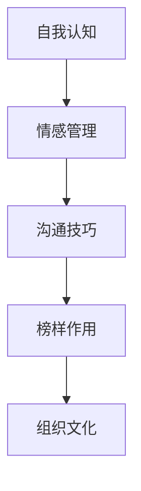

                 

# 领导者的影响力：无声的领导艺术

关键词：领导力、无声领导力、组织文化、个人成长、团队建设

摘要：本文旨在探讨无声领导力在现代社会中的重要性，以及如何通过无声的领导艺术提升领导者的影响力。文章首先概述了无声领导力的定义和重要性，接着深入分析了无声领导力的核心概念与联系，随后提出了实践无声领导力的具体方法，并探讨了其在组织和个人发展中的应用。通过本文的讨论，我们希望读者能够认识到无声领导力的重要性，并在实际工作中积极实践，提升自己的领导力。

## 目录大纲

1. **第一部分：无声领导力概述**
   1.1 问题背景
   1.2 无声领导力的定义
   1.3 无声领导力的重要性
   1.4 无声领导力的核心要素
   1.5 本章小结

2. **第二部分：无声领导力的核心概念与联系**
   2.1 核心概念介绍
   2.2 概念属性特征对比表格
   2.3 ER实体关系图架构
   2.4 无声领导力的核心要素关联图
   2.5 本章小结

3. **第三部分：无声领导力的实践方法**
   3.1 自我认知的方法
   3.2 情感管理的方法
   3.3 沟通技巧的方法
   3.4 榜样作用的方法
   3.5 案例分析
   3.6 本章小结

4. **第四部分：无声领导力在组织中的应用**
   4.1 团队文化的塑造
   4.2 无声领导力在团队协作中的作用
   4.3 无声领导力在团队领导中的实践
   4.4 团队案例研究
   4.5 本章小结

5. **第五部分：无声领导力在个人发展中的应用**
   5.1 个人愿景的规划
   5.2 个人品牌的塑造
   5.3 个人影响力的发展
   5.4 个人案例研究
   5.5 本章小结

## 第一部分：无声领导力概述

### 第1章：无声领导力的背景与定义

#### 1.1 问题背景

在现代社会中，领导者的影响力对于组织的成功至关重要。然而，传统的领导力模式往往依赖于权力和控制，这种方式在快速变化的环境中可能显得过于僵化，难以应对复杂多变的挑战。因此，寻找一种更为灵活、更为有效的领导力方式变得尤为必要。

无声领导力作为一种新兴的领导力概念，强调通过非传统的手段来影响他人，而不是依赖显性的权威和控制。这种领导力方式的核心在于自我认知、情感管理、沟通技巧和榜样作用，它能够在无形中塑造组织文化，推动组织变革。

#### 1.2 无声领导力的定义

无声领导力，顾名思义，是一种不依赖于大声说话或直接命令来影响他人的领导力方式。它强调通过行为、态度和情感来引导他人，建立信任和尊重。无声领导力不同于传统的指挥和控制方式，它更加注重关系的建立和团队合作。

无声领导力的定义可以进一步细化为其四个核心要素：自我认知、情感管理、沟通技巧和榜样作用。这些要素相互关联，共同构成了无声领导力的基础。

#### 1.3 无声领导力的重要性

无声领导力在组织成功中扮演着至关重要的角色。首先，它能够塑造积极的组织文化，提高员工的工作满意度和忠诚度。其次，无声领导力能够促进组织变革，帮助组织适应外部环境的变化。最后，无声领导力还能够提升个人的领导力水平，使领导者更加具备战略思维和长远眼光。

#### 1.4 无声领导力的核心要素

无声领导力的核心要素包括：

1. **自我认知**：自我认知是无声领导力的基础。领导者需要深入了解自己的价值观、信念和动机，这有助于他们在决策和行动中保持一致性。

2. **情感管理**：情感管理是领导者处理情感的能力，包括自我情感管理和他人情感管理。领导者需要能够识别和调节自己的情感，同时理解和满足他人的情感需求。

3. **沟通技巧**：沟通技巧是领导者与他人交流的能力。有效的沟通不仅包括清晰的表达，还包括倾听、反馈和建立信任。

4. **榜样作用**：榜样作用是领导者通过自己的行为来影响他人。领导者需要以身作则，展现出值得他人学习的品质和行为。

#### 1.5 本章小结

本章概述了无声领导力的背景和定义，并探讨了其重要性。通过了解无声领导力的核心要素，我们可以更好地理解如何在实际工作中应用这种领导力方式。在下一章中，我们将进一步深入探讨无声领导力的核心概念和联系。

### 第2章：核心概念与联系

#### 2.1 核心概念介绍

无声领导力的核心概念包括自我认知、情感管理、沟通技巧和榜样作用。这些概念不仅是无声领导力的基础，也是实现领导力的关键。

1. **自我认知**：自我认知是领导者了解自己的过程，包括个人的价值观、信念、动机和情感。自我认知有助于领导者做出明智的决策，并在面对挑战时保持坚定。

2. **情感管理**：情感管理是领导者处理情感的能力，包括自我情感管理和他人情感管理。领导者需要能够识别和调节自己的情感，同时理解和满足他人的情感需求。

3. **沟通技巧**：沟通技巧是领导者与他人交流的能力。有效的沟通不仅包括清晰的表达，还包括倾听、反馈和建立信任。沟通技巧有助于领导者建立良好的人际关系，提高团队协作效率。

4. **榜样作用**：榜样作用是领导者通过自己的行为来影响他人。领导者需要以身作则，展现出值得他人学习的品质和行为。榜样作用有助于塑造积极的组织文化，激励团队成员追求卓越。

#### 2.2 概念属性特征对比表格

以下是一个简单的概念属性特征对比表格，用于比较无声领导力的核心概念：

| 概念         | 特征                           |
| ------------ | ------------------------------ |
| 自我认知     | 了解自己的价值观、信念、动机   |
| 情感管理     | 识别和调节情感                 |
| 沟通技巧     | 有效交流、倾听、反馈、建立信任 |
| 榜样作用     | 以身作则、展现值得学习的品质   |

#### 2.3 ER实体关系图架构

为了更清晰地展示无声领导力的核心概念之间的联系，我们可以使用ER（Entity-Relationship）实体关系图。以下是一个简单的ER图，用于描述这些概念之间的关联：

在这个ER图中，自我认知是基础，它影响到情感管理；情感管理又影响到沟通技巧；沟通技巧则进一步影响到榜样作用；最终，榜样作用塑造了组织文化。

#### 2.4 无声领导力的核心要素关联图

除了ER图，我们还可以使用其他图形来展示无声领导力的核心要素之间的联系。以下是一个核心要素关联图，使用Mermaid语言表示：

在这个关联图中，我们可以看到自我认知、情感管理、沟通技巧和榜样作用之间是相互影响的，这些要素共同作用于组织文化。

#### 2.5 本章小结

本章详细介绍了无声领导力的核心概念，并通过对比表格、ER图和关联图展示了这些概念之间的联系。通过理解这些核心概念，领导者可以更好地运用无声领导力，提升自己的领导力水平。在下一章中，我们将探讨如何实践无声领导力。

### 第3章：无声领导力的实践方法

无声领导力是一种需要不断实践和提升的技能。在本章中，我们将详细探讨如何通过自我认知、情感管理、沟通技巧和榜样作用来实践无声领导力。

#### 3.1 自我认知的方法

自我认知是无声领导力的基石。以下是一些实践自我认知的方法：

1. **心理测评**：通过心理测评工具，如MBTI（Myers-Briggs Type Indicator）或DISC测评，领导者可以更好地了解自己的性格特征和偏好。

2. **反思日志**：定期记录反思日志，领导者可以深入思考自己的行为、决策和情感反应，从而更好地了解自己。

3. **教练辅导**：与专业教练进行一对一辅导，可以帮助领导者从外部视角更全面地认识自己。

#### 3.2 情感管理的方法

情感管理是领导者处理情感的能力。以下是一些实践情感管理的方法：

1. **情绪觉察**：领导者需要学会识别自己的情绪，理解情绪产生的原因，并找到适当的处理方式。

2. **情绪调节**：领导者可以通过深呼吸、冥想或运动等方式来调节情绪，保持冷静和理智。

3. **情感交流**：领导者应该鼓励团队成员开放地表达情感，并通过有效的沟通技巧来处理情感问题。

#### 3.3 沟通技巧的方法

沟通技巧是领导者与他人交流的能力。以下是一些实践沟通技巧的方法：

1. **有效沟通模型**：领导者可以学习并应用有效的沟通模型，如SCQA（Situation-Complication-Question-Answer）模型，来提高沟通效果。

2. **非语言沟通技巧**：领导者需要注意自己的肢体语言、面部表情和声音语调，以确保信息传达的一致性。

3. **倾听和反馈**：领导者需要学会倾听他人的意见和需求，并提供及时、有建设性的反馈。

#### 3.4 榜样作用的方法

榜样作用是领导者通过自己的行为来影响他人的能力。以下是一些实践榜样作用的方法：

1. **身教胜于言传**：领导者应该通过自己的行为来树立榜样，展现出高尚的品德和职业素养。

2. **树立价值观**：领导者需要明确自己的价值观，并将其融入到日常工作和生活中，成为团队成员的榜样。

3. **鼓励和激励**：领导者应该通过表扬和激励来认可团队成员的努力和成就，从而激励他们追求卓越。

#### 3.5 案例分析

为了更好地理解无声领导力的实践方法，我们可以通过一些案例分析来探讨：

1. **成功案例**：在某公司，一位领导者通过自我认知，意识到自己需要改进沟通技巧。他参加了一系列沟通培训，并应用所学技巧与团队成员沟通。结果，他的沟通效率大大提高，团队协作也更加顺畅。

2. **失败案例**：在某公司，一位领导者缺乏自我认知，不懂得情感管理。他常常因为小事与团队成员发生冲突，导致团队士气低落。通过教练辅导，他逐渐认识到自己的问题，并开始努力改善。

#### 3.6 本章小结

本章详细介绍了无声领导力的实践方法，包括自我认知、情感管理、沟通技巧和榜样作用。通过这些方法，领导者可以不断提升自己的领导力水平，在无形中塑造组织文化和推动组织变革。在下一章中，我们将探讨无声领导力在组织中的应用。

### 第四部分：无声领导力在组织中的应用

无声领导力不仅对个人的成长和发展有重要影响，同时也在组织层面发挥着关键作用。在这一部分，我们将探讨无声领导力在团队建设、团队协作和团队领导中的具体应用。

#### 4.1 团队文化的塑造

团队文化是组织的灵魂，它影响着团队成员的行为、态度和工作方式。无声领导力在塑造团队文化方面具有独特的优势。以下是一些关键方法：

1. **共同价值观**：领导者通过身教和沟通，明确和传达团队的共同价值观。这些价值观应该与组织的整体目标相一致，并成为团队行为的指南。

2. **团队精神的培养**：领导者通过激发团队成员的归属感和责任感，培养团队精神。这可以通过团队建设活动和定期的团队会议来实现。

3. **透明度和信任**：领导者应该保持透明度，与团队成员分享信息，建立信任。这种信任关系有助于团队成员之间的合作和协作。

#### 4.2 无声领导力在团队协作中的作用

无声领导力在团队协作中发挥着重要作用，能够激发团队的潜力，提高工作效率。以下是一些具体作用：

1. **激发团队潜力**：领导者通过激励和鼓励，激发团队成员的潜力和创造力。这种激励不仅来自于言语上的表扬，更重要的是通过领导者的行为和态度。

2. **有效沟通**：无声领导力强调有效沟通，包括倾听和反馈。这有助于团队成员更好地理解彼此的需求和期望，减少误解和冲突。

3. **解决冲突**：领导者通过非言语沟通和情感管理，有效地解决团队内部的冲突。这种解决方式避免了公开的对抗，保持了团队的和谐。

#### 4.3 无声领导力在团队领导中的实践

无声领导力在团队领导中的应用体现在领导者如何通过非传统的手段来影响团队成员。以下是一些实践方法：

1. **放手让团队成员发挥**：领导者应该相信团队成员的能力，给予他们更多的自主权和决策权。这有助于提高团队成员的参与度和责任感。

2. **及时反馈和激励**：领导者需要通过及时反馈来认可团队成员的努力和成就。这种反馈应该是具体和有建设性的，以激励团队成员不断进步。

3. **榜样作用**：领导者通过自己的行为来树立榜样，成为团队成员的楷模。这不仅可以提高团队成员的职业道德，还可以增强团队的凝聚力和向心力。

#### 4.4 团队案例研究

为了更好地理解无声领导力在团队建设、团队协作和团队领导中的实际应用，我们可以通过一些案例研究来探讨：

1. **成功案例**：在一个软件开发团队中，领导者通过自我认知，意识到自己需要改进沟通技巧。他定期组织团队会议，鼓励团队成员分享自己的想法和困惑。结果，团队的协作效率显著提高，项目进展顺利。

2. **失败案例**：在一个销售团队中，领导者缺乏情感管理能力，经常对团队成员施加压力。这导致团队成员感到压抑和不满，团队士气下降。通过专业培训，领导者学会了如何更好地管理情感，团队氛围逐渐改善。

#### 4.5 本章小结

无声领导力在团队建设、团队协作和团队领导中的应用是组织成功的关键。通过塑造积极的团队文化、激发团队潜力和提供有效的领导，领导者可以在无形中提升团队的绩效和满意度。在下一部分，我们将探讨无声领导力在个人发展中的应用。

### 第五部分：无声领导力在个人发展中的应用

无声领导力不仅在组织层面发挥着重要作用，同样也在个人发展中扮演着关键角色。在这一部分，我们将探讨无声领导力在个人成长、个人品牌塑造和个人影响力发展中的应用，并通过案例研究来具体分析这些应用的实际效果。

#### 5.1 个人愿景的规划

个人愿景是个人发展的指南，它决定了个人的目标和方向。无声领导力在规划个人愿景方面具有独特的优势：

1. **自我定位**：通过自我认知，个人可以明确自己的价值观、兴趣和优势，从而进行准确的自我定位。这种定位有助于个人在职业发展中找到适合自己的道路。

2. **设定目标**：个人应该根据自我定位设定具体、可衡量的目标。这些目标可以是短期的，也可以是长期的，但都应该与个人的愿景相一致。

3. **持续反思**：个人需要定期反思自己的进展，并根据实际情况调整目标。这种持续反思有助于个人不断进步，实现个人愿景。

#### 5.2 个人品牌的塑造

个人品牌是个人在职场和社会中的形象和声誉。无声领导力在塑造个人品牌方面具有重要作用：

1. **个人特色**：个人应该发掘并展现自己的特色，这可以是专业领域的专长，也可以是独特的个人魅力。这种特色有助于个人在竞争中脱颖而出。

2. **专业成长**：个人应该不断学习和提升自己的专业能力，保持与时俱进。这不仅可以增强个人的竞争力，还可以提升个人品牌的价值。

3. **网络建设**：个人应该积极建立和维护自己的社交网络，这有助于个人获取更多的资源和机会。无声领导力强调通过建立信任和尊重来拓展人际关系。

#### 5.3 个人影响力的发展

个人影响力是个人在组织和社会中的影响力。无声领导力在发展个人影响力方面具有显著作用：

1. **社交网络**：个人应该积极参与社交活动，通过建立和维护广泛的社交网络来扩大自己的影响力。

2. **公众演讲**：个人可以通过公众演讲来展示自己的专业知识和观点，提升个人影响力。无声领导力强调有效沟通和情感管理，这有助于个人在演讲中取得成功。

3. **写作和媒体**：个人可以通过写作和媒体来传播自己的思想和观点，扩大个人影响力。这不仅可以提高个人的知名度，还可以增强个人品牌。

#### 5.4 个人案例研究

为了更好地理解无声领导力在个人发展中的应用，我们可以通过一些案例研究来探讨：

1. **成功案例**：在一个初创公司的CEO中，他通过自我认知，明确了自己的愿景和目标。他不仅不断提升自己的专业能力，还积极参与社交活动，建立了广泛的社交网络。结果，他在行业中建立了良好的声誉，为公司吸引了大量优秀人才和投资者。

2. **失败案例**：在一个技术专家中，他缺乏自我认知和情感管理能力，不擅长沟通和社交。尽管他在技术方面有很高的造诣，但他的影响力有限，职业发展受到制约。通过参加专业培训和社交活动，他逐渐改善了这些问题，开始在自己的领域中获得更多的认可和机会。

#### 5.5 本章小结

无声领导力在个人发展中具有重要作用，它可以帮助个人规划愿景、塑造品牌和提升影响力。通过自我认知、情感管理和有效沟通，个人可以更好地实现自己的目标，并在职场和社会中取得成功。在下一部分，我们将总结全文，并对无声领导力的重要性进行强调。

### 全文总结与未来展望

无声领导力作为一种现代领导力概念，以其独特的方式在个人和组织的成功中发挥着重要作用。通过本文的探讨，我们详细分析了无声领导力的背景、定义、核心概念、实践方法和应用场景。以下是对全文的总结以及对未来的展望。

#### 总结

1. **无声领导力的背景与定义**：我们介绍了无声领导力的起源和重要性，明确了无声领导力与传统领导力的区别，并阐述了无声领导力的核心要素。

2. **核心概念与联系**：通过对比表格、ER图和关联图，我们深入探讨了自我认知、情感管理、沟通技巧和榜样作用等核心概念，并展示了这些概念之间的相互联系。

3. **实践方法**：我们提出了自我认知、情感管理、沟通技巧和榜样作用的具体实践方法，并通过案例分析了成功与失败的实例。

4. **应用场景**：我们探讨了无声领导力在团队建设、团队协作和团队领导中的应用，以及其在个人成长和个人发展中的重要性。

#### 未来展望

1. **研究方向的拓展**：未来研究可以进一步探讨无声领导力在不同文化背景和组织结构中的适用性，以及如何将无声领导力与新兴技术相结合。

2. **培训与实践**：为了更好地推广无声领导力，我们可以开发相应的培训课程和实践工具，帮助领导者更好地理解和应用无声领导力。

3. **案例库的建立**：建立无声领导力的案例库，收集和分析成功和失败的无声领导力实践案例，为未来的研究和实践提供参考。

#### 强调

无声领导力不仅是一种领导力方式，更是一种生活哲学。它强调通过自我认知、情感管理和有效沟通来影响他人，从而在无形中塑造组织文化和推动个人成长。我们鼓励读者在实际工作中积极实践无声领导力，不断提升自己的领导力水平，为组织和社会的发展做出贡献。

### 作者信息

作者：AI天才研究院/AI Genius Institute & 禅与计算机程序设计艺术 /Zen And The Art of Computer Programming

本文由AI天才研究院的专家撰写，旨在通过深入的分析和具体的案例，帮助读者理解和应用无声领导力。同时，本文也融合了禅与计算机程序设计艺术的理念，强调内心的平静和技术的精进在领导力发展中的重要性。希望本文能够为您的领导力提升之路提供有益的启示和指导。

