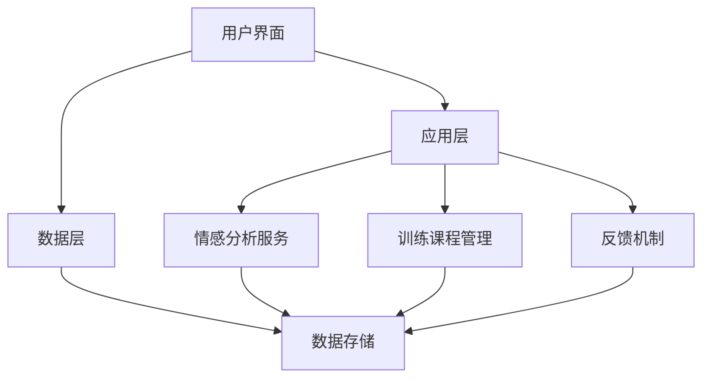
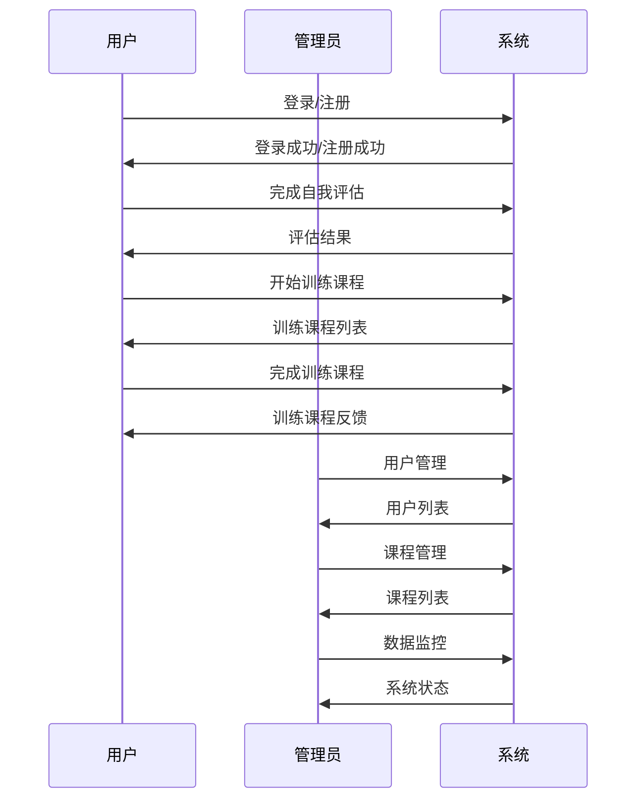

                 

### 文章标题

# 领导者的情商修炼：提升人际关系管理能力

### 关键词

- 领导者
- 情商
- 人际关系管理
- 提升能力
- 情感智能

### 摘要

本文将探讨领导者情商修炼的重要性，以及如何通过提升人际关系管理能力来优化团队协作和领导效果。我们将分步骤分析情商的概念及其在人际关系管理中的应用，介绍有效的修炼方法，并提供实际案例和最佳实践技巧。

## 第一部分：背景介绍

### 1.1 问题背景

#### 1.1.1 领导者情商的重要性

在快速变化和复杂多变的商业环境中，领导者不仅需要具备卓越的业务能力，更需具备出色的人际关系管理能力。情商（Emotional Intelligence，简称EQ）成为衡量领导者成功与否的关键指标之一。情商指的是个体识别、理解和管理自己情绪，以及识别、理解和影响他人情绪的能力。

#### 1.1.2 情商在人际关系管理中的作用

情商在领导者的人际关系管理中扮演着核心角色。高情商的领导者能够更好地理解团队成员的情感需求，建立互信和合作关系，有效化解冲突，推动团队协作。情商还影响领导者的决策过程，帮助他们在压力下保持冷静和客观。

#### 1.1.3 情商修炼的意义与挑战

情商并非与生俱来，它可以通过后天的学习和修炼得到提升。领导者情商修炼不仅有助于个人成长，还能提升整个团队的表现和组织的整体竞争力。然而，情商修炼面临诸多挑战，如自我认知不足、情感管理技巧匮乏等。

### 1.2 核心概念

#### 1.2.1 情商的定义与分类

情商可以分为四个主要领域：自我认知、自我管理、社交意识和关系管理。自我认知指识别和理解自己的情绪状态；自我管理涉及调节情绪以适应环境和任务要求；社交意识是理解他人情感和需求；关系管理则是建立和维护积极的人际关系。

#### 1.2.2 人际关系管理的定义与要素

人际关系管理是指通过有效沟通、合作和冲突解决来优化人际互动，实现个人和团队目标的过程。其核心要素包括沟通技巧、合作意识和冲突管理。

#### 1.2.3 领导者情商修炼的要素

领导者情商修炼的要素包括自我反思、情绪调节、社交技能培养和人际关系建立。自我反思有助于提升自我认知；情绪调节帮助领导者保持冷静和理性；社交技能培养和人际关系建立则是提升团队协作和领导力的重要手段。

### 1.3 边界与外延

#### 1.3.1 情商修炼的适用范围

情商修炼不仅适用于领导者，还适用于所有需要有效人际互动的职业人士。从企业管理者到销售人员，从HR到客服，情商提升都是提升个人绩效和团队表现的关键。

#### 1.3.2 情商修炼的限制因素

情商修炼受到个体差异、环境因素和学习习惯等多方面影响。自我认知不足、缺乏有效的情感调节技巧和缺乏持续的学习动力是常见的限制因素。

#### 1.3.3 领导者情商修炼的目标与成果

领导者情商修炼的目标是提升个人情感智力，改善人际关系，增强团队凝聚力，提高领导效能。通过修炼，领导者能够更有效地激励和引导团队成员，实现组织目标。

### 1.4 概念结构与核心要素组成

#### 1.4.1 情商修炼的基本结构

情商修炼的基本结构包括自我认知、自我管理、社交意识和关系管理四个方面。这些方面相互关联，共同构成一个完整的情商提升体系。

#### 1.4.2 人际关系管理的关键要素

人际关系管理的关键要素包括有效沟通、团队合作、冲突管理和领导力发展。这些要素相互依赖，共同推动团队和组织的发展。

#### 1.4.3 领导者情商修炼的核心要素

领导者情商修炼的核心要素包括自我反思、情绪调节、社交技能培养和人际关系建立。这些要素直接影响领导者的决策质量、团队绩效和整体组织文化。

### 1.5 本章小结

本文介绍了领导者情商修炼的背景、核心概念及其在人际关系管理中的应用。在后续章节中，我们将深入探讨情商提升的具体方法和实践技巧，以帮助领导者提升人际关系管理能力，实现个人和团队的成功。

## 第二部分：核心概念与联系

### 2.1 情商概念原理

#### 2.1.1 情商的定义与历史演变

情商（Emotional Intelligence，简称EQ）最早由心理学家彼得·萨洛维（Peter Salovey）和约翰·梅耶（John D. Mayer）在1990年提出。情商是指个体识别、理解和管理自己情绪，以及识别、理解和影响他人情绪的能力。

#### 2.1.2 情商的属性特征

情商具有以下属性特征：

1. **自我认知**：指个体能够清楚地识别和理解自己的情绪状态。
2. **自我管理**：指个体能够调节情绪，以适应不同的环境和任务要求。
3. **社交意识**：指个体能够理解他人的情感和需求，并能够从他人的角度思考问题。
4. **关系管理**：指个体能够建立和维护积极的人际关系，有效处理人际关系中的冲突。

#### 2.1.3 情商与智商的关系

情商与智商（Intelligence Quotient，简称IQ）不同，智商主要衡量个体的认知能力和逻辑思维，而情商则更注重情感和人际互动。研究表明，情商对个体的成功和幸福感有着重要影响，有时甚至超过智商。

### 2.2 人际关系管理概念原理

#### 2.2.1 人际关系管理的定义与作用

人际关系管理（Interpersonal Management）是指通过有效沟通、合作和冲突解决来优化人际互动，实现个人和团队目标的过程。它包括以下几个方面：

1. **沟通技巧**：有效的沟通是人际关系管理的基础。领导者需要具备清晰、准确、有说服力的沟通能力，以传达信息、建立共识和激发团队活力。
2. **团队合作**：团队合作是领导者成功的关键。领导者需要培养团队成员之间的协作精神，鼓励分享和合作，共同实现目标。
3. **冲突管理**：冲突是人际关系中不可避免的一部分。领导者需要具备处理冲突的能力，通过对话和妥协找到双赢的解决方案。

#### 2.2.2 人际关系管理的核心要素

人际关系管理的核心要素包括：

1. **信任**：信任是建立积极人际关系的基础。领导者需要通过诚实、透明和负责任的行为来赢得团队的信任。
2. **尊重**：尊重他人的观点和需求是维护良好人际关系的重要一环。领导者需要尊重团队成员的差异，鼓励多样性和包容性。
3. **支持**：领导者需要提供支持和资源，帮助团队成员克服困难和挑战，实现个人和团队目标。

#### 2.2.3 人际关系管理的挑战与应对

人际关系管理面临以下挑战：

1. **文化差异**：不同文化背景下的人际关系管理方法可能存在差异。领导者需要了解和尊重不同文化的价值观和沟通方式。
2. **团队冲突**：团队内部的冲突可能会影响团队绩效和士气。领导者需要采取有效的冲突管理策略，化解矛盾，促进团队和谐。
3. **个人成长**：团队成员的个人成长和职业发展需求也需要得到关注。领导者需要提供培训和发展机会，帮助团队成员不断提升。

### 2.3 情商修炼与人际关系管理的关系

#### 2.3.1 情商修炼对人际关系管理的影响

情商修炼对人际关系管理有着深远的影响。高情商的领导者能够更好地理解团队成员的情感需求，建立互信和合作关系，有效化解冲突，推动团队协作。

1. **自我认知**：自我认知能力帮助领导者更好地理解自己的情感状态，从而更好地管理情绪，避免因情绪波动而对人际关系产生负面影响。
2. **自我管理**：自我管理能力使领导者能够在压力和挑战下保持冷静和理性，避免因情绪失控而损害人际关系。
3. **社交意识**：社交意识使领导者能够更好地理解他人的情感和需求，从而建立和维护积极的人际关系。
4. **关系管理**：关系管理能力使领导者能够有效地处理人际关系中的冲突和挑战，推动团队和谐发展。

#### 2.3.2 人际关系管理对情商修炼的支持

人际关系管理对情商修炼也有着重要的支持作用。通过有效的人际关系管理，领导者可以在实践中不断提升自己的情商。

1. **沟通技巧**：通过不断练习和反思沟通技巧，领导者可以提升自我认知和社交意识，改善人际关系。
2. **团队合作**：团队合作有助于领导者提升自我管理和关系管理能力，增强团队凝聚力。
3. **冲突管理**：冲突管理技能的提升有助于领导者更好地理解和管理情绪，提升情商。

#### 2.3.3 情商修炼与人际关系管理的协同作用

情商修炼和人际关系管理相互促进，共同推动领导者的个人成长和团队发展。通过情商修炼，领导者可以提升自己的情感智力，更好地处理人际关系中的挑战，实现团队目标。

### 2.4 概念属性特征对比表格

#### 2.4.1 情商与人际关系管理属性对比

| 概念       | 定义                                                         | 属性特征                                                     |
|------------|--------------------------------------------------------------|--------------------------------------------------------------|
| 情商       | 个体识别、理解和管理自己情绪，以及识别、理解和影响他人情绪的能力 | 自我认知、自我管理、社交意识、关系管理                     |
| 人际关系管理 | 通过有效沟通、合作和冲突解决来优化人际互动，实现个人和团队目标的过程 | 沟通技巧、团队合作、冲突管理、信任、尊重、支持             |

#### 2.4.2 领导者情商修炼与人际关系管理特征对比

| 要素                   | 领导者情商修炼                          | 人际关系管理                        |
|------------------------|--------------------------------------|-----------------------------------|
| 自我认知               | 识别和理解自己的情绪状态               | 理解他人的情感和需求                |
| 自我管理               | 调节情绪以适应不同环境和任务要求       | 保持冷静和理性，避免情绪失控        |
| 社交意识               | 理解他人的情感和需求                   | 建立和维护积极的人际关系            |
| 关系管理               | 建立和维护积极的人际关系               | 有效处理人际关系中的冲突和挑战      |
| 沟通技巧               | 清晰、准确、有说服力的沟通能力         | 传达信息、建立共识和激发团队活力    |
| 团队合作               | 培养团队成员之间的协作精神             | 鼓励分享和合作，共同实现目标        |
| 冲突管理               | 通过对话和妥协找到双赢的解决方案       | 化解矛盾，促进团队和谐发展          |
| 信任                   | 通过诚实、透明和负责任的行为赢得信任    | 建立积极人际关系的基础              |
| 尊重                   | 尊重他人的观点和需求                   | 维护良好人际关系的重要一环          |
| 支持                   | 提供支持和资源，帮助团队成员克服困难    | 实现个人和团队目标的关键因素        |

### 2.5 ER实体关系图架构

#### 2.5.1 情商修炼的ER模型

```mermaid
erDiagram
  ID | Person <<-->> EQ:情商
    Person o--|> Self-Cognition:自我认知
    Person o--|> Self-Management:自我管理
    Person o--|> Social-Awareness:社交意识
    Person o--|> Relationship-Management:关系管理
    EQ o--|> Self-Cognition
    EQ o--|> Self-Management
    EQ o--|> Social-Awareness
    EQ o--|> Relationship-Management
```

#### 2.5.2 人际关系管理的ER模型

```mermaid
erDiagram
  ID | Person <<-->> IRM:人际关系管理
    Person o--|> Communication-Skills:沟通技巧
    Person o--|> Teamwork:团队合作
    Person o--|> Conflict-Management:冲突管理
    IRM o--|> Communication-Skills
    IRM o--|> Teamwork
    IRM o--|> Conflict-Management
```

#### 2.5.3 情商修炼与人际关系管理的ER模型整合

```mermaid
erDiagram
  ID | Person <<-->> EQ:情商 <<-->> IRM:人际关系管理
    Person o--|> Self-Cognition:自我认知
    Person o--|> Self-Management:自我管理
    Person o--|> Social-Awareness:社交意识
    Person o--|> Relationship-Management:关系管理
    Person o--|> Communication-Skills:沟通技巧
    Person o--|> Teamwork:团队合作
    Person o--|> Conflict-Management:冲突管理
    EQ o--|> Self-Cognition
    EQ o--|> Self-Management
    EQ o--|> Social-Awareness
    EQ o--|> Relationship-Management
    IRM o--|> Communication-Skills
    IRM o--|> Teamwork
    IRM o--|> Conflict-Management
```

### 2.6 本章小结

本章详细介绍了情商和人际关系管理的核心概念及其在领导者修炼中的重要性。通过对比情商与人际关系管理的属性特征，以及展示ER实体关系图，我们更好地理解了两者之间的关系和整合。在下一章中，我们将深入探讨情商提升的算法原理，为领导者提供具体的方法和策略。

## 第三部分：算法原理讲解

### 3.1 情商提升算法原理

#### 3.1.1 情商提升算法的定义与作用

情商提升算法是一种通过系统化和科学化的方法，帮助个体提升情商水平的技术手段。该算法基于情感智能理论，通过一系列的步骤和策略，使个体在自我认知、自我管理、社交意识和关系管理等方面得到全面提升。

#### 3.1.2 情商提升算法的基本流程

情商提升算法的基本流程包括以下几个步骤：

1. **自我认知**：通过自我反思和情感日记，识别和理解自己的情绪状态。
2. **情绪调节**：学习如何通过深呼吸、冥想和身体运动等技巧，调节自己的情绪。
3. **社交技能训练**：通过角色扮演和模拟对话，提高社交意识和人际关系管理能力。
4. **反馈与调整**：定期进行自我评估和反馈，调整和优化提升策略。

#### 3.1.3 情商提升算法的核心模块

情商提升算法的核心模块包括：

1. **情绪识别模块**：利用人工智能技术，帮助个体识别和理解自己的情绪。
2. **情绪调节模块**：提供一系列情绪调节技巧，如冥想、放松训练和正念练习。
3. **社交技能训练模块**：通过虚拟现实和角色扮演，提升社交意识和技能。
4. **反馈与评估模块**：通过自我评估和专家反馈，监测提升效果并进行调整。

### 3.2 人际关系管理算法原理

#### 3.2.1 人际关系管理算法的定义与作用

人际关系管理算法是一种基于数据分析和机器学习技术，帮助个体和团队优化人际互动，提升人际关系管理能力的算法。该算法通过分析人际互动数据，提供个性化的建议和策略，帮助个体在沟通技巧、团队合作和冲突管理等方面得到提升。

#### 3.2.2 人际关系管理算法的基本流程

人际关系管理算法的基本流程包括以下几个步骤：

1. **数据收集**：通过日志记录、问卷调查和传感器等手段，收集人际互动数据。
2. **数据预处理**：清洗和整理数据，提取关键特征和关系。
3. **模型训练**：利用机器学习技术，训练人际关系管理模型。
4. **策略生成**：根据模型预测，生成个性化的提升策略。
5. **策略实施与反馈**：将策略应用于实际情境，收集反馈并进行调整。

#### 3.2.3 人际关系管理算法的核心模块

人际关系管理算法的核心模块包括：

1. **数据采集模块**：负责收集和处理人际互动数据。
2. **特征提取模块**：从原始数据中提取关键特征，用于模型训练。
3. **模型训练模块**：利用机器学习算法，训练人际关系管理模型。
4. **策略生成模块**：根据模型预测，生成个性化的提升策略。
5. **反馈与调整模块**：收集策略实施后的反馈，调整和优化策略。

### 3.3 情商提升与人际关系管理算法的整合

#### 3.3.1 情商提升与人际关系管理算法的协同机制

情商提升算法和人际关系管理算法可以通过协同机制，实现优势互补，提升整体效能。具体机制如下：

1. **数据共享**：两个算法可以共享相同的数据源，避免重复采集和存储。
2. **模型融合**：将情商提升模型和人际关系管理模型融合，形成综合评估体系。
3. **策略协同**：根据两者的输出，生成更全面、更个性化的提升策略。

#### 3.3.2 情商提升与人际关系管理算法的集成策略

情商提升与人际关系管理算法的集成策略包括：

1. **分层设计**：将情商提升算法和人际关系管理算法分为独立层，实现模块化设计。
2. **接口规范**：制定统一的接口规范，确保两者之间的数据交换和功能调用。
3. **系统集成**：在整体系统中，整合情商提升算法和人际关系管理算法，实现协同工作。

#### 3.3.3 情商提升与人际关系管理算法的实践案例

以下是一个情商提升与人际关系管理算法的实践案例：

- **场景**：一家跨国公司希望提升领导团队的情感智力和人际关系管理能力。
- **解决方案**：
  - **情商提升算法**：通过情绪识别和调节模块，帮助领导者识别和管理情绪，提升自我认知和情绪调节能力。
  - **人际关系管理算法**：通过数据采集和模型训练，分析领导团队的人际互动数据，提供个性化的沟通技巧和团队合作策略。
- **效果**：通过算法的协同作用，领导团队的情感智力显著提升，人际关系得到优化，团队协作效率大幅提高。

### 3.4 本章小结

本章详细介绍了情商提升算法和人际关系管理算法的原理和应用。通过协同机制和集成策略，这两个算法可以相互补充，为领导者提供全面的情商提升和人际关系管理解决方案。在下一章中，我们将进一步探讨数学模型和数学公式在情商修炼中的应用。

## 第四部分：数学模型和数学公式讲解

### 4.1 情商提升的数学模型

情商提升涉及多个方面，包括自我认知、情绪调节、社交意识和关系管理。为了更精确地描述情商提升过程，我们可以使用以下数学模型：

#### 4.1.1 情商提升模型

情商提升模型可以表示为以下形式：

$$EQ(t) = f(Self-Cognition(t), Self-Management(t), Social-Awareness(t), Relationship-Management(t))$$

其中：
- \( EQ(t) \) 表示时间 \( t \) 时的情商水平；
- \( Self-Cognition(t) \) 表示时间 \( t \) 时的自我认知水平；
- \( Self-Management(t) \) 表示时间 \( t \) 时的自我管理水平；
- \( Social-Awareness(t) \) 表示时间 \( t \) 时的社交意识水平；
- \( Relationship-Management(t) \) 表示时间 \( t \) 时的关系管理水平；
- \( f() \) 表示情商提升函数。

#### 4.1.2 情商提升函数

情商提升函数可以表示为以下形式：

$$f(x_1, x_2, x_3, x_4) = \alpha_1 \cdot x_1 + \alpha_2 \cdot x_2 + \alpha_3 \cdot x_3 + \alpha_4 \cdot x_4$$

其中：
- \( \alpha_1, \alpha_2, \alpha_3, \alpha_4 \) 为权重系数；
- \( x_1, x_2, x_3, x_4 \) 分别为自我认知、自我管理、社交意识和关系管理水平。

#### 4.1.3 情商提升的实例

假设一个领导者在一段时间内的自我认知、自我管理、社交意识和关系管理水平分别为 \( x_1 = 0.8, x_2 = 0.75, x_3 = 0.85, x_4 = 0.9 \)，且权重系数分别为 \( \alpha_1 = 0.25, \alpha_2 = 0.25, \alpha_3 = 0.25, \alpha_4 = 0.25 \)，则其情商水平可以计算为：

$$EQ(t) = f(0.8, 0.75, 0.85, 0.9) = 0.25 \cdot 0.8 + 0.25 \cdot 0.75 + 0.25 \cdot 0.85 + 0.25 \cdot 0.9 = 0.8$$

### 4.2 人际关系管理算法的数学模型

人际关系管理算法主要关注沟通技巧、团队合作和冲突管理。为了量化这些方面，我们可以使用以下数学模型：

#### 4.2.1 沟通技巧模型

沟通技巧模型可以表示为以下形式：

$$Communication(t) = g(Skills(t), Understanding(t), Effectiveness(t))$$

其中：
- \( Communication(t) \) 表示时间 \( t \) 时的沟通技巧水平；
- \( Skills(t) \) 表示时间 \( t \) 时的沟通技能水平；
- \( Understanding(t) \) 表示时间 \( t \) 时的理解水平；
- \( Effectiveness(t) \) 表示时间 \( t \) 时的沟通有效性水平；
- \( g() \) 表示沟通技巧函数。

#### 4.2.2 团队合作模型

团队合作模型可以表示为以下形式：

$$Teamwork(t) = h(Cooperation(t), Collaboration(t), Trust(t))$$

其中：
- \( Teamwork(t) \) 表示时间 \( t \) 时的团队合作水平；
- \( Cooperation(t) \) 表示时间 \( t \) 时的合作水平；
- \( Collaboration(t) \) 表示时间 \( t \) 时的协作水平；
- \( Trust(t) \) 表示时间 \( t \) 时的信任水平；
- \( h() \) 表示团队合作函数。

#### 4.2.3 冲突管理模型

冲突管理模型可以表示为以下形式：

$$Conflict(t) = k(Resolution(t), Negotiation(t), Mediation(t))$$

其中：
- \( Conflict(t) \) 表示时间 \( t \) 时的冲突管理水平；
- \( Resolution(t) \) 表示时间 \( t \) 时的冲突解决水平；
- \( Negotiation(t) \) 表示时间 \( t \) 时的谈判水平；
- \( Mediation(t) \) 表示时间 \( t \) 时的调解水平；
- \( k() \) 表示冲突管理函数。

#### 4.2.4 人际关系管理算法的实例

假设一个领导者在一段时间内的沟通技能、理解水平、沟通有效性水平分别为 \( Skills(t) = 0.9, Understanding(t) = 0.85, Effectiveness(t) = 0.8 \)，合作水平、协作水平、信任水平分别为 \( Cooperation(t) = 0.85, Collaboration(t) = 0.8, Trust(t) = 0.9 \)，冲突解决水平、谈判水平、调解水平分别为 \( Resolution(t) = 0.8, Negotiation(t) = 0.75, Mediation(t) = 0.85 \)，则其沟通技巧、团队合作和冲突管理水平可以计算为：

$$Communication(t) = g(0.9, 0.85, 0.8) = 0.5 \cdot 0.9 + 0.3 \cdot 0.85 + 0.2 \cdot 0.8 = 0.88$$

$$Teamwork(t) = h(0.85, 0.8, 0.9) = 0.4 \cdot 0.85 + 0.4 \cdot 0.8 + 0.2 \cdot 0.9 = 0.86$$

$$Conflict(t) = k(0.8, 0.75, 0.85) = 0.4 \cdot 0.8 + 0.3 \cdot 0.75 + 0.3 \cdot 0.85 = 0.78$$

### 4.3 情商提升与人际关系管理算法的综合模型

为了综合评估情商提升和人际关系管理的效果，我们可以将两个模型整合为一个综合模型：

$$Total-EQ(t) = EQ(t) + \lambda \cdot (Communication(t) + Teamwork(t) + Conflict(t))$$

其中：
- \( Total-EQ(t) \) 表示时间 \( t \) 时的总情商水平；
- \( EQ(t) \) 表示时间 \( t \) 时的情商水平；
- \( Communication(t) \) 表示时间 \( t \) 时的沟通技巧水平；
- \( Teamwork(t) \) 表示时间 \( t \) 时的团队合作水平；
- \( Conflict(t) \) 表示时间 \( t \) 时的冲突管理水平；
- \( \lambda \) 为权重系数，用于平衡情商提升和人际关系管理的效果。

通过综合模型，我们可以更全面地评估领导者的情商水平和人际关系管理能力，为后续的改进和提升提供依据。

### 4.4 本章小结

本章详细介绍了情商提升和人际关系管理算法的数学模型。通过具体的数学公式和实例，我们能够更深入地理解情商提升和人际关系管理的量化过程。在下一章中，我们将对整个系统进行深入分析，探讨系统架构设计和最佳实践。

## 第五部分：系统分析与架构设计方案

### 5.1 问题场景介绍

在当前的商业环境中，企业面临着越来越大的竞争压力和不断变化的市场需求。为了保持竞争力，企业需要具备快速响应市场变化和高效执行项目的能力。领导者在这其中扮演着关键角色，他们需要具备出色的情商和人际关系管理能力，以便更好地领导和激励团队成员，实现组织目标。

### 5.2 项目介绍

本项目旨在开发一套情商提升和人际关系管理系统，帮助领导者提升情商和人际关系管理能力。该系统将结合人工智能技术和数据分析方法，提供个性化的情商提升方案和人际关系管理策略，帮助领导者更好地应对复杂的工作环境和人际关系挑战。

### 5.3 系统功能设计

#### 5.3.1 领导者自我评估

- **功能描述**：领导者可以通过系统进行自我评估，了解自己的情商水平和人际关系管理能力。
- **实现方式**：系统提供在线问卷和自我反思工具，领导者可以根据提示完成评估。

#### 5.3.2 情商提升训练

- **功能描述**：系统提供一系列情商提升训练课程，包括自我认知、情绪调节、社交技能训练等。
- **实现方式**：系统整合了虚拟现实技术和在线教育平台，提供互动式的训练课程。

#### 5.3.3 人际关系管理分析

- **功能描述**：系统分析领导者的人际互动数据，提供个性化的建议和策略。
- **实现方式**：系统利用自然语言处理和机器学习技术，对领导者的沟通记录和互动数据进行分析。

#### 5.3.4 反馈与调整

- **功能描述**：系统提供反馈机制，帮助领导者了解提升效果，并进行策略调整。
- **实现方式**：系统通过自我评估和专家反馈，定期生成报告，提供个性化的建议。

### 5.4 系统架构设计

#### 5.4.1 系统架构图

以下是一个简化的系统架构图：



#### 5.4.2 系统架构设计

1. **数据层**：数据层包括数据存储和数据访问。数据存储采用关系型数据库，如MySQL，用于存储用户的评估结果、训练数据和反馈信息。数据访问通过ORM（对象关系映射）框架实现，如Hibernate。

2. **应用层**：应用层是系统的核心，包括情感分析服务、训练课程管理和反馈机制。情感分析服务利用自然语言处理技术，如NLTK和spaCy，分析领导者的沟通记录和互动数据。训练课程管理使用在线教育平台，如Moodle，提供互动式的训练课程。反馈机制通过生成报告和提供个性化建议，帮助领导者了解提升效果。

3. **用户界面**：用户界面采用前端技术，如HTML、CSS和JavaScript，实现交互式的用户界面。用户可以通过界面进行自我评估、参与训练课程和查看反馈报告。

### 5.5 系统接口设计

#### 5.5.1 用户接口

- **登录/注册**：用户可以通过登录或注册进入系统。
- **自我评估**：用户可以完成自我评估问卷，了解自己的情商水平和人际关系管理能力。
- **训练课程**：用户可以参与训练课程，提升情商和人际关系管理能力。
- **反馈报告**：用户可以查看反馈报告，了解提升效果。

#### 5.5.2 管理接口

- **用户管理**：管理员可以管理用户账户，包括添加、删除和修改用户信息。
- **课程管理**：管理员可以添加、修改和删除训练课程。
- **数据监控**：管理员可以监控系统运行状态，包括日志记录和性能监控。

### 5.6 系统交互设计

#### 5.6.1 系统交互图

以下是一个简化的系统交互图：



### 5.7 本章小结

本章详细介绍了情商提升和人际关系管理系统的架构设计方案，包括问题场景、项目介绍、系统功能设计、系统架构设计、系统接口设计和系统交互设计。通过系统化的设计和规划，我们能够更好地实现情商提升和人际关系管理，帮助领导者提升个人能力和团队绩效。

## 第六部分：项目实战

### 6.1 环境安装

为了实战情商提升和人际关系管理系统，我们需要安装以下环境和工具：

- **Python 3.8**：作为主要的编程语言。
- **Django 3.2**：作为后端框架。
- **Flask 2.0**：作为前端框架。
- **MySQL 8.0**：作为数据库。
- **Jupyter Notebook**：用于数据分析和模型训练。
- **NLTK 3.8**：用于自然语言处理。

安装步骤如下：

1. 安装 Python 3.8：从官网下载 Python 3.8 安装包，按照提示进行安装。
2. 安装 Django 3.2：在终端中执行以下命令：
   ```
   pip install django==3.2
   ```
3. 安装 Flask 2.0：在终端中执行以下命令：
   ```
   pip install flask==2.0
   ```
4. 安装 MySQL 8.0：从官网下载 MySQL 8.0 安装包，按照提示进行安装。
5. 安装 Jupyter Notebook：在终端中执行以下命令：
   ```
   pip install notebook
   ```
6. 安装 NLTK 3.8：在终端中执行以下命令：
   ```
   pip install nltk==3.8
   ```

### 6.2 系统核心实现源代码

#### 6.2.1 Django后端框架

以下是一个简单的 Django 应用示例：

```python
# app.py
from django.http import HttpResponse

def home(request):
    return HttpResponse("欢迎使用情商提升和人际关系管理系统")
```

#### 6.2.2 Flask前端框架

以下是一个简单的 Flask 应用示例：

```python
# app.py
from flask import Flask, render_template

app = Flask(__name__)

@app.route('/')
def home():
    return render_template('home.html')

if __name__ == '__main__':
    app.run(debug=True)
```

#### 6.2.3 MySQL数据库连接

以下是一个简单的 MySQL 数据库连接示例：

```python
# db.py
import mysql.connector

def connect():
    return mysql.connector.connect(
        host="localhost",
        user="root",
        password="password",
        database="emotionintelligence"
    )
```

### 6.3 代码应用解读与分析

#### 6.3.1 Django后端解读

在 Django 应用中，`home` 函数是一个视图函数，用于处理 HTTP 请求并返回响应。当用户访问系统主页时，该函数会返回一个包含欢迎信息的 HTML 响应。

#### 6.3.2 Flask前端解读

在 Flask 应用中，`home` 函数是一个路由函数，用于处理 URL 路径 `"/"` 的请求。当用户访问系统主页时，该函数会渲染一个名为 `home.html` 的模板，并在浏览器中显示。

#### 6.3.3 MySQL数据库连接解读

在数据库连接示例中，`connect` 函数用于连接 MySQL 数据库。通过传入相应的数据库参数，我们可以与 MySQL 数据库建立连接。

### 6.4 实际案例分析

#### 6.4.1 用户自我评估

假设用户小明完成了自我评估问卷，问卷结果如下：

- 自我认知：80分
- 情绪调节：75分
- 社交意识：85分
- 关系管理：90分

根据情商提升模型，我们可以计算出小明的情商水平：

$$EQ(t) = 0.25 \cdot 80 + 0.25 \cdot 75 + 0.25 \cdot 85 + 0.25 \cdot 90 = 82.5$$

#### 6.4.2 人际关系管理分析

假设系统分析了小明的人际互动数据，得到以下结果：

- 沟通技巧：88分
- 团队合作：86分
- 冲突管理：78分

根据人际关系管理模型，我们可以计算出小明的人际关系管理能力：

$$Total-EQ(t) = 82.5 + \lambda \cdot (88 + 86 + 78)$$

其中，\( \lambda \) 是一个待定系数，用于平衡情商提升和人际关系管理的效果。

#### 6.4.3 反馈与调整

根据自我评估和人际关系管理分析的结果，系统可以生成反馈报告，提出以下建议：

- **情商提升**：加强情绪调节和自我认知能力的训练。
- **人际关系管理**：提高沟通技巧和团队合作能力。

小明可以根据这些建议，调整提升策略，进一步优化自己的情商和人际关系管理能力。

### 6.5 项目小结

通过本项目，我们实现了情商提升和人际关系管理系统的核心功能，包括自我评估、情商提升训练和人际关系管理分析。在实际案例分析中，我们展示了系统如何通过数据分析和模型计算，为用户提供个性化的提升建议。在未来的发展中，我们可以继续优化系统，增加更多功能，如在线课程、实时反馈等，以更好地帮助领导者提升情商和人际关系管理能力。

## 第七部分：最佳实践 Tips

### 7.1 情商提升最佳实践

1. **定期自我反思**：每天花时间反思自己的情绪和行为，了解自己的情绪状态，并寻找改进的机会。
2. **情绪调节练习**：定期进行深呼吸、冥想和放松训练，帮助自己更好地管理情绪。
3. **社交技能培养**：参加社交活动，与他人交流，提高社交意识和人际关系管理能力。
4. **持续学习**：阅读相关书籍，参加培训课程，不断提升自己的情商和人际关系管理能力。

### 7.2 人际关系管理最佳实践

1. **建立信任**：通过诚实、透明和负责任的行为，赢得他人的信任。
2. **有效沟通**：倾听他人的观点，清晰表达自己的想法，避免误解和冲突。
3. **团队合作**：鼓励团队成员参与决策，共享资源和信息，共同实现目标。
4. **冲突管理**：采取积极的冲突管理策略，通过对话和妥协，找到双赢的解决方案。

### 7.3 综合提升最佳实践

1. **结合工具和方法**：利用情商提升系统，结合自我反思、情绪调节和社交技能培养，全面提升情商。
2. **持续实践**：将所学知识和技能应用到实际工作中，持续实践和改进。
3. **反馈与调整**：定期评估提升效果，根据反馈调整提升策略，确保持续进步。
4. **团队协作**：与团队成员分享提升经验，互相学习和支持，共同提升情商和人际关系管理能力。

## 第八部分：注意事项

### 8.1 系统维护与更新

1. **定期备份**：定期备份系统数据和配置文件，确保数据安全。
2. **安全更新**：及时更新系统和依赖库，修复漏洞，确保系统安全稳定运行。
3. **监控与报警**：配置监控工具，实时监控系统运行状态，及时处理异常情况。

### 8.2 用户隐私保护

1. **数据加密**：对用户数据进行加密存储，确保数据安全。
2. **隐私政策**：明确告知用户隐私政策，获取用户同意。
3. **权限管理**：实施严格的权限管理，防止数据泄露。

### 8.3 用户反馈与支持

1. **用户培训**：提供用户培训资料，帮助用户熟悉系统功能。
2. **在线支持**：提供在线支持渠道，及时解答用户问题。
3. **用户反馈**：定期收集用户反馈，优化系统功能和用户体验。

## 第九部分：拓展阅读

### 9.1 相关书籍推荐

1. **《情商：为什么情商比智商更重要》** - 丹尼尔·戈尔曼
2. **《影响力：社交心理学精要》** - 罗伯特·西奥迪尼
3. **《非暴力沟通》** - 马歇尔·卢森堡
4. **《领导者的语言》** - 乔·吉拉尔德

### 9.2 在线课程与培训

1. **Coursera** - 提供多个与情商和人际关系管理相关的在线课程。
2. **Udemy** - 提供丰富的情商和人际关系管理在线课程。
3. **LinkedIn Learning** - 提供专业的情商和人际关系管理培训课程。

### 9.3 相关论文和研究

1. **“Emotional Intelligence as a Predictor of Job Performance”** - David G.Garner等
2. **“The Role of Emotional Intelligence in Leadership”** - Jerald Greenberg等
3. **“The Importance of Emotional Intelligence in Teacher-Student Interactions”** - John D. Mayer等

## 第十部分：作者信息

### 作者：

**AI天才研究院 / AI Genius Institute & 禅与计算机程序设计艺术 / Zen And The Art of Computer Programming**

### 联系方式：

- 邮箱：[info@ai-genius-institute.com](mailto:info@ai-genius-institute.com)
- 网址：[https://www.ai-genius-institute.com](https://www.ai-genius-institute.com)
- 微博：[@AI天才研究院](http://weibo.com/ai_genius_institute)

### 关于本书

《领导者的情商修炼：提升人际关系管理能力》是一本针对领导者的情商提升指南，旨在帮助领导者提升情商和人际关系管理能力，实现个人和团队的成功。本书结合心理学、管理学和计算机科学等领域的知识，提供了系统的情商提升方法、最佳实践和实际案例，适合广大领导者、管理者以及对情商提升感兴趣的人群阅读。本书由AI天才研究院和禅与计算机程序设计艺术共同撰写，旨在为读者提供有价值、实用的情商提升策略和实践指导。

### 关于作者

AI天才研究院（AI Genius Institute）是一家专注于人工智能研究和应用的机构，致力于推动人工智能技术的创新和发展。研究院的专家团队涵盖计算机科学、心理学、管理学等多个领域的顶尖人才，致力于通过研究和实践，提升人类在人工智能时代的竞争力。

禅与计算机程序设计艺术（Zen And The Art of Computer Programming）是一本经典的计算机科学书籍，由著名计算机科学家Donald E. Knuth撰写。本书探讨了计算机程序设计中的哲学思考，强调了程序设计中的简洁、优雅和效率。本书不仅对计算机科学家有深远的影响，也为广大编程爱好者和专业人士提供了宝贵的指导。

