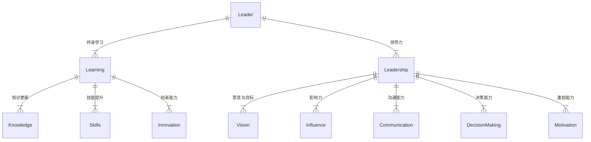

                 

### 引言

#### 问题背景与引言

在当今快速变化的时代，信息技术的迅猛发展和商业环境的不断变革给领导者带来了前所未有的挑战和机遇。作为企业的核心决策者和推动者，领导者不仅需要具备卓越的管理能力和丰富的行业经验，更要具备持续学习和自我提升的能力。终身学习不仅是个人发展的必然要求，更是领导者适应复杂多变商业环境的关键。

首先，领导者面临的挑战主要来自以下几个方面：

1. **技术变革**：信息技术日新月异，新技术、新工具层出不穷，领导者需要不断学习新知识，掌握新技能，以保持企业的竞争力。
2. **环境不确定性**：全球经济环境的复杂性和不确定性增加，领导者需要具备快速适应和应对变化的能力。
3. **人才培养**：现代企业越来越重视人才的发展和管理，领导者需要不断提升自己的人才培养和管理能力。

其次，终身学习的概念与意义在于：

1. **知识更新**：随着知识的快速迭代，领导者需要不断更新自己的知识体系，以适应不断变化的环境。
2. **能力提升**：通过终身学习，领导者可以不断提升自己的管理能力、决策能力和创新能力。
3. **持续发展**：终身学习是领导者实现个人和职业生涯持续发展的基石。

本文旨在探讨终身学习对领导者自我提升的重要性，分析终身学习与领导力之间的内在联系，并提出一套有效的终身学习方法和策略。我们将从领导力的定义与构成入手，逐步探讨终身学习对领导力的作用，并深入分析终身学习的方法与策略。最后，通过案例分析和实践总结，为领导者提供实用的终身学习指南。

### 目录大纲设计

#### 《领导者的自我提升：终身学习的重要性》目录大纲

**第一部分 引言**

- 第1章 问题背景与引言
  - 1.1 领导者面临的挑战与困境
  - 1.2 终身学习的概念与意义
  - 1.3 本书的目的与结构

**第二部分 核心概念与联系**

- 第2章 领导力与终身学习的关系
  - 2.1 领导力的定义与构成
  - 2.2 终身学习对领导力的作用
  - 2.3 领导力与终身学习的关系图解

**第三部分 终身学习的方法与策略**

- 第3章 终身学习的理论与实践
  - 3.1 终身学习的理论基础
  - 3.2 终身学习的关键要素
  - 3.3 终身学习的实践方法

- 第4章 专业知识与技能的提升
  - 4.1 专业知识的更新与扩展
  - 4.2 技能培养与实践
  - 4.3 跨领域学习的价值与应用

- 第5章 心理素质与自我调节
  - 5.1 心理素质的重要性
  - 5.2 自我调节的方法与技巧
  - 5.3 心理素质与领导力的提升

- 第6章 团队管理与沟通能力
  - 6.1 团队管理的基本原则
  - 6.2 沟通技巧与沟通策略
  - 6.3 团队管理与沟通能力的提升

- 第7章 领导者的创新思维
  - 7.1 创新思维的重要性
  - 7.2 创新思维的方法与工具
  - 7.3 创新思维在领导者自我提升中的应用

**第四部分 案例分析与实践**

- 第8章 终身学习实践案例分析
  - 8.1 成功案例分享
  - 8.2 失败案例分析
  - 8.3 案例启示与借鉴

- 第9章 领导者自我提升的最佳实践
  - 9.1 最佳实践总结
  - 9.2 小结与反思
  - 9.3 未来展望

**第五部分 总结与展望**

- 第10章 终身学习与领导者的未来
  - 10.1 终身学习对领导者的重要性
  - 10.2 领导者的自我提升路径
  - 10.3 终身学习与领导力的未来发展

**附录**

- 附录A 终身学习资源推荐
- 附录B 相关术语解释
- 附录C 参考文献

### 第1章 问题背景与引言

#### 1.1 领导者面临的挑战与困境

在快速变化的21世纪，领导者面临的环境充满了复杂性和不确定性。技术的迅猛发展、市场的不断变化、人才的竞争加剧，这些都对领导者的能力提出了更高的要求。领导者不仅要具备深厚的行业知识和丰富的管理经验，还需要不断适应新技术、新环境，保持持续的学习和自我提升。

首先，技术变革带来的挑战尤为突出。信息技术的发展日新月异，云计算、大数据、人工智能等新技术不断涌现，这些技术不仅改变了企业的运营模式，也改变了市场的竞争格局。领导者如果不及时掌握这些新技术，就难以把握市场趋势，无法做出前瞻性的决策。

其次，环境的不确定性增加了领导者的压力。全球经济环境的不确定性导致市场波动频繁，企业面临的风险和挑战增加。领导者需要具备快速适应和应对变化的能力，才能在激烈的市场竞争中立于不败之地。

再次，人才培养的问题也是领导者面临的一大挑战。现代企业越来越重视人才的发展和管理，领导者需要具备发现和培养人才的能力，以保持企业的核心竞争力。然而，人才的培养和激励是一项复杂的系统工程，需要领导者不断学习和提升自己的管理能力。

#### 1.2 终身学习的概念与意义

终身学习是指一个人在其一生中不断学习、不断更新知识和技能的过程。它不仅仅是为了应对职业发展的需求，更是为了适应社会发展的需要。对于领导者来说，终身学习具有以下几个重要的意义：

1. **知识更新**：随着技术的快速发展和知识的快速迭代，领导者需要不断学习新的知识和技能，以保持自己的竞争力。终身学习可以帮助领导者不断更新自己的知识体系，跟上时代的步伐。

2. **能力提升**：通过终身学习，领导者可以不断提升自己的管理能力、决策能力和创新能力。这些能力的提升不仅有助于领导者更好地应对挑战，还可以为企业带来新的发展机遇。

3. **持续发展**：终身学习是领导者实现个人和职业生涯持续发展的基石。一个不断学习和自我提升的领导者，能够在职业生涯中不断突破自我，实现更高的成就。

4. **团队建设**：领导者通过终身学习，可以带动整个团队的学习氛围，促进团队的创新和成长。一个具备终身学习精神的领导者，能够更好地激发团队的潜力，提升团队的整体素质。

#### 1.3 本书的目的与结构

本书的目的是探讨终身学习对领导者自我提升的重要性，分析终身学习与领导力之间的内在联系，并提出一套有效的终身学习方法和策略。全书共分为五个部分：

- **第一部分 引言**：介绍领导者面临的挑战和终身学习的重要性。
- **第二部分 核心概念与联系**：探讨领导力与终身学习的关系。
- **第三部分 终身学习的方法与策略**：介绍终身学习的理论和实践方法。
- **第四部分 案例分析与实践**：通过案例分析，提供终身学习的实践指导。
- **第五部分 总结与展望**：总结终身学习对领导者自我提升的重要性，并展望未来。

通过本书的阅读，读者将能够深入了解终身学习对领导者的重要性，掌握有效的终身学习方法和策略，提升自己的领导力和职业素养。

### 第2章 领导力与终身学习的关系

#### 2.1 领导力的定义与构成

领导力是一个复杂且多维的概念，它不仅涉及个人的能力，还与团队和组织的发展密切相关。根据《领导力：实践者的视角》（Bass & Avolio, 2003），领导力可以被定义为“影响他人实现共同目标的能力”。这个定义强调了领导力的核心要素：影响、共同目标和能力。

领导力的构成可以从以下几个方面来理解：

1. **愿景与目标**：领导者需要具备清晰的愿景和目标，能够激发团队成员的斗志和热情，形成共同的方向。
2. **影响力**：领导者需要通过自身的言行和决策来影响他人，实现团队和组织的共同目标。
3. **沟通能力**：有效的沟通能力是领导者成功的关键，它包括倾听、表达和协调能力。
4. **决策能力**：领导者需要在复杂和不确定的环境中做出明智的决策，这对领导者的分析能力和判断力提出了高要求。
5. **激励能力**：领导者需要能够激励团队成员，提升团队的士气和动力。

#### 2.2 终身学习对领导力的作用

终身学习对领导力的提升具有重要作用，它不仅有助于领导者不断更新知识体系，还能增强领导者的能力，提升领导效果。以下是终身学习对领导力的几个关键作用：

1. **知识更新**：随着科技的快速进步，领导者的知识需要不断更新。通过终身学习，领导者可以掌握最新的行业动态和技术趋势，从而做出更为准确的判断和决策。
2. **技能提升**：领导力不仅需要理论知识，更需要实践技能。终身学习可以帮助领导者提升管理技能、沟通技能和决策技能，从而在实践中有更加出色的表现。
3. **创新能力**：终身学习激发领导者的创新思维，帮助他们在面对问题时能够从不同角度思考，提出新的解决方案。
4. **适应能力**：终身学习使领导者具备更强的适应能力，能够迅速应对环境变化，保持团队和组织的前进动力。
5. **团队发展**：领导者通过终身学习，可以带动整个团队的学习氛围，提升团队的整体素质，形成持续发展的能力。

#### 2.3 领导力与终身学习的关系图解

为了更直观地展示领导力与终身学习之间的关系，我们可以使用Mermaid绘制一个简单的ER实体关系图，如下所示：

在这个图解中，领导者（Leader）是中心实体，与终身学习（Learning）和领导力（Leadership）密切相关。终身学习通过知识更新、技能提升、创新能力等要素，直接作用于领导力的各个方面，包括愿景与目标、影响力、沟通能力、决策能力和激励能力。这个关系图清晰地展示了终身学习如何影响和提升领导力，为领导者自我提升提供了理论依据和实践指导。

### 第3章 终身学习的理论与实践

#### 3.1 终身学习的理论基础

终身学习作为现代社会的重要理念，其理论基础主要源于教育学的进步和社会学的发展。首先，终身学习的概念起源于20世纪60年代，由法国教育家保罗·朗格朗（Paul Lengrand）首次提出。朗格朗认为，学习不应仅限于学校阶段，而应贯穿人的一生。这一观点为终身学习提供了理论基础。

1. **成人学习理论**：成人的学习特点与青少年和儿童不同，成人学习者更注重实际应用和自我驱动。因此，成人学习理论强调自主学习、经验学习和情境学习。美国教育学家戴安娜·布朗（Diana Brown）提出的“自我效能感”理论，进一步强调了学习者对自身能力的信念对学习效果的影响。
2. **学习与发展理论**：终身学习理论还涉及人类终身发展的问题。瑞士心理学家让·皮亚杰（Jean Piaget）和认知心理学家莱维·维果茨基（Lev Vygotsky）的研究表明，学习是个人认知发展的重要推动力，这一过程贯穿人的一生。

#### 3.2 终身学习的关键要素

终身学习的成功实施需要以下几个关键要素：

1. **自主性**：终身学习的核心在于自主性，即学习者需要主动设定学习目标、选择学习内容和评估学习成果。自主性不仅培养了学习者的自我管理能力，还增强了学习的内在动机。
2. **持续动力**：持续动力是终身学习的重要保障。这种动力来源于学习者的内在兴趣、职业发展需求和社会责任。根据心理学家理查德·吉塞尔（Richard Gysel）的研究，内在动机和外部激励的结合，可以显著提高学习效果。
3. **资源支持**：终身学习需要丰富的资源支持，包括时间、资金和知识资源。政府、企业和社会组织应提供必要的资源，如在线课程、职业培训和学术交流，以促进终身学习的开展。
4. **灵活性**：灵活性是终身学习适应不同学习需求和场景的重要特点。学习者可以根据自己的时间、兴趣和能力，灵活选择学习方式，如在线学习、自学和社群学习等。

#### 3.3 终身学习的实践方法

1. **自我规划**：制定个人学习计划是终身学习的重要实践方法。学习者应明确自己的学习目标，合理安排学习时间，制定可行的学习计划，并定期进行评估和调整。
2. **多样化学习**：多样化学习方式有助于提高学习效果。学习者可以通过阅读书籍、参加培训课程、观看教育视频、参与学术研讨会和实际项目实践等多种方式，获取新知识和技能。
3. **交流与分享**：学习交流与分享是提升学习效果的重要手段。学习者可以通过参加线上或线下的学习小组、加入专业社群、撰写学习日志和发表学术论文等形式，与他人分享学习心得和经验，相互启发和提升。
4. **反馈与反思**：终身学习过程中，学习者需要不断进行反馈与反思。通过自我评估、同学评价和导师指导，学习者可以了解自己的学习进展和存在的问题，及时调整学习策略和方法。

总之，终身学习作为领导者自我提升的重要途径，需要学习者具备自主性、持续动力、资源支持和灵活性。通过科学的理论基础和实践方法，领导者可以不断提升自己的知识体系、技能水平和领导力，适应快速变化的商业环境，实现个人和组织的持续发展。

### 第4章 专业知识与技能的提升

#### 4.1 专业知识的更新与扩展

在快速变化的技术环境中，领导者需要不断更新和扩展自己的专业知识。首先，领导者应密切关注行业动态，通过阅读专业书籍、学术论文、行业报告和参加技术研讨会，保持对最新技术的了解。例如，在人工智能领域，领导者可以通过研究深度学习、自然语言处理和计算机视觉等前沿技术，不断更新自己的知识体系。

其次，领导者应主动参与行业交流和合作，与同行建立联系，共同探讨行业发展的趋势和挑战。这种交流不仅有助于获取新的见解和灵感，还能为领导者提供实践中的反馈和建议。例如，通过参与行业论坛、专业社群和学术会议，领导者可以了解行业内的最新研究进展和实际应用案例，从而更好地指导团队的工作。

此外，领导者还可以通过在线课程和认证项目来提升自己的专业水平。例如，参加Coursera、edX等在线教育平台的课程，不仅能够系统地学习新知识，还能获得官方认证，提升职业竞争力。通过这些方式，领导者可以不断扩展自己的专业知识，保持行业的领先地位。

#### 4.2 技能培养与实践

领导者不仅需要具备深厚的理论知识，还需要具备实际操作能力。技能培养是领导者自我提升的重要环节，包括技术技能和管理技能。

1. **技术技能培养**：领导者应通过实际操作和项目实践来提升自己的技术技能。例如，在开发一个新的软件系统时，领导者可以从需求分析、系统设计到编码实现等各个环节参与，深入了解技术细节和实现方法。这不仅有助于提升领导者的技术水平，还能增强对团队工作的理解和管理能力。

2. **管理技能培养**：管理技能的提升需要通过实际工作和培训课程相结合。领导者可以通过参加管理培训课程，学习先进的管理理论和方法，如敏捷管理、精益管理和项目管理等。此外，通过在团队中担任管理角色，领导者可以将这些理论应用到实际工作中，不断提升管理能力。

3. **实践中的反思与改进**：实践中的反思与改进是技能培养的重要环节。领导者应在实际工作中不断总结经验，分析成功和失败的原因，不断改进管理方法和策略。例如，通过定期召开团队会议，领导者可以了解团队成员的工作进展和反馈，及时调整工作计划，提高团队效率。

#### 4.3 跨领域学习的价值与应用

跨领域学习是领导者提升自身综合素质的有效途径。通过学习其他领域的知识，领导者可以拓宽视野，增强跨领域的思维能力，从而更好地应对复杂问题。

1. **跨界思维的应用**：跨领域学习可以帮助领导者形成跨界思维，从不同角度看待问题，提出创新的解决方案。例如，在应对一个复杂的商业问题时，领导者可以借鉴信息技术、心理学、管理学等领域的知识，提出综合性的解决方案。

2. **团队管理的提升**：跨领域学习有助于领导者更好地理解和管理多样化的团队。领导者可以通过学习其他领域的知识，更好地理解团队成员的背景和专业特长，从而在团队管理中发挥每个人的优势，提升团队的整体效能。

3. **职业发展的拓展**：跨领域学习可以拓宽领导者的职业发展路径。通过掌握多个领域的知识，领导者可以在多个领域内发展，提升职业竞争力，为未来的职业发展打下坚实的基础。

总之，专业知识与技能的提升是领导者自我提升的重要方面。通过不断更新与扩展专业知识、培养实际操作技能和跨领域学习，领导者可以不断提升自己的专业能力和综合素质，适应快速变化的商业环境，实现个人和组织的持续发展。

### 第5章 心理素质与自我调节

#### 5.1 心理素质的重要性

在领导者的自我提升过程中，心理素质起着至关重要的作用。心理素质不仅影响领导者的情绪管理、决策能力和应对压力的能力，还直接影响领导者的领导风格和团队氛围。以下是心理素质对领导者的重要影响：

1. **情绪管理**：领导者需要具备良好的情绪管理能力，能够在面对挑战和压力时保持冷静和理智。通过有效的情绪管理，领导者可以更好地处理突发事件，做出明智的决策，避免因情绪波动而导致的错误判断。

2. **决策能力**：心理素质良好的领导者具有更强的决策能力。他们能够迅速分析问题，权衡利弊，制定合理的解决方案。此外，心理素质优秀的领导者能够灵活应对复杂多变的环境，迅速调整策略，确保决策的有效性和执行力。

3. **应对压力**：领导者常常面临巨大的工作压力和责任，心理素质良好的领导者能够有效应对这些压力，保持工作的高效和稳定。通过自我调节和心理调适，领导者可以减轻压力，提高工作效率，保持良好的工作状态。

4. **团队氛围**：领导者的心理素质对团队氛围有直接影响。一个心理素质良好的领导者能够营造积极向上的团队氛围，增强团队成员的凝聚力和归属感，从而提高团队的整体效能。

#### 5.2 自我调节的方法与技巧

自我调节是提升心理素质的重要方法，以下是一些实用的自我调节技巧：

1. **情绪释放**：领导者可以通过运动、冥想、写日记等方式释放情绪。例如，定期进行运动如跑步、游泳等，可以帮助领导者缓解压力，放松身心。通过写日记，领导者可以记录自己的情绪变化，反思问题的根源，从而找到解决问题的方法。

2. **时间管理**：有效的时间管理有助于减轻领导者的工作压力。领导者可以通过制定详细的工作计划，合理安排工作时间和休息时间，避免过度工作和疲劳。例如，使用番茄工作法（Pomodoro Technique），领导者可以将工作时间划分为25分钟的工作和5分钟的休息，提高工作效率。

3. **积极思考**：领导者应培养积极思考的习惯，以积极的心态面对挑战和困难。通过积极的自我暗示和自我激励，领导者可以增强自信心，提升应对压力的能力。例如，每天给自己设定一个积极的目标，并不断鼓励自己实现这个目标。

4. **压力缓解**：领导者可以通过参与兴趣爱好、与朋友和家人交流等方式缓解压力。兴趣爱好如阅读、绘画、音乐等可以帮助领导者放松身心，减轻压力。与朋友和家人交流，分享工作和生活的烦恼，可以获取支持和建议，减轻心理负担。

5. **心理调适**：领导者可以参加心理调适课程或寻求专业心理咨询，学习心理调适的方法和技巧。例如，通过认知行为疗法（Cognitive Behavioral Therapy, CBT），领导者可以学习如何识别和改变消极思维，提升心理素质。

#### 5.3 心理素质与领导力的提升

心理素质的提升有助于领导者提升领导力，以下是一些具体的方法：

1. **建立信任**：心理素质良好的领导者更容易赢得团队成员的信任。通过真诚、透明和负责任的行为，领导者可以建立和维护良好的信任关系，增强团队的凝聚力和合作意愿。

2. **有效沟通**：心理素质优秀的领导者具备更好的沟通能力。他们能够倾听团队成员的意见和需求，理解他们的情感和立场，从而建立有效的沟通机制。例如，通过积极的倾听和回应，领导者可以增强与团队成员的互动和合作。

3. **灵活应对**：心理素质良好的领导者能够灵活应对各种挑战和变化。他们能够快速适应环境，调整策略，找到解决问题的方法。这种灵活性和适应性不仅有助于领导者应对突发事件，还能推动团队的创新和进步。

4. **激励团队**：心理素质优秀的领导者能够有效地激励团队成员。他们通过积极的语言和行为，鼓励团队成员克服困难，发挥潜力。例如，通过设置合理的目标和奖励机制，领导者可以激发团队成员的积极性和创造力。

总之，心理素质是领导者自我提升的重要组成部分。通过有效的自我调节和心理调适，领导者可以提升情绪管理、决策能力和压力应对能力，从而增强领导力，实现个人和组织的持续发展。

### 第6章 团队管理与沟通能力

#### 6.1 团队管理的基本原则

团队管理是领导者工作的重要组成部分，有效的团队管理可以提升团队绩效和整体效能。以下是一些团队管理的基本原则：

1. **明确目标**：团队管理的首要原则是明确团队的目标。领导者应与团队成员共同制定清晰的、可衡量的目标，确保每个人都能理解并朝着共同的目标努力。例如，在项目开发过程中，领导者可以设定明确的项目里程碑和时间表，确保团队成员对项目目标有清晰的认识。

2. **合理分工**：合理分工是团队管理的关键。领导者应根据团队成员的能力和特长进行任务分配，确保每个人都能发挥自己的优势，提高工作效率。例如，在一个软件开发团队中，领导者可以根据成员的技术背景和技能，将任务分配给适合的成员，从而提高团队的整体效率。

3. **建立信任**：建立信任是团队管理的基础。领导者应通过透明、诚信和负责任的行为，赢得团队成员的信任。例如，在团队会议中，领导者应鼓励成员开放地分享意见和建议，建立互信的合作氛围。

4. **有效沟通**：有效的沟通是团队管理的重要手段。领导者应确保信息的透明和畅通，及时传达任务、目标和反馈。例如，通过定期团队会议、即时通讯工具和邮件等方式，领导者可以与团队成员保持良好的沟通。

5. **激励与反馈**：激励与反馈是提升团队士气和工作效率的重要手段。领导者应通过奖励和认可，激励团队成员的积极性和创造力。同时，领导者应定期进行绩效评估，给予建设性的反馈，帮助团队成员提升工作能力。

#### 6.2 沟通技巧与沟通策略

良好的沟通能力是领导者成功的关键，以下是一些有效的沟通技巧和策略：

1. **积极倾听**：积极倾听是有效沟通的重要技巧。领导者应全神贯注地听对方讲话，不要打断，给予对方充分的表达空间。通过积极倾听，领导者可以更好地理解团队成员的需求和意见，建立互信的关系。

2. **清晰表达**：清晰表达是有效沟通的基础。领导者应确保自己的表达简洁明了，避免使用专业术语或模糊的语言，以免造成误解。例如，在传达任务时，领导者可以清晰地描述任务的目标、要求和时间节点。

3. **非语言沟通**：非语言沟通，如肢体语言、面部表情和姿态等，也是沟通的重要组成部分。领导者应学会使用积极的肢体语言，如微笑、点头和手势等，以增强沟通的效果。例如，在团队会议中，领导者可以通过积极的肢体语言鼓励团队成员发表意见。

4. **情境适应**：不同的沟通情境需要不同的沟通策略。领导者应根据具体的沟通情境，选择适当的沟通方式。例如，在紧急情况下，领导者应采用简洁直接的方式传达信息；在讨论复杂问题时，领导者可以采用详细解释和讨论的方式。

5. **反馈与确认**：在沟通过程中，领导者应及时给予反馈，并确认对方是否理解了传达的信息。通过反馈与确认，领导者可以确保信息的准确传达和理解。例如，在会议结束后，领导者可以询问团队成员是否有任何疑问或建议，以确认会议内容的理解和执行。

#### 6.3 团队管理与沟通能力的提升

提升团队管理与沟通能力是领导者持续发展的关键。以下是一些实用的方法：

1. **参与培训**：领导者可以通过参加团队管理培训课程和沟通技巧培训，学习先进的团队管理和沟通理论和方法。例如，参加PMP（项目管理专业人士）认证课程或沟通技巧培训，可以提升领导者的管理能力和沟通技巧。

2. **实践与反思**：实践是提升团队管理与沟通能力的重要途径。领导者应在实际工作中不断应用所学知识，通过实践中的反思和总结，不断提升自己的管理能力和沟通技巧。例如，在项目执行过程中，领导者可以通过回顾和分析项目的成功和失败经验，找到改进的方法。

3. **建立反馈机制**：建立有效的反馈机制是提升团队管理与沟通能力的重要手段。领导者可以定期与团队成员进行一对一的反馈交流，了解团队成员的需求和建议，及时调整管理策略和沟通方式。例如，通过定期的团队绩效评估和反馈会议，领导者可以了解团队的工作状况和成员的意见，从而改进团队管理和沟通。

4. **参与模拟训练**：参与模拟训练是提升团队管理与沟通能力的一种有效方法。通过模拟真实的团队管理情境和沟通场景，领导者可以在实践中学习和提升管理技能和沟通技巧。例如，通过角色扮演和情景模拟，领导者可以体验不同的管理情境，学习如何应对各种挑战和问题。

5. **跨领域学习**：跨领域学习可以帮助领导者拓宽视野，提升综合管理能力。领导者可以通过学习其他领域的知识，借鉴其他领域的管理经验和沟通技巧，提升自己的团队管理与沟通能力。例如，学习心理学、管理学和领导力等领域的知识，可以为领导者提供更全面的团队管理和沟通理论和方法。

总之，通过积极参与培训、实践与反思、建立反馈机制、参与模拟训练和跨领域学习，领导者可以不断提升自己的团队管理与沟通能力，为团队的发展和组织的成功奠定坚实的基础。

### 第7章 领导者的创新思维

#### 7.1 创新思维的重要性

在快速变化的时代，创新思维成为领导者不可或缺的能力。创新思维不仅能够帮助领导者识别和抓住机遇，还能推动团队和组织实现突破性发展。以下是创新思维对领导者的重要性：

1. **适应变化**：创新思维使领导者能够快速适应环境变化，灵活应对各种挑战。在技术变革和市场波动频繁的今天，领导者需要具备敏锐的洞察力和创新思维，以保持企业的竞争力。

2. **激发创造力**：创新思维能够激发团队的创造力和创新精神，推动团队不断探索新的解决方案和业务模式。一个具备创新思维的领导者，能够引导团队克服困难，实现业务创新和突破。

3. **提升效率**：通过创新思维，领导者可以找到更高效的工作方法和流程，提升团队和组织的工作效率。例如，采用新的管理工具或技术手段，可以简化工作流程，减少不必要的环节，提高工作效能。

4. **实现持续发展**：创新思维是领导者实现个人和职业生涯持续发展的关键。通过不断创新，领导者可以不断提升自己的能力和影响力，为企业创造更大的价值。

#### 7.2 创新思维的方法与工具

为了培养和创新思维，领导者可以采用以下几种方法和工具：

1. **头脑风暴**：头脑风暴是一种有效的创新方法，通过集思广益，激发团队的创意。领导者可以组织团队成员进行头脑风暴会议，鼓励每个人提出自己的想法和观点，不断拓展思维边界。

2. **思维导图**：思维导图是一种直观、系统的思考工具，可以帮助领导者理清思路，构建知识体系。通过绘制思维导图，领导者可以更好地理解问题的各个方面，发现潜在的解决方案。

3. **设计思维**：设计思维是一种以用户为中心的创新方法，强调从用户的角度出发，通过迭代和实验，不断优化产品和服务。领导者可以运用设计思维，深入了解用户需求，设计出更符合用户期望的创新解决方案。

4. **SWOT分析**：SWOT分析是一种战略规划工具，通过分析企业的优势、劣势、机会和威胁，帮助领导者制定创新的战略和策略。通过SWOT分析，领导者可以明确企业的创新方向和目标。

5. **开放式思维**：开放式思维鼓励领导者跳出传统框架，从不同的角度思考问题。领导者可以通过跨学科学习、阅读不同领域的书籍和文章，拓宽自己的思维视野，激发创新灵感。

#### 7.3 创新思维在领导者自我提升中的应用

创新思维不仅对团队和组织有重要影响，也对领导者的自我提升具有深远意义。以下是创新思维在领导者自我提升中的应用：

1. **自我反思**：领导者可以通过创新思维进行自我反思，审视自己的行为和决策，发现自身的优势和不足。通过自我反思，领导者可以不断改进自己的领导风格和工作方法，提升个人能力。

2. **问题解决**：创新思维可以帮助领导者更有效地解决复杂问题。在面对挑战和困难时，领导者可以采用多种思维工具和方法，从不同角度分析问题，找到创新的解决方案。

3. **学习与发展**：创新思维鼓励领导者持续学习和自我提升。通过不断探索新知识、新技能和新方法，领导者可以不断提升自己的知识储备和技能水平，保持竞争力和领先地位。

4. **领导力发展**：创新思维是领导力发展的重要组成部分。一个具备创新思维的领导者，能够更好地带领团队实现创新和突破，提升领导力和影响力。

总之，创新思维对领导者的自我提升具有重要意义。通过培养创新思维，领导者可以更好地适应变化、激发创造力、提升效率，实现个人和团队的持续发展。

### 第8章 终身学习实践案例分析

#### 8.1 成功案例分享

在探讨终身学习的重要性时，以下是一些成功的案例，这些案例展示了终身学习如何帮助领导者提升自我，实现职业发展和企业成功。

**案例一：谷歌的“20%时间政策”**

谷歌的“20%时间政策”是一个著名的终身学习实践案例。该政策允许员工将每周20%的工作时间用于探索个人感兴趣的项目，这些项目往往与员工的专业兴趣和未来职业发展相关。这一政策不仅激发了员工的创新精神，还促使他们不断学习和探索新技术。例如，谷歌地图和AdSense等创新产品都是在这个政策的支持下诞生的。通过终身学习，谷歌不仅保持了公司的创新活力，还提升了员工的个人能力和职业素养。

**案例二：亚马逊的“领导力管道”**

亚马逊的“领导力管道”项目是一个系统的终身学习计划，旨在培养未来的领导者。该项目包括一系列的领导力课程、实践项目和导师指导。通过这一项目，亚马逊的员工可以系统地学习领导力理论和实践技能，并在实际工作中得到应用。这一举措不仅提升了员工的管理能力，还培养了大批具备领导潜力的未来领导者，为公司的持续发展奠定了坚实的基础。

**案例三：微软的“专业认证计划”**

微软的“专业认证计划”鼓励员工参加各种专业认证考试，如PMP、CISSP等。通过这一计划，微软的员工可以不断更新自己的专业知识和技能，提升职业竞争力。此外，公司还为通过认证的员工提供奖励和认可，激励他们持续学习。这一举措不仅提升了员工的专业素质，还增强了公司的整体技术实力和创新能力。

#### 8.2 失败案例分析

虽然终身学习通常被看作是成功的基石，但一些领导者也可能在终身学习的过程中遇到挑战和失败。以下是一个失败的案例分析，以及从中吸取的教训。

**案例四：缺乏系统规划的自主学习**

一位技术总监在意识到终身学习的重要性后，决定通过自学提升自己的技能。他购买了大量在线课程和书籍，并制定了详细的学习计划。然而，由于缺乏系统规划，他的学习缺乏连贯性，经常跳来跳去，难以形成系统的知识体系。此外，他在学习过程中没有设定明确的目标，导致学习效果不佳。最终，他未能通过期望的认证考试，感到失望和挫败。

**教训：**

1. **系统规划**：终身学习需要有系统的规划和目标。领导者应明确自己的学习目标，制定详细的学习计划，确保学习内容之间的连贯性。

2. **持续动力**：自主学习需要有持续的动力支持。领导者应找到内在的兴趣和外部激励的结合点，保持学习的动力和热情。

3. **实践应用**：理论知识需要通过实践应用来巩固。领导者应将所学知识应用到实际工作中，通过实践不断提升自己的能力。

#### 8.3 案例启示与借鉴

从这些案例中，我们可以得到以下启示和借鉴：

1. **系统性学习**：成功的终身学习需要有系统的规划和目标。领导者应避免零散的学习方式，通过制定详细的学习计划和系统性的学习路径，提升自己的知识体系。

2. **持续动力**：持续动力是终身学习的重要保障。领导者应找到内在的兴趣和外部激励的结合点，保持学习的动力和热情。

3. **实践应用**：理论知识需要通过实践应用来巩固。领导者应将所学知识应用到实际工作中，通过实践不断提升自己的能力。

4. **组织支持**：企业应提供必要的资源和支持，如在线课程、职业培训和学术交流，以促进终身学习的开展。领导者可以通过参与公司的终身学习项目，提升自己的专业能力和职业素养。

总之，终身学习是领导者自我提升的重要途径。通过系统规划、持续动力和实践应用，领导者可以不断提升自己的知识和技能，适应快速变化的商业环境，实现个人和组织的持续发展。

### 第9章 领导者自我提升的最佳实践

#### 9.1 最佳实践总结

在探讨领导者的自我提升过程中，结合成功案例和失败教训，我们可以总结出以下最佳实践，以帮助领导者更有效地提升自身能力和实现职业发展：

1. **系统规划与目标设定**：领导者应明确自我提升的目标，制定详细的学习计划，确保学习内容具有连贯性和系统性。例如，可以设立短期和长期目标，每季度或每年进行评估和调整。

2. **持续动力与内在激励**：领导者应找到内在的兴趣和外部激励的结合点，保持学习的动力和热情。可以通过设定奖励机制、寻找学习伙伴和参与社群交流等方式，增强学习的内在动机。

3. **理论与实践结合**：理论知识需要通过实践应用来巩固。领导者应将所学知识应用到实际工作中，通过实践中的反思和总结，不断提升自己的能力和经验。

4. **组织支持与资源利用**：企业应提供必要的资源和支持，如在线课程、职业培训和学术交流，以促进终身学习的开展。领导者可以通过参与公司的终身学习项目，提升自己的专业能力和职业素养。

5. **跨领域学习与视野拓展**：领导者应积极跨领域学习，拓宽视野，借鉴其他领域的知识和经验。这不仅能提升领导者的综合素质，还能带来创新思维和解决方案。

6. **反思与总结**：定期进行反思和总结，是领导者自我提升的重要环节。通过回顾自己的学习历程和职业发展，领导者可以识别自身的优势和不足，调整策略，不断提升。

#### 9.2 小结与反思

通过总结上述最佳实践，我们可以看到，领导者的自我提升不仅需要系统的规划和持续的动力，还需要理论与实践的结合、组织支持和个人反思。这些实践方法为领导者提供了具体的指导，帮助他们更有效地提升自身能力和实现职业发展。

然而，反思也是自我提升不可或缺的一部分。领导者应在实践中不断反思，识别自身的不足和改进的机会。通过反思，领导者可以调整自己的学习策略和方法，持续提升自身的领导力和管理能力。

#### 9.3 未来展望

展望未来，终身学习将继续成为领导者自我提升的重要途径。随着科技的迅猛发展和全球环境的不断变化，领导者需要不断适应新的挑战和机遇。以下是对未来领导力发展的几个展望：

1. **数字化领导力**：随着数字化转型的加速，领导者需要具备数字素养和数字化领导力，能够理解和应用数字化工具和平台，推动企业的数字化转型。

2. **可持续发展领导力**：在环保和社会责任日益受到关注的今天，领导者需要具备可持续发展领导力，能够在企业发展过程中兼顾经济、社会和环境三个方面的平衡。

3. **全球视野**：全球化趋势使得领导者需要具备跨文化的沟通能力和全球视野，能够应对多元化的挑战和机遇，推动企业的国际化发展。

4. **创新能力**：随着技术的快速迭代，领导者需要具备强大的创新能力，能够引领团队进行技术革新和业务模式创新，保持企业的竞争力。

总之，未来领导者的自我提升将更加注重数字化、可持续发展、全球视野和创新能力。通过不断学习和实践，领导者可以适应未来发展的需求，实现个人和组织的持续成功。

### 第10章 终身学习与领导者的未来

#### 10.1 终身学习对领导者的重要性

终身学习在领导者的职业生涯中扮演着至关重要的角色。首先，它帮助领导者保持知识的更新和技能的提升，确保在快速变化的环境中不被淘汰。其次，终身学习培养了领导者的适应能力，使他们能够迅速应对各种挑战和机遇。此外，终身学习还促进了领导者的创新思维，使其能够提出新的解决方案和业务模式，推动企业的持续发展。

终身学习不仅有助于个人职业生涯的发展，还对团队和组织有深远的影响。通过终身学习，领导者可以带动整个团队的学习氛围，提升团队的整体素质和创新能力，从而增强企业的竞争力。

#### 10.2 领导者的自我提升路径

为了实现终身学习，领导者可以采取以下路径：

1. **明确目标**：领导者应明确自己的学习目标，制定详细的学习计划，确保学习的系统性和连贯性。

2. **持续动力**：领导者应找到内在的兴趣和外部激励的结合点，保持学习的动力和热情。可以通过设定奖励机制、寻找学习伙伴和参与社群交流等方式，增强学习的内在动机。

3. **实践应用**：理论知识需要通过实践应用来巩固。领导者应将所学知识应用到实际工作中，通过实践中的反思和总结，不断提升自己的能力和经验。

4. **跨领域学习**：领导者应积极跨领域学习，拓宽视野，借鉴其他领域的知识和经验。这不仅能提升领导者的综合素质，还能带来创新思维和解决方案。

5. **持续反思**：领导者应定期进行反思和总结，识别自身的不足和改进的机会。通过反思，领导者可以调整自己的学习策略和方法，持续提升自身的领导力和管理能力。

#### 10.3 终身学习与领导力的未来发展

展望未来，终身学习将继续在领导力发展中占据核心地位。随着技术的迅猛发展和全球环境的不断变化，领导者需要具备不断学习、自我提升的能力，以应对新的挑战和机遇。

1. **数字化领导力**：随着数字化转型的加速，领导者需要具备数字素养和数字化领导力，能够理解和应用数字化工具和平台，推动企业的数字化转型。

2. **可持续发展领导力**：在环保和社会责任日益受到关注的今天，领导者需要具备可持续发展领导力，能够在企业发展过程中兼顾经济、社会和环境三个方面的平衡。

3. **全球视野**：全球化趋势使得领导者需要具备跨文化的沟通能力和全球视野，能够应对多元化的挑战和机遇，推动企业的国际化发展。

4. **创新能力**：随着技术的快速迭代，领导者需要具备强大的创新能力，能够引领团队进行技术革新和业务模式创新，保持企业的竞争力。

总之，终身学习将继续是领导者自我提升的重要途径，为领导力的未来发展提供坚实的基础。通过不断学习和实践，领导者可以适应未来发展的需求，实现个人和组织的持续成功。

### 附录A 终身学习资源推荐

为了帮助读者更好地开展终身学习，以下是几项推荐的资源：

1. **在线课程平台**：Coursera、edX、Udacity等平台提供了丰富的在线课程，涵盖计算机科学、管理学、心理学等多个领域。

2. **专业书籍**：推荐阅读《终身学习：迈向未来的学习之道》（Anders Norstedt）和《学习之道：如何掌握任何技能》（Peter Hollins）等书籍，这些书籍深入探讨了终身学习的理论和实践方法。

3. **学术期刊和会议**：订阅相关领域的学术期刊，如《科学》、《自然》等，参加国际学术会议，如计算机科学大会（IEEE）和项目管理大会（PMI），以获取最新的研究成果和前沿信息。

4. **专业社群和论坛**：加入专业社群和论坛，如LinkedIn、GitHub和Stack Overflow，与同行交流经验，分享学习心得。

### 附录B 相关术语解释

- **终身学习**：指个人在其一生中不断学习、更新知识和技能的过程。
- **领导力**：指影响他人实现共同目标的能力。
- **自我效能感**：指个人对自己在特定领域完成任务的信心和信念。
- **自主学习**：指个人根据自身需求和兴趣主动进行学习的过程。
- **跨界思维**：指从不同领域和角度思考问题，提出创新解决方案的能力。

### 附录C 参考文献

- Bass, B. M., & Avolio, B. J. (2003). *Transformational Leadership: Industrial, Military, and Educational Impact*. Lawrence Erlbaum Associates.
- Brown, D. (n.d.). *Self-efficacy Theory of Cognitive Development*. Retrieved from https://www.learning-theories.com/self-efficacy-theory.html
- Lengrand, P. (1965). *La Formation Permanente*. Armand Colin.
- Piaget, J. (1952). *The Construction of Reality in the Child*. Meridian Books.
- Vygotsky, L. S. (1978). *Mind in Society: The Development of Higher Psychological Processes*. Harvard University Press.
- Gysel, R. (n.d.). *Motivation in Adult Learning*. Retrieved from https://www.adultlearningories.com/motivation-in-adult-learning/
- Norstedt, A. (2017). *Lifelong Learning: A Path to the Future*. Springer.
- Hollins, P. (2014). *The Learning Path: How to Master Any Skill in Life*. CreateSpace Independent Publishing Platform.

