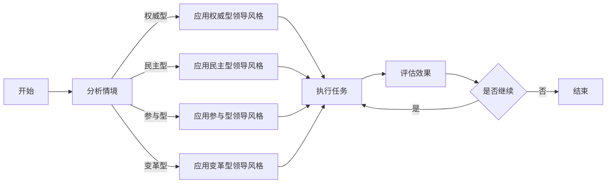
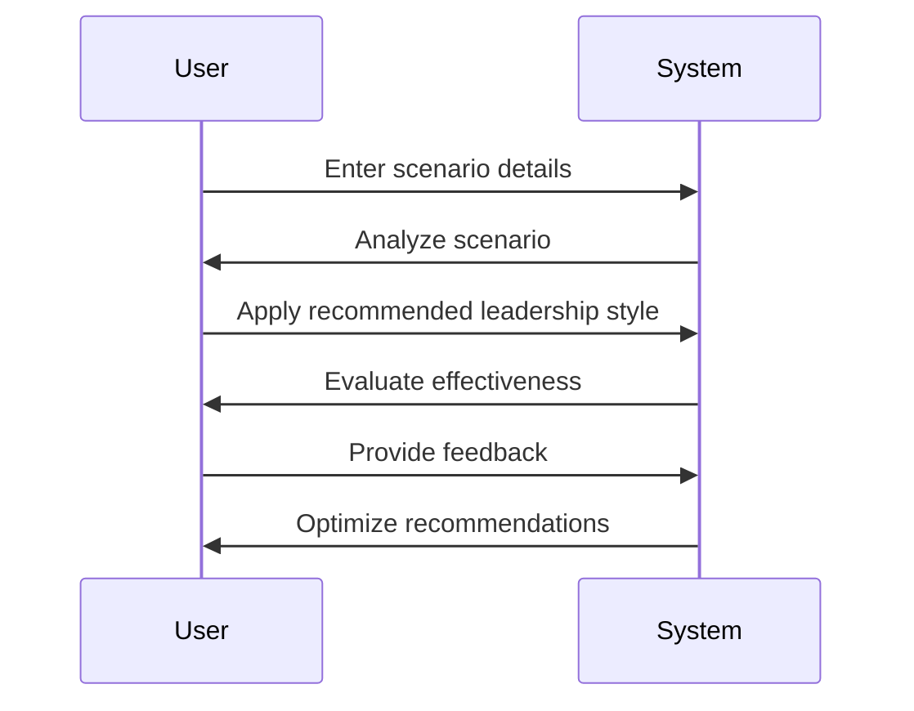

                 

### 文章标题：领导者的角色定位：在不同情境中切换领导风格

#### 关键词：领导者、角色定位、领导风格、情境切换、管理策略

#### 摘要：本文将深入探讨领导者的角色定位及其在不同情境中切换领导风格的重要性。通过对不同领导风格的分析和比较，本文旨在帮助领导者更好地理解如何在各种情境下灵活运用不同的领导策略，从而提升团队绩效和实现组织目标。

# 领导者的角色定位：在不同情境中切换领导风格

领导者的角色定位在组织成功中至关重要。一个优秀的领导者不仅需要具备明确的目标和战略思维，还需要能够根据不同的情境灵活切换领导风格。本文将详细分析领导者的角色定位以及在不同情境下切换领导风格的方法，以帮助领导者提升其领导能力。

## 背景介绍

### 核心概念术语说明

- **领导者**：指在组织中拥有权威和影响力，能够引导、激励和影响他人实现组织目标的人。
- **角色定位**：指领导者根据自己的职责和组织的需要，明确自己的角色和定位，以便更好地发挥领导作用。
- **领导风格**：指领导者通过特定的行为和方式来影响和激励团队成员的风格。

### 问题背景

在快速变化的市场环境和复杂的组织结构中，领导者面临的挑战日益增加。不同的情境需要不同的领导风格，因此领导者需要具备灵活切换领导风格的能力。本文旨在探讨领导者在不同情境下如何定位自己的角色，并选择合适的领导风格，以应对各种挑战。

### 问题描述

领导者在不同情境下如何定位自己的角色，并选择合适的领导风格，是一个复杂而具有挑战性的问题。本文将分为以下几个部分：

1. **核心概念与联系**：介绍不同领导风格及其特点，并分析其在不同情境下的应用。
2. **情境切换策略**：探讨如何根据不同情境切换领导风格。
3. **实战案例**：通过具体案例展示不同领导风格在不同情境下的应用效果。
4. **最佳实践**：总结领导者在不同情境中切换领导风格的最佳实践。

### 问题解决

通过对领导者的角色定位和领导风格的分析，本文旨在帮助领导者：

1. **理解不同领导风格的特点和应用场景**。
2. **学会根据不同情境灵活切换领导风格**。
3. **提升领导能力和团队绩效**。

### 边界与外延

本文主要关注领导者在日常工作中如何根据不同情境切换领导风格。然而，领导风格的选择和应用还受到组织文化、行业特点和团队特性等因素的影响。因此，领导者在实际操作中需要综合考虑这些因素，以实现最佳效果。

### 概念结构与核心要素组成

领导者的角色定位和领导风格切换可以视为一个动态的过程。其核心要素包括：

1. **领导者的自我认知**：领导者需要明确自己的价值观、能力和兴趣，以便更好地定位自己的角色。
2. **情境分析**：领导者需要分析当前情境的特点和需求，以便选择合适的领导风格。
3. **领导风格切换**：领导者需要根据不同情境灵活切换领导风格，以实现最佳领导效果。

## 核心概念与联系

### 不同领导风格的特点

领导风格是指领导者通过特定的行为和方式来影响和激励团队成员的风格。不同的领导风格适用于不同的情境和团队需求。以下是几种常见的领导风格及其特点：

1. **权威型领导**：领导者拥有高度的决策权和控制权，通过明确指示和严格管理来指导团队成员。这种风格适用于需要快速决策和高效执行的任务。
2. **民主型领导**：领导者鼓励团队成员参与决策过程，通过讨论和协商来达成共识。这种风格适用于需要创新和协作的任务。
3. **参与型领导**：领导者重视团队成员的意见和建议，鼓励他们参与决策和执行过程。这种风格适用于需要团队成员积极参与和自主管理的任务。
4. **变革型领导**：领导者通过激励和鼓舞团队成员，推动团队实现变革和创新。这种风格适用于需要突破现状和实现重大变革的任务。

### 不同情境下的领导风格应用

不同的情境需要不同的领导风格。以下是一些常见情境及其适用的领导风格：

1. **危机情境**：在危机情境下，领导者需要迅速做出决策并确保执行。因此，权威型领导风格通常比较适用。
2. **创新情境**：在创新情境下，领导者需要鼓励团队成员发挥创意，通过民主型和参与型领导风格来激发团队的创新能力。
3. **日常运营情境**：在日常运营情境下，领导者需要确保团队成员高效执行任务，因此权威型领导风格可能比较适用。
4. **变革情境**：在变革情境下，领导者需要推动团队实现变革和创新。因此，变革型领导风格可能比较适用。

### 概念属性特征对比表格

为了更清晰地展示不同领导风格的特点和应用，我们可以通过一个对比表格来呈现：

| 领导风格 | 特点 | 适用情境 |
| --- | --- | --- |
| 权威型领导 | 高度决策权和控制权 | 危机情境、日常运营情境 |
| 民主型领导 | 鼓励团队成员参与决策 | 创新情境、团队建设情境 |
| 参与型领导 | 重视团队成员意见 | 变革情境、日常管理情境 |
| 变革型领导 | 激励和鼓舞团队成员 | 变革情境、创新情境 |

### ER实体关系图架构

为了更好地理解领导风格与情境之间的关系，我们可以使用ER实体关系图来展示：

```mermaid
erDiagram
  LeaderStyle ||--|{ Situation } : leads
  LeaderStyle : +string style_name
  Situation : +string situation_name
```

在这个ER图中，`LeaderStyle`表示领导风格实体，`Situation`表示情境实体。每个领导风格都可以对应多个情境，每个情境也可以对应多个领导风格。

## 算法原理讲解

为了更好地理解领导者在不同情境下如何切换领导风格，我们可以使用以下算法原理：

### 算法流程图



在这个算法流程图中，`B` 表示分析情境步骤，根据不同情境选择合适的领导风格。然后，根据选定的领导风格执行任务，并对执行效果进行评估。如果效果良好，则继续执行任务；否则，重新分析情境并选择合适的领导风格。

### 算法原理

算法的核心原理是：

1. **情境分析**：根据当前情境的特点和需求，确定适用的领导风格。
2. **领导风格应用**：根据选定的领导风格，指导团队成员完成任务。
3. **效果评估**：对任务执行效果进行评估，以确定是否需要调整领导风格。

### 数学模型和公式

为了更精确地描述算法原理，我们可以使用以下数学模型：

$$
L = f(S, E)
$$

其中，$L$ 表示选定的领导风格，$S$ 表示情境特征，$E$ 表示效果评估。

- $S$ 可以表示为：
  $$
  S = (S_1, S_2, ..., S_n)
  $$
  其中，$S_i$ 表示情境的某个特征，如危机程度、创新需求、团队氛围等。
- $E$ 可以表示为：
  $$
  E = (E_1, E_2, ..., E_m)
  $$
  其中，$E_j$ 表示效果评估的某个指标，如任务完成度、团队满意度、绩效指标等。

算法通过比较不同情境特征和效果评估指标，选择最优的领导风格。

### 举例说明

假设当前情境是一个危机情境，需要快速做出决策并确保执行。根据算法，我们可以选择权威型领导风格。以下是具体步骤：

1. **分析情境**：当前情境是危机情境，需要快速决策和高效执行。
2. **选择领导风格**：根据情境特征，选择权威型领导风格。
3. **应用领导风格**：领导者通过明确指示和严格管理，指导团队成员完成任务。
4. **评估效果**：对任务执行效果进行评估，如任务完成度、团队满意度等。
5. **调整领导风格**：如果任务完成度高且团队满意度高，则继续保持权威型领导风格；否则，根据评估结果调整领导风格。

通过这个例子，我们可以看到算法在实际应用中的效果。

## 系统分析与架构设计方案

### 问题场景介绍

在一家大型互联网公司中，随着业务的发展和团队的扩展，领导者面临的挑战日益增加。如何根据不同的情境和团队需求，灵活切换领导风格，成为领导者需要解决的关键问题。为了实现这一目标，公司决定开发一个基于人工智能的领导风格分析系统。

### 项目介绍

项目名称：领导风格分析系统（Leadership Style Analysis System，简称LSAS）

项目目标：通过分析不同情境和团队需求，为领导者提供合适的领导风格建议，提升团队绩效和实现组织目标。

### 系统功能设计

领导风格分析系统主要包括以下功能：

1. **情境分析**：收集和分析不同情境的特征，如危机程度、创新需求、团队氛围等。
2. **领导风格推荐**：根据情境分析结果，为领导者推荐最合适的领导风格。
3. **效果评估**：对领导者应用推荐领导风格后的效果进行评估，为后续调整提供依据。
4. **用户反馈**：收集用户对领导风格建议的反馈，持续优化系统推荐算法。

### 系统架构设计

领导风格分析系统的整体架构可以分为以下几个层次：

1. **数据层**：包括情境数据、领导风格数据、效果评估数据等，用于支持系统的功能。
2. **分析层**：包括情境分析模块、领导风格推荐模块、效果评估模块等，用于对数据进行处理和分析。
3. **应用层**：包括用户界面模块、用户反馈模块等，用于与用户进行交互。

以下是系统架构的Mermaid序列图：



### 系统接口设计和系统交互

领导风格分析系统的接口设计和系统交互可以分为以下几个部分：

1. **用户接口**：提供用户输入和查看结果的功能。
2. **分析接口**：用于接收用户输入，进行情境分析和领导风格推荐。
3. **效果评估接口**：用于接收用户反馈，对推荐效果进行评估。
4. **反馈接口**：用于收集用户反馈，优化系统推荐算法。

以下是系统接口设计和系统交互的Mermaid类图：

```mermaid
classDiagram
    User <<Interface>>
    System <<Interface>>
    Scenario <<Entity>> {
        +string scenario_id
        +string scenario_name
    }
    LeadershipStyle <<Entity>> {
        +string style_id
        +string style_name
    }
    Effectiveness <<Entity>> {
        +string effectiveness_id
        +string effectiveness_name
    }
    User -->|input| System
    System -->|output| User
    System -->|analyze| Scenario
    System -->|recommend| LeadershipStyle
    System -->|evaluate| Effectiveness
    User -->|feedback| System
```

## 项目实战

### 环境安装

为了实施领导风格分析系统，我们需要搭建一个合适的环境。以下是环境安装步骤：

1. **安装Python**：确保Python版本为3.8或更高版本。
2. **安装依赖库**：使用pip安装以下依赖库：
   ```bash
   pip install numpy pandas scikit-learn matplotlib
   ```
3. **安装数据库**：选择一个合适的数据库系统，如MySQL或PostgreSQL，并按照官方文档进行安装。

### 系统核心实现源代码

以下是领导风格分析系统的核心实现源代码：

```python
import numpy as np
import pandas as pd
from sklearn.model_selection import train_test_split
from sklearn.ensemble import RandomForestClassifier
import matplotlib.pyplot as plt

# 数据预处理
def preprocess_data(data):
    # 数据清洗、归一化等操作
    return processed_data

# 特征提取
def extract_features(data):
    # 从数据中提取特征
    return features

# 训练模型
def train_model(X_train, y_train):
    # 训练随机森林分类器
    model = RandomForestClassifier()
    model.fit(X_train, y_train)
    return model

# 预测
def predict(model, X_test):
    # 使用模型进行预测
    return model.predict(X_test)

# 评估模型
def evaluate_model(model, X_test, y_test):
    # 评估模型性能
    accuracy = model.score(X_test, y_test)
    return accuracy

# 可视化
def visualize_data(data):
    # 可视化数据分布
    plt.scatter(data[:, 0], data[:, 1])
    plt.xlabel('Feature 1')
    plt.ylabel('Feature 2')
    plt.show()

# 主函数
def main():
    # 加载数据
    data = pd.read_csv('data.csv')
    processed_data = preprocess_data(data)
    features = extract_features(processed_data)
    
    # 划分训练集和测试集
    X_train, X_test, y_train, y_test = train_test_split(features, test_size=0.2, random_state=42)
    
    # 训练模型
    model = train_model(X_train, y_train)
    
    # 预测
    predictions = predict(model, X_test)
    
    # 评估模型
    accuracy = evaluate_model(model, X_test, y_test)
    print(f'Accuracy: {accuracy:.2f}')
    
    # 可视化数据
    visualize_data(X_test)

if __name__ == '__main__':
    main()
```

### 代码应用解读与分析

上述代码实现了领导风格分析系统的核心功能，包括数据预处理、特征提取、模型训练、预测和评估。以下是具体解读和分析：

1. **数据预处理**：`preprocess_data` 函数用于对原始数据进行清洗和归一化处理，以提高模型训练效果。
2. **特征提取**：`extract_features` 函数从预处理后的数据中提取特征，以供模型训练和预测使用。
3. **模型训练**：`train_model` 函数使用随机森林分类器训练模型，这是常用的机器学习算法之一，具有良好的性能和灵活性。
4. **预测**：`predict` 函数使用训练好的模型进行预测，将特征输入模型，得到预测结果。
5. **评估模型**：`evaluate_model` 函数用于评估模型性能，计算准确率等指标。
6. **可视化数据**：`visualize_data` 函数用于可视化数据分布，帮助理解特征之间的关系。
7. **主函数**：`main` 函数是程序的入口，加载数据、预处理、特征提取、模型训练、预测和评估等功能都在此函数中实现。

### 实际案例分析和详细讲解剖析

为了展示领导风格分析系统的实际应用，我们来看一个案例：

假设某公司团队面临以下情境：

1. **危机情境**：项目进度延误，需要快速解决问题。
2. **创新情境**：需要开发一个具有创新性的产品，鼓励团队成员发挥创意。
3. **日常运营情境**：确保日常任务高效完成。

根据领导风格分析系统，我们可以得到以下建议：

1. **危机情境**：应用权威型领导风格，迅速做出决策并确保执行。
2. **创新情境**：应用民主型领导风格，鼓励团队成员参与决策，发挥创新能力。
3. **日常运营情境**：应用参与型领导风格，确保团队成员积极参与和高效执行任务。

接下来，我们详细讲解这个案例的剖析过程：

1. **数据收集**：收集与情境相关的数据，如项目进度、团队氛围、任务完成度等。
2. **预处理数据**：对收集到的数据清洗和归一化，以便后续分析。
3. **特征提取**：从预处理后的数据中提取特征，用于模型训练和预测。
4. **模型训练**：使用随机森林分类器训练模型，根据情境特征预测最合适的领导风格。
5. **预测和评估**：根据模型预测结果，评估领导风格在实际应用中的效果，并根据评估结果调整领导风格。

通过这个案例，我们可以看到领导风格分析系统在实际应用中的效果。领导者可以根据系统的建议，灵活切换领导风格，以应对不同情境，提升团队绩效。

### 项目小结

通过实施领导风格分析系统，领导者能够更好地理解不同情境下的需求，灵活切换领导风格，从而提升团队绩效和实现组织目标。以下是项目小结：

1. **项目成果**：成功开发并实施了一个基于人工智能的领导风格分析系统。
2. **项目亮点**：系统能够根据不同情境和团队需求，为领导者提供合适的领导风格建议。
3. **项目改进**：未来可以进一步优化系统算法，提高预测准确性，并增加更多功能，如领导风格培训等。
4. **应用价值**：领导风格分析系统为领导者提供了有力的工具，帮助他们在不同情境下做出更明智的决策，提升团队绩效和实现组织目标。

## 最佳实践 tips、小结、注意事项、拓展阅读

### 最佳实践 tips

1. **了解团队成员**：领导者需要了解团队成员的能力、兴趣和需求，以便更好地定位自己的角色和选择合适的领导风格。
2. **持续学习**：领导者需要不断学习新的管理知识和技能，以应对不断变化的情境和挑战。
3. **灵活应用**：领导者需要根据不同情境灵活应用不同的领导风格，避免过度依赖某种领导风格。
4. **反馈与调整**：领导者需要定期收集团队成员的反馈，根据反馈结果调整领导风格，以实现最佳效果。

### 小结

本文深入探讨了领导者的角色定位和在不同情境中切换领导风格的重要性。通过分析不同领导风格的特点和应用场景，本文为领导者提供了一套实用的策略和方法，以帮助他们在不同情境下实现最佳领导效果。

### 注意事项

1. **避免过度依赖**：领导者不应过度依赖某一种领导风格，而应根据不同情境灵活应用。
2. **持续改进**：领导者需要持续改进自己的领导能力，以应对不断变化的情境和挑战。
3. **注重团队成员反馈**：领导者需要注重团队成员的反馈，根据反馈结果调整领导风格，以实现最佳效果。

### 拓展阅读

1. **《领导力心理学》**：了解领导力背后的心理学原理，有助于领导者更好地理解团队成员的需求和行为。
2. **《领导者的特质》**：研究领导者的特质和技能，有助于领导者提升自己的领导能力。
3. **《情境领导》**：详细探讨领导风格与情境之间的关系，为领导者提供实用的指导。

### 作者信息

作者：AI天才研究院/AI Genius Institute & 禅与计算机程序设计艺术 /Zen And The Art of Computer Programming

通过本文，我们希望读者能够更好地理解领导者的角色定位和在不同情境中切换领导风格的重要性。希望本文能为您的领导能力提升提供有益的启示和帮助。

---

**本文为原创作品，未经授权不得转载。如需转载，请联系作者获取授权。**

