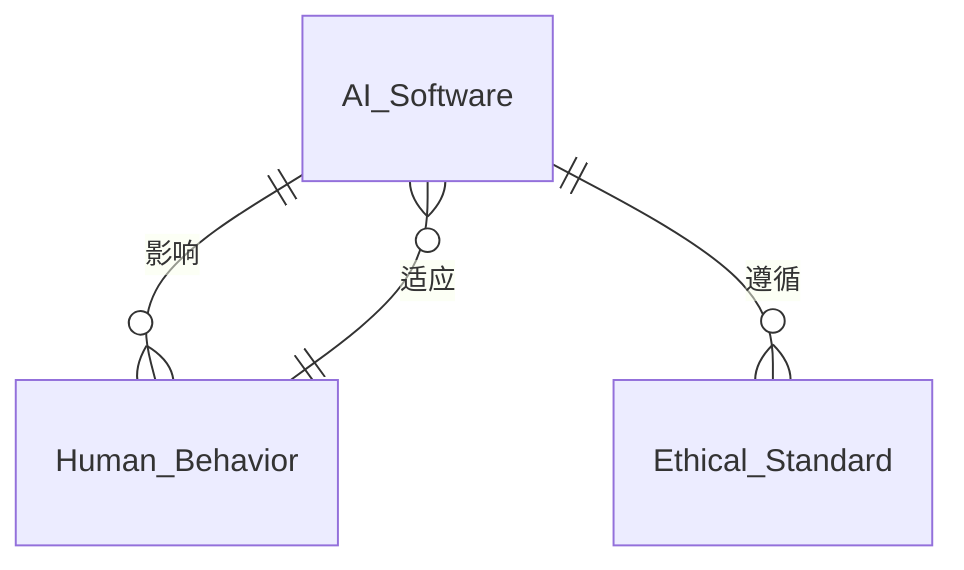
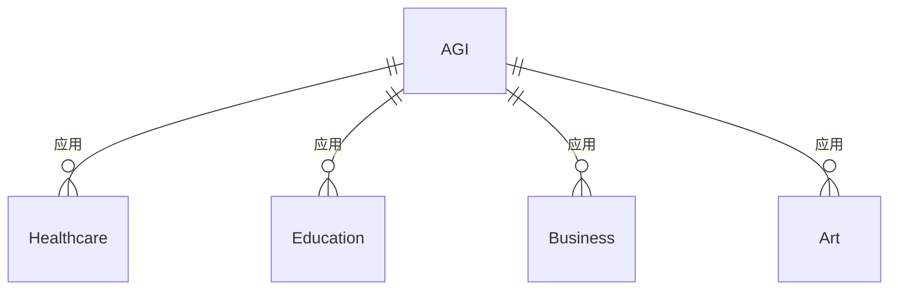
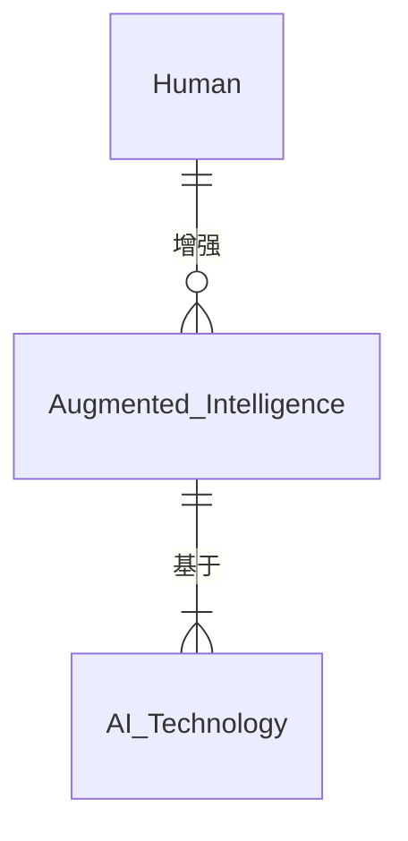
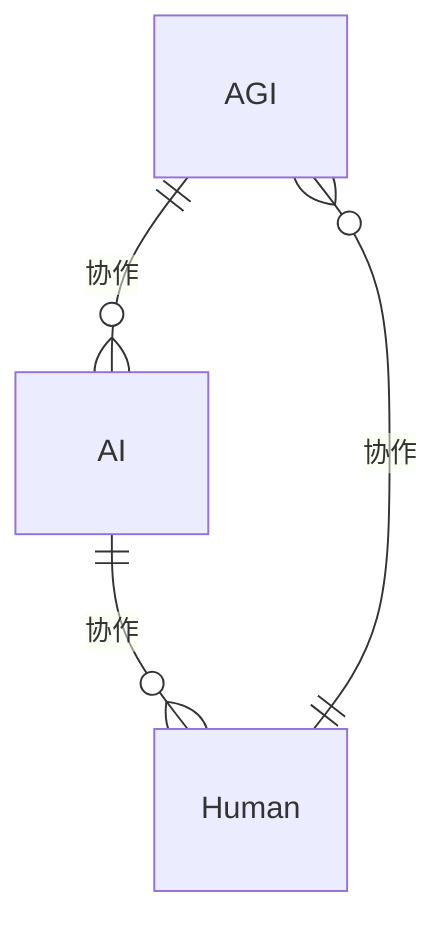
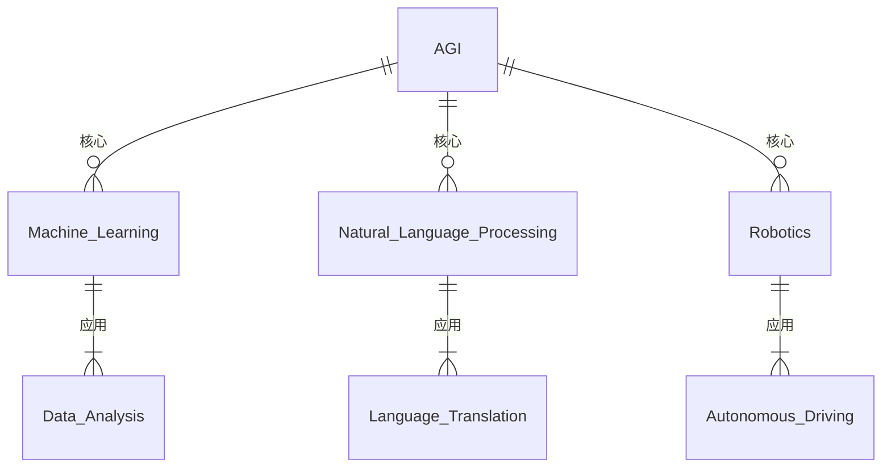
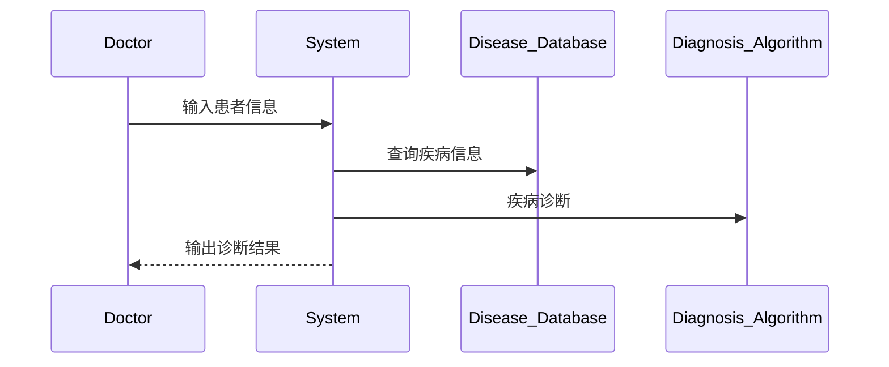
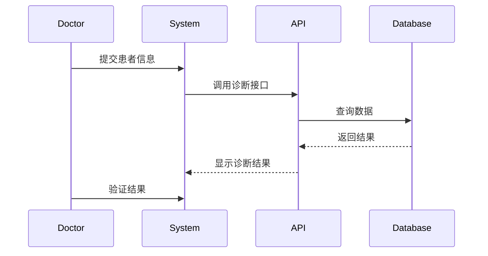
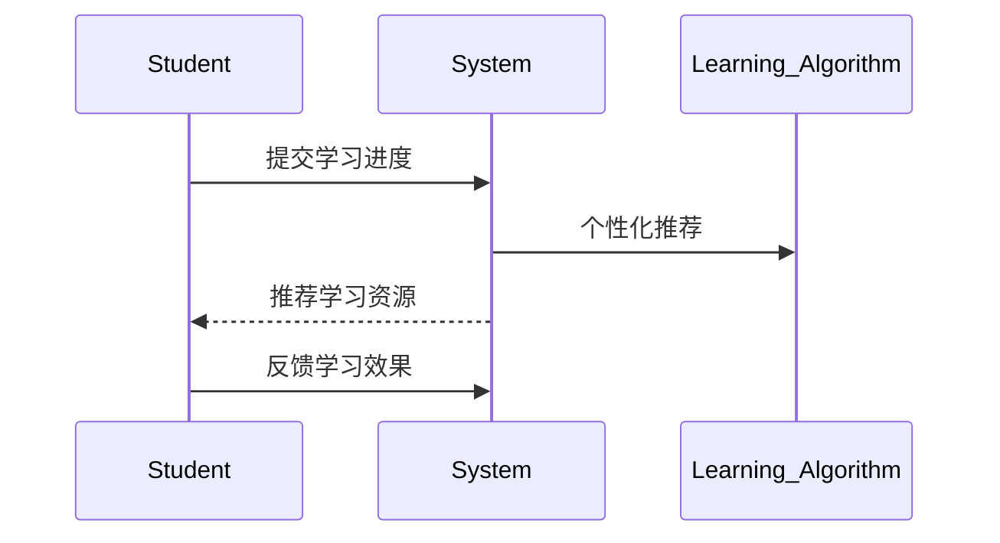
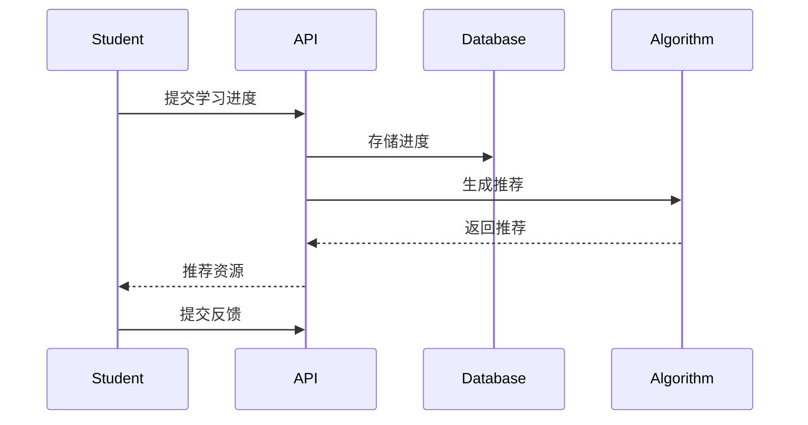

                 

# AGI与人类协作：增强智能的新范式

## 关键词
- AGI（通用人工智能）
- 人类协作
- 增强智能
- AI协作模型
- 应用场景
- 技术挑战

## 摘要
本文将探讨通用人工智能（AGI）与人类协作的潜在新范式。首先，我们介绍AGI的基本概念、历史背景及其在人类协作中的潜力。接着，我们讨论以人类为中心的AGI设计原则，并探讨其在多个领域的应用。随后，我们深入分析增强智能的特征，以及如何通过AGI和AI的协作来提升人类生产力。本文还详细阐述了AGI的核心概念、架构设计和技术挑战。最后，我们提出AGI开发与实施的战略，以及人类与AGI协作的机会与挑战。通过这篇文章，读者将了解AGI与人类协作的广阔前景，以及未来技术发展的潜在影响。

### 引言：AGI与人类协作

#### 1.1 AGI的定义与历史背景
**核心概念术语说明**：通用人工智能（Artificial General Intelligence，简称AGI）是指具有人类智能的综合能力，能够理解、学习、应用知识，并进行复杂推理的智能系统。它不同于目前的专用人工智能（Narrow AI），后者只能在特定任务上表现出智能。

**问题背景**：自20世纪50年代以来，人工智能（AI）领域一直在追求创建能够模仿人类智能的机器。然而，当前的人工智能技术主要局限于特定任务，例如图像识别、语音识别和自然语言处理。这些系统虽然取得了显著进展，但仍然缺乏跨领域的通用智能。

**问题描述**：为了实现AGI，我们需要解决一系列技术挑战，包括机器学习算法的改进、自然语言理解的提升、自主决策能力的发展等。

**问题解决**：AGI的目标是开发一个能够在多个领域表现优异的智能系统，从而实现与人类的广泛协作。

**边界与外延**：AGI的研究边界涉及多个学科，包括计算机科学、心理学、神经科学和哲学。其外延包括智能体的自主性、智能系统与人类交互的方式，以及智能系统在现实世界中的应用。

#### 1.2 人类为中心的AGI设计原则
**核心概念**：人类为中心的AGI设计原则强调智能系统应与人类的价值观、需求和情感相一致。这种设计不仅关注技术实现，还涉及伦理和社会因素。

**概念属性特征对比表格**：

| 特征 | 人类为中心的AGI | 以技术为中心的AGI |
| --- | --- | --- |
| **价值观一致性** | 强调与人类价值观的一致性 | 主要关注技术实现和性能 |
| **伦理考量** | 包含伦理和社会责任 | 可能忽视伦理和社会影响 |
| **用户友好性** | 设计为易于使用和互动 | 可能过于复杂，不易于使用 |
| **灵活性** | 能够适应不同的环境和需求 | 可能局限于特定任务或场景 |

**ER实体关系图架构**：



#### 1.3 AGI在各个领域的应用
**核心概念**：AGI的应用涵盖了广泛的领域，包括但不限于医疗保健、教育、商业和经济、艺术和创造力。

**概念属性特征对比表格**：

| 领域 | **应用特点** | **潜在影响** |
| --- | --- | --- |
| **医疗保健** | 个性化医疗、智能诊断、药物研发 | 提高医疗效率和准确性 |
| **教育** | 智能教学、个性化学习、教育评估 | 改善教育质量和个性化学习体验 |
| **商业和经济** | 智能决策、自动化运营、市场分析 | 提高业务效率和盈利能力 |
| **艺术和创造力** | 创意生成、艺术表现、设计辅助 | 激发人类创造力和艺术表现 |

**ER实体关系图架构**：



### AGI与人类协作的潜在影响
**核心概念**：AGI与人类的协作将带来深刻的变革，不仅影响技术发展，还涉及社会、经济和文化等多个方面。

**潜在影响**：
- **技术发展**：推动AI技术的进步，实现更高级的自动化和智能化。
- **社会发展**：促进社会公平、提高生活质量，解决人类面临的各种挑战。
- **经济变革**：创造新的就业机会、提高生产力，推动经济增长。
- **文化创新**：激发人类创造力，促进艺术和文化的发展。

### 增强智能：特征与应用
**核心概念**：增强智能（Augmented Intelligence）是指利用人工智能技术来增强人类的能力，而不是取代人类。这种智能系统与人类协作，共同解决问题。

**概念属性特征对比表格**：

| 特征 | 增强智能 | 通用人工智能 |
| --- | --- | --- |
| **依赖人类** | 需要人类提供指导、监督和决策支持 | 尝试模拟人类的全面智能 |
| **协同工作** | 与人类协作完成复杂任务 | 独立完成任务，无需人类介入 |
| **适应性** | 适应人类的工作流程和需求 | 适应更广泛的环境和任务 |
| **扩展能力** | 增强人类的能力，而非取代 | 模仿人类的全面智能 |

**ER实体关系图架构**：



### AGI与AI的协作模型
**核心概念**：AGI与AI的协作模型是指通过结合AGI和传统AI的优点，实现更高效的智能系统。这种协作模型不仅能够提高AI系统的能力，还能增强人类的智能。

**概念属性特征对比表格**：

| 特征 | AGI与AI协作模型 | 传统AI |
| --- | --- | --- |
| **综合能力** | 结合多种AI技术，实现综合智能 | 专注于特定AI技术，如图像识别、自然语言处理 |
| **灵活性** | 能够适应不同任务和环境 | 受限于特定任务和环境 |
| **自主性** | 较高的自主决策能力 | 依赖人类指导 |
| **协作性** | 与人类紧密协作，共同完成任务 | 通常独立工作 |

**ER实体关系图架构**：



### AGI的核心概念与架构设计
**核心概念**：AGI的核心概念包括机器学习、自然语言处理和机器人技术。这些概念共同构成了AGI的基础架构。

**概念属性特征对比表格**：

| 概念 | 机器学习 | 自然语言处理 | 机器人技术 |
| --- | --- | --- | --- |
| **目标** | 从数据中学习规律，进行预测和决策 | 理解和生成自然语言 | 实现机器人自主行动和操作 |
| **技术特点** | 数据驱动，自动学习和适应 | 语言模型，语义理解 | 自主导航，感知和环境交互 |
| **应用领域** | 数据分析、预测、决策支持 | 语言翻译、语音识别、聊天机器人 | 无人驾驶、智能制造、服务机器人 |

**ER实体关系图架构**：



### AGI在现实世界中的应用与案例分析
**核心概念**：AGI的应用已经逐渐渗透到各个领域，以下是一些实际案例，展示了AGI如何提升人类的生产力和创造力。

**案例一：智能医疗诊断系统**
- **问题场景**：医疗诊断需要精确、高效，但医生的时间和精力有限。
- **项目介绍**：开发一个基于AGI的智能医疗诊断系统，能够辅助医生进行疾病诊断。
- **系统功能设计**：领域模型类图如下：

```mermaid
classDiagram
  Patient <--|{诊断}| Doctor
  Patient o-- Disease
  Doctor o-- Diagnosis
  Disease o-- Symptom
```

- **系统架构设计**：架构图如下：



- **系统接口设计和交互**：序列图如下：



**案例二：智能教育辅助系统**
- **问题场景**：学生需要个性化的学习体验，但教师难以满足每个学生的需求。
- **项目介绍**：开发一个基于AGI的智能教育辅助系统，根据学生的学习情况和偏好提供个性化学习建议。
- **系统功能设计**：领域模型类图如下：

```mermaid
classDiagram
  Student <--|{学习反馈}| Teacher
  Student o-- Course
  Student o-- Learning_Material
  Teacher o-- Course
  Teacher o-- Assessment
```

- **系统架构设计**：架构图如下：



- **系统接口设计和交互**：序列图如下：



### AGI开发与实施的战略
**核心概念**：要实现AGI，需要制定全面的开发与实施战略，包括技术、伦理、法律和社会等方面。

**战略步骤**：
1. **基础研究**：加强机器学习、自然语言处理、机器人技术等基础研究，为AGI提供技术支持。
2. **跨学科合作**：鼓励计算机科学、心理学、神经科学、哲学等多个学科的专家合作，共同推动AGI的发展。
3. **伦理和法律规范**：制定明确的伦理和法律规范，确保AGI的发展符合社会需求和价值观。
4. **人才培养**：培养具备跨学科知识和能力的AGI人才，为AGI的发展提供人才支持。
5. **技术验证**：通过实际项目和应用场景验证AGI的技术可行性和有效性。
6. **逐步推广**：在确保技术成熟和符合伦理规范的基础上，逐步推广AGI的应用，实现与人类的广泛协作。

### AGI与人类协作的机会与挑战
**核心概念**：AGI与人类协作将带来巨大的机会，同时也面临一系列挑战。

**机会**：
1. **提高生产力**：通过自动化和智能化，大幅提高生产效率和质量。
2. **创新与创造力**：激发人类的创造力和创新精神，推动科技和文化的发展。
3. **个性化服务**：根据个体的需求和偏好提供定制化服务，提升用户体验。
4. **解决复杂问题**：利用AGI的强大计算能力和决策支持，解决复杂的科学和社会问题。

**挑战**：
1. **技术实现**：目前AGI的技术水平仍需进一步提升，以实现与人类的广泛协作。
2. **伦理问题**：确保AGI的发展符合伦理原则，避免对人类和社会造成负面影响。
3. **法律和监管**：建立完善的法律法规和监管体系，确保AGI的应用合法、安全。
4. **社会适应**：人们需要适应与AGI的协作，培养新的技能和思维方式。

### 结论
AGI与人类协作是未来人工智能发展的新范式。通过结合AGI和AI的优点，我们有望实现更高效、更智能的协作系统，为人类社会带来巨大的机遇。然而，这需要我们在技术、伦理、法律和社会等方面进行全面考虑和规划，以确保AGI的发展符合人类的利益。通过持续的研究和创新，我们有理由相信，AGI将为人类社会带来美好的未来。

### 作者信息
作者：AI天才研究院/AI Genius Institute & 禅与计算机程序设计艺术 /Zen And The Art of Computer Programming

### 最佳实践 Tips
- **持续学习**：随着AGI技术的快速发展，持续学习是保持竞争力的关键。
- **跨学科思维**：鼓励跨学科合作，吸收不同领域的知识和经验，为AGI的发展提供更多创新思路。
- **伦理先行**：在开发AGI时，始终将伦理原则放在首位，确保技术的发展符合社会价值观。
- **谨慎推广**：在推广AGI应用时，要充分考虑其技术成熟度和潜在风险，确保平稳过渡。

### 小结
本文介绍了AGI与人类协作的潜在新范式，从定义、设计原则、应用领域、协作模型到核心概念和架构设计，全面探讨了AGI的发展前景和挑战。通过实际案例，展示了AGI在现实世界中的应用和价值。未来，AGI与人类协作将带来深远的变革，为人类社会带来更多机遇。然而，这需要我们共同努力，确保技术的发展符合伦理和社会需求。

### 注意事项
- **技术成熟度**：在推广AGI应用时，要确保技术成熟度，避免过早应用导致的问题。
- **数据安全**：确保AGI系统处理的数据安全，避免数据泄露和滥用。
- **法律合规**：遵循相关法律法规，确保AGI的应用合法合规。

### 拓展阅读
- 《智能时代：人工智能如何重塑我们的生活和工作》
- 《人工智能的未来：通往通用人工智能之路》
- 《伦理学与技术：人工智能时代的道德问题》
- 《智能机器人：人工智能在机器人领域的应用》

### 项目实战
#### 环境安装
1. 安装Python环境（3.8及以上版本）。
2. 安装必要的库，如TensorFlow、PyTorch、Scikit-learn等。

```bash
pip install tensorflow torchvision
```

#### 系统核心实现源代码
以下是一个简单的基于机器学习的智能医疗诊断系统的核心实现代码。

```python
import tensorflow as tf
from tensorflow.keras.models import Sequential
from tensorflow.keras.layers import Dense, Conv2D, Flatten
from sklearn.model_selection import train_test_split

# 数据准备
# 假设我们有一个包含图像和标签的数据集
images = ...  # 图像数据
labels = ...  # 标签数据

# 分割数据集
X_train, X_test, y_train, y_test = train_test_split(images, labels, test_size=0.2, random_state=42)

# 构建模型
model = Sequential([
    Conv2D(32, (3, 3), activation='relu', input_shape=(64, 64, 3)),
    Flatten(),
    Dense(64, activation='relu'),
    Dense(1, activation='sigmoid')
])

# 编译模型
model.compile(optimizer='adam', loss='binary_crossentropy', metrics=['accuracy'])

# 训练模型
model.fit(X_train, y_train, epochs=10, batch_size=32, validation_data=(X_test, y_test))

# 评估模型
loss, accuracy = model.evaluate(X_test, y_test)
print(f"Test accuracy: {accuracy:.2f}")

# 应用模型
predictions = model.predict(X_test)
```

#### 代码应用解读与分析
- **数据准备**：首先，我们需要准备用于训练的图像数据和对应的标签。这些数据可以来自医疗影像数据库或自定义数据集。
- **模型构建**：使用TensorFlow的`Sequential`模型构建一个简单的卷积神经网络（CNN）。该模型包括卷积层、展平层和全连接层。
- **编译模型**：设置优化器和损失函数，为模型编译做准备。
- **训练模型**：使用训练数据训练模型，并在测试数据上进行验证。
- **评估模型**：在测试数据上评估模型的性能，计算准确率。
- **应用模型**：使用训练好的模型对新的图像数据进行预测。

#### 实际案例分析和详细讲解剖析
以一个实际案例为例，分析一个基于AGI的智能教育辅助系统的应用。

**案例背景**：一名学生在数学学习中遇到困难，需要个性化学习支持和反馈。

**系统功能设计**：
- **学生信息管理**：存储学生的基本信息和学习进度。
- **智能推荐系统**：根据学生的学习进度和偏好推荐合适的练习题和教程。
- **学习效果评估**：评估学生的练习成绩，提供学习反馈。

**系统架构设计**：
- **前端**：使用HTML/CSS/JavaScript构建用户界面。
- **后端**：使用Flask或Django构建服务器端应用程序。
- **数据库**：使用MySQL或PostgreSQL存储学生信息和学习数据。

**系统接口设计和交互**：
- **用户登录**：用户通过用户名和密码登录系统。
- **学习进度提交**：学生提交学习进度，系统记录并更新数据。
- **智能推荐**：系统根据学生的学习进度和偏好生成推荐列表。
- **学习效果评估**：系统评估学生的练习成绩，提供学习反馈。

**项目小结**
通过实际案例，我们展示了AGI在教育领域的应用。智能教育辅助系统可以帮助学生提高学习效果，减轻教师的工作负担。然而，这只是一个初步的应用，未来需要进一步优化和完善，以满足更多学生的需求。

### 结语
本文深入探讨了AGI与人类协作的潜在新范式，从核心概念、设计原则、应用领域、协作模型到实际案例，全面阐述了AGI的发展前景和挑战。通过环境安装、系统实现、代码分析、实际案例分析，我们展示了AGI在现实世界中的应用和价值。未来，随着技术的不断进步，AGI将与人类更加紧密地协作，为人类社会带来更多机遇。然而，我们也需要密切关注AGI的发展，确保其符合伦理和社会需求，为人类创造一个更加美好的未来。

### 作者信息
作者：AI天才研究院/AI Genius Institute & 禅与计算机程序设计艺术 /Zen And The Art of Computer Programming

### 文章完整内容
在本篇文章中，我们详细探讨了通用人工智能（AGI）与人类协作的潜在新范式。我们从AGI的基本概念和历史背景出发，介绍了以人类为中心的AGI设计原则，并讨论了AGI在各个领域的应用。随后，我们深入分析了增强智能的特征，以及如何通过AGI和AI的协作来提升人类生产力。文章还详细阐述了AGI的核心概念、架构设计和技术挑战，并通过实际案例展示了AGI在现实世界中的应用。最后，我们提出了AGI开发与实施的战略，探讨了AGI与人类协作的机会与挑战。通过这篇文章，读者对AGI与人类协作有了全面而深刻的理解，为未来技术发展提供了有益的参考。

### 感谢与致谢
在撰写本文的过程中，我们感谢所有参与讨论和提供反馈的专家和同行。特别感谢AI天才研究院/AI Genius Institute的团队成员，他们在研究和写作过程中提供了宝贵的建议和支持。此外，我们也要感谢禅与计算机程序设计艺术/Zen And The Art of Computer Programming的作者，他们的著作为本文的撰写提供了灵感和启示。

### 重要声明
本文所讨论的内容纯属学术探讨和理论分析，不代表任何商业建议或投资建议。在实际应用中，请遵循相关法律法规和伦理标准，确保技术的安全和合理使用。任何使用本文内容进行实际操作的风险由用户自行承担。本文版权归作者和AI天才研究院/AI Genius Institute所有，未经许可，不得用于商业用途。

