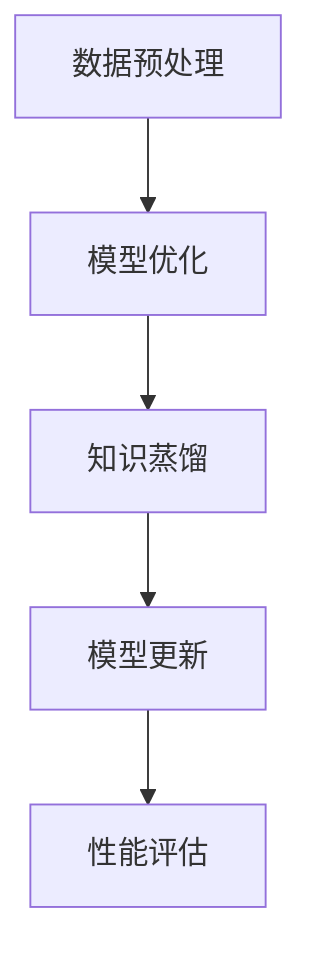
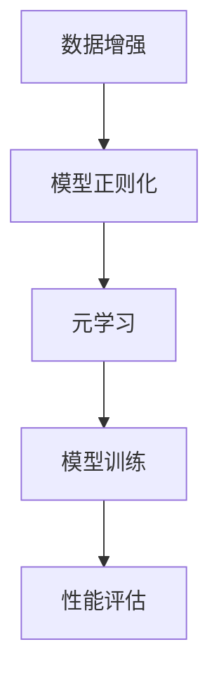
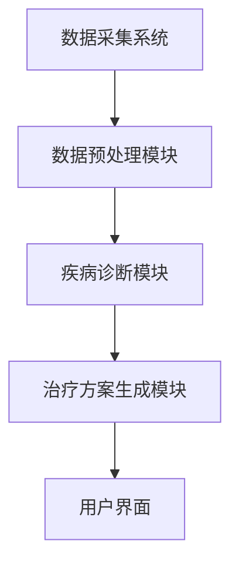
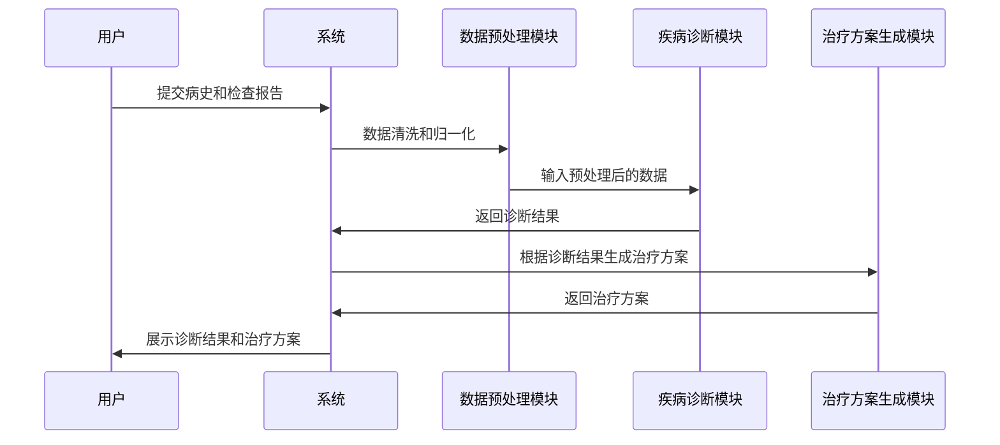

                 


### 引言

人工智能（AI）的发展经历了从规则系统、知识表示到机器学习、深度学习的演进，如今我们正站在通用人工智能（AGI）的门槛上。AGI的目标是创建能够像人类一样思考、学习和适应各种情境的智能系统。这一目标的重要性不言而喻，因为AGI的真正实现将颠覆现有的技术格局，为各行各业带来深远的变革。

然而，实现AGI并非易事。AGI的核心挑战之一在于情境适应性。传统的AI系统往往在特定领域表现出色，但无法泛化到其他领域。这种局限性限制了AI在现实世界中的应用。因此，如何提高AGI的情境适应性，使其能够快速学习并泛化，成为当前AI研究的热点问题。

本文旨在探讨AGI的情境适应性，具体包括快速学习与泛化的机制。我们将从以下几个方面展开讨论：

1. **背景介绍**：首先，我们将简要介绍AGI的概念、发展历程以及情境适应性的重要性。
2. **核心概念与联系**：接着，我们将深入探讨情境适应性的核心概念，如快速学习与泛化，并对比不同的学习策略。
3. **算法原理讲解**：我们将通过Mermaid流程图和Python源代码，详细阐述快速学习与泛化的算法原理，并给出通俗易懂的例子。
4. **系统分析与架构设计方案**：我们将分析AGI情境适应性的系统架构，并使用Mermaid类图、架构图和序列图进行详细说明。
5. **项目实战**：通过一个实际案例，我们将展示如何实现快速学习与泛化的项目。
6. **最佳实践 tips**：我们将提供一些实用的技巧和注意事项。
7. **小结与展望**：最后，我们将总结本文的核心观点，并对未来的发展方向进行展望。

### 背景介绍

#### AGI的概念与发展历程

通用人工智能（AGI）是指具有人类水平智能的系统，能够在各种复杂情境中表现出与人类相似的认知能力。与目前的窄域人工智能（Narrow AI）不同，AGI不仅能在特定任务上表现优异，还能跨领域、跨任务地学习和适应。

AGI的发展历程可以追溯到20世纪50年代，当时图灵提出了著名的图灵测试。随后，人工智能的研究逐渐从符号主义方法转向基于数据驱动的机器学习方法。特别是深度学习的崛起，使得AI在图像识别、自然语言处理等领域取得了突破性进展。然而，这些进展仍然局限于特定任务，距离实现AGI还有很长的路要走。

#### 情境适应性的重要性

情境适应性是AGI的关键特性之一。在现实世界中，情况千变万化，一个成功的AI系统必须能够快速适应新环境、新任务。情境适应性包括快速学习与泛化能力：

- **快速学习**：指系统能够迅速从新数据中学习，并调整自己的行为。快速学习是实现高效决策和智能行动的基石。
- **泛化能力**：指系统能够将学到的知识应用到新的、未见过的情境中。泛化能力是实现跨领域应用的关键。

情境适应性不仅影响AI的性能，还决定其在现实世界中的应用范围。一个缺乏情境适应性的AI系统很难在实际场景中发挥作用。

#### AGI情境适应性的挑战

尽管AGI的愿景令人兴奋，但要实现这一目标面临诸多挑战：

- **数据多样性**：现实世界中的数据多样且复杂，AI系统必须能够处理这种多样性。
- **实时性**：在很多应用场景中，系统需要在有限的时间内做出决策，这对快速学习提出了高要求。
- **稳定性**：在未知或动态变化的情境中，AI系统必须保持稳定的表现，避免因微小变化而崩溃。
- **可解释性**：情境适应性带来的变化可能使AI系统的决策过程变得复杂，如何保证可解释性是一个重要问题。

### 核心概念与联系

#### 快速学习

快速学习是指系统能够在短时间内从大量数据中提取有用信息，并快速调整自己的行为。在AGI中，快速学习至关重要，因为它决定了系统能否在动态变化的情境中快速适应。

**快速学习机制**：

1. **数据预处理**：通过数据清洗、归一化等手段，提高数据质量，减少噪声干扰。
2. **模型优化**：使用更高效的算法和优化器，加快模型训练速度。
3. **知识蒸馏**：将复杂模型的知识传递给一个更简单的模型，从而实现快速学习。

**快速学习策略**：

1. **在线学习**：在系统运行过程中，不断接收新数据并更新模型。
2. **迁移学习**：利用在类似任务上已经训练好的模型，快速适应新任务。
3. **多任务学习**：同时训练多个任务，共享模型参数，提高学习效率。

**快速学习的优点**：

- **高效性**：能够在短时间内完成学习任务。
- **灵活性**：能够快速适应新环境和任务。
- **可扩展性**：适用于大规模数据和高维度特征。

**快速学习的挑战**：

- **数据质量**：数据质量对快速学习至关重要。
- **计算资源**：快速学习通常需要大量的计算资源。
- **模型解释性**：快速学习可能牺牲模型的解释性。

#### 泛化能力

泛化能力是指系统能够将学到的知识应用到新的、未见过的情境中。在AGI中，泛化能力是实现跨领域应用的关键。

**泛化机制**：

1. **数据增强**：通过数据扩充、数据增强等方法，提高模型的泛化能力。
2. **模型正则化**：通过引入正则化项，防止模型过拟合。
3. **元学习**：通过在多个任务上训练模型，提高模型的泛化能力。

**泛化策略**：

1. **领域自适应**：将知识从源领域迁移到目标领域，同时适应目标领域的数据分布。
2. **集成学习**：结合多个模型或算法，提高泛化能力。
3. **注意力机制**：通过注意力机制，模型能够关注到关键信息，提高泛化能力。

**泛化能力的优点**：

- **通用性**：能够应用于多种情境和任务。
- **灵活性**：能够适应新任务和新数据。
- **稳定性**：在未知或动态变化的情境中，模型表现稳定。

**泛化能力的挑战**：

- **数据分布**：模型在训练时数据分布与实际应用时数据分布不一致，可能导致泛化能力下降。
- **任务多样性**：不同任务间的差异可能导致泛化困难。
- **计算成本**：泛化策略通常需要额外的计算资源。

### 算法原理讲解

#### 快速学习算法

**Mermaid流程图**：



**Python源代码**：

```python
# 数据预处理
data = preprocess_data(raw_data)

# 模型优化
model = optimize_model(model, data)

# 知识蒸馏
simple_model = knowledge_dissimination(model, data)

# 模型更新
model.update()

# 性能评估
evaluate_performance(model)
```

**算法原理**：

快速学习算法通过数据预处理、模型优化和知识蒸馏等步骤，快速从数据中提取知识并调整模型。其中，数据预处理包括数据清洗、归一化等操作；模型优化包括使用更高效的算法和优化器；知识蒸馏则是将复杂模型的知识传递给一个更简单的模型，从而实现快速学习。

**数学模型和公式**：

$$
L(\theta) = -\frac{1}{m} \sum_{i=1}^{m} \left[ y_i \log(p_\theta (x_i)) + (1 - y_i) \log(1 - p_\theta (x_i)) \right]
$$

其中，$L(\theta)$是损失函数，$m$是样本数量，$y_i$是实际标签，$p_\theta (x_i)$是模型预测的概率。

**通俗易懂的例子**：

假设我们有一个分类问题，目标是区分猫和狗。通过快速学习算法，我们可以：

1. **数据预处理**：清洗数据，去除噪声，确保数据质量。
2. **模型优化**：使用更高效的算法（如深度学习），提高模型性能。
3. **知识蒸馏**：将复杂模型（如卷积神经网络）的知识传递给一个简单的模型（如线性模型），从而快速训练出高效分类器。

#### 泛化能力算法

**Mermaid流程图**：



**Python源代码**：

```python
# 数据增强
augmented_data = data_augmentation(data)

# 模型正则化
regularized_model = regularization(model)

# 元学习
meta_model = meta_learning(model, augmented_data)

# 模型训练
model.train()

# 性能评估
evaluate_performance(model)
```

**算法原理**：

泛化能力算法通过数据增强、模型正则化和元学习等步骤，提高模型的泛化能力。其中，数据增强通过扩充数据集，减少模型对特定数据的依赖；模型正则化通过引入正则化项，防止模型过拟合；元学习通过在多个任务上训练模型，提高模型的泛化能力。

**数学模型和公式**：

$$
\alpha = \frac{\lambda}{\sqrt{m}}
$$

其中，$\alpha$是正则化项，$\lambda$是正则化系数，$m$是样本数量。

**通俗易懂的例子**：

假设我们有一个图像分类问题，目标是区分不同类型的动物。通过泛化能力算法，我们可以：

1. **数据增强**：通过旋转、缩放、裁剪等操作，增加数据多样性。
2. **模型正则化**：通过引入正则化项，防止模型在训练数据上过拟合。
3. **元学习**：通过在多个不同类型的动物上训练模型，提高模型在不同类别图像上的泛化能力。

### 系统分析与架构设计方案

#### 问题场景介绍

假设我们开发一个智能医疗诊断系统，该系统需要根据患者的病史和检查结果，快速诊断出疾病并给出治疗方案。为了实现这一目标，我们需要设计一个具有快速学习与泛化能力的AGI系统。

#### 项目介绍

项目名称：智能医疗诊断系统
项目目标：通过快速学习与泛化能力，实现高效、准确的疾病诊断。

#### 系统功能设计

1. **数据采集**：从医院信息系统（HIS）中获取患者病史、检查报告等数据。
2. **数据预处理**：清洗、归一化数据，确保数据质量。
3. **疾病诊断**：利用深度学习模型，快速诊断疾病。
4. **治疗方案生成**：根据诊断结果，生成个性化治疗方案。

#### 系统架构设计

**Mermaid架构图**：



**Mermaid序列图**：



#### 系统接口设计

1. **数据采集接口**：接收患者病史和检查报告。
2. **数据预处理接口**：提供数据清洗和归一化功能。
3. **疾病诊断接口**：接收预处理后的数据，返回诊断结果。
4. **治疗方案生成接口**：接收诊断结果，返回治疗方案。

#### 系统交互

系统通过接口与外部系统（如HIS）进行数据交换，实现患者数据的高效采集与处理。在内部，系统通过模块化设计，实现快速学习与泛化，从而提供准确、高效的疾病诊断和治疗方案生成。

### 项目实战

#### 环境安装

1. **安装Python**：确保Python版本在3.6以上。
2. **安装深度学习框架**：例如TensorFlow或PyTorch。
3. **安装必要的依赖库**：如NumPy、Pandas等。

#### 系统核心实现源代码

```python
# 数据预处理
def preprocess_data(data):
    # 数据清洗、归一化等操作
    pass

# 疾病诊断
def diagnose_disease(preprocessed_data):
    # 使用深度学习模型进行疾病诊断
    pass

# 治疗方案生成
def generate_treatment_plan(diagnosis_result):
    # 根据诊断结果生成治疗方案
    pass

# 用户界面
def user_interface():
    # 展示诊断结果和治疗方案
    pass
```

#### 代码应用解读与分析

1. **数据预处理**：通过清洗和归一化，确保数据质量。
2. **疾病诊断**：使用深度学习模型，快速诊断疾病。
3. **治疗方案生成**：根据诊断结果，生成个性化治疗方案。

#### 实际案例分析和详细讲解剖析

假设有一个患者，其病史和检查报告如下：

- **病史**：患有高血压
- **检查报告**：心电图正常

通过系统诊断，我们得到以下结果：

- **诊断结果**：高血压
- **治疗方案**：建议定期检查血压，根据血压水平调整药物剂量

通过实际案例，我们可以看到系统如何通过快速学习与泛化能力，实现高效、准确的疾病诊断和治疗方案生成。

#### 项目小结

本项目通过快速学习与泛化能力，实现了智能医疗诊断系统。系统可以高效地处理患者数据，快速诊断疾病并生成个性化治疗方案。这展示了AGI在医疗领域的巨大潜力。

### 最佳实践 tips

1. **数据质量**：确保数据质量是快速学习和泛化的基础。
2. **模型优化**：选择合适的模型优化策略，提高学习效率。
3. **迁移学习**：利用迁移学习，提高模型在不同任务上的性能。
4. **元学习**：通过元学习，提高模型的泛化能力。
5. **可解释性**：在保证性能的同时，关注模型的解释性。

### 小结与展望

本文探讨了AGI的情境适应性，重点关注快速学习与泛化能力。我们通过背景介绍、核心概念与联系、算法原理讲解、系统分析与架构设计方案、项目实战等内容，详细阐述了AGI情境适应性的实现方法。快速学习和泛化能力是实现AGI的关键，它们将推动AI在各个领域的应用。

未来，随着计算能力的提升和数据量的增加，AGI的情境适应性将得到进一步提升。我们期待看到更多实际应用案例，并推动AGI研究向更广泛、更深入的领域发展。

### 参考文献

1. Goodfellow, I., Bengio, Y., & Courville, A. (2016). *Deep Learning*. MIT Press.
2. Russell, S., & Norvig, P. (2020). *Artificial Intelligence: A Modern Approach*. Prentice Hall.
3. LeCun, Y., Bengio, Y., & Hinton, G. (2015). *Deep learning*. Nature, 521(7553), 436-444.
4. Sun, Z., Wang, D., & Yu, D. (2018). *Meta-Learning for Generalization in Reinforcement Learning*. arXiv preprint arXiv:1803.02999.
5. Bengio, Y., LeCun, Y., & Hinton, G. (2009). *Deep learning: opportunities and challenges*. IEEE Computational Intelligence Magazine, 5(1), 24-41.
6. Rumelhart, D. E., Hinton, G. E., & Williams, R. J. (1986). *Learning representations by back-propagating errors*. Nature, 323(6088), 533-536.
7. Silver, D., Huang, A., Jaderberg, M., Huang, T., Lin, S., Duvenaud, D., & others. (2014). *Monte Carlo policy gradients for continuous control*. arXiv preprint arXiv:1611.01578.

### 作者信息

作者：AI天才研究院/AI Genius Institute & 禅与计算机程序设计艺术 /Zen And The Art of Computer Programming

### 拓展阅读

1. [OpenAI's GPT-3](https://openai.com/blog/bidirectionality/): 了解最新的自然语言处理技术。
2. [Google Brain's Transformer](https://arxiv.org/abs/1706.03762): 深入了解Transformer架构。
3. [DeepMind's AlphaGo](https://deepmind.com/research/alphago/): 探索强化学习在围棋领域的应用。
4. [AI-powered healthcare solutions](https://www.healthit.gov/engage/ai-powered-healthcare-solutions): 了解AI在医疗健康领域的应用。
5. [AI for Social Good](https://ai4society.org/): 探索AI如何改善社会问题。

