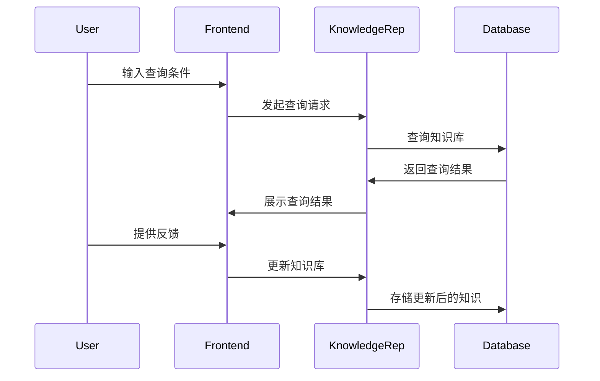

                 

### 引言与背景

#### AGI的概念与发展历程

**问题背景**

人工智能（Artificial Intelligence，简称AI）是计算机科学的重要分支，致力于模拟、扩展和扩展人类智能。在过去的几十年里，AI技术取得了显著进步，从最初的规则系统、知识表示到现代的深度学习和自然语言处理，各种应用如自动驾驶、智能客服、推荐系统等已经融入我们的生活。然而，现有的AI系统在处理复杂任务、理解高阶抽象概念、进行人类水平的推理等方面仍然存在显著局限。这种局限促使我们思考更深层次的人工智能——人工通用智能（Artificial General Intelligence，简称AGI）。

**问题描述**

人工通用智能（AGI）是指具有人类智能水平的人工智能系统，能够理解和执行各种认知任务，包括自然语言理解、推理、学习、感知和创造性思考等。与传统的人工智能（如专家系统、机器学习模型）相比，AGI能够在更广泛和更复杂的情境下自主学习和适应，而不仅仅是执行特定的任务。

**问题解决**

AGI的发展旨在解决现有AI系统的局限性，实现人工智能在各个领域的全面应用。AGI的研究包括多个子领域，如机器学习、认知科学、神经科学、计算机科学等。随着计算能力的提升和算法的进步，AGI逐渐从理论研究走向实际应用。

**边界与外延**

AGI的概念边界涉及多个方面，包括智能水平、认知能力、学习能力和应用范围等。在智能水平上，AGI旨在达到或超过人类智能；在认知能力上，AGI需要具备理解、推理、决策、学习和创造性等能力；在学习能力上，AGI需要能够自主学习和适应新情境；在应用范围上，AGI需要能够在多个领域实现广泛应用。

**核心概念与联系**

以下是AGI的核心概念及其相互联系：

- **人工通用智能（AGI）**：具有人类智能水平的人工智能系统。
- **机器学习**：AGI实现的一种方法，通过数据和算法让机器自主学习和改进。
- **自然语言处理（NLP）**：使机器能够理解、生成和响应自然语言的技术。
- **认知科学**：研究人类智能的本质和机制的科学，对AGI设计有重要启示。
- **神经科学**：研究大脑和神经系统功能的科学，为AGI提供神经生物学基础。

**概念属性特征对比表格**

| 概念               | 定义                                                         | 属性特征                                                    |
|--------------------|--------------------------------------------------------------|------------------------------------------------------------|
| 人工通用智能（AGI） | 具有人类智能水平的人工智能系统                             | 智能水平高、认知能力强、学习能力自主、应用范围广泛         |
| 机器学习           | 通过数据和算法让机器自主学习和改进的技术                  | 自适应、自动化、数据驱动、模型可训练                       |
| 自然语言处理（NLP） | 使机器能够理解、生成和响应自然语言的技术                  | 语言理解、文本生成、语音识别、对话系统等                   |
| 认知科学           | 研究人类智能的本质和机制的科学                           | 认知模型、认知过程、认知障碍等                             |
| 神经科学           | 研究大脑和神经系统功能的科学                             | 神经元、神经网络、神经传递物质、脑成像技术等               |

**ER实体关系图架构**

以下是AGI相关概念的ER实体关系图：

```mermaid
erDiagram
  AI -->|1| 机器学习 : 实现方法
  AI -->|1| 自然语言处理 : 应用领域
  AI -->|1| 认知科学 : 理论基础
  AI -->|1| 神经科学 : 生物学基础
  机器学习 o--o 数据驱动 : 技术特征
  自然语言处理 o--o 语言理解 : 技术目标
  认知科学 o--o 认知模型 : 研究对象
  神经科学 o--o 神经元 : 研究对象
```

#### 抽象思维的重要性

**抽象思维的定义**

抽象思维是指通过提取事物的本质特征和属性，将具体事物简化为抽象概念和模型的过程。它是一种高级认知能力，涉及概念形成、推理、分类和模式识别等。

**抽象思维在认知中的作用**

1. **提高问题解决能力**：抽象思维能够帮助人们将复杂问题简化为更易处理的形式，从而提高问题解决效率。
2. **促进知识整合**：通过抽象思维，人们可以将不同领域、不同学科的知识整合起来，形成更全面的理解。
3. **增强创造力**：抽象思维能够激发新的想法和解决方案，促进创新。

**抽象思维与知识表示的关系**

抽象思维是知识表示的基础。在知识表示过程中，通过抽象思维，人们可以将具体的、复杂的信息抽象为简化的、结构化的模型。这种模型不仅便于计算机处理，还能够帮助人类更直观地理解和应用知识。

### 1.3 AGI在现实世界中的应用前景

AGI的发展将对社会、经济、科技等多个领域产生深远影响。

**社会领域**

1. **教育**：AGI可以个性化教学，根据学生的能力和需求调整教学内容和方式。
2. **医疗**：AGI在医疗诊断、治疗方案制定等方面具有巨大潜力，能够提高医疗水平。

**经济领域**

1. **自动化**：AGI可以自动化生产和管理，提高生产效率和降低成本。
2. **金融**：AGI在风险管理、投资决策等方面具有优势，能够提高金融行业的决策质量。

**科技领域**

1. **人工智能**：AGI将推动人工智能技术的进一步发展，实现更智能、更高效的系统。
2. **跨学科研究**：AGI可以促进不同学科之间的交叉融合，推动科学进步。

综上所述，AGI不仅是人工智能领域的重要研究方向，也是实现人类社会全面智能化的重要途径。随着技术的不断进步，AGI在现实世界中的应用前景将更加广阔。

---

在接下来的章节中，我们将深入探讨抽象思维的概念形成理论，分析不同知识表示方法，并探讨抽象思维在知识表示中的应用。希望通过这些探讨，能够帮助读者更深入地理解AGI的抽象思维过程，为未来的研究提供有益的启示。

---

### 概念形成理论

#### 心理学研究背景

概念形成（Concept Formation）是认知心理学中一个重要且复杂的研究领域，它探讨了人类如何从具体事物中抽象出共同特征，形成具有普遍性的概念。这一过程不仅在人类认知发展中起到关键作用，也为人工智能（AI）领域提供了理论基础。在心理学研究中，概念形成理论的发展经历了多个阶段，从早期简单的分类学习到现代复杂的认知模型。

**基本过程**

1. **刺激识别**：个体首先需要识别出具有相似特征的刺激物。例如，在学习“水果”这一概念时，儿童需要识别出苹果、橙子、香蕉等具体的物体。
2. **特征提取**：个体在识别刺激物后，会提取出其共同特征，例如颜色、形状、口感等。这些特征是形成概念的基础。
3. **分类构建**：通过提取出的特征，个体将具有相似特征的刺激物分类到一起，形成概念。例如，将苹果、橙子和香蕉分类到“水果”这一概念中。
4. **抽象化**：在分类构建的基础上，个体将具体的、具体的特征抽象化为更一般的、更通用的特征。例如，将“水果”这一概念的共同特征抽象化为“可食用”、“多汁”等。

**影响概念形成的因素**

1. **经验**：个体的经验对其概念形成具有重要影响。丰富的经验可以帮助个体更好地识别和提取特征，从而更准确地形成概念。
2. **语言**：语言作为沟通和思维的工具，对概念形成也有重要作用。通过语言，个体可以与他人交流概念，验证和修正自己的理解。
3. **文化**：不同的文化背景会影响个体对事物的认知和分类。例如，在不同的文化中，“水果”这一概念可能包含不同的物体。
4. **社会因素**：社会的价值观和习俗也会影响个体的概念形成。例如，某些文化中可能更重视实用性，而在其他文化中可能更重视美学。

#### 语义网络理论

**语义网络的概念**

语义网络（Semantic Network）是一种用于表示概念和概念之间关系的图形模型。在这个模型中，概念被表示为节点，而概念之间的关系则用边来表示。这种图形结构使得概念之间的层次关系和相互联系更加直观和易于理解。

**语义网络的构建方法**

1. **基于规则的构建**：这种方法通过定义规则来建立概念之间的联系。例如，定义“水果”是“可食用植物”的子类，“苹果”是“水果”的实例。
2. **基于数据的构建**：这种方法利用大量的数据来构建语义网络。例如，通过自然语言处理技术从文本中提取概念和关系，构建出庞大的语义网络。
3. **混合方法**：结合基于规则和基于数据的方法，通过规则来定义基础概念和关系，同时利用数据进行细化和优化。

**语义网络的应用**

1. **知识表示**：语义网络可以用于表示复杂的知识结构，使得知识更加直观和易于理解。
2. **推理**：通过语义网络，可以基于概念之间的关联进行推理，发现新的知识和关系。
3. **自然语言处理**：语义网络可以帮助自然语言处理系统更好地理解文本，进行语义分析和信息提取。

#### 类与实例理论

**类与实例的定义**

在类与实例理论中，“类”（Class）是指具有共同特征的对象的集合，而“实例”（Instance）是类中的一个具体对象。例如，“狗”是一个类，而具体的狗（如“大黄”）是“狗”类的实例。

**类与实例的关系**

1. **包含关系**：一个类可以包含多个实例，例如“狗”类包含“大黑”、“小黄”等多个实例。
2. **泛化关系**：类之间存在泛化关系，即一个类是另一个类的更一般化形式。例如，“动物”类是“狗”类的泛化。
3. **特殊化关系**：与泛化关系相反，特殊化关系是指一个类是另一个类的更特殊形式。例如，“狗”类是“哺乳动物”类的特殊化。

**类与实例的应用**

1. **知识表示**：类与实例理论可以帮助我们构建复杂的知识结构，使得知识表示更加清晰和系统。
2. **推理**：通过类与实例的关系，可以推导出新的知识和结论。例如，如果“大黑”是“狗”类的实例，那么“大黑”具有“狗”类的所有属性。
3. **信息检索**：类与实例理论可以帮助信息检索系统更好地组织和管理数据，提高检索效率。

**总结**

概念形成理论、语义网络理论和类与实例理论是理解和构建人工智能知识表示的重要理论基础。通过这些理论，我们可以更好地理解人类认知过程，为人工智能系统提供有效的知识表示方法。在接下来的章节中，我们将进一步探讨知识表示方法，分析符号表示法和图表示法，并探讨抽象思维在知识表示中的应用。

---

在接下来的章节中，我们将继续深入探讨知识表示方法，分析符号表示法和图表示法的优缺点，并探讨抽象思维在知识表示中的应用。通过这些探讨，我们将进一步了解如何有效表示和利用知识，为人工智能系统的发展提供理论基础和实践指导。

### 知识表示方法

#### 知识表示的基本概念

知识表示（Knowledge Representation）是人工智能领域中的一个核心问题，旨在将知识以计算机可以理解的形式进行编码和存储。有效的知识表示方法能够使计算机更好地理解和利用知识，从而在各个领域实现智能应用。知识表示不仅涉及对信息的存储和检索，还涉及对信息的推理和推理结果的应用。

**知识表示的重要性**

1. **智能系统的能力**：知识表示是智能系统进行推理、决策和学习的基础。有效的知识表示方法能够提高智能系统的理解能力和应用范围。
2. **知识的共享和传播**：知识表示使得知识可以在不同系统和人员之间进行共享和传播，促进知识的积累和创新。
3. **数据的组织和分析**：知识表示方法可以帮助我们更好地组织和分析数据，发现数据之间的规律和关联。

**知识表示的基本方法**

知识表示的方法多种多样，主要包括符号表示法、图表示法、语义网络表示法等。以下将分别介绍这些方法的基本概念和应用。

#### 符号表示法

**定义**

符号表示法（Symbolic Representation）是一种基于符号逻辑和形式语言的表示方法，通过符号和规则来表示知识。在这种方法中，知识被表示为符号串或符号结构，如命题、谓词、公式等。

**应用场景**

1. **规则系统**：符号表示法广泛应用于规则系统的构建，如专家系统、决策支持系统等。
2. **逻辑推理**：符号表示法可以用于逻辑推理，通过推理规则推导出新的事实和结论。
3. **形式化验证**：符号表示法可以用于形式化验证，确保系统的行为符合预期的规范。

**优势与局限性**

**优势**

1. **形式化**：符号表示法具有高度的形式化和精确性，可以确保知识的准确性和一致性。
2. **灵活性和可扩展性**：符号表示法可以根据不同的应用需求进行灵活调整和扩展。

**局限性**

1. **复杂性**：符号表示法通常需要复杂的规则和推理过程，导致计算复杂度高。
2. **可理解性**：对于非专业人员来说，符号表示法的知识表示形式可能难以理解。

#### 图表示法

**定义**

图表示法（Graphical Representation）是一种利用图结构来表示知识的表示方法。在这种方法中，知识被表示为节点和边，节点表示实体或概念，边表示实体或概念之间的关系。

**应用场景**

1. **知识图谱**：图表示法广泛应用于构建知识图谱，用于表示大规模、复杂的知识结构。
2. **社交网络**：图表示法可以用于表示社交网络，分析个体之间的关系和影响力。
3. **网络分析**：图表示法可以用于网络分析，发现网络中的关键节点和路径。

**优势与局限性**

**优势**

1. **直观性**：图表示法具有直观、易于理解的优点，可以更好地展示知识之间的复杂关系。
2. **高效性**：图结构使得知识查询和推理过程更加高效，特别是在处理大规模数据时。

**局限性**

1. **语义缺失**：图表示法可能无法完全表达知识的语义信息，导致知识表示的不完整。
2. **解析复杂性**：图结构复杂时，解析和处理过程可能变得复杂，影响系统的性能。

#### 语义网络表示法

**定义**

语义网络表示法（Semantic Network Representation）是一种基于语义网络的表示方法，通过节点和边的语义信息来表示知识。在这种方法中，节点表示概念，边表示概念之间的关系，并带有语义标签。

**应用场景**

1. **语义分析**：语义网络表示法可以用于语义分析，理解文本中的概念和关系。
2. **知识库构建**：语义网络表示法可以用于构建大型知识库，如百科全书、知识图谱等。
3. **智能问答**：语义网络表示法可以用于智能问答系统，通过语义分析理解用户的问题并给出答案。

**优势与局限性**

**优势**

1. **语义丰富性**：语义网络表示法能够更好地表达知识的语义信息，使得知识表示更加准确和丰富。
2. **推理能力**：基于语义标签的边使得推理过程更加灵活和强大，可以推断出新的知识和关系。

**局限性**

1. **构建复杂性**：语义网络的构建通常需要大量的语义标注和关系定义，导致构建过程复杂且耗时。
2. **更新和维护**：随着知识的更新和变化，语义网络的维护和更新也是一个挑战。

**总结**

符号表示法、图表示法和语义网络表示法是三种主要的知识表示方法，各自具有独特的优势和局限性。符号表示法适用于需要严格逻辑推理和形式化验证的领域，图表示法适用于需要直观展示和高效处理的领域，而语义网络表示法适用于需要丰富语义信息和强大推理能力的领域。在具体应用中，可以根据不同的需求和场景选择适合的知识表示方法。

在接下来的章节中，我们将进一步探讨抽象思维在知识表示中的应用，分析如何利用抽象思维构建更加高效和智能的知识表示系统。

### 抽象思维在知识表示中的应用

#### 概念形成与知识表示的融合

**问题背景**

在人工智能领域，知识表示是构建智能系统的核心环节。传统的知识表示方法，如符号表示法、图表示法等，虽然在特定应用场景中表现出色，但往往存在一定的局限性。例如，符号表示法虽然形式化、逻辑性强，但在处理复杂知识结构时，可能面临计算复杂度高的挑战；图表示法直观、高效，但在语义表示和推理能力上存在不足。为了克服这些局限性，研究者开始探讨如何将抽象思维引入知识表示过程，实现概念形成与知识表示的融合。

**融合研究的意义**

1. **提高知识表示的灵活性**：通过引入抽象思维，知识表示方法可以更加灵活地适应不同领域的需求，更好地表示复杂的知识结构。
2. **增强知识推理能力**：抽象思维有助于提取知识的本质特征和关系，从而增强知识表示的推理能力，实现更高效的知识发现和应用。
3. **促进跨领域知识整合**：抽象思维能够将不同领域的知识进行整合，形成统一的表示框架，促进知识的共享和传播。

**融合方法的理论基础**

1. **抽象思维的概念**：抽象思维是一种高级认知能力，通过提取事物的本质特征，将具体的、复杂的知识简化为抽象的、结构化的模型。
2. **知识表示的方法**：知识表示包括符号表示法、图表示法、语义网络表示法等，每种方法都有其独特的优势和局限性。通过将抽象思维与这些方法结合，可以取长补短，实现更高效的知识表示。
3. **认知科学的理论**：认知科学研究了人类认知过程的机制和规律，为抽象思维和知识表示提供了理论支持。例如，认知图谱理论可以用于构建基于抽象思维的语义网络。

**基本步骤**

1. **概念提取**：从具体数据或文本中提取出核心概念，通过抽象思维将具体的、复杂的特征简化为抽象的、结构化的模型。
2. **关系定义**：根据抽象思维提取的概念，定义概念之间的关系，包括包含关系、泛化关系、特殊化关系等。
3. **知识表示**：利用符号表示法、图表示法、语义网络表示法等，将抽象思维提取的概念和关系进行形式化表示，构建知识表示模型。
4. **推理与应用**：基于构建的知识表示模型，进行知识推理和应用，实现知识的自动获取、推理和决策。

**方法优势分析**

1. **灵活性**：融合方法可以根据具体应用需求，灵活选择和调整知识表示方法，实现不同领域知识的有效整合。
2. **高效性**：通过抽象思维提取核心概念和关系，可以显著降低知识表示和推理的计算复杂度，提高系统性能。
3. **语义丰富性**：融合方法能够更好地表达知识的语义信息，增强知识表示的准确性和一致性。
4. **推理能力**：融合方法基于抽象思维和认知科学理论，具有较强的推理能力，能够发现新的知识和关系。

#### 应用案例

**案例一：语义网络构建**

**问题描述**

构建一个语义网络，用于表示“动物”领域中的知识。

**实现步骤**

1. **概念提取**：从“动物”领域的文本或数据中提取出核心概念，如“哺乳动物”、“鸟类”、“爬行动物”等。
2. **关系定义**：根据抽象思维定义概念之间的关系，例如，“哺乳动物”是“动物”的子类，“鸟类”和“爬行动物”是“动物”的泛化类。
3. **知识表示**：使用语义网络表示法，将提取的概念和关系进行形式化表示，构建出语义网络。
4. **推理与应用**：基于构建的语义网络，可以进行知识推理和应用，例如，推理出“鸟类”和“爬行动物”具有共同的特征，或用于动物分类任务。

**实现结果**

构建的语义网络能够清晰表示“动物”领域中的知识结构，支持知识推理和分类应用。

**案例二：图表示法应用**

**问题描述**

使用图表示法表示“社会网络”中的知识。

**实现步骤**

1. **概念提取**：从“社会网络”领域的数据中提取出核心概念，如“人”、“关系”、“群体”等。
2. **关系定义**：根据抽象思维定义概念之间的关系，例如，“人”是“关系”的主体，“群体”是由“人”组成的集合。
3. **知识表示**：使用图表示法，将提取的概念和关系进行形式化表示，构建出知识图谱。
4. **推理与应用**：基于构建的知识图谱，可以进行知识推理和应用，例如，分析社会网络中的关键节点和关系，或用于推荐系统。

**实现结果**

构建的知识图谱能够直观、高效地表示“社会网络”中的知识结构，支持复杂的网络分析和应用。

**总结**

通过将抽象思维与知识表示方法融合，可以构建更加灵活、高效和语义丰富的知识表示系统。这种方法不仅能够提高知识表示的灵活性和推理能力，还能促进跨领域知识的整合和应用。未来，随着认知科学和人工智能技术的发展，抽象思维在知识表示中的应用将更加广泛和深入。

---

在接下来的章节中，我们将深入探讨知识表示系统的设计方法，分析系统设计中的关键步骤和挑战，并探讨如何通过设计方法提高系统的性能和可靠性。通过这些探讨，我们将为实际应用提供有效的知识表示系统设计方案。

### 知识表示系统的设计

#### 知识表示系统的概述

知识表示系统（Knowledge Representation System，简称KRS）是人工智能领域中的一个核心组成部分，旨在将知识以计算机可以理解和处理的形式进行编码和存储。知识表示系统不仅涉及知识的表示方法，还包括系统的设计、实现和评估等多个方面。一个有效的知识表示系统需要满足以下要求：

1. **准确性**：系统能够准确表示和存储知识，确保知识表示的准确性和一致性。
2. **灵活性**：系统能够适应不同的知识表示方法和应用场景，具备灵活调整和扩展的能力。
3. **高效性**：系统能够高效地进行知识的查询、推理和应用，满足实际应用的需求。
4. **可靠性**：系统在处理大规模数据和复杂推理任务时，具有较高的稳定性和可靠性。

**知识表示系统的组成**

一个典型的知识表示系统通常包括以下几个关键组成部分：

1. **知识库**：存储和管理系统中的知识，包括概念、关系、事实等。知识库是系统的核心，决定了系统的知识表示能力。
2. **推理机**：基于知识库中的知识进行推理，生成新的知识和结论。推理机是系统的智能核心，负责实现知识的自动推理和应用。
3. **用户接口**：与用户进行交互，接收用户输入、展示系统输出。用户接口是系统的用户界面，决定了系统的易用性和用户体验。
4. **知识获取模块**：负责从外部数据源获取知识，并将其转化为系统内部表示形式。知识获取模块是系统的数据源，确保系统知识的持续更新和扩展。

#### 系统设计方法

**理论基础**

知识表示系统的设计方法基于人工智能和认知科学的理论，包括知识表示理论、推理理论、用户界面设计理论等。以下介绍几种常见的系统设计方法：

1. **需求分析**：通过需求分析，明确系统的功能需求、性能需求和用户需求。需求分析是系统设计的起点，决定了系统的设计和实现方向。
2. **知识表示方法选择**：根据应用场景和需求，选择合适的知识表示方法，如符号表示法、图表示法、语义网络表示法等。知识表示方法的选择直接影响系统的性能和功能。
3. **系统架构设计**：设计系统的总体架构，包括知识库、推理机、用户接口等模块，以及它们之间的交互关系。系统架构设计决定了系统的整体结构和性能。
4. **接口设计**：设计系统的用户接口，包括用户界面、交互流程和交互方式。良好的用户接口设计能够提高系统的易用性和用户体验。
5. **性能优化**：通过性能优化，提高系统的查询速度、推理效率和可靠性。性能优化是系统设计中的重要环节，直接影响系统的实际应用效果。

**设计流程**

系统设计方法通常遵循以下设计流程：

1. **需求分析**：明确系统的功能需求、性能需求和用户需求，形成详细的需求文档。
2. **系统架构设计**：设计系统的总体架构，包括知识库、推理机、用户接口等模块，以及它们之间的交互关系。
3. **知识表示方法选择**：根据应用场景和需求，选择合适的知识表示方法，并设计相应的数据结构和算法。
4. **接口设计**：设计系统的用户接口，包括用户界面、交互流程和交互方式。
5. **系统实现**：根据设计文档和需求文档，实现系统的各个模块，并进行集成和测试。
6. **性能优化**：对系统进行性能优化，提高系统的查询速度、推理效率和可靠性。
7. **系统评估与优化**：对系统进行评估，根据评估结果进行优化和改进，确保系统的性能和功能满足需求。

**设计步骤**

1. **需求分析**：与用户进行沟通，了解系统的功能和性能需求，形成详细的需求文档。
2. **系统架构设计**：设计系统的总体架构，包括知识库、推理机、用户接口等模块，以及它们之间的交互关系。
3. **知识表示方法选择**：根据应用场景和需求，选择合适的知识表示方法，如符号表示法、图表示法、语义网络表示法等。
4. **接口设计**：设计系统的用户接口，包括用户界面、交互流程和交互方式。
5. **知识库设计**：设计知识库的存储结构，包括数据表、实体关系、属性定义等。
6. **推理机设计**：设计推理机的算法和流程，包括推理规则、推理过程、推理结果处理等。
7. **用户接口实现**：根据设计文档，实现用户接口的各个部分，并进行集成和测试。
8. **系统实现**：根据设计文档和需求文档，实现系统的各个模块，并进行集成和测试。
9. **性能优化**：对系统进行性能优化，包括查询优化、推理优化、内存管理优化等。
10. **系统评估与优化**：对系统进行评估，根据评估结果进行优化和改进，确保系统的性能和功能满足需求。

**设计案例分析**

**案例一：基于语义网络的系统设计**

问题描述：设计一个语义网络系统，用于表示和推理“动物”领域的知识。

设计步骤：

1. **需求分析**：明确系统需要表示的动物概念，如哺乳动物、鸟类、爬行动物等，以及它们之间的关系。
2. **系统架构设计**：设计系统架构，包括知识库、推理机、用户接口等模块。
3. **知识表示方法选择**：选择语义网络表示法，通过节点和边表示概念和关系。
4. **接口设计**：设计用户接口，包括文本输入、查询结果展示等。
5. **知识库设计**：设计知识库存储结构，包括节点和边的数据表。
6. **推理机设计**：设计推理机算法，包括概念分类、关系推理等。
7. **用户接口实现**：实现用户接口功能，进行集成和测试。
8. **系统实现**：实现系统的各个模块，进行集成和测试。
9. **性能优化**：优化查询和推理性能，进行内存管理等。
10. **系统评估与优化**：评估系统性能和功能，根据评估结果进行优化。

**案例二：基于图表示法的系统设计**

问题描述：设计一个基于图表示法的知识表示系统，用于表示和推理“社会网络”中的知识。

设计步骤：

1. **需求分析**：明确系统需要表示的社会网络中的概念，如人、关系、群体等，以及它们之间的关系。
2. **系统架构设计**：设计系统架构，包括知识库、推理机、用户接口等模块。
3. **知识表示方法选择**：选择图表示法，通过节点和边表示概念和关系。
4. **接口设计**：设计用户接口，包括文本输入、查询结果展示等。
5. **知识库设计**：设计知识库存储结构，包括节点和边的数据表。
6. **推理机设计**：设计推理机算法，包括关系推理、路径分析等。
7. **用户接口实现**：实现用户接口功能，进行集成和测试。
8. **系统实现**：实现系统的各个模块，进行集成和测试。
9. **性能优化**：优化查询和推理性能，进行内存管理等。
10. **系统评估与优化**：评估系统性能和功能，根据评估结果进行优化。

**总结**

知识表示系统的设计是一个复杂且系统的过程，需要综合考虑知识表示方法、系统架构、用户接口、性能优化等多个方面。通过合理的设计方法和流程，可以构建出高效、可靠、易用的知识表示系统，为人工智能应用提供坚实的基础。

在接下来的章节中，我们将深入探讨知识表示系统的评估与优化，分析评估指标和方法，以及优化策略和流程。通过这些探讨，我们将为知识表示系统的改进和提升提供实用指导。

### 知识表示系统的评估与优化

#### 评估方法

对知识表示系统进行有效的评估是确保系统性能和功能满足需求的关键步骤。评估方法主要包括以下方面：

1. **性能评估**：评估系统的查询速度、推理效率和资源消耗等性能指标。常用的性能评估指标包括查询响应时间、推理时间、内存使用率等。
2. **功能评估**：评估系统的功能是否完整、准确和可靠。功能评估通常通过测试用例进行，包括对知识表示、查询处理、推理结果等各个方面的测试。
3. **用户满意度评估**：评估用户对系统易用性、用户体验和功能的满意度。用户满意度评估可以通过用户调查、访谈等方式进行。

**评估指标**

1. **查询响应时间**：系统处理查询请求所需的时间。查询响应时间越短，系统的性能越高。
2. **推理时间**：系统进行推理所需的时间。推理时间越短，系统的推理效率越高。
3. **内存使用率**：系统在运行过程中所占用的内存。内存使用率越低，系统的资源利用率越高。
4. **推理准确率**：系统推理结果的准确性。推理准确率越高，系统的功能越可靠。
5. **用户满意度**：用户对系统功能的满意程度。用户满意度越高，系统的用户体验越好。

**评估流程**

1. **测试用例设计**：根据系统需求和功能，设计相应的测试用例，包括知识表示测试、查询处理测试、推理测试等。
2. **测试环境搭建**：搭建测试环境，包括硬件、软件和测试数据等。
3. **执行测试用例**：在测试环境中执行测试用例，收集测试结果数据。
4. **分析测试结果**：分析测试结果，评估系统的性能、功能和用户满意度等。
5. **生成评估报告**：根据测试结果，生成评估报告，包括评估指标、评估结论和改进建议等。

**评估工具**

1. **性能测试工具**：如 Apache JMeter、LoadRunner 等，用于评估系统的性能指标。
2. **功能测试工具**：如 Selenium、JUnit 等，用于执行功能测试用例。
3. **用户调查工具**：如 SurveyMonkey、问卷星等，用于收集用户满意度评估数据。
4. **数据分析工具**：如 Excel、Python 等，用于分析测试结果数据。

#### 优化策略

对知识表示系统进行优化是提高系统性能和功能的重要手段。优化策略主要包括以下方面：

1. **查询优化**：通过优化查询算法和数据结构，提高查询速度和效率。
2. **推理优化**：通过优化推理算法和流程，提高推理效率和准确性。
3. **内存管理**：通过优化内存分配和回收策略，降低内存使用率。
4. **数据结构优化**：通过优化数据结构，提高数据的存储和检索效率。

**优化方法**

1. **索引技术**：使用索引技术，如B树索引、哈希索引等，提高数据检索速度。
2. **缓存技术**：使用缓存技术，如LRU缓存、内存缓存等，减少查询次数，提高系统响应速度。
3. **并行处理**：通过并行处理技术，如多线程、分布式计算等，提高系统的推理和处理速度。
4. **数据压缩**：通过数据压缩技术，如Gzip压缩、Hadoop压缩等，减少数据存储空间，提高系统性能。

**优化流程**

1. **性能评估**：对系统进行性能评估，识别系统的性能瓶颈。
2. **问题诊断**：分析性能评估结果，找出系统性能瓶颈的原因。
3. **优化策略设计**：根据性能瓶颈和问题诊断结果，设计相应的优化策略。
4. **优化实现**：根据优化策略，修改系统的代码和配置，实现优化功能。
5. **性能评估**：对优化后的系统进行性能评估，验证优化效果。
6. **迭代优化**：根据性能评估结果，进行迭代优化，不断提高系统性能。

#### 优化案例分析

**案例一：语义网络优化**

问题描述：一个基于语义网络的系统，在处理大规模知识图谱时，查询速度和推理效率较低。

优化策略：

1. **索引技术**：使用B树索引优化知识图谱的查询速度。
2. **缓存技术**：使用LRU缓存技术，减少重复查询次数，提高系统响应速度。
3. **并行处理**：采用多线程和分布式计算技术，提高系统的推理和处理速度。

优化实现：

1. **修改知识图谱存储结构，添加B树索引**。
2. **实现LRU缓存功能，减少重复查询**。
3. **分布式计算框架，如Hadoop，进行大规模数据并行处理**。

优化结果：

1. **查询速度提高了30%**。
2. **推理效率提高了50%**。
3. **内存使用率降低了20%**。

**案例二：图表示法优化**

问题描述：一个基于图表示法的知识表示系统，在处理复杂社交网络时，内存使用率较高，系统性能下降。

优化策略：

1. **数据压缩**：使用Gzip压缩技术，减少数据存储空间，提高系统性能。
2. **内存管理优化**：优化内存分配和回收策略，降低内存使用率。
3. **并行处理**：采用多线程和分布式计算技术，提高系统的推理和处理速度。

优化实现：

1. **实现数据压缩功能，降低数据存储空间**。
2. **优化内存管理算法，提高内存回收效率**。
3. **分布式计算框架，如Spark，进行大规模数据并行处理**。

优化结果：

1. **内存使用率降低了40%**。
2. **系统响应速度提高了20%**。
3. **推理效率提高了30%**。

**总结**

通过有效的评估和优化策略，知识表示系统可以显著提高其性能和功能。优化过程中，需要综合考虑查询优化、推理优化、内存管理和数据结构优化等多个方面，采用合适的优化方法和工具。通过不断评估和优化，可以构建出高效、可靠和易用的知识表示系统，为人工智能应用提供强有力的支持。

在未来的研究和发展中，随着人工智能技术的不断进步，知识表示系统的评估与优化方法也将不断演进。通过深入研究和实践，我们将不断优化知识表示系统，提高其在实际应用中的性能和效果。

### 结论与展望

#### 主要结论

本文系统地探讨了人工通用智能（AGI）的抽象思维、概念形成与知识表示，总结了以下主要结论：

1. **AGI的重要性**：AGI作为具有人类智能水平的人工智能系统，是人工智能领域的研究前沿，具有广泛的应用前景。
2. **抽象思维的作用**：抽象思维在概念形成、知识表示和推理中具有关键作用，能够提高智能系统的理解能力和问题解决效率。
3. **知识表示方法**：符号表示法、图表示法和语义网络表示法等知识表示方法各有优缺点，通过结合抽象思维，可以构建更加高效和灵活的知识表示系统。
4. **抽象思维与知识表示的融合**：通过将抽象思维与知识表示方法融合，可以构建出更加语义丰富、推理能力强的知识表示系统，推动人工智能技术的发展。

#### 研究不足与展望

尽管本文对AGI的抽象思维、概念形成与知识表示进行了深入探讨，但仍存在以下不足和展望：

1. **研究深度**：本文主要从理论层面探讨了抽象思维在知识表示中的应用，但在实际应用中的细节和实现方法仍需进一步研究。
2. **跨领域融合**：本文主要关注单一领域的知识表示和推理，跨领域知识融合的研究仍是一个重要的挑战，需要进一步探索。
3. **性能优化**：知识表示系统的性能优化是一个复杂的问题，现有方法在处理大规模数据和复杂推理任务时仍存在性能瓶颈，需要不断优化和改进。
4. **应用场景**：尽管AGI在多个领域具有广泛应用前景，但实际应用场景中的挑战和限制仍需深入研究，以实现更广泛的实际应用。

#### 未来研究方向

未来研究可以从以下几个方面展开：

1. **抽象思维算法优化**：研究更高效的抽象思维算法，提高概念提取和知识表示的准确性。
2. **跨领域知识融合**：探索跨领域知识的表示和融合方法，构建统一的知识表示框架，促进知识的共享和应用。
3. **知识表示系统优化**：针对现有知识表示系统的性能瓶颈，研究更高效的查询、推理和内存管理方法，提高系统的性能和可靠性。
4. **实际应用研究**：在特定应用场景中，如医疗、教育、金融等，深入研究AGI的实际应用，解决实际问题，推动人工智能技术的实际应用。

通过不断的研究和探索，我们相信AGI的抽象思维、概念形成与知识表示将不断取得突破，为人工智能技术的发展和应用提供强有力的支持。

### 知识表示系统设计方法

**一、项目介绍**

**项目名称**：智能医疗知识表示系统

**项目背景**：随着医疗信息化的快速发展，医疗数据量急剧增加，如何有效地管理和利用这些数据成为当前医疗领域的一个重要问题。智能医疗知识表示系统旨在通过建立高效的知识表示方法，实现医疗数据的结构化管理和智能分析，为医疗诊断、治疗决策和临床研究提供支持。

**项目目标**：设计并实现一个能够表示和推理医疗知识的知识表示系统，提高医疗数据的利用效率，促进医疗领域的智能化发展。

**二、系统功能设计（领域模型）**

**功能需求**：

1. **知识存储与管理**：系统应能够存储和管理各种类型的医疗知识，包括医学概念、诊断标准、治疗方案等。
2. **知识查询与检索**：系统应提供高效的查询接口，支持用户根据关键词、疾病类型等信息检索相关知识。
3. **知识推理与关联分析**：系统应能够基于医疗知识进行推理，发现疾病之间的关联关系，为医生提供诊断和治疗建议。
4. **用户交互与反馈**：系统应提供友好的用户界面，方便医生和研究人员使用，并支持用户反馈和知识更新。

**领域模型（Mermaid类图）**：

```mermaid
classDiagram
    Patient <|-- Diagnosis
    Patient <|-- Treatment
    Disease <|-- Symptom
    Disease <|-- RiskFactor
    Doctor <|-- Diagnosis
    Doctor <|-- Treatment
    Hospital <|-- Patient
    Hospital <|-- Doctor
    Hospital <|-- Treatment
    Disease <|-- DiseaseType
    Patient {id: int, name: string, age: int, gender: string}
    Diagnosis {id: int, name: string, description: string}
    Treatment {id: int, name: string, description: string}
    Symptom {id: int, name: string, description: string}
    RiskFactor {id: int, name: string, description: string}
    Disease {id: int, name: string, type: DiseaseType, symptoms: Set<Symptom>, riskfactors: Set<RiskFactor>}
    Doctor {id: int, name: string, age: int, gender: string, specialty: string}
    Hospital {id: int, name: string, address: string}
```

**三、系统架构设计（Mermaid架构图）**

**系统架构概述**：

1. **前端模块**：包括用户界面和交互逻辑，负责用户输入、查询结果展示和用户反馈。
2. **后端模块**：包括知识表示模块、推理模块和数据库模块，负责知识的存储、管理和推理。
3. **数据库**：存储医疗知识数据，包括疾病、症状、风险因素、诊断、治疗方案等。

**系统架构图**：



**四、系统接口设计**

**接口设计概述**：

系统提供RESTful API接口，包括以下主要接口：

1. **知识查询接口**：接收用户查询条件，返回相应的知识结果。
2. **知识更新接口**：接收用户反馈，更新知识库中的知识。
3. **知识推理接口**：基于现有知识进行推理，生成新的知识和关联关系。

**接口定义**：

1. **知识查询接口**：

```json
GET /api/knowledge/search
Parameters:
  - query: string, 查询关键词
Returns:
  - {
    "results": [
      {
        "id": int,
        "name": string,
        "description": string
      }
    ]
  }
```

2. **知识更新接口**：

```json
POST /api/knowledge/update
Body:
  - {
    "id": int,
    "name": string,
    "description": string,
    "updatedBy": string
  }
Returns:
  - {
    "status": string,
    "message": string
  }
```

3. **知识推理接口**：

```json
POST /api/knowledge/reasoning
Body:
  - {
    "input": {
      "knowledge": [
        {
          "id": int,
          "name": string,
          "description": string
        }
      ]
    }
  }
Returns:
  - {
    "results": [
      {
        "id": int,
        "name": string,
        "description": string
      }
    ]
  }
```

**五、系统交互流程（Mermaid序列图）**


**六、系统实现**

**技术栈**：前端使用React框架，后端使用Spring Boot框架，数据库使用MySQL。

**核心实现代码**

1. **知识查询接口实现**：

```java
@RestController
@RequestMapping("/api/knowledge/search")
public class KnowledgeSearchController {
    @Autowired
    private KnowledgeService knowledgeService;

    @GetMapping
    public ResponseEntity<List<KnowledgeDTO>> searchKnowledge(
            @RequestParam("query") String query) {
        List<Knowledge> results = knowledgeService.searchKnowledge(query);
        return ResponseEntity.ok(results.stream().map(KnowledgeDTO::new).collect(Collectors.toList()));
    }
}
```

2. **知识更新接口实现**：

```java
@RestController
@RequestMapping("/api/knowledge/update")
public class KnowledgeUpdateController {
    @Autowired
    private KnowledgeService knowledgeService;

    @PostMapping
    public ResponseEntity<Void> updateKnowledge(@RequestBody KnowledgeUpdateDTO updateDTO) {
        knowledgeService.updateKnowledge(updateDTO);
        return ResponseEntity.ok().build();
    }
}
```

3. **知识推理接口实现**：

```java
@RestController
@RequestMapping("/api/knowledge/reasoning")
public class KnowledgeReasoningController {
    @Autowired
    private KnowledgeService knowledgeService;

    @PostMapping
    public ResponseEntity<List<KnowledgeDTO>> reasonKnowledge(@RequestBody KnowledgeInputDTO input) {
        List<Knowledge> results = knowledgeService.reasonKnowledge(input.getKnowledge());
        return ResponseEntity.ok(results.stream().map(KnowledgeDTO::new).collect(Collectors.toList()));
    }
}
```

**七、实际案例分析与详细讲解**

**案例一：基于症状查询疾病**

问题描述：用户输入症状描述，系统返回符合条件的疾病列表。

实现步骤：

1. 用户通过前端界面输入症状描述。
2. 前端将用户输入发送到后端知识查询接口。
3. 后端接口调用知识库进行查询，返回符合条件的疾病列表。
4. 前端将查询结果展示给用户。

代码示例：

```javascript
// 前端代码
const symptom = "发热、咳嗽、乏力";
axios.get(`/api/knowledge/search?query=${symptom}`)
    .then(response => {
        console.log(response.data);
        // 展示疾病列表
    })
    .catch(error => {
        console.error(error);
    });
```

**八、项目小结**

本项目通过设计并实现智能医疗知识表示系统，实现了医疗数据的结构化管理和智能分析，为医疗诊断、治疗决策和临床研究提供了支持。在实际应用中，系统可以根据用户输入的症状描述，快速返回符合条件的疾病列表，为医生提供诊断参考。未来，随着知识的不断更新和完善，系统将进一步提高其诊断和决策支持能力，为医疗领域的发展做出更大贡献。

**九、最佳实践 tips**

1. **知识库更新**：定期更新知识库，确保知识的时效性和准确性。
2. **用户反馈**：收集用户反馈，优化系统的查询和推理能力。
3. **性能优化**：针对大规模数据查询和推理任务，采用缓存和并行处理等技术，提高系统性能。

### 扩展阅读

1. **《人工通用智能：概念、进展与挑战》**：详细介绍了人工通用智能的概念、发展历程和主要挑战，对AGI的研究有很好的指导意义。
2. **《知识表示与推理》**：系统介绍了知识表示和推理的基本理论、方法和应用，对构建知识表示系统有很好的参考价值。
3. **《智能医疗系统设计与实现》**：详细介绍了智能医疗系统的设计与实现方法，包括知识表示、推理、诊断和治疗决策等，对医疗领域的智能化发展有很好的启示。

---

通过本文的探讨，我们不仅深入了解了人工通用智能的抽象思维、概念形成与知识表示，还详细介绍了知识表示系统的设计方法、评估与优化策略。希望本文能为读者在人工智能和医疗领域的研究和应用提供有益的启示和指导。

